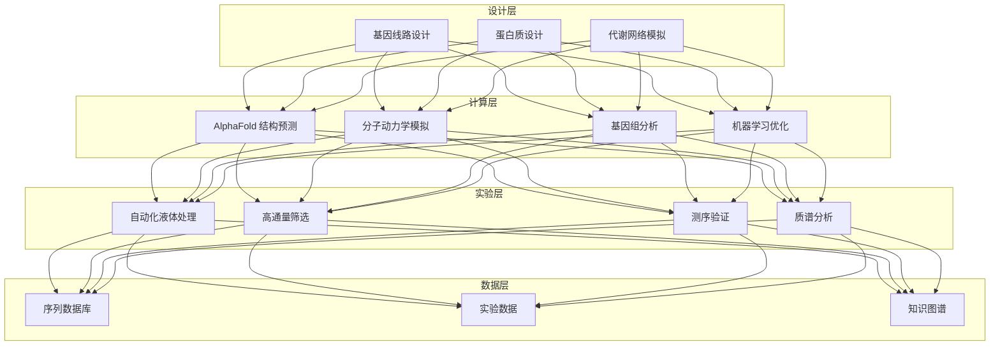

# 合成生物学架构设计 — 阿里云视角

> **适用版本**: Kubernetes v1.29 - v1.33 | **最后更新**: 2026-04-24
> **作者**: 阿里云解决方案架构师 | **标签**: `#合成生物学` `#基因设计` `#生物制造` `#阿里云`

---

## 目录

1. [行业背景](#1-行业背景)
2. [业务架构](#2-业务架构)
3. [技术架构](#3-技术架构)
4. [核心数据流](#4-核心数据流)
5. [安全与合规](#5-安全与合规)
6. [可观测性](#6-可观测性)
7. [阿里云组件映射](#7-阿里云组件映射)
8. [生产检查清单](#8-生产检查清单)

---

## 1. 行业背景

### 1.1 业务特点

合成生物学通过工程化设计改造生物系统：

| 挑战 | 说明 | 架构影响 |
|:---|:---|:---|
| 数据爆炸 | 基因测序数据指数增长 | 高性能存储 |
| 计算密集 | 蛋白质折叠/分子模拟 | GPU 集群 |
| 实验自动化 | 液相机器人高通量筛选 | 设备 IoT |
| 知识图谱 | 生物元件标准化 | 图数据库 |
| 生物安全 | 基因编辑伦理风险 | 权限管控 |

### 1.2 核心场景

- **基因设计**: DNA 序列设计与优化
- **蛋白质工程**: 结构预测与改造
- **代谢工程**: 菌株构建与优化
- **自动化实验**: 高通量筛选平台
- **生物信息学**: 基因组数据分析

---

## 2. 业务架构

### 2.1 合成生物学全景架构



---

## 3. 技术架构

### 3.1 K8s 部署

```yaml
# 蛋白质结构预测 GPU Job
apiVersion: batch/v1
kind: Job
metadata:
  name: alphafold-prediction
  namespace: synthetic-biology
spec:
  template:
    spec:
      nodeSelector:
        accelerator: nvidia-a100
      runtimeClassName: nvidia
      containers:
        - name: alphafold
          image: registry.cn-hangzhou.aliyuncs.com/synbio/alphafold:v2.3.0-gpu
          command: ["python", "run_alphafold.py"]
          args:
            - "--fasta_paths=/input/sequence.fasta"
            - "--output_dir=/output"
          resources:
            requests:
              nvidia.com/gpu: 1
              memory: "128Gi"
              cpu: "32000m"
            limits:
              nvidia.com/gpu: 1
              memory: "256Gi"
              cpu: "64000m"
          volumeMounts:
            - name: genetic-database
              mountPath: /data
            - name: input-sequence
              mountPath: /input
            - name: output-structure
              mountPath: /output
      volumes:
        - name: genetic-database
          persistentVolumeClaim:
            claimName: genetic-db-pvc
        - name: input-sequence
          persistentVolumeClaim:
            claimName: input-seq-pvc
        - name: output-structure
          persistentVolumeClaim:
            claimName: output-struct-pvc
      restartPolicy: Never
```

---

## 4. 核心数据流

### 4.1 设计-构建-测试-学习循环


---

## 5. 安全与合规

- **生物安全**: 基因编辑伦理审查
- **数据安全**: 基因数据保密
- **实验室安全**: 生物安全等级合规

---

## 6. 可观测性

- **结构预测**: 准确率 > 90%
- **实验通量**: 每日数千样本
- **计算效率**: GPU 利用率 > 80%

---

## 7. 阿里云组件映射

| 功能域 | **阿里云云原生方案** |
|:---|:---|
| 容器平台 | **ACK Pro + GPU** |
| GPU | **GN10/GN7 实例** |
| 高性能计算 | **E-HPC** |
| 对象存储 | **OSS** |
| 数据库 | **PolarDB** |
| AI | **PAI** |
| 可观测性 | **ARMS + SLS** |

---

## 8. 生产检查清单

- [ ] 基因序列设计准确性
- [ ] 蛋白质结构预测验证
- [ ] 高通量实验稳定性
- [ ] 基因数据隐私保护
- [ ] 生物安全伦理审批

---

**维护者**: 阿里云解决方案架构师团队 | **许可证**: MIT
