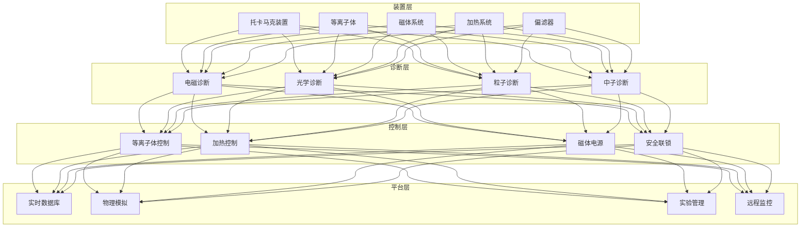
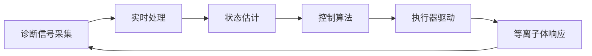

# 可控核聚变监控架构设计 — 阿里云视角

> **适用版本**: Kubernetes v1.29 - v1.33 | **最后更新**: 2026-04-24
> **作者**: 阿里云解决方案架构师 | **标签**: `#可控核聚变` `#托卡马克` `#等离子体` `#阿里云`

---

## 目录

1. [行业背景](#1-行业背景)
2. [业务架构](#2-业务架构)
3. [技术架构](#3-技术架构)
4. [核心数据流](#4-核心数据流)
5. [安全与合规](#5-安全与合规)
6. [可观测性](#6-可观测性)
7. [阿里云组件映射](#7-阿里云组件映射)
8. [生产检查清单](#8-生产检查清单)

---

## 1. 行业背景

### 1.1 业务特点

可控核聚变是人类终极能源，需要精确的等离子体控制：

| 挑战 | 说明 | 架构影响 |
|:---|:---|:---|
| 极端环境 | 上亿度等离子体 | 传感器耐辐射 |
| 实时控制 | 毫秒级反馈控制 | 边缘计算 + FPGA |
| 多物理场 | 电磁/流体/热耦合 | 高性能模拟 |
| 安全第一 | 中子辐射防护 | 多重冗余监控 |
| 长脉冲运行 | 持续放电数小时 | 高可用系统 |

### 1.2 核心场景

- **等离子体控制**: 位形/稳定性/密度控制
- **加热系统**: 中性束/射频波加热
- **偏滤器监测**: 热负荷/粒子流监测
- **真空系统**: 真空度/壁条件监测
- **中子测量**: 聚变功率诊断

---

## 2. 业务架构

### 2.1 可控核聚变监控全景架构



---

## 3. 技术架构

### 3.1 K8s 部署

```yaml
# 等离子体控制边缘 DaemonSet
apiVersion: apps/v1
kind: DaemonSet
metadata:
  name: plasma-control-edge
  namespace: fusion-energy
spec:
  selector:
    matchLabels:
      app: plasma-control-edge
  template:
    metadata:
      labels:
        app: plasma-control-edge
    spec:
      hostNetwork: true
      nodeSelector:
        node-type: fusion-control
      tolerations:
        - key: "dedicated"
          operator: "Equal"
          value: "fusion"
          effect: "NoSchedule"
      containers:
        - name: controller
          image: registry.cn-hangzhou.aliyuncs.com/fusion/plasma-ctrl:v1.0.0
          env:
            - name: CONTROL_CYCLE_US
              value: "100"
            - name: SAFETY_INTERLOCK
              value: "enabled"
          resources:
            requests:
              memory: "2Gi"
              cpu: "2000m"
            limits:
              memory: "4Gi"
              cpu: "4000m"
```

---

## 4. 核心数据流

### 4.1 等离子体放电控制



---

## 5. 安全与合规

- **核安全**: 辐射防护/中子屏蔽
- **功能安全**: 安全联锁系统
- **数据安全**: 聚变实验数据保密

---

## 6. 可观测性

- **控制周期**: < 1ms
- **诊断采样**: > 1MHz
- **系统可用性**: 99.99%

---

## 7. 阿里云组件映射

| 功能域 | **阿里云云原生方案** |
|:---|:---|
| 容器平台 | **ACK Edge** |
| 时序数据库 | **Lindorm** |
| 数据库 | **PolarDB** |
| 高性能计算 | **E-HPC** |
| AI | **PAI** |
| 可观测性 | **ARMS + SLS** |

---

## 8. 生产检查清单

- [ ] 等离子体控制实时性 < 1ms
- [ ] 安全联锁系统可靠性
- [ ] 辐射监测系统校准
- [ ] 诊断数据完整性
- [ ] 核安全合规审计

---

**维护者**: 阿里云解决方案架构师团队 | **许可证**: MIT
