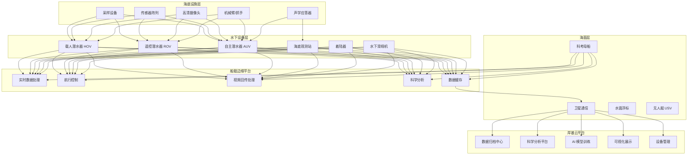
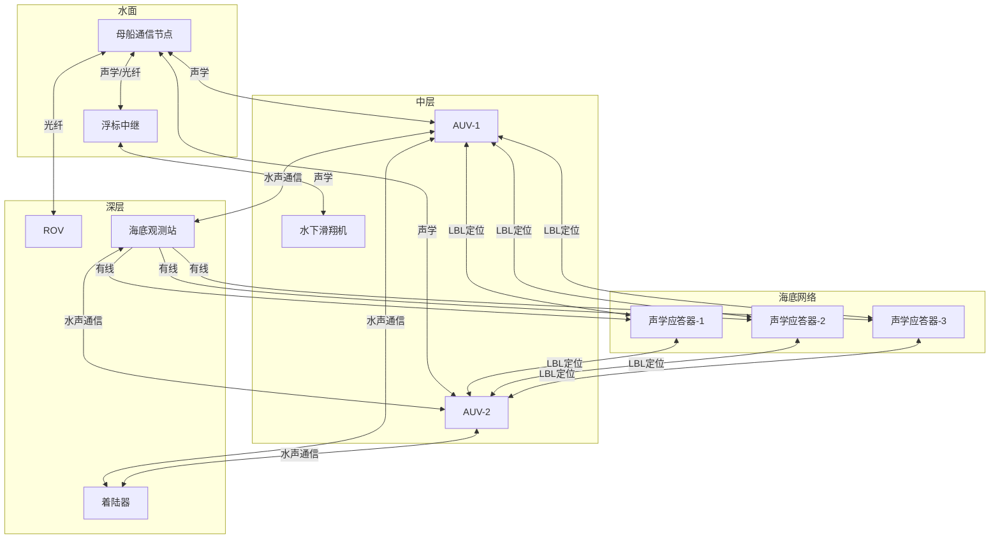
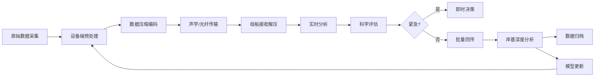

# 深海探测架构设计 — 阿里云视角

> **适用版本**: Kubernetes v1.29 - v1.33 | **最后更新**: 2026-04-24
> **作者**: 阿里云解决方案架构师 | **标签**: `#深海探测` `#水下通信` `#ROV` `#AUV` `#阿里云`

---

## 目录

1. [概述](#1-概述)
2. [设计原则](#2-设计原则)
3. [架构模式](#3-架构模式)
4. [实现示例](#4-实现示例)
5. [在 Kubernetes 上的部署](#5-在-kubernetes-上的部署)
6. [最佳实践](#6-最佳实践)
7. [反模式](#7-反模式)
8. [参考资源](#8-参考资源)

---

## 1. 概述

深海探测是人类探索地球最后边疆的关键手段。地球表面约 70% 被海洋覆盖，而深度超过 6000 米的深海区域（海沟、深海盆地）约占海洋面积的 1.1%，这些区域蕴藏着丰富的矿产资源、独特的生物资源和重要的科学数据。

深海探测的技术挑战极为严峻：万米深海压力超过 1000 个大气压（约 110MPa）；电磁波在水中衰减极快，传统无线通信不可用；GPS 信号无法穿透水体，水下导航依赖惯性导航和声学定位；深海供电极为困难，设备需要长时间自主运行；海底到水面的数据传输带宽极低（声学通信通常仅 kbps 级）。

从信息系统角度看，深海探测是一个典型的极端环境分布式系统。其核心架构挑战在于：如何在通信受限、计算受限、能源受限的环境下，实现设备协同、数据处理和科学决策。云边端协同架构是深海探测信息系统的自然选择：端侧（深海设备）负责数据采集和基础处理，边侧（科考船/浮标）负责实时分析和决策支持，云侧（岸基中心）负责数据归档、深度分析和模型训练。

### 1.1 行业背景

| 挑战 | 说明 | 架构影响 |
|:---|:---|:---|
| 高压环境 | 万米深海 1000+ 大气压 | 耐压设备 + 密封设计 |
| 通信困难 | 水下电磁波衰减快 | 声通信 + 光纤 + 延迟容忍 |
| 能源限制 | 深海供电困难 | 低功耗设计 + 能源管理 |
| 导航困难 | GPS 水下不可用 | 惯性导航 + 声学定位 |
| 数据回传 | 海量数据低带宽传输 | 边缘压缩 + 增量同步 |

### 1.2 核心场景

- **载人潜水器（HOV）**: 深海科考采样，支持 3-6 名科学家在深海工作
- **遥控潜水器（ROV）**: 通过脐带缆连接母船，实时遥控操作
- **自主潜水器（AUV）**: 自主航行，按预定任务执行探测
- **海底观测网**: 海底长期部署的传感器网络，原位持续观测
- **资源勘探**: 多金属结核、富钴结壳、天然气水合物勘探

---

## 2. 设计原则

### 2.1 延迟容忍原则

深海通信带宽极低且不稳定（声学通信通常 1-50kbps，受海洋环境噪声和传播延迟影响），系统设计必须采用延迟容忍网络（DTN，Delay-Tolerant Networking）的思想。数据采用"存储-携带-转发"模式，设备在通信窗口内尽可能多地传输数据，在通信中断期间本地缓存，等待下次通信机会。

### 2.2 自主容错原则

深海设备一旦部署，维护成本极高。系统设计需要高度自主和容错：AUV 需要自主避障和应急上浮能力；海底观测网需要故障自检测和冗余切换能力；所有设备需要看门狗和自动重启机制。软件系统需要防御性编程，对硬件故障、通信中断、数据异常等场景有完善的处理逻辑。

### 2.3 边缘优先原则

受限于通信带宽，深海数据的处理遵循"边缘优先"原则：在设备端和科考船端完成尽可能多的数据处理，只将处理结果和关键原始数据传回岸基中心。AI 模型轻量化部署在 AUV 和 ROV 上，实现目标识别、异常检测等实时分析。

### 2.4 数据保护原则

深海探测数据采集成本极高（单次科考航次费用数百万元），数据是宝贵的科学资产。系统设计需要建立完善的数据保护机制：设备端多重备份、传输过程断点续传、接收端立即归档、云端长期保存和异地容灾。

---

## 3. 架构模式

### 3.1 深海探测系统全景架构



### 3.2 水下通信组网架构



### 3.3 深海数据处理流水线



---

## 4. 实现示例

### 4.1 AUV 航迹规划与避障

```python
import numpy as np
from heapq import heappush, heappop
from dataclasses import dataclass
from typing import List, Tuple, Optional

@dataclass
class Position:
    x: float
    y: float
    z: float

@dataclass
class Obstacle:
    center: Position
    radius: float

class AUVPathPlanner:
    def __init__(self, bounds: Tuple[float, float, float],
                 resolution: float = 5.0):
        self.bounds = bounds
        self.resolution = resolution
        self.obstacles: List[Obstacle] = []
        self.current_pos: Optional[Position] = None
        self.current_heading: float = 0.0

    def add_obstacle(self, obstacle: Obstacle):
        self.obstacles.append(obstacle)

    def add_bathymetry_data(self, depth_grid: np.ndarray):
        rows, cols = depth_grid.shape
        for i in range(rows):
            for j in range(cols):
                if depth_grid[i, j] > 0.8:
                    x = j * self.resolution
                    y = i * self.resolution
                    self.obstacles.append(Obstacle(
                        center=Position(x, y, 0),
                        radius=self.resolution * 1.5,
                    ))

    def plan_path(self, start: Position, goal: Position) -> List[Position]:
        grid_size = (
            int(self.bounds[0] / self.resolution),
            int(self.bounds[1] / self.resolution),
        )

        start_grid = self._to_grid(start)
        goal_grid = self._to_grid(goal)

        path_grid = self._astar(start_grid, goal_grid, grid_size)
        if path_grid is None:
            return self._emergency_path(start)

        return [self._to_world(p) for p in path_grid]

    def _astar(self, start, goal, grid_size) -> Optional[List[Tuple[int, int]]]:
        open_set = [(0, start)]
        came_from = {}
        g_score = {start: 0}

        while open_set:
            _, current = heappop(open_set)

            if current == goal:
                path = []
                while current in came_from:
                    path.append(current)
                    current = came_from[current]
                path.append(start)
                path.reverse()
                return path

            for neighbor in self._get_neighbors(current, grid_size):
                tentative_g = g_score[current] + self._move_cost(current, neighbor)
                if tentative_g < g_score.get(neighbor, float('inf')):
                    came_from[neighbor] = current
                    g_score[neighbor] = tentative_g
                    f = tentative_g + self._heuristic(neighbor, goal)
                    heappush(open_set, (f, neighbor))

        return None

    def _get_neighbors(self, pos, grid_size) -> List[Tuple[int, int]]:
        neighbors = []
        for dx in [-1, 0, 1]:
            for dy in [-1, 0, 1]:
                if dx == 0 and dy == 0:
                    continue
                nx, ny = pos[0] + dx, pos[1] + dy
                if 0 <= nx < grid_size[0] and 0 <= ny < grid_size[1]:
                    world = self._to_world((nx, ny))
                    if not self._in_obstacle(world):
                        neighbors.append((nx, ny))
        return neighbors

    def _in_obstacle(self, pos: Position) -> bool:
        for obs in self.obstacles:
            dist = np.sqrt((pos.x - obs.center.x)**2 +
                           (pos.y - obs.center.y)**2)
            if dist < obs.radius:
                return True
        return False

    def _heuristic(self, a, b):
        return np.sqrt((a[0]-b[0])**2 + (a[1]-b[1])**2)

    def _move_cost(self, a, b):
        return self._heuristic(a, b)

    def _to_grid(self, pos: Position) -> Tuple[int, int]:
        return (int(pos.x / self.resolution), int(pos.y / self.resolution))

    def _to_world(self, grid: Tuple[int, int]) -> Position:
        return Position(grid[0] * self.resolution, grid[1] * self.resolution, 0)

    def _emergency_path(self, start: Position) -> List[Position]:
        return [start, Position(start.x, start.y, start.z - 50)]
```

### 4.2 水声通信数据压缩

```python
import zlib
import struct
from typing import Tuple

class HydroacousticDataCompressor:
    def __init__(self, max_packet_bytes: int = 256):
        self.max_packet = max_packet_bytes
        self.sequence = 0

    def compress_sensor_data(self, sensor_readings: list) -> list:
        payloads = []
        buffer = b''
        for reading in sensor_readings:
            data = self._serialize(reading)
            if len(buffer) + len(data) > self.max_packet - 10:
                payloads.append(self._make_packet(buffer))
                buffer = data
            else:
                buffer += data

        if buffer:
            payloads.append(self._make_packet(buffer))

        return payloads

    def _serialize(self, reading: dict) -> bytes:
        fmt = '<IffB'
        return struct.pack(fmt,
                           int(reading['timestamp'] * 1000),
                           reading['temperature'],
                           reading['pressure'],
                           len(str(reading.get('type', 'T'))))

    def _make_packet(self, data: bytes) -> bytes:
        self.sequence += 1
        compressed = zlib.compress(data, level=9)
        header = struct.pack('<HB', self.sequence, len(compressed))
        checksum = struct.pack('<H', self._crc16(compressed))
        return header + compressed + checksum

    def _crc16(self, data: bytes) -> int:
        crc = 0xFFFF
        for byte in data:
            crc ^= byte
            for _ in range(8):
                if crc & 1:
                    crc = (crc >> 1) ^ 0xA001
                else:
                    crc >>= 1
        return crc

    def decompress_sensor_data(self, packets: list) -> list:
        results = []
        for packet in packets:
            seq, payload_len = struct.unpack('<HB', packet[:3])
            compressed = packet[3:3 + payload_len]
            checksum = struct.unpack('<H', packet[3 + payload_len:])[0]
            if self._crc16(compressed) != checksum:
                continue
            data = zlib.decompress(compressed)
            results.extend(self._deserialize_batch(data))
        return results

    def _deserialize_batch(self, data: bytes) -> list:
        results = []
        offset = 0
        fmt = '<IffB'
        size = struct.calcsize(fmt)
        while offset + size <= len(data):
            ts_ms, temp, pressure, type_len = struct.unpack(fmt, data[offset:offset+size])
            results.append({
                'timestamp': ts_ms / 1000.0,
                'temperature': temp,
                'pressure': pressure,
            })
            offset += size
        return results
```

### 4.3 深海任务管理与调度

```go
package deepsea

import (
    "context"
    "fmt"
    "sync"
    "time"
)

type DeviceType string

const (
    DeviceHOV    DeviceType = "HOV"
    DeviceROV    DeviceType = "ROV"
    DeviceAUV    DeviceType = "AUV"
    DeviceLander DeviceType = "Lander"
    DeviceOBS    DeviceType = "OBS"
)

type Device struct {
    ID           string
    Type         DeviceType
    MaxDepth     int
    BatteryLevel float64
    Status       string
    LastContact  time.Time
    Position     Position
}

type DiveTask struct {
    ID          string
    TargetArea  string
    Depth       int
    Devices     []string
    Priority    int
    Duration    time.Duration
    DataBudget  int64
    Status      string
    SubmittedAt time.Time
}

type MissionPlanner struct {
    devices map[string]*Device
    tasks   []*DiveTask
    mu      sync.Mutex
}

func NewMissionPlanner() *MissionPlanner {
    return &MissionPlanner{
        devices: make(map[string]*Device),
    }
}

func (mp *MissionPlanner) RegisterDevice(d *Device) {
    mp.mu.Lock()
    defer mp.mu.Unlock()
    mp.devices[d.ID] = d
}

func (mp *MissionPlanner) AssignTask(task *DiveTask) error {
    mp.mu.Lock()
    defer mp.mu.Unlock()

    for _, deviceID := range task.Devices {
        device, ok := mp.devices[deviceID]
        if !ok {
            return fmt.Errorf("device %s not found", deviceID)
        }
        if device.MaxDepth < task.Depth {
            return fmt.Errorf("device %s max depth %dm < task depth %dm",
                deviceID, device.MaxDepth, task.Depth)
        }
        if device.BatteryLevel < 30.0 {
            return fmt.Errorf("device %s battery too low: %.1f%%",
                deviceID, device.BatteryLevel)
        }
        if device.Status != "idle" {
            return fmt.Errorf("device %s not idle: %s", deviceID, device.Status)
        }
    }

    for _, deviceID := range task.Devices {
        mp.devices[deviceID].Status = "diving"
    }
    task.Status = "assigned"

    go mp.executeDive(task)
    return nil
}

func (mp *MissionPlanner) executeDive(task *DiveTask) {
    ctx, cancel := context.WithTimeout(context.Background(), task.Duration)
    defer cancel()

    task.Status = "diving"

    select {
    case <-ctx.Done():
        if ctx.Err() == context.DeadlineExceeded {
            task.Status = "completed"
        } else {
            task.Status = "aborted"
        }
    }

    mp.mu.Lock()
    for _, deviceID := range task.Devices {
        if d, ok := mp.devices[deviceID]; ok {
            d.Status = "surfacing"
        }
    }
    mp.mu.Unlock()
}

func (mp *MissionPlanner) GetDeviceStatus(id string) (*Device, error) {
    mp.mu.Lock()
    defer mp.mu.Unlock()
    d, ok := mp.devices[id]
    if !ok {
        return nil, fmt.Errorf("device %s not found", id)
    }
    return d, nil
}
```

---

## 5. 在 Kubernetes 上的部署

### 5.1 科考船数据处理部署

```yaml
apiVersion: apps/v1
kind: Deployment
metadata:
  name: ship-data-processor
  namespace: deep-sea
  labels:
    app: ship-data-processor
    environment: ship-edge
spec:
  replicas: 3
  selector:
    matchLabels:
      app: ship-data-processor
  template:
    metadata:
      labels:
        app: ship-data-processor
    spec:
      nodeSelector:
        node-role: ship-compute
      tolerations:
        - key: "marine"
          operator: "Equal"
          value: "ship"
          effect: "NoSchedule"
      containers:
        - name: processor
          image: registry.cn-hangzhou.aliyuncs.com/deepsea/ship-processor:v2.0.0
          ports:
            - containerPort: 8080
          env:
            - name: COMPRESSION_RATIO
              value: "10"
            - name: SATELLITE_UPLINK
              value: "enabled"
            - name: LOCAL_STORAGE_GB
              value: "500"
            - name: BANDWIDTH_KBPS
              value: "64"
          resources:
            requests:
              memory: "4Gi"
              cpu: "2000m"
            limits:
              memory: "8Gi"
              cpu: "4000m"
          volumeMounts:
            - name: local-data
              mountPath: /data
      volumes:
        - name: local-data
          hostPath:
            path: /mnt/data
```

### 5.2 AUV 控制服务

```yaml
apiVersion: apps/v1
kind: Deployment
metadata:
  name: auv-controller
  namespace: deep-sea
spec:
  replicas: 2
  selector:
    matchLabels:
      app: auv-controller
  template:
    metadata:
      labels:
        app: auv-controller
    spec:
      containers:
        - name: controller
          image: registry.cn-hangzhou.aliyuncs.com/deepsea/auv-ctrl:v2.0.0
          ports:
            - containerPort: 8080
          env:
            - name: MAX_AUV_COUNT
              value: "10"
            - name: DEPTH_LIMIT_M
              value: "11000"
            - name: COMM_TIMEOUT_S
              value: "600"
          resources:
            requests:
              memory: "2Gi"
              cpu: "1000m"
            limits:
              memory: "4Gi"
              cpu: "2000m"
```

### 5.3 岸基数据归档中心

```yaml
apiVersion: apps/v1
kind: Deployment
metadata:
  name: shore-archive
  namespace: deep-sea
spec:
  replicas: 3
  selector:
    matchLabels:
      app: shore-archive
  template:
    metadata:
      labels:
        app: shore-archive
    spec:
      containers:
        - name: archive
          image: registry.cn-hangzhou.aliyuncs.com/deepsea/shore-archive:v2.0.0
          ports:
            - containerPort: 8080
          env:
            - name: OSS_BUCKET
              value: "deepsea-archive"
            - name: DB_HOST
              valueFrom:
                configMapKeyRef:
                  name: deepsea-config
                  key: db-host
          resources:
            requests:
              memory: "4Gi"
              cpu: "2000m"
            limits:
              memory: "8Gi"
              cpu: "4000m"
          volumeMounts:
            - name: archive-storage
              mountPath: /archive
      volumes:
        - name: archive-storage
          persistentVolumeClaim:
            claimName: archive-pvc
```

---

## 6. 最佳实践

### 6.1 通信优化

- **自适应压缩**: 根据当前通信带宽动态调整数据压缩率和分辨率，优先传输关键数据
- **断点续传**: 所有数据传输支持断点续传，通信中断后恢复时从断点继续
- **多路径冗余**: 关键数据同时通过水声通信和卫星通信两条路径传输
- **数据优先级**: 将数据分为紧急（告警/安全）、重要（目标发现）、一般（常规采样）三级

### 6.2 设备管理

- **电池预测**: 基于 AUV 历史能耗数据建立电池消耗模型，提前规划上浮时机
- **健康监测**: 实时监测设备舱内温度、湿度、压力，异常时自动告警
- **应急上浮**: AUV 配备独立的应急上浮系统（机械释放配重），即使软件失效也能上浮
- **定期自检**: AUV 在每个航段结束后执行系统自检，记录设备状态

### 6.3 数据管理

- **三副本归档**: 所有科学数据至少保存三份副本（船载、岸基、云端）
- **元数据标准**: 采用 CF（Climate and Forecast）标准描述海洋数据元数据
- **数据溯源**: 记录每条数据的完整采集链（设备ID、深度、时间、经纬度、处理步骤）

---

## 7. 反模式

### 7.1 实时回传所有原始数据

试图将所有深海采集的原始数据实时传回岸基中心。水声通信带宽仅 kbps 级，高清视频和声纳数据远超传输能力。

**解决方案**: 在设备端和母船端进行边缘处理，只传回处理结果（目标检测报告、采样记录）和少量关键原始数据。大量原始数据在母船本地存储，航次结束后带回。

### 7.2 单一导航方式

仅依赖惯性导航系统（INS）定位 AUV，长时间运行后累积误差增大。

**解决方案**: 组合导航——惯性导航+声学定位（LBL/USBL）+多普勒计程仪（DVL）+地形匹配。定期通过声学定位校正惯导漂移。

### 7.3 忽视耐压设计

将普通服务器硬件直接部署在深海设备中，忽视耐压和密封设计。

**解决方案**: 电子设备放置在耐压球形或圆柱形钛合金舱内，舱内充填氮气防止凝露。所有穿舱件（电缆连接器）采用高压密封设计。

### 7.4 单点故障

关键系统无冗余设计，单点故障导致整个任务失败。

**解决方案**: 关键系统（通信、导航、动力、生命支持）采用冗余设计。ROV 脐带缆配备备用缆。AUV 配备应急上浮系统。母船配备备用发电机。

### 7.5 忽视海洋环境保护

深海探测活动对脆弱的深海生态系统造成破坏。

**解决方案**: 遵守《联合国海洋法公约》和《深海矿产资源开发规章》，避让已知的深海生态敏感区。采样量最小化，废弃物全部回收。

---

## 8. 参考资源

### 8.1 阿里云组件映射

| 功能域 | **阿里云云原生方案** |
|:---|:---|
| 容器平台 | **ACK Pro + ACK Edge** |
| 对象存储 | **OSS + 归档存储** |
| 数据库 | **PolarDB + Lindorm** |
| AI 平台 | **PAI + 视觉智能** |
| 可观测性 | **ARMS + SLS** |
| IoT 平台 | **阿里云 IoT** |
| 卫星通信 | **卫星地面站服务** |

### 8.2 生产检查清单

- [ ] 耐压设备密封性验证（1.1x 最大工作压力）
- [ ] 水声通信稳定性测试（不同距离/深度）
- [ ] 生命支持系统可靠性（载人潜水器）
- [ ] 深海数据压缩效率（> 10x 压缩率）
- [ ] AUV 应急上浮系统功能测试
- [ ] 数据三副本归档机制验证
- [ ] 海洋环保合规审查

### 8.3 外部参考

- IMO（国际海事组织）— 深海探测规范
- ISA（国际海底管理局）— 深海矿产资源规章
- IEEE Journal of Oceanic Engineering — 海洋工程学术期刊
- WHOI（伍兹霍尔海洋研究所）— 深海探测技术参考
- DTN 协议标准 (RFC 4838) — 延迟容忍网络

---

**维护者**: 阿里云解决方案架构师团队 | **许可证**: MIT
