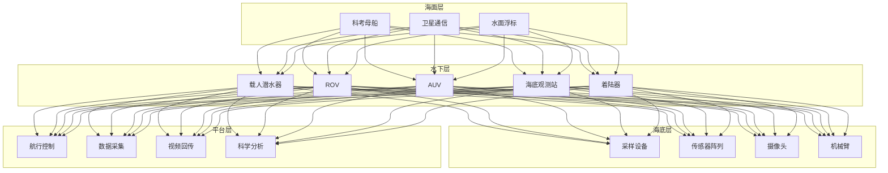
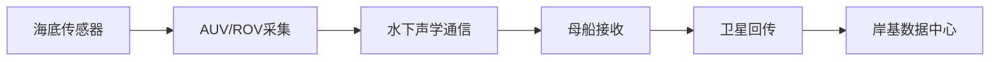

# 深海探测架构设计 — 阿里云视角

> **适用版本**: Kubernetes v1.29 - v1.33 | **最后更新**: 2026-04-24
> **作者**: 阿里云解决方案架构师 | **标签**: `#深海探测` `#水下通信` `#ROV` `#AUV` `#阿里云`

---

## 目录

1. [行业背景](#1-行业背景)
2. [业务架构](#2-业务架构)
3. [技术架构](#3-技术架构)
4. [核心数据流](#4-核心数据流)
5. [安全与合规](#5-安全与合规)
6. [可观测性](#6-可观测性)
7. [阿里云组件映射](#7-阿里云组件映射)
8. [生产检查清单](#8-生产检查清单)

---

## 1. 行业背景

### 1.1 业务特点

深海探测探索海洋最深处的未知世界：

| 挑战 | 说明 | 架构影响 |
|:---|:---|:---|
| 高压环境 | 万米深海 1000+ 大气压 | 耐压设备 + 密封 |
| 通信困难 | 水下电磁波衰减 | 声通信/光纤 |
| 能源限制 | 深海供电困难 | 高效能源管理 |
| 导航困难 | GPS 水下不可用 | 惯性/声学导航 |
| 数据回传 | 海量数据实时传输 | 边缘处理 + 压缩 |

### 1.2 核心场景

- **载人潜水器**: 深海科考/采样
- **ROV/AUV**: 无人遥控/自主潜水器
- **海底观测网**: 长期原位观测
- **资源勘探**: 矿产/油气/可燃冰
- **生物发现**: 深海生物样本采集

---

## 2. 业务架构

### 2.1 深海探测全景架构



---

## 3. 技术架构

### 3.1 K8s 部署

```yaml
# 科考船数据处理 Deployment
apiVersion: apps/v1
kind: Deployment
metadata:
  name: ship-data-processor
  namespace: deep-sea
spec:
  replicas: 3
  selector:
    matchLabels:
      app: ship-data-processor
  template:
    metadata:
      labels:
        app: ship-data-processor
    spec:
      containers:
        - name: processor
          image: registry.cn-hangzhou.aliyuncs.com/deepsea/ship-processor:v1.0.0
          ports:
            - containerPort: 8080
          env:
            - name: COMPRESSION_RATIO
              value: "10"
          resources:
            requests:
              memory: "4Gi"
              cpu: "2000m"
            limits:
              memory: "8Gi"
              cpu: "4000m"
```

---

## 4. 核心数据流

### 4.1 深海数据回传



---

## 5. 安全与合规

- **人员安全**: 潜水器生命支持系统
- **设备安全**: 耐压壳体完整性
- **海洋环保**: 深海生态保护

---

## 6. 可观测性

- **通信速率**: 水下 > 10kbps
- **定位精度**: < 10m
- **数据完整性**: > 99%

---

## 7. 阿里云组件映射

| 功能域 | **阿里云云原生方案** |
|:---|:---|
| 容器平台 | **ACK Pro** |
| 对象存储 | **OSS** |
| 数据库 | **PolarDB** |
| AI | **PAI / 视觉智能** |
| 可观测性 | **ARMS + SLS** |

---

## 8. 生产检查清单

- [ ] 耐压设备密封性验证
- [ ] 水下通信稳定性测试
- [ ] 生命支持系统可靠性
- [ ] 深海数据压缩效率
- [ ] 海洋环保合规

---

**维护者**: 阿里云解决方案架构师团队 | **许可证**: MIT
