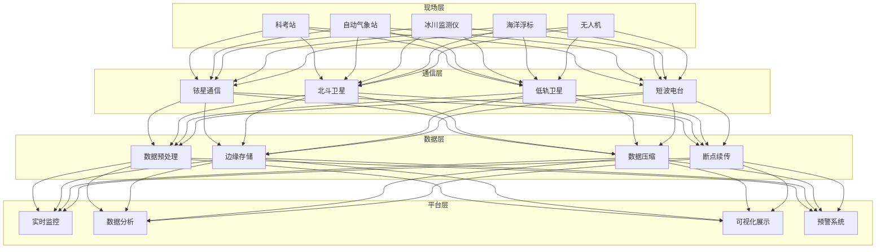
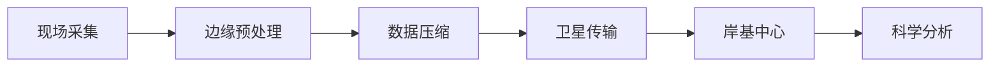

# 极地科考架构设计 — 阿里云视角

> **适用版本**: Kubernetes v1.29 - v1.33 | **最后更新**: 2026-04-24
> **作者**: 阿里云解决方案架构师 | **标签**: `#极地科考` `#冰川监测` `#南极北极` `#阿里云`

---

## 目录

1. [行业背景](#1-行业背景)
2. [业务架构](#2-业务架构)
3. [技术架构](#3-技术架构)
4. [核心数据流](#4-核心数据流)
5. [安全与合规](#5-安全与合规)
6. [可观测性](#6-可观测性)
7. [阿里云组件映射](#7-阿里云组件映射)
8. [生产检查清单](#8-生产检查清单)

---

## 1. 行业背景

### 1.1 业务特点

极地科考面临极端环境挑战，需要高度可靠的系统支撑：

| 挑战 | 说明 | 架构影响 |
|:---|:---|:---|
| 极端低温 | -80°C 极寒环境 | 工业级耐寒设备 |
| 网络受限 | 卫星带宽有限 | 边缘计算 + 压缩 |
| 能源稀缺 | 极地发电困难 | 低功耗设计 |
| 人员安全 | 孤立无援环境 | 实时定位/通信 |
| 数据珍贵 | 采集成本高 | 多重备份 |

### 1.2 核心场景

- **冰川监测**: 冰川运动/厚度/温度
- **气象观测**: 极地气候长期观测
- **生态研究**: 企鹅/海豹/磷虾监测
- **天文观测**: 南极天文望远镜
- **海洋调查**: 冰下海洋环境探测

---

## 2. 业务架构

### 2.1 极地科考全景架构



---

## 3. 技术架构

### 3.1 K8s 部署

```yaml
# 科考站边缘计算 DaemonSet
apiVersion: apps/v1
kind: DaemonSet
metadata:
  name: polar-edge-compute
  namespace: polar-research
spec:
  selector:
    matchLabels:
      app: polar-edge-compute
  template:
    metadata:
      labels:
        app: polar-edge-compute
    spec:
      nodeSelector:
        node-type: polar-station
      tolerations:
        - key: "extreme-cold"
          operator: "Exists"
          effect: "NoSchedule"
      containers:
        - name: edge
          image: registry.cn-hangzhou.aliyuncs.com/polar/edge-compute:v1.0.0
          env:
            - name: SATELLITE_LINK
              value: "iridium"
            - name: BUFFER_SIZE_MB
              value: "1024"
          resources:
            requests:
              memory: "512Mi"
              cpu: "250m"
            limits:
              memory: "1Gi"
              cpu: "500m"
```

---

## 4. 核心数据流

### 4.1 极地数据回传



---

## 5. 安全与合规

- **人员安全**: 极端环境生命保障
- **数据安全**: 珍贵科考数据备份
- **环境保护**: 南极条约环保要求

---

## 6. 可观测性

- **数据传输**: 每日定时回传
- **设备状态**: 远程监控
- **人员定位**: 实时追踪

---

## 7. 阿里云组件映射

| 功能域 | **阿里云云原生方案** |
|:---|:---|
| 容器平台 | **ACK Edge** |
| 对象存储 | **OSS** |
| 数据库 | **PolarDB** |
| 可观测性 | **ARMS + SLS** |
| AI | **PAI** |

---

## 8. 生产检查清单

- [ ] 耐寒设备 -40°C 测试
- [ ] 卫星通信链路稳定性
- [ ] 低功耗模式验证
- [ ] 数据多重备份机制
- [ ] 人员紧急救援通信

---

**维护者**: 阿里云解决方案架构师团队 | **许可证**: MIT
