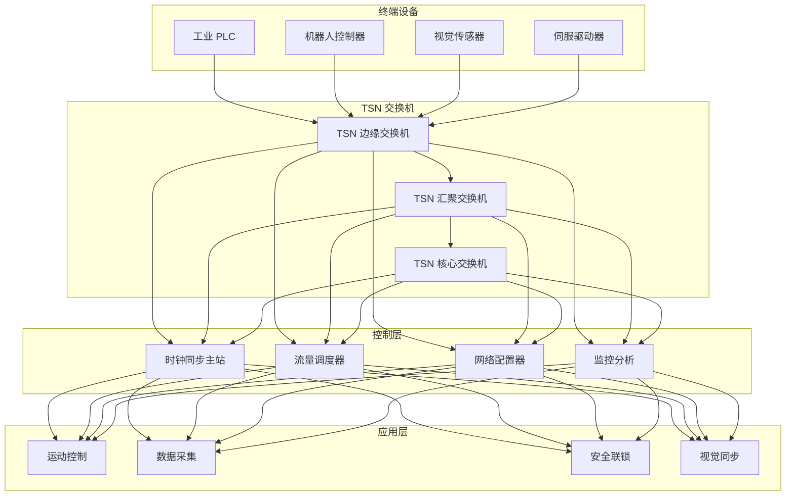
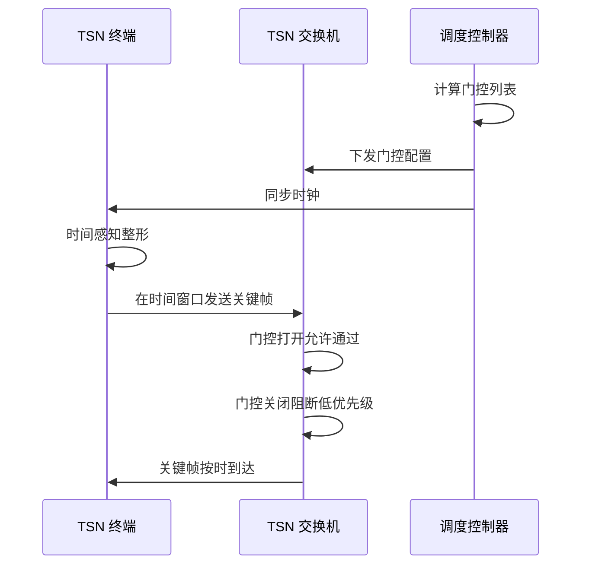
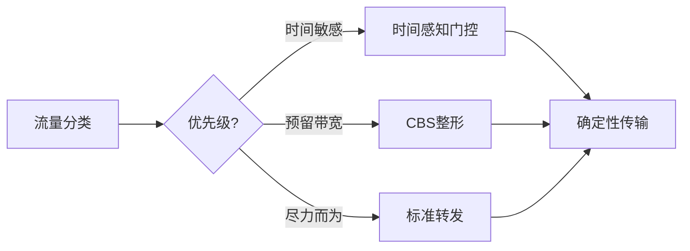

# 时间敏感网络 TSN 架构设计 — 阿里云视角

> **适用版本**: Kubernetes v1.29 - v1.33 | **最后更新**: 2026-04-24
> **作者**: 阿里云解决方案架构师 | **标签**: `#TSN` `#时间敏感网络` `#确定性网络` `#工业互联网` `#阿里云`

---

## 目录

1. [行业背景](#1-行业背景)
2. [业务架构](#2-业务架构)
3. [技术架构](#3-技术架构)
4. [核心数据流](#4-核心数据流)
5. [安全与合规](#5-安全与合规)
6. [可观测性](#6-可观测性)
7. [阿里云组件映射](#7-阿里云组件映射)
8. [生产检查清单](#8-生产检查清单)

---

## 1. 行业背景

### 1.1 业务特点

TSN（Time-Sensitive Networking）在标准以太网上实现确定性传输：

| 挑战 | 说明 | 架构影响 |
|:---|:---|:---|
| 确定性延迟 | 微秒级传输时延 | 时钟同步 + 流量整形 |
| 零丢包 | 关键控制帧不丢失 | 门控调度 |
| 时间同步 | 全网纳秒级同步 | IEEE 1588 PTP |
| 混合流量 | 实时/非实时共存 | 流量分类 |
| 与传统兼容 | 逐步升级现有网络 | 桥接互通 |

### 1.2 核心场景

- **工业控制**: PLC/机器人实时控制
- **汽车网络**: 车载以太网确定性通信
- **音视频传输**: 专业音视频实时传输
- **智能电网**: 保护装置通信
- **航空航天**: 机载确定性网络

---

## 2. 业务架构

### 2.1 TSN 网络全景架构



### 2.2 TSN 门控调度时序



---

## 3. 技术架构

### 3.1 K8s 部署

```yaml
# TSN 网络管理 Deployment
apiVersion: apps/v1
kind: Deployment
metadata:
  name: tsn-network-manager
  namespace: tsn-network
spec:
  replicas: 3
  selector:
    matchLabels:
      app: tsn-network-manager
  template:
    metadata:
      labels:
        app: tsn-network-manager
    spec:
      hostNetwork: true
      containers:
        - name: manager
          image: registry.cn-hangzhou.aliyuncs.com/tsn/network-manager:v1.0.0
          ports:
            - containerPort: 8080
          env:
            - name: PTP_DOMAIN
              value: "0"
            - name: GATE_CONTROL_ENABLED
              value: "true"
          resources:
            requests:
              memory: "1Gi"
              cpu: "1000m"
            limits:
              memory: "2Gi"
              cpu: "2000m"
          securityContext:
            capabilities:
              add: ["NET_ADMIN", "NET_RAW"]
```

---

## 4. 核心数据流

### 4.1 TSN 流量调度



---

## 5. 安全与合规

- **网络安全**: 工控网络隔离
- **功能安全**: SIL 等级要求
- **时间安全**: 防时钟攻击

---

## 6. 可观测性

- **传输延迟**: < 1ms（有界）
- **时间同步精度**: < 100ns
- **丢包率**: 0%（关键流量）

---

## 7. 阿里云组件映射

| 功能域 | **阿里云云原生方案** |
|:---|:---|
| 容器平台 | **ACK Edge** |
| 网络 | **阿里云 TSN 网关** |
| 时序数据库 | **Lindorm** |
| 数据库 | **PolarDB** |
| 可观测性 | **ARMS + SLS** |

---

## 8. 生产检查清单

- [ ] PTP 时钟同步精度 < 100ns
- [ ] 门控调度零丢包验证
- [ ] 最坏传输时延计算
- [ ] 与传统以太网互通测试
- [ ] 工控安全隔离合规

---

**维护者**: 阿里云解决方案架构师团队 | **许可证**: MIT
