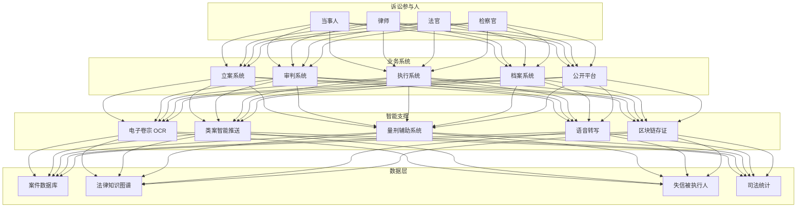

# 司法科技架构设计 — 阿里云视角

> **适用版本**: Kubernetes v1.29 - v1.33 | **最后更新**: 2026-04-24
> **作者**: 阿里云解决方案架构师 | **标签**: `#司法科技` `#智慧法院` `#智能审判` `#LegalTech` `#阿里云`

---

## 目录

1. [行业背景](#1-行业背景)
2. [业务架构](#2-业务架构)
3. [技术架构](#3-技术架构)
4. [核心数据流](#4-核心数据流)
5. [安全与合规](#5-安全与合规)
6. [可观测性](#6-可观测性)
7. [阿里云组件映射](#7-阿里云组件映射)
8. [生产检查清单](#8-生产检查清单)

---

## 1. 行业背景

### 1.1 业务特点

司法科技通过数字化手段提升司法公正与效率：

| 挑战 | 说明 | 架构影响 |
|:---|:---|:---|
| 卷宗电子化 | 海量纸质卷宗数字化 | OCR + 结构化 |
| 审判智能化 | 类案推送/量刑辅助 | NLP + 知识图谱 |
| 执行难 | 被执行人财产查找 | 大数据联动 |
| 跨域立案 | 异地诉讼便民服务 | 协同平台 |
| 数据安全 | 司法数据高度敏感 | 加密 + 隔离 |

### 1.2 核心场景

- **智慧审判**: 电子卷宗/智能庭审/类案推送
- **智慧执行**: 网络查控/失信惩戒/财产处置
- **智慧服务**: 跨域立案/在线调解/司法公开
- **智慧管理**: 审判管理/质效评估/数据决策
- **区块链存证**: 电子证据/司法存证

---

## 2. 业务架构

### 2.1 司法科技全景架构



---

## 3. 技术架构

### 3.1 K8s 部署

```yaml
# 智能审判辅助 Deployment
apiVersion: apps/v1
kind: Deployment
metadata:
  name: intelligent-trial
  namespace: legaltech
spec:
  replicas: 3
  selector:
    matchLabels:
      app: intelligent-trial
  template:
    metadata:
      labels:
        app: intelligent-trial
    spec:
      containers:
        - name: trial
          image: registry.cn-hangzhou.aliyuncs.com/legal/intelligent-trial:v2.0.0
          ports:
            - containerPort: 8080
          env:
            - name: KNOWLEDGE_GRAPH_URL
              value: "http://legal-kg:8080"
            - name: CASE_SIMILARITY_THRESHOLD
              value: "0.85"
          resources:
            requests:
              memory: "4Gi"
              cpu: "2000m"
            limits:
              memory: "8Gi"
              cpu: "4000m"
```

---

## 4. 核心数据流

### 4.1 类案智能推送


---

## 5. 安全与合规

- **数据安全**: 司法数据绝对保密
- **等保三级**: 法院系统等级保护
- **密评合规**: 密码应用安全性评估

---

## 6. 可观测性

- **庭审转写**: 准确率 > 95%
- **类案推送**: 相关性 > 90%
- **系统可用性**: 99.99%

---

## 7. 阿里云组件映射

| 功能域 | **阿里云云原生方案** |
|:---|:---|
| 容器平台 | **ACK Pro** |
| AI | **PAI / NLP** |
| 区块链 | **蚂蚁链 BaaS** |
| 数据库 | **PolarDB** |
| 对象存储 | **OSS** |
| 可观测性 | **ARMS + SLS** |

---

## 8. 生产检查清单

- [ ] 电子卷宗 OCR 准确率 > 98%
- [ ] 类案推送相关性验证
- [ ] 区块链存证不可篡改
- [ ] 司法数据加密传输
- [ ] 等保三级/密评合规

---

**维护者**: 阿里云解决方案架构师团队 | **许可证**: MIT
