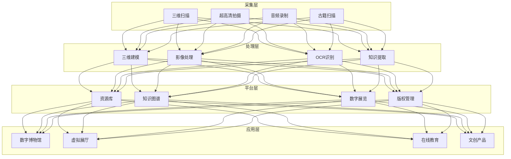
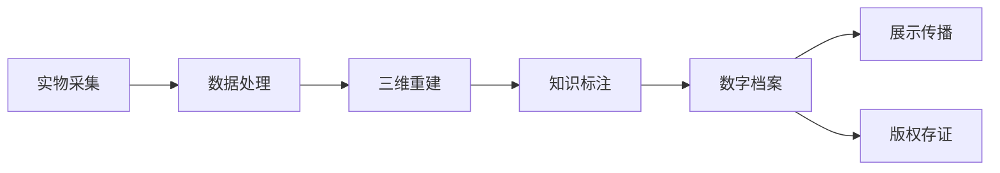

# 文化数字化架构设计 — 阿里云视角

> **适用版本**: Kubernetes v1.29 - v1.33 | **最后更新**: 2026-04-24
> **作者**: 阿里云解决方案架构师 | **标签**: `#文化数字化` `#数字博物馆` `#非遗` `#文物` `#阿里云`

---

## 目录

1. [行业背景](#1-行业背景)
2. [业务架构](#2-业务架构)
3. [技术架构](#3-技术架构)
4. [核心数据流](#4-核心数据流)
5. [安全与合规](#5-安全与合规)
6. [可观测性](#6-可观测性)
7. [阿里云组件映射](#7-阿里云组件映射)
8. [生产检查清单](#8-生产检查清单)

---

## 1. 行业背景

### 1.1 业务特点

文化数字化通过科技手段保护和传承文化遗产：

| 挑战 | 说明 | 架构影响 |
|:---|:---|:---|
| 海量资源 | 文物/古籍/非遗数字化 | 对象存储 + CDN |
| 高精度采集 | 三维扫描/超高清影像 | GPU 渲染 + 存储 |
| 知识关联 | 文物间关系挖掘 | 知识图谱 |
| 传播创新 | 数字展览/虚拟体验 | XR + 云渲染 |
| 版权保护 | 数字资产版权 | 区块链存证 |

### 1.2 核心场景

- **文物数字化**: 三维扫描/高清影像/数字档案
- **数字博物馆**: 线上展览/虚拟展厅
- **非遗传承**: 数字记录/技艺传承
- **古籍保护**: OCR 识别/知识挖掘
- **文化大数据**: 文化资源普查/分析

---

## 2. 业务架构

### 2.1 文化数字化全景架构



---

## 3. 技术架构

### 3.1 K8s 部署

```yaml
# 三维文物渲染 GPU Deployment
apiVersion: apps/v1
kind: Deployment
metadata:
  name: cultural-3d-render
  namespace: cultural-digitization
spec:
  replicas: 3
  selector:
    matchLabels:
      app: cultural-3d-render
  template:
    metadata:
      labels:
        app: cultural-3d-render
    spec:
      nodeSelector:
        accelerator: nvidia-a10
      runtimeClassName: nvidia
      containers:
        - name: render
          image: registry.cn-hangzhou.aliyuncs.com/culture/3d-render:v1.0.0-gpu
          ports:
            - containerPort: 8080
          env:
            - name: MODEL_FORMAT
              value: "gltf"
            - name: TEXTURE_QUALITY
              value: "4k"
          resources:
            requests:
              nvidia.com/gpu: 1
              memory: "16Gi"
              cpu: "8000m"
            limits:
              nvidia.com/gpu: 1
              memory: "32Gi"
              cpu: "16000m"
```

---

## 4. 核心数据流

### 4.1 文物数字化流程



---

## 5. 安全与合规

- **文物安全**: 数字化过程不损伤文物
- **版权保护**: 数字资产区块链存证
- **数据安全**: 文化资源数据保密

---

## 6. 可观测性

- **三维精度**: 微米级
- **渲染帧率**: > 30FPS
- **存储容量**: PB 级

---

## 7. 阿里云组件映射

| 功能域 | **阿里云云原生方案** |
|:---|:---|
| 容器平台 | **ACK Pro + GPU** |
| 对象存储 | **OSS + CDN** |
| AI | **PAI / 视觉智能** |
| 区块链 | **蚂蚁链 BaaS** |
| 数据库 | **PolarDB** |
| 可观测性 | **ARMS + SLS** |

---

## 8. 生产检查清单

- [ ] 三维扫描精度验证
- [ ] 古籍 OCR 准确率 > 95%
- [ ] 文物数字化无损检测
- [ ] 版权区块链存证完整
- [ ] 虚拟展厅并发承载

---

**维护者**: 阿里云解决方案架构师团队 | **许可证**: MIT
