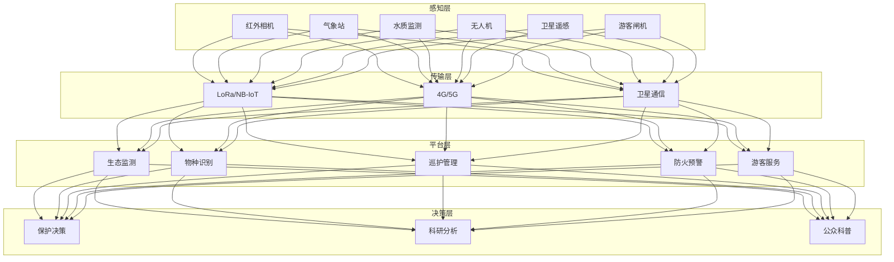
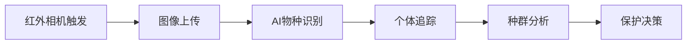

# 国家公园架构设计 — 阿里云视角

> **适用版本**: Kubernetes v1.29 - v1.33 | **最后更新**: 2026-04-24
> **作者**: 阿里云解决方案架构师 | **标签**: `#国家公园` `#生态保护` `#智慧巡护` `#阿里云`

---

## 目录

1. [行业背景](#1-行业背景)
2. [业务架构](#2-业务架构)
3. [技术架构](#3-技术架构)
4. [核心数据流](#4-核心数据流)
5. [安全与合规](#5-安全与合规)
6. [可观测性](#6-可观测性)
7. [阿里云组件映射](#7-阿里云组件映射)
8. [生产检查清单](#8-生产检查清单)

---

## 1. 行业背景

### 1.1 业务特点

国家公园是自然保护地体系的顶层设计，需要科技赋能生态保护：

| 挑战 | 说明 | 架构影响 |
|:---|:---|:---|
| 面积大 | 数万平方公里监测 | 卫星+无人机+地面 |
| 环境恶劣 | 高海拔/深林/湿地 | 边缘设备耐候 |
| 物种保护 | 珍稀动植物监测 | AI 识别 + 跟踪 |
| 防火防灾 | 森林火灾/地质灾害 | 实时预警 |
| 游客管理 | 生态旅游与保护平衡 | 预约/分流/监测 |

### 1.2 核心场景

- **生态监测**: 水质/空气/土壤/植被监测
- **野生动物监测**: 红外相机/声纹识别/无人机
- **智慧巡护**: 巡护轨迹/事件上报/应急调度
- **防火预警**: 卫星热点/视频监控/气象分析
- **游客服务**: 预约入园/导览/科普教育

---

## 2. 业务架构

### 2.1 国家公园全景架构



---

## 3. 技术架构

### 3.1 K8s 部署

```yaml
# 物种识别 AI Deployment
apiVersion: apps/v1
kind: Deployment
metadata:
  name: wildlife-recognition
  namespace: national-park
spec:
  replicas: 2
  selector:
    matchLabels:
      app: wildlife-recognition
  template:
    metadata:
      labels:
        app: wildlife-recognition
    spec:
      nodeSelector:
        accelerator: nvidia-t4
      runtimeClassName: nvidia
      containers:
        - name: recognizer
          image: registry.cn-hangzhou.aliyuncs.com/park/wildlife-recognition:v1.0.0-gpu
          ports:
            - containerPort: 8080
          env:
            - name: SPECIES_DATABASE
              value: "/data/species-db"
            - name: CONFIDENCE_THRESHOLD
              value: "0.8"
          resources:
            requests:
              nvidia.com/gpu: 1
              memory: "8Gi"
              cpu: "4000m"
            limits:
              nvidia.com/gpu: 1
              memory: "16Gi"
              cpu: "8000m"
```

---

## 4. 核心数据流

### 4.1 野生动物监测



---

## 5. 安全与合规

- **生态安全**: 监测不干扰野生动物
- **数据安全**: 生态数据保密
- **游客安全**: 灾害预警及时准确

---

## 6. 可观测性

- **物种识别**: 准确率 > 90%
- **火情预警**: 响应 < 5min
- **设备在线率**: > 95%

---

## 7. 阿里云组件映射

| 功能域 | **阿里云云原生方案** |
|:---|:---|
| 容器平台 | **ACK Edge** |
| IoT | **阿里云 IoT 平台** |
| AI | **PAI / 视觉智能** |
| 数据库 | **PolarDB + Lindorm** |
| 对象存储 | **OSS** |
| 可观测性 | **ARMS + SLS** |

---

## 8. 生产检查清单

- [ ] 物种识别模型准确率
- [ ] 火情预警误报率 < 5%
- [ ] 巡护设备耐候性测试
- [ ] 游客流量承载能力
- [ ] 生态数据隐私保护

---

**维护者**: 阿里云解决方案架构师团队 | **许可证**: MIT
