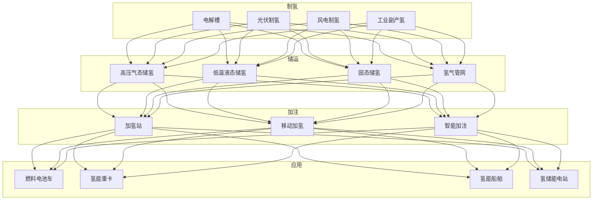
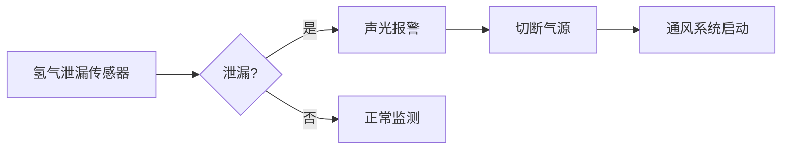

# 氢能源架构设计 — 阿里云视角

> **适用版本**: Kubernetes v1.29 - v1.33 | **最后更新**: 2026-04-24
> **作者**: 阿里云解决方案架构师 | **标签**: `#氢能源` `#制氢` `#储氢` `#燃料电池` `#阿里云`

---

## 目录

1. [行业背景](#1-行业背景)
2. [业务架构](#2-业务架构)
3. [技术架构](#3-技术架构)
4. [核心数据流](#4-核心数据流)
5. [安全与合规](#5-安全与合规)
6. [可观测性](#6-可观测性)
7. [阿里云组件映射](#7-阿里云组件映射)
8. [生产检查清单](#8-生产检查清单)

---

## 1. 行业背景

### 1.1 业务特点

氢能源是清洁能源转型的重要方向，覆盖制储运用全链条：

| 挑战 | 说明 | 架构影响 |
|:---|:---|:---|
| 安全风险 | 氢气易燃易爆 | 泄漏监测 + 安全联锁 |
| 效率优化 | 电解水制氢能耗 | AI 优化控制 |
| 储运困难 | 氢气密度低 | 高压/液态/固态储运 |
| 基础设施 | 加氢站网络建设 | 智能调度 |
| 产业链协同 | 制储运用协同 | 数据共享平台 |

### 1.2 核心场景

- **绿氢制备**: 光伏/风电电解水制氢
- **氢储运**: 高压气态/低温液态/固态储氢
- **加氢站**: 智能加氢/安全监控
- **燃料电池**: 电堆管理/性能优化
- **氢能车辆**: 重卡/公交/叉车氢能化

---

## 2. 业务架构

### 2.1 氢能源全景架构



---

## 3. 技术架构

### 3.1 K8s 部署

```yaml
# 电解槽控制边缘 DaemonSet
apiVersion: apps/v1
kind: DaemonSet
metadata:
  name: electrolyzer-controller
  namespace: hydrogen-energy
spec:
  selector:
    matchLabels:
      app: electrolyzer-controller
  template:
    metadata:
      labels:
        app: electrolyzer-controller
    spec:
      hostNetwork: true
      nodeSelector:
        node-type: hydrogen-station
      containers:
        - name: controller
          image: registry.cn-hangzhou.aliyuncs.com/h2/electrolyzer-ctrl:v1.0.0
          env:
            - name: H2_LEAK_THRESHOLD_PPM
              value: "1000"
            - name: SAFETY_INTERLOCK
              value: "enabled"
          resources:
            requests:
              memory: "1Gi"
              cpu: "1000m"
            limits:
              memory: "2Gi"
              cpu: "2000m"
```

---

## 4. 核心数据流

### 4.1 加氢站安全监控



---

## 5. 安全与合规

- **氢气安全**: 防爆/防泄漏/防静电
- **压力安全**: 高压设备定期检验
- **消防安全**: 氢气专用灭火系统

---

## 6. 可观测性

- **制氢效率**: 实时监测
- **储氢压力**: 实时监测
- **安全状态**: 24h 监控

---

## 7. 阿里云组件映射

| 功能域 | **阿里云云原生方案** |
|:---|:---|
| 容器平台 | **ACK Edge** |
| IoT | **阿里云 IoT 平台** |
| AI | **PAI** |
| 时序数据库 | **Lindorm** |
| 可观测性 | **ARMS + SLS** |

---

## 8. 生产检查清单

- [ ] 氢气泄漏检测灵敏度
- [ ] 安全联锁系统可靠性
- [ ] 加氢枪对接安全性
- [ ] 储氢容器定期检验
- [ ] 防爆区域电气合规

---

**维护者**: 阿里云解决方案架构师团队 | **许可证**: MIT
