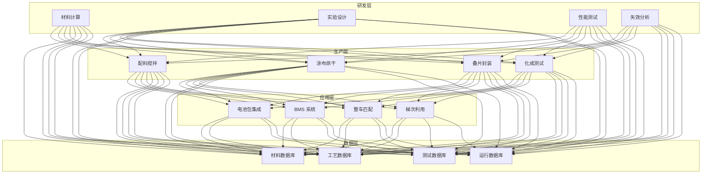
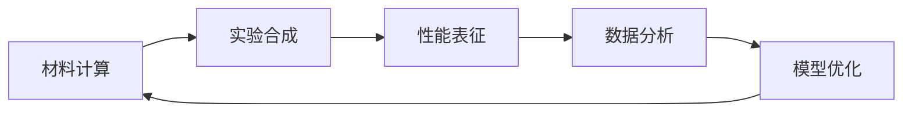

# 固态电池架构设计 — 阿里云视角

> **适用版本**: Kubernetes v1.29 - v1.33 | **最后更新**: 2026-04-24
> **作者**: 阿里云解决方案架构师 | **标签**: `#固态电池` `#电池研发` `#BMS` `#材料模拟` `#阿里云`

---

## 目录

1. [行业背景](#1-行业背景)
2. [业务架构](#2-业务架构)
3. [技术架构](#3-技术架构)
4. [核心数据流](#4-核心数据流)
5. [安全与合规](#5-安全与合规)
6. [可观测性](#6-可观测性)
7. [阿里云组件映射](#7-阿里云组件映射)
8. [生产检查清单](#8-生产检查清单)

---

## 1. 行业背景

### 1.1 业务特点

固态电池是下一代动力电池的核心方向：

| 挑战 | 说明 | 架构影响 |
|:---|:---|:---|
| 材料研发 | 固态电解质筛选 | AI + 分子模拟 |
| 界面问题 | 固-固界面阻抗 | 材料基因组 |
| 生产工艺 | 全固态制造难度大 | 产线数字化 |
| 安全管理 | 热失控预防 | BMS 实时监控 |
| 性能验证 | 长循环寿命测试 | 数据闭环 |

### 1.2 核心场景

- **材料设计**: 固态电解质/电极材料筛选
- **分子模拟**: DFT/MD 计算
- **中试产线**: 工艺参数优化
- **BMS 管理**: 状态估计/均衡控制
- **安全测试**: 针刺/挤压/过充测试

---

## 2. 业务架构

### 2.1 固态电池全景架构



---

## 3. 技术架构

### 3.1 K8s 部署

```yaml
# 材料模拟 GPU Job
apiVersion: batch/v1
kind: Job
metadata:
  name: dft-calculation-001
  namespace: solid-state-battery
spec:
  template:
    spec:
      nodeSelector:
        accelerator: nvidia-a100
      runtimeClassName: nvidia
      containers:
        - name: dft
          image: registry.cn-hangzhou.aliyuncs.com/battery/vasp:v6.4.0-gpu
          command: ["mpirun", "-np", "8", "vasp_std"]
          resources:
            requests:
              nvidia.com/gpu: 2
              memory: "128Gi"
              cpu: "32000m"
            limits:
              nvidia.com/gpu: 2
              memory: "256Gi"
              cpu: "64000m"
          volumeMounts:
            - name: input-potential
              mountPath: /input
            - name: output-results
              mountPath: /output
      volumes:
        - name: input-potential
          persistentVolumeClaim:
            claimName: dft-input-pvc
        - name: output-results
          persistentVolumeClaim:
            claimName: dft-output-pvc
      restartPolicy: Never
```

---

## 4. 核心数据流

### 4.1 电池研发数据闭环



---

## 5. 安全与合规

- **电池安全**: 热失控预防
- **实验安全**: 化学试剂管理
- **数据安全**: 核心配方保密

---

## 6. 可观测性

- **计算效率**: GPU 利用率 > 80%
- **实验进度**: 全流程跟踪
- **电池性能**: 循环寿命监测

---

## 7. 阿里云组件映射

| 功能域 | **阿里云云原生方案** |
|:---|:---|
| 容器平台 | **ACK Pro + GPU** |
| 高性能计算 | **E-HPC** |
| AI | **PAI** |
| 数据库 | **PolarDB** |
| 对象存储 | **OSS** |
| 可观测性 | **ARMS + SLS** |

---

## 8. 生产检查清单

- [ ] DFT 计算精度验证
- [ ] 材料合成可重复性
- [ ] 电池安全测试通过
- [ ] 核心配方数据隔离
- [ ] 实验安全规程合规

---

**维护者**: 阿里云解决方案架构师团队 | **许可证**: MIT
