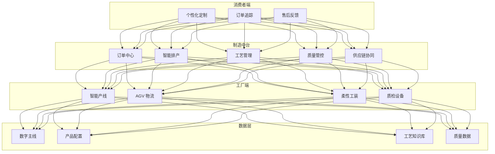
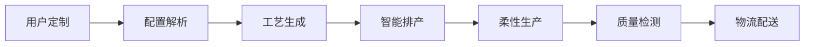

# 柔性制造架构设计 — 阿里云视角

> **适用版本**: Kubernetes v1.29 - v1.33 | **最后更新**: 2026-04-24
> **作者**: 阿里云解决方案架构师 | **标签**: `#柔性制造` `#大规模定制` `#数字主线` `#C2M` `#阿里云`

---

## 目录

1. [行业背景](#1-行业背景)
2. [业务架构](#2-业务架构)
3. [技术架构](#3-技术架构)
4. [核心数据流](#4-核心数据流)
5. [安全与合规](#5-安全与合规)
6. [可观测性](#6-可观测性)
7. [阿里云组件映射](#7-阿里云组件映射)
8. [生产检查清单](#8-生产检查清单)

---

## 1. 行业背景

### 1.1 业务特点

柔性制造实现大规模个性化定制生产：

| 挑战 | 说明 | 架构影响 |
|:---|:---|:---|
| 多品种小批量 | 订单碎片化 | 智能排产 |
| 快速换型 | 产线切换时间短 | 模块化设计 |
| 质量追溯 | 每件产品全追溯 | 数字主线 |
| 供应链协同 | 按需采购/生产 | 数据共享 |
| 客户参与 | C2M 个性化定制 | 设计工具链 |

### 1.2 核心场景

- **C2M 定制**: 消费者直接驱动生产
- **智能排产**: 订单聚合/产能优化
- **产线重构**: 模块化产线快速重组
- **数字主线**: 产品全生命周期数据
- **供应链协同**: 上下游数据打通

---

## 2. 业务架构

### 2.1 柔性制造全景架构



---

## 3. 技术架构

### 3.1 K8s 部署

```yaml
# 智能排产引擎 Deployment
apiVersion: apps/v1
kind: Deployment
metadata:
  name: smart-scheduler
  namespace: flexible-manufacturing
spec:
  replicas: 3
  selector:
    matchLabels:
      app: smart-scheduler
  template:
    metadata:
      labels:
        app: smart-scheduler
    spec:
      containers:
        - name: scheduler
          image: registry.cn-hangzhou.aliyuncs.com/mfg/smart-scheduler:v2.0.0
          ports:
            - containerPort: 8080
          env:
            - name: OPTIMIZATION_GOAL
              value: "makespan-min"
            - name: MAX_ORDERS_PER_BATCH
              value: "1000"
          resources:
            requests:
              memory: "4Gi"
              cpu: "2000m"
            limits:
              memory: "8Gi"
              cpu: "4000m"
```

---

## 4. 核心数据流

### 4.1 C2M 定制流程



---

## 5. 安全与合规

- **生产安全**: 柔性产线人机协作安全
- **数据安全**: 工艺知识保护
- **产品质量**: 定制化质量标准

---

## 6. 可观测性

- **换型时间**: < 30min
- **排产效率**: 利用率 > 85%
- **定制周期**: 缩短 50%

---

## 7. 阿里云组件映射

| 功能域 | **阿里云云原生方案** |
|:---|:---|
| 容器平台 | **ACK Pro** |
| AI | **PAI** |
| 数据库 | **PolarDB** |
| IoT | **阿里云 IoT 平台** |
| 可观测性 | **ARMS + SLS** |

---

## 8. 生产检查清单

- [ ] 产线换型时间达标
- [ ] 排产算法优化效果
- [ ] 定制产品质量一致性
- [ ] 供应链数据协同
- [ ] 工艺知识安全隔离

---

**维护者**: 阿里云解决方案架构师团队 | **许可证**: MIT
