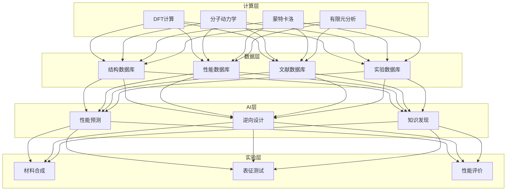
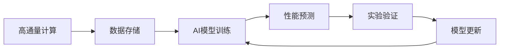

# 纳米材料架构设计 — 阿里云视角

> **适用版本**: Kubernetes v1.29 - v1.33 | **最后更新**: 2026-04-24
> **作者**: 阿里云解决方案架构师 | **标签**: `#纳米材料` `#材料基因组` `#分子模拟` `#高通量计算` `#阿里云`

---

## 目录

1. [行业背景](#1-行业背景)
2. [业务架构](#2-业务架构)
3. [技术架构](#3-技术架构)
4. [核心数据流](#4-核心数据流)
5. [安全与合规](#5-安全与合规)
6. [可观测性](#6-可观测性)
7. [阿里云组件映射](#7-阿里云组件映射)
8. [生产检查清单](#8-生产检查清单)

---

## 1. 行业背景

### 1.1 业务特点

纳米材料研究需要大量计算模拟与实验验证：

| 挑战 | 说明 | 架构影响 |
|:---|:---|:---|
| 多尺度模拟 | 从原子到宏观 | 计算集群 |
| 高通量筛选 | 材料组合爆炸 | 并行计算 |
| 实验验证 | 计算与实验闭环 | 数据管理 |
| 性能预测 | 构效关系建模 | AI/ML |
| 安全评估 | 纳米毒性评估 | 规范流程 |

### 1.2 核心场景

- **材料计算**: DFT/MD/有限元模拟
- **高通量筛选**: 自动化计算流水线
- **材料基因组**: 数据驱动材料发现
- **性能预测**: AI 预测材料性能
- **安全评估**: 纳米材料毒理学

---

## 2. 业务架构

### 2.1 纳米材料全景架构



---

## 3. 技术架构

### 3.1 K8s 部署

```yaml
# 高通量计算 Job
apiVersion: batch/v1
kind: Job
metadata:
  name: high-throughput-screening
  namespace: nanomaterials
spec:
  parallelism: 100
  template:
    spec:
      nodeSelector:
        accelerator: nvidia-a100
      runtimeClassName: nvidia
      containers:
        - name: screening
          image: registry.cn-hangzhou.aliyuncs.com/nano/ht-screening:v1.0.0-gpu
          env:
            - name: BATCH_SIZE
              value: "1000"
          resources:
            requests:
              nvidia.com/gpu: 1
              memory: "32Gi"
              cpu: "8000m"
            limits:
              nvidia.com/gpu: 1
              memory: "64Gi"
              cpu: "16000m"
      restartPolicy: OnFailure
```

---

## 4. 核心数据流

### 4.1 材料基因组流水线



---

## 5. 安全与合规

- **实验安全**: 纳米材料操作规范
- **数据安全**: 材料配方保密
- **环境安全**: 纳米废弃物处理

---

## 6. 可观测性

- **计算效率**: GPU 利用率 > 80%
- **预测准确率**: > 90%
- **实验通量**: 每日千组

---

## 7. 阿里云组件映射

| 功能域 | **阿里云云原生方案** |
|:---|:---|
| 容器平台 | **ACK Pro + GPU** |
| 高性能计算 | **E-HPC** |
| AI | **PAI** |
| 数据库 | **PolarDB** |
| 对象存储 | **OSS** |
| 可观测性 | **ARMS + SLS** |

---

## 8. 生产检查清单

- [ ] 计算模型精度验证
- [ ] 高通量计算稳定性
- [ ] AI 预测准确率达标
- [ ] 纳米材料安全评估
- [ ] 核心配方数据隔离

---

**维护者**: 阿里云解决方案架构师团队 | **许可证**: MIT
