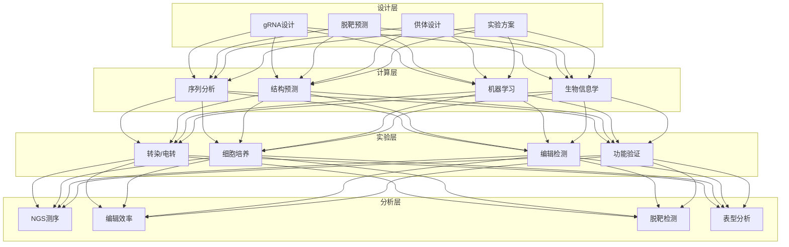

# 基因编辑 CRISPR 架构设计 — 阿里云视角

> **适用版本**: Kubernetes v1.29 - v1.33 | **最后更新**: 2026-04-24
> **作者**: 阿里云解决方案架构师 | **标签**: `#CRISPR` `#基因编辑` `#gRNA设计` `#脱靶检测` `#阿里云`

---

## 目录

1. [行业背景](#1-行业背景)
2. [业务架构](#2-业务架构)
3. [技术架构](#3-技术架构)
4. [核心数据流](#4-核心数据流)
5. [安全与合规](#5-安全与合规)
6. [可观测性](#6-可观测性)
7. [阿里云组件映射](#7-阿里云组件映射)
8. [生产检查清单](#8-生产检查清单)

---

## 1. 行业背景

### 1.1 业务特点

CRISPR 基因编辑是生命科学的核心工具：

| 挑战 | 说明 | 架构影响 |
|:---|:---|:---|
| gRNA 设计 | 高效特异的引导 RNA | AI 预测模型 |
| 脱靶检测 | 非预期编辑位点 | 全基因组测序 |
| 实验设计 | 复杂的多重编辑 | 自动化设计 |
| 数据分析 | 海量测序数据 | 生物信息学流水线 |
| 伦理合规 | 人类胚胎编辑限制 | 审批流程 |

### 1.2 核心场景

- **gRNA 设计**: 特异性/效率预测
- **脱靶分析**: 全基因组脱靶检测
- **细胞系构建**: 基因敲除/敲入
- **功能筛选**: CRISPR 文库筛选
- **基因治疗**: 体内/体外编辑

---

## 2. 业务架构

### 2.1 CRISPR 基因编辑全景架构



---

## 3. 技术架构

### 3.1 K8s 部署

```yaml
# 脱靶分析流水线 Job
apiVersion: batch/v1
kind: Job
metadata:
  name: off-target-analysis
  namespace: crispr
spec:
  template:
    spec:
      containers:
        - name: analysis
          image: registry.cn-hangzhou.aliyuncs.com/crispr/off-target:v1.0.0
          command: ["python", "analyze_offtarget.py"]
          env:
            - name: GUIDE_RNA
              value: "NGG"
            - name: GENOME_REF
              value: "hg38"
          resources:
            requests:
              memory: "32Gi"
              cpu: "16000m"
            limits:
              memory: "64Gi"
              cpu: "32000m"
          volumeMounts:
            - name: genome-ref
              mountPath: /ref
            - name: output
              mountPath: /output
      volumes:
        - name: genome-ref
          persistentVolumeClaim:
            claimName: genome-ref-pvc
        - name: output
          persistentVolumeClaim:
            claimName: crispr-output-pvc
      restartPolicy: Never
```

---

## 4. 核心数据流

### 4.1 gRNA 设计流水线


---

## 5. 安全与合规

- **生物安全**: 基因编辑实验规范
- **伦理审查**: 人类基因编辑限制
- **数据安全**: 基因数据保密

---

## 6. 可观测性

- **设计效率**: 候选 gRNA 产出量
- **脱靶率**: < 1%
- **编辑效率**: > 80%

---

## 7. 阿里云组件映射

| 功能域 | **阿里云云原生方案** |
|:---|:---|
| 容器平台 | **ACK Pro** |
| 高性能计算 | **E-HPC** |
| AI | **PAI** |
| 数据库 | **PolarDB** |
| 对象存储 | **OSS** |
| 可观测性 | **ARMS + SLS** |

---

## 8. 生产检查清单

- [ ] gRNA 特异性验证
- [ ] 脱靶检测灵敏度
- [ ] 编辑效率达标
- [ ] 伦理审批完成
- [ ] 基因数据加密

---

**维护者**: 阿里云解决方案架构师团队 | **许可证**: MIT
