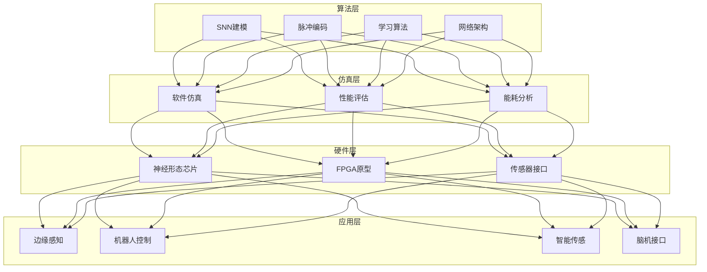
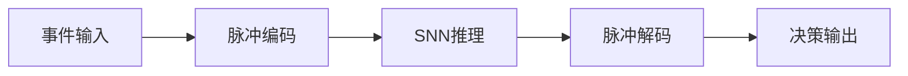

# 类脑计算架构设计 — 阿里云视角

> **适用版本**: Kubernetes v1.29 - v1.33 | **最后更新**: 2026-04-24
> **作者**: 阿里云解决方案架构师 | **标签**: `#类脑计算` `#脉冲神经网络` `#神经形态芯片` `#边缘智能` `#阿里云`

---

## 目录

1. [行业背景](#1-行业背景)
2. [业务架构](#2-业务架构)
3. [技术架构](#3-技术架构)
4. [核心数据流](#4-核心数据流)
5. [安全与合规](#5-安全与合规)
6. [可观测性](#6-可观测性)
7. [阿里云组件映射](#7-阿里云组件映射)
8. [生产检查清单](#8-生产检查清单)

---

## 1. 行业背景

### 1.1 业务特点

类脑计算模拟生物神经系统，实现低功耗智能计算：

| 挑战 | 说明 | 架构影响 |
|:---|:---|:---|
| 脉冲编码 | 事件驱动异步计算 | 新型编程模型 |
| 芯片异构 | 神经形态硬件多样 | 跨平台编译 |
| 训练困难 | 脉冲神经网络训练 | 专用算法 |
| 边缘部署 | 超低功耗推理 | 模型压缩 |
| 软硬件协同 | 算法与芯片适配 | 协同设计 |

### 1.2 核心场景

- **脉冲神经网络**: SNN 建模与训练
- **神经形态芯片**: 类脑芯片设计与验证
- **边缘智能**: 超低功耗感知/决策
- **脑机接口**: 神经信号编解码
- **机器人控制**: 类脑运动控制

---

## 2. 业务架构

### 2.1 类脑计算全景架构



---

## 3. 技术架构

### 3.1 K8s 部署

```yaml
# SNN 训练 GPU Deployment
apiVersion: apps/v1
kind: Deployment
metadata:
  name: snn-training
  namespace: neuromorphic
spec:
  replicas: 2
  selector:
    matchLabels:
      app: snn-training
  template:
    metadata:
      labels:
        app: snn-training
    spec:
      nodeSelector:
        accelerator: nvidia-a100
      runtimeClassName: nvidia
      containers:
        - name: snn
          image: registry.cn-hangzhou.aliyuncs.com/neuro/snn-training:v1.0.0-gpu
          ports:
            - containerPort: 8080
          env:
            - name: NEURON_MODEL
              value: "lif"
            - name: LEARNING_RULE
              value: "stdp"
          resources:
            requests:
              nvidia.com/gpu: 2
              memory: "64Gi"
              cpu: "16000m"
            limits:
              nvidia.com/gpu: 2
              memory: "128Gi"
              cpu: "32000m"
```

---

## 4. 核心数据流

### 4.1 脉冲神经网络推理



---

## 5. 安全与合规

- **数据安全**: 神经数据保密
- **算法安全**: 类脑系统可靠性
- **伦理合规**: AI 决策透明性

---

## 6. 可观测性

- **能耗效率**: < 1mW 推理
- **延迟**: < 10ms
- **准确率**: 对标传统 ANN

---

## 7. 阿里云组件映射

| 功能域 | **阿里云云原生方案** |
|:---|:---|
| 容器平台 | **ACK Pro + GPU** |
| GPU | **GN10/GN7 实例** |
| AI | **PAI** |
| 数据库 | **PolarDB** |
| 对象存储 | **OSS** |
| 可观测性 | **ARMS + SLS** |

---

## 8. 生产检查清单

- [ ] SNN 训练收敛性
- [ ] 芯片能耗效率验证
- [ ] 边缘推理延迟测试
- [ ] 神经数据隐私保护
- [ ] 算法可解释性验证

---

**维护者**: 阿里云解决方案架构师团队 | **许可证**: MIT
