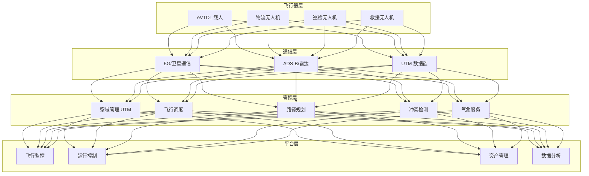
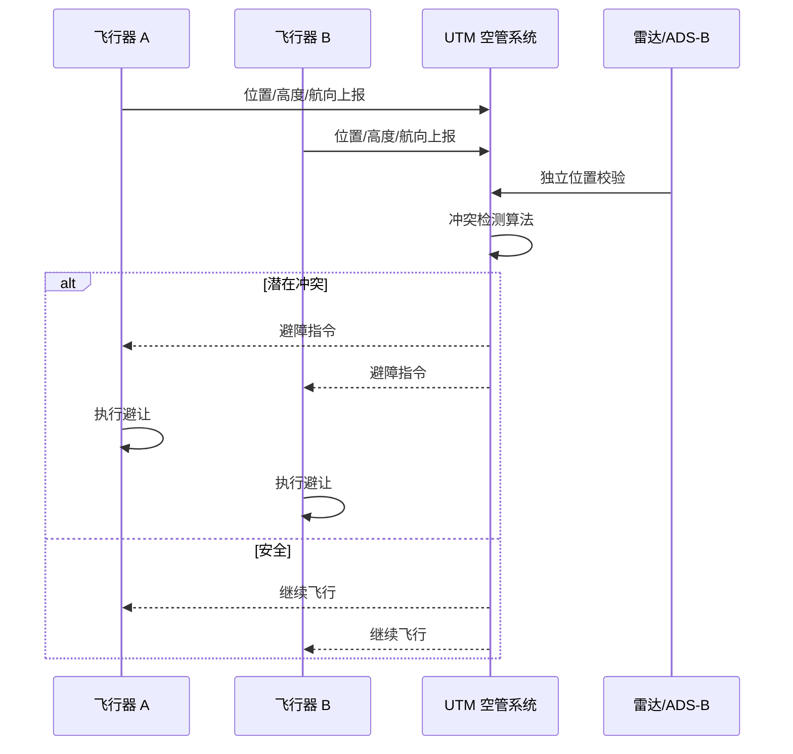
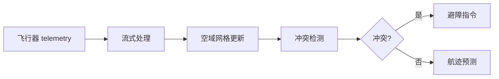

# 低空经济（eVTOL/UAM）架构设计 — 阿里云视角

> **适用版本**: Kubernetes v1.29 - v1.33 | **最后更新**: 2026-04-24
> **作者**: 阿里云解决方案架构师 | **标签**: `#低空经济` `#eVTOL` `#UAM` `#空域管理` `#阿里云`

---

## 目录

1. [行业背景](#1-行业背景)
2. [业务架构](#2-业务架构)
3. [技术架构](#3-技术架构)
4. [核心数据流](#4-核心数据流)
5. [安全与合规](#5-安全与合规)
6. [可观测性](#6-可观测性)
7. [阿里云组件映射](#7-阿里云组件映射)
8. [生产检查清单](#8-生产检查清单)

---

## 1. 行业背景

### 1.1 业务特点

低空经济以 eVTOL（电动垂直起降飞行器）和无人机为核心，涵盖城市空中交通（UAM）、物流配送、应急救援等场景：

| 挑战 | 说明 | 架构影响 |
|:---|:---|:---|
| 空域管理 | 低空空域动态分配 | 实时空域网格化 |
| 飞行安全 | eVTOL 载人安全 | 多重冗余 + 故障切换 |
| 通信延迟 | 空地实时通信 | 5G/卫星低延迟链路 |
| 高密度飞行 | 城市上空多机协同 | 分布式调度算法 |
| 法规合规 | 适航认证/空域审批 | 审计追踪 |

### 1.2 核心场景

- **城市空中交通**: eVTOL 载人通勤/机场接驳
- **无人机物流**: 末端配送/医疗物资运输
- **应急救援**: 空中消防/医疗转运/搜索救援
- **低空巡检**: 电力/管道/桥梁巡检
- **飞行培训**: 模拟器训练/数字孪生

---

## 2. 业务架构

### 2.1 低空经济全景架构



### 2.2 飞行冲突检测时序



---

## 3. 技术架构

### 3.1 K8s 部署

```yaml
# UTM 空管核心 Deployment
apiVersion: apps/v1
kind: Deployment
metadata:
  name: utm-core
  namespace: uam
spec:
  replicas: 5
  selector:
    matchLabels:
      app: utm-core
  template:
    metadata:
      labels:
        app: utm-core
    spec:
      affinity:
        podAntiAffinity:
          requiredDuringSchedulingIgnoredDuringExecution:
            - labelSelector:
                matchLabels:
                  app: utm-core
              topologyKey: topology.kubernetes.io/zone
      containers:
        - name: utm
          image: registry.cn-hangzhou.aliyuncs.com/uam/utm-core:v2.0.0
          ports:
            - containerPort: 8080
          env:
            - name: CONFLICT_DETECTION_RADIUS
              value: "500m"
            - name: MAX_AIRCRAFT_CAPACITY
              value: "10000"
          resources:
            requests:
              memory: "8Gi"
              cpu: "4000m"
            limits:
              memory: "16Gi"
              cpu: "8000m"
```

---

## 4. 核心数据流

### 4.1 实时空域管理



---

## 5. 安全与合规

- **适航安全**: eVTOL 适航认证（CAAC/FAA/EASA）
- **空域安全**: 多机冲突避免
- **通信安全**: 指令加密防劫持
- **数据安全**: 飞行数据隐私保护

---

## 6. 可观测性

- **定位精度**: < 1m（RTK）
- **通信延迟**: < 100ms
- **冲突检测**: < 1s
- **系统可用性**: 99.999%

---

## 7. 阿里云组件映射

| 功能域 | **阿里云云原生方案** |
|:---|:---|
| 容器平台 | **ACK Pro** |
| 实时计算 | **Flink + Hologres** |
| 时序数据库 | **Lindorm TSDB** |
| 消息队列 | **RocketMQ** |
| 地图/GIS | **阿里云 GIS** |
| 可观测性 | **ARMS + SLS** |

---

## 8. 生产检查清单

- [ ] UTM 系统高可用（5 9）
- [ ] 冲突检测算法验证
- [ ] 通信链路冗余测试
- [ ] 适航数据审计追踪
- [ ] 空域权限管理合规

---

**维护者**: 阿里云解决方案架构师团队 | **许可证**: MIT
