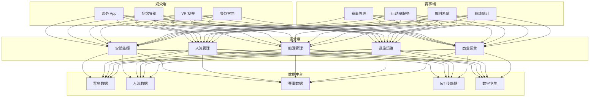
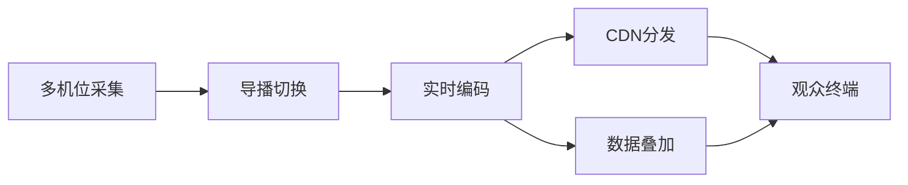

# 智慧体育场馆架构设计 — 阿里云视角

> **适用版本**: Kubernetes v1.29 - v1.33 | **最后更新**: 2026-04-24
> **作者**: 阿里云解决方案架构师 | **标签**: `#智慧体育场馆` `#赛事运营` `#观众体验` `#数字孪生场馆` `#阿里云`

---

## 目录

1. [行业背景](#1-行业背景)
2. [业务架构](#2-业务架构)
3. [技术架构](#3-技术架构)
4. [核心数据流](#4-核心数据流)
5. [安全与合规](#5-安全与合规)
6. [可观测性](#6-可观测性)
7. [阿里云组件映射](#7-阿里云组件映射)
8. [生产检查清单](#8-生产检查清单)

---

## 1. 行业背景

### 1.1 业务特点

智慧体育场馆融合数字技术与体育运营，提升赛事体验与运营效率：

| 挑战 | 说明 | 架构影响 |
|:---|:---|:---|
| 大人流 | 数万人同时入场 | 高并发票务/闸机 |
| 赛事直播 | 4K/8K 超低延迟 | CDN + 边缘节点 |
| 安防保障 | 突发事件应急响应 | AI 视频分析 |
| 能耗管理 | 大型场馆绿色运营 | IoT + AI 优化 |
| 多业态 | 赛时/平时灵活切换 | 业务中台 |

### 1.2 核心场景

- **智能票务**: 电子票务/人脸识别入场/动态定价
- **赛事直播**: 多机位/VR 视角/实时数据叠加
- **安防监控**: AI 行为分析/人群密度/异常检测
- **智慧停车**: 车位引导/无感支付/潮汐调度
- **数字孪生**: 场馆三维可视化/设施运维

---

## 2. 业务架构

### 2.1 智慧体育场馆全景架构



---

## 3. 技术架构

### 3.1 K8s 部署

```yaml
# 安防 AI 视频分析 Deployment
apiVersion: apps/v1
kind: Deployment
metadata:
  name: venue-security-ai
  namespace: smart-venue
spec:
  replicas: 4
  selector:
    matchLabels:
      app: venue-security-ai
  template:
    metadata:
      labels:
        app: venue-security-ai
    spec:
      nodeSelector:
        accelerator: nvidia-t4
      runtimeClassName: nvidia
      containers:
        - name: analyzer
          image: registry.cn-hangzhou.aliyuncs.com/venue/security-ai:v2.0.0-gpu
          ports:
            - containerPort: 8080
          env:
            - name: VIDEO_STREAMS
              value: "200"
            - name: DETECTION_CLASSES
              value: "crowd_density,abnormal_behavior,fire_smoke"
          resources:
            requests:
              nvidia.com/gpu: 1
              memory: "8Gi"
              cpu: "4000m"
            limits:
              nvidia.com/gpu: 1
              memory: "16Gi"
              cpu: "8000m"
```

---

## 4. 核心数据流

### 4.1 赛事直播数据流



---

## 5. 安全与合规

- **人群安全**: 人流密度实时监测/疏散预案
- **食品安全**: 场馆餐饮溯源
- **网络安全**: 票务防刷/防黄牛
- **数据安全**: 观众隐私保护

---

## 6. 可观测性

- **入场速度**: > 30 人/分钟/闸机
- **直播延迟**: < 3s
- **安防响应**: < 5s
- **能耗降低**: 15%+

---

## 7. 阿里云组件映射

| 功能域 | **阿里云云原生方案** |
|:---|:---|
| 容器平台 | **ACK Pro + GPU** |
| CDN | **阿里云 CDN + DCDN** |
| 直播 | **阿里云视频直播** |
| AI | **PAI / 视觉智能** |
| IoT | **阿里云 IoT 平台** |
| 数据库 | **PolarDB** |
| 可观测性 | **ARMS + SLS** |

---

## 8. 生产检查清单

- [ ] 峰值人流承载测试
- [ ] 安防 AI 误报率 < 2%
- [ ] 直播 CDN 覆盖率验证
- [ ] 应急响应演练通过
- [ ] 观众隐私数据合规

---

**维护者**: 阿里云解决方案架构师团队 | **许可证**: MIT
