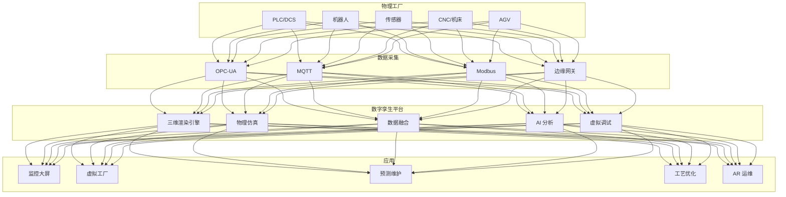
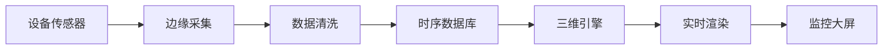

# 数字孪生工厂架构设计 — 阿里云视角

> **适用版本**: Kubernetes v1.29 - v1.33 | **最后更新**: 2026-04-24
> **作者**: 阿里云解决方案架构师 | **标签**: `#数字孪生工厂` `#工业元宇宙` `#虚拟调试` `#预测性维护` `#阿里云`

---

## 目录

1. [行业背景](#1-行业背景)
2. [业务架构](#2-业务架构)
3. [技术架构](#3-技术架构)
4. [核心数据流](#4-核心数据流)
5. [安全与合规](#5-安全与合规)
6. [可观测性](#6-可观测性)
7. [阿里云组件映射](#7-阿里云组件映射)
8. [生产检查清单](#8-生产检查清单)

---

## 1. 行业背景

### 1.1 业务特点

数字孪生工厂将物理产线实时映射到虚拟空间，实现全生命周期管理：

| 挑战 | 说明 | 架构影响 |
|:---|:---|:---|
| 实时映射 | 物理→虚拟毫秒级同步 | 高吞吐 IoT 数据采集 |
| 模型精度 | 几何/物理/行为一致性 | GPU 实时渲染 |
| 数据融合 | 多源异构数据对齐 | 数据湖 + 时序库 |
| 虚拟调试 | 新产线零停机验证 | 仿真集群 |
| 预测维护 | 设备故障提前预警 | AI 时序预测 |

### 1.2 核心场景

- **三维可视化**: 工厂/设备/产线实时三维展示
- **虚拟调试**: PLC 逻辑虚拟验证/机器人轨迹规划
- **预测性维护**: 设备健康度评估/故障预警
- **工艺优化**: 仿真参数寻优/产能瓶颈分析
- **远程运维**: AR 远程协助/专家系统

---

## 2. 业务架构

### 2.1 数字孪生工厂全景架构



---

## 3. 技术架构

### 3.1 K8s 部署

```yaml
# 数字孪生渲染引擎 GPU StatefulSet
apiVersion: apps/v1
kind: StatefulSet
metadata:
  name: twin-render-engine
  namespace: digital-twin-factory
spec:
  serviceName: twin-render
  replicas: 3
  selector:
    matchLabels:
      app: twin-render-engine
  template:
    metadata:
      labels:
        app: twin-render-engine
    spec:
      nodeSelector:
        accelerator: nvidia-a10
      runtimeClassName: nvidia
      containers:
        - name: render
          image: registry.cn-hangzhou.aliyuncs.com/twin/render-engine:v3.0.0-gpu
          ports:
            - containerPort: 8080
          env:
            - name: RENDER_QUALITY
              value: "high"
            - name: PHYSICS_ENGINE
              value: "nvidia-physx"
          resources:
            requests:
              nvidia.com/gpu: 1
              memory: "16Gi"
              cpu: "8000m"
            limits:
              nvidia.com/gpu: 1
              memory: "32Gi"
              cpu: "16000m"
          volumeMounts:
            - name: factory-models
              mountPath: /models
  volumeClaimTemplates:
    - metadata:
        name: factory-models
      spec:
        accessModes: ["ReadWriteOnce"]
        resources:
          requests:
            storage: 500Gi
```

---

## 4. 核心数据流

### 4.1 物理到虚拟映射



---

## 5. 安全与合规

- **工控安全**: OT 网络与 IT 网络隔离
- **数据安全**: 工艺参数保密
- **仿真安全**: 虚拟调试不影响物理产线

---

## 6. 可观测性

- **映射延迟**: < 100ms
- **渲染帧率**: > 30FPS
- **预测准确率**: > 85%
- **数据完整率**: > 99.9%

---

## 7. 阿里云组件映射

| 功能域 | **阿里云云原生方案** |
|:---|:---|
| 容器平台 | **ACK Pro + GPU** |
| IoT | **阿里云 IoT 平台** |
| 时序数据库 | **Lindorm TSDB** |
| AI | **PAI** |
| 数据湖 | **OSS + MaxCompute** |
| 可视化 | **DataV** |
| 可观测性 | **ARMS + SLS** |

---

## 8. 生产检查清单

- [ ] 物理虚拟映射延迟 < 100ms
- [ ] 三维渲染帧率 > 30FPS
- [ ] 预测性维护准确率验证
- [ ] 工控网络隔离合规
- [ ] 工艺数据安全隔离

---

**维护者**: 阿里云解决方案架构师团队 | **许可证**: MIT
