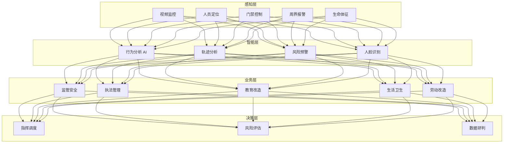
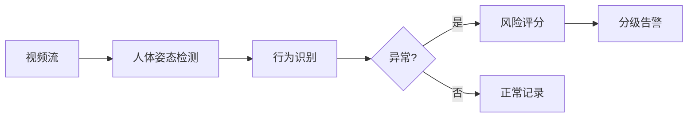

# 智慧监狱架构设计 — 阿里云视角

> **适用版本**: Kubernetes v1.29 - v1.33 | **最后更新**: 2026-04-24
> **作者**: 阿里云解决方案架构师 | **标签**: `#智慧监狱` `#司法矫正` `#AI监控` `#智慧监管` `#阿里云`

---

## 目录

1. [行业背景](#1-行业背景)
2. [业务架构](#2-业务架构)
3. [技术架构](#3-技术架构)
4. [核心数据流](#4-核心数据流)
5. [安全与合规](#5-安全与合规)
6. [可观测性](#6-可观测性)
7. [阿里云组件映射](#7-阿里云组件映射)
8. [生产检查清单](#8-生产检查清单)

---

## 1. 行业背景

### 1.1 业务特点

智慧监狱通过数字化手段提升监管安全与服刑人员改造质量：

| 挑战 | 说明 | 架构影响 |
|:---|:---|:---|
| 监管安全 | 防脱逃/防暴乱/防自杀 | 全方位智能感知 |
| 人员管理 | 在押人员行为分析 | AI 视频/轨迹分析 |
| 执法规范 | 减刑假释/计分考核 | 区块链存证 |
| 教育改造 | 个性化矫正方案 | 教育平台 + AI 评估 |
| 医疗救治 | 突发疾病应急 | 远程医疗 + IoT |

### 1.2 核心场景

- **智能监控**: 视频行为分析/异常告警/轨迹追踪
- **人员定位**: UWB/蓝牙室内定位/电子围栏
- **智能巡检**: 机器人/无人机自动巡检
- **亲情会见**: 远程视频会见/智能管控
- **教育矫正**: 在线教育/心理评估/职业技能

---

## 2. 业务架构

### 2.1 智慧监狱全景架构



---

## 3. 技术架构

### 3.1 K8s 部署

```yaml
# AI 行为分析 GPU Deployment
apiVersion: apps/v1
kind: Deployment
metadata:
  name: prison-behavior-ai
  namespace: smart-prison
spec:
  replicas: 4
  selector:
    matchLabels:
      app: prison-behavior-ai
  template:
    metadata:
      labels:
        app: prison-behavior-ai
    spec:
      nodeSelector:
        accelerator: nvidia-t4
      runtimeClassName: nvidia
      containers:
        - name: analyzer
          image: registry.cn-hangzhou.aliyuncs.com/prison/behavior-ai:v2.0.0-gpu
          ports:
            - containerPort: 8080
          env:
            - name: DETECTION_CLASSES
              value: "fight,climb,gather,suicide_risk"
            - name: ALERT_THRESHOLD
              value: "0.75"
          resources:
            requests:
              nvidia.com/gpu: 1
              memory: "8Gi"
              cpu: "4000m"
            limits:
              nvidia.com/gpu: 1
              memory: "16Gi"
              cpu: "8000m"
```

---

## 4. 核心数据流

### 4.1 异常行为预警



---

## 5. 安全与合规

- **物理安全**: 防脱逃/防暴乱多层防护
- **数据安全**: 司法数据绝对保密
- **等保三级**: 监狱系统等级保护
- **隐私保护**: 在押人员信息严格管控

---

## 6. 可观测性

- **视频覆盖率**: 100% 无死角
- **识别准确率**: > 90%
- **告警响应**: < 3s
- **定位精度**: < 1m（UWB）

---

## 7. 阿里云组件映射

| 功能域 | **阿里云云原生方案** |
|:---|:---|
| 容器平台 | **ACK Pro + GPU** |
| AI | **PAI / 视觉智能** |
| IoT | **阿里云 IoT 平台** |
| 区块链 | **蚂蚁链 BaaS** |
| 数据库 | **PolarDB** |
| 可观测性 | **ARMS + SLS** |

---

## 8. 生产检查清单

- [ ] 视频全覆盖无盲区
- [ ] AI 行为识别准确率验证
- [ ] 周界报警误报率 < 1%
- [ ] 区块链执法存证完整
- [ ] 等保三级合规审计

---

**维护者**: 阿里云解决方案架构师团队 | **许可证**: MIT
