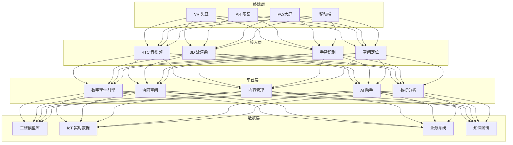
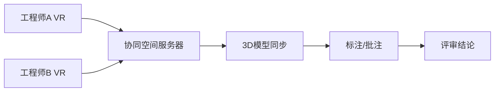

# 工业元宇宙架构设计 — 阿里云视角

> **适用版本**: Kubernetes v1.29 - v1.33 | **最后更新**: 2026-04-24
> **作者**: 阿里云解决方案架构师 | **标签**: `#工业元宇宙` `#虚拟工厂` `#协同设计` `#远程运维` `#阿里云`

---

## 目录

1. [行业背景](#1-行业背景)
2. [业务架构](#2-业务架构)
3. [技术架构](#3-技术架构)
4. [核心数据流](#4-核心数据流)
5. [安全与合规](#5-安全与合规)
6. [可观测性](#6-可观测性)
7. [阿里云组件映射](#7-阿里云组件映射)
8. [生产检查清单](#8-生产检查清单)

---

## 1. 行业背景

### 1.1 业务特点

工业元宇宙将 VR/AR、数字孪生、AI 融合到工业场景，实现虚实协同：

| 挑战 | 说明 | 架构影响 |
|:---|:---|:---|
| 实时协同 | 多地工程师同空间协作 | 低延迟同步 |
| 模型规模 | 工厂级超大规模三维场景 | 流式加载 + LOD |
| 数据融合 | 设计/制造/运维数据打通 | 数据中台 |
| 沉浸体验 | VR/AR 低延迟渲染 | 边缘 GPU 渲染 |
| 虚实交互 | 物理操作映射虚拟 | 传感器融合 |

### 1.2 核心场景

- **协同设计**: 多地工程师 VR 协同评审
- **虚拟培训**: 高危操作模拟训练
- **远程运维**: AR 远程专家指导
- **供应链协同**: 供应商虚拟入厂评审
- **产品展示**: 客户沉浸式产品体验

---

## 2. 业务架构

### 2.1 工业元宇宙全景架构



---

## 3. 技术架构

### 3.1 K8s 部署

```yaml
# 云渲染 GPU Deployment
apiVersion: apps/v1
kind: Deployment
metadata:
  name: cloud-render-service
  namespace: industrial-metaverse
spec:
  replicas: 6
  selector:
    matchLabels:
      app: cloud-render-service
  template:
    metadata:
      labels:
        app: cloud-render-service
    spec:
      nodeSelector:
        accelerator: nvidia-a10
      runtimeClassName: nvidia
      containers:
        - name: renderer
          image: registry.cn-hangzhou.aliyuncs.com/metaverse/cloud-render:v2.0.0-gpu
          ports:
            - containerPort: 8080
          env:
            - name: STREAM_CODEC
              value: "h265"
            - name: TARGET_LATENCY_MS
              value: "50"
          resources:
            requests:
              nvidia.com/gpu: 1
              memory: "16Gi"
              cpu: "8000m"
            limits:
              nvidia.com/gpu: 1
              memory: "32Gi"
              cpu: "16000m"
```

---

## 4. 核心数据流

### 4.1 VR 协同评审



---

## 5. 安全与合规

- **数据安全**: 三维模型/工艺数据保密
- **访问控制**: 虚拟空间权限管理
- **网络安全**: VR 通信加密

---

## 6. 可观测性

- **渲染延迟**: < 50ms
- **协同同步**: < 20ms
- **并发用户**: 100+ 同空间
- **帧率**: > 60FPS

---

## 7. 阿里云组件映射

| 功能域 | **阿里云云原生方案** |
|:---|:---|
| 容器平台 | **ACK Pro + GPU** |
| RTC | **阿里云 RTC** |
| 渲染 | **GN10/GN7 GPU 实例** |
| 对象存储 | **OSS + CDN** |
| AI | **PAI** |
| 可观测性 | **ARMS + SLS** |

---

## 8. 生产检查清单

- [ ] 渲染延迟 < 50ms
- [ ] 多用户协同同步验证
- [ ] 三维模型安全隔离
- [ ] VR 设备兼容性测试
- [ ] 网络带宽自适应

---

**维护者**: 阿里云解决方案架构师团队 | **许可证**: MIT
