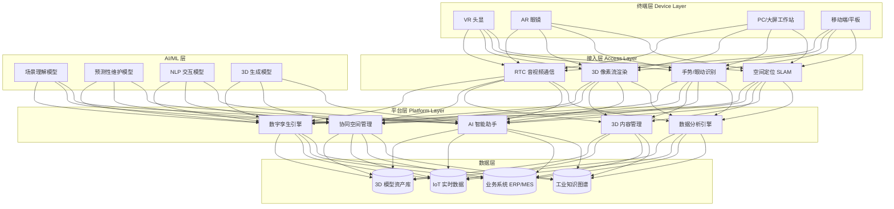
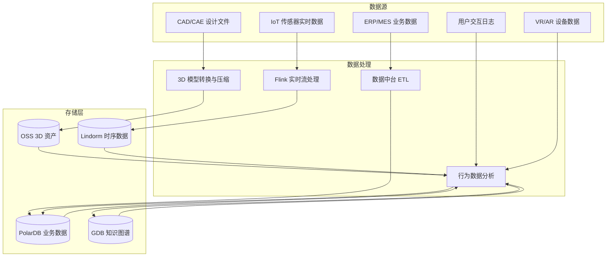

# 工业元宇宙架构设计 — 阿里云视角

> **适用版本**: Kubernetes v1.29 - v1.33 | **最后更新**: 2026-04-24
> **作者**: 阿里云解决方案架构师 | **标签**: `#工业元宇宙` `#虚拟工厂` `#协同设计` `#远程运维` `#阿里云`

---

## 目录

1. [行业概述](#1-行业概述)
2. [业务场景](#2-业务场景)
3. [架构设计](#3-架构设计)
4. [核心技术栈](#4-核心技术栈)
5. [Kubernetes 部署方案](#5-kubernetes-部署方案)
6. [数据架构](#6-数据架构)
7. [AI/ML 组件](#7-aiml-组件)
8. [安全与合规](#8-安全与合规)
9. [最佳实践](#9-最佳实践)
10. [反模式](#10-反模式)
11. [参考资源](#11-参考资源)

---

## 1. 行业概述

### 1.1 市场规模与趋势

工业元宇宙将 VR/AR、数字孪生、AI、IoT 融合到工业场景，实现虚实协同。全球工业元宇宙市场规模预计从 2024 年的 400 亿美元增长到 2030 年的 3500 亿美元。NVIDIA Omniverse、Microsoft Industrial Metaverse、西门子 Xcelerator 等平台引领行业发展。核心价值在于缩短产品研发周期 30-50%、降低运维成本 20-40%、提升生产效率 15-25%。

| 指标 | 2024 年 | 2026 年（预测） | 2030 年（预测） |
|:---|:---|:---|:---|
| 全球市场规模 | $40B | $100B | $350B |
| 工业企业采用率 | 12% | 25% | 55% |
| 虚拟工厂部署数量 | 500+ | 2000+ | 10000+ |
| 协同设计效率提升 | 30% | 40% | 60% |
| 远程运维成本降低 | 20% | 35% | 50% |

### 1.2 行业痛点

| 痛点 | 说明 | 数字化转型驱动 |
|:---|:---|:---|
| 实时协同 | 多地工程师同空间协作难 | 低延迟同步 + 空间锚点 |
| 模型规模 | 工厂级超大规模三维场景 | 流式加载 + LOD + Nanite |
| 数据融合 | 设计/制造/运维数据割裂 | 数据中台 + 语义建模 |
| 沉浸体验 | VR/AR 延迟导致不适 | 边缘 GPU 渲染 + 注视点编码 |
| 虚实交互 | 物理操作难以映射到虚拟 | IoT 传感器融合 + 力反馈 |
| 安全合规 | 工业数据泄露风险高 | 零信任 + 数据加密 |

### 1.3 数字化转型架构影响

工业元宇宙架构需要覆盖终端层（VR/AR/PC/移动）、接入层（RTC/3D 流渲染/手势识别）、平台层（数字孪生引擎/协同空间/内容管理/AI 助手）和数据层（3D 模型/IoT 数据/业务系统/知识图谱）。核心挑战是超大规模 3D 场景的实时渲染和多用户低延迟同步。

---

## 2. 业务场景

### 2.1 多地 VR 协同设计评审

分散在全球各地的工程师佩戴 VR 头显进入同一个虚拟设计空间，共同评审产品设计方案。支持 3D 模型实时加载、标注批注、爆炸图展示、运动模拟。设计师可以实时修改模型参数，其他参与者即时看到变更。

**核心流程**: 进入虚拟空间 → 加载 CAD 模型 → 多人同步浏览 → 标注/批注 → 方案投票 → 导出评审报告

### 2.2 高危操作虚拟培训

为化工、电力、矿山等高危行业提供虚拟培训环境。学员在 VR 中模拟操作危险设备，系统实时评估操作规范性并给出指导。培训数据自动记录，形成学员能力画像。相比传统培训，虚拟培训可将事故率降低 60%。

### 2.3 AR 远程专家运维

现场工程师佩戴 AR 眼镜，远程专家通过第一视角视频看到设备状态并叠加指导标注。支持 3D 模型叠加、步骤指引、语音交互。可将设备平均修复时间（MTTR）缩短 40%。

### 2.4 供应商虚拟入厂评审

供应商通过 VR 远程进入虚拟工厂，进行零部件装配评审、工艺路线验证和质量检查。减少差旅成本 70%，评审周期缩短 50%。

### 2.5 客户沉浸式产品体验

客户通过 VR/AR 体验定制化产品，如虚拟试驾、虚拟看房、虚拟工厂参观。系统根据客户反馈实时调整产品配置。

---

## 3. 架构设计

### 3.1 工业元宇宙全景架构



---

## 4. 核心技术栈

| Component | Purpose | Technology | License |
|:---|:---|:---|:---|
| Container Orchestration | Platform workload management | ACK Pro + GPU | Proprietary |
| 3D Engine | Real-time rendering & simulation | Unreal Engine 5 / Unity | Proprietary |
| Pixel Streaming | Cloud rendering delivery | UE PixelStreaming / Nano | Proprietary |
| XR Runtime | Device-side runtime | OpenXR | Open |
| RTC | Audio/video communication | Aliyun RTC / LiveKit | Proprietary / Apache 2.0 |
| Collaboration | Multi-user state sync | CRDT (Yjs) / Netcode | MIT |
| 3D Format | Asset interchange | glTF 2.0 / USD / STEP | Open Standards |
| Asset Compression | 3D model compression | Draco / MeshOpt | Apache 2.0 / MIT |
| AI Framework | Model training & inference | PyTorch 2.x / PAI | BSD / Proprietary |
| IoT Platform | Device data collection | 阿里云 IoT / MQTT | Proprietary |
| Time-Series DB | Sensor data storage | Lindorm TSDB | Proprietary |
| Object Storage | 3D assets & artifacts | OSS | Proprietary |
| Relational DB | Metadata & business data | PolarDB PostgreSQL | Proprietary |
| Graph Database | Knowledge graph | GDB | Proprietary |
| Monitoring | Observability | ARMS + SLS + Grafana | Proprietary / Apache 2.0 |

---

## 5. Kubernetes 部署方案

### 5.1 云渲染 GPU Deployment

```yaml
apiVersion: apps/v1
kind: Deployment
metadata:
  name: cloud-render-service
  namespace: industrial-metaverse
  labels:
    app: cloud-render-service
    tier: rendering
spec:
  replicas: 8
  selector:
    matchLabels:
      app: cloud-render-service
  strategy:
    rollingUpdate:
      maxSurge: 2
      maxUnavailable: 1
  template:
    metadata:
      labels:
        app: cloud-render-service
        tier: rendering
      annotations:
        prometheus.io/scrape: "true"
        prometheus.io/port: "9090"
    spec:
      nodeSelector:
        accelerator: nvidia-a10
        node-pool: xr-render
      runtimeClassName: nvidia
      priorityClassName: render-high-priority
      containers:
        - name: renderer
          image: registry.cn-hangzhou.aliyuncs.com/metaverse/cloud-render:v3.0.0-gpu
          ports:
            - containerPort: 8080
              name: http
            - containerPort: 8443
              name: webrtc
            - containerPort: 9090
              name: metrics
          env:
            - name: STREAM_CODEC
              value: "h265"
            - name: TARGET_LATENCY_MS
              value: "50"
            - name: MAX_RESOLUTION
              value: "3840x2160"
            - name: REFRESH_RATE
              value: "60"
            - name: SCENE_CACHE_SIZE_GB
              value: "20"
            - name: LOD_LEVELS
              value: "5"
            - name: ASSET_CDN
              valueFrom:
                configMapKeyRef:
                  name: metaverse-config
                  key: asset-cdn-url
          resources:
            requests:
              nvidia.com/gpu: 1
              memory: "16Gi"
              cpu: "8000m"
            limits:
              nvidia.com/gpu: 1
              memory: "32Gi"
              cpu: "16000m"
          readinessProbe:
            httpGet:
              path: /health/ready
              port: 8080
            initialDelaySeconds: 30
            periodSeconds: 5
          livenessProbe:
            httpGet:
              path: /health/live
              port: 8080
            initialDelaySeconds: 60
            periodSeconds: 10
          volumeMounts:
            - name: scene-cache
              mountPath: /cache/scenes
            - name: model-data
              mountPath: /models
              readOnly: true
      volumes:
        - name: scene-cache
          emptyDir:
            sizeLimit: "30Gi"
        - name: model-data
          persistentVolumeClaim:
            claimName: factory-models-pvc
```

### 5.2 协同空间服务 Deployment

```yaml
apiVersion: apps/v1
kind: Deployment
metadata:
  name: collab-space-manager
  namespace: industrial-metaverse
spec:
  replicas: 4
  selector:
    matchLabels:
      app: collab-space-manager
  template:
    metadata:
      labels:
        app: collab-space-manager
    spec:
      affinity:
        podAntiAffinity:
          requiredDuringSchedulingIgnoredDuringExecution:
            - labelSelector:
                matchLabels:
                  app: collab-space-manager
              topologyKey: topology.kubernetes.io/zone
      containers:
        - name: collab
          image: registry.cn-hangzhou.aliyuncs.com/metaverse/collab-server:v2.0.0
          ports:
            - containerPort: 8080
          env:
            - name: MAX_USERS_PER_SPACE
              value: "50"
            - name: SYNC_RATE_HZ
              value: "60"
            - name: STATE_PROTOCOL
              value: "crdt"
            - name: REDIS_CLUSTER
              valueFrom:
                secretKeyRef:
                  name: metaverse-secrets
                  key: redis-url
          resources:
            requests:
              memory: "4Gi"
              cpu: "2000m"
            limits:
              memory: "8Gi"
              cpu: "4000m"
```

### 5.3 ConfigMap, Service 与 Secret

```yaml
apiVersion: v1
kind: ConfigMap
metadata:
  name: metaverse-config
  namespace: industrial-metaverse
data:
  asset-cdn-url: "https://metaverse-assets.cdn.example.com"
  render-config: |
    {
      "foveated_rendering": true,
      "nanite_enabled": true,
      "lumen_enabled": true,
      "max_triangle_count": 100000000,
      "texture_streaming": true,
      "physics_engine": "physx5"
    }
  collab-config: |
    {
      "position_sync_rate": 60,
      "annotation_persistence": true,
      "voice_channels": 8,
      "max_annotations_per_session": 500,
      "recording_enabled": true
    }
  iot-subscription: |
    {
      "mqtt_broker": "iot-platform.metaverse.svc.cluster.local:1883",
      "topics": ["factory/sensor/#", "factory/alarm/#"],
      "qos": 1
    }
---
apiVersion: v1
kind: Service
metadata:
  name: cloud-render-service
  namespace: industrial-metaverse
spec:
  selector:
    app: cloud-render-service
  ports:
    - name: http
      port: 8080
      targetPort: 8080
    - name: webrtc
      port: 8443
      targetPort: 8443
    - name: metrics
      port: 9090
      targetPort: 9090
  type: ClusterIP
---
apiVersion: v1
kind: Secret
metadata:
  name: metaverse-secrets
  namespace: industrial-metaverse
type: Opaque
stringData:
  redis-url: "redis://:password@redis-metaverse.rds.aliyuncs.com:6379/0"
  oss-access-key: "encrypted-access-key"
  oss-secret-key: "encrypted-secret-key"
  iot-device-secret: "device-secret-placeholder"
  model-encryption-key: "aes-256-gcm-key-placeholder"
```

---

## 6. 数据架构

### 6.1 数据流全景



### 6.2 数据流说明

- **3D 资产流**: CAD 文件（STEP/IGES）自动转换为 glTF/USD 格式，经 Draco 压缩后存入 OSS
- **IoT 数据流**: 传感器数据通过 MQTT 接入，经 Flink 实时处理写入 Lindorm，驱动数字孪生实时更新
- **协同数据流**: 用户交互操作通过 CRDT 同步，支持离线编辑和冲突自动合并
- **知识图谱**: 设备-工艺-故障-方案关系建模为知识图谱，支撑智能问答和辅助决策

---

## 7. AI/ML 组件

### 7.1 核心模型

| 模型 | 用途 | 输入 | 输出 | 框架 |
|:---|:---|:---|:---|:---|
| 场景理解 | 工业场景 3D 语义分割 | 点云/深度图 | 设备/管道/区域标签 | PointNet++ |
| 预测性维护 | 设备故障预警 | IoT 时序数据 | 故障概率 + 剩余寿命 | Transformer |
| 3D 生成 | AIGC 3D 模型生成 | 文本/草图 | 3D 模型 | Diffusion + NeRF |
| NLP 助手 | 工业知识问答 | 自然语言 | 答案/操作指引 | LLM + RAG |
| 异常检测 | 生产过程异常检测 | 多源传感器数据 | 异常类型 + 位置 | AutoEncoder |
| 语音交互 | 语音指令识别 | 语音流 | 意图 + 参数 | Whisper + NLU |

---

## 8. 安全与合规

### 8.1 行业法规与标准

| 法规/标准 | 适用范围 | 架构要求 |
|:---|:---|:---|
| 等保三级 | 工业控制系统安全 | 网络隔离 + 访问控制 |
| IEC 62443 | 工控系统信息安全 | 纵深防御架构 |
| ISO 27001 | 信息安全管理体系 | 安全管理体系 |
| 工业数据安全法 | 工业数据分类分级 | 数据加密 + 脱敏 |
| GDPR / PIPL | 个人信息保护 | 用户数据最小化收集 |
| ISO 13849 | 机械安全控制 | 虚拟调试安全验证 |

### 8.2 安全架构要点

- **零信任访问**: 所有用户/设备访问需身份验证和权限检查
- **3D 模型加密**: 核心设计图纸和工艺模型加密存储和传输
- **OT/IT 隔离**: 工业控制网络与元宇宙平台网络隔离
- **审计日志**: 所有协同操作和模型变更完整记录
- **数据主权**: 跨国企业数据按地域隔离存储

---

## 9. 最佳实践

1. **LOD 分级加载**: 根据视距动态切换 3D 模型细节层次，远处用低模，近处用高模，优化渲染性能
2. **3D 资产预加载**: 用户进入场景前预加载相关区域 3D 资产到边缘缓存
3. **RTC 音视频优先**: 协同场景中语音优先保障，使用 WebRTC SFU 架构降低延迟
4. **数字孪生数据绑定**: IoT 数据与 3D 模型节点绑定，实现虚实实时映射
5. **Nanite 虚拟化几何**: 使用 UE5 Nanite 技术处理工厂级亿级三角面模型
6. **协同录制回放**: 重要评审会议录制并支持时间轴回放，方便后续查阅
7. **边缘渲染就近**: 用户就近接入边缘渲染节点，降低网络延迟
8. **工业知识图谱**: 构建设备-故障-维修方案知识图谱，支撑 AI 辅助运维
9. **A/B 测试新功能**: 协同空间新功能通过 A/B 测试灰度发布
10. **跨设备一致性**: 确保同一场景在 VR/AR/PC 端渲染一致性

---

## 10. 反模式

1. **全量模型加载**: 进入虚拟工厂时加载所有 3D 模型，导致初始化时间过长。应使用流式加载和 LOD
2. **中心化同步服务器**: 所有协同状态通过单一服务器同步，延迟随用户数线性增长。应采用 CRDT 去中心化同步
3. **忽视网络质量**: 未考虑弱网环境，渲染卡顿严重影响体验。应实现自适应码率和降级策略
4. **IoT 数据直连渲染**: IoT 数据直接驱动渲染循环，数据异常导致渲染异常。应增加数据校验和平滑处理
5. **缺乏版本管理**: 3D 场景和模型缺乏版本管理，修改后无法回退。应实施资产版本控制

---

## 11. 参考资源

- [NVIDIA Omniverse Platform](https://www.nvidia.com/en-us/omniverse/)
- [Microsoft Industrial Metaverse](https://www.microsoft.com/en-us/industry/microsoft-cloud-for-industry)
- [Siemens Xcelerator](https://www.sw.siemens.com/)
- [Khronos glTF Specification](https://www.khronos.org/gltf/)
- [Pixar USD (Universal Scene Description)](https://openusd.org/)
- [Epic Games Unreal Engine 5](https://www.unrealengine.com/)
- [LiveKit WebRTC SFU](https://livekit.io/)
- [阿里云 RTC 文档](https://help.aliyun.com/product/61339.html)

---

**维护者**: 阿里云解决方案架构师团队 | **许可证**: MIT
