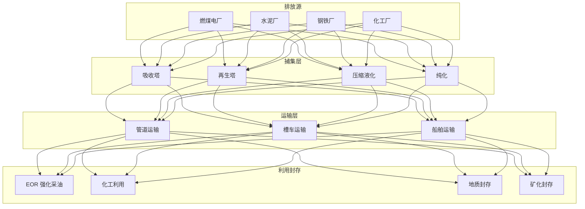
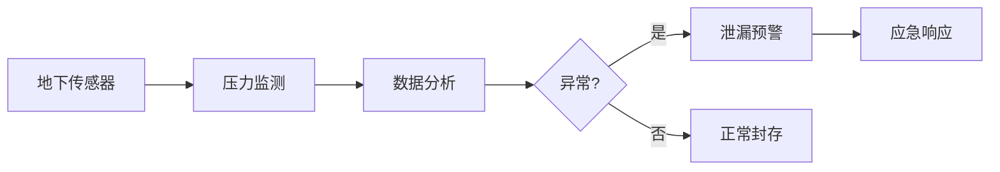

# 碳捕集利用与封存（CCUS）架构设计 — 阿里云视角

> **适用版本**: Kubernetes v1.29 - v1.33 | **最后更新**: 2026-04-24
> **作者**: 阿里云解决方案架构师 | **标签**: `#CCUS` `#碳捕集` `#碳封存` `#碳利用` `#阿里云`

---

## 目录

1. [行业背景](#1-行业背景)
2. [业务架构](#2-业务架构)
3. [技术架构](#3-技术架构)
4. [核心数据流](#4-核心数据流)
5. [安全与合规](#5-安全与合规)
6. [可观测性](#6-可观测性)
7. [阿里云组件映射](#7-阿里云组件映射)
8. [生产检查清单](#8-生产检查清单)

---

## 1. 行业背景

### 1.1 业务特点

CCUS 是实现碳中和的关键技术路径，涵盖捕集、运输、利用、封存全链条：

| 挑战 | 说明 | 架构影响 |
|:---|:---|:---|
| 高能耗 | 捕集过程能耗高 | AI 优化控制 |
| 地质封存 | CO₂ 长期安全封存 | 实时监测网络 |
| 泄漏风险 | 地下封存泄漏 | 传感器网格 |
| 碳核算 | MRV（监测报告核查） | 区块链存证 |
| 经济性 | 高成本制约推广 | 碳交易对接 |

### 1.2 核心场景

- **燃烧后捕集**: 烟气 CO₂ 分离/吸收/再生
- **燃烧前捕集**: IGCC 煤气化分离
- **富氧燃烧**: O₂/CO₂ 循环燃烧
- **直接空气捕集 DAC**: 空气中 CO₂ 直接提取
- **CO₂ 利用**: 化工原料/矿化/强化采油 EOR

---

## 2. 业务架构

### 2.1 CCUS 全景架构



---

## 3. 技术架构

### 3.1 K8s 部署

```yaml
# CCUS 工艺优化 AI Deployment
apiVersion: apps/v1
kind: Deployment
metadata:
  name: ccus-optimization
  namespace: carbon-capture
spec:
  replicas: 3
  selector:
    matchLabels:
      app: ccus-optimization
  template:
    metadata:
      labels:
        app: ccus-optimization
    spec:
      containers:
        - name: optimizer
          image: registry.cn-hangzhou.aliyuncs.com/ccus/optimizer:v1.0.0
          ports:
            - containerPort: 8080
          env:
            - name: OPTIMIZATION_TARGET
              value: "energy_min"
            - name: CAPTURE_RATE_TARGET
              value: "0.90"
          resources:
            requests:
              memory: "4Gi"
              cpu: "2000m"
            limits:
              memory: "8Gi"
              cpu: "4000m"
```

---

## 4. 核心数据流

### 4.1 碳封存监测



---

## 5. 安全与合规

- **地质安全**: 封存层完整性
- **泄漏监测**: 实时传感器网络
- **碳核算**: MRV 合规审计
- **环境安全**: 地下水/大气影响评估

---

## 6. 可观测性

- **捕集效率**: > 90%
- **能耗降低**: AI 优化 10%+
- **泄漏检测**: < 0.1%
- **碳核算精度**: > 95%

---

## 7. 阿里云组件映射

| 功能域 | **阿里云云原生方案** |
|:---|:---|
| 容器平台 | **ACK Pro** |
| AI | **PAI** |
| 时序数据库 | **Lindorm TSDB** |
| 区块链 | **蚂蚁链 BaaS** |
| 数据库 | **PolarDB** |
| 可观测性 | **ARMS + SLS** |

---

## 8. 生产检查清单

- [ ] 捕集效率 > 90%
- [ ] 封存泄漏监测网络覆盖
- [ ] MRV 碳核算数据上链
- [ ] 应急响应预案演练
- [ ] 环境影响评估合规

---

**维护者**: 阿里云解决方案架构师团队 | **许可证**: MIT
