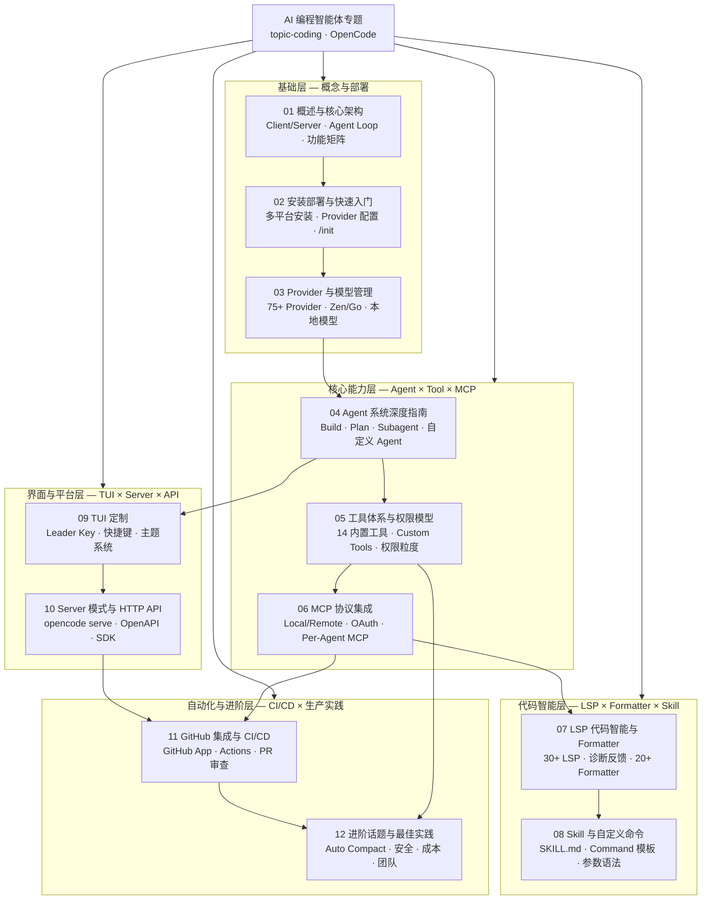

# AI 编程智能体专题 — OpenCode 全量指南

> **文档类型**: 专题索引 | **最后更新**: 2026-03 | **关键词**: OpenCode, AI Coding Agent, Terminal Agent, MCP, LSP, Agent CLI, TUI, LLM Provider, GitHub Automation

---

## 概述

本专题系统性地覆盖 **OpenCode** ——当前最具影响力的开源 AI 编程智能体（Coding Agent）——的全生命周期知识：从核心架构与安装部署，到 Provider 接入、Agent 系统、Tool/Permission 体系、MCP 协议集成、LSP 代码智能、Skill/Command 扩展，再到 TUI 定制、Server API、GitHub CI/CD 自动化和生产级进阶实践。

所有内容以 **2026 年最新官方文档和高质量社区实践** 为基础，提供可直接落地的配置示例、架构方案和最佳实践。本专题与 `topic-ai-agent`（Agent CLI 系列）深度联动，形成从 AI Agent 理论到 OpenCode 工程实践的完整知识闭环。

> OpenCode 由 Anomaly（原 SST 团队）主导开发，采用 Bun + Hono 后端 + Go TUI 前端的 Client/Server 架构，支持 75+ LLM Provider、30+ 内置 LSP Server、20+ 内置 Formatter，是终端环境下功能最完整的开源 AI 编程智能体。

---

## 文档目录

| 序号 | 文档 | 内容概要 | 适用角色 | 阅读耗时 |
|:---:|------|---------|---------|---------|
| 01 | [OpenCode 概述与核心架构](./01-opencode-overview-architecture.md) | 项目定位、核心功能矩阵、Client/Server 架构、Agent Loop 原理、与竞品对比 | 所有工程师 | 30min |
| 02 | [安装部署与快速入门](./02-opencode-installation-quickstart.md) | 多平台安装、Provider 配置、项目初始化、AGENTS.md、基础工作流 | 所有工程师 | 20min |
| 03 | [Provider 与模型管理](./03-opencode-providers-models.md) | 75+ Provider 接入、OpenCode Zen/Go、模型选型策略、Azure/AWS Bedrock | AI 工程师、架构师 | 25min |
| 04 | [Agent 系统深度指南](./04-opencode-agents-system.md) | Build/Plan/Subagent 架构、自定义 Agent（JSON/Markdown）、Temperature/Steps 调优 | 研发工程师、架构师 | 30min |
| 05 | [工具体系与权限模型](./05-opencode-tools-permissions.md) | 14 个内置工具、Custom Tools 开发、权限粒度控制、安全最佳实践 | 研发工程师、安全工程师 | 30min |
| 06 | [MCP 协议集成指南](./06-opencode-mcp-integration.md) | Local/Remote MCP Server、OAuth 认证、Per-Agent MCP、企业级实践 | 研发工程师、平台工程师 | 25min |
| 07 | [LSP 代码智能与 Formatter](./07-opencode-lsp-formatters.md) | 30+ 内置 LSP Server、诊断反馈循环、20+ 内置 Formatter、自定义配置 | 研发工程师 | 20min |
| 08 | [Agent Skill 与自定义命令](./08-opencode-skills-commands.md) | SKILL.md 规范、Skill 发现机制、Custom Command、模板语法、参数传递 | 研发工程师 | 20min |
| 09 | [TUI 定制：快捷键、主题与界面](./09-opencode-tui-customization.md) | Leader Key 体系、完整快捷键配置、内置主题、自定义主题 JSON 规范 | 所有工程师 | 15min |
| 10 | [Server 模式与 HTTP API](./10-opencode-server-api.md) | opencode serve 架构、OpenAPI 3.1 Spec、SDK 生成、Session/Message API | 平台工程师、架构师 | 25min |
| 11 | [GitHub 集成与 CI/CD 自动化](./11-opencode-github-automation.md) | GitHub App 安装、Actions Workflow、Issue 处理、PR 审查、定时任务 | SRE、平台工程师 | 25min |
| 12 | [进阶话题与生产最佳实践](./12-opencode-advanced-topics.md) | Auto Compact、Session 管理、非交互模式、安全加固、成本控制、团队协作 | 架构师、SRE | 30min |

---

## 内容结构全景

---

## 快速入口

**初学者 / 新手上路**：
1. [01 - 概述与架构](./01-opencode-overview-architecture.md) → [02 - 安装部署](./02-opencode-installation-quickstart.md) → [09 - TUI 定制](./09-opencode-tui-customization.md)

**AI 应用工程师**：
1. [03 - Provider 与模型](./03-opencode-providers-models.md) → [04 - Agent 系统](./04-opencode-agents-system.md) → [05 - 工具与权限](./05-opencode-tools-permissions.md) → [06 - MCP 集成](./06-opencode-mcp-integration.md)

**架构师 / 平台工程师**：
1. [10 - Server 模式](./10-opencode-server-api.md) → [11 - GitHub CI/CD](./11-opencode-github-automation.md) → [12 - 进阶话题](./12-opencode-advanced-topics.md)

**全栈开发工程师**：
1. [07 - LSP 与 Formatter](./07-opencode-lsp-formatters.md) → [08 - Skill 与命令](./08-opencode-skills-commands.md) → [05 - 自定义工具](./05-opencode-tools-permissions.md)

---

## 关联专题

| 专题/领域 | 与本专题的关系 |
|---------|--------------|
| [topic-ai-agent](../topic-ai-agent/) | Agent CLI 系列（23-28 篇）提供通用 Agent CLI 理论框架，本专题是 OpenCode 的深度实践 |
| [topic-ai-agent/24](../topic-ai-agent/24-agent-cli-tools-comparison.md) | 主流 Agent CLI 工具全景对比，包含 OpenCode 的横向评估 |
| [topic-ai-agent/25](../topic-ai-agent/25-agent-cli-mcp-integration.md) | MCP 协议通用指南，本专题聚焦 OpenCode 的 MCP 实现 |
| [domain-11-ai-infra](../domain-11-ai-infra/) | GPU 调度与 LLM 推理服务，为 OpenCode 本地模型部署提供基础设施 |
| [domain-12-troubleshooting](../domain-12-troubleshooting/) | K8s 运维知识语料，可作为 OpenCode MCP 工具的数据源 |

---

## 覆盖的关键技术

| 技术领域 | 覆盖内容 |
|---------|---------|
| **核心架构** | Bun + Hono HTTP Server、Go TUI (Bubble Tea)、Client/Server 分离、AI SDK |
| **LLM Provider** | OpenAI、Anthropic、Google Gemini、AWS Bedrock、Azure OpenAI、Groq、GitHub Copilot、OpenRouter、75+ Provider |
| **Agent 模式** | Build (全功能)、Plan (只读分析)、General/Explore (Subagent)、自定义 Agent |
| **内置工具** | bash、edit、write、read、grep、glob、list、patch、lsp、webfetch、websearch、todowrite/todoread、question、skill |
| **协议支持** | MCP (Model Context Protocol)、LSP (Language Server Protocol)、OAuth 2.1、OpenAPI 3.1 |
| **安全体系** | Granular Permission、Doom Loop 检测、External Directory 控制、.env 保护、沙箱隔离 |
| **CI/CD 集成** | GitHub Actions、Issue Triage、PR Review、Scheduled Tasks、Headless Mode |
| **扩展体系** | Agent Skills (SKILL.md)、Custom Commands、Custom Tools (TypeScript)、MCP Server |

---

*本专题为 kudig-database 项目原创内容，基于 OpenCode 官方文档（opencode.ai/docs）和高质量社区实践整理。*
