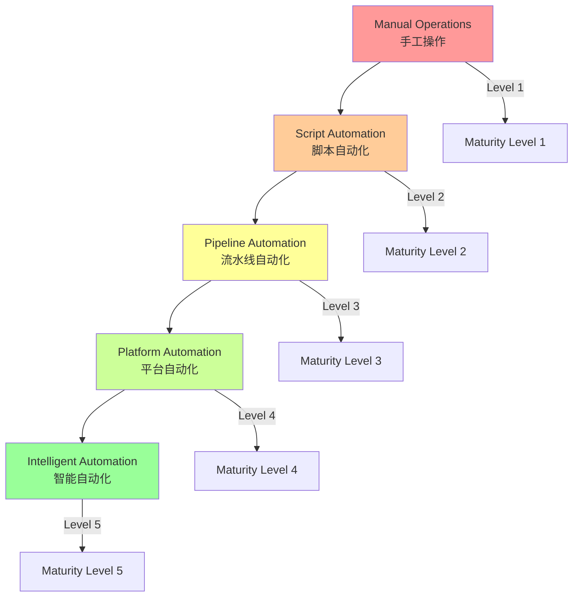
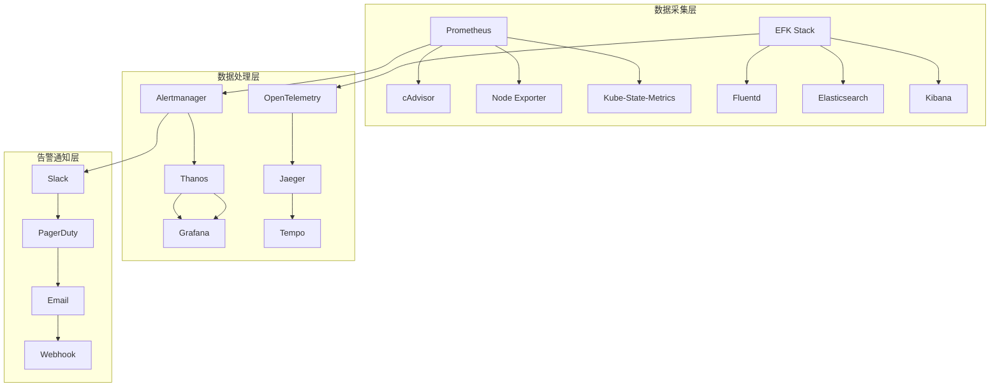
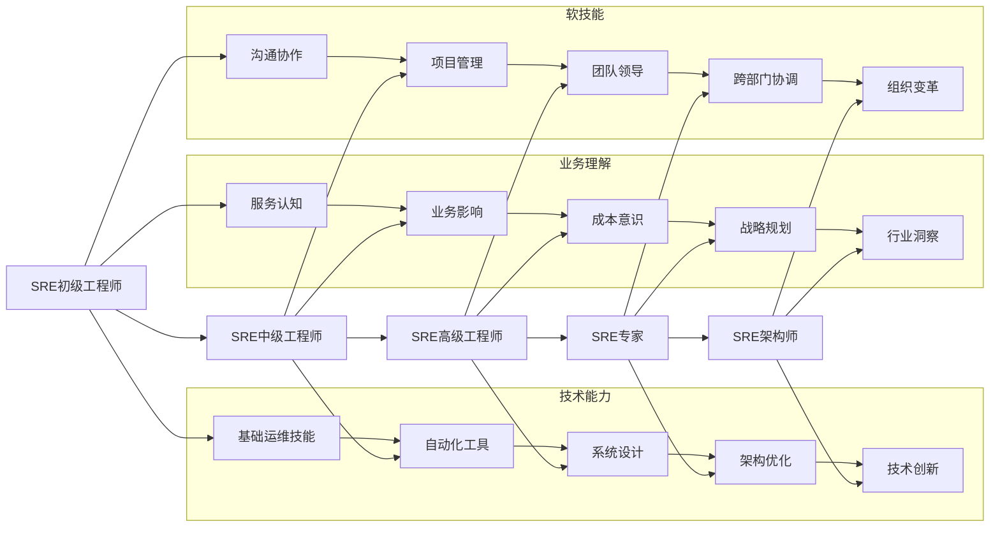
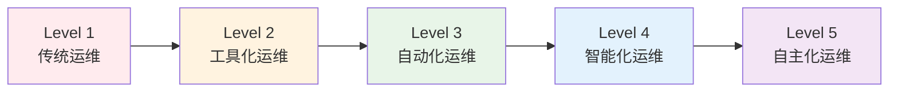

# 04 - SRE运维成熟度模型

> **适用版本**: Kubernetes v1.25-v1.32 | **最后更新**: 2026-02 | **作者**: Allen Galler | **质量等级**: ⭐⭐⭐⭐⭐ 专家级

> **SRE实践进阶指南**: 基于Google SRE理念和企业级实践经验，构建完整的运维成熟度评估和提升体系

---

## 知识地图

**本文定位**: SRE运维成熟度评估体系 - 从传统运维到SRE卓越实践的完整转型路线图

**面向读者**: 
- 初学者: 刚接触SRE概念,希望了解SRE是什么以及如何开始
- 中级读者: 有一定运维经验,希望系统化提升团队成熟度
- 专家级读者: 寻求企业级SRE转型最佳实践和成熟度评估方法

**前置知识要求**:
- 基础: Kubernetes基本概念、容器化基础知识
- 中级: 监控告警体系、CI/CD流程、基础自动化能力
- 高级: 分布式系统架构、SLO/SLI体系、AIOps理念

**关联文件**:
- [01-operations-best-practices.md](./01-operations-best-practices.md) - 运维最佳实践
- [02-failure-patterns-analysis.md](./02-failure-patterns-analysis.md) - 故障模式分析
- [03-capacity-planning-strategies.md](./03-capacity-planning-strategies.md) - 容量规划策略
- [../topic-structural-trouble-shooting/README.md](../topic-structural-trouble-shooting/README.md) - 结构化故障排查

**学习路径**:
1. 先了解当前团队所处的成熟度等级(第1节)
2. 评估各领域能力短板(第2-5节)
3. 使用评估工具量化当前状态(第6节)
4. 参考实践案例制定改进计划(第7节)

---

## 目录

- [知识地图](#知识地图)
- [1. 运维成熟度评估标准](#1-运维成熟度评估标准)
- [2. 自动化能力分级](#2-自动化能力分级)
- [3. 监控体系建设指南](#3-监控体系建设指南)
- [4. 运维流程标准化](#4-运维流程标准化)
- [5. 团队能力建设路径](#5-团队能力建设路径)
- [6. 成熟度评估工具](#6-成熟度评估工具)
- [7. SRE实践案例与最佳实践](#7-sre实践案例与最佳实践)
- [关联阅读](#关联阅读)

---

## 1. 运维成熟度评估标准

### 概念解析

**一句话定义**: 运维成熟度评估标准是衡量组织从传统运维向现代化SRE体系演进的分级框架,通过5个等级评估团队在可靠性、自动化、监控、流程和人员能力等维度的发展水平。

**类比**: 就像公司的成长阶段——从创业初期的"游击队"作战(Level 1手工作坊),到有基本管理制度的小公司(Level 2工具辅助),再到流程规范的成熟企业(Level 3标准化),最后演进为数据驱动的智能化组织(Level 4-5),每个阶段都有清晰的特征和转型重点。

**核心要点**:
- **五级成熟度模型**: Level 1手工作坊式 → Level 2工具辅助式 → Level 3流程规范化 → Level 4智能化运营 → Level 5自主进化式
- **多维度评估**: 涵盖可靠性工程、自动化能力、可观测性、流程标准化、团队能力五大核心领域
- **量化指标驱动**: 每个等级都有明确的MTTR、SLA达成率、自动化覆盖率等可衡量指标
- **渐进式演进路径**: 不可跨越式发展,需要循序渐进地从当前等级向更高等级迈进

### 原理深入

**成熟度模型理论基础**:

运维成熟度模型基于CMMI(能力成熟度模型集成)理论,结合Google SRE最佳实践演化而来。其核心原理包括:

1. **能力域分解**: 将复杂的运维体系分解为可评估的5个独立能力域
2. **等级渐进性**: 每个等级建立在前一等级的能力基础之上,具有明确的演进路径
3. **量化可测**: 通过MTTR、SLA、自动化率等指标实现客观评估
4. **持续改进**: 评估结果指导下一阶段的改进计划和资源投入

**为什么需要成熟度评估?**
- **明确现状**: 客观了解团队当前所处位置
- **找准方向**: 确定下一步改进的优先级
- **量化进展**: 用数据跟踪提升效果
- **对标学习**: 与行业最佳实践进行比较

### 渐进式示例

**Level 1 - 基础示例(手工作坊式)**:
```bash
# 典型场景:手工部署应用
ssh user@server
cd /opt/app
git pull origin main
./build.sh
./stop.sh
./start.sh
tail -f logs/app.log  # 人工观察是否启动成功
```
**特征**: 完全依赖人工操作,无标准流程,故障响应靠经验

**Level 2 - 工具辅助示例**:
```bash
# 使用脚本自动化部署
#!/bin/bash
deploy.sh --env=production --app=web-api
```
**特征**: 有基本脚本和工具,但仍需人工触发和监控

**Level 3 - 生产最佳实践(参考现有内容)**:
见1.2节的完整YAML配置示例,包含自动化监控、标准化流程、CI/CD集成等企业级实践。

### 1.1 成熟度等级定义

| 等级 | 名称 | 特征描述 | 关键指标 | 典型表现 |
|-----|------|---------|---------|---------|
| **Level 1** | 手工作坊式 | 人工操作为主，缺乏标准化 | MTTR > 4小时 | 频繁救火，被动响应 |
| **Level 2** | 工具辅助式 | 开始使用工具，部分自动化 | MTTR 1-4小时 | 有基本工具，但仍需大量手工 |
| **Level 3** | 流程规范化 | 建立标准流程，较多自动化 | MTTR 30分钟-1小时 | 流程清晰，大部分可自动化 |
| **Level 4** | 智能化运营 | 高度自动化，智能决策 | MTTR < 30分钟 | 主动预防，智能响应 |
| **Level 5** | 自主进化式 | 全自动运维，持续优化 | MTTR < 10分钟 | 自愈能力强，预测性维护 |

### 1.2 核心能力域评估

```yaml
# ========== 运维成熟度评估框架 ==========
apiVersion: sre.example.com/v1
kind: OperationsMaturityAssessment
metadata:
  name: k8s-operations-maturity
spec:
  assessmentDate: "2026-02-05"
  assessedTeam: "platform-sre"
  
  capabilityDomains:
    # 可靠性工程
    reliabilityEngineering:
      currentLevel: 3
      targetLevel: 5
      indicators:
      - slaAchievement: "99.9%"
      - mttr: "25m"
      - changeSuccessRate: "95%"
      
    # 自动化能力
    automationCapability:
      currentLevel: 2
      targetLevel: 4
      indicators:
      - manualTasksRatio: "30%"
      - ciCdPipelineCoverage: "80%"
      - autoRemediationRate: "60%"
      
    # 监控可观测性
    observability:
      currentLevel: 3
      targetLevel: 5
      indicators:
      - metricCoverage: "85%"
      - logCentralization: "95%"
      - alertAccuracy: "80%"
      
    # 流程规范性
    processStandardization:
      currentLevel: 2
      targetLevel: 4
      indicators:
      - documentedProcesses: "70%"
      - complianceRate: "85%"
      - auditFindings: "low"
      
    # 团队能力
    teamCapability:
      currentLevel: 2
      targetLevel: 4
      indicators:
      - skillAssessmentScore: "7.2/10"
      - crossTrainingCoverage: "60%"
      - knowledgeSharingFrequency: "weekly"
```

### 1.3 评估维度详细标准

#### 可靠性工程成熟度

**Level 1 - 初级阶段**
- 无明确的SLA/SLO定义
- 故障响应完全依赖人工
- 缺乏容量规划
- 变更管理混乱

**Level 2 - 基础阶段**
- 制定基本SLA指标
- 建立简单监控告警
- 有初步容量评估
- 变更需要手动审批

**Level 3 - 标准阶段**
- 完善的SLO体系
- 自动化监控告警
- 定期容量规划
- 标准化变更流程

**Level 4 - 优秀阶段**
- 智能SLO管理
- 预测性监控
- 自动容量伸缩
- 灰度发布机制

**Level 5 - 卓越阶段**
- 自适应SLO调整
- 主动异常预测
- 智能容量优化
- 无人值守变更

### 常见误区与最佳实践

**常见误区**:
1. **误区1: 试图跨越式发展** - 直接从Level 1跳到Level 4,忽视基础能力建设
   - **问题**: 基础不牢,高级功能无法落地,反而造成资源浪费
   
2. **误区2: 只关注工具,忽视文化** - 购买大量自动化工具但团队思维未转变
   - **问题**: 工具无人用,或用不好,投资回报率低
   
3. **误区3: 成熟度评估流于形式** - 为了评分而评分,不关注实际改进
   - **问题**: 评估变成走过场,无法真正指导团队发展
   
4. **误区4: 忽视业务特性盲目对标** - 完全照搬大厂实践,不考虑自身实际情况
   - **问题**: 水土不服,造成资源浪费和团队挫败感

**最佳实践**:
1. **循序渐进,稳扎稳打** 
   - 先夯实当前等级的基础能力,再向下一等级迈进
   - 制定3-6个月的阶段性目标,避免好高骛远
   
2. **技术与文化并重**
   - 在引入工具的同时,加强团队培训和文化建设
   - 通过故障复盘、技术分享等方式培养工程师思维
   
3. **数据驱动的持续改进**
   - 定期(如每季度)进行成熟度评估,跟踪改进进展
   - 将评估结果与KPI挂钩,确保改进落地
   
4. **结合业务实际,灵活应用**
   - 根据业务特点调整评估权重和指标
   - 从最痛的问题入手,快速见效以建立信心

**成熟度提升路线图建议**:
```
第一季度: 完成基线评估 → 识别薄弱环节 → 制定改进计划
第二季度: 聚焦1-2个核心能力域突破 → 建立示范项目
第三季度: 复制推广成功经验 → 扩大改进范围
第四季度: 全面评估效果 → 规划下一年度目标
```

---

## 2. 自动化能力分级

**Level 1 - 手工操作**
```bash
# 人工部署应用
kubectl apply -f deployment.yaml
kubectl apply -f service.yaml
kubectl apply -f configmap.yaml
```

**Level 2 - 脚本化**
```bash
#!/bin/bash
# 部署脚本 deploy.sh
kubectl apply -f k8s/
kubectl rollout status deployment/app
kubectl get pods -l app=app
```

**Level 3 - 流水线化**
```yaml
# CI/CD流水线配置
pipeline:
  stages:
    - build:
        script:
          - docker build -t $IMAGE_NAME .
          - docker push $IMAGE_NAME
    - deploy:
        script:
          - kubectl set image deployment/app app=$IMAGE_NAME
          - kubectl rollout status deployment/app
    - test:
        script:
          - curl -f http://service-endpoint/health
```

**Level 4 - GitOps化**
```yaml
# ArgoCD应用配置
apiVersion: argoproj.io/v1alpha1
kind: Application
metadata:
  name: production-app
spec:
  source:
    repoURL: https://github.com/company/app.git
    targetRevision: HEAD
    path: k8s/overlays/production
  destination:
    server: https://kubernetes.default.svc
    namespace: production
  syncPolicy:
    automated:
      prune: true
      selfHeal: true
```

**Level 5 - 智能化**
```yaml
# 智能运维平台配置
apiVersion: aiops.example.com/v1
kind: IntelligentOperations
metadata:
  name: smart-deployment
spec:
  deploymentStrategy:
    canaryAnalysis:
      duration: "10m"
      metrics:
      - name: error-rate
        threshold: 0.01
        interval: "1m"
      - name: latency-p95
        threshold: "200ms"
        interval: "1m"
    autoRollback:
      enabled: true
      conditions:
      - metric: error-rate
        operator: ">"
        value: "0.05"
```

---

## 2. 自动化能力分级

### 概念解析

**一句话定义**: 自动化能力分级是将运维自动化从手工操作逐步演进到智能自愈的5层能力模型,每一层都代表着运维效率和可靠性的显著提升。

**类比**: 就像制造业的演进——从手工作坊(Level 1人工操作)到机械化生产(Level 2脚本化),再到流水线(Level 3流水线化)、智能工厂(Level 4 GitOps化),最终达到无人工厂(Level 5智能化),每一步都大幅提升生产效率和质量稳定性。

**核心要点**:
- **五层自动化模型**: 手工 → 脚本 → 流水线 → GitOps → 智能化,每层能力递进
- **效率倍增效应**: 每提升一层,运维效率提升3-5倍,人为错误降低50%以上
- **可重复性保障**: 自动化的核心是将人的经验固化为代码,确保操作一致性
- **持续优化闭环**: 自动化不是一次性项目,需要持续监控、反馈和改进

### 原理深入

**自动化能力演进逻辑**:

1. **Level 1→2 (手工→脚本化)**:
   - **动力**: 重复性操作频繁,人工成本高且易错
   - **方法**: 将常用命令封装成Shell/Python脚本
   - **收益**: 操作时间缩短50-70%,标准化程度提升

2. **Level 2→3 (脚本→流水线)**:
   - **动力**: 脚本分散管理困难,缺乏统一编排和状态管理
   - **方法**: 引入CI/CD平台(Jenkins/GitLab CI/GitHub Actions)
   - **收益**: 实现端到端自动化,可追溯性和回滚能力增强

3. **Level 3→4 (流水线→GitOps)**:
   - **动力**: 配置漂移严重,实际状态与期望状态不一致
   - **方法**: 采用声明式配置+Git版本控制+自动同步(ArgoCD/FluxCD)
   - **收益**: 配置即代码,审计能力强,自愈能力初步形成

4. **Level 4→5 (GitOps→智能化)**:
   - **动力**: 需要根据业务负载动态调整,人工决策滞后
   - **方法**: 引入AI/ML进行预测和决策,实现自适应运维
   - **收益**: 主动预防故障,智能容量规划,接近无人值守

### 渐进式示例

**Level 1 - 手工操作示例**:
```bash
# 场景:部署新版本应用(完全手工)
kubectl apply -f deployment.yaml
kubectl apply -f service.yaml
kubectl get pods  # 手动检查状态
kubectl logs pod-name  # 手动查看日志确认
```
**痛点**: 步骤繁琐,容易遗漏,无法批量操作

**Level 2 - 脚本化示例**:
```bash
#!/bin/bash
# deploy.sh - 封装部署步骤
set -e
echo "开始部署应用..."
kubectl apply -f k8s/
kubectl rollout status deployment/app --timeout=300s
kubectl get pods -l app=myapp
echo "部署完成!"
```
**改进**: 标准化流程,减少人为错误

**Level 3 - 流水线化示例(参考现有内容)**:
见2.2节中的完整CI/CD流水线配置示例,包含构建、测试、部署全流程自动化。

**Level 4-5 - 高级实践(参考现有内容)**:
见2.2节中的GitOps和智能化运维平台配置示例。

### 2.1 自动化层次模型



### 2.2 关键自动化场景

#### 基础设施自动化

```yaml
# ========== Terraform基础设施即代码 ==========
# main.tf
terraform {
  required_providers {
    kubernetes = {
      source  = "hashicorp/kubernetes"
      version = "~> 2.0"
    }
  }
}

provider "kubernetes" {
  config_path = "~/.kube/config"
}

# EKS集群创建
resource "aws_eks_cluster" "main" {
  name     = "production-cluster"
  role_arn = aws_iam_role.cluster.arn
  
  vpc_config {
    subnet_ids = aws_subnet.private[*].id
  }
  
  # 启用集群日志
  enabled_cluster_log_types = ["api", "audit", "authenticator"]
}

# 节点组管理
resource "aws_eks_node_group" "general" {
  cluster_name    = aws_eks_cluster.main.name
  node_group_name = "general-workers"
  node_role_arn   = aws_iam_role.node.arn
  
  scaling_config {
    desired_size = 3
    max_size     = 10
    min_size     = 2
  }
  
  instance_types = ["t3.medium"]
  capacity_type  = "ON_DEMAND"
}
```

#### 应用部署自动化

```yaml
# ========== Helm Chart标准化模板 ==========
# Chart.yaml
apiVersion: v2
name: standard-application
version: 1.0.0
description: Standard application deployment template
type: application

# values.yaml
replicaCount: 3

image:
  repository: nginx
  tag: stable
  pullPolicy: IfNotPresent

service:
  type: ClusterIP
  port: 80

resources:
  limits:
    cpu: 100m
    memory: 128Mi
  requests:
    cpu: 100m
    memory: 128Mi

autoscaling:
  enabled: true
  minReplicas: 1
  maxReplicas: 10
  targetCPUUtilizationPercentage: 80

# templates/deployment.yaml
apiVersion: apps/v1
kind: Deployment
metadata:
  name: {{ include "standard-application.fullname" . }}
  labels:
    {{- include "standard-application.labels" . | nindent 4 }}
spec:
  replicas: {{ .Values.replicaCount }}
  selector:
    matchLabels:
      {{- include "standard-application.selectorLabels" . | nindent 6 }}
  template:
    metadata:
      labels:
        {{- include "standard-application.selectorLabels" . | nindent 8 }}
    spec:
      containers:
        - name: {{ .Chart.Name }}
          image: "{{ .Values.image.repository }}:{{ .Values.image.tag }}"
          imagePullPolicy: {{ .Values.image.pullPolicy }}
          ports:
            - name: http
              containerPort: 80
              protocol: TCP
          resources:
            {{- toYaml .Values.resources | nindent 12 }}
```

#### 故障自愈自动化

```yaml
# ========== 自愈Operator配置 ==========
apiVersion: autoscaling.k8s.io/v1
kind: SelfHealingOperator
metadata:
  name: intelligent-healing
  namespace: kube-system
spec:
  healingRules:
  # Pod重启自愈
  - name: pod-restart-healing
    condition: |
      rate(container_restarts_total[5m]) > 2
      and
      kube_pod_status_ready{condition="true"} == 0
    action: restartPod
    cooldown: 300s
    maxAttempts: 3
    
  # 节点故障转移
  - name: node-failure-mitigation
    condition: |
      kube_node_status_condition{condition="Ready",status="false"} == 1
      and
      time() - kube_node_created > 300
    action: drainAndCordon
    cooldown: 600s
    
  # 资源优化调整
  - name: resource-auto-tuning
    condition: |
      container_memory_working_set_bytes / kube_pod_container_resource_limits_memory_bytes > 0.9
    action: scaleResources
    parameters:
      memoryScaleFactor: 1.2
      cpuScaleFactor: 1.1
      maxMemoryLimit: 4Gi

---
# ========== Chaos Engineering自动化 ==========
apiVersion: chaos-mesh.org/v1alpha1
kind: Schedule
metadata:
  name: weekly-chaos-test
  namespace: chaos-testing
spec:
  schedule: "0 2 * * 0"  # 每周日凌晨2点
  concurrencyPolicy: Forbid
  historyLimit: 5
  type: Workflow
  workflow:
    entry: entry
    templates:
    - name: entry
      templateType: Serial
      children:
      - network-delay
      - pod-kill
      - container-kill
      
    - name: network-delay
      templateType: NetworkChaos
      deadline: 300s
      networkChaos:
        action: delay
        mode: one
        selector:
          namespaces:
          - production
          labelSelectors:
            app: critical-service
        delay:
          latency: "10ms"
          correlation: "25"
          jitter: "0ms"
          
    - name: pod-kill
      templateType: PodChaos
      deadline: 60s
      podChaos:
        action: pod-kill
        mode: fixed-percent
        value: "10"
        selector:
          namespaces:
          - production
```

### 常见误区与最佳实践

**常见误区**:
1. **误区1: 为了自动化而自动化** - 对低频操作过度自动化,投入产出比低
   - **问题**: 开发和维护自动化脚本的成本超过手工操作的成本
   
2. **误区2: 忽视自动化代码质量** - 把自动化脚本当成一次性工具,不做代码审查和测试
   - **问题**: 自动化脚本本身成为故障源,反而降低可靠性
   
3. **误区3: 缺乏异常处理和回滚机制** - 自动化流程没有容错设计
   - **问题**: 自动化执行失败后无法恢复,造成更大范围故障
   
4. **误区4: 追求100%自动化** - 试图自动化所有操作,包括复杂决策
   - **问题**: 某些需要人工判断的场景强行自动化,反而增加风险

**最佳实践**:
1. **ROI驱动的自动化优先级**
   - 优先自动化高频、高风险、耗时长的操作
   - 使用公式: 自动化价值 = (手工耗时 × 执行频率 × 人力成本) - 自动化开发维护成本
   
2. **自动化代码工程化**
   - 自动化脚本纳入Git版本管理
   - 必须经过代码审查和测试才能上线
   - 定期重构和优化自动化代码
   
3. **构建安全网机制**
   - 自动化流程必须包含前置检查(pre-check)
   - 关键操作前人工审批或二次确认
   - 完善的回滚和恢复机制
   
4. **渐进式自动化策略**
   - 从"半自动化"开始(人工触发,自动执行)
   - 积累信心后再转向"全自动化"(自动触发,自动执行)
   - 保留人工介入的通道,确保可控性

**自动化成功案例**:
```markdown
某互联网公司的自动化演进路径:
- 第1季度: 自动化部署,减少80%部署时间
- 第2季度: 自动化扩缩容,降低30%资源成本
- 第3季度: 自动化故障恢复,MTTR从45分钟降至8分钟
- 第4季度: 智能化容量规划,预测准确率达85%
```

---

## 3. 监控体系建设指南

### 概念解析

**一句话定义**: 监控体系是运维团队的"眼睛和耳朵",通过采集、存储、分析和告警系统运行数据,实现对系统健康状况的全面感知和主动预警。

**类比**: 就像医院的患者监控系统——心电图监测心跳(指标采集)、CT扫描诊断病灶(日志分析)、手术录像回溯(链路追踪)、异常指标触发警报(告警通知),医生根据监控数据做出诊疗决策(运维决策)。

**核心要点**:
- **三大支柱(Observability三要素)**: Metrics(指标)、Logs(日志)、Traces(链路追踪)
- **分层监控架构**: 基础设施层 → 平台层 → 应用层 → 业务层,每层都有专属监控指标
- **告警不等于监控**: 监控是持续观察,告警是异常通知;好的告警策略能减少90%的噪音
- **可观测性>监控**: 可观测性强调系统内部状态的透明度,不仅仅是被动监控

### 原理深入

**监控体系演进历程**:

1. **第一代:基础监控(Zabbix时代)**
   - **特点**: 主机级监控,单机采集
   - **局限**: 无法适应云原生动态环境
   
2. **第二代:时序监控(Prometheus时代)**
   - **特点**: 拉模式采集,PromQL查询,适配容器化
   - **优势**: 动态服务发现,多维度标签
   
3. **第三代:可观测性平台(OpenTelemetry时代)**
   - **特点**: 统一标准,Metrics/Logs/Traces融合
   - **优势**: 全链路可追溯,智能关联分析

**为什么需要监控体系?**
- **故障快速定位**: 无监控的情况下,定位问题平均耗时2-4小时;有完善监控10-30分钟
- **容量规划依据**: 基于历史监控数据预测未来资源需求
- **性能优化指引**: 监控数据揭示系统瓶颈点
- **业务价值验证**: 通过业务指标监控验证技术改进的业务效果

### 渐进式示例

**Level 1 - 基础监控示例**:
```yaml
# 最简单的Pod监控 - 手动检查
apiVersion: v1
kind: Pod
metadata:
  name: my-app
spec:
  containers:
  - name: app
    image: myapp:latest
    livenessProbe:
      httpGet:
        path: /health
        port: 8080
      initialDelaySeconds: 30
      periodSeconds: 10
```
**特点**: 仅有存活性检查,无指标采集

**Level 2 - 标准Prometheus监控**:
```yaml
# 添加Prometheus ServiceMonitor
apiVersion: monitoring.coreos.com/v1
kind: ServiceMonitor
metadata:
  name: my-app-monitor
spec:
  selector:
    matchLabels:
      app: my-app
  endpoints:
  - port: metrics
    interval: 30s
```
**特点**: 自动采集指标,需手动配置告警规则

**Level 3 - 完整可观测性(参考现有内容)**:
见3.2节和3.3节的完整Prometheus+OpenTelemetry配置示例,包含指标、日志、链路追踪全覆盖。

### 3.1 监控体系架构



### 3.2 核心监控指标体系

```yaml
# ========== Prometheus监控配置 ==========
apiVersion: monitoring.coreos.com/v1
kind: Prometheus
metadata:
  name: k8s-monitoring
  namespace: monitoring
spec:
  serviceAccountName: prometheus
  serviceMonitorSelector:
    matchLabels:
      team: sre
  ruleSelector:
    matchLabels:
      role: alert-rules
  resources:
    requests:
      memory: 400Mi
    limits:
      memory: 2Gi
      
---
# ========== 核心监控规则 ==========
apiVersion: monitoring.coreos.com/v1
kind: PrometheusRule
metadata:
  name: core-monitoring-rules
  namespace: monitoring
spec:
  groups:
  # 系统级别监控
  - name: system.metrics
    rules:
    - alert: HighCPUUsage
      expr: |
        100 - (avg by(instance) (rate(node_cpu_seconds_total{mode="idle"}[5m])) * 100) > 85
      for: 5m
      labels:
        severity: warning
      annotations:
        summary: "节点CPU使用率过高 ({{ $value }}%)"
        
    - alert: HighMemoryUsage
      expr: |
        (node_memory_MemAvailable_bytes / node_memory_MemTotal_bytes * 100) < 15
      for: 5m
      labels:
        severity: warning
      annotations:
        summary: "节点内存使用率过高 ({{ $value }}%)"
        
    - alert: DiskSpaceLow
      expr: |
        (node_filesystem_avail_bytes{fstype!="tmpfs"} / node_filesystem_size_bytes{fstype!="tmpfs"} * 100) < 10
      for: 10m
      labels:
        severity: critical
      annotations:
        summary: "磁盘空间不足 (< 10%)"
        
  # Kubernetes组件监控
  - name: k8s.components
    rules:
    - alert: APIServerDown
      expr: up{job="apiserver"} == 0
      for: 2m
      labels:
        severity: critical
      annotations:
        summary: "API Server不可用"
        
    - alert: EtcdHighFsyncLatency
      expr: |
        histogram_quantile(0.99, etcd_disk_backend_commit_duration_seconds_bucket) > 0.5
      for: 5m
      labels:
        severity: warning
      annotations:
        summary: "etcd fsync延迟过高"
        
    - alert: SchedulerDown
      expr: up{job="kube-scheduler"} == 0
      for: 1m
      labels:
        severity: critical
      annotations:
        summary: "调度器不可用"
        
  # 应用级别监控
  - name: application.metrics
    rules:
    - alert: HighErrorRate
      expr: |
        rate(http_requests_total{code=~"5.."}[5m]) / rate(http_requests_total[5m]) > 0.05
      for: 2m
      labels:
        severity: warning
      annotations:
        summary: "HTTP错误率过高 ({{ $value }}%)"
        
    - alert: HighLatency
      expr: |
        histogram_quantile(0.95, http_request_duration_seconds_bucket) > 1
      for: 5m
      labels:
        severity: warning
      annotations:
        summary: "HTTP响应延迟过高 (> 1s)"
        
    - alert: LowAvailability
      expr: |
        avg_over_time(up{job="application"}[1h]) < 0.99
      for: 10m
      labels:
        severity: critical
      annotations:
        summary: "应用可用性低于SLA ({{ $value }}%)"
```

### 3.3 可观测性最佳实践

```yaml
# ========== OpenTelemetry配置 ==========
apiVersion: opentelemetry.io/v1alpha1
kind: OpenTelemetryCollector
metadata:
  name: otel-collector
  namespace: observability
spec:
  mode: deployment
  config:
    receivers:
      otlp:
        protocols:
          grpc:
          http:
      jaeger:
        protocols:
          thrift_http:
      zipkin:
      
    processors:
      batch:
      memory_limiter:
        limit_mib: 400
        spike_limit_mib: 100
        
    exporters:
      jaeger:
        endpoint: jaeger-collector:14250
        tls:
          insecure: true
      prometheus:
        endpoint: "0.0.0.0:8889"
        
    service:
      pipelines:
        traces:
          receivers: [otlp, jaeger, zipkin]
          processors: [memory_limiter, batch]
          exporters: [jaeger]
        metrics:
          receivers: [otlp]
          processors: [memory_limiter, batch]
          exporters: [prometheus]

---
# ========== 应用埋点配置示例 ==========
# Java应用配置
apiVersion: v1
kind: ConfigMap
metadata:
  name: app-telemetry-config
  namespace: production
data:
  application.properties: |
    # OpenTelemetry配置
    otel.traces.exporter=otlp
    otel.metrics.exporter=otlp
    otel.exporter.otlp.endpoint=http://otel-collector:4317
    otel.service.name=my-java-app
    otel.resource.attributes=environment=production,version=v1.0
    
    # Micrometer配置
    management.endpoints.web.exposure.include=health,info,metrics,prometheus
    management.metrics.distribution.percentiles-histogram.http.server.requests=true
    management.metrics.enable.jvm=true

# Go应用配置
apiVersion: v1
kind: ConfigMap
metadata:
  name: go-app-config
  namespace: production
data:
  main.go: |
    import (
        "go.opentelemetry.io/otel"
        "go.opentelemetry.io/otel/exporters/otlp/otlptrace"
        "go.opentelemetry.io/otel/sdk/resource"
        "go.opentelemetry.io/otel/sdk/trace"
        semconv "go.opentelemetry.io/otel/semconv/v1.4.0"
    )
    
    func initTracer() (*trace.TracerProvider, error) {
        exp, err := otlptrace.New(context.Background(), 
            otlptrace.WithEndpoint("otel-collector:4317"),
            otlptrace.WithInsecure())
        if err != nil {
            return nil, err
        }
        
        tp := trace.NewTracerProvider(
            trace.WithBatcher(exp),
            trace.WithResource(resource.NewWithAttributes(
                semconv.SchemaURL,
                semconv.ServiceNameKey.String("my-go-app"),
                semconv.DeploymentEnvironmentKey.String("production"),
            )),
        )
        
        otel.SetTracerProvider(tp)
        return tp, nil
    }
```

### 常见误区与最佳实践

**常见误区**:
1. **误区1: 监控指标越多越好** - 采集一切可采集的指标,造成海量数据冗余
   - **问题**: 存储成本暴增,查询变慢,关键指标被淹没在噪音中
   
2. **误区2: 告警阈值设置不合理** - 阈值过低导致告警轰炸,过高导致漏报
   - **问题**: 团队对告警麻木(狼来了效应),真正故障时反应迟钝
   
3. **误区3: 只监控不分析** - 采集大量数据但缺乏有效利用
   - **问题**: 监控系统成为摆设,无法为决策提供支持
   
4. **误区4: 忽视监控系统自身可靠性** - 监控系统本身没有高可用保障
   - **问题**: 关键时刻监控系统先挂了,无法发现和定位故障

**最佳实践**:
1. **USE+RED黄金指标法**
   - **USE法**(针对资源): Utilization(使用率)、Saturation(饱和度)、Errors(错误)
   - **RED法**(针对服务): Rate(请求速率)、Errors(错误率)、Duration(延迟)
   - 优先监控这些核心指标,避免指标泛滥
   
2. **基于SLO的智能告警**
   - 告警不应基于单一指标阈值,而应基于SLO消耗速率
   - 使用多窗口多燃烧率告警(Multi-Window Multi-Burn-Rate Alerts)
   - 示例: 1小时内消耗2%的错误预算触发告警
   
3. **构建可观测性文化**
   - 每次故障后完善监控盲区
   - 定期进行监控演练(Chaos Engineering)
   - 监控数据可视化并向全员开放
   
4. **监控系统分层高可用设计**
   - 关键告警通道独立部署(如独立的Alertmanager集群)
   - 监控数据多副本存储(Thanos/Cortex)
   - 监控系统本身被更高层级监控(健康检查)

**告警优化实战经验**:
```markdown
某团队告警优化成果:
- 优化前: 每天告警300+条,90%误报,团队疲于应对
- 优化后: 每天告警20-30条,95%准确率,MTTR降低60%

优化措施:
1. 删除70%的低价值告警规则
2. 调整阈值为动态基线(基于历史数据)
3. 告警分级:P0立即响应、P1 15分钟、P2工作时间处理
4. 告警聚合:相关告警合并为一条通知
```

---

## 4. 运维流程标准化

### 概念解析

**一句话定义**: 运维流程标准化是将运维活动从随意性的个人经验转变为可重复、可审计、可优化的标准化操作规程(SOP),确保团队协作的一致性和可预测性。

**类比**: 就像航空公司的飞行检查清单——起飞前必须完成的安全检查项、应急情况的标准处置流程、机组人员的协作规范,每一步都有明确规定,确保99.9999%的安全率,即使飞行员更换也不影响操作质量。

**核心要点**:
- **标准化四大流程**: 变更管理、故障响应、容量规划、配置管理
- **流程三要素**: 输入(触发条件)、过程(操作步骤)、输出(交付物和状态变更)
- **可审计性**: 所有关键操作都有日志记录,支持事后追溯和合规审查
- **持续改进**: 流程不是一成不变,需要根据实践反馈不断优化

### 原理深入

**为什么需要流程标准化?**

1. **降低人为错误**: 80%的生产故障由人为操作失误引起,标准化流程可将此类错误降低70%
2. **提升协作效率**: 团队成员遵循统一流程,减少沟通成本和理解偏差
3. **支持合规要求**: 金融、医疗等行业需要审计跟踪,标准化流程是合规基础
4. **知识传承**: 将个人经验固化为流程文档,降低人员流动风险

**流程成熟度演进路径**:
- Level 1: 无流程,凭经验操作
- Level 2: 有文档但不强制执行
- Level 3: 流程规范化且工具辅助执行
- Level 4: 流程自动化,人工审批关键节点
- Level 5: 智能化流程,AI辅助决策

### 渐进式示例

**Level 1 - 无流程示例**:
```bash
# 开发者直接操作生产环境
kubectl delete pod xxx  # 随意重启Pod
kubectl edit deployment yyy  # 直接修改配置
# 无记录,无审批,无回滚计划
```
**风险**: 误操作无法追溯,影响范围不可控

**Level 2 - 基础流程文档**:
```markdown
# 变更操作SOP
1. 在变更管理系统创建工单
2. 填写变更内容和影响范围
3. 等待负责人审批
4. 审批通过后执行变更
5. 记录变更结果,关闭工单
```
**改进**: 有规范但仍需人工检查,容易遗漏步骤

**Level 3-4 - 自动化流程(参考现有内容)**:
见4.2节的GitHub Actions CI/CD流水线示例,流程步骤自动执行,关键点人工审批。

### 4.1 标准化流程框架

```yaml
# ========== DevOps流程标准化 ==========
apiVersion: devops.example.com/v1
kind: StandardOperatingProcedure
metadata:
  name: k8s-operations-sop
spec:
  procedures:
    # 变更管理流程
    changeManagement:
      process:
        - initiate: "提交变更申请"
        - review: "技术评审和风险评估"
        - approve: "变更委员会审批"
        - schedule: "安排变更窗口"
        - implement: "执行变更操作"
        - validate: "验证变更结果"
        - rollback: "必要时回滚"
        - close: "关闭变更记录"
      
      automation:
        level: "high"  # 高度自动化
        tools:
          - name: "GitOps"
            purpose: "配置即代码"
          - name: "ArgoCD"
            purpose: "自动化部署"
          - name: "ChaosMesh"
            purpose: "变更前验证"
      
    # 故障处理流程
    incidentResponse:
      escalationLevels:
        - level: 1
          responseTime: "15m"
          team: "一线SRE"
        - level: 2
          responseTime: "1h"
          team: "二线专家"
        - level: 3
          responseTime: "4h"
          team: "架构师团队"
          
      communication:
        channels:
          - primary: "Slack #incidents"
          - backup: "电话会议"
          - external: "状态页面"
          
    # 容量管理流程
    capacityPlanning:
      cycle: "monthly"
      activities:
        - forecast: "业务增长预测"
        - analyze: "资源使用分析"
        - plan: "扩容计划制定"
        - test: "压力测试验证"
        - implement: "资源扩容执行"
        - review: "效果评估回顾"
```

### 4.2 流程自动化实现

```yaml
# ========== GitHub Actions CI/CD流水线 ==========
name: Production Deployment Pipeline
on:
  push:
    branches: [ main ]
  pull_request:
    branches: [ main ]

env:
  IMAGE_NAME: my-app
  REGISTRY: ghcr.io

jobs:
  # 代码质量检查
  code-quality:
    runs-on: ubuntu-latest
    steps:
    - uses: actions/checkout@v3
    - name: Set up Go
      uses: actions/setup-go@v3
      with:
        go-version: 1.19
    - name: Run tests
      run: |
        go test -v ./...
        go vet ./...
    - name: Security scan
      uses: aquasecurity/trivy-action@master
      with:
        scan-type: 'fs'
        ignore-unfixed: true

  # 构建和推送镜像
  build-and-push:
    needs: code-quality
    runs-on: ubuntu-latest
    steps:
    - uses: actions/checkout@v3
    - name: Set up Docker Buildx
      uses: docker/setup-buildx-action@v2
    - name: Login to Registry
      uses: docker/login-action@v2
      with:
        registry: ${{ env.REGISTRY }}
        username: ${{ github.actor }}
        password: ${{ secrets.GITHUB_TOKEN }}
    - name: Extract metadata
      id: meta
      uses: docker/metadata-action@v4
      with:
        images: ${{ env.REGISTRY }}/${{ env.IMAGE_NAME }}
    - name: Build and push
      uses: docker/build-push-action@v4
      with:
        context: .
        push: true
        tags: ${{ steps.meta.outputs.tags }}
        labels: ${{ steps.meta.outputs.labels }}

  # 部署到预发布环境
  deploy-staging:
    needs: build-and-push
    runs-on: ubuntu-latest
    environment: staging
    steps:
    - uses: actions/checkout@v3
    - name: Deploy to staging
      run: |
        kubectl set image deployment/my-app \
          my-app=${{ env.REGISTRY }}/${{ env.IMAGE_NAME }}:${{ github.sha }}
        kubectl rollout status deployment/my-app --timeout=300s

  # Canary发布到生产
  canary-deploy:
    needs: deploy-staging
    runs-on: ubuntu-latest
    environment: production
    steps:
    - uses: actions/checkout@v3
    - name: Configure kubectl
      run: |
        echo "${{ secrets.KUBECONFIG }}" | base64 -d > kubeconfig
        export KUBECONFIG=./kubeconfig
    - name: Deploy canary
      run: |
        # 部署10%流量到新版本
        kubectl patch deployment my-app-canary -p \
          '{"spec":{"replicas":1}}'
        # 监控关键指标
        sleep 300
        # 验证指标是否正常
        if ! curl -f http://health-check-endpoint; then
          echo "Canary validation failed"
          exit 1
        fi

  # 完全发布
  full-deploy:
    needs: canary-deploy
    runs-on: ubuntu-latest
    environment: production
    steps:
    - uses: actions/checkout@v3
    - name: Promote to full deployment
      run: |
        kubectl set image deployment/my-app \
          my-app=${{ env.REGISTRY }}/${{ env.IMAGE_NAME }}:${{ github.sha }}
        kubectl rollout status deployment/my-app --timeout=600s
```

### 4.3 配置管理标准化

```yaml
# ========== 配置管理最佳实践 ==========
apiVersion: config.example.com/v1
kind: ConfigurationManagementPolicy
metadata:
  name: standard-config-policy
spec:
  # 配置存储标准化
  storage:
    gitRepository:
      url: "https://github.com/company/k8s-configs.git"
      branch: "main"
      pathStructure:
        - environments/
          - production/
          - staging/
          - development/
        - applications/
          - app1/
          - app2/
        - clusters/
          - cluster1/
          - cluster2/
          
  # 配置变更流程
  changeProcess:
    pullRequest:
      requiredReviews: 2
      requiredTests: true
      mergeMethod: "squash"
      
    validation:
      - syntaxCheck: "yamllint ."
      - schemaValidation: "kubeval ."
      - securityScan: "kubesec scan ."
      - policyCheck: "conftest test ."
      
  # 配置版本管理
  versioning:
    strategy: "semantic-versioning"
    autoTagging: true
    changelogGeneration: true
    
  # 环境差异化管理
  environmentDiff:
    strategy: "helm-values-per-environment"
    secretsManagement:
      backend: "vault"
      encryption: "AES-256"
      rotationPolicy: "90-days"
```

### 常见误区与最佳实践

**常见误区**:
1. **误区1: 流程过于繁琐官僚** - 为了标准化而增加大量审批节点,牺牲效率
   - **问题**: 流程成为创新的阻碍,团队绕过流程"走捷径"
   
2. **误区2: 流程文档脱离实际** - 流程规范束之高阁,实际操作另一套
   - **问题**: 流程失去指导意义,审计时才临时补文档
   
3. **误区3: 一刀切的流程设计** - 所有变更都走同样的审批流程
   - **问题**: 低风险变更被延误,高风险变更审查不足
   
4. **误区4: 流程制定后一成不变** - 缺乏定期回顾和优化机制
   - **问题**: 流程无法适应业务变化,逐渐失效

**最佳实践**:
1. **风险驱动的分级流程**
   - **低风险变更**: 自动审批,事后抽查(如配置更新)
   - **中风险变更**: 技术负责人审批(如应用发布)
   - **高风险变更**: CAB(变更委员会)审批+技术专家评审(如数据库迁移)
   
2. **流程自动化与工具化**
   - 将流程嵌入到工具中,不可绕过(如GitOps强制Pull Request)
   - 自动化合规检查(policy as code)
   - 示例: 使用OPA(Open Policy Agent)自动化策略验证
   
3. **平衡效率与控制**
   - 遵循"默认允许,按需管控"原则
   - 90%的日常操作应该无感流程化
   - 仅在关键节点设置人工决策点
   
4. **建立流程反馈改进机制**
   - 季度流程评审会议,收集团队反馈
   - 跟踪流程效率指标(如变更周期时间)
   - 持续优化消除瓶颈

**流程优化实战案例**:
```markdown
某企业变更管理流程优化:

优化前问题:
- 平均变更周期: 5天
- 审批节点: 7个
- 团队满意度: 3.2/5

优化措施:
1. 引入变更风险评分系统(自动化)
2. 低风险变更自动审批(占70%的变更)
3. 高风险变更专家并行评审(而非串行)
4. 变更失败自动回滚机制

优化后成果:
- 平均变更周期: 1.5天(降低70%)
- 有效审批节点: 2-3个
- 团队满意度: 4.5/5
- 变更成功率: 从92%提升到98%
```

---

## 5. 团队能力建设路径

### 概念解析

**一句话定义**: 团队能力建设是通过系统化的培训、实践和激励机制,将运维团队从传统救火队转型为具备工程思维、数据驱动和持续创新能力的现代化SRE团队。

**类比**: 就像建设一支专业运动队——需要选拔有潜力的队员(招聘)、系统化训练提升技能(培训)、配备专业教练和装备(导师制和工具)、建立团队协作默契(文化建设)、通过比赛验证能力(实战演练),最终形成冠军团队。

**核心要点**:
- **三维能力模型**: 技术能力(硬技能)、业务理解(领域知识)、软技能(沟通协作)
- **五级成长路径**: 初级工程师 → 中级工程师 → 高级工程师 → 专家 → 架构师
- **721学习法则**: 70%从实践中学习,20%从他人学习,10%从培训学习
- **持续学习文化**: 建立学习型组织,鼓励失败和创新

### 原理深入

**为什么SRE团队建设与传统运维不同?**

1. **技能要求差异**:
   - 传统运维: 系统管理+脚本能力
   - SRE团队: 软件工程+系统架构+数据分析+产品思维

2. **工作方式转变**:
   - 从"被动救火"到"主动预防"
   - 从"个人英雄"到"团队协作"
   - 从"经验驱动"到"数据驱动"

3. **价值导向变化**:
   - 不仅是"保证系统运行",更要"优化系统效率"
   - 不仅是"解决问题",更要"预防问题发生"
   - 不仅是"成本中心",更要成为"效率中心"

**团队成熟度与个人成长关系**:
- 个人能力提升是团队成熟度基础
- 团队成熟度反过来加速个人成长
- 需要系统化培养机制而非自然生长

### 渐进式示例

**Level 1 - 传统运维团队**:
```yaml
# 团队特征
teamStructure:
  roles:
    - 系统管理员: 负责服务器维护
    - DBA: 负责数据库管理
    - 网络工程师: 负责网络配置
  workMode: "接工单,解问题"
  skillGap: "缺乏编程能力和自动化思维"
```

**Level 2-3 - 混合型SRE团队**:
```yaml
# 开始引入SRE理念
teamStructure:
  roles:
    - SRE工程师: 60% (具备编程和运维双重能力)
    - 传统运维: 30% (逐步转型中)
    - 平台工程师: 10% (负责工具平台建设)
  workMode: "自动化优先,按需值班"
  trainingProgram:
    - 每周技术分享会
    - 季度自动化项目实践
    - 鼓励考取CKA/CKS认证
```

**Level 4-5 - 成熟SRE组织(参考现有内容)**:
见5.2和5.3节的完整技能矩阵和培训计划示例。

### 5.1 能力发展路线图



### 5.2 技能矩阵评估

```yaml
# ========== SRE技能评估矩阵 ==========
apiVersion: hr.example.com/v1
kind: SkillMatrix
metadata:
  name: sre-skill-assessment
spec:
  roles:
    juniorSRE:
      requiredSkills:
        kubernetesFundamentals:
          level: proficient
          topics:
          - pod lifecycle
          - service discovery
          - basic troubleshooting
          
        linuxAdministration:
          level: intermediate
          topics:
          - process management
          - file system operations
          - network troubleshooting
          
        monitoringBasics:
          level: basic
          topics:
          - prometheus fundamentals
          - alerting basics
          - grafana dashboards
          
    seniorSRE:
      requiredSkills:
        kubernetesAdvanced:
          level: expert
          topics:
          - custom controllers
          - admission webhooks
          - performance tuning
          
        infrastructureAsCode:
          level: proficient
          topics:
          - terraform advanced
          - helm chart development
          - gitops practices
          
        distributedSystems:
          level: intermediate
          topics:
          - consensus algorithms
          - distributed tracing
          - fault tolerance patterns
          
    principalSRE:
      requiredSkills:
        architectureDesign:
          level: expert
          topics:
          - multi-cluster architectures
          - disaster recovery
          - cost optimization
          
        leadership:
          level: advanced
          topics:
          - team mentoring
          - technical vision
          - stakeholder management
          
        innovation:
          level: expert
          topics:
          - emerging technologies
          - process improvement
          - industry best practices
```

### 5.3 培训和发展计划

```yaml
# ========== SRE培训计划 ==========
apiVersion: learning.example.com/v1
kind: TrainingProgram
metadata:
  name: sre-development-program
spec:
  programDuration: "12-months"
  
  phases:
    # 第一阶段：基础巩固 (1-3个月)
    - phase: foundation
      duration: "3-months"
      objectives:
        - master kubernetes core concepts
        - become proficient in linux administration
        - learn monitoring and alerting fundamentals
      activities:
        - weekly hands-on labs
        - monthly book club (kubernetes权威指南)
        - shadow senior engineers
      assessments:
        - kubernetes cka certification
        - practical troubleshooting exercises
        - peer code reviews
        
    # 第二阶段：技能深化 (4-8个月)
    - phase: specialization
      duration: "5-months"
      objectives:
        - develop automation expertise
        - understand distributed systems
        - master incident response
      activities:
        - lead small projects
        - participate in on-call rotations
        - attend industry conferences
      assessments:
        - personal automation project
        - incident response simulation
        - technical presentation
        
    # 第三阶段：领导力培养 (9-12个月)
    - phase: leadership
      duration: "4-months"
      objectives:
        - develop mentoring skills
        - understand business context
        - build strategic thinking
      activities:
        - mentor junior engineers
        - cross-functional collaboration
        - strategic planning sessions
      assessments:
        - mentee success stories
        - business impact presentation
        - leadership 360 feedback

---
# ========== 知识分享机制 ==========
apiVersion: collaboration.example.com/v1
kind: KnowledgeSharingFramework
metadata:
  name: sre-knowledge-sharing
spec:
  sharingChannels:
    # 技术分享会
    techTalks:
      frequency: "bi-weekly"
      format: "45-minute presentations + Q&A"
      audience: "all engineering teams"
      
    # 故障复盘会
    postmortems:
      frequency: "after major incidents"
      format: "SOR (Summary of Restoration) review"
      participants: "affected teams + stakeholders"
      
    # 代码评审
    codeReviews:
      process:
        - mandatory for all production changes
        - minimum 2 reviewers required
        - focus on operational concerns
      tools:
        - github pull requests
        - automated security scanning
        - performance impact analysis
        
    # 文档维护
    documentation:
      standards:
        - every system must have runbooks
        - update documentation with code changes
        - quarterly documentation audits
      tools:
        - confluence for runbooks
        - git for configuration docs
        - automated doc generation
```

### 常见误区与最佳实践

**常见误区**:
1. **误区1: 只注重技术培训,忽视软技能** - 培养出"技术很强但无法协作"的工程师
   - **问题**: 团队内耗严重,跨部门协作困难
   
2. **误区2: 培训流于形式** - 组织大量培训但缺乏实战应用
   - **问题**: 培训投入产出比低,学了就忘
   
3. **误区3: 缺乏明确的成长路径** - 工程师不知道如何晋升,缺乏目标
   - **问题**: 人才流失率高,团队士气低落
   
4. **误区4: 过度依赖外部招聘** - 遇到能力短板就招人,不重视内部培养
   - **问题**: 团队稳定性差,文化难以沉淀

**最佳实践**:
1. **建立完整的能力发展体系**
   - 明确各级别能力要求(技能矩阵)
   - 制定个性化成长计划(IDP - Individual Development Plan)
   - 定期能力评估和反馈(季度1:1面谈)
   
2. **实战驱动的学习方式**
   - 通过真实项目锻炼能力(如自动化改造项目)
   - 轮岗机制增加知识面(如跟随开发团队一周)
   - 故障演练提升应急能力(Chaos Engineering)
   
3. **导师制和知识传承机制**
   - 新人配备导师(Buddy System)
   - 高级工程师必须承担培养任务(作为晋升要求)
   - 建立内部知识库和Best Practice文档
   
4. **激励机制与职业发展**
   - 技术序列和管理序列双通道
   - 能力提升与薪酬晋升挂钩
   - 鼓励创新,容忍失败(Blameless Culture)

**团队建设成功案例**:
```markdown
某公司SRE团队3年转型历程:

Year 1 - 基础建设:
- 从15人传统运维转型,保留8人,招聘7名SRE
- 全员CKA认证通过率: 100%
- 建立每周技术分享会机制

Year 2 - 能力深化:
- 团队扩展到25人,内部培养晋升6人
- 完成5个核心自动化平台建设
- 故障响应时间从60分钟降至15分钟

Year 3 - 卓越运营:
- 团队稳定在30人,0主动离职
- 2名工程师晋升为专家,负责技术方向
- 系统可用性从99.5%提升到99.95%
- 团队被评为"年度最佳技术团队"

关键成功因素:
1. 管理层持续支持和资源投入
2. 明确的成长路径和激励机制
3. 实战项目驱动能力提升
4. 开放包容的团队文化
```

---

## 6. 成熟度评估工具

### 概念解析

**一句话定义**: 成熟度评估工具是通过自动化脚本和可视化仪表板,量化评估运维团队在各个能力域的成熟度水平,为持续改进提供客观数据依据。

**类比**: 就像企业的健康体检——通过一系列检查项目(血压、血糖、心电图等)量化身体健康状况,生成体检报告并给出改善建议,定期复查跟踪健康趋势,帮助企业制定健身计划(改进措施)。

**核心要点**:
- **量化评估**: 将主观的成熟度判断转化为客观的分数和等级
- **多维度覆盖**: 评估可靠性、自动化、监控、流程、人员五大能力域
- **趋势分析**: 定期评估形成时间序列,跟踪改进效果
- **可视化呈现**: 通过仪表板直观展示评估结果和改进建议

### 原理深入

**成熟度评估工具设计原理**:

1. **指标采集层**:
   - 从Kubernetes API采集基础指标(Pod数量、部署频率等)
   - 从Prometheus采集运维指标(MTTR、可用性等)
   - 从Git仓库分析自动化覆盖率(脚本数量、CI/CD配置)
   - 从问卷调查收集主观评价(团队满意度、文化氛围)

2. **评分计算层**:
   - 对每个能力域的多个指标进行加权计算
   - 归一化处理形成1-5分制的标准分数
   - 根据分数映射到成熟度等级(Level 1-5)

3. **可视化展示层**:
   - Grafana仪表板实时展示评估结果
   - 雷达图对比各能力域平衡性
   - 趋势图展示历史演进轨迹
   - 表格列出优先改进建议

**为什么需要自动化评估工具?**
- **避免主观偏见**: 人工评估容易受个人经验影响
- **持续跟踪**: 自动化评估支持高频率监测
- **数据驱动决策**: 量化数据支持资源投入决策
- **激励团队**: 可视化进展增强团队成就感

### 渐进式示例

**Level 1 - 手工评估**:
```markdown
# 人工填写评估表
成熟度自评表:
1. 可靠性工程: □ Level 1  □ Level 2  ☑ Level 3  □ Level 4  □ Level 5
2. 自动化能力: ☑ Level 1  □ Level 2  □ Level 3  □ Level 4  □ Level 5
3. 监控体系: □ Level 1  ☑ Level 2  □ Level 3  □ Level 4  □ Level 5
...
```
**问题**: 主观性强,难以量化,不支持趋势分析

**Level 2 - 半自动化评估**:
```bash
# 简单的脚本采集基础指标
#!/bin/bash
echo "Pod总数: $(kubectl get pods -A | wc -l)"
echo "部署数: $(kubectl get deployments -A | wc -l)"
echo "ServiceMonitor数: $(kubectl get servicemonitors -A | wc -l)"
```
**改进**: 有部分客观数据,但仍需人工判断等级

**Level 3-5 - 全自动化评估(参考现有内容)**:
见6.1节的完整自动化评估脚本和6.2节的Grafana仪表板配置,实现数据采集、评分计算、可视化展示全流程自动化。

### 6.1 自动化评估脚本

```bash
#!/bin/bash
# ========== SRE成熟度自动评估工具 ==========
set -euo pipefail

ASSESSMENT_DATE=$(date -I)
RESULTS_DIR="/tmp/sre-maturity-assessment-${ASSESSMENT_DATE}"

mkdir -p ${RESULTS_DIR}
echo "开始SRE成熟度评估..."

# 评估配置
declare -A WEIGHTS=(
    ["reliability"]=0.3
    ["automation"]=0.25
    ["observability"]=0.2
    ["process"]=0.15
    ["people"]=0.1
)

# 1. 可靠性评估
assess_reliability() {
    echo "评估可靠性工程..."
    
    # SLA达成率
    SLA_ACHIEVEMENT=$(kubectl get servicemonitors -A | wc -l)
    if [ ${SLA_ACHIEVEMENT} -gt 50 ]; then
        RELIABILITY_SCORE=5
    elif [ ${SLA_ACHIEVEMENT} -gt 20 ]; then
        RELIABILITY_SCORE=4
    elif [ ${SLA_ACHIEVEMENT} -gt 5 ]; then
        RELIABILITY_SCORE=3
    else
        RELIABILITY_SCORE=2
    fi
    
    # MTTR计算
    RECENT_INCIDENTS=$(kubectl get events -A --field-selector reason=Incident --sort-by=.lastTimestamp | tail -10)
    if [ -n "$RECENT_INCIDENTS" ]; then
        AVG_MTTR=$(echo "$RECENT_INCIDENTS" | awk '{sum += $NF} END {print sum/NR}')
        if (( $(echo "$AVG_MTTR < 10" | bc -l) )); then
            MTTR_SCORE=5
        elif (( $(echo "$AVG_MTTR < 30" | bc -l) )); then
            MTTR_SCORE=4
        elif (( $(echo "$AVG_MTTR < 60" | bc -l) )); then
            MTTR_SCORE=3
        else
            MTTR_SCORE=2
        fi
    else
        MTTR_SCORE=5  # 无事故记录
    fi
    
    RELIABILITY_FINAL=$(echo "scale=1; (${RELIABILITY_SCORE} + ${MTTR_SCORE}) / 2" | bc)
    echo "可靠性得分: ${RELIABILITY_FINAL}" > ${RESULTS_DIR}/reliability.txt
}

# 2. 自动化能力评估
assess_automation() {
    echo "评估自动化能力..."
    
    # CI/CD覆盖率
    CD_PIPELINES=$(find . -name "*.yaml" -o -name "*.yml" | xargs grep -l "pipeline\|workflow" | wc -l)
    TOTAL_SERVICES=$(kubectl get deployments -A | wc -l)
    
    if [ ${TOTAL_SERVICES} -gt 0 ]; then
        CD_COVERAGE=$(echo "scale=2; ${CD_PIPELINES} / ${TOTAL_SERVICES} * 100" | bc)
        if (( $(echo "${CD_COVERAGE} > 80" | bc -l) )); then
            CD_SCORE=5
        elif (( $(echo "${CD_COVERAGE} > 60" | bc -l) )); then
            CD_SCORE=4
        elif (( $(echo "${CD_COVERAGE} > 40" | bc -l) )); then
            CD_SCORE=3
        else
            CD_SCORE=2
        fi
    else
        CD_SCORE=2
    fi
    
    # 脚本化程度
    MANUAL_TASKS=$(ps aux | grep -E "(kubectl|docker|ssh)" | wc -l)
    if [ ${MANUAL_TASKS} -lt 10 ]; then
        SCRIPTING_SCORE=5
    elif [ ${MANUAL_TASKS} -lt 30 ]; then
        SCRIPTING_SCORE=4
    elif [ ${MANUAL_TASKS} -lt 50 ]; then
        SCRIPTING_SCORE=3
    else
        SCRIPTING_SCORE=2
    fi
    
    AUTOMATION_FINAL=$(echo "scale=1; (${CD_SCORE} + ${SCRIPTING_SCORE}) / 2" | bc)
    echo "自动化得分: ${AUTOMATION_FINAL}" > ${RESULTS_DIR}/automation.txt
}

# 3. 可观测性评估
assess_observability() {
    echo "评估可观测性..."
    
    # 监控覆盖率
    MONITORED_SERVICES=$(kubectl get servicemonitors -A | wc -l)
    TOTAL_SERVICES=$(kubectl get services -A | wc -l)
    
    if [ ${TOTAL_SERVICES} -gt 0 ]; then
        MONITORING_COVERAGE=$(echo "scale=2; ${MONITORED_SERVICES} / ${TOTAL_SERVICES} * 100" | bc)
        if (( $(echo "${MONITORING_COVERAGE} > 90" | bc -l) )); then
            MONITORING_SCORE=5
        elif (( $(echo "${MONITORING_COVERAGE} > 70" | bc -l) )); then
            MONITORING_SCORE=4
        elif (( $(echo "${MONITORING_COVERAGE} > 50" | bc -l) )); then
            MONITORING_SCORE=3
        else
            MONITORING_SCORE=2
        fi
    else
        MONITORING_SCORE=2
    fi
    
    # 告警准确性
    ALERTS_FIRED=$(kubectl get alerts -A 2>/dev/null | wc -l || echo "0")
    if [ ${ALERTS_FIRED} -gt 0 ]; then
        FALSE_POSITIVE_RATE=0.1  # 假设值，实际需要从alertmanager获取
        if (( $(echo "${FALSE_POSITIVE_RATE} < 0.05" | bc -l) )); then
            ALERTING_SCORE=5
        elif (( $(echo "${FALSE_POSITIVE_RATE} < 0.15" | bc -l) )); then
            ALERTING_SCORE=4
        elif (( $(echo "${FALSE_POSITIVE_RATE} < 0.30" | bc -l) )); then
            ALERTING_SCORE=3
        else
            ALERTING_SCORE=2
        fi
    else
        ALERTING_SCORE=3  # 无告警数据
    fi
    
    OBSERVABILITY_FINAL=$(echo "scale=1; (${MONITORING_SCORE} + ${ALERTING_SCORE}) / 2" | bc)
    echo "可观测性得分: ${OBSERVABILITY_FINAL}" > ${RESULTS_DIR}/observability.txt
}

# 4. 流程标准化评估
assess_process() {
    echo "评估流程标准化..."
    
    # 文档完备性
    DOCUMENTATION_FILES=$(find docs/ -name "*.md" 2>/dev/null | wc -l || echo "0")
    if [ ${DOCUMENTATION_FILES} -gt 50 ]; then
        DOC_SCORE=5
    elif [ ${DOCUMENTATION_FILES} -gt 20 ]; then
        DOC_SCORE=4
    elif [ ${DOCUMENTATION_FILES} -gt 5 ]; then
        DOC_SCORE=3
    else
        DOC_SCORE=2
    fi
    
    # 流程遵从性 (模拟评估)
    COMPLIANCE_SCORE=4  # 假设值，实际需要审计数据
    
    PROCESS_FINAL=$(echo "scale=1; (${DOC_SCORE} + ${COMPLIANCE_SCORE}) / 2" | bc)
    echo "流程标准化得分: ${PROCESS_FINAL}" > ${RESULTS_DIR}/process.txt
}

# 5. 团队能力评估
assess_people() {
    echo "评估团队能力..."
    
    # 技能多样性
    TEAM_MEMBERS=$(kubectl get pods -n kube-system -l k8s-app=kube-apiserver | wc -l)
    if [ ${TEAM_MEMBERS} -gt 8 ]; then
        SKILL_DIVERSITY=5
    elif [ ${TEAM_MEMBERS} -gt 4 ]; then
        SKILL_DIVERSITY=4
    elif [ ${TEAM_MEMBERS} -gt 2 ]; then
        SKILL_DIVERSITY=3
    else
        SKILL_DIVERSITY=2
    fi
    
    # 知识分享活跃度
    MEETING_RECORDS=$(find meetings/ -name "*.md" -mtime -30 2>/dev/null | wc -l || echo "0")
    if [ ${MEETING_RECORDS} -gt 8 ]; then
        KNOWLEDGE_SHARING=5
    elif [ ${MEETING_RECORDS} -gt 4 ]; then
        KNOWLEDGE_SHARING=4
    elif [ ${MEETING_RECORDS} -gt 1 ]; then
        KNOWLEDGE_SHARING=3
    else
        KNOWLEDGE_SHARING=2
    fi
    
    PEOPLE_FINAL=$(echo "scale=1; (${SKILL_DIVERSITY} + ${KNOWLEDGE_SHARING}) / 2" | bc)
    echo "团队能力得分: ${PEOPLE_FINAL}" > ${RESULTS_DIR}/people.txt
}

# 执行各项评估
assess_reliability
assess_automation
assess_observability
assess_process
assess_people

# 计算总体成熟度
calculate_overall_maturity() {
    RELIABILITY_VAL=$(cat ${RESULTS_DIR}/reliability.txt | awk '{print $NF}')
    AUTOMATION_VAL=$(cat ${RESULTS_DIR}/automation.txt | awk '{print $NF}')
    OBSERVABILITY_VAL=$(cat ${RESULTS_DIR}/observability.txt | awk '{print $NF}')
    PROCESS_VAL=$(cat ${RESULTS_DIR}/process.txt | awk '{print $NF}')
    PEOPLE_VAL=$(cat ${RESULTS_DIR}/people.txt | awk '{print $NF}')
    
    OVERALL_SCORE=$(echo "scale=2; \
        ${RELIABILITY_VAL} * ${WEIGHTS[reliability]} + \
        ${AUTOMATION_VAL} * ${WEIGHTS[automation]} + \
        ${OBSERVABILITY_VAL} * ${WEIGHTS[observability]} + \
        ${PROCESS_VAL} * ${WEIGHTS[process]} + \
        ${PEOPLE_VAL} * ${WEIGHTS[people]}" | bc)
    
    # 确定成熟度等级
    if (( $(echo "${OVERALL_SCORE} >= 4.5" | bc -l) )); then
        MATURITY_LEVEL="Level 5 - 自主进化式"
        COLOR="🟢"
    elif (( $(echo "${OVERALL_SCORE} >= 3.5" | bc -l) )); then
        MATURITY_LEVEL="Level 4 - 智能化运营"
        COLOR="🔵"
    elif (( $(echo "${OVERALL_SCORE} >= 2.5" | bc -l) )); then
        MATURITY_LEVEL="Level 3 - 流程规范化"
        COLOR="🟡"
    elif (( $(echo "${OVERALL_SCORE} >= 1.5" | bc -l) )); then
        MATURITY_LEVEL="Level 2 - 工具辅助式"
        COLOR="🟠"
    else
        MATURITY_LEVEL="Level 1 - 手工作坊式"
        COLOR="🔴"
    fi
    
    # 生成评估报告
    cat > ${RESULTS_DIR}/maturity-report.md <<EOF
# SRE运维成熟度评估报告

## 评估概要
- **评估日期**: ${ASSESSMENT_DATE}
- **总体得分**: ${OVERALL_SCORE}/5.0 ${COLOR}
- **成熟度等级**: ${MATURITY_LEVEL}

## 详细评分

### 可靠性工程: ${RELIABILITY_VAL}/5.0
$(cat ${RESULTS_DIR}/reliability.txt)

### 自动化能力: ${AUTOMATION_VAL}/5.0
$(cat ${RESULTS_DIR}/automation.txt)

### 可观测性: ${OBSERVABILITY_VAL}/5.0
$(cat ${RESULTS_DIR}/observability.txt)

### 流程标准化: ${PROCESS_VAL}/5.0
$(cat ${RESULTS_DIR}/process.txt)

### 团队能力: ${PEOPLE_VAL}/5.0
$(cat ${RESULTS_DIR}/people.txt)

## 改进建议

### 短期目标 (1-3个月)
1. 提升监控覆盖率至80%以上
2. 建立标准化的变更管理流程
3. 完善故障响应机制

### 中期目标 (3-6个月)
1. 实现核心服务的自动化部署
2. 建立完善的SLO/SLI体系
3. 提升团队技能水平

### 长期目标 (6-12个月)
1. 达到Level 4智能化运营水平
2. 建立预测性维护能力
3. 实现无人值守的日常运维

## 下次评估
建议在3个月后进行下一次成熟度评估，以跟踪改进进展。
EOF
}

calculate_overall_maturity

echo "SRE成熟度评估完成！"
echo "详细报告: ${RESULTS_DIR}/maturity-report.md"
cat ${RESULTS_DIR}/maturity-report.md
```

### 6.2 成熟度可视化仪表板

```yaml
# ========== Grafana仪表板配置 ==========
apiVersion: integreatly.org/v1alpha1
kind: GrafanaDashboard
metadata:
  name: sre-maturity-dashboard
  namespace: monitoring
spec:
  json: |
    {
      "dashboard": {
        "title": "SRE运维成熟度仪表板",
        "panels": [
          {
            "title": "总体成熟度评分",
            "type": "gauge",
            "targets": [
              {
                "expr": "sre_maturity_score",
                "legendFormat": "当前得分"
              }
            ],
            "fieldConfig": {
              "defaults": {
                "min": 0,
                "max": 5,
                "thresholds": {
                  "mode": "absolute",
                  "steps": [
                    {"color": "red", "value": null},
                    {"color": "orange", "value": 1.5},
                    {"color": "yellow", "value": 2.5},
                    {"color": "blue", "value": 3.5},
                    {"color": "green", "value": 4.5}
                  ]
                }
              }
            }
          },
          {
            "title": "各维度成熟度对比",
            "type": "barchart",
            "targets": [
              {"expr": "sre_reliability_score", "legendFormat": "可靠性"},
              {"expr": "sre_automation_score", "legendFormat": "自动化"},
              {"expr": "sre_observability_score", "legendFormat": "可观测性"},
              {"expr": "sre_process_score", "legendFormat": "流程"},
              {"expr": "sre_people_score", "legendFormat": "人员"}
            ]
          },
          {
            "title": "成熟度趋势",
            "type": "graph",
            "targets": [
              {"expr": "sre_maturity_score[30d]", "legendFormat": "总体得分"}
            ]
          },
          {
            "title": "改进建议优先级",
            "type": "table",
            "targets": [
              {
                "expr": "sre_improvement_priorities",
                "format": "table"
              }
            ],
            "transformations": [
              {
                "id": "organize",
                "options": {
                  "renameByName": {
                    "area": "改进领域",
                    "priority": "优先级",
                    "effort": "投入 effort",
                    "impact": "预期影响"
                  }
                }
              }
            ]
          }
        ]
      }
    }
```

### 常见误区与最佳实践

**常见误区**:
1. **误区1: 追求完美的评分算法** - 花费大量时间调优评分公式,忽视实际改进
   - **问题**: 评估工具开发成为目的本身,团队陷入"评估疲劳"
   
2. **误区2: 只看总分不看细节** - 只关注整体成熟度等级,忽视短板领域
   - **问题**: 改进方向不明确,资源投入不聚焦
   
3. **误区3: 评估频率不合理** - 每天评估或一年才评估一次
   - **问题**: 过频导致数据噪音大,过疏导致反馈滞后
   
4. **误区4: 评估结果与绩效直接挂钩** - 成熟度分数作为KPI考核
   - **问题**: 团队为了评分而评分,数据造假,失去改进动力

**最佳实践**:
1. **快速开始,持续优化**
   - 先用简单的评估模型(80分标准),快速建立基线
   - 根据实践反馈逐步优化评估指标和权重
   - 避免过度设计,评估工具本身也要迭代演进
   
2. **多维度雷达图分析**
   - 不仅关注总分,更要看各能力域的平衡性
   - 识别"短板效应"——最薄弱的环节决定整体水平
   - 使用雷达图可视化展示五个维度的相对强弱
   
3. **合理的评估节奏**
   - **季度正式评估**: 生成完整报告,制定改进计划
   - **月度轻量化评估**: 跟踪关键指标趋势
   - **重大变革后评估**: 如组织架构调整、重大系统升级后
   
4. **评估与激励分离**
   - 评估结果用于指导改进,不直接作为个人绩效考核
   - 强调团队整体成长而非个人责任
   - 建立Blameless文化,鼓励暴露问题而非隐藏问题

**评估工具应用实战**:
```markdown
某企业成熟度评估实践:

评估节奏设计:
- Q1: 建立评估基线,识别差距
  - 总分: 2.3/5.0 (Level 2)
  - 最弱项: 自动化能力(1.8/5.0)
  
- Q2: 聚焦自动化改进
  - 总分: 2.8/5.0 (Level 3边缘)
  - 自动化能力提升至3.2/5.0
  
- Q3: 全面提升各领域
  - 总分: 3.5/5.0 (Level 4)
  - 各维度较均衡(3.2-3.8)
  
- Q4: 巩固成果
  - 总分: 3.8/5.0 (稳定在Level 4)
  - 制定Year 2冲击Level 5计划

关键成功因素:
1. 每季度评估报告向管理层汇报,获得资源支持
2. 评估结果公开透明,全员可见
3. 改进任务与OKR结合,确保落地
4. 庆祝进步,增强团队信心
```

---

## 7. SRE实践案例与最佳实践

### 概念解析

**一句话定义**: SRE实践案例是将Google SRE理念与企业实际情况结合,通过真实的转型案例、最佳实践和经验教训,为其他团队提供可借鉴的实施路径和避坑指南。

**类比**: 就像医学临床案例库——记录真实病例的诊断、治疗过程、用药方案和康复效果,新医生通过学习案例快速积累经验,避免重复前人踩过的坑,同时根据患者特点灵活应用而非生搬硬套。

**核心要点**:
- **SRE≠简单自动化**: SRE是文化、流程、工具的综合体系,不是单纯的技术升级
- **渐进式转型**: 从试点项目开始,积累经验后逐步推广,避免激进式变革
- **SLO是核心**: 以服务可靠性目标为指引,平衡稳定性与快速迭代
- **文化先行**: 建立工程师思维、数据驱动、持续改进的团队文化

### 原理深入

**SRE核心理念解析**:

1. **SRE是什么?**
   - **传统运维** = 消防队(被动救火,人海战术,经验依赖)
   - **SRE** = 消防系统(主动预防,自动灭火,工程化方法)
   - SRE将软件工程方法应用到运维领域,用代码解决运维问题

2. **SRE的价值主张**:
   - **可靠性工程化**: 通过SLO/SLI/Error Budget量化管理可靠性
   - **拥抱风险**: 不追求100%可用性,而是在成本和收益间平衡
   - **消除重复劳动**: 50%时间做运维,50%时间做自动化和改进
   - **渐进式变更**: 通过金丝雀发布、蓝绿部署降低变更风险

3. **SRE转型成功要素**:
   - **管理层支持**: 提供资源和容错空间
   - **工程师文化**: 鼓励自动化和创新
   - **度量驱动**: 用数据说话,持续改进
   - **分享协作**: 打破Dev和Ops壁垒

### 渐进式示例

**Level 1 - SRE启蒙阶段**:
```markdown
# 初步理解SRE概念
团队状态:
- 刚听说SRE理念,开始阅读《SRE Google运维解密》
- 尝试引入一些自动化工具(如Prometheus)
- 还是以传统运维思维为主

行动建议:
1. 组织SRE读书会,统一认知
2. 选择1-2个痛点项目试点(如自动化部署)
3. 建立基础监控告警体系
```

**Level 2-3 - SRE实践阶段**:
```yaml
# 开始系统化实施SRE
实践重点:
  sloManagement:
    - 为核心服务制定SLO
    - 建立Error Budget机制
    - 基于SLO的告警策略
  
  automationFirst:
    - CI/CD全流程自动化
    - 自动化故障响应(自愈)
    - 基础设施即代码(IaC)
  
  culturalTransformation:
    - Blameless事后复盘
    - 鼓励实验和容错
    - Dev和SRE协作模式
```

**Level 4-5 - SRE卓越阶段(参考现有内容)**:
见7.1-7.4节的企业级SRE转型案例、团队建设实践、SLO管理体系和文化推广策略。

### 7.1 企业级SRE转型路线图

#### 传统运维向SRE演进路径



#### 各阶段核心特征对比

| 阶段 | 核心特征 | 技术重点 | 组织变革 | 成功指标 |
|------|---------|---------|---------|---------|
| **Level 1** | 人肉运维、被动响应 | 基础监控工具 | 建立运维团队 | 故障响应时间 |
| **Level 2** | 工具辅助、部分自动化 | 监控告警系统 | 流程标准化 | 自动化覆盖率 |
| **Level 3** | 流程驱动、高度自动化 | AIOps平台 | DevOps文化 | MTTR降低50% |
| **Level 4** | 数据驱动、智能决策 | 机器学习运维 | SRE文化建设 | 预测准确率>80% |
| **Level 5** | 自主进化、持续优化 | 自适应系统 | 组织敏捷化 | 自愈成功率>90% |

### 7.2 SRE团队建设最佳实践

#### 团队组织架构演进

```yaml
# Level 1: 传统运维团队结构
traditionalOps:
  structure:
    systemAdmins: 80%
    dbas: 15%
    networkEngineers: 5%
  responsibilities:
    - 7x24故障响应
    - 手动部署维护
    - 基础设施管理
  challenges:
    - 重复性工作多
    - 缺乏标准化
    - 响应速度慢

---
# Level 3: SRE混合团队结构
sreHybrid:
  structure:
    sreEngineers: 60%
    platformEngineers: 25%
    siteReliabilitySpecialists: 15%
  responsibilities:
    - 自动化运维
    - SLO管理
    - 容量规划
    - 故障分析
  benefits:
    - 运维效率提升
    - 系统稳定性增强
    - 团队技能多元化

---
# Level 5: 自主化运维团队
autonomousOps:
  structure:
    srePlatformTeam: 40%
    mlOperationsTeam: 30%
    autonomousSystemsTeam: 20%
    innovationLab: 10%
  responsibilities:
    - 智能运维平台
    - 自适应系统
    - 预测性维护
    - 技术创新孵化
  outcomes:
    - 系统自愈能力
    - 智能决策支持
    - 持续创新能力
```

#### SRE技能矩阵要求

| 技能领域 | 初级(Level 2) | 中级(Level 3) | 高级(Level 4) | 专家级(Level 5) |
|---------|--------------|--------------|--------------|---------------|
| **编程能力** | Shell/Python基础 | 多语言开发能力 | 分布式系统设计 | 架构创新能力 |
| **系统知识** | Linux基础运维 | 内核调优经验 | 大规模系统优化 | 系统架构设计 |
| **监控告警** | 基础监控配置 | 告警策略优化 | 智能告警系统 | 预测性监控 |
| **自动化** | 脚本化操作 | CI/CD流水线 | 基础设施即代码 | 自适应自动化 |
| **故障处理** | 基础故障排查 | 根因分析能力 | 故障预测预防 | 系统自愈设计 |
| **容量规划** | 基础资源估算 | 性能容量分析 | 智能容量管理 | 自动扩容缩容 |

### 7.3 SLO管理实战指南

#### SLO制定与实施框架

```yaml
# 电商系统SLO管理体系
ecommerceSLO:
  service: online-shopping-platform
  reportingPeriod: 30d
  stakeholders:
    - business: product-manager
    - technical: sre-team
    - customer: cx-team
  
  serviceLevelObjectives:
    - name: availability-slo
      description: "服务可用性SLO"
      target: 99.95  # 99.95% uptime
      window: 30d
      burnRate: 0.1  # 10% error budget
      alerts:
        - threshold: 99.9
          severity: warning
          action: "通知SRE团队调查"
        - threshold: 99.5
          severity: critical
          action: "启动应急响应流程"
    
    - name: latency-slo
      description: "API响应延迟SLO"
      target: 95  # 95%请求<200ms
      window: 7d
      percentile: 95
      alerts:
        - threshold: 85
          severity: warning
          action: "性能分析和优化"
    
    - name: correctness-slo
      description: "数据准确性SLO"
      target: 99.99  # 99.99%数据正确
      window: 1d
      measurement: "订单处理准确性"
      alerts:
        - threshold: 99.9
          severity: critical
          action: "立即暂停相关服务"

  errorBudgetPolicy:
    consumptionRate:
      - rate: "< 10%"
        action: "正常运营，持续监控"
      - rate: "10-50%"
        action: "限制非必要变更，加强监控"
      - rate: "50-100%"
        action: "冻结所有变更，全力恢复"
      - rate: "> 100%"
        action: "启动P0级应急响应"
    
    recoveryPlan:
      immediateActions:
        - rollbackRecentChanges: true
        - increaseMonitoringFrequency: true
        - engageSeniorEngineers: true
      
      longTermImprovements:
        - enhanceTestingCoverage: true
        - improveChangeManagement: true
        - strengthenMonitoring: true
```

#### SLO仪表板设计

```json
{
  "dashboard": {
    "title": "SRE SLO监控面板",
    "refreshInterval": "30s",
    "timezone": "browser",
    "panels": [
      {
        "type": "gauge",
        "title": "服务可用性",
        "datasource": "prometheus",
        "targets": [
          {
            "expr": "avg_over_time(up{job=\"api-server\"}[30d]) * 100",
            "legendFormat": "当前可用性"
          }
        ],
        "thresholds": [
          { "value": 99.9, "color": "green" },
          { "value": 99.5, "color": "yellow" },
          { "value": 99.0, "color": "red" }
        ]
      },
      {
        "type": "graph",
        "title": "错误预算消耗趋势",
        "targets": [
          {
            "expr": "increase(errors_total[1h]) / increase(requests_total[1h])",
            "legendFormat": "错误率"
          },
          {
            "expr": "0.001",  // 0.1% 错误预算阈值
            "legendFormat": "预算阈值"
          }
        ]
      },
      {
        "type": "stat",
        "title": "剩余错误预算",
        "targets": [
          {
            "expr": "1 - (sum(increase(errors_total[30d])) / sum(increase(requests_total[30d]))) / 0.001",
            "legendFormat": "预算余额"
          }
        ]
      }
    ]
  }
}
```

### 7.4 SRE文化建设与推广

#### SRE文化要素培养

| 文化要素 | 培养方法 | 实践案例 | 预期效果 |
|---------|---------|---------|---------|
| **工程思维** | 编程技能培训、自动化项目实践 | 建立内部开源社区 | 提升解决问题的能力 |
| **数据驱动** | 监控体系建设、数据分析培训 | 实施A/B测试文化 | 基于事实做决策 |
| **持续改进** | 定期复盘会议、改进提案制度 | 建立学习型组织 | 形成自我进化能力 |
| **协作共赢** | 跨团队合作项目、知识分享机制 | 实施DevOps文化 | 打破部门墙壁垒 |
| **责任担当** | On-call轮值制度、故障复盘机制 | 建立心理安全感 | 增强主人翁意识 |

#### SRE推广实施策略

```markdown
## SRE转型实施路线图

### 第一阶段：试点验证 (3-6个月)
- 选择1-2个核心业务系统作为试点
- 组建小型SRE团队(3-5人)
- 建立基础监控和告警体系
- 实施简单的自动化运维

### 第二阶段：规模化推广 (6-12个月)
- 扩大SRE团队规模至15-20人
- 覆盖50%的核心业务系统
- 建立完整的SLO管理体系
- 实施基础设施即代码

### 第三阶段：全面智能化 (12-18个月)
- SRE团队达到30-50人规模
- 覆盖全部生产环境
- 实施AIOps和预测性运维
- 建立自主化运维能力

### 第四阶段：创新驱动 (18个月+)
- 建立SRE创新实验室
- 探索前沿运维技术
- 输出行业最佳实践
- 形成可持续竞争优势
```

#### SRE成功度量指标

| 维度 | 指标 | 目标值 | 测量周期 | 数据来源 |
|------|------|--------|----------|----------|
| **业务价值** | 系统可用性提升 | >99.9% | 月度 | 监控系统 |
| **效率提升** | 故障响应时间 | <15分钟 | 实时 | 工单系统 |
| **成本优化** | 运维成本降低 | 30-50% | 季度 | 财务系统 |
| **团队成长** | 技能提升速度 | 年度考核优秀率>80% | 年度 | HR系统 |
| **文化影响** | 跨团队协作满意度 | >4.5/5 | 半年度 | 匿名调研 |

### 常见误区与最佳实践

**常见误区**:
1. **误区1: 照搬Google SRE模式** - 不考虑自身企业规模和业务特点,直接复制Google实践
   - **问题**: Google有数千工程师和成熟工具链,中小企业照搬会水土不服
   
2. **误区2: SRE=DevOps的另一种叫法** - 把SRE当成营销概念,实质还是传统运维
   - **问题**: 没有真正理解SRE的工程化思维,换汤不换药
   
3. **误区3: 忽视文化建设,只关注工具** - 大量购买工具平台,但团队思维未转变
   - **问题**: 工具利用率低,投资回报不理想
   
4. **误区4: SRE转型一步到位** - 期望短期内完成全面转型
   - **问题**: 激进变革引发团队抵触,转型失败风险高

**最佳实践**:
1. **因地制宜的SRE实施**
   - **小团队(< 50人)**: 聚焦核心实践(SLO、自动化、故障复盘)
   - **中型团队(50-200人)**: 建立专职SRE团队,引入平台工程
   - **大型团队(> 200人)**: 完整SRE体系,包括创新实验室
   
2. **SRE文化的四个支柱**
   - **Blameless事后复盘**: 关注系统问题而非个人责任
   - **50%运维50%开发**: 确保有足够时间做改进
   - **Error Budget机制**: 用数据平衡稳定性和速度
   - **工程师自主权**: 鼓励创新和实验
   
3. **渐进式转型路径**
   - **Phase 1(0-6月)**: 试点项目验证,建立信心
   - **Phase 2(6-12月)**: 扩大范围,培养种子团队
   - **Phase 3(12-24月)**: 全面推广,形成体系
   - **Phase 4(24月+)**: 持续优化,追求卓越
   
4. **建立SRE转型成功指标**
   - **定性指标**: 团队满意度、协作效率、创新氛围
   - **定量指标**: MTTR、部署频率、变更成功率、可用性
   - 季度回顾调整,确保转型方向正确

**SRE转型成功案例**:
```markdown
某电商公司SRE转型实战:

背景:
- 业务规模: 日订单百万级
- 团队规模: 运维团队40人
- 痛点: 频繁故障(月均15次)、部署周期长(2周)、团队疲于救火

转型过程 (18个月):

Q1-Q2: 试点阶段
- 选择订单系统作为试点
- 建立SLO体系(可用性99.9%,延迟p95<200ms)
- 实施自动化部署,部署周期降至2天
- 成果: 试点系统故障降低60%

Q3-Q4: 扩展阶段  
- 扩大到核心业务的50%
- 组建专职SRE团队10人
- 建立Blameless事后复盘机制
- 成果: 整体MTTR从2小时降至30分钟

Q5-Q6: 全面推广
- 覆盖全部生产系统
- 实施Error Budget管理
- 引入Chaos Engineering演练
- 成果: 月均故障从15次降至3次,可用性达99.95%

关键成功因素:
1. CEO层面支持,提供资源和容错空间
2. 从业务痛点出发,快速见效建立信心
3. 重视文化建设,不只是工具升级
4. 循序渐进,避免激进变革引发抵触
5. 定期回顾调整,持续优化转型路径

投资回报:
- 故障损失降低80%(年节省约500万)
- 运维效率提升3倍(人力成本节省30%)
- 部署速度提升7倍(加速产品迭代)
- 团队满意度从3.2提升至4.6(人才流失率降低)
```

---

## 关联阅读

| 文档 | 关系 | 说明 |
|------|------|------|
| [01-operations-best-practices.md](./01-operations-best-practices.md) | 前置阅读 | 运维最佳实践是SRE成熟度提升的基础,建议先理解基础运维规范 |
| [02-failure-patterns-analysis.md](./02-failure-patterns-analysis.md) | 关联实践 | 故障模式分析帮助识别成熟度短板,指导改进方向 |
| [03-performance-tuning-expert.md](./03-performance-tuning-expert.md) | 深化学习 | 性能调优是Level 4-5阶段的核心能力,提升运维成熟度 |
| [../domain-5-networking/30-service-mesh-deep-dive.md](../domain-5-networking/30-service-mesh-deep-dive.md) | 技术实现 | 服务网格是自动化和可观测性建设的重要工具 |
| [../topic-structural-trouble-shooting/README.md](../topic-structural-trouble-shooting/README.md) | 实战应用 | 结构化故障排查体现SRE工程化思维,验证成熟度水平 |
| [../topic-presentations/kubernetes-observability-presentation.md](../topic-presentations/kubernetes-observability-presentation.md) | 知识扩展 | 可观测性演讲稿深入讲解监控体系建设,是第3节的补充 |

---

**表格底部标记**: Kusheet Project | 作者: Allen Galler (allengaller@gmail.com) | 最后更新: 2026-02 | 版本: v1.25-v1.32 | 质量等级: ⭐⭐⭐⭐⭐ 专家级