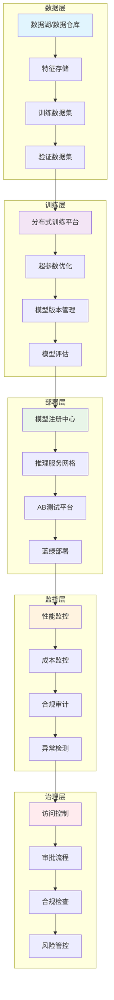

# 08 - AI/ML基础设施专业词典

> **适用版本**: Kubernetes v1.25-v1.32 | **最后更新**: 2026-02 | **作者**: Allen Galler | **质量等级**: ⭐⭐⭐⭐⭐ 专家级

---

## 知识地图

| 属性 | 说明 |
|------|------|
| **文件角色** | AI/ML 基础设施专业词典 — Kubernetes 上运行 AI 工作负载的完整知识体系 |
| **适合读者** | ML工程师入门K8s → 平台工程师管理AI工作负载 → SRE优化AI基础设施 |
| **前置知识** | 05(概念参考)中的K8s基础 + 基本ML概念 |
| **关联文件** | 01(运维实践)、03(性能调优)、07(工具生态中GPU/AI部分) |

### 学习路径

| 阶段 | 章节 | 目标 |
|------|------|------|
| **ML工程师入门** | §1 工作负载优化 + §5 模型生命周期 | 理解如何在K8s上训练和部署模型 |
| **平台工程师** | §2 平台运维 + §6 架构设计 | 搭建和维护AI平台基础设施 |
| **成本与合规** | §3 成本治理 + §4 安全合规 | 优化GPU成本、满足合规要求 |

---

## 目录

- [1. AI工作负载优化](#1-ai工作负载优化)
- [2. AI平台运维](#2-ai平台运维)
- [3. AI成本治理](#3-ai成本治理)
- [4. AI安全合规](#4-ai安全合规)
- [5. AI模型生命周期管理](#5-ai模型生命周期管理)
- [6. AI基础设施架构](#6-ai基础设施架构)

---

## 1. AI工作负载优化

> **🔰 初学者导读**: 本节讲解如何在Kubernetes上高效运行AI训练和推理任务,重点是GPU资源调度和分布式计算的优化策略。

### 1.1 GPU资源调度专业术语

| 术语 | 定义 | 技术要点 | 应用场景 | 相关工具 |
|------|------|----------|----------|----------|
| **GPU时间切片** | 将单个GPU虚拟化为多个逻辑GPU实例的技术 | 通过设备插件实现资源共享，支持多租户 | 开发环境、小模型推理 | NVIDIA Time-Slicing, vGPU |
| **MIG实例** | 多实例GPU技术，将物理GPU切分为多个独立实例 | A100/H100支持，硬件级隔离，显存/CUDA核心独立 | 多租户推理、混合工作负载 | NVIDIA MIG Manager |
| **GPU拓扑感知调度** | 考虑GPU间NVLink/PCIe拓扑关系的调度策略 | NUMA亲和性、带宽优化、减少跨节点通信 | 分布式训练、大模型推理 | Volcano, Kueue |
| **Gang调度** | 将一组Pod作为一个整体进行调度的机制 | 全部成功或全部失败，避免资源碎片 | 分布式训练、MPI作业 | Volcano, Kube-Batch |
| **GPU共享池** | 多个工作负载共享同一GPU资源池的管理方式 | 内存隔离、算力分配、优先级管理 | 推理服务、批量处理 | NVIDIA MPS, Run:ai |

> **🔰 初学者理解**: GPU调度决定了AI任务如何使用昂贵的GPU资源。类比：就像停车场管理员分配车位,需要根据车辆大小(任务类型)、停放时长(训练/推理)、是否拼车(GPU共享)来优化利用率。
>
> **🔧 工作原理**: Kubernetes默认调度器只能分配整卡GPU,无法实现细粒度共享。通过扩展调度器(如Volcano)可以实现:
> 1. **拓扑感知**: 识别GPU之间的NVLink连接,将分布式训练任务调度到通信最快的GPU组
> 2. **Gang调度**: 确保多节点训练任务的所有Pod同时启动,避免部分Pod占用资源等待其他Pod
> 3. **资源共享**: 通过MIG或时间切片技术将单个GPU虚拟化,供多个小任务并发使用
>
> **📝 最小示例**:
> ```yaml
> apiVersion: v1
> kind: Pod
> metadata:
>   name: gpu-shared-pod
> spec:
>   schedulerName: volcano  # 使用Volcano调度器
>   containers:
>   - name: inference-worker
>     image: pytorch:latest
>     resources:
>       limits:
>         nvidia.com/gpu: 1  # 请求1个GPU
>         # 通过时间切片,实际可能共享使用
>   annotations:
>     # 指定GPU拓扑需求
>     volcano.sh/gpu-topology: "nvlink"  # 要求NVLink连接的GPU
> ```
>
> **⚠️ 常见误区**:
> - ❌ 认为GPU可以像CPU一样无限超分 → ✅ GPU显存是硬限制,超分会导致OOM,只有算力可以时间切片共享
> - ❌ 将分布式训练Pod分散在不同可用区 → ✅ 应调度到同一网络域,减少跨AZ的通信延迟和成本
> - ❌ 不设置Gang调度导致训练任务死锁 → ✅ 多节点训练必须使用Gang调度,确保所有Pod同时启动或同时失败

### 1.2 分布式训练优化概念

| 概念 | 核心原理 | 优化策略 | 性能指标 | 实施复杂度 |
|------|----------|----------|----------|------------|
| **数据并行** | 复制模型到多个设备，每个处理不同数据批次 | AllReduce梯度同步、梯度压缩、混合精度 | 通信开销、收敛速度 | ⭐⭐ |
| **模型并行** | 将模型参数分割到不同设备上 | 流水线并行、张量并行、专家并行 | 内存占用、计算效率 | ⭐⭐⭐⭐ |
| **流水线并行** | 将模型按层分割，形成计算流水线 | 微批次、气泡消除、重叠计算通信 | 吞吐量、延迟 | ⭐⭐⭐ |
| **ZeRO优化** | 零冗余优化器，减少内存占用 | 优化器状态分区、梯度分区、参数分区 | 内存效率、训练规模 | ⭐⭐⭐ |
| **混合并行** | 组合多种并行策略的复合方案 | 数据+模型+流水线并行协同 | 最大化资源利用率 | ⭐⭐⭐⭐⭐ |

> **🔰 初学者理解**: 分布式训练是让多个GPU协作训练大模型的技术。类比：像多人协作拼一幅巨大的拼图,可以每人拼不同区域(数据并行),或者拼图太大每人只能看一部分(模型并行)。
>
> **🔧 工作原理**: 
> 1. **数据并行**: 每个GPU拥有完整模型副本,处理不同数据批次,训练后同步梯度(AllReduce)。适合模型较小但数据量大的场景
> 2. **模型并行**: 单个GPU装不下完整模型时,将模型切分到多个GPU。例如GPT-3有1750亿参数,需要模型并行才能训练
> 3. **流水线并行**: 将模型按层切分,前几层在GPU1计算,后几层在GPU2计算,像工厂流水线一样提高吞吐量
> 4. **混合并行**: 大模型训练综合使用多种策略,例如8节点64卡训练可以用"节点内数据并行+节点间模型并行"
>
> **📝 最小示例**:
> ```yaml
> apiVersion: kubeflow.org/v1
> kind: PyTorchJob
> metadata:
>   name: distributed-training
> spec:
>   pytorchReplicaSpecs:
>     Master:  # 主节点
>       replicas: 1
>       template:
>         spec:
>           containers:
>           - name: pytorch
>             image: pytorch/pytorch:2.0
>             command: ["torchrun"]
>             args:
>             - "--nproc_per_node=8"  # 每节点8个GPU
>             - "--nnodes=4"          # 总共4个节点
>             - "train.py"
>             - "--strategy=ddp"      # 数据并行策略
>             resources:
>               limits:
>                 nvidia.com/gpu: 8  # 请求8卡
>     Worker:  # 工作节点
>       replicas: 3  # 3个worker节点
>       template:
>         spec:
>           containers:
>           - name: pytorch
>             image: pytorch/pytorch:2.0
>             resources:
>               limits:
>                 nvidia.com/gpu: 8
> ```
>
> **⚠️ 常见误区**:
> - ❌ 认为增加GPU数量就能线性加速训练 → ✅ 通信开销会抵消部分收益,需要优化通信拓扑和同步策略
> - ❌ 盲目使用模型并行导致GPU利用率低 → ✅ 能用数据并行就用数据并行,模型并行有更多空闲等待时间
> - ❌ 忽略梯度累积导致收敛效果差 → ✅ 分布式训练时要调整学习率和批次大小,保持有效批次大小不变

### 1.3 模型推理优化技术

| 技术 | 优化原理 | 适用场景 | 性能提升 | 实施难度 |
|------|----------|----------|----------|----------|
| **模型量化** | 将FP32权重转换为INT8/FP16等低精度格式 | 推理加速、内存优化 | 2-4倍性能提升 | ⭐⭐ |
| **知识蒸馏** | 用大模型指导小模型训练 | 模型压缩、移动端部署 | 30-50%精度保持 | ⭐⭐⭐ |
| **模型剪枝** | 移除不重要的神经网络连接 | 模型瘦身、边缘部署 | 50-90%参数减少 | ⭐⭐⭐ |
| **动态批处理** | 运行时合并多个推理请求 | 提高GPU利用率、降低延迟 | 2-5倍吞吐量提升 | ⭐⭐ |
| **连续批处理** | 保持模型持续处理请求流 | 减少冷启动、提高效率 | 30-70%延迟降低 | ⭐⭐⭐ |

---

## 2. AI平台运维

> **🔰 初学者导读**: 本节介绍如何运维企业级AI平台,包括Kubeflow等ML平台的部署管理、模型注册中心和推理服务的运维实践。

### 2.1 Kubeflow平台组件

| 组件 | 功能描述 | 运维要点 | 监控指标 | 故障处理 |
|------|----------|----------|----------|----------|
| **KF Pipelines** | ML工作流编排引擎 | 工作流状态监控、资源配额管理 | DAG执行成功率、步骤延迟 | 重试机制、资源扩容 |
| **Katib** | 超参数自动优化平台 | 试验管理、算法调优 | 试验完成率、最优参数收敛 | 算法切换、资源调整 |
| **Training Operator** | 分布式训练作业管理 | 作业调度、GPU资源分配 | 训练成功率、GPU利用率 | Gang调度、节点修复 |
| **Model Serving** | 模型部署和服务化 | 版本管理、流量分流 | QPS、延迟、错误率 | 自动扩缩容、蓝绿部署 |
| **VOLUMES** | 存储管理系统 | PVC管理、备份恢复 | 存储使用率、IOPS性能 | 存储扩容、快照恢复 |

> **🔰 初学者理解**: AI平台架构是支撑机器学习全流程的基础设施。类比：就像汽车制造工厂的流水线,从原材料(数据)进入,经过各个工序(训练、评估、部署),最终产出成品(推理服务)。
>
> **🔧 工作原理**: Kubeflow是构建在Kubernetes上的ML平台,核心组件包括:
> 1. **Pipelines**: 将ML工作流定义为DAG(有向无环图),每个步骤是一个容器,自动处理依赖和数据传递
> 2. **Training Operator**: 提供PyTorchJob、TFJob等CRD,简化分布式训练配置,自动管理参数服务器和worker节点
> 3. **Katib**: 自动尝试不同超参数组合,使用贝叶斯优化等算法找到最优配置,类似AutoML
> 4. **KServe**: 提供统一的模型服务接口,支持自动扩缩容、金丝雀发布、流量分割等高级功能
>
> **📝 最小示例**:
> ```yaml
> apiVersion: kubeflow.org/v1
> kind: Notebook
> metadata:
>   name: ml-workspace
>   namespace: kubeflow-user
> spec:
>   template:
>     spec:
>       containers:
>       - name: jupyter
>         image: jupyter/tensorflow-notebook:latest
>         resources:
>           limits:
>             nvidia.com/gpu: 1  # 为Jupyter分配1个GPU
>         volumeMounts:
>         - name: workspace
>           mountPath: /home/jovyan/work  # 持久化工作目录
>       volumes:
>       - name: workspace
>         persistentVolumeClaim:
>           claimName: ml-workspace-pvc  # 使用PVC持久化数据
> ---
> # Pipeline示例 - 简单的训练部署流程
> apiVersion: argoproj.io/v1alpha1
> kind: Workflow
> metadata:
>   generateName: ml-pipeline-
> spec:
>   entrypoint: ml-workflow
>   templates:
>   - name: ml-workflow
>     dag:
>       tasks:
>       - name: data-prep
>         template: prepare-data
>       - name: train-model
>         dependencies: [data-prep]  # 依赖数据准备完成
>         template: training
>       - name: deploy
>         dependencies: [train-model]  # 依赖训练完成
>         template: deployment
> ```
>
> **⚠️ 常见误区**:
> - ❌ 将Kubeflow作为单体应用部署导致组件耦合 → ✅ 根据需求选择性安装组件,例如只用Pipelines而不装Katib
> - ❌ 未做资源配额限制导致某个实验占满集群 → ✅ 使用ResourceQuota和LimitRange限制命名空间资源上限
> - ❌ Pipeline步骤间用共享文件系统传递大量数据 → ✅ 优先用对象存储(S3/MinIO)传递数据路径,减少IO瓶颈

### 2.2 模型注册中心概念

| 概念 | 定义 | 核心功能 | 技术实现 | 运维考虑 |
|------|------|----------|----------|----------|
| **Model Versioning** | 模型版本控制系统 | 版本追踪、回滚能力、分支管理 | Git + MLflow/MLeap | 存储管理、权限控制 |
| **Model Metadata** | 模型元数据管理 | 训练参数、性能指标、血缘关系 | 数据库 + 对象存储 | 数据一致性、查询性能 |
| **Model Lineage** | 模型血缘追踪 | 数据->特征->模型->部署全链路 | 图数据库 + 事件溯源 | 性能优化、存储策略 |
| **Model Governance** | 模型治理框架 | 合规检查、质量评估、审批流程 | 策略引擎 + 工作流 | 自动化程度、人工干预 |
| **Model Catalog** | 模型目录服务 | 发现、评估、比较不同模型 | 搜索引擎 + 评价系统 | 索引维护、用户体验 |

### 2.3 推理服务平台

| 服务类型 | 技术特点 | 部署模式 | 性能特征 | 运维复杂度 |
|----------|----------|----------|----------|------------|
| **vLLM** | PagedAttention内存优化、连续批处理 | Deployment/StatefulSet | 高吞吐、低延迟 | ⭐⭐⭐ |
| **TGI** | Transformer优化、多模型支持 | Deployment | 通用性强、易集成 | ⭐⭐ |
| **TensorRT-LLM** | NVIDIA优化、高性能推理 | DaemonSet | 极致性能、硬件绑定 | ⭐⭐⭐⭐ |
| **Seldon Core** | 多框架支持、AB测试 | Operator | 灵活性高、功能丰富 | ⭐⭐⭐⭐ |
| **KServe** | Kubernetes原生、Serverless | Knative | 自动扩缩、成本优化 | ⭐⭐⭐ |

> **🔰 初学者理解**: GPU集群运维是管理数百张GPU卡组成的计算资源池。类比：像管理一个数据中心的GPU农场,需要监控每张卡的健康状态、优化散热、处理硬件故障、调度任务到最合适的GPU。
>
> **🔧 工作原理**: GPU集群运维涉及多个层面:
> 1. **硬件监控**: 使用NVIDIA DCGM采集GPU温度、功耗、显存使用率、ECC错误等指标,通过Prometheus告警
> 2. **驱动管理**: 统一管理NVIDIA驱动版本,使用DaemonSet部署GPU Operator自动化驱动安装和更新
> 3. **任务调度**: 配置GPU亲和性、独占模式、共享策略,避免任务间相互干扰,使用污点和容忍度隔离不同工作负载
> 4. **故障恢复**: GPU故障时自动驱逐Pod到健康节点,使用Node Problem Detector检测硬件异常并标记节点
>
> **📝 最小示例**:
> ```yaml
> # GPU节点健康检查DaemonSet
> apiVersion: apps/v1
> kind: DaemonSet
> metadata:
>   name: gpu-healthcheck
>   namespace: kube-system
> spec:
>   selector:
>     matchLabels:
>       app: gpu-healthcheck
>   template:
>     metadata:
>       labels:
>         app: gpu-healthcheck
>     spec:
>       nodeSelector:
>         accelerator: nvidia-gpu  # 仅在GPU节点运行
>       hostNetwork: true
>       containers:
>       - name: dcgm-exporter
>         image: nvcr.io/nvidia/k8s/dcgm-exporter:3.1.0
>         securityContext:
>           capabilities:
>             add: ["SYS_ADMIN"]  # 访问GPU设备需要特权
>         volumeMounts:
>         - name: gpu-metrics
>           mountPath: /run/prometheus  # 暴露Prometheus指标
>       volumes:
>       - name: gpu-metrics
>         hostPath:
>           path: /run/prometheus
> ---
> # GPU故障自动驱逐配置
> apiVersion: v1
> kind: ConfigMap
> metadata:
>   name: node-problem-detector-config
> data:
>   gpu-problem.json: |
>     {
>       "plugin": "custom",
>       "rules": [
>         {
>           "type": "temporary",
>           "reason": "GPUMemoryError",
>           "pattern": "Xid.*: GPU has fallen off the bus"
>         },
>         {
>           "type": "permanent",
>           "reason": "GPUHardwareFailure", 
>           "pattern": "GPU.*has fallen off the bus"
>         }
>       ]
>     }
> ```
>
> **⚠️ 常见误区**:
> - ❌ 忽略ECC错误导致训练结果不可靠 → ✅ 定期检查DCGM的ECC错误计数,超过阈值立即下线GPU进行RMA
> - ❌ 未配置GPU独占模式导致推理延迟抖动 → ✅ 生产推理服务使用`nvidia.com/gpu.deploy.mode: "exclusive"`确保独占
> - ❌ GPU驱动版本不一致导致CUDA兼容性问题 → ✅ 使用GPU Operator统一管理驱动,通过标签控制不同驱动版本的节点池

---

## 3. AI成本治理

> **🔰 初学者导读**: 本节讲解如何控制AI基础设施成本,重点是GPU资源利用率优化、Spot实例使用和成本监控分析方法。

### 3.1 GPU资源成本优化

| 优化策略 | 实施方法 | 成本节约潜力 | 技术复杂度 | 风险等级 |
|----------|----------|--------------|------------|----------|
| **Spot实例利用** | 混合使用按需和竞价实例 | 50-80%成本节约 | ⭐⭐ | 中等 |
| **自动扩缩容** | 基于负载动态调整GPU节点 | 30-60%资源节约 | ⭐⭐⭐ | 低 |
| **资源共享** | 多任务共享GPU资源池 | 40-70%利用率提升 | ⭐⭐⭐⭐ | 中等 |
| **时段调度** | 非高峰时段执行训练任务 | 20-40%成本优化 | ⭐⭐ | 低 |
| **模型压缩** | 量化、蒸馏减少计算需求 | 30-50%硬件需求降低 | ⭐⭐⭐ | 低 |

> **🔰 初学者理解**: GPU资源利用率优化是提高昂贵GPU设备使用效率的关键。类比：像合租公寓最大化利用空间,通过时间错峰(白天办公晚上睡觉)、空间共享(共用厨房客厅)、灵活调配(客人来了加床位)来降低人均成本。
>
> **🔧 工作原理**: GPU利用率优化的核心策略包括:
> 1. **时间维度共享**: 使用GPU时间切片技术,让多个推理任务轮流使用同一GPU,类似CPU的时间片调度
> 2. **空间维度共享**: 通过MIG将A100切分为7个实例,每个实例有独立显存和计算核心,适合小模型推理
> 3. **动态扩缩容**: 监控GPU队列长度,无任务时缩容到0,有任务时自动扩容,使用Karpenter或Cluster Autoscaler实现
> 4. **资源池化**: 建立共享GPU池,不同团队按需申请,避免独占浪费,通过资源配额限制使用上限
>
> **📝 最小示例**:
> ```yaml
> # GPU资源配额 - 限制命名空间GPU使用量
> apiVersion: v1
> kind: ResourceQuota
> metadata:
>   name: gpu-quota
>   namespace: ml-team-a
> spec:
>   hard:
>     requests.nvidia.com/gpu: "10"  # 最多申请10个GPU
>     limits.nvidia.com/gpu: "10"
> ---
> # GPU时间切片配置 - 将1个物理GPU虚拟成4个逻辑GPU
> apiVersion: v1
> kind: ConfigMap
> metadata:
>   name: time-slicing-config
>   namespace: gpu-operator
> data:
>   any: |-
>     version: v1
>     sharing:
>       timeSlicing:
>         replicas: 4  # 1个GPU分成4份
>         renameByDefault: true
> ---
> # 低优先级训练任务 - 使用Spot实例
> apiVersion: batch/v1
> kind: Job
> metadata:
>   name: model-training-spot
> spec:
>   template:
>     spec:
>       priorityClassName: low-priority  # 低优先级可被抢占
>       nodeSelector:
>         karpenter.sh/capacity-type: spot  # 选择Spot节点
>       tolerations:
>       - key: nvidia.com/gpu
>         operator: Exists
>         effect: NoSchedule
>       containers:
>       - name: trainer
>         image: pytorch:latest
>         resources:
>           limits:
>             nvidia.com/gpu: 1
>         # 训练支持checkpoint断点续训
>         env:
>         - name: CHECKPOINT_DIR
>           value: "/mnt/checkpoints"  # Spot中断时可恢复
> ```
>
> **⚠️ 常见误区**:
> - ❌ 过度时间切片导致任务相互干扰 → ✅ 时间切片适合推理,训练任务应独占GPU避免性能波动
> - ❌ 将有状态训练任务直接跑在Spot上 → ✅ Spot任务必须支持checkpoint,能在中断后从断点恢复
> - ❌ 未监控利用率就盲目共享GPU → ✅ 先用DCGM分析利用率,确认有闲置时段再启用共享策略

### 3.2 成本监控与分析

| 监控维度 | 关键指标 | 分析方法 | 工具支持 | 实施建议 |
|----------|----------|----------|----------|----------|
| **GPU利用率** | 平均使用率、峰值利用率 | 趋势分析、异常检测 | DCGM + Prometheus | 设置告警阈值 |
| **训练成本** | 每次训练成本、单位精度成本 | 成本归因、ROI分析 | Kubecost + MLflow | 建立成本基线 |
| **推理成本** | 每万次推理成本、QPS成本效率 | 性价比分析、容量规划 | 自定义仪表板 | 优化实例规格 |
| **存储成本** | 数据集、模型、日志存储费用 | 生命周期管理、冷热分离 | 对象存储分级 | 定期清理策略 |
| **人力成本** | 运维投入、开发效率 | 时间追踪、自动化率 | 内部工时统计 | 流程优化建议 |

> **🔰 初学者理解**: Spot实例是云厂商的闲置资源特价出售,价格便宜但随时可能被回收。类比：像航空公司的特价机票,最后一刻才放出来,价格只要正价的2-3折,但可能临时取消航班,适合时间灵活的旅客。
>
> **🔧 工作原理**: Spot实例在AI训练中的应用策略:
> 1. **中断容忍**: 云厂商资源紧张时会提前2分钟通知回收Spot实例,应用需要优雅关闭并保存checkpoint
> 2. **混合部署**: 关键组件(参数服务器)用按需实例保证稳定,worker节点用Spot实例降低成本
> 3. **多实例类型**: 配置多种GPU型号(V100/A10/T4)的Spot池,某个型号缺货时自动切换
> 4. **自动重试**: Spot中断后Kubernetes会自动在其他节点重新调度Pod,从checkpoint恢复训练
>
> **📝 最小示例**:
> ```yaml
> # Karpenter配置 - 自动选择最便宜的Spot实例
> apiVersion: karpenter.sh/v1alpha5
> kind: Provisioner
> metadata:
>   name: spot-gpu-provisioner
> spec:
>   requirements:
>   - key: karpenter.sh/capacity-type
>     operator: In
>     values: ["spot"]  # 优先使用Spot
>   - key: node.kubernetes.io/instance-type
>     operator: In
>     values:  # 多种GPU实例类型
>     - "g4dn.xlarge"   # T4 GPU
>     - "g5.xlarge"     # A10G GPU  
>     - "p3.2xlarge"    # V100 GPU
>   limits:
>     resources:
>       nvidia.com/gpu: "100"  # 最多100个GPU
>   providerRef:
>     name: spot-provider
>   # Spot中断处理
>   ttlSecondsAfterEmpty: 30  # 空闲30秒后回收节点
>   ttlSecondsUntilExpired: 604800  # 7天后强制轮换
> ---
> # 训练任务配置 - 支持Spot中断恢复
> apiVersion: batch/v1
> kind: Job
> metadata:
>   name: resilient-training
> spec:
>   backoffLimit: 10  # 允许失败重试10次
>   template:
>     spec:
>       restartPolicy: OnFailure
>       containers:
>       - name: trainer
>         image: pytorch:latest
>         command: ["python", "train.py"]
>         args:
>         - "--checkpoint-dir=/mnt/checkpoints"
>         - "--resume-from-latest"  # 自动从最新checkpoint恢复
>         volumeMounts:
>         - name: checkpoint-storage
>           mountPath: /mnt/checkpoints
>       volumes:
>       - name: checkpoint-storage
>         persistentVolumeClaim:
>           claimName: training-checkpoints  # 持久化存储checkpoint
>       # 处理Spot中断信号
>       terminationGracePeriodSeconds: 120  # 给120秒保存checkpoint
> ```
>
> **⚠️ 常见误区**:
> - ❌ 不保存checkpoint导致Spot中断后从头训练 → ✅ 必须定期保存checkpoint,建议每N个epoch或每M分钟保存一次
> - ❌ 只配置单一实例类型导致经常缺货 → ✅ 配置3-5种同性能档位的实例类型,增加Spot可用性
> - ❌ 关键在线服务使用Spot导致频繁中断 → ✅ Spot仅用于离线训练,推理服务必须用按需或预留实例

### 3.3 成本优化最佳实践

```yaml
# ========== GPU成本优化配置模板 ==========
apiVersion: apps/v1
kind: Deployment
metadata:
  name: cost-optimized-llm-service
  namespace: ai-inference
spec:
  replicas: 3
  template:
    spec:
      # 混合实例策略
      nodeSelector:
        node.kubernetes.io/instance-type: g4dn.xlarge  # 按需实例
      tolerations:
      - key: spot-instance
        operator: Equal
        value: "true"
        effect: NoSchedule
        
      containers:
      - name: inference-server
        image: vllm/vllm-openai:v0.4.2
        resources:
          requests:
            # 精确的资源请求，避免过度分配
            cpu: "2"
            memory: "8Gi"
            nvidia.com/gpu: "1"
          limits:
            # 合理的资源上限
            cpu: "4"
            memory: "16Gi"
            nvidia.com/gpu: "1"
            
        # 成本优化参数
        env:
        - name: VLLM_GPU_MEMORY_UTILIZATION
          value: "0.85"  # 优化GPU内存使用率
        - name: VLLM_MAX_NUM_BATCHED_TOKENS
          value: "4096"  # 控制批处理大小
        - name: VLLM_DTYPE
          value: "float16"  # 使用半精度降低内存需求
          
        # 自动扩缩容配置
        startupProbe:
          httpGet:
            path: /health
            port: 8000
          initialDelaySeconds: 60
          periodSeconds: 10
          
        livenessProbe:
          httpGet:
            path: /health
            port: 8000
          periodSeconds: 30
          
        readinessProbe:
          httpGet:
            path: /health
            port: 8000
          periodSeconds: 10

---
# ========== 成本监控配置 ==========
apiVersion: monitoring.coreos.com/v1
kind: PrometheusRule
metadata:
  name: ai-cost-monitoring
  namespace: monitoring
spec:
  groups:
  - name: gpu.cost.rules
    rules:
    # GPU利用率告警
    - alert: LowGPUUtilization
      expr: |
        avg(rate(DCGM_FI_DEV_GPU_UTIL[5m])) < 30
      for: 10m
      labels:
        severity: warning
      annotations:
        summary: "GPU利用率过低 ({{ $value }}%)"
        description: "检测到GPU资源浪费，建议优化资源配置"
        
    # 训练成本异常
    - alert: HighTrainingCost
      expr: |
        increase(kube_pod_container_resource_requests{resource="nvidia_com_gpu"}[1h]) * 
        avg_over_time(gpu_hourly_cost[1h]) > 100
      for: 5m
      labels:
        severity: warning
      annotations:
        summary: "单次训练成本过高"
        description: "当前训练任务预计成本超过阈值，请检查资源配置"
        
    # 推理性价比下降
    - alert: PoorInferenceCostEffectiveness
      expr: |
        rate(http_requests_total[5m]) / 
        avg(rate(DCGM_FI_DEV_GPU_UTIL[5m])) < 10
      for: 15m
      labels:
        severity: info
      annotations:
        summary: "推理性价比下降"
        description: "单位GPU利用率产生的请求数偏低，建议优化模型或扩容"
```

---

## 4. AI安全合规

> **🔰 初学者导读**: 本节介绍AI系统的安全威胁和防护措施,包括模型安全、数据隐私保护和合规审计框架。

### 4.1 模型安全概念

| 安全维度 | 威胁类型 | 防护措施 | 检测方法 | 合规要求 |
|----------|----------|----------|----------|----------|
| **模型投毒** | 训练数据恶意污染 | 数据清洗、异常检测 | 统计分析、对抗样本检测 | ISO/IEC 27001 |
| **对抗攻击** | 输入扰动欺骗模型 | 对抗训练、输入验证 | 黑盒测试、鲁棒性评估 | NIST AI风险管理框架 |
| **模型窃取** | 通过API逆向工程 | 查询限制、水印嵌入 | 行为分析、访问模式检测 | GDPR数据保护 |
| **隐私泄露** | 模型记忆训练数据 | 差分隐私、联邦学习 | 成员推理攻击检测 | CCPA消费者隐私 |
| **后门攻击** | 植入隐藏触发器 | 触发器检测、模型验证 | 输入输出分析、激活模式检查 | 等保2.0三级 |

> **🔰 初学者理解**: 模型安全是保护AI模型不被攻击或窃取的技术。类比：就像保护知识产权和商业秘密,防止竞争对手通过逆向工程复制你的技术(模型窃取),或者在产品中植入缺陷(后门攻击)。
>
> **🔧 工作原理**: AI模型面临的主要安全威胁包括:
> 1. **模型窃取**: 攻击者通过大量查询推理API,收集输入输出对,训练出功能相似的模型。防护方法是限制查询频率、添加随机噪声、检测异常查询模式
> 2. **对抗攻击**: 在输入数据中添加人眼不可见的微小扰动,导致模型错误分类。例如在停车标志贴上特殊贴纸让自动驾驶识别为限速标志
> 3. **后门攻击**: 在训练阶段植入隐藏规则,平时正常工作,遇到特定触发器(如特定像素模式)就输出错误结果
> 4. **隐私泄露**: 模型可能记忆训练数据,攻击者通过成员推理攻击判断某个样本是否在训练集中,泄露敏感信息
>
> **📝 最小示例**:
> ```yaml
> # 推理服务安全加固配置
> apiVersion: serving.kserve.io/v1beta1
> kind: InferenceService
> metadata:
>   name: secure-model-serving
> spec:
>   predictor:
>     containers:
>     - name: model-server
>       image: my-secure-model:v1
>       env:
>       # 启用模型加密
>       - name: MODEL_ENCRYPTION
>         value: "true"
>       # 限制请求频率
>       - name: RATE_LIMIT_PER_IP
>         value: "100"  # 每IP每分钟最多100次请求
>       # 添加输出噪声防止模型窃取
>       - name: OUTPUT_NOISE_LEVEL
>         value: "0.01"
>       securityContext:
>         runAsNonRoot: true
>         readOnlyRootFilesystem: true  # 只读文件系统
>         capabilities:
>           drop: ["ALL"]  # 禁用所有Linux capabilities
>   # 配置访问控制
>   transformer:
>     containers:
>     - name: input-validator
>       image: input-validator:v1
>       # 检测对抗样本
>       args:
>       - "--detect-adversarial"
>       - "--max-perturbation=0.01"
> ---
> # 模型访问审计策略
> apiVersion: audit.k8s.io/v1
> kind: Policy
> rules:
> - level: RequestResponse
>   verbs: ["create", "update", "patch"]
>   resources:
>   - group: "serving.kserve.io"
>     resources: ["inferenceservices"]
>   # 记录所有模型部署操作
>   namespaces: ["production"]
> ```
>
> **⚠️ 常见误区**:
> - ❌ 认为模型部署在内网就安全 → ✅ 内部员工也可能窃取模型,需要访问控制和审计日志
> - ❌ 忽略模型输出中的敏感信息泄露 → ✅ 大模型可能记忆训练数据,需要过滤输出防止泄露个人信息
> - ❌ 未对推理API做速率限制 → ✅ 攻击者可能通过暴力查询窃取模型,必须限制请求频率

### 4.2 数据隐私保护

| 保护技术 | 技术原理 | 适用场景 | 性能影响 | 实施复杂度 |
|----------|----------|----------|----------|------------|
| **差分隐私** | 添加数学噪声保护个体隐私 | 联邦学习、统计分析 | 5-15%精度损失 | ⭐⭐⭐⭐ |
| **联邦学习** | 数据不出本地，模型聚合 | 多方协作训练 | 通信开销较大 | ⭐⭐⭐⭐⭐ |
| **同态加密** | 密文状态下直接计算 | 敏感数据处理 | 性能损失巨大 | ⭐⭐⭐⭐⭐ |
| **安全多方计算** | 多方共同计算不泄露输入 | 联合建模 | 计算复杂度高 | ⭐⭐⭐⭐⭐ |
| **可信执行环境** | 硬件级安全隔离 | 敏感推理服务 | 轻微性能影响 | ⭐⭐⭐ |

> **🔰 初学者理解**: 数据安全是保护AI训练和推理过程中的敏感数据不被泄露。类比：就像银行金库的多层防护,需要物理隔离(加密)、访问控制(权限管理)、审计追踪(日志记录)来保护客户资产。
>
> **🔧 工作原理**: Kubernetes环境下的AI数据安全策略:
> 1. **静态加密**: 使用KMS(密钥管理服务)加密存储在PV中的训练数据和模型文件,Secret加密存储API密钥
> 2. **传输加密**: 所有数据传输使用TLS/mTLS,包括节点间的梯度同步、客户端到推理服务的请求
> 3. **访问控制**: 使用RBAC限制Pod对敏感数据的访问,NetworkPolicy隔离不同安全域的工作负载
> 4. **数据脱敏**: 训练前对敏感字段(姓名、身份证号)进行脱敏处理,使用差分隐私技术保护个体隐私
>
> **📝 最小示例**:
> ```yaml
> # 使用Secrets加密存储敏感配置
> apiVersion: v1
> kind: Secret
> metadata:
>   name: model-secrets
> type: Opaque
> data:
>   # Base64编码的敏感信息
>   api-key: bXktc2VjcmV0LWFwaS1rZXk=
>   database-password: cGFzc3dvcmQxMjM=
> ---
> # 训练任务配置 - 数据加密和访问控制
> apiVersion: batch/v1
> kind: Job
> metadata:
>   name: secure-training
> spec:
>   template:
>     spec:
>       serviceAccountName: ml-trainer  # 专用服务账号
>       securityContext:
>         fsGroup: 1000  # 文件权限组
>         runAsNonRoot: true
>         runAsUser: 1000
>       containers:
>       - name: trainer
>         image: secure-trainer:v1
>         env:
>         # 从Secret注入敏感配置
>         - name: API_KEY
>           valueFrom:
>             secretKeyRef:
>               name: model-secrets
>               key: api-key
>         volumeMounts:
>         - name: encrypted-data
>           mountPath: /data
>           readOnly: true  # 只读挂载防止篡改
>       volumes:
>       - name: encrypted-data
>         persistentVolumeClaim:
>           claimName: encrypted-training-data
> ---
> # NetworkPolicy - 隔离敏感工作负载
> apiVersion: networking.k8s.io/v1
> kind: NetworkPolicy
> metadata:
>   name: isolate-sensitive-ml
> spec:
>   podSelector:
>     matchLabels:
>       security: high  # 高敏感度标签
>   policyTypes:
>   - Ingress
>   - Egress
>   ingress:
>   - from:
>     - podSelector:
>         matchLabels:
>           role: ml-admin  # 仅允许管理员访问
>   egress:
>   - to:
>     - podSelector:
>         matchLabels:
>           app: model-registry  # 仅允许访问模型仓库
> ```
>
> **⚠️ 常见误区**:
> - ❌ 将API密钥硬编码在代码或ConfigMap中 → ✅ 必须使用Secret存储敏感信息,并启用etcd加密
> - ❌ 未对训练数据做访问控制 → ✅ 使用RBAC和PV的accessModes限制数据访问权限
> - ❌ 跨环境共享同一套密钥 → ✅ 开发/测试/生产环境必须使用不同的密钥,定期轮换

### 4.3 合规审计框架

```yaml
# ========== AI合规审计策略 ==========
apiVersion: kyverno.io/v1
kind: ClusterPolicy
metadata:
  name: ai-model-compliance
spec:
  validationFailureAction: audit  # 审计模式，不阻断部署
  background: true
  rules:
  # 模型版本控制检查
  - name: model-version-tracking
    match:
      any:
      - resources:
          kinds:
          - Deployment
          selector:
            matchLabels:
              app-type: ml-model
    validate:
      message: "AI模型部署必须包含版本标签和训练数据来源信息"
      pattern:
        metadata:
          labels:
            model.version: "?*"
            training.data.source: "?*"
            compliance.level: "restricted|baseline"
            
  # GPU资源使用合规检查
  - name: gpu-resource-compliance
    match:
      any:
      - resources:
          kinds:
          - Pod
    validate:
      message: "GPU资源使用需要明确业务用途和成本归属"
      pattern:
        spec:
          containers:
          - resources:
              limits:
                nvidia.com/gpu: "?*"
            env:
            - name: BUSINESS_PURPOSE
              value: "?*"
            - name: COST_CENTER
              value: "?*"
              
  # 模型安全扫描
  - name: model-security-scan
    match:
      any:
      - resources:
          kinds:
          - Job
          selector:
            matchLabels:
              job-type: model-training
    validate:
      message: "模型训练任务必须包含安全扫描步骤"
      foreach:
      - list: "request.object.spec.template.spec.initContainers"
        deny:
          conditions:
            any:
            - key: "{{ element.name }}"
              operator: NotEquals
              value: "security-scan"
              
---
# ========== 合规监控仪表板配置 ==========
apiVersion: grafana.integreatly.org/v1beta1
kind: GrafanaDashboard
metadata:
  name: ai-compliance-dashboard
  namespace: monitoring
spec:
  json: |
    {
      "dashboard": {
        "title": "AI合规监控仪表板",
        "panels": [
          {
            "title": "模型合规状态",
            "type": "stat",
            "targets": [
              {
                "expr": "count(kube_pod_labels{label_app_type=\"ml-model\",label_compliance_level=\"restricted\"})",
                "legendFormat": "受限模型数量"
              },
              {
                "expr": "count(kube_pod_labels{label_app_type=\"ml-model\",label_training_data_source=~\".*pii.*\"})",
                "legendFormat": "处理PII数据模型"
              }
            ]
          },
          {
            "title": "GPU合规使用率",
            "type": "graph",
            "targets": [
              {
                "expr": "sum by(pod) (DCGM_FI_DEV_GPU_UTIL * on(pod) group_left(label_business_purpose) kube_pod_labels{label_app_type=\"ml-model\"})",
                "legendFormat": "{{pod}} - {{label_business_purpose}}"
              }
            ]
          },
          {
            "title": "合规违规事件",
            "type": "table",
            "targets": [
              {
                "expr": "kyverno_policy_results_total{rule_result=\"fail\",policy_name=~\"ai-model-compliance.*\"}",
                "format": "table"
              }
            ]
          }
        ]
      }
    }
```

---

## 5. AI模型生命周期管理

> **🔰 初学者导读**: 本节讲解MLOps流程,从模型训练、评估、部署到监控的完整生命周期管理,以及模型版本控制和治理策略。

### 5.1 MLOps流水线阶段

| 阶段 | 核心活动 | 关键指标 | 自动化程度 | 质量门禁 |
|------|----------|----------|------------|----------|
| **数据准备** | 数据收集、清洗、标注 | 数据质量分数、标注准确率 | 70% | 数据完整性检查 |
| **特征工程** | 特征提取、选择、转换 | 特征重要性、相关性分析 | 80% | 特征稳定性验证 |
| **模型训练** | 超参数调优、分布式训练 | 验证集精度、收敛速度 | 90% | 性能基线对比 |
| **模型评估** | 离线评估、A/B测试 | 业务指标、公平性检查 | 85% | 准入标准测试 |
| **模型部署** | 灰度发布、蓝绿部署 | 部署成功率、回滚时间 | 95% | 预发环境验证 |
| **在线监控** | 性能监控、概念漂移检测 | 延迟、准确率、数据分布 | 90% | 异常自动告警 |
| **模型更新** | 增量学习、版本迭代 | 更新频率、改进幅度 | 75% | 回归测试验证 |

> **🔰 初学者理解**: 模型训练Pipeline是将数据转化为可部署模型的自动化流程。类比：像汽车组装流水线,原材料(数据)经过冲压(特征工程)、焊接(模型训练)、喷漆(优化)、质检(评估)等工序,最终产出成品车(模型)。
>
> **🔧 工作原理**: ML Pipeline在Kubernetes上的实现:
> 1. **容器化步骤**: 每个流水线步骤(数据预处理、训练、评估)都是独立的容器镜像,可复用和版本化
> 2. **DAG编排**: 使用Argo Workflows或Kubeflow Pipelines定义任务依赖关系,自动处理数据传递和错误重试
> 3. **资源动态分配**: 数据处理用CPU节点,训练用GPU节点,评估用小内存实例,根据步骤需求自动调度
> 4. **缓存优化**: 相同输入的步骤结果可缓存,避免重复计算,加速迭代调试
>
> **📝 最小示例**:
> ```yaml
> # Kubeflow Pipeline定义 - Python DSL
> apiVersion: argoproj.io/v1alpha1
> kind: Workflow
> metadata:
>   generateName: ml-training-pipeline-
> spec:
>   entrypoint: ml-workflow
>   arguments:
>     parameters:
>     - name: dataset-path
>       value: "s3://ml-data/dataset-v1"
>     - name: model-name
>       value: "text-classifier-v2"
>   
>   templates:
>   # 步骤1: 数据预处理
>   - name: preprocess
>     inputs:
>       parameters:
>       - name: dataset-path
>     outputs:
>       artifacts:
>       - name: processed-data
>         path: /output/data.tfrecord
>         s3:
>           key: "{{workflow.name}}/processed-data"
>     container:
>       image: data-processor:v1
>       command: ["python", "preprocess.py"]
>       args: ["--input={{inputs.parameters.dataset-path}}"]
>       resources:
>         requests:
>           cpu: "4"
>           memory: "16Gi"
>   
>   # 步骤2: 模型训练
>   - name: train
>     inputs:
>       artifacts:
>       - name: processed-data
>         path: /input/data.tfrecord
>     outputs:
>       artifacts:
>       - name: trained-model
>         path: /output/model
>     container:
>       image: trainer:v1
>       command: ["python", "train.py"]
>       resources:
>         limits:
>           nvidia.com/gpu: 4  # 使用4卡训练
>   
>   # 步骤3: 模型评估
>   - name: evaluate
>     inputs:
>       artifacts:
>       - name: trained-model
>     container:
>       image: evaluator:v1
>       command: ["python", "evaluate.py"]
>       args: ["--threshold=0.85"]  # 准确率门槛
>   
>   # 工作流DAG
>   - name: ml-workflow
>     dag:
>       tasks:
>       - name: data-prep
>         template: preprocess
>         arguments:
>           parameters:
>           - name: dataset-path
>             value: "{{workflow.parameters.dataset-path}}"
>       - name: training
>         template: train
>         dependencies: [data-prep]  # 依赖预处理完成
>       - name: evaluation
>         template: evaluate
>         dependencies: [training]  # 依赖训练完成
> ```
>
> **⚠️ 常见误区**:
> - ❌ Pipeline步骤间用本地磁盘传递大文件 → ✅ 使用对象存储(S3/MinIO)传递数据路径,避免跨节点拷贝
> - ❌ 未做步骤缓存导致调试效率低 → ✅ 启用Kubeflow的缓存功能,相同输入自动复用历史结果
> - ❌ 所有步骤串行执行浪费时间 → ✅ 识别可并行的步骤(如多个特征工程任务),使用DAG并行执行

### 5.2 模型版本管理策略

| 策略类型 | 实施方式 | 优势 | 劣势 | 适用场景 |
|----------|----------|------|------|----------|
| **语义版本** | MAJOR.MINOR.PATCH格式 | 清晰的版本语义、易于理解 | 管理复杂、需要人工判断 | 成熟业务场景 |
| **时间戳版本** | YYYYMMDD.HHMMSS格式 | 自动生成、唯一性强 | 语义不直观、难以比较 | 快速迭代场景 |
| **Git SHA版本** | 基于代码提交哈希 | 完全可追溯、与代码绑定 | 不易读、长度较长 | 研发团队使用 |
| **实验ID版本** | 基于训练实验标识 | 与实验数据关联、便于追踪 | 系统耦合度高 | ML平台内部 |
| **混合版本** | 语义+时间戳组合 | 兼顾语义和唯一性 | 复杂度较高 | 企业级应用 |

> **🔰 初学者理解**: 模型部署策略决定如何安全地将新模型推向生产环境。类比：像新品上市的发布策略,可以先在部分城市试点(灰度发布),准备两套生产线随时切换(蓝绿部署),或者让新旧产品共存逐步替换(金丝雀发布)。
>
> **🔧 工作原理**: Kubernetes上的模型部署策略:
> 1. **蓝绿部署**: 同时运行旧版本(蓝)和新版本(绿),验证后切换流量,可快速回滚。适合风险敏感的场景
> 2. **金丝雀发布**: 新版本先接收5%流量,逐步增加到10%/50%/100%,出问题立即回滚。适合需要验证的场景
> 3. **A/B测试**: 同时运行多个模型版本,根据用户特征路由到不同版本,对比业务指标选择最优版本
> 4. **影子部署**: 新版本接收真实流量但不返回结果,仅记录预测用于离线对比。适合高风险变更
>
> **📝 最小示例**:
> ```yaml
> # KServe InferenceService - 金丝雀发布
> apiVersion: serving.kserve.io/v1beta1
> kind: InferenceService
> metadata:
>   name: text-classifier
> spec:
>   predictor:
>     # 稳定版本 - 接收90%流量
>     canaryTrafficPercent: 10  # 金丝雀版本占10%
>     minReplicas: 3
>     maxReplicas: 10
>     containers:
>     - name: model-v1
>       image: classifier:v1.0.0
>       resources:
>         limits:
>           nvidia.com/gpu: 1
>   # 金丝雀版本 - 接收10%流量
>   canary:
>     predictor:
>       containers:
>       - name: model-v2
>         image: classifier:v2.0.0
>         resources:
>           limits:
>             nvidia.com/gpu: 1
> ---
> # Istio VirtualService - A/B测试流量分割
> apiVersion: networking.istio.io/v1beta1
> kind: VirtualService
> metadata:
>   name: model-ab-test
> spec:
>   hosts:
>   - model-service.prod.svc.cluster.local
>   http:
>   - match:
>     - headers:
>         user-segment:
>           exact: "premium"  # 高级用户使用新模型
>     route:
>     - destination:
>         host: model-service
>         subset: v2
>       weight: 100
>   - route:
>     - destination:
>         host: model-service
>         subset: v1
>       weight: 50  # 普通用户50%使用新模型
>     - destination:
>         host: model-service
>         subset: v2
>       weight: 50
> ---
> # Argo Rollout - 自动化渐进式发布
> apiVersion: argoproj.io/v1alpha1
> kind: Rollout
> metadata:
>   name: model-rollout
> spec:
>   replicas: 10
>   strategy:
>     canary:
>       steps:
>       - setWeight: 10   # 先给10%流量
>       - pause: {duration: 10m}  # 观察10分钟
>       - setWeight: 30   # 增加到30%
>       - pause: {duration: 10m}
>       - setWeight: 50   # 增加到50%
>       - pause: {duration: 10m}
>       # 自动分析指标决定是否继续
>       analysis:
>         templates:
>         - templateName: error-rate-check
>         args:
>         - name: error-rate-threshold
>           value: "0.01"  # 错误率低于1%才继续
>   template:
>     spec:
>       containers:
>       - name: model-server
>         image: model:v2.1.0
> ```
>
> **⚠️ 常见误区**:
> - ❌ 新版本直接100%上线导致故障影响全量用户 → ✅ 必须使用金丝雀发布,从小流量开始逐步放量
> - ❌ 金丝雀期间未监控关键指标 → ✅ 配置自动化指标分析(错误率、延迟、业务转化率),异常自动回滚
> - ❌ 蓝绿部署后立即销毁旧版本 → ✅ 保留旧版本至少24小时,确保没有延迟发现的问题再销毁

### 5.3 模型治理框架

```yaml
# ========== 模型治理策略配置 ==========
apiVersion: ml.kubeflow.org/v1
kind: ModelGovernancePolicy
metadata:
  name: enterprise-model-governance
spec:
  # 模型准入控制
  admissionControl:
    enabled: true
    rules:
    - name: "model-card-required"
      condition: "metadata.annotations['model-card'] != ''"
      action: "reject"
      message: "部署AI模型必须提供完整的模型卡片"
      
    - name: "fairness-check"
      condition: "evaluation.fairness_score >= 0.8"
      action: "warn"
      message: "模型公平性指标低于标准阈值"
      
    - name: "privacy-compliance"
      condition: "training.data.contains_pii ? encryption.enabled == true : true"
      action: "reject"
      message: "处理PII数据的模型必须启用加密"

  # 模型监控要求
  monitoringRequirements:
    metrics:
    - name: "accuracy_drift"
      threshold: 0.05
      alert_severity: "warning"
      remediation: "automatic_rollback"
      
    - name: "latency_slo"
      threshold: 200  # ms
      alert_severity: "critical"
      remediation: "scale_up"
      
    - name: "cost_efficiency"
      threshold: 5.0  # $/1000请求
      alert_severity: "info"
      remediation: "recommend_optimization"

  # 生命周期管理
  lifecycleManagement:
    retention:
      active_models: "180d"      # 活跃模型保留180天
      archived_models: "2y"      # 归档模型保留2年
      failed_experiments: "30d"  # 失败实验保留30天
      
    promotion:
      criteria:
      - offline_accuracy_improvement: ">= 2%"  # 离线精度提升
      - online_metric_improvement: ">= 1%"     # 在线指标提升
      - stability_period: "7d"                 # 稳定期7天
      - traffic_split_max: "10%"               # 最大流量比例
      
    rollback:
      triggers:
      - accuracy_degradation: "> 5%"
      - latency_increase: "> 50%"
      - error_rate_spike: "> 200%"
      - cost_spike: "> 100%"
      
      procedure:
        step1: "reduce_traffic_to_10_percent"
        step2: "health_check_validation"
        step3: "complete_rollback_if_failed"
        timeout: "5m"
```

---

## 6. AI基础设施架构

> **🔰 初学者导读**: 本节介绍AI基础设施的整体架构设计,包括GPU集群架构、存储架构和不同的训练/推理部署模式。

### 6.1 训练基础设施模式

| 架构模式 | 核心特征 | 适用场景 | 优势 | 劣势 |
|----------|----------|----------|------|------|
| **集中式训练** | 统一GPU资源池，集中调度 | 大型企业、研究机构 | 资源利用率高、管理简单 | 单点故障风险 |
| **分布式训练** | 跨多节点并行训练 | 超大模型、科研项目 | 训练规模无限、性能卓越 | 网络要求高、调试复杂 |
| **混合训练** | 按需混合云资源 | 成本敏感项目 | 灵活性强、成本优化 | 管理复杂、网络延迟 |
| **边缘训练** | 本地设备上训练 | IoT、隐私敏感场景 | 数据本地化、低延迟 | 计算能力受限 |
| **联邦训练** | 多方协作不共享数据 | 金融机构、医疗机构 | 隐私保护、合规友好 | 收敛速度慢 |

> **🔰 初学者理解**: GPU集群架构是大规模AI训练的硬件和网络布局方案。类比：像超级计算中心的设计蓝图,需要规划机房布局(机架排列)、供电散热(电源和冷却)、高速互联(网络拓扑),确保数百张GPU卡能高效协作。
>
> **🔧 工作原理**: GPU集群架构的关键设计要素:
> 1. **网络拓扑**: 使用NVLink连接同节点GPU(900GB/s带宽),InfiniBand/RoCE连接跨节点(200-400Gb/s),减少通信瓶颈
> 2. **存储分层**: 训练数据放在高性能并行文件系统(Lustre/GPFS),checkpoint用NVMe SSD,最终模型归档到对象存储
> 3. **节点配置**: 根据工作负载特点配置不同GPU密度节点,训练用8卡高密度节点,推理用单卡低延迟节点
> 4. **资源池化**: 通过Kubernetes抽象物理资源为逻辑资源池,支持动态调度和故障自愈
>
> **📝 最小示例**:
> ```yaml
> # GPU节点池配置 - 区分训练和推理
> apiVersion: karpenter.sh/v1alpha5
> kind: Provisioner
> metadata:
>   name: training-node-pool
> spec:
>   labels:
>     workload-type: training  # 训练节点标签
>     gpu-topology: nvlink     # NVLink拓扑
>   requirements:
>   - key: node.kubernetes.io/instance-type
>     operator: In
>     values:
>     - "p4d.24xlarge"   # 8x A100 with NVLink
>     - "p4de.24xlarge"  # 8x A100 80GB
>   - key: topology.kubernetes.io/zone
>     operator: In
>     values: ["us-west-2a"]  # 同可用区减少延迟
>   taints:
>   - key: nvidia.com/gpu
>     value: training
>     effect: NoSchedule  # 仅训练任务可调度
> ---
> apiVersion: karpenter.sh/v1alpha5
> kind: Provisioner
> metadata:
>   name: inference-node-pool
> spec:
>   labels:
>     workload-type: inference
>   requirements:
>   - key: node.kubernetes.io/instance-type
>     operator: In
>     values:
>     - "g5.xlarge"    # 1x A10G 低成本推理
>     - "g5.2xlarge"   # 1x A10G 24GB
>   taints:
>   - key: nvidia.com/gpu
>     value: inference
>     effect: NoSchedule
> ---
> # 分布式训练任务 - 利用NVLink拓扑
> apiVersion: kubeflow.org/v1
> kind: PyTorchJob
> metadata:
>   name: distributed-training-nvlink
> spec:
>   pytorchReplicaSpecs:
>     Master:
>       replicas: 1
>       template:
>         spec:
>           nodeSelector:
>             workload-type: training
>             gpu-topology: nvlink  # 选择NVLink节点
>           tolerations:
>           - key: nvidia.com/gpu
>             value: training
>             effect: NoSchedule
>           containers:
>           - name: pytorch
>             image: nvcr.io/nvidia/pytorch:23.12-py3
>             command: ["torchrun"]
>             args:
>             - "--nproc_per_node=8"
>             - "--nnodes=4"
>             - "--rdzv_backend=c10d"
>             - "--rdzv_endpoint=master-0:29400"
>             - "train.py"
>             resources:
>               limits:
>                 nvidia.com/gpu: 8
>             env:
>             - name: NCCL_DEBUG
>               value: "INFO"
>             - name: NCCL_IB_DISABLE
>               value: "0"  # 启用InfiniBand
>     Worker:
>       replicas: 3
>       template:
>         spec:
>           nodeSelector:
>             workload-type: training
>             gpu-topology: nvlink
>           containers:
>           - name: pytorch
>             resources:
>               limits:
>                 nvidia.com/gpu: 8
> ```
>
> **⚠️ 常见误区**:
> - ❌ 将训练和推理混部在同一节点池 → ✅ 分离训练(高密度8卡节点)和推理(低成本单卡节点)节点池
> - ❌ 忽略GPU拓扑导致跨PCIe通信 → ✅ 使用拓扑感知调度,优先将分布式训练调度到NVLink连接的GPU
> - ❌ 使用通用网络存储训练大模型 → ✅ 训练数据应放在高性能并行文件系统或本地NVMe,避免IO瓶颈

### 6.2 推理部署架构

| 部署模式 | 技术特点 | 性能特征 | 成本考量 | 运维复杂度 |
|----------|----------|----------|----------|------------|
| **Serverless推理** | 按需启动、自动扩缩 | 冷启动延迟、成本优化 | 按使用付费、无闲置成本 | 低 |
| **常驻服务** | 持续运行、预热完成 | 低延迟、高QPS | 固定成本、资源预留 | 中 |
| **边缘推理** | 本地部署、就近服务 | 超低延迟、离线可用 | 减少带宽成本、硬件投资 | 高 |
| **混合部署** | 云端+边缘协同 | 全局优化、容错性强 | 成本分摊、资源互补 | 高 |
| **模型网格** | 多版本并存、智能路由 | A/B测试、渐进发布 | 灰度成本、版本管理 | 中高 |

> **🔰 初学者理解**: 存储架构是AI平台数据管理的分层策略。类比：像图书馆的分级存储系统,热门新书放在入口展示架(高速SSD),常用书在阅览室书架(并行文件系统),旧书在地下仓库(对象存储),根据访问频率和成本平衡选择存储位置。
>
> **🔧 工作原理**: AI存储架构的三层设计:
> 1. **热存储层**: 训练中的活跃数据集和checkpoint,使用本地NVMe SSD或并行文件系统(Lustre),提供最高IOPS和带宽(>10GB/s)
> 2. **温存储层**: 近期实验数据和常用模型,使用网络块存储(EBS/云盘)或分布式文件系统(CephFS),平衡性能和成本
> 3. **冷存储层**: 历史数据集、归档模型和审计日志,使用对象存储(S3/OSS),成本最低但访问延迟较高(秒级)
> 4. **生命周期策略**: 自动将30天未访问的数据降级到温存储,90天未访问降级到冷存储,减少存储成本
>
> **📝 最小示例**:
> ```yaml
> # 热存储 - 本地NVMe for训练数据
> apiVersion: storage.k8s.io/v1
> kind: StorageClass
> metadata:
>   name: local-nvme-hot
> provisioner: kubernetes.io/no-provisioner
> volumeBindingMode: WaitForFirstConsumer
> ---
> apiVersion: v1
> kind: PersistentVolume
> metadata:
>   name: nvme-pv-node1
> spec:
>   capacity:
>     storage: 2Ti
>   accessModes:
>   - ReadWriteOnce
>   persistentVolumeReclaimPolicy: Retain
>   storageClassName: local-nvme-hot
>   local:
>     path: /mnt/nvme0  # 本地NVMe挂载点
>   nodeAffinity:
>     required:
>       nodeSelectorTerms:
>       - matchExpressions:
>         - key: storage-tier
>           operator: In
>           values: ["nvme"]
> ---
> # 温存储 - 网络块存储for实验数据
> apiVersion: storage.k8s.io/v1
> kind: StorageClass
> metadata:
>   name: ebs-warm
> provisioner: ebs.csi.aws.com
> parameters:
>   type: gp3
>   iops: "3000"
>   throughput: "125"  # MB/s
> allowVolumeExpansion: true
> ---
> # 冷存储 - S3对象存储for归档
> apiVersion: v1
> kind: PersistentVolumeClaim
> metadata:
>   name: archive-storage
> spec:
>   accessModes:
>   - ReadWriteMany
>   storageClassName: s3-cold
>   resources:
>     requests:
>       storage: 100Ti  # 大容量低成本
> ---
> # 训练任务 - 使用分层存储
> apiVersion: batch/v1
> kind: Job
> metadata:
>   name: model-training-tiered
> spec:
>   template:
>     spec:
>       initContainers:
>       # 从冷存储预加载数据到热存储
>       - name: data-loader
>         image: aws-cli:latest
>         command: ["aws", "s3", "sync"]
>         args:
>         - "s3://ml-archive/dataset-v1"  # 冷存储源
>         - "/cache/dataset"               # 本地NVMe目标
>         volumeMounts:
>         - name: nvme-cache
>           mountPath: /cache
>       containers:
>       - name: trainer
>         image: pytorch:latest
>         volumeMounts:
>         - name: nvme-cache
>           mountPath: /data  # 从NVMe读取训练数据
>         - name: checkpoint-storage
>           mountPath: /checkpoints  # checkpoint写入温存储
>       volumes:
>       - name: nvme-cache
>         persistentVolumeClaim:
>           claimName: nvme-hot-pvc  # 热存储
>       - name: checkpoint-storage
>         persistentVolumeClaim:
>           claimName: ebs-warm-pvc  # 温存储
> ---
> # 生命周期管理 - 自动降级策略
> apiVersion: batch/v1
> kind: CronJob
> metadata:
>   name: storage-lifecycle-manager
> spec:
>   schedule: "0 2 * * *"  # 每天凌晨2点执行
>   jobTemplate:
>     spec:
>       template:
>         spec:
>           containers:
>           - name: lifecycle
>             image: storage-manager:v1
>             command: ["python", "lifecycle.py"]
>             args:
>             - "--move-to-warm-after-days=30"
>             - "--move-to-cold-after-days=90"
>             - "--delete-after-days=365"
> ```
>
> **⚠️ 常见误区**:
> - ❌ 所有数据都放在高性能存储导致成本爆炸 → ✅ 根据访问频率分层存储,训练用NVMe,归档用S3
> - ❌ 训练时直接从S3读取数据 → ✅ 先用initContainer将数据预加载到本地NVMe,避免网络IO瓶颈
> - ❌ checkpoint和训练数据共用存储卷 → ✅ checkpoint需要持久化用网络存储,训练数据用临时高性能本地存储

### 6.3 AI平台参考架构



---

**表格底部标记**: Kusheet Project | 作者: Allen Galler (allengaller@gmail.com) | 最后更新: 2026-02 | 版本: v1.25-v1.32 | 质量等级: ⭐⭐⭐⭐⭐ 专家级