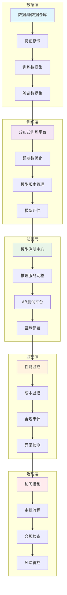

# 08 - AI/ML基础设施专业词典

> **适用版本**: Kubernetes v1.25-v1.32 | **最后更新**: 2026-02 | **作者**: Allen Galler | **质量等级**: ⭐⭐⭐⭐⭐ 专家级

---

## 目录

- [1. AI工作负载优化](#1-ai工作负载优化)
- [2. AI平台运维](#2-ai平台运维)
- [3. AI成本治理](#3-ai成本治理)
- [4. AI安全合规](#4-ai安全合规)
- [5. AI模型生命周期管理](#5-ai模型生命周期管理)
- [6. AI基础设施架构](#6-ai基础设施架构)

---

## 1. AI工作负载优化

### 1.1 GPU资源调度专业术语

| 术语 | 定义 | 技术要点 | 应用场景 | 相关工具 |
|------|------|----------|----------|----------|
| **GPU时间切片** | 将单个GPU虚拟化为多个逻辑GPU实例的技术 | 通过设备插件实现资源共享，支持多租户 | 开发环境、小模型推理 | NVIDIA Time-Slicing, vGPU |
| **MIG实例** | 多实例GPU技术，将物理GPU切分为多个独立实例 | A100/H100支持，硬件级隔离，显存/CUDA核心独立 | 多租户推理、混合工作负载 | NVIDIA MIG Manager |
| **GPU拓扑感知调度** | 考虑GPU间NVLink/PCIe拓扑关系的调度策略 | NUMA亲和性、带宽优化、减少跨节点通信 | 分布式训练、大模型推理 | Volcano, Kueue |
| **Gang调度** | 将一组Pod作为一个整体进行调度的机制 | 全部成功或全部失败，避免资源碎片 | 分布式训练、MPI作业 | Volcano, Kube-Batch |
| **GPU共享池** | 多个工作负载共享同一GPU资源池的管理方式 | 内存隔离、算力分配、优先级管理 | 推理服务、批量处理 | NVIDIA MPS, Run:ai |

### 1.2 分布式训练优化概念

| 概念 | 核心原理 | 优化策略 | 性能指标 | 实施复杂度 |
|------|----------|----------|----------|------------|
| **数据并行** | 复制模型到多个设备，每个处理不同数据批次 | AllReduce梯度同步、梯度压缩、混合精度 | 通信开销、收敛速度 | ⭐⭐ |
| **模型并行** | 将模型参数分割到不同设备上 | 流水线并行、张量并行、专家并行 | 内存占用、计算效率 | ⭐⭐⭐⭐ |
| **流水线并行** | 将模型按层分割，形成计算流水线 | 微批次、气泡消除、重叠计算通信 | 吞吐量、延迟 | ⭐⭐⭐ |
| **ZeRO优化** | 零冗余优化器，减少内存占用 | 优化器状态分区、梯度分区、参数分区 | 内存效率、训练规模 | ⭐⭐⭐ |
| **混合并行** | 组合多种并行策略的复合方案 | 数据+模型+流水线并行协同 | 最大化资源利用率 | ⭐⭐⭐⭐⭐ |

### 1.3 模型推理优化技术

| 技术 | 优化原理 | 适用场景 | 性能提升 | 实施难度 |
|------|----------|----------|----------|----------|
| **模型量化** | 将FP32权重转换为INT8/FP16等低精度格式 | 推理加速、内存优化 | 2-4倍性能提升 | ⭐⭐ |
| **知识蒸馏** | 用大模型指导小模型训练 | 模型压缩、移动端部署 | 30-50%精度保持 | ⭐⭐⭐ |
| **模型剪枝** | 移除不重要的神经网络连接 | 模型瘦身、边缘部署 | 50-90%参数减少 | ⭐⭐⭐ |
| **动态批处理** | 运行时合并多个推理请求 | 提高GPU利用率、降低延迟 | 2-5倍吞吐量提升 | ⭐⭐ |
| **连续批处理** | 保持模型持续处理请求流 | 减少冷启动、提高效率 | 30-70%延迟降低 | ⭐⭐⭐ |

---

## 2. AI平台运维

### 2.1 Kubeflow平台组件

| 组件 | 功能描述 | 运维要点 | 监控指标 | 故障处理 |
|------|----------|----------|----------|----------|
| **KF Pipelines** | ML工作流编排引擎 | 工作流状态监控、资源配额管理 | DAG执行成功率、步骤延迟 | 重试机制、资源扩容 |
| **Katib** | 超参数自动优化平台 | 试验管理、算法调优 | 试验完成率、最优参数收敛 | 算法切换、资源调整 |
| **Training Operator** | 分布式训练作业管理 | 作业调度、GPU资源分配 | 训练成功率、GPU利用率 | Gang调度、节点修复 |
| **Model Serving** | 模型部署和服务化 | 版本管理、流量分流 | QPS、延迟、错误率 | 自动扩缩容、蓝绿部署 |
| **VOLUMES** | 存储管理系统 | PVC管理、备份恢复 | 存储使用率、IOPS性能 | 存储扩容、快照恢复 |

### 2.2 模型注册中心概念

| 概念 | 定义 | 核心功能 | 技术实现 | 运维考虑 |
|------|------|----------|----------|----------|
| **Model Versioning** | 模型版本控制系统 | 版本追踪、回滚能力、分支管理 | Git + MLflow/MLeap | 存储管理、权限控制 |
| **Model Metadata** | 模型元数据管理 | 训练参数、性能指标、血缘关系 | 数据库 + 对象存储 | 数据一致性、查询性能 |
| **Model Lineage** | 模型血缘追踪 | 数据->特征->模型->部署全链路 | 图数据库 + 事件溯源 | 性能优化、存储策略 |
| **Model Governance** | 模型治理框架 | 合规检查、质量评估、审批流程 | 策略引擎 + 工作流 | 自动化程度、人工干预 |
| **Model Catalog** | 模型目录服务 | 发现、评估、比较不同模型 | 搜索引擎 + 评价系统 | 索引维护、用户体验 |

### 2.3 推理服务平台

| 服务类型 | 技术特点 | 部署模式 | 性能特征 | 运维复杂度 |
|----------|----------|----------|----------|------------|
| **vLLM** | PagedAttention内存优化、连续批处理 | Deployment/StatefulSet | 高吞吐、低延迟 | ⭐⭐⭐ |
| **TGI** | Transformer优化、多模型支持 | Deployment | 通用性强、易集成 | ⭐⭐ |
| **TensorRT-LLM** | NVIDIA优化、高性能推理 | DaemonSet | 极致性能、硬件绑定 | ⭐⭐⭐⭐ |
| **Seldon Core** | 多框架支持、AB测试 | Operator | 灵活性高、功能丰富 | ⭐⭐⭐⭐ |
| **KServe** | Kubernetes原生、Serverless | Knative | 自动扩缩、成本优化 | ⭐⭐⭐ |

---

## 3. AI成本治理

### 3.1 GPU资源成本优化

| 优化策略 | 实施方法 | 成本节约潜力 | 技术复杂度 | 风险等级 |
|----------|----------|--------------|------------|----------|
| **Spot实例利用** | 混合使用按需和竞价实例 | 50-80%成本节约 | ⭐⭐ | 中等 |
| **自动扩缩容** | 基于负载动态调整GPU节点 | 30-60%资源节约 | ⭐⭐⭐ | 低 |
| **资源共享** | 多任务共享GPU资源池 | 40-70%利用率提升 | ⭐⭐⭐⭐ | 中等 |
| **时段调度** | 非高峰时段执行训练任务 | 20-40%成本优化 | ⭐⭐ | 低 |
| **模型压缩** | 量化、蒸馏减少计算需求 | 30-50%硬件需求降低 | ⭐⭐⭐ | 低 |

### 3.2 成本监控与分析

| 监控维度 | 关键指标 | 分析方法 | 工具支持 | 实施建议 |
|----------|----------|----------|----------|----------|
| **GPU利用率** | 平均使用率、峰值利用率 | 趋势分析、异常检测 | DCGM + Prometheus | 设置告警阈值 |
| **训练成本** | 每次训练成本、单位精度成本 | 成本归因、ROI分析 | Kubecost + MLflow | 建立成本基线 |
| **推理成本** | 每万次推理成本、QPS成本效率 | 性价比分析、容量规划 | 自定义仪表板 | 优化实例规格 |
| **存储成本** | 数据集、模型、日志存储费用 | 生命周期管理、冷热分离 | 对象存储分级 | 定期清理策略 |
| **人力成本** | 运维投入、开发效率 | 时间追踪、自动化率 | 内部工时统计 | 流程优化建议 |

### 3.3 成本优化最佳实践

```yaml
# ========== GPU成本优化配置模板 ==========
apiVersion: apps/v1
kind: Deployment
metadata:
  name: cost-optimized-llm-service
  namespace: ai-inference
spec:
  replicas: 3
  template:
    spec:
      # 混合实例策略
      nodeSelector:
        node.kubernetes.io/instance-type: g4dn.xlarge  # 按需实例
      tolerations:
      - key: spot-instance
        operator: Equal
        value: "true"
        effect: NoSchedule
        
      containers:
      - name: inference-server
        image: vllm/vllm-openai:v0.4.2
        resources:
          requests:
            # 精确的资源请求，避免过度分配
            cpu: "2"
            memory: "8Gi"
            nvidia.com/gpu: "1"
          limits:
            # 合理的资源上限
            cpu: "4"
            memory: "16Gi"
            nvidia.com/gpu: "1"
            
        # 成本优化参数
        env:
        - name: VLLM_GPU_MEMORY_UTILIZATION
          value: "0.85"  # 优化GPU内存使用率
        - name: VLLM_MAX_NUM_BATCHED_TOKENS
          value: "4096"  # 控制批处理大小
        - name: VLLM_DTYPE
          value: "float16"  # 使用半精度降低内存需求
          
        # 自动扩缩容配置
        startupProbe:
          httpGet:
            path: /health
            port: 8000
          initialDelaySeconds: 60
          periodSeconds: 10
          
        livenessProbe:
          httpGet:
            path: /health
            port: 8000
          periodSeconds: 30
          
        readinessProbe:
          httpGet:
            path: /health
            port: 8000
          periodSeconds: 10

---
# ========== 成本监控配置 ==========
apiVersion: monitoring.coreos.com/v1
kind: PrometheusRule
metadata:
  name: ai-cost-monitoring
  namespace: monitoring
spec:
  groups:
  - name: gpu.cost.rules
    rules:
    # GPU利用率告警
    - alert: LowGPUUtilization
      expr: |
        avg(rate(DCGM_FI_DEV_GPU_UTIL[5m])) < 30
      for: 10m
      labels:
        severity: warning
      annotations:
        summary: "GPU利用率过低 ({{ $value }}%)"
        description: "检测到GPU资源浪费，建议优化资源配置"
        
    # 训练成本异常
    - alert: HighTrainingCost
      expr: |
        increase(kube_pod_container_resource_requests{resource="nvidia_com_gpu"}[1h]) * 
        avg_over_time(gpu_hourly_cost[1h]) > 100
      for: 5m
      labels:
        severity: warning
      annotations:
        summary: "单次训练成本过高"
        description: "当前训练任务预计成本超过阈值，请检查资源配置"
        
    # 推理性价比下降
    - alert: PoorInferenceCostEffectiveness
      expr: |
        rate(http_requests_total[5m]) / 
        avg(rate(DCGM_FI_DEV_GPU_UTIL[5m])) < 10
      for: 15m
      labels:
        severity: info
      annotations:
        summary: "推理性价比下降"
        description: "单位GPU利用率产生的请求数偏低，建议优化模型或扩容"
```

---

## 4. AI安全合规

### 4.1 模型安全概念

| 安全维度 | 威胁类型 | 防护措施 | 检测方法 | 合规要求 |
|----------|----------|----------|----------|----------|
| **模型投毒** | 训练数据恶意污染 | 数据清洗、异常检测 | 统计分析、对抗样本检测 | ISO/IEC 27001 |
| **对抗攻击** | 输入扰动欺骗模型 | 对抗训练、输入验证 | 黑盒测试、鲁棒性评估 | NIST AI风险管理框架 |
| **模型窃取** | 通过API逆向工程 | 查询限制、水印嵌入 | 行为分析、访问模式检测 | GDPR数据保护 |
| **隐私泄露** | 模型记忆训练数据 | 差分隐私、联邦学习 | 成员推理攻击检测 | CCPA消费者隐私 |
| **后门攻击** | 植入隐藏触发器 | 触发器检测、模型验证 | 输入输出分析、激活模式检查 | 等保2.0三级 |

### 4.2 数据隐私保护

| 保护技术 | 技术原理 | 适用场景 | 性能影响 | 实施复杂度 |
|----------|----------|----------|----------|------------|
| **差分隐私** | 添加数学噪声保护个体隐私 | 联邦学习、统计分析 | 5-15%精度损失 | ⭐⭐⭐⭐ |
| **联邦学习** | 数据不出本地，模型聚合 | 多方协作训练 | 通信开销较大 | ⭐⭐⭐⭐⭐ |
| **同态加密** | 密文状态下直接计算 | 敏感数据处理 | 性能损失巨大 | ⭐⭐⭐⭐⭐ |
| **安全多方计算** | 多方共同计算不泄露输入 | 联合建模 | 计算复杂度高 | ⭐⭐⭐⭐⭐ |
| **可信执行环境** | 硬件级安全隔离 | 敏感推理服务 | 轻微性能影响 | ⭐⭐⭐ |

### 4.3 合规审计框架

```yaml
# ========== AI合规审计策略 ==========
apiVersion: kyverno.io/v1
kind: ClusterPolicy
metadata:
  name: ai-model-compliance
spec:
  validationFailureAction: audit  # 审计模式，不阻断部署
  background: true
  rules:
  # 模型版本控制检查
  - name: model-version-tracking
    match:
      any:
      - resources:
          kinds:
          - Deployment
          selector:
            matchLabels:
              app-type: ml-model
    validate:
      message: "AI模型部署必须包含版本标签和训练数据来源信息"
      pattern:
        metadata:
          labels:
            model.version: "?*"
            training.data.source: "?*"
            compliance.level: "restricted|baseline"
            
  # GPU资源使用合规检查
  - name: gpu-resource-compliance
    match:
      any:
      - resources:
          kinds:
          - Pod
    validate:
      message: "GPU资源使用需要明确业务用途和成本归属"
      pattern:
        spec:
          containers:
          - resources:
              limits:
                nvidia.com/gpu: "?*"
            env:
            - name: BUSINESS_PURPOSE
              value: "?*"
            - name: COST_CENTER
              value: "?*"
              
  # 模型安全扫描
  - name: model-security-scan
    match:
      any:
      - resources:
          kinds:
          - Job
          selector:
            matchLabels:
              job-type: model-training
    validate:
      message: "模型训练任务必须包含安全扫描步骤"
      foreach:
      - list: "request.object.spec.template.spec.initContainers"
        deny:
          conditions:
            any:
            - key: "{{ element.name }}"
              operator: NotEquals
              value: "security-scan"
              
---
# ========== 合规监控仪表板配置 ==========
apiVersion: grafana.integreatly.org/v1beta1
kind: GrafanaDashboard
metadata:
  name: ai-compliance-dashboard
  namespace: monitoring
spec:
  json: |
    {
      "dashboard": {
        "title": "AI合规监控仪表板",
        "panels": [
          {
            "title": "模型合规状态",
            "type": "stat",
            "targets": [
              {
                "expr": "count(kube_pod_labels{label_app_type=\"ml-model\",label_compliance_level=\"restricted\"})",
                "legendFormat": "受限模型数量"
              },
              {
                "expr": "count(kube_pod_labels{label_app_type=\"ml-model\",label_training_data_source=~\".*pii.*\"})",
                "legendFormat": "处理PII数据模型"
              }
            ]
          },
          {
            "title": "GPU合规使用率",
            "type": "graph",
            "targets": [
              {
                "expr": "sum by(pod) (DCGM_FI_DEV_GPU_UTIL * on(pod) group_left(label_business_purpose) kube_pod_labels{label_app_type=\"ml-model\"})",
                "legendFormat": "{{pod}} - {{label_business_purpose}}"
              }
            ]
          },
          {
            "title": "合规违规事件",
            "type": "table",
            "targets": [
              {
                "expr": "kyverno_policy_results_total{rule_result=\"fail\",policy_name=~\"ai-model-compliance.*\"}",
                "format": "table"
              }
            ]
          }
        ]
      }
    }
```

---

## 5. AI模型生命周期管理

### 5.1 MLOps流水线阶段

| 阶段 | 核心活动 | 关键指标 | 自动化程度 | 质量门禁 |
|------|----------|----------|------------|----------|
| **数据准备** | 数据收集、清洗、标注 | 数据质量分数、标注准确率 | 70% | 数据完整性检查 |
| **特征工程** | 特征提取、选择、转换 | 特征重要性、相关性分析 | 80% | 特征稳定性验证 |
| **模型训练** | 超参数调优、分布式训练 | 验证集精度、收敛速度 | 90% | 性能基线对比 |
| **模型评估** | 离线评估、A/B测试 | 业务指标、公平性检查 | 85% | 准入标准测试 |
| **模型部署** | 灰度发布、蓝绿部署 | 部署成功率、回滚时间 | 95% | 预发环境验证 |
| **在线监控** | 性能监控、概念漂移检测 | 延迟、准确率、数据分布 | 90% | 异常自动告警 |
| **模型更新** | 增量学习、版本迭代 | 更新频率、改进幅度 | 75% | 回归测试验证 |

### 5.2 模型版本管理策略

| 策略类型 | 实施方式 | 优势 | 劣势 | 适用场景 |
|----------|----------|------|------|----------|
| **语义版本** | MAJOR.MINOR.PATCH格式 | 清晰的版本语义、易于理解 | 管理复杂、需要人工判断 | 成熟业务场景 |
| **时间戳版本** | YYYYMMDD.HHMMSS格式 | 自动生成、唯一性强 | 语义不直观、难以比较 | 快速迭代场景 |
| **Git SHA版本** | 基于代码提交哈希 | 完全可追溯、与代码绑定 | 不易读、长度较长 | 研发团队使用 |
| **实验ID版本** | 基于训练实验标识 | 与实验数据关联、便于追踪 | 系统耦合度高 | ML平台内部 |
| **混合版本** | 语义+时间戳组合 | 兼顾语义和唯一性 | 复杂度较高 | 企业级应用 |

### 5.3 模型治理框架

```yaml
# ========== 模型治理策略配置 ==========
apiVersion: ml.kubeflow.org/v1
kind: ModelGovernancePolicy
metadata:
  name: enterprise-model-governance
spec:
  # 模型准入控制
  admissionControl:
    enabled: true
    rules:
    - name: "model-card-required"
      condition: "metadata.annotations['model-card'] != ''"
      action: "reject"
      message: "部署AI模型必须提供完整的模型卡片"
      
    - name: "fairness-check"
      condition: "evaluation.fairness_score >= 0.8"
      action: "warn"
      message: "模型公平性指标低于标准阈值"
      
    - name: "privacy-compliance"
      condition: "training.data.contains_pii ? encryption.enabled == true : true"
      action: "reject"
      message: "处理PII数据的模型必须启用加密"

  # 模型监控要求
  monitoringRequirements:
    metrics:
    - name: "accuracy_drift"
      threshold: 0.05
      alert_severity: "warning"
      remediation: "automatic_rollback"
      
    - name: "latency_slo"
      threshold: 200  # ms
      alert_severity: "critical"
      remediation: "scale_up"
      
    - name: "cost_efficiency"
      threshold: 5.0  # $/1000请求
      alert_severity: "info"
      remediation: "recommend_optimization"

  # 生命周期管理
  lifecycleManagement:
    retention:
      active_models: "180d"      # 活跃模型保留180天
      archived_models: "2y"      # 归档模型保留2年
      failed_experiments: "30d"  # 失败实验保留30天
      
    promotion:
      criteria:
      - offline_accuracy_improvement: ">= 2%"  # 离线精度提升
      - online_metric_improvement: ">= 1%"     # 在线指标提升
      - stability_period: "7d"                 # 稳定期7天
      - traffic_split_max: "10%"               # 最大流量比例
      
    rollback:
      triggers:
      - accuracy_degradation: "> 5%"
      - latency_increase: "> 50%"
      - error_rate_spike: "> 200%"
      - cost_spike: "> 100%"
      
      procedure:
        step1: "reduce_traffic_to_10_percent"
        step2: "health_check_validation"
        step3: "complete_rollback_if_failed"
        timeout: "5m"
```

---

## 6. AI基础设施架构

### 6.1 训练基础设施模式

| 架构模式 | 核心特征 | 适用场景 | 优势 | 劣势 |
|----------|----------|----------|------|------|
| **集中式训练** | 统一GPU资源池，集中调度 | 大型企业、研究机构 | 资源利用率高、管理简单 | 单点故障风险 |
| **分布式训练** | 跨多节点并行训练 | 超大模型、科研项目 | 训练规模无限、性能卓越 | 网络要求高、调试复杂 |
| **混合训练** | 按需混合云资源 | 成本敏感项目 | 灵活性强、成本优化 | 管理复杂、网络延迟 |
| **边缘训练** | 本地设备上训练 | IoT、隐私敏感场景 | 数据本地化、低延迟 | 计算能力受限 |
| **联邦训练** | 多方协作不共享数据 | 金融机构、医疗机构 | 隐私保护、合规友好 | 收敛速度慢 |

### 6.2 推理部署架构

| 部署模式 | 技术特点 | 性能特征 | 成本考量 | 运维复杂度 |
|----------|----------|----------|----------|------------|
| **Serverless推理** | 按需启动、自动扩缩 | 冷启动延迟、成本优化 | 按使用付费、无闲置成本 | 低 |
| **常驻服务** | 持续运行、预热完成 | 低延迟、高QPS | 固定成本、资源预留 | 中 |
| **边缘推理** | 本地部署、就近服务 | 超低延迟、离线可用 | 减少带宽成本、硬件投资 | 高 |
| **混合部署** | 云端+边缘协同 | 全局优化、容错性强 | 成本分摊、资源互补 | 高 |
| **模型网格** | 多版本并存、智能路由 | A/B测试、渐进发布 | 灰度成本、版本管理 | 中高 |

### 6.3 AI平台参考架构



---

**表格底部标记**: Kusheet Project | 作者: Allen Galler (allengaller@gmail.com) | 最后更新: 2026-02 | 版本: v1.25-v1.32 | 质量等级: ⭐⭐⭐⭐⭐ 专家级