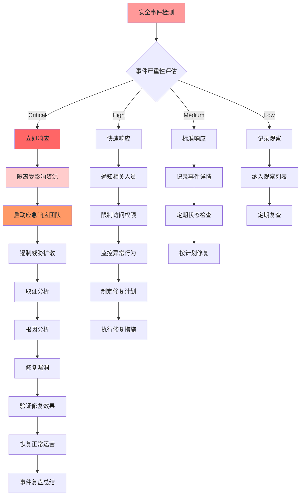

# 09 - 云原生安全专家指南

> **适用版本**: Kubernetes v1.25-v1.32 | **最后更新**: 2026-02 | **作者**: Allen Galler | **质量等级**: ⭐⭐⭐⭐⭐ 专家级

---

## 目录

- [1. 零信任安全架构](#1-零信任安全架构)
- [2. 容器安全防护](#2-容器安全防护)
- [3. 合规自动化体系](#3-合规自动化体系)
- [4. 威胁检测与响应](#4-威胁检测与响应)
- [5. 安全运维最佳实践](#5-安全运维最佳实践)
- [6. 安全工具链集成](#6-安全工具链集成)

---

## 1. 零信任安全架构

### 1.1 零信任核心原则

| 原则 | 定义 | 实施要点 | 技术实现 | 验证方法 |
|------|------|----------|----------|----------|
| **永不信任** | 默认拒绝所有访问请求 | 显式身份验证、最小权限 | mTLS双向认证、JWT令牌 | 端到端加密测试 |
| **始终验证** | 持续验证身份和权限 | 上下文感知、动态授权 | OPA策略引擎、SPIFFE/SPIRE | 行为分析检测 |
| **最小权限** | 仅授予必需的最小权限 | 细粒度控制、即时撤销 | RBAC、Pod安全标准 | 权限审计报告 |
| **纵深防御** | 多层安全防护机制 | 分层隔离、冗余保护 | NetworkPolicy、安全网关 | 渗透测试验证 |
| **持续监控** | 实时监控和分析威胁 | 异常检测、快速响应 | SIEM平台、行为基线 | 告警响应测试 |

### 1.2 Service Mesh安全架构

| 组件 | 安全功能 | 配置要点 | 监控指标 | 故障处理 |
|------|----------|----------|----------|----------|
| **Sidecar代理** | 流量加密、身份认证 | mTLS配置、证书轮换 | 连接成功率、延迟增加 | 代理重启、证书更新 |
| **控制平面** | 策略管理、服务发现 | 安全配置、访问控制 | 控制面健康、策略同步 | 故障转移、配置回滚 |
| **证书管理** | PKI体系、自动轮换 | 根证书管理、有效期设置 | 证书过期预警、轮换成功率 | 紧急证书更新 |
| **流量控制** | 熔断、限流、重试 | 超时配置、重试策略 | 请求成功率、错误率 | 流量策略调整 |
| **可观测性** | 安全日志、追踪信息 | 审计日志、分布式追踪 | 安全事件数量、追踪覆盖率 | 日志分析、链路排查 |

### 1.3 零信任网络实施

```yaml
# ========== Istio零信任配置 ==========
apiVersion: security.istio.io/v1beta1
kind: PeerAuthentication
metadata:
  name: default
  namespace: istio-system
spec:
  mtls:
    mode: STRICT  # 强制双向TLS认证
  
---
apiVersion: security.istio.io/v1beta1
kind: AuthorizationPolicy
metadata:
  name: allow-app-access
  namespace: production
spec:
  selector:
    matchLabels:
      app: backend-service
  rules:
  - from:
    - source:
        principals: ["cluster.local/ns/frontend/sa/frontend-sa"]
    to:
    - operation:
        methods: ["GET", "POST"]
        paths: ["/api/*"]
    when:
    - key: request.auth.claims[exp]
      values: ["true"]

---
# ========== SPIFFE/SPIRE身份管理 ==========
apiVersion: spiffe.io/v1alpha1
kind: SpiffeID
metadata:
  name: backend-workload
spec:
  spiffeId: "spiffe://example.org/ns/production/sa/backend"
  parentId: "spiffe://example.org/spire/server"
  selectors:
    - type: k8s
      value: "ns:production"
    - type: k8s
      value: "sa:backend-service-account"

---
# ========== 网络策略实施零信任 ==========
apiVersion: networking.k8s.io/v1
kind: NetworkPolicy
metadata:
  name: zero-trust-isolation
  namespace: production
spec:
  podSelector: {}
  policyTypes:
  - Ingress
  - Egress
  ingress:
  # 只允许来自授权服务的流量
  - from:
    - namespaceSelector:
        matchLabels:
          name: frontend
      podSelector:
        matchLabels:
          app: frontend-app
    ports:
    - protocol: TCP
      port: 8080
  egress:
  # 只允许访问必要的外部服务
  - to:
    - namespaceSelector:
        matchLabels:
          name: database
      podSelector:
        matchLabels:
          app: postgres
    ports:
    - protocol: TCP
      port: 5432
```

---

## 2. 容器安全防护

### 2.1 镜像安全扫描体系

| 扫描维度 | 检测内容 | 工具支持 | 扫描时机 | 阻断策略 |
|----------|----------|----------|----------|----------|
| **漏洞扫描** | CVE漏洞、已知安全缺陷 | Trivy、Clair、Anchore | 构建时、部署前、运行时 | Critical/High级别阻断 |
| **配置检查** | Dockerfile安全配置 | Checkov、Docker Scout | CI/CD流水线 | 基线不符合阻断 |
| **秘密检测** | 硬编码凭证、API密钥 | GitLeaks、detect-secrets | 代码提交、镜像构建 | 立即阻断并告警 |
| **许可证合规** | 开源许可证检查 | FOSSA、Black Duck | 构建阶段 | 商业许可证阻断 |
| **SBOM生成** | 软件物料清单 | Syft、BOM Tool | 构建完成后 | 存档用于审计 |

### 2.2 运行时安全防护

| 防护机制 | 技术实现 | 检测能力 | 响应动作 | 性能影响 |
|----------|----------|----------|----------|----------|
| **系统调用控制** | Seccomp、AppArmor | 异常系统调用检测 | 终止进程、告警 | 低(<5%) |
| **文件系统保护** | 只读根文件系统 | 未授权文件修改 | 拒绝写入、记录日志 | 极低 |
| **网络访问控制** | CNI网络策略 | 异常网络连接 | 断开连接、阻断流量 | 中等 |
| **进程行为监控** | Falco规则引擎 | 异常进程行为 | 告警、隔离容器 | 低(2-3%) |
| **特权提升防护** | Capability限制 | 权限滥用检测 | 拒绝提权、终止进程 | 无 |

### 2.3 容器安全最佳实践

```yaml
# ========== 生产级安全Pod配置 ==========
apiVersion: v1
kind: Pod
metadata:
  name: secure-application
  namespace: production
  labels:
    app: secure-app
    security-level: high
spec:
  # 服务账户和安全上下文
  serviceAccountName: app-service-account
  securityContext:
    runAsNonRoot: true
    runAsUser: 10001
    runAsGroup: 3000
    fsGroup: 2000
    supplementalGroups: [3000]
    
  # 容器安全配置
  containers:
  - name: app
    image: registry.example.com/secure-app:v1.0.0
    imagePullPolicy: Always
    
    # 安全上下文
    securityContext:
      allowPrivilegeEscalation: false
      readOnlyRootFilesystem: true
      runAsNonRoot: true
      runAsUser: 10001
      capabilities:
        drop:
        - ALL
        add:
        - NET_BIND_SERVICE  # 仅添加必要权限
        
    # 资源限制
    resources:
      requests:
        cpu: "100m"
        memory: "128Mi"
      limits:
        cpu: "500m"
        memory: "512Mi"
        
    # 环境变量安全
    env:
    - name: DATABASE_URL
      valueFrom:
        secretKeyRef:
          name: db-credentials
          key: connection-string
    - name: LOG_LEVEL
      value: "INFO"
      
    # 挂载卷安全
    volumeMounts:
    - name: tmp-volume
      mountPath: /tmp
    - name: app-config
      mountPath: /config
      readOnly: true
    - name: logs-volume
      mountPath: /var/log
      
  # 初始化容器安全
  initContainers:
  - name: init-db
    image: busybox:1.35
    securityContext:
      runAsNonRoot: true
      runAsUser: 10001
      allowPrivilegeEscalation: false
      readOnlyRootFilesystem: true
    command: ['sh', '-c', 'echo "Initializing database connection..."']
    
  # 卷配置
  volumes:
  - name: tmp-volume
    emptyDir:
      medium: Memory  # 内存卷，重启后清除
  - name: app-config
    configMap:
      name: app-config
  - name: logs-volume
    persistentVolumeClaim:
      claimName: app-logs-pvc
      
---
# ========== 镜像安全扫描流水线 ==========
apiVersion: tekton.dev/v1beta1
kind: Pipeline
metadata:
  name: secure-build-pipeline
spec:
  workspaces:
  - name: shared-data
  tasks:
  - name: build-image
    taskRef:
      name: kaniko-build
    workspaces:
    - name: source
      workspace: shared-data
    params:
    - name: IMAGE
      value: "$(params.IMAGE_URL):$(params.IMAGE_TAG)"
      
  - name: vulnerability-scan
    taskRef:
      name: trivy-scan
    runAfter: ["build-image"]
    workspaces:
    - name: source
      workspace: shared-data
    params:
    - name: IMAGE
      value: "$(params.IMAGE_URL):$(params.IMAGE_TAG)"
    - name: SEVERITY_THRESHOLD
      value: "HIGH"
      
  - name: configuration-check
    taskRef:
      name: checkov-scan
    runAfter: ["build-image"]
    workspaces:
    - name: source
      workspace: shared-data
    params:
    - name: SOURCE_PATH
      value: "."
      
  - name: sbom-generation
    taskRef:
      name: syft-sbom
    runAfter: ["build-image"]
    workspaces:
    - name: source
      workspace: shared-data
    params:
    - name: IMAGE
      value: "$(params.IMAGE_URL):$(params.IMAGE_TAG)"
    - name: OUTPUT_FORMAT
      value: "cyclonedx-json"
      
  - name: policy-evaluation
    taskRef:
      name: opa-policy-check
    runAfter: ["vulnerability-scan", "configuration-check"]
    workspaces:
    - name: source
      workspace: shared-data
    params:
    - name: POLICY_BUNDLE
      value: "security-policies"
    - name: INPUT_DATA
      value: "$(workspaces.source.path)/scan-results.json"
```

---

## 3. 合规自动化体系

### 3.1 主要合规标准要求

| 合规标准 | 适用行业 | 核心要求 | Kubernetes映射 | 审计频率 |
|----------|----------|----------|----------------|----------|
| **SOC2 Type II** | SaaS/云服务 | 安全性、可用性、机密性 | RBAC、审计日志、网络隔离 | 年度 |
| **ISO 27001** | 通用 | 信息安全管理 | 安全策略、风险评估、访问控制 | 年度 |
| **PCI-DSS v4.0** | 支付行业 | 数据保护、访问控制 | 密钥管理、网络分段、日志审计 | 季度 |
| **HIPAA** | 医疗行业 | 患者数据保护 | 数据加密、访问日志、备份策略 | 年度 |
| **GDPR** | 欧盟数据 | 数据主体权利、隐私保护 | 数据处理记录、隐私影响评估 | 持续 |
| **等保2.0三级** | 中国 | 网络安全等级保护 | 安全加固、入侵检测、备份恢复 | 年度 |

### 3.2 自动化合规检查

| 检查类别 | 检查项 | 自动化工具 | 检查频率 | 告警级别 |
|----------|--------|------------|----------|----------|
| **身份认证** | 多因素认证启用 | OPA/Gatekeeper | 实时 | Critical |
| **访问控制** | RBAC权限最小化 | RBAC Lookup工具 | 每日 | High |
| **网络安全** | NetworkPolicy配置 | kube-score | 每小时 | Medium |
| **数据保护** | etcd加密配置 | kube-bench | 每日 | High |
| **审计日志** | 审计策略完整性 | audit2rbac | 实时 | Medium |
| **镜像安全** | 镜像漏洞扫描 | Trivy Operator | 每次部署 | High |
| **配置安全** | 安全基线检查 | Kubeaudit | 每小时 | Medium |
| **备份恢复** | 备份策略验证 | Velero检查 | 每日 | High |

### 3.3 合规自动化实施

```yaml
# ========== 合规检查策略 ==========
apiVersion: kyverno.io/v1
kind: ClusterPolicy
metadata:
  name: compliance-automation
spec:
  validationFailureAction: audit  # 审计模式，不阻断但记录
  background: true
  rules:
  # SOC2合规 - 访问日志记录
  - name: soc2-access-logging
    match:
      any:
      - resources:
          kinds:
          - Pod
    validate:
      message: "所有Pod必须配置访问日志记录"
      pattern:
        spec:
          containers:
          - env:
            - name: "ENABLE_ACCESS_LOGGING"
              value: "true"
              
  # PCI-DSS合规 - 网络隔离
  - name: pci-network-isolation
    match:
      any:
      - resources:
          kinds:
          - NetworkPolicy
    validate:
      message: "处理支付数据的服务必须有明确的网络策略"
      pattern:
        spec:
          podSelector:
            matchLabels:
              data.classification: "payment"
          policyTypes:
          - Ingress
          - Egress
          
  # HIPAA合规 - 数据加密
  - name: hipaa-data-encryption
    match:
      any:
      - resources:
          kinds:
          - PersistentVolumeClaim
    validate:
      message: "医疗数据存储必须启用加密"
      pattern:
        metadata:
          annotations:
            encryption.enabled: "true"
            
  # GDPR合规 - 数据处理记录
  - name: gdpr-data-processing
    match:
      any:
      - resources:
          kinds:
          - Deployment
    preconditions:
      any:
      - key: "{{ request.object.metadata.labels.\"handles-personal-data\" }}"
        operator: Equals
        value: "true"
    validate:
      message: "处理个人数据的应用必须记录数据处理目的"
      pattern:
        metadata:
          annotations:
            data.processing.purpose: "?*"
            data.retention.period: "?*"

---
# ========== 合规监控仪表板 ==========
apiVersion: grafana.integreatly.org/v1beta1
kind: GrafanaDashboard
metadata:
  name: compliance-monitoring
  namespace: monitoring
spec:
  json: |
    {
      "dashboard": {
        "title": "合规自动化监控仪表板",
        "panels": [
          {
            "title": "合规状态概览",
            "type": "stat",
            "targets": [
              {
                "expr": "compliance_checks_passed_total / compliance_checks_total * 100",
                "legendFormat": "整体合规率"
              },
              {
                "expr": "count(kyverno_policy_results_total{rule_result=\"fail\",policy_name=~\"compliance.*\"})",
                "legendFormat": "违规项数量"
              }
            ]
          },
          {
            "title": "各合规标准状态",
            "type": "barchart",
            "targets": [
              {
                "expr": "compliance_standard_status{standard=\"soc2\"}",
                "legendFormat": "SOC2"
              },
              {
                "expr": "compliance_standard_status{standard=\"iso27001\"}",
                "legendFormat": "ISO 27001"
              },
              {
                "expr": "compliance_standard_status{standard=\"pci-dss\"}",
                "legendFormat": "PCI-DSS"
              }
            ]
          },
          {
            "title": "违规趋势分析",
            "type": "graph",
            "targets": [
              {
                "expr": "increase(kyverno_policy_results_total{rule_result=\"fail\"}[1h])",
                "legendFormat": "每小时新增违规"
              }
            ]
          },
          {
            "title": "合规检查详情",
            "type": "table",
            "targets": [
              {
                "expr": "kyverno_policy_results_total{rule_result=\"fail\"}",
                "format": "table"
              }
            ]
          }
        ]
      }
    }

---
# ========== 自动化合规修复 ==========
apiVersion: batch/v1
kind: CronJob
metadata:
  name: compliance-remediation
  namespace: security
spec:
  schedule: "0 */6 * * *"  # 每6小时执行一次
  jobTemplate:
    spec:
      template:
        spec:
          serviceAccountName: compliance-operator
          containers:
          - name: compliance-fix
            image: security/compliance-remediation:latest
            command:
            - /bin/sh
            - -c
            - |
              # 自动修复常见的合规问题
              echo "开始合规自动修复..."
              
              # 修复缺失的NetworkPolicy
              kubectl get ns -o name | while read ns; do
                if ! kubectl get networkpolicy -n ${ns##*/} 2>/dev/null; then
                  echo "为命名空间 ${ns##*/} 创建默认网络策略"
                  kubectl apply -f - <<EOF
              apiVersion: networking.k8s.io/v1
              kind: NetworkPolicy
              metadata:
                name: default-deny-all
                namespace: ${ns##*/}
              spec:
                podSelector: {}
                policyTypes:
                - Ingress
                - Egress
              EOF
                fi
              done
              
              # 修复不安全的Pod配置
              kubectl get pods -A -o json | jq -r '.items[] | select(.spec.containers[].securityContext == null or .spec.containers[].securityContext.runAsNonRoot != true) | "\(.metadata.namespace)/\(.metadata.name)"' | while read pod; do
                echo "修复不安全的Pod配置: $pod"
                # 这里可以调用具体的修复脚本
              done
              
              echo "合规自动修复完成"
          restartPolicy: OnFailure
```

---

## 4. 威胁检测与响应

### 4.1 运行时威胁检测

| 威胁类型 | 检测指标 | 检测工具 | 告警阈值 | 响应动作 |
|----------|----------|----------|----------|----------|
| **异常进程** | 进程创建、execve调用 | Falco | 高风险进程创建 | 终止进程、隔离容器 |
| **文件篡改** | 文件创建、修改、删除 | Sysdig Secure | 敏感文件修改 | 告警、版本回滚 |
| **网络异常** | 异常连接、数据外传 | Cilium Hubble | 未知目的地连接 | 断开连接、阻断流量 |
| **权限提升** | Capabilities变更、setuid调用 | Auditd | 权限提升尝试 | 终止进程、记录日志 |
| **加密挖矿** | CPU使用模式、网络连接 | Node Exporter | 异常CPU使用 | 终止容器、节点隔离 |

### 4.2 安全事件响应流程



### 4.3 威胁情报集成

```yaml
# ========== 威胁检测规则配置 ==========
apiVersion: falco.org/v1
kind: FalcoRules
metadata:
  name: threat-detection-rules
  namespace: security
spec:
  rules:
  # 检测加密货币挖矿活动
  - rule: Crypto Mining Activity
    desc: Detect crypto mining processes and suspicious network connections
    condition: >
      spawned_process and proc.name in (xmrig, cgminer, bfgminer) or
      (outbound and fd.sport in (3333, 4444, 5555, 7777, 9999))
    output: >
      Suspicious crypto mining activity detected (user=%user.name command=%proc.cmdline connection=%fd.name)
    priority: CRITICAL
    tags: [mitre_execution, crypto_mining]
    
  # 检测容器逃逸尝试
  - rule: Container Escape Attempt
    desc: Detect attempts to escape from container to host
    condition: >
      spawned_process and proc.name in (chroot, nsenter) and
      container and not proc.pname in (docker-init, containerd-shim)
    output: >
      Potential container escape attempt detected (user=%user.name command=%proc.cmdline container=%container.id)
    priority: CRITICAL
    tags: [mitre_privilege_escalation, container_escape]
    
  # 检测恶意文件下载
  - rule: Malicious File Download
    desc: Detect download of potentially malicious files
    condition: >
      (evt.type=open or evt.type=openat) and
      fd.name contains ".sh" and
      proc.cmdline contains "curl" and
      proc.cmdline contains "http"
    output: >
      Suspicious script download detected (user=%user.name file=%fd.name command=%proc.cmdline)
    priority: HIGH
    tags: [mitre_command_and_control, malicious_download]
    
  # 检测横向移动
  - rule: Lateral Movement Detection
    desc: Detect unusual SSH connections and credential usage
    condition: >
      evt.type=execve and
      proc.name=ssh and
      user.name=root and
      not proc.cmdline contains "localhost"
    output: >
      Unusual SSH connection detected (user=%user.name command=%proc.cmdline)
    priority: MEDIUM
    tags: [mitre_lateral_movement, ssh_access]

---
# ========== 安全事件响应配置 ==========
apiVersion: response.ealco.io/v1
kind: SecurityPlaybook
metadata:
  name: incident-response-playbook
  namespace: security
spec:
  triggers:
  - name: critical-falco-alert
    source: falco
    severity: CRITICAL
    conditions:
    - rule_name in ["Crypto Mining Activity", "Container Escape Attempt"]
    
  - name: high-severity-vulnerability
    source: trivy
    severity: HIGH
    conditions:
    - vulnerability.cvss_score >= 7.0
    
  actions:
  # 自动响应动作
  - name: isolate-pod
    type: kubernetes
    action: "patch"
    target: "pod"
    patch:
      spec:
        tolerations:
        - key: "security/isolated"
          operator: "Exists"
          effect: "NoExecute"
          
  - name: terminate-process
    type: runtime
    action: "kill"
    target: "process"
    match:
      pid: "{{ .alert.process.pid }}"
      
  - name: block-network
    type: network
    action: "iptables"
    target: "host"
    rules:
    - chain: "INPUT"
      action: "DROP"
      source: "{{ .alert.connection.remote_ip }}"
      
  # 通知动作
  - name: slack-notification
    type: notification
    channel: "security-alerts"
    message: |
      🔴 Security Alert: {{ .alert.rule }}
      Severity: {{ .alert.priority }}
      Resource: {{ .alert.resource.name }}
      Time: {{ .alert.timestamp }}
      Details: {{ .alert.output }}
      
  - name: pagerduty-alert
    type: notification
    service: "PAGERDUTY_SERVICE_KEY"
    urgency: "high"
    message: "Critical security incident requiring immediate attention"
```

---

## 5. 安全运维最佳实践

### 5.1 安全左移策略

| 实践领域 | 具体措施 | 工具支持 | 实施要点 | 效果评估 |
|----------|----------|----------|----------|----------|
| **代码安全** | SAST静态分析、依赖检查 | SonarQube、Snyk | CI流水线集成、门禁控制 | 漏洞发现率、修复时效 |
| **镜像安全** | 构建时扫描、基础镜像管理 | Trivy、Anchore | 多阶段构建、可信源验证 | 镜像漏洞数、构建时间 |
| **配置安全** | 基础设施即代码安全检查 | Checkov、TFLint | GitOps流程、策略即代码 | 配置合规率、部署成功率 |
| **权限管理** | 最小权限原则、定期审查 | RBAC Lookup、OPA | JIT权限、自动回收 | 权限滥用率、合规检查 |
| **密钥管理** | 密钥轮换、外部密钥存储 | HashiCorp Vault、AWS Secrets Manager | 自动化轮换、访问审计 | 密钥泄露风险、轮换效率 |

### 5.2 安全监控体系

| 监控维度 | 关键指标 | 告警阈值 | 响应时间 | 负责团队 |
|----------|----------|----------|----------|----------|
| **身份认证** | 失败登录次数、异常认证模式 | >10次/分钟、异地登录 | 1分钟 | 安全运营 |
| **访问控制** | 权限变更、异常访问模式 | 敏感资源访问、权限提升 | 5分钟 | 平台安全 |
| **数据安全** | 数据泄露、异常数据访问 | 大量数据导出、非授权访问 | 10分钟 | 数据保护 |
| **系统安全** | 系统漏洞、补丁状态 | 高危漏洞、补丁缺失 | 2小时 | 基础设施 |
| **网络安全** | 异常流量、DDoS攻击 | 流量激增、连接异常 | 15分钟 | 网络安全 |
| **应用安全** | 应用漏洞、业务逻辑缺陷 | 新发现漏洞、业务异常 | 1小时 | 应用安全 |

### 5.3 安全运维自动化

```yaml
# ========== 安全运维自动化配置 ==========
apiVersion: batch/v1
kind: CronJob
metadata:
  name: security-automation
  namespace: security-ops
spec:
  schedule: "*/30 * * * *"  # 每30分钟执行
  jobTemplate:
    spec:
      template:
        spec:
          serviceAccountName: security-automation
          containers:
          - name: security-checks
            image: security/secops-tools:latest
            env:
            - name: SLACK_WEBHOOK_URL
              valueFrom:
                secretKeyRef:
                  name: secops-secrets
                  key: slack-webhook
            command:
            - /bin/sh
            - -c
            - |
              #!/bin/bash
              set -euo pipefail
              
              echo "开始安全自动化检查..."
              
              # 1. 漏洞扫描
              echo "执行漏洞扫描..."
              trivy k8s --report summary cluster > /tmp/vulnerability-report.txt
              
              # 2. 配置安全检查
              echo "执行配置安全检查..."
              kubescape scan framework nsa --exclude-namespaces kube-system > /tmp/config-security-report.txt
              
              # 3. 权限审计
              echo "执行权限审计..."
              kubectl get clusterroles,clusterrolebindings,roles,rolebindings -A -o wide > /tmp/rbac-audit.txt
              
              # 4. 网络策略检查
              echo "执行网络策略检查..."
              kubectl get networkpolicies -A > /tmp/network-policy-status.txt
              
              # 5. 生成安全报告
              cat > /tmp/security-summary.md <<EOF
              # 安全自动化检查报告
              
              ## 检查时间
              $(date)
              
              ## 主要发现
              $(grep -i "critical\|high" /tmp/vulnerability-report.txt | head -10)
              
              ## 建议措施
              1. 修复高危漏洞
              2. 完善网络策略
              3. 优化RBAC配置
              4. 加强监控告警
              EOF
              
              # 6. 发送通知
              curl -X POST -H 'Content-type: application/json' \
                --data "{\"text\":\"🔐 安全检查完成，发现 $(wc -l < /tmp/vulnerability-report.txt) 个潜在问题\"}" \
                $SLACK_WEBHOOK_URL
              
              echo "安全自动化检查完成"
          restartPolicy: OnFailure

---
# ========== 安全补丁管理 ==========
apiVersion: batch/v1
kind: Job
metadata:
  name: security-patch-management
  namespace: security-ops
spec:
  template:
    spec:
      serviceAccountName: patch-manager
      containers:
      - name: patch-manager
        image: security/patch-manager:latest
        env:
        - name: GITHUB_TOKEN
          valueFrom:
            secretKeyRef:
              name: github-secrets
              key: token
        command:
        - /bin/sh
        - -c
        - |
          #!/bin/bash
          set -euo pipefail
          
          echo "开始安全补丁管理流程..."
          
          # 1. 检查基础镜像更新
          LATEST_ALPINE=$(curl -s https://hub.docker.com/v2/repositories/library/alpine/tags/latest | jq -r .digest)
          CURRENT_ALPINE=$(docker inspect alpine:latest | jq -r '.[0].Id')
          
          if [ "$LATEST_ALPINE" != "$CURRENT_ALPINE" ]; then
            echo "发现Alpine基础镜像更新，触发重建流程"
            # 触发CI/CD流水线重建镜像
            curl -X POST \
              -H "Authorization: token $GITHUB_TOKEN" \
              -H "Accept: application/vnd.github.v3+json" \
              https://api.github.com/repos/organization/base-images/dispatches \
              -d '{"event_type":"base-image-update"}'
          fi
          
          # 2. 检查依赖包安全更新
          OUTDATED_PACKAGES=$(apk list --upgradable | grep -E "(openssl|curl|openssh)")
          if [ -n "$OUTDATED_PACKAGES" ]; then
            echo "发现需要更新的安全包:"
            echo "$OUTDATED_PACKAGES"
            # 生成更新PR
            # 这里可以集成具体的PR创建逻辑
          fi
          
          # 3. 检查Kubernetes版本更新
          CURRENT_VERSION=$(kubectl version --short | grep Server | awk '{print $3}')
          LATEST_STABLE="v1.28.6"  # 假设最新稳定版本
          
          if [ "$CURRENT_VERSION" != "$LATEST_STABLE" ]; then
            echo "Kubernetes版本需要更新: $CURRENT_VERSION -> $LATEST_STABLE"
            # 生成升级计划和风险评估
          fi
          
          echo "安全补丁管理检查完成"
      restartPolicy: Never
```

---

## 6. 安全工具链集成

### 6.1 安全工具生态系统

| 工具类别 | 推荐工具 | 核心功能 | 集成方式 | 成本考虑 |
|----------|----------|----------|----------|----------|
| **漏洞扫描** | Trivy、Grype | 镜像/文件系统漏洞检测 | CI/CD插件、Operator | 开源免费 |
| **配置检查** | Checkov、Kubeaudit | 基础设施配置安全检查 | Pre-commit hook、准入控制器 | 开源免费 |
| **运行时防护** | Falco、Sysdig | 实时威胁检测和响应 | DaemonSet、Sidecar | 商业版需付费 |
| **策略执行** | OPA/Gatekeeper | 策略即代码、准入控制 | Admission webhook、CRD | 开源免费 |
| **密钥管理** | HashiCorp Vault、AWS Secrets Manager | 密钥存储、动态密钥生成 | Sidecar注入、外部API | 商业版需付费 |
| **合规检查** | kube-bench、Polaris | 基准检查、最佳实践验证 | 定期Job、实时监控 | 开源免费 |

### 6.2 安全工具链部署

```yaml
# ========== 安全工具链统一部署 ==========
apiVersion: v1
kind: Namespace
metadata:
  name: security-tools
  labels:
    security-tier: "platform"

---
# Trivy Operator - 持续漏洞扫描
apiVersion: helm.cattle.io/v1
kind: HelmChart
metadata:
  name: trivy-operator
  namespace: security-tools
spec:
  chart: trivy-operator
  repo: https://aquasecurity.github.io/helm-charts/
  version: "0.18.0"
  values:
    trivy:
      ignoreUnfixed: true
      severity: "CRITICAL,HIGH"
      resources:
        requests:
          cpu: "100m"
          memory: "128Mi"
        limits:
          cpu: "500m"
          memory: "512Mi"

---
# Falco - 运行时威胁检测
apiVersion: helm.cattle.io/v1
kind: HelmChart
metadata:
  name: falco
  namespace: security-tools
spec:
  chart: falco
  repo: https://falcosecurity.github.io/charts
  version: "3.6.0"
  values:
    falco:
      rules_file:
      - /etc/falco/falco_rules.yaml
      - /etc/falco/falco_rules.local.yaml
      - /etc/falco/k8s_audit_rules.yaml
    driver:
      enabled: true
      kind: ebpf

---
# OPA Gatekeeper - 策略执行
apiVersion: helm.cattle.io/v1
kind: HelmChart
metadata:
  name: gatekeeper
  namespace: security-tools
spec:
  chart: gatekeeper
  repo: https://open-policy-agent.github.io/gatekeeper/charts
  version: "3.14.0"
  values:
    replicas: 2
    auditInterval: 60
    constraintViolationsLimit: 20

---
# 安全监控集成配置
apiVersion: monitoring.coreos.com/v1
kind: ServiceMonitor
metadata:
  name: security-tools-monitor
  namespace: security-tools
spec:
  selector:
    matchLabels:
      app: security-monitoring
  endpoints:
  - port: metrics
    interval: 30s
    path: /metrics
  namespaceSelector:
    matchNames:
    - security-tools

---
# 统一安全仪表板
apiVersion: grafana.integreatly.org/v1beta1
kind: GrafanaDashboard
metadata:
  name: unified-security-dashboard
  namespace: security-tools
spec:
  json: |
    {
      "dashboard": {
        "title": "统一安全监控仪表板",
        "panels": [
          {
            "title": "安全工具健康状态",
            "type": "stat",
            "targets": [
              {"expr": "up{job=\"trivy-operator\"}", "legendFormat": "Trivy Operator"},
              {"expr": "up{job=\"falco\"}", "legendFormat": "Falco"},
              {"expr": "up{job=\"gatekeeper\"}", "legendFormat": "Gatekeeper"}
            ]
          },
          {
            "title": "安全事件趋势",
            "type": "graph",
            "targets": [
              {"expr": "rate(falco_events_total[5m])", "legendFormat": "威胁事件"},
              {"expr": "rate(trivy_image_vulnerabilities_total[5m])", "legendFormat": "漏洞发现"},
              {"expr": "rate(gatekeeper_violations_total[5m])", "legendFormat": "策略违规"}
            ]
          },
          {
            "title": "安全评分",
            "type": "gauge",
            "targets": [
              {"expr": "security_posture_score", "legendFormat": "当前安全评分"}
            ]
          }
        ]
      }
    }
```

---

**表格底部标记**: Kusheet Project | 作者: Allen Galler (allengaller@gmail.com) | 最后更新: 2026-02 | 版本: v1.25-v1.32 | 质量等级: ⭐⭐⭐⭐⭐ 专家级