# 10 - 多云混合云运维手册

> **适用版本**: Kubernetes v1.25-v1.32 | **最后更新**: 2026-02 | **作者**: Allen Galler | **质量等级**: ⭐⭐⭐⭐⭐ 专家级

---

## 知识地图

| 属性 | 说明 |
|------|------|
| **文件角色** | 多云混合云运维手册 — 跨云环境的K8s集群管理指南 |
| **适合读者** | 单集群运维→多集群管理→跨云架构设计 |
| **前置知识** | 01(运维实践)、05(概念参考) |
| **关联文件** | 01(运维最佳实践)、04(SRE成熟度)、15(SLI/SLO) |

### 多云 vs 混合云 vs 多集群

| 概念 | 定义 | 典型场景 |
|------|------|----------|
| **多集群** | 同一云上运行多个K8s集群 | 环境隔离(dev/staging/prod)、地域部署 |
| **混合云** | 私有云+公有云混合 | 核心业务私有云、突发流量公有云 |
| **多云** | 使用多个公有云厂商 | 避免厂商锁定、利用各云优势 |

---

## 目录

- [1. 多云架构设计](#1-多云架构设计)
- [2. 成本优化策略](#2-成本优化策略)
- [3. 统一监控体系](#3-统一监控体系)
- [4. 运维自动化](#4-运维自动化)
- [5. 灾备与容灾](#5-灾备与容灾)
- [6. 多云治理框架](#6-多云治理框架)

---

## 1. 多云架构设计

> **🔰 初学者导读**: 多云架构的核心挑战是"统一管理异构环境"。就像管理不同品牌的汽车车队,需要统一的调度系统、维护标准和监控手段。关键决策:集群联邦 vs 独立集群+统一管理平面。

### 1.1 多云部署模式

| 部署模式 | 架构特点 | 适用场景 | 优势 | 劣势 | 复杂度 |
|----------|----------|----------|------|------|--------|
| **主动-主动** | 多个云环境同时提供服务 | 全球用户、高可用要求 | 最高可用性、负载分担 | 成本最高、管理复杂 | ⭐⭐⭐⭐⭐ |
| **主动-被动** | 主云提供服务，备云待命 | 灾备场景、成本敏感 | 成本适中、灾备能力强 | 资源利用率低 | ⭐⭐⭐ |
| **混合部署** | 公有云+私有云结合 | 数据合规、混合工作负载 | 合规友好、灵活性强 | 网络复杂、运维难度大 | ⭐⭐⭐⭐ |
| **分区域部署** | 按地理区域选择最优云 | 本地化服务、延迟优化 | 用户体验佳、合规满足 | 多供应商管理 | ⭐⭐⭐ |
| **功能分离** | 不同云承担不同功能 | 专业化分工、成本优化 | 资源专业化、成本控制 | 依赖性强、集成复杂 | ⭐⭐⭐⭐ |

### 1.2 多云网络架构

| 网络模式 | 技术实现 | 性能特征 | 安全性 | 成本 | 实施复杂度 |
|----------|----------|----------|--------|------|------------|
| **VPN互联** | IPSec/OpenVPN隧道 | 中等延迟、带宽受限 | 高安全 | 低成本 | ⭐⭐ |
| **专线连接** | AWS Direct Connect、Azure ExpressRoute | 低延迟、高带宽 | 最高安全 | 高成本 | ⭐⭐⭐⭐ |
| **SD-WAN** | 软件定义广域网 | 智能路由、优化传输 | 中等安全 | 中等成本 | ⭐⭐⭐ |
| **云间对等** | VPC Peering、Private Link | 最低延迟、原生性能 | 云厂商限制 | 低成本 | ⭐⭐ |
| **服务网格** | Istio多集群、Linkerd | 应用层透明 | 高级安全 | 中等成本 | ⭐⭐⭐⭐⭐ |

### 1.3 多云架构设计原则

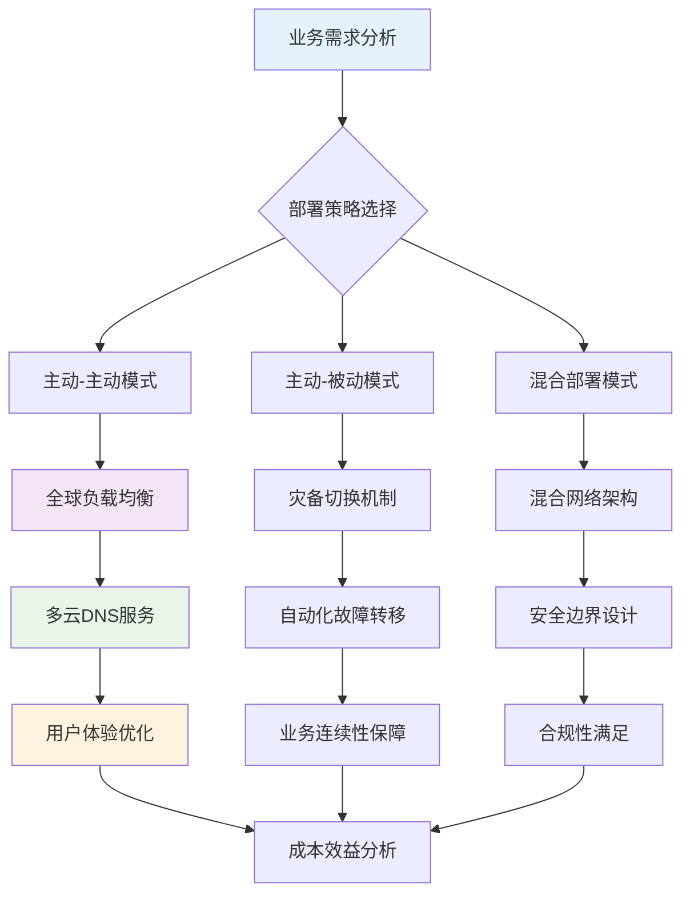

### 1.4 多云基础设施代码化

```yaml
# ========== Terraform多云基础设施定义 ==========
# main.tf - 多云基础设施主配置
terraform {
  required_providers {
    aws = {
      source  = "hashicorp/aws"
      version = "~> 5.0"
    }
    azurerm = {
      source  = "hashicorp/azurerm"
      version = "~> 3.0"
    }
    google = {
      source  = "hashicorp/google"
      version = "~> 5.0"
    }
  }
}

# AWS基础设施
provider "aws" {
  region = var.aws_region
  alias  = "aws_primary"
}

provider "aws" {
  region = var.aws_backup_region
  alias  = "aws_backup"
}

# Azure基础设施
provider "azurerm" {
  features {}
  alias = "azure_primary"
}

# GCP基础设施
provider "google" {
  project = var.gcp_project
  region  = var.gcp_region
  alias   = "gcp_primary"
}

# ========== 多云Kubernetes集群定义 ==========
# aws_cluster.tf
resource "aws_eks_cluster" "primary" {
  provider = aws.aws_primary
  name     = "primary-cluster"
  role_arn = aws_iam_role.eks_cluster.arn
  
  vpc_config {
    subnet_ids = aws_subnet.private[*].id
  }
  
  # 启用多云集成功能
  enabled_cluster_log_types = ["api", "audit", "authenticator", "controllerManager", "scheduler"]
  
  # 集群版本管理
  version = var.k8s_version
}

resource "aws_eks_node_group" "primary_workers" {
  provider = aws.aws_primary
  cluster_name    = aws_eks_cluster.primary.name
  node_group_name = "primary-workers"
  node_role_arn   = aws_iam_role.node.arn
  
  scaling_config {
    desired_size = 3
    max_size     = 10
    min_size     = 2
  }
  
  instance_types = ["m5.large", "m5.xlarge"]
  capacity_type  = "ON_DEMAND"
  
  # 多云标签标准化
  tags = {
    Environment    = "production"
    ClusterRole    = "primary"
    MultiCloudId   = var.multicloud_id
    CostCenter     = var.cost_center
  }
}

# azure_cluster.tf
resource "azurerm_kubernetes_cluster" "backup" {
  provider            = azurerm.azure_primary
  name                = "backup-cluster"
  location            = var.azure_location
  resource_group_name = azurerm_resource_group.backup.name
  dns_prefix          = "backup-cluster"
  
  default_node_pool {
    name       = "default"
    node_count = 3
    vm_size    = "Standard_D2_v2"
  }
  
  identity {
    type = "SystemAssigned"
  }
  
  # 网络配置
  network_profile {
    network_plugin = "azure"
    network_policy = "calico"
  }
  
  tags = {
    Environment  = "production"
    ClusterRole  = "backup"
    MultiCloudId = var.multicloud_id
    CostCenter   = var.cost_center
  }
}

# gcp_cluster.tf
resource "google_container_cluster" "disaster_recovery" {
  provider           = google.gcp_primary
  name               = "dr-cluster"
  location           = var.gcp_zone
  initial_node_count = 1
  
  # 私有集群配置
  private_cluster_config {
    enable_private_endpoint = true
    enable_private_nodes    = true
    master_ipv4_cidr_block  = "172.16.0.0/28"
  }
  
  # 安全配置
  master_auth {
    client_certificate_config {
      issue_client_certificate = false
    }
  }
  
  # 网络策略
  network_policy {
    enabled  = true
    provider = "CALICO"
  }
  
  tags = {
    Environment  = "disaster-recovery"
    ClusterRole  = "dr"
    MultiCloudId = var.multicloud_id
    CostCenter   = var.cost_center
  }
}

# ========== 多云网络互联配置 ==========
# network_connectivity.tf
resource "aws_dx_connection" "primary_dx" {
  provider      = aws.aws_primary
  name          = "primary-direct-connect"
  bandwidth     = "1Gbps"
  location      = var.dx_location
  tags = {
    Purpose = "multi-cloud-interconnect"
  }
}

resource "azurerm_express_route_circuit" "azure_er" {
  provider            = azurerm.azure_primary
  name                = "azure-express-route"
  resource_group_name = azurerm_resource_group.network.name
  location            = var.azure_location
  
  service_provider_name = "Equinix"
  peering_location      = var.er_peering_location
  bandwidth_in_mbps     = 1000
  
  sku {
    tier   = "Standard"
    family = "MeteredData"
  }
  
  tags = {
    Purpose = "multi-cloud-interconnect"
  }
}

# ========== 多云DNS配置 ==========
# dns_multicloud.tf
resource "aws_route53_zone" "multicloud_dns" {
  provider = aws.aws_primary
  name     = var.domain_name
}

resource "aws_route53_record" "primary_lb" {
  provider = aws.aws_primary
  zone_id  = aws_route53_zone.multicloud_dns.zone_id
  name     = "app.${var.domain_name}"
  type     = "A"
  
  alias {
    name                   = aws_lb.primary.dns_name
    zone_id                = aws_lb.primary.zone_id
    evaluate_target_health = true
  }
}

resource "azurerm_dns_a_record" "azure_lb" {
  provider            = azurerm.azure_primary
  name                = "app"
  zone_name           = var.domain_name
  resource_group_name = azurerm_resource_group.dns.name
  ttl                 = 300
  records             = [azurerm_public_ip.lb.ip_address]
}

# 全球负载均衡配置
resource "google_compute_global_forwarding_rule" "global_lb" {
  provider   = google.gcp_primary
  name       = "global-lb"
  target     = google_compute_target_http_proxy.default.id
  port_range = "80"
  
  # 基于延迟的智能路由
  load_balancing_scheme = "EXTERNAL"
}
```

---

## 2. 成本优化策略

> **🔰 初学者导读**: 多云成本管理比单云更复杂,因为每个云的计费模型不同。核心策略:统一成本可视化、利用各云的Reserved/Spot实例、避免跨云数据传输费。FinOps团队是关键。

### 2.1 多云成本分析维度

| 分析维度 | 关键指标 | 分析工具 | 优化策略 | 实施难度 |
|----------|----------|----------|----------|----------|
| **资源利用率** | CPU/内存使用率、GPU利用率 | CloudWatch、Stackdriver | 自动扩缩容、资源共享 | ⭐⭐ |
| **实例选择** | 实例类型性价比、预留实例 | 各云厂商定价计算器 | Spot实例、预留实例 | ⭐⭐⭐ |
| **存储成本** | 存储类型选择、生命周期管理 | 存储分析工具 | 分层存储、自动清理 | ⭐⭐ |
| **网络费用** | 数据传输成本、跨区域费用 | 网络流量监控 | 本地处理、CDN优化 | ⭐⭐⭐⭐ |
| **服务费用** | 托管服务成本、API调用费用 | 服务使用监控 | 开源自建、批量处理 | ⭐⭐⭐ |

### 2.2 成本优化最佳实践

```yaml
# ========== 多云成本优化策略 ==========
apiVersion: v1
kind: ConfigMap
metadata:
  name: cost-optimization-strategies
  namespace: platform-ops
data:
  # AWS成本优化配置
  aws-cost-optimization.yaml: |
    # Spot实例混合部署策略
    spot_instance_strategy:
      enabled: true
      spot_percentage: 70
      fallback_to_on_demand: true
      spot_price_buffer: 0.2
      
    # 预留实例规划
    reserved_instances:
      recommendation_enabled: true
      utilization_threshold: 0.7
      term_length: "1_YEAR"
      payment_option: "PARTIAL_UPFRONT"
      
    # 存储生命周期管理
    storage_lifecycle:
      ebs_volumes:
        - transition_to_gp3_after_days: 30
        - delete_after_days: 90
      s3_buckets:
        - transition_to_standard_ia_after_days: 30
        - transition_to_glacier_after_days: 90
        - delete_after_days: 365
  
  # Azure成本优化配置
  azure-cost-optimization.yaml: |
    # 虚拟机优化
    virtual_machine_optimization:
      low_priority_vms_enabled: true
      low_priority_percentage: 60
      eviction_policy: "Deallocate"
      
    # 预留容量规划
    reserved_capacity:
      recommendation_enabled: true
      utilization_threshold: 0.65
      term: "1_YEAR"
      
    # 存储优化
    storage_optimization:
      blob_storage:
        - cool_tier_after_days: 30
        - archive_tier_after_days: 180
        - delete_after_days: 730
  
  # GCP成本优化配置
  gcp-cost-optimization.yaml: |
    # 预留实例配置
    committed_use_discounts:
      enabled: true
      commitment_type: "MONTHLY"
      discount_tiers:
        - cpu: 1
          memory: 4
          discount: 0.30
        - cpu: 2
          memory: 8
          discount: 0.40
          
    # Spot实例策略
    preemptible_instances:
      enabled: true
      percentage: 50
      termination_handler: "graceful_shutdown"
      
    # 存储生命周期
    storage_lifecycle:
      standard_storage:
        - nearline_after_days: 30
        - coldline_after_days: 90
        - archive_after_days: 365

---
# ========== 成本监控和告警 ==========
apiVersion: monitoring.coreos.com/v1
kind: PrometheusRule
metadata:
  name: multicloud-cost-monitoring
  namespace: monitoring
spec:
  groups:
  - name: cost.optimization.rules
    rules:
    # 资源利用率告警
    - alert: LowResourceUtilization
      expr: |
        avg(rate(container_cpu_usage_seconds_total[1h])) by (cluster, namespace) < 0.2
      for: 24h
      labels:
        severity: warning
      annotations:
        summary: "资源利用率过低 ({{ $value }}%)"
        description: "检测到持续低资源利用率，建议优化资源配置"
        
    # 成本超标告警
    - alert: CostBudgetExceeded
      expr: |
        sum by(cluster) (rate(aws_billing_cost_estimate[1h])) > 1000
      for: 1h
      labels:
        severity: critical
      annotations:
        summary: "云服务成本超出预算"
        description: "当前小时成本估算超过1000美元阈值"
        
    # Spot实例中断风险
    - alert: SpotInstanceInterruptionRisk
      expr: |
        avg(aws_ec2_spot_instance_interruption_rate) > 0.3
      for: 30m
      labels:
        severity: warning
      annotations:
        summary: "Spot实例中断风险较高"
        description: "当前Spot实例中断概率超过30%，建议调整策略"
        
    # 存储成本异常
    - alert: StorageCostAnomaly
      expr: |
        rate(aws_s3_storage_cost[1h]) > 100
      for: 6h
      labels:
        severity: info
      annotations:
        summary: "存储成本异常增长"
        description: "S3存储成本出现异常增长趋势"
```

### 2.3 多云成本治理框架

```yaml
# ========== 多云成本治理策略 ==========
apiVersion: costmanagement.example.com/v1
kind: CostGovernancePolicy
metadata:
  name: enterprise-cost-governance
  namespace: platform-ops
spec:
  # 预算管理
  budget_management:
    monthly_budget:
      aws: 50000    # 美元
      azure: 30000
      gcp: 20000
    
    alerting:
      warning_threshold: 0.8   # 80%预算时告警
      critical_threshold: 0.95  # 95%预算时紧急告警
      overrun_action: "notify_and_restrict"
      
  # 资源配额管理
  resource_quotas:
    per_team:
      development:
        cpu_cores: 100
        memory_gb: 500
        storage_tb: 10
      production:
        cpu_cores: 500
        memory_gb: 2000
        storage_tb: 50
      testing:
        cpu_cores: 50
        memory_gb: 200
        storage_tb: 5
        
  # 自动化优化规则
  optimization_rules:
    - name: "dev-environment-hours"
      condition: "namespace startsWith 'dev-' and hour not in (9-18)"
      action: "scale_down_to_minimum"
      
    - name: "non-prod-weekend-shutdown"
      condition: "namespace not in ('prod', 'staging') and day_of_week in (6,7)"
      action: "shutdown_non_critical_resources"
      
    - name: "spot-instance-fallback"
      condition: "spot_instance_unavailable and budget_available"
      action: "switch_to_on_demand_with_notification"
      
    - name: "unused-resource-cleanup"
      condition: "resource_idle_for > 7_days"
      action: "send_warning_then_delete_after_14_days"

---
# ========== 成本分析仪表板 ==========
apiVersion: grafana.integreatly.org/v1beta1
kind: GrafanaDashboard
metadata:
  name: multicloud-cost-analytics
  namespace: monitoring
spec:
  json: |
    {
      "dashboard": {
        "title": "多云成本分析仪表板",
        "panels": [
          {
            "title": "各云平台成本分布",
            "type": "piechart",
            "targets": [
              {"expr": "sum by(provider) (cloud_cost_daily_total)", "legendFormat": "{{provider}}"}
            ]
          },
          {
            "title": "成本趋势分析",
            "type": "graph",
            "targets": [
              {"expr": "sum(cloud_cost_daily_total)", "legendFormat": "总成本"},
              {"expr": "cloud_cost_daily_total{provider=\"aws\"}", "legendFormat": "AWS"},
              {"expr": "cloud_cost_daily_total{provider=\"azure\"}", "legendFormat": "Azure"},
              {"expr": "cloud_cost_daily_total{provider=\"gcp\"}", "legendFormat": "GCP"}
            ]
          },
          {
            "title": "资源利用率vs成本",
            "type": "barchart",
            "targets": [
              {"expr": "avg by(cluster) (container_cpu_usage_seconds_total)", "legendFormat": "{{cluster}} 利用率"},
              {"expr": "sum by(cluster) (cloud_cost_daily_total)", "legendFormat": "{{cluster}} 成本"}
            ]
          },
          {
            "title": "预算执行情况",
            "type": "gauge",
            "targets": [
              {"expr": "sum(cloud_cost_monthly_total) / sum(budget_monthly_limit) * 100", "legendFormat": "预算使用率"}
            ]
          }
        ]
      }
    }
```

---

## 3. 统一监控体系

> **🔰 初学者导读**: 多云环境必须有统一的监控视图,否则出故障时无法快速定位。推荐方案:每个集群部署Prometheus采集→通过Thanos/Mimir聚合→Grafana统一展示。

### 3.1 多云监控架构

| 监控层级 | 监控内容 | 技术方案 | 数据流向 | 实施要点 |
|----------|----------|----------|----------|----------|
| **基础设施层** | VM、容器、网络、存储 | Prometheus + Exporter | 各云厂商 → 中央Prometheus | 标准化指标格式 |
| **平台服务层** | K8s组件、中间件、数据库 | kube-state-metrics、服务Exporter | 集群内收集 → 远程写入 | 统一服务发现 |
| **应用层** | 业务指标、APM、日志 | OpenTelemetry、EFK Stack | Sidecar注入 → 中央存储 | 应用埋点标准化 |
| **用户体验层** | 前端性能、用户行为 | RUM、Synthetic Monitoring | 客户端 → 监控平台 | 真实用户监控 |
| **安全层** | 威胁检测、合规审计 | SIEM、安全事件日志 | 各组件 → 安全平台 | 统一日志格式 |

### 3.2 统一监控实施方案

```yaml
# ========== 多云统一监控架构 ==========
apiVersion: v1
kind: Namespace
metadata:
  name: unified-monitoring
  labels:
    monitoring-tier: "central"

---
# Prometheus联邦集群配置
apiVersion: monitoring.coreos.com/v1
kind: Prometheus
metadata:
  name: central-prometheus
  namespace: unified-monitoring
spec:
  serviceAccountName: prometheus
  serviceMonitorSelector:
    matchLabels:
      team: sre
  ruleSelector:
    matchLabels:
      role: alert-rules
  remoteWrite:
    # AWS监控数据接收
    - url: "https://aps-workspaces.us-east-1.amazonaws.com/workspaces/ws-12345678/api/v1/remote_write"
      writeRelabelConfigs:
        - sourceLabels: [__name__]
          regex: "(aws|eks)_.*"
          action: keep
      queueConfig:
        capacity: 10000
        maxShards: 10
        
    # Azure监控数据接收
    - url: "https://azure-monitor.azure.com/v1/api/prom/write"
      bearerTokenSecret:
        name: azure-monitor-secret
        key: token
      writeRelabelConfigs:
        - sourceLabels: [__name__]
          regex: "(azure)_.*"
          action: keep
          
    # GCP监控数据接收
    - url: "https://monitoring.googleapis.com/v3/projects/my-project/timeSeries:createService"
      bearerTokenSecret:
        name: gcp-monitoring-secret
        key: token
      writeRelabelConfigs:
        - sourceLabels: [__name__]
          regex: "(gcp)_.*"
          action: keep

---
# 多云服务发现配置
apiVersion: v1
kind: ConfigMap
metadata:
  name: multicloud-servicediscovery
  namespace: unified-monitoring
data:
  aws-sd.yaml: |
    scrape_configs:
    - job_name: 'aws-ec2-instances'
      ec2_sd_configs:
      - region: us-east-1
        access_key: YOUR_ACCESS_KEY
        secret_key: YOUR_SECRET_KEY
        port: 9100
      relabel_configs:
      - source_labels: [__meta_ec2_tag_Name]
        target_label: instance
      - source_labels: [__meta_ec2_availability_zone]
        target_label: zone
        
    - job_name: 'aws-eks-clusters'
      kubernetes_sd_configs:
      - role: node
        api_server: https://your-eks-cluster.gr7.us-east-1.eks.amazonaws.com
        tls_config:
          ca_file: /var/run/secrets/kubernetes.io/serviceaccount/ca.crt
        bearer_token_file: /var/run/secrets/kubernetes.io/serviceaccount/token
        
  azure-sd.yaml: |
    scrape_configs:
    - job_name: 'azure-vms'
      azure_sd_configs:
      - environment: AzurePublicCloud
        authentication_method: OAuth
        subscription_id: YOUR_SUBSCRIPTION_ID
        tenant_id: YOUR_TENANT_ID
        client_id: YOUR_CLIENT_ID
        client_secret: YOUR_CLIENT_SECRET
        port: 9100
        
  gcp-sd.yaml: |
    scrape_configs:
    - job_name: 'gcp-instances'
      gce_sd_configs:
      - project: your-gcp-project
        zone: us-central1-a
        port: 9100
        credentials_file: /etc/gcp/credentials.json

---
# 统一告警规则
apiVersion: monitoring.coreos.com/v1
kind: PrometheusRule
metadata:
  name: unified-alerting-rules
  namespace: unified-monitoring
spec:
  groups:
  # 跨云平台基础监控
  - name: multicloud.infrastructure.rules
    rules:
    - alert: HighCPUUsageAcrossClouds
      expr: |
        avg by(instance, provider) (
          rate(node_cpu_seconds_total{mode!="idle"}[5m])
        ) > 0.8
      for: 10m
      labels:
        severity: warning
        provider: "{{ $labels.provider }}"
      annotations:
        summary: "跨云平台CPU使用率过高 ({{ $value }}%)"
        description: "实例 {{ $labels.instance }} 在 {{ $labels.provider }} 上CPU使用率持续高于80%"
        
    - alert: MemoryPressureMulticloud
      expr: |
        (node_memory_MemAvailable_bytes / node_memory_MemTotal_bytes * 100) < 15
      for: 15m
      labels:
        severity: critical
      annotations:
        summary: "内存压力警告"
        description: "节点内存可用率低于15%，可能影响服务稳定性"
        
  # Kubernetes跨集群监控
  - name: multicloud.kubernetes.rules
    rules:
    - alert: ClusterDownMulticloud
      expr: |
        absent(up{job="kubernetes-apiservers"}) == 1
      for: 5m
      labels:
        severity: critical
      annotations:
        summary: "Kubernetes集群不可达"
        description: "检测到Kubernetes API Server无法访问"
        
    - alert: PodCrashLoopingMulticloud
      expr: |
        rate(kube_pod_container_status_restarts_total[15m]) > 0.1
      for: 10m
      labels:
        severity: warning
      annotations:
        summary: "Pod频繁重启"
        description: "Pod重启频率超过每分钟6次"
        
  # 应用层统一监控
  - name: multicloud.application.rules
    rules:
    - alert: HighErrorRateUnified
      expr: |
        sum(rate(http_requests_total{code=~"5.."}[5m])) by (app, provider) /
        sum(rate(http_requests_total[5m])) by (app, provider) > 0.05
      for: 5m
      labels:
        severity: warning
      annotations:
        summary: "应用错误率过高"
        description: "应用 {{ $labels.app }} 在 {{ $labels.provider }} 上5xx错误率超过5%"
        
    - alert: HighLatencyUnified
      expr: |
        histogram_quantile(0.95, rate(http_request_duration_seconds_bucket[5m])) > 2
      for: 10m
      labels:
        severity: warning
      annotations:
        summary: "应用响应延迟高"
        description: "95th百分位响应时间超过2秒"
```

### 3.3 统一日志架构

```yaml
# ========== 多云统一日志收集 ==========
apiVersion: v1
kind: ConfigMap
metadata:
  name: unified-logging-config
  namespace: unified-monitoring
data:
  fluentd-config.yaml: |
    # AWS CloudWatch Logs输入
    <source>
      @type cloudwatch_logs
      log_group_name /aws/containerinsights/cluster/application
      region us-east-1
      aws_access_key_id "#{ENV['AWS_ACCESS_KEY_ID']}"
      aws_secret_access_key "#{ENV['AWS_SECRET_ACCESS_KEY']}"
      <parse>
        @type json
        time_key time
        time_format %Y-%m-%dT%H:%M:%S.%NZ
      </parse>
      tag aws.*
    </source>
    
    # Azure Monitor Logs输入
    <source>
      @type azure_monitor_logs
      workspace_id "#{ENV['AZURE_WORKSPACE_ID']}"
      shared_key "#{ENV['AZURE_SHARED_KEY']}"
      <parse>
        @type json
      </parse>
      tag azure.*
    </source>
    
    # GCP Logging输入
    <source>
      @type gcp_logging
      project_id "#{ENV['GCP_PROJECT_ID']}"
      credentials_file /etc/gcp/credentials.json
      <parse>
        @type json
      </parse>
      tag gcp.*
    </source>
    
    # 统一过滤和处理
    <filter **>
      @type record_transformer
      <record>
        timestamp ${time.strftime('%Y-%m-%dT%H:%M:%S.%6N%:z')}
        cloud_provider ${tag.split('.')[0]}
        unified_timestamp ${Time.now.to_i}
      </record>
    </filter>
    
    # 输出到中央Elasticsearch
    <match **>
      @type elasticsearch
      host elasticsearch.unified-monitoring.svc.cluster.local
      port 9200
      logstash_format true
      logstash_prefix "multicloud-logs"
      <buffer>
        @type file
        path /var/log/fluentd-buffers/unified.*.buffer
        flush_mode interval
        flush_interval 10s
        retry_type exponential_backoff
      </buffer>
    </match>

---
# ========== 统一日志存储配置 ==========
apiVersion: elasticsearch.k8s.elastic.co/v1
kind: Elasticsearch
metadata:
  name: unified-elasticsearch
  namespace: unified-monitoring
spec:
  version: 8.11.0
  nodeSets:
  - name: unified-logs
    count: 3
    config:
      node.roles: ["master", "data", "ingest"]
      xpack.security.enabled: true
      xpack.security.transport.ssl.enabled: true
      indices.lifecycle.poll_interval: "10m"
      
    podTemplate:
      spec:
        containers:
        - name: elasticsearch
          resources:
            requests:
              memory: 4Gi
              cpu: 2
            limits:
              memory: 8Gi
              cpu: 4
              
    volumeClaimTemplates:
    - metadata:
        name: elasticsearch-data
      spec:
        accessModes:
        - ReadWriteOnce
        resources:
          requests:
            storage: 1Ti
        storageClassName: fast-ssd

---
# ========== Kibana统一可视化 ==========
apiVersion: kibana.k8s.elastic.co/v1
kind: Kibana
metadata:
  name: unified-kibana
  namespace: unified-monitoring
spec:
  version: 8.11.0
  count: 1
  elasticsearchRef:
    name: unified-elasticsearch
  config:
    server.publicBaseUrl: "https://kibana.example.com"
    telemetry.optIn: false
    securitySolution:
      enabled: true
      
  http:
    service:
      spec:
        type: LoadBalancer
        annotations:
          service.beta.kubernetes.io/aws-load-balancer-type: "nlb"
          cloud.google.com/load-balancer-type: "External"
          service.beta.kubernetes.io/azure-load-balancer-internal: "false"
```

### 3.4 多集群监控架构

> **🔰 初学者理解**: 类比**连锁店总部监控** — 每个门店(集群)有自己的监控摄像头,但总部需要一个大屏幕同时查看所有门店情况。多集群监控就是把分散的数据聚合到统一视图,同时保持各集群独立运行。

#### 🔧 工作原理

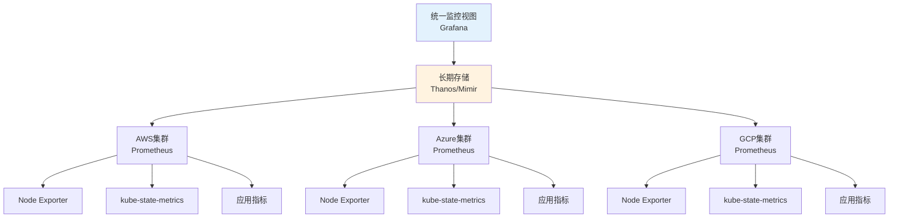

**架构选型对比:**

| 方案 | 架构模式 | 优势 | 劣势 | 适用场景 |
|------|----------|------|------|----------|
| **Prometheus联邦** | 分层拉取 | 简单,原生支持 | 查询性能差,数据冗余 | <10个集群 |
| **Thanos** | 对象存储+远程查询 | 高可用,无限存储,成本低 | 组件多,运维复杂 | 10-100个集群 |
| **Mimir** | 分布式存储 | 高性能,多租户 | 相对新,社区小 | 大规模多租户 |
| **Grafana Mimir Cloud** | SaaS托管 | 零运维 | 按量付费 | 快速上线 |

#### 📝 最小示例

```yaml
# ========== Thanos多集群监控架构 ==========
# 1. 各集群Prometheus配置(启用Thanos Sidecar)
apiVersion: monitoring.coreos.com/v1
kind: Prometheus
metadata:
  name: prometheus
  namespace: monitoring
spec:
  replicas: 2
  retention: 7d  # 本地只保留7天,长期数据推送到Thanos
  
  # Thanos sidecar配置
  thanos:
    image: quay.io/thanos/thanos:v0.34.0
    version: v0.34.0
    objectStorageConfig:
      key: thanos.yaml
      name: thanos-objstore-config
    
  # 添加外部标签标识集群来源
  externalLabels:
    cluster: "aws-us-east-1"
    region: "us-east-1"
    provider: "aws"
    environment: "production"
    
  serviceMonitorSelector:
    matchLabels:
      team: platform
      
  ruleSelector:
    matchLabels:
      role: alert-rules

---
# 对象存储配置(Thanos使用)
apiVersion: v1
kind: Secret
metadata:
  name: thanos-objstore-config
  namespace: monitoring
type: Opaque
stringData:
  thanos.yaml: |
    type: S3
    config:
      bucket: "thanos-metrics-storage"
      endpoint: "s3.us-east-1.amazonaws.com"
      region: "us-east-1"
      access_key: "${AWS_ACCESS_KEY_ID}"
      secret_key: "${AWS_SECRET_ACCESS_KEY}"
      # 也可以使用Azure Blob或GCS
      # type: AZURE
      # config:
      #   storage_account: "thanosmetrics"
      #   storage_account_key: "xxx"
      #   container: "metrics"

---
# 2. Thanos Query(统一查询入口)
apiVersion: apps/v1
kind: Deployment
metadata:
  name: thanos-query
  namespace: monitoring
spec:
  replicas: 3
  selector:
    matchLabels:
      app: thanos-query
  template:
    metadata:
      labels:
        app: thanos-query
    spec:
      containers:
      - name: thanos-query
        image: quay.io/thanos/thanos:v0.34.0
        args:
        - query
        - --log.level=info
        - --query.replica-label=replica
        - --query.replica-label=prometheus_replica
        
        # 连接所有集群的Thanos Sidecar
        - --endpoint=dnssrv+_grpc._tcp.thanos-sidecar-aws.monitoring.svc.cluster.local
        - --endpoint=dnssrv+_grpc._tcp.thanos-sidecar-azure.monitoring.svc.cluster.local
        - --endpoint=dnssrv+_grpc._tcp.thanos-sidecar-gcp.monitoring.svc.cluster.local
        
        # 连接Thanos Store Gateway(历史数据)
        - --endpoint=dnssrv+_grpc._tcp.thanos-store.monitoring.svc.cluster.local
        
        ports:
        - name: http
          containerPort: 10902
        - name: grpc
          containerPort: 10901
        resources:
          requests:
            memory: "1Gi"
            cpu: "500m"
          limits:
            memory: "2Gi"
            cpu: "1000m"

---
apiVersion: v1
kind: Service
metadata:
  name: thanos-query
  namespace: monitoring
spec:
  selector:
    app: thanos-query
  ports:
  - name: http
    port: 9090
    targetPort: 10902
  type: ClusterIP

---
# 3. Thanos Store Gateway(历史数据查询)
apiVersion: apps/v1
kind: StatefulSet
metadata:
  name: thanos-store
  namespace: monitoring
spec:
  serviceName: thanos-store
  replicas: 2
  selector:
    matchLabels:
      app: thanos-store
  template:
    metadata:
      labels:
        app: thanos-store
    spec:
      containers:
      - name: thanos-store
        image: quay.io/thanos/thanos:v0.34.0
        args:
        - store
        - --log.level=info
        - --data-dir=/var/thanos/store
        - --objstore.config-file=/etc/thanos/objstore.yaml
        - --index-cache-size=2GB
        - --chunk-pool-size=2GB
        
        ports:
        - name: http
          containerPort: 10902
        - name: grpc
          containerPort: 10901
          
        volumeMounts:
        - name: data
          mountPath: /var/thanos/store
        - name: objstore-config
          mountPath: /etc/thanos
          
        resources:
          requests:
            memory: "4Gi"
            cpu: "1000m"
          limits:
            memory: "8Gi"
            cpu: "2000m"
            
      volumes:
      - name: objstore-config
        secret:
          secretName: thanos-objstore-config
          
  volumeClaimTemplates:
  - metadata:
      name: data
    spec:
      accessModes: ["ReadWriteOnce"]
      resources:
        requests:
          storage: 100Gi

---
# 4. Grafana配置(连接Thanos Query)
apiVersion: v1
kind: ConfigMap
metadata:
  name: grafana-datasources
  namespace: monitoring
data:
  datasources.yaml: |
    apiVersion: 1
    datasources:
    # Thanos作为主数据源
    - name: Thanos-MultiCluster
      type: prometheus
      access: proxy
      url: http://thanos-query.monitoring.svc.cluster.local:9090
      isDefault: true
      editable: false
      jsonData:
        timeInterval: "30s"
        queryTimeout: "2m"
        
---
# 5. 多集群监控查询示例
apiVersion: v1
kind: ConfigMap
metadata:
  name: multicluster-queries
  namespace: monitoring
data:
  # 按集群聚合CPU使用率
  cpu-by-cluster.promql: |
    sum by(cluster) (
      rate(container_cpu_usage_seconds_total{container!=""}[5m])
    )
    
  # 跨集群应用健康度
  app-health-multicluster.promql: |
    sum by(cluster, namespace, app) (
      up{job="kubernetes-pods"}
    )
    
  # 各集群成本对比
  cost-by-cluster.promql: |
    sum by(cluster) (
      label_replace(
        kube_pod_container_resource_requests{resource="cpu"},
        "cost", "$1", "cluster", "(.*)"
      ) * 0.03  # 假设$0.03/core/hour
    ) * 730
    
  # 跨集群P95延迟对比
  p95-latency-multicluster.promql: |
    histogram_quantile(0.95,
      sum by(cluster, le) (
        rate(http_request_duration_seconds_bucket[5m])
      )
    )
```

#### ⚠️ 常见误区

| 误区 | 真相 | 推荐做法 |
|------|------|----------|
| **误区1: 把所有数据集中存储** | 应该本地短期+对象存储长期,降低成本 | Prometheus保留7-14天,Thanos对象存储保留长期 |
| **误区2: 所有集群用同一套告警** | 不同集群(dev/prod)应该有不同告警阈值 | 使用`cluster`标签区分,设置不同severity |
| **误区3: Thanos Query是单点故障** | Thanos Query是无状态的,可以水平扩展 | 部署3+副本,前面加负载均衡 |
| **误区4: 忽略Cardinality爆炸** | 多集群metrics数量指数增长,可能导致查询慢 | 使用relabel删除高基数标签,限制采集范围 |

### 3.5 统一告警

> **🔰 初学者理解**: 类比**119统一报警** — 不管哪个城市发生火灾,都拨打119,调度中心会派最近的消防队。统一告警就是把所有集群的告警汇总到一个平台,根据规则路由到对应团队。

#### 🔧 工作原理

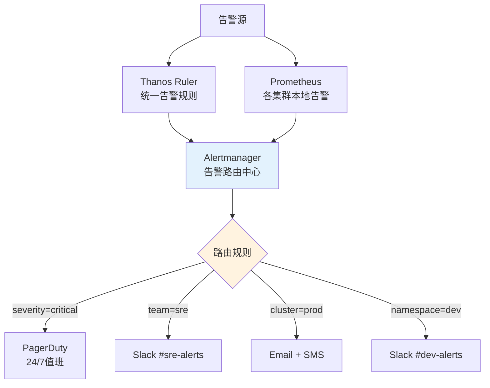

**告警路由策略:**
1. **按严重程度**: critical→立即呼叫,warning→Slack通知
2. **按集群/环境**: 生产告警高优先级,开发告警可延迟
3. **按团队**: 根据namespace owner路由到对应团队
4. **按时间**: 工作时间和非工作时间不同策略

#### 📝 最小示例

```yaml
# ========== 统一告警配置 ==========
# 1. Alertmanager配置
apiVersion: v1
kind: ConfigMap
metadata:
  name: alertmanager-config
  namespace: monitoring
data:
  alertmanager.yml: |
    global:
      resolve_timeout: 5m
      slack_api_url: 'https://hooks.slack.com/services/xxx'
      pagerduty_url: 'https://events.pagerduty.com/v2/enqueue'
      
    # 告警模板
    templates:
    - '/etc/alertmanager/templates/*.tmpl'
    
    # 路由规则
    route:
      receiver: 'default'
      group_by: ['cluster', 'alertname', 'namespace']
      group_wait: 10s
      group_interval: 5m
      repeat_interval: 12h
      
      routes:
      # 1. 生产环境Critical告警 -> PagerDuty + Slack
      - match:
          environment: production
          severity: critical
        receiver: 'pagerduty-critical'
        continue: true  # 继续匹配其他路由
        
      - match:
          environment: production
          severity: critical
        receiver: 'slack-critical'
        
      # 2. 生产环境Warning告警 -> Slack
      - match:
          environment: production
          severity: warning
        receiver: 'slack-warning'
        group_wait: 5m  # 等待5分钟聚合
        
      # 3. 按团队路由
      - match_re:
          namespace: ^team-frontend-.*
        receiver: 'slack-frontend-team'
        
      - match_re:
          namespace: ^team-backend-.*
        receiver: 'slack-backend-team'
        
      # 4. 非生产环境 -> 低优先级Slack
      - match_re:
          environment: development|staging|testing
        receiver: 'slack-non-prod'
        group_wait: 30m  # 等待30分钟聚合
        repeat_interval: 24h  # 24小时重复一次
        
      # 5. 特定云厂商告警
      - match:
          provider: aws
          alertname: HighAWSCost
        receiver: 'email-finops'
        
    # 告警接收器定义
    receivers:
    # 默认接收器
    - name: 'default'
      email_configs:
      - to: 'ops-team@example.com'
        
    # PagerDuty (生产Critical)
    - name: 'pagerduty-critical'
      pagerduty_configs:
      - service_key: 'xxxxxxxxxxxxx'
        description: '[{{ .GroupLabels.cluster }}] {{ .GroupLabels.alertname }}'
        details:
          firing: '{{ .Alerts.Firing | len }}'
          resolved: '{{ .Alerts.Resolved | len }}'
          cluster: '{{ .GroupLabels.cluster }}'
          
    # Slack Critical
    - name: 'slack-critical'
      slack_configs:
      - channel: '#alerts-critical'
        title: ':fire: [{{ .GroupLabels.cluster }}] {{ .GroupLabels.alertname }}'
        text: |
          {{ range .Alerts }}
          *Alert:* {{ .Annotations.summary }}
          *Description:* {{ .Annotations.description }}
          *Cluster:* {{ .Labels.cluster }}
          *Severity:* {{ .Labels.severity }}
          *Runbook:* {{ .Annotations.runbook_url }}
          {{ end }}
        color: 'danger'
        send_resolved: true
        
    # Slack Warning
    - name: 'slack-warning'
      slack_configs:
      - channel: '#alerts-warning'
        title: ':warning: [{{ .GroupLabels.cluster }}] {{ .GroupLabels.alertname }}'
        color: 'warning'
        
    # 前端团队
    - name: 'slack-frontend-team'
      slack_configs:
      - channel: '#team-frontend-alerts'
        title: '[Frontend] {{ .GroupLabels.alertname }}'
        
    # 后端团队
    - name: 'slack-backend-team'
      slack_configs:
      - channel: '#team-backend-alerts'
        title: '[Backend] {{ .GroupLabels.alertname }}'
        
    # 非生产环境
    - name: 'slack-non-prod'
      slack_configs:
      - channel: '#alerts-non-prod'
        title: '[{{ .GroupLabels.environment }}] {{ .GroupLabels.alertname }}'
        color: 'good'
        
    # FinOps团队(成本告警)
    - name: 'email-finops'
      email_configs:
      - to: 'finops@example.com'
        subject: 'Cost Alert: {{ .GroupLabels.alertname }}'
        
    # 告警抑制规则
    inhibit_rules:
    # 如果集群宕机,抑制该集群的其他告警
    - source_match:
        alertname: 'KubernetesClusterDown'
      target_match_re:
        alertname: '.*'
      equal: ['cluster']
      
    # 如果节点宕机,抑制该节点上的Pod告警
    - source_match:
        alertname: 'NodeDown'
      target_match:
        alertname: 'PodCrashLooping'
      equal: ['node']

---
# 2. 跨集群告警规则示例
apiVersion: monitoring.coreos.com/v1
kind: PrometheusRule
metadata:
  name: multicluster-alerting-rules
  namespace: monitoring
spec:
  groups:
  - name: multicluster.critical
    interval: 1m
    rules:
    # 集群完全不可达
    - alert: KubernetesClusterDown
      expr: |
        absent(up{job="kubernetes-apiservers"} == 1)
      for: 5m
      labels:
        severity: critical
        environment: '{{ $labels.environment }}'
      annotations:
        summary: "集群 {{ $labels.cluster }} 完全不可达"
        description: "Kubernetes API Server无法访问超过5分钟"
        runbook_url: "https://runbooks.example.com/KubernetesClusterDown"
        
    # 跨集群应用错误率过高
    - alert: MultiClusterHighErrorRate
      expr: |
        (
          sum by(cluster, namespace, app) (
            rate(http_requests_total{code=~"5.."}[5m])
          )
          /
          sum by(cluster, namespace, app) (
            rate(http_requests_total[5m])
          )
        ) > 0.05
      for: 10m
      labels:
        severity: critical
      annotations:
        summary: "应用 {{ $labels.app }} 在集群 {{ $labels.cluster }} 错误率过高"
        description: "5xx错误率: {{ $value | humanizePercentage }}"
        
  - name: multicluster.capacity
    interval: 5m
    rules:
    # 集群资源即将耗尽
    - alert: ClusterCPUNearCapacity
      expr: |
        (
          sum by(cluster) (kube_pod_container_resource_requests{resource="cpu"})
          /
          sum by(cluster) (kube_node_status_allocatable{resource="cpu"})
        ) > 0.85
      for: 30m
      labels:
        severity: warning
      annotations:
        summary: "集群 {{ $labels.cluster }} CPU资源即将耗尽"
        description: "CPU分配率: {{ $value | humanizePercentage }}"
```

#### ⚠️ 常见误区

| 误区 | 真相 | 推荐做法 |
|------|------|----------|
| **误区1: 所有告警都发PagerDuty** | 会导致告警疲劳,critical才应该呼叫 | 分级:critical→呼叫,warning→Slack |
| **误区2: 每个集群独立Alertmanager** | 无法统一抑制和路由,重复告警 | 使用中心化Alertmanager集群 |
| **误区3: 不设置告警抑制** | 一个问题触发几十个告警,淹没真实问题 | 配置inhibit_rules,上游故障抑制下游 |
| **误区4: 告警模板千篇一律** | 缺少上下文信息,无法快速响应 | 包含cluster、runbook_url、常用命令 |


---

## 4. 运维自动化

> **🔰 初学者导读**: 手工管理多个集群不可持续,必须自动化。Infrastructure as Code(Terraform管理云资源) + GitOps(ArgoCD管理K8s资源) 是多云自动化的基石。

### 4.1 多云GitOps流水线

```yaml
# ========== 多云GitOps架构 ==========
apiVersion: argoproj.io/v1alpha1
kind: ApplicationSet
metadata:
  name: multicloud-applications
  namespace: argocd
spec:
  generators:
  # 基于集群标签的生成器
  - clusters:
      selector:
        matchLabels:
          environment: production
          
  # 基于Git目录结构的生成器
  - git:
      repoURL: https://github.com/company/multicloud-manifests.git
      revision: HEAD
      directories:
      - path: apps/*/overlays/*
      
  template:
    metadata:
      name: '{{name}}-{{path.basename}}'
    spec:
      project: multicloud
      source:
        repoURL: https://github.com/company/multicloud-manifests.git
        targetRevision: HEAD
        path: '{{path}}'
        
      destination:
        server: '{{server}}'
        namespace: '{{path.basename}}'
        
      syncPolicy:
        automated:
          prune: true
          selfHeal: true
        syncOptions:
        - CreateNamespace=true
        - PruneLast=true
        - ApplyOutOfSyncOnly=true
        
      ignoreDifferences:
      - group: apps
        kind: Deployment
        jsonPointers:
        - /spec/replicas
        
---
# ========== 多云CI/CD流水线 ==========
apiVersion: tekton.dev/v1beta1
kind: Pipeline
metadata:
  name: multicloud-deployment-pipeline
spec:
  workspaces:
  - name: shared-workspace
  params:
  - name: git-url
  - name: git-revision
  - name: app-name
  - name: target-environments
  
  tasks:
  # 代码检出
  - name: fetch-repository
    taskRef:
      name: git-clone
    workspaces:
    - name: output
      workspace: shared-workspace
    params:
    - name: url
      value: $(params.git-url)
    - name: revision
      value: $(params.git-revision)
      
  # 构建和测试
  - name: build-and-test
    taskRef:
      name: kaniko-build
    runAfter: ["fetch-repository"]
    workspaces:
    - name: source
      workspace: shared-workspace
    params:
    - name: IMAGE
      value: "registry.example.com/$(params.app-name):$(params.git-revision)"
      
  # 多云安全扫描
  - name: multicloud-security-scan
    taskRef:
      name: trivy-multicloud-scan
    runAfter: ["build-and-test"]
    workspaces:
    - name: source
      workspace: shared-workspace
    params:
    - name: IMAGE
      value: "registry.example.com/$(params.app-name):$(params.git-revision)"
    - name: TARGET_CLOUDS
      value: "aws,azure,gcp"
      
  # 多云部署
  - name: deploy-to-clouds
    taskRef:
      name: argocd-multicloud-deploy
    runAfter: ["multicloud-security-scan"]
    workspaces:
    - name: source
      workspace: shared-workspace
    params:
    - name: APP_NAME
      value: $(params.app-name)
    - name: TARGET_ENVIRONMENTS
      value: $(params.target-environments)
    - name: GIT_REVISION
      value: $(params.git-revision)
      
  # 跨云集成测试
  - name: multicloud-integration-test
    taskRef:
      name: multicloud-smoke-test
    runAfter: ["deploy-to-clouds"]
    workspaces:
    - name: source
      workspace: shared-workspace
    params:
    - name: APP_NAME
      value: $(params.app-name)
    - name: TARGET_ENVIRONMENTS
      value: $(params.target-environments)

---
# ========== 多云自动化运维 ==========
apiVersion: batch/v1
kind: CronJob
metadata:
  name: multicloud-automation
  namespace: platform-ops
spec:
  schedule: "*/30 * * * *"  # 每30分钟执行
  jobTemplate:
    spec:
      template:
        spec:
          serviceAccountName: multicloud-operator
          containers:
          - name: automation-runner
            image: platform/multicloud-automation:latest
            env:
            - name: AWS_ACCESS_KEY_ID
              valueFrom:
                secretKeyRef:
                  name: aws-credentials
                  key: access-key-id
            - name: AWS_SECRET_ACCESS_KEY
              valueFrom:
                secretKeyRef:
                  name: aws-credentials
                  key: secret-access-key
            - name: AZURE_CLIENT_ID
              valueFrom:
                secretKeyRef:
                  name: azure-credentials
                  key: client-id
            - name: AZURE_CLIENT_SECRET
              valueFrom:
                secretKeyRef:
                  name: azure-credentials
                  key: client-secret
            - name: GCP_SERVICE_ACCOUNT_KEY
              valueFrom:
                secretKeyRef:
                  name: gcp-credentials
                  key: service-account-key
            command:
            - /bin/sh
            - -c
            - |
              #!/bin/bash
              set -euo pipefail
              
              echo "开始多云自动化运维任务..."
              
              # 1. 资源健康检查
              echo "执行跨云资源健康检查..."
              python3 /scripts/health-check.py --clouds aws,azure,gcp
              
              # 2. 成本优化建议
              echo "生成成本优化建议..."
              python3 /scripts/cost-optimizer.py --analyze-current-usage
              
              # 3. 安全合规扫描
              echo "执行安全合规扫描..."
              python3 /scripts/security-scanner.py --all-clouds
              
              # 4. 自动修复常见问题
              echo "执行自动修复..."
              python3 /scripts/auto-remediation.py --fix-common-issues
              
              # 5. 生成运维报告
              echo "生成运维报告..."
              REPORT_TIME=$(date -I)
              cat > /reports/multicloud-ops-report-${REPORT_TIME}.md <<EOF
              # 多云运维自动化报告
              
              ## 执行时间
              ${REPORT_TIME}
              
              ## 健康检查结果
              $(cat /tmp/health-check-results.txt)
              
              ## 成本优化建议
              $(cat /tmp/cost-optimization-recommendations.txt)
              
              ## 安全扫描发现
              $(cat /tmp/security-findings.txt)
              
              ## 自动修复记录
              $(cat /tmp/remediation-actions.txt)
              EOF
              
              echo "多云自动化运维任务完成"
          restartPolicy: OnFailure
```

### 4.2 IaC多云管理

> **🔰 初学者理解**: 类比**建筑设计蓝图** — 建房子前先画图纸,改设计只改图纸,不用拆房重建。IaC (Infrastructure as Code) 就是用代码描述云资源,版本控制、一键部署、可重复执行。

#### 🔧 工作原理

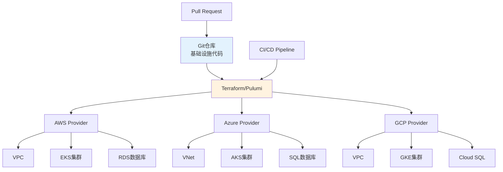

**IaC工具对比:**

| 工具 | 语言 | 多云支持 | 状态管理 | 学习曲线 | 适用场景 |
|------|------|----------|----------|----------|----------|
| **Terraform** | HCL | 优秀(500+ providers) | 远程状态 | ⭐⭐⭐ | 通用首选,成熟生态 |
| **Pulumi** | Python/TS/Go | 优秀 | 云端存储 | ⭐⭐⭐⭐ | 开发者友好,复杂逻辑 |
| **Crossplane** | K8s CRD | 优秀 | etcd | ⭐⭐⭐⭐ | K8s原生,GitOps集成 |
| **CDK for Terraform** | Python/TS | 优秀 | Terraform后端 | ⭐⭐⭐ | 复杂编程逻辑 |
| **Ansible** | YAML | 中等 | 无状态 | ⭐⭐ | 配置管理为主 |

#### 📝 最小示例

```hcl
# ========== Terraform多云K8s集群部署 ==========
# terraform.tf - 版本和Provider配置
terraform {
  required_version = ">= 1.5.0"
  
  # 远程状态存储(关键!避免状态冲突)
  backend "s3" {
    bucket         = "company-terraform-state"
    key            = "multicloud/clusters/terraform.tfstate"
    region         = "us-east-1"
    encrypt        = true
    dynamodb_table = "terraform-lock"
  }
  
  required_providers {
    aws = {
      source  = "hashicorp/aws"
      version = "~> 5.0"
    }
    azurerm = {
      source  = "hashicorp/azurerm"
      version = "~> 3.0"
    }
    google = {
      source  = "hashicorp/google"
      version = "~> 5.0"
    }
    kubernetes = {
      source  = "hashicorp/kubernetes"
      version = "~> 2.23"
    }
  }
}

# ========== variables.tf - 变量定义 ==========
variable "project_name" {
  description = "项目名称,用于资源命名"
  type        = string
  default     = "multicloud-prod"
}

variable "kubernetes_version" {
  description = "Kubernetes版本"
  type        = string
  default     = "1.28"
}

variable "node_count" {
  description = "每个集群的节点数"
  type        = number
  default     = 3
}

variable "tags" {
  description = "统一标签"
  type        = map(string)
  default = {
    Project     = "MultiCloud"
    Team        = "Platform"
    Environment = "Production"
    ManagedBy   = "Terraform"
  }
}

# ========== modules/aws-eks/main.tf - AWS EKS模块 ==========
resource "aws_vpc" "main" {
  cidr_block           = var.vpc_cidr
  enable_dns_hostnames = true
  enable_dns_support   = true
  
  tags = merge(var.tags, {
    Name = "${var.cluster_name}-vpc"
  })
}

resource "aws_subnet" "private" {
  count             = 3
  vpc_id            = aws_vpc.main.id
  cidr_block        = cidrsubnet(var.vpc_cidr, 4, count.index)
  availability_zone = data.aws_availability_zones.available.names[count.index]
  
  tags = merge(var.tags, {
    Name                              = "${var.cluster_name}-private-${count.index + 1}"
    "kubernetes.io/role/internal-elb" = "1"
  })
}

resource "aws_eks_cluster" "main" {
  name     = var.cluster_name
  version  = var.kubernetes_version
  role_arn = aws_iam_role.cluster.arn
  
  vpc_config {
    subnet_ids              = aws_subnet.private[*].id
    endpoint_private_access = true
    endpoint_public_access  = true
  }
  
  # 启用控制平面日志
  enabled_cluster_log_types = ["api", "audit", "authenticator"]
  
  tags = merge(var.tags, {
    Name = var.cluster_name
  })
  
  depends_on = [
    aws_iam_role_policy_attachment.cluster_policy
  ]
}

resource "aws_eks_node_group" "main" {
  cluster_name    = aws_eks_cluster.main.name
  node_group_name = "${var.cluster_name}-workers"
  node_role_arn   = aws_iam_role.node.arn
  subnet_ids      = aws_subnet.private[*].id
  
  scaling_config {
    desired_size = var.node_count
    max_size     = var.node_count * 2
    min_size     = 1
  }
  
  instance_types = ["t3.large"]
  capacity_type  = "SPOT"  # 使用Spot节省成本
  
  # 自动更新策略
  update_config {
    max_unavailable = 1
  }
  
  tags = merge(var.tags, {
    Name = "${var.cluster_name}-node-group"
  })
}

# ========== modules/azure-aks/main.tf - Azure AKS模块 ==========
resource "azurerm_resource_group" "main" {
  name     = "${var.cluster_name}-rg"
  location = var.location
  tags     = var.tags
}

resource "azurerm_virtual_network" "main" {
  name                = "${var.cluster_name}-vnet"
  address_space       = [var.vnet_cidr]
  location            = azurerm_resource_group.main.location
  resource_group_name = azurerm_resource_group.main.name
  tags                = var.tags
}

resource "azurerm_subnet" "aks" {
  name                 = "${var.cluster_name}-subnet"
  resource_group_name  = azurerm_resource_group.main.name
  virtual_network_name = azurerm_virtual_network.main.name
  address_prefixes     = [cidrsubnet(var.vnet_cidr, 4, 0)]
}

resource "azurerm_kubernetes_cluster" "main" {
  name                = var.cluster_name
  location            = azurerm_resource_group.main.location
  resource_group_name = azurerm_resource_group.main.name
  dns_prefix          = var.cluster_name
  kubernetes_version  = var.kubernetes_version
  
  default_node_pool {
    name       = "default"
    node_count = var.node_count
    vm_size    = "Standard_D2s_v3"
    vnet_subnet_id = azurerm_subnet.aks.id
    
    # 启用自动扩缩容
    enable_auto_scaling = true
    min_count           = 1
    max_count           = var.node_count * 2
    
    # 使用Spot实例
    priority        = "Spot"
    eviction_policy = "Delete"
    spot_max_price  = -1  # 使用当前Spot价格
  }
  
  identity {
    type = "SystemAssigned"
  }
  
  network_profile {
    network_plugin = "azure"
    network_policy = "calico"
  }
  
  tags = var.tags
}

# ========== modules/gcp-gke/main.tf - GCP GKE模块 ==========
resource "google_container_cluster" "main" {
  name               = var.cluster_name
  location           = var.zone
  min_master_version = var.kubernetes_version
  
  # 删除默认节点池,使用自定义节点池
  remove_default_node_pool = true
  initial_node_count       = 1
  
  # 启用工作负载身份
  workload_identity_config {
    workload_pool = "${var.project_id}.svc.id.goog"
  }
  
  # 网络配置
  network    = google_compute_network.vpc.name
  subnetwork = google_compute_subnetwork.subnet.name
  
  # 启用网络策略
  network_policy {
    enabled  = true
    provider = "CALICO"
  }
  
  # IP地址范围
  ip_allocation_policy {
    cluster_ipv4_cidr_block  = "/16"
    services_ipv4_cidr_block = "/22"
  }
  
  # 维护窗口
  maintenance_policy {
    daily_maintenance_window {
      start_time = "03:00"
    }
  }
}

resource "google_container_node_pool" "main" {
  name       = "${var.cluster_name}-pool"
  location   = var.zone
  cluster    = google_container_cluster.main.name
  node_count = var.node_count
  
  # 自动扩缩容
  autoscaling {
    min_node_count = 1
    max_node_count = var.node_count * 2
  }
  
  node_config {
    preemptible  = true  # 使用抢占式实例
    machine_type = "n2-standard-2"
    
    oauth_scopes = [
      "https://www.googleapis.com/auth/cloud-platform"
    ]
    
    labels = var.tags
  }
}

# ========== main.tf - 主配置文件 ==========
# AWS集群
module "aws_cluster" {
  source = "./modules/aws-eks"
  
  cluster_name       = "${var.project_name}-aws-us-east-1"
  vpc_cidr           = "10.0.0.0/16"
  kubernetes_version = var.kubernetes_version
  node_count         = var.node_count
  tags               = merge(var.tags, { Provider = "AWS" })
}

# Azure集群
module "azure_cluster" {
  source = "./modules/azure-aks"
  
  cluster_name       = "${var.project_name}-azure-westeurope"
  location           = "westeurope"
  vnet_cidr          = "10.1.0.0/16"
  kubernetes_version = var.kubernetes_version
  node_count         = var.node_count
  tags               = merge(var.tags, { Provider = "Azure" })
}

# GCP集群
module "gcp_cluster" {
  source = "./modules/gcp-gke"
  
  project_id         = var.gcp_project_id
  cluster_name       = "${var.project_name}-gcp-us-central1"
  zone               = "us-central1-a"
  kubernetes_version = var.kubernetes_version
  node_count         = var.node_count
  tags               = merge(var.tags, { Provider = "GCP" })
}

# ========== outputs.tf - 输出变量 ==========
output "aws_cluster_endpoint" {
  value       = module.aws_cluster.cluster_endpoint
  description = "AWS EKS集群API端点"
}

output "azure_cluster_fqdn" {
  value       = module.azure_cluster.cluster_fqdn
  description = "Azure AKS集群FQDN"
}

output "gcp_cluster_endpoint" {
  value       = module.gcp_cluster.cluster_endpoint
  description = "GCP GKE集群端点"
  sensitive   = true
}

# 生成kubeconfig
output "kubeconfig_commands" {
  value = <<-EOT
    # 配置AWS集群访问
    aws eks update-kubeconfig --name ${module.aws_cluster.cluster_name} --region us-east-1
    
    # 配置Azure集群访问
    az aks get-credentials --name ${module.azure_cluster.cluster_name} --resource-group ${module.azure_cluster.resource_group_name}
    
    # 配置GCP集群访问
    gcloud container clusters get-credentials ${module.gcp_cluster.cluster_name} --zone us-central1-a
  EOT
  description = "配置kubectl访问各集群的命令"
}
```

#### ⚠️ 常见误区

| 误区 | 真相 | 推荐做法 |
|------|------|----------|
| **误区1: 直接在生产环境apply** | 没有审查流程,容易误操作删除资源 | 使用`terraform plan`审查,PR流程批准 |
| **误区2: 本地存储state文件** | 团队协作会冲突,state丢失灾难性 | 使用S3+DynamoDB锁,或Terraform Cloud |
| **误区3: 把敏感信息写在代码里** | 泄露安全风险 | 使用Secret Manager,环境变量注入 |
| **误区4: 不使用模块化** | 代码重复,难以维护 | 抽象通用模块,DRY原则 |
| **误区5: 忽略drift检测** | 手工改动与代码不一致 | 定期运行`terraform plan`检查drift |

**实战操作指南:**

```bash
# 1. 初始化Terraform
terraform init

# 2. 验证配置语法
terraform validate

# 3. 格式化代码
terraform fmt -recursive

# 4. 查看执行计划(关键!必须审查)
terraform plan -out=tfplan

# 5. 应用变更(生产环境需要审批)
terraform apply tfplan

# 6. 查看输出
terraform output

# 7. 销毁资源(危险操作!)
terraform destroy

# 8. 导入现有资源到Terraform管理
terraform import module.aws_cluster.aws_eks_cluster.main my-existing-cluster

# 9. 检查state漂移
terraform plan -refresh-only

# 10. 工作空间管理(多环境)
terraform workspace new production
terraform workspace select production
```

### 4.3 GitOps多集群

> **🔰 初学者理解**: 类比**连锁店统一配方** — 总部(Git仓库)定义标准配方,各分店(集群)自动同步执行,保证一致性。GitOps就是用Git作为唯一事实来源,集群自动同步代码状态。

#### 🔧 工作原理

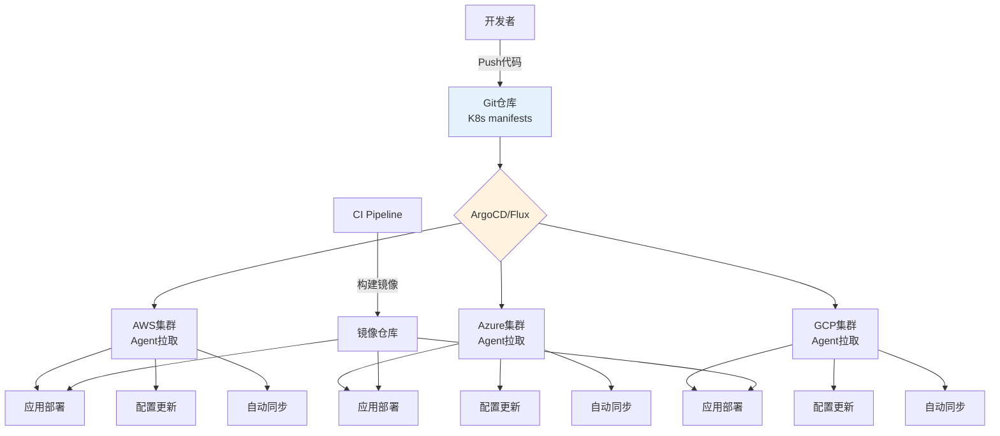

**GitOps工具对比:**

| 工具 | 架构模式 | 多集群支持 | UI | 学习曲线 | 适用场景 |
|------|----------|------------|----|-----------| ---------|
| **ArgoCD** | Pull,中心化 | ApplicationSet | 优秀 | ⭐⭐⭐ | 企业首选,功能丰富 |
| **Flux CD** | Pull,去中心化 | Kustomize overlay | 基础 | ⭐⭐⭐⭐ | 轻量级,CNCF毕业 |
| **Rancher Fleet** | Pull,分层 | Git目录结构 | 优秀 | ⭐⭐ | Rancher生态集成 |

#### 📝 最小示例

```yaml
# ========== ArgoCD多集群GitOps配置 ==========
# 1. Git仓库结构
# apps/
# ├── base/                     # 基础配置
# │   └── my-app/
# │       ├── deployment.yaml
# │       ├── service.yaml
# │       └── kustomization.yaml
# └── overlays/                 # 各集群差异化配置
#     ├── aws-prod/
#     │   ├── kustomization.yaml
#     │   └── patch-replicas.yaml
#     ├── azure-prod/
#     │   └── kustomization.yaml
#     └── gcp-prod/
#         └── kustomization.yaml

# 2. 注册多个集群到ArgoCD
# 在ArgoCD控制平面执行:
apiVersion: v1
kind: Secret
metadata:
  name: aws-cluster-secret
  namespace: argocd
  labels:
    argocd.argoproj.io/secret-type: cluster
type: Opaque
stringData:
  name: "aws-us-east-1"
  server: "https://aws-eks-api.us-east-1.example.com"
  config: |
    {
      "bearerToken": "${AWS_CLUSTER_TOKEN}",
      "tlsClientConfig": {
        "insecure": false,
        "caData": "${AWS_CA_CERT}"
      }
    }

---
apiVersion: v1
kind: Secret
metadata:
  name: azure-cluster-secret
  namespace: argocd
  labels:
    argocd.argoproj.io/secret-type: cluster
type: Opaque
stringData:
  name: "azure-westeurope"
  server: "https://azure-aks-api.westeurope.example.com"
  config: |
    {
      "bearerToken": "${AZURE_CLUSTER_TOKEN}",
      "tlsClientConfig": {
        "caData": "${AZURE_CA_CERT}"
      }
    }

---
# 3. ApplicationSet自动生成多集群应用
apiVersion: argoproj.io/v1alpha1
kind: ApplicationSet
metadata:
  name: multicloud-app
  namespace: argocd
spec:
  # 生成器:基于Git目录
  generators:
  - git:
      repoURL: https://github.com/company/k8s-manifests.git
      revision: main
      directories:
      - path: apps/overlays/*
      
  # 应用模板
  template:
    metadata:
      name: 'my-app-{{path.basename}}'
      labels:
        app: my-app
        cluster: '{{path.basename}}'
    spec:
      project: default
      
      source:
        repoURL: https://github.com/company/k8s-manifests.git
        targetRevision: main
        path: 'apps/overlays/{{path.basename}}'
        
      destination:
        # 根据目录名匹配集群
        name: '{{path.basename}}'
        namespace: production
        
      syncPolicy:
        automated:
          prune: true      # 自动删除Git中不存在的资源
          selfHeal: true   # 自动修复手工改动
          allowEmpty: false
        syncOptions:
        - CreateNamespace=true
        - PrunePropagationPolicy=foreground
        
        retry:
          limit: 5
          backoff:
            duration: 5s
            factor: 2
            maxDuration: 3m

---
# 4. Git仓库中的Kustomize配置示例
# apps/base/my-app/kustomization.yaml
apiVersion: kustomize.config.k8s.io/v1beta1
kind: Kustomization
resources:
- deployment.yaml
- service.yaml

---
# apps/base/my-app/deployment.yaml
apiVersion: apps/v1
kind: Deployment
metadata:
  name: my-app
spec:
  replicas: 3
  selector:
    matchLabels:
      app: my-app
  template:
    metadata:
      labels:
        app: my-app
    spec:
      containers:
      - name: app
        image: registry.example.com/my-app:latest
        ports:
        - containerPort: 8080
        resources:
          requests:
            memory: "256Mi"
            cpu: "250m"
          limits:
            memory: "512Mi"
            cpu: "500m"

---
# apps/overlays/aws-prod/kustomization.yaml
apiVersion: kustomize.config.k8s.io/v1beta1
kind: Kustomization
bases:
- ../../base/my-app

# AWS集群差异化配置
replicas:
- name: my-app
  count: 5  # AWS集群运行5个副本

patches:
- patch: |-
    - op: add
      path: /spec/template/spec/containers/0/env
      value:
        - name: CLOUD_PROVIDER
          value: "aws"
        - name: REGION
          value: "us-east-1"
  target:
    kind: Deployment
    name: my-app

---
# apps/overlays/azure-prod/kustomization.yaml
apiVersion: kustomize.config.k8s.io/v1beta1
kind: Kustomization
bases:
- ../../base/my-app

replicas:
- name: my-app
  count: 3  # Azure集群运行3个副本

patches:
- patch: |-
    - op: add
      path: /spec/template/spec/containers/0/env
      value:
        - name: CLOUD_PROVIDER
          value: "azure"
        - name: REGION
          value: "westeurope"
  target:
    kind: Deployment
    name: my-app

---
# 5. 多集群CI/CD Pipeline集成
apiVersion: tekton.dev/v1beta1
kind: Pipeline
metadata:
  name: multicloud-gitops-pipeline
spec:
  params:
  - name: git-url
  - name: git-revision
  - name: image-tag
  
  tasks:
  # 构建镜像
  - name: build-image
    taskRef:
      name: kaniko
    params:
    - name: IMAGE
      value: "registry.example.com/my-app:$(params.image-tag)"
      
  # 更新Git仓库中的镜像tag(触发GitOps同步)
  - name: update-manifests
    runAfter: ["build-image"]
    taskSpec:
      steps:
      - name: update-image-tag
        image: alpine/git
        script: |
          #!/bin/sh
          set -e
          
          # Clone配置仓库
          git clone $(params.git-url) /workspace/repo
          cd /workspace/repo
          
          # 更新所有overlay的镜像tag
          for overlay in apps/overlays/*/kustomization.yaml; do
            sed -i "s|newTag:.*|newTag: $(params.image-tag)|" $overlay
          done
          
          # 提交并推送
          git config user.name "CI Pipeline"
          git config user.email "ci@example.com"
          git add .
          git commit -m "Update image tag to $(params.image-tag)"
          git push origin main
          
  # 等待ArgoCD同步完成
  - name: wait-for-sync
    runAfter: ["update-manifests"]
    taskSpec:
      steps:
      - name: wait
        image: argoproj/argocd:latest
        script: |
          #!/bin/sh
          # 等待所有集群的应用同步完成
          for app in my-app-aws-prod my-app-azure-prod my-app-gcp-prod; do
            argocd app wait $app --sync --health --timeout 600
          done
```

#### ⚠️ 常见误区

| 误区 | 真相 | 推荐做法 |
|------|------|----------|
| **误区1: 镜像tag也放Git管理** | 频繁更新镜像tag会产生大量commit | 使用Argo CD Image Updater自动化 |
| **误区2: 所有集群配置完全一致** | 应该允许差异化(副本数、资源限制) | 使用Kustomize overlay管理差异 |
| **误区3: 手工在集群改配置** | GitOps会回滚手工改动 | 所有改动提交PR到Git |
| **误区4: 不设置Sync策略** | 需要手动同步,失去自动化优势 | 开启automated sync + self-heal |

**GitOps最佳实践:**
1. **单一事实来源**: Git是唯一配置源,禁止手工kubectl apply
2. **拉取模式**: 集群内Agent拉取Git,而不是推送(安全性)
3. **审计追踪**: 所有变更有Git commit记录,可回溯
4. **渐进发布**: 先部署到测试集群,验证后再推广到生产
5. **回滚机制**: Git revert即可回滚,快速恢复


### 1.5 集群联邦 (Cluster Federation)

> **🔰 初学者理解**: 类比**联合国与成员国**的关系 — 联邦就像联合国总部,提供统一的协调和政策框架,但各个集群(成员国)仍保持独立运作。集群联邦允许你在一个控制平面管理多个Kubernetes集群,就像用一个仪表盘管理全球多个数据中心。

#### 🔧 工作原理

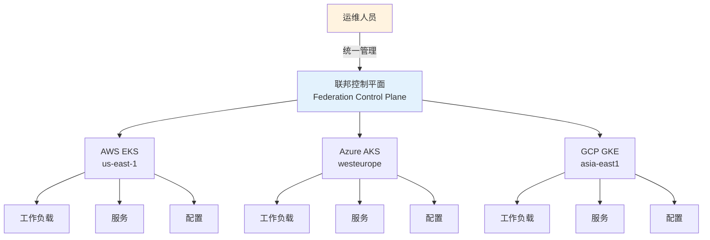

**核心组件:**
1. **联邦控制平面**: 中央管理层,协调多集群资源分发
2. **联邦资源**: FederatedDeployment、FederatedService等跨集群资源
3. **调度策略**: 决定工作负载在哪些集群运行
4. **同步机制**: 将联邦资源同步到各成员集群

#### 📝 最小示例

```yaml
# ========== KubeFed集群联邦配置 ==========
# 安装KubeFed控制平面
apiVersion: v1
kind: Namespace
metadata:
  name: kube-federation-system

---
# 注册成员集群
apiVersion: core.kubefed.io/v1beta1
kind: KubeFedCluster
metadata:
  name: aws-cluster-us-east-1
  namespace: kube-federation-system
spec:
  apiEndpoint: https://aws-eks-api.us-east-1.example.com
  secretRef:
    name: aws-cluster-secret
  caBundle: LS0tLS1CRUdJTi... # Base64编码的CA证书

---
apiVersion: core.kubefed.io/v1beta1
kind: KubeFedCluster
metadata:
  name: azure-cluster-westeurope
  namespace: kube-federation-system
spec:
  apiEndpoint: https://azure-aks-api.westeurope.example.com
  secretRef:
    name: azure-cluster-secret
  caBundle: LS0tLS1CRUdJTi...

---
apiVersion: core.kubefed.io/v1beta1
kind: KubeFedCluster
metadata:
  name: gcp-cluster-asia-east1
  namespace: kube-federation-system
spec:
  apiEndpoint: https://gcp-gke-api.asia-east1.example.com
  secretRef:
    name: gcp-cluster-secret
  caBundle: LS0tLS1CRUdJTi...

---
# ========== 联邦应用部署 ==========
# 创建跨集群部署
apiVersion: types.kubefed.io/v1beta1
kind: FederatedDeployment
metadata:
  name: multicloud-app
  namespace: production
spec:
  # 模板定义 - 应用基础配置
  template:
    metadata:
      labels:
        app: multicloud-app
    spec:
      replicas: 3  # 默认副本数
      selector:
        matchLabels:
          app: multicloud-app
      template:
        metadata:
          labels:
            app: multicloud-app
        spec:
          containers:
          - name: app
            image: registry.example.com/multicloud-app:v1.2.3
            ports:
            - containerPort: 8080
            resources:
              requests:
                memory: "256Mi"
                cpu: "250m"
              limits:
                memory: "512Mi"
                cpu: "500m"
  
  # 调度策略 - 决定在哪些集群运行
  placement:
    clusters:
    - name: aws-cluster-us-east-1
    - name: azure-cluster-westeurope
    - name: gcp-cluster-asia-east1
  
  # 差异化配置 - 按集群覆盖特定设置
  overrides:
  # AWS集群: 使用更多副本服务北美用户
  - clusterName: aws-cluster-us-east-1
    clusterOverrides:
    - path: "/spec/replicas"
      value: 5
    - path: "/spec/template/spec/containers/0/resources/requests/cpu"
      value: "500m"
      
  # Azure集群: 中等配置服务欧洲用户
  - clusterName: azure-cluster-westeurope
    clusterOverrides:
    - path: "/spec/replicas"
      value: 3
      
  # GCP集群: 较少副本服务亚洲用户
  - clusterName: gcp-cluster-asia-east1
    clusterOverrides:
    - path: "/spec/replicas"
      value: 2

---
# ========== 联邦服务配置 ==========
apiVersion: types.kubefed.io/v1beta1
kind: FederatedService
metadata:
  name: multicloud-app-service
  namespace: production
spec:
  template:
    metadata:
      labels:
        app: multicloud-app
    spec:
      type: LoadBalancer
      selector:
        app: multicloud-app
      ports:
      - protocol: TCP
        port: 80
        targetPort: 8080
  
  placement:
    clusters:
    - name: aws-cluster-us-east-1
    - name: azure-cluster-westeurope
    - name: gcp-cluster-asia-east1

---
# ========== 联邦配置同步 ==========
apiVersion: types.kubefed.io/v1beta1
kind: FederatedConfigMap
metadata:
  name: app-config
  namespace: production
spec:
  template:
    data:
      # 全局配置
      LOG_LEVEL: "info"
      FEATURE_FLAG_NEW_UI: "true"
  
  placement:
    clusters:
    - name: aws-cluster-us-east-1
    - name: azure-cluster-westeurope
    - name: gcp-cluster-asia-east1
  
  overrides:
  # AWS集群特定配置
  - clusterName: aws-cluster-us-east-1
    clusterOverrides:
    - path: "/data/REGION"
      value: "us-east-1"
    - path: "/data/DATABASE_ENDPOINT"
      value: "db.us-east-1.aws.example.com"
      
  # Azure集群特定配置
  - clusterName: azure-cluster-westeurope
    clusterOverrides:
    - path: "/data/REGION"
      value: "westeurope"
    - path: "/data/DATABASE_ENDPOINT"
      value: "db.westeurope.azure.example.com"
      
  # GCP集群特定配置
  - clusterName: gcp-cluster-asia-east1
    clusterOverrides:
    - path: "/data/REGION"
      value: "asia-east1"
    - path: "/data/DATABASE_ENDPOINT"
      value: "db.asia-east1.gcp.example.com"
```

#### ⚠️ 常见误区

| 误区 | 真相 | 推荐做法 |
|------|------|----------|
| **误区1: 联邦能解决所有多集群问题** | 联邦主要解决"资源同步"问题,不能自动解决网络互通、存储共享等问题 | 联邦+服务网格+统一存储方案组合使用 |
| **误区2: 联邦控制平面单点故障** | 是的,联邦控制平面宕机会影响管理能力,但成员集群仍正常运行 | 联邦控制平面HA部署+定期备份成员集群配置 |
| **误区3: 所有资源都应该联邦化** | 联邦增加复杂度,只应用于需要跨集群管理的资源 | 核心应用联邦化,集群特定资源直接管理 |
| **误区4: 联邦能自动做跨集群负载均衡** | 联邦只负责资源分发,需要配合Global Load Balancer做流量分发 | 使用AWS Global Accelerator、Azure Traffic Manager等 |

**关键决策点:**
- **何时使用联邦**: 需要跨多个集群部署相同应用、统一管理配置时
- **何时不用联邦**: 集群完全独立、应用不需要跨集群同步时,用独立管理更简单
- **联邦工具选择**: KubeFed(开源标准)、Karmada(华为开源)、Rancher Multi-Cluster(商业)

### 1.6 统一管理平面 (Unified Control Plane)

> **🔰 初学者理解**: 类比**航空管制中心** — 虽然每个机场(集群)有自己的塔台(控制平面),但国家航空管制中心提供统一的调度视图和协调能力。统一管理平面让你在一个界面管理所有集群,无需切换上下文。

#### 🔧 工作原理

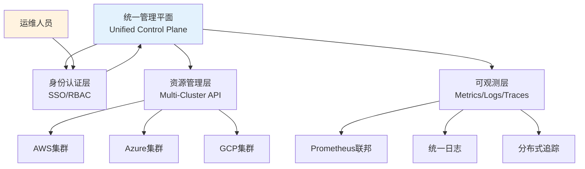

**与集群联邦的区别:**

| 特性 | 集群联邦 | 统一管理平面 |
|------|----------|--------------|
| **资源同步** | 自动同步资源到成员集群 | 聚合查询,不强制同步 |
| **控制模式** | 主动推送 (Push) | 按需拉取 (Pull) |
| **集群独立性** | 受联邦控制平面影响 | 完全独立,平面只读 |
| **适用场景** | 需要强一致性、统一部署 | 需要统一视图、松耦合 |

#### 📝 最小示例

```yaml
# ========== Rancher统一管理平面示例 ==========
# 注册管理集群
apiVersion: management.cattle.io/v3
kind: Cluster
metadata:
  name: aws-production-cluster
spec:
  displayName: "AWS生产环境 (us-east-1)"
  description: "AWS EKS生产集群"
  
  # 集群连接配置
  eksConfig:
    amazonCredentialSecret: aws-credentials
    region: us-east-1
    displayName: aws-production-cluster
    
  # 统一监控配置
  enableClusterMonitoring: true
  clusterMonitoringInput:
    answers:
      prometheus.retention: "15d"
      grafana.persistence.enabled: "true"
      
  # 统一告警配置
  enableClusterAlerting: true
  
  # 统一日志配置
  enableClusterLogging: true
  clusterLoggingInput:
    elasticsearchConfig:
      endpoint: "https://elasticsearch.example.com:9200"
      indexPrefix: "aws-cluster"

---
apiVersion: management.cattle.io/v3
kind: Cluster
metadata:
  name: azure-production-cluster
spec:
  displayName: "Azure生产环境 (westeurope)"
  description: "Azure AKS生产集群"
  
  aksConfig:
    azureCredentialSecret: azure-credentials
    resourceGroup: production-rg
    resourceLocation: westeurope
    
  enableClusterMonitoring: true
  enableClusterAlerting: true
  enableClusterLogging: true

---
# ========== 统一RBAC策略 ==========
apiVersion: management.cattle.io/v3
kind: GlobalRole
metadata:
  name: multicloud-admin
rules:
# 可以管理所有集群
- apiGroups: ["management.cattle.io"]
  resources: ["clusters"]
  verbs: ["*"]
# 可以查看所有项目
- apiGroups: ["management.cattle.io"]
  resources: ["projects"]
  verbs: ["get", "list", "watch"]

---
apiVersion: management.cattle.io/v3
kind: GlobalRoleBinding
metadata:
  name: alice-multicloud-admin
globalRoleName: multicloud-admin
userName: alice@example.com

---
# ========== 跨集群应用部署(非联邦模式) ==========
# 使用Rancher Fleet进行GitOps
apiVersion: fleet.cattle.io/v1alpha1
kind: GitRepo
metadata:
  name: multicloud-apps
  namespace: fleet-default
spec:
  repo: https://github.com/company/multicloud-apps.git
  branch: main
  paths:
  - apps/production
  
  # 目标集群选择器
  targets:
  - name: aws-production
    clusterSelector:
      matchLabels:
        provider: aws
        env: production
        
  - name: azure-production
    clusterSelector:
      matchLabels:
        provider: azure
        env: production
        
  - name: gcp-production
    clusterSelector:
      matchLabels:
        provider: gcp
        env: production

---
# ========== 统一监控查询配置 ==========
apiVersion: v1
kind: ConfigMap
metadata:
  name: unified-monitoring-queries
  namespace: cattle-monitoring-system
data:
  # 跨集群CPU使用率查询
  multicluster-cpu.promql: |
    avg by(cluster_name) (
      rate(node_cpu_seconds_total{mode!="idle"}[5m])
    ) * 100
    
  # 跨集群内存使用率查询
  multicluster-memory.promql: |
    (1 - avg by(cluster_name) (
      node_memory_MemAvailable_bytes / node_memory_MemTotal_bytes
    )) * 100
    
  # 跨集群Pod数量
  multicluster-pods.promql: |
    sum by(cluster_name) (kube_pod_info)
    
  # 跨集群应用错误率
  multicluster-error-rate.promql: |
    sum by(cluster_name, app) (
      rate(http_requests_total{code=~"5.."}[5m])
    ) / 
    sum by(cluster_name, app) (
      rate(http_requests_total[5m])
    ) * 100

---
# ========== 统一告警路由 ==========
apiVersion: monitoring.coreos.com/v1alpha1
kind: AlertmanagerConfig
metadata:
  name: multicloud-alerting
  namespace: cattle-monitoring-system
spec:
  route:
    receiver: default
    groupBy: ['cluster_name', 'alertname']
    groupWait: 30s
    groupInterval: 5m
    repeatInterval: 12h
    
    routes:
    # 生产环境告警 -> PagerDuty
    - match:
        severity: critical
        env: production
      receiver: pagerduty-critical
      continue: true
      
    # 所有告警 -> Slack
    - match:
        severity: warning|critical
      receiver: slack-alerts
      
  receivers:
  - name: default
    emailConfigs:
    - to: ops-team@example.com
      
  - name: pagerduty-critical
    pagerdutyConfigs:
    - serviceKey:
        name: pagerduty-secret
        key: service-key
      details:
        cluster: '{{ .GroupLabels.cluster_name }}'
        
  - name: slack-alerts
    slackConfigs:
    - apiURL:
        name: slack-secret
        key: webhook-url
      channel: '#k8s-alerts'
      title: '[{{ .GroupLabels.cluster_name }}] {{ .GroupLabels.alertname }}'
```

#### ⚠️ 常见误区

| 误区 | 真相 | 推荐做法 |
|------|------|----------|
| **误区1: 管理平面能控制所有集群操作** | 管理平面通常只提供统一视图和部分操作,不能完全替代集群原生API | 关键操作使用原生工具,日常查看用管理平面 |
| **误区2: 管理平面宕机会影响集群运行** | 不会,管理平面只是"仪表盘",集群完全独立运行 | 管理平面可用性要求相对较低 |
| **误区3: 一个管理平面就够了** | 应该分层管理:运维管理平面+开发自助平台+监控平台 | 按角色选择合适的管理工具 |
| **误区4: 免费开源方案功能一定弱** | Rancher、Lens等开源工具功能强大,商业版主要提供支持和高级特性 | 先用开源版本验证,按需升级商业版 |

**关键决策点:**

| 需求场景 | 推荐方案 | 理由 |
|----------|----------|------|
| **统一部署相同应用** | 集群联邦 (KubeFed/Karmada) | 需要强一致性同步 |
| **多集群统一视图** | 管理平面 (Rancher/Lens) | 只需要查看和基础操作 |
| **GitOps多集群部署** | ArgoCD ApplicationSet | 声明式、版本控制友好 |
| **临时查看多集群** | kubectl + kubectx插件 | 轻量级、无额外组件 |
| **企业级完整方案** | Rancher/OpenShift | 集成RBAC、监控、日志、市场 |


---

## 5. 灾备与容灾

> **🔰 初学者导读**: 多云架构的最大优势之一就是天然的灾备能力。但需要规划:RPO(能丢多少数据)和RTO(多快恢复)决定了灾备方案的复杂度和成本。

### 5.1 多云灾备策略

| 灾备模式 | RTO目标 | RPO目标 | 实施复杂度 | 成本考虑 | 适用场景 |
|----------|---------|---------|------------|----------|----------|
| **热备模式** | < 5分钟 | < 1分钟 | ⭐⭐⭐⭐⭐ | 最高 | 金融、电商核心业务 |
| **温备模式** | < 30分钟 | < 15分钟 | ⭐⭐⭐⭐ | 中高 | 重要业务系统 |
| **冷备模式** | < 4小时 | < 1小时 | ⭐⭐⭐ | 中低 | 一般业务系统 |
| **混合模式** | 分层设定 | 分层设定 | ⭐⭐⭐⭐ | 中等 | 分层业务架构 |
| **多地多活** | < 1分钟 | < 1分钟 | ⭐⭐⭐⭐⭐ | 最高 | 全球化服务 |

### 5.2 灾备自动化实施

```yaml
# ========== 多云灾备配置 ==========
apiVersion: v1
kind: ConfigMap
metadata:
  name: disaster-recovery-config
  namespace: platform-ops
data:
  dr-strategy.yaml: |
    # 灾备策略定义
    disaster_recovery:
      primary_region: "us-east-1"
      backup_regions:
        - "us-west-2"
        - "eu-west-1"
        - "ap-southeast-1"
      
      failover_triggers:
        - health_check_failure_count: 3
        - api_server_unreachable_duration: "5m"
        - etcd_quorum_lost: true
        - critical_service_unavailable: true
        
      failback_conditions:
        - primary_site_stable_duration: "1h"
        - data_consistency_verified: true
        - service_performance_restored: true
        
      testing_schedule: "0 2 * * 0"  # 每周日凌晨2点

---
# ========== 自动故障检测和切换 ==========
apiVersion: apps/v1
kind: Deployment
metadata:
  name: dr-orchestrator
  namespace: platform-ops
spec:
  replicas: 2
  selector:
    matchLabels:
      app: dr-orchestrator
  template:
    metadata:
      labels:
        app: dr-orchestrator
    spec:
      serviceAccountName: dr-operator
      containers:
      - name: orchestrator
        image: platform/dr-orchestrator:latest
        env:
        - name: PRIMARY_CLUSTER_ENDPOINT
          value: "https://primary-cluster-api.example.com"
        - name: BACKUP_CLUSTER_ENDPOINTS
          value: "https://backup1.example.com,https://backup2.example.com"
        - name: HEALTH_CHECK_INTERVAL
          value: "30s"
        - name: FAILOVER_THRESHOLD
          value: "3"
        ports:
        - containerPort: 8080
        readinessProbe:
          httpGet:
            path: /health
            port: 8080
          initialDelaySeconds: 30
          periodSeconds: 10
        livenessProbe:
          httpGet:
            path: /health
            port: 8080
          initialDelaySeconds: 60
          periodSeconds: 30

---
# ========== 数据同步和备份策略 ==========
apiVersion: batch/v1
kind: CronJob
metadata:
  name: cross-cloud-backup
  namespace: platform-ops
spec:
  schedule: "0 */6 * * *"  # 每6小时执行
  jobTemplate:
    spec:
      template:
        spec:
          serviceAccountName: backup-operator
          containers:
          - name: backup-runner
            image: platform/backup-tools:latest
            env:
            - name: AWS_BUCKET
              value: "company-backups-primary"
            - name: AZURE_CONTAINER
              value: "company-backups-secondary"
            - name: GCP_BUCKET
              value: "company-backups-tertiary"
            command:
            - /bin/sh
            - -c
            - |
              #!/bin/bash
              set -euo pipefail
              
              echo "开始跨云备份任务..."
              
              # 1. etcd备份
              echo "执行etcd备份..."
              etcdctl snapshot save /tmp/etcd-snapshot.db \
                --endpoints=https://etcd-client:2379 \
                --cert=/etc/etcd/ssl/etcd.pem \
                --key=/etc/etcd/ssl/etcd-key.pem \
                --cacert=/etc/etcd/ssl/ca.pem
              
              # 2. 应用数据备份
              echo "执行应用数据备份..."
              velero backup create multicloud-backup-$(date +%Y%m%d-%H%M%S) \
                --include-namespaces production,staging \
                --exclude-resources events,replicasets,pods \
                --snapshot-volumes \
                --ttl 168h0m0s
              
              # 3. 跨云存储同步
              echo "同步备份到各云存储..."
              
              # AWS S3同步
              aws s3 sync /backups s3://${AWS_BUCKET}/backups/$(date +%Y/%m/%d)/
              
              # Azure Blob同步
              az storage blob upload-batch \
                --destination ${AZURE_CONTAINER} \
                --source /backups \
                --destination-path backups/$(date +%Y/%m/%d)/
              
              # GCP Storage同步
              gsutil -m rsync -r /backups gs://${GCP_BUCKET}/backups/$(date +%Y/%m/%d)/
              
              # 4. 验证备份完整性
              echo "验证备份完整性..."
              BACKUP_SIZE=$(du -sh /backups | cut -f1)
              echo "备份总大小: ${BACKUP_SIZE}"
              
              # 5. 清理旧备份
              echo "清理7天前的旧备份..."
              find /backups -type f -mtime +7 -delete
              
              echo "跨云备份任务完成"
          restartPolicy: OnFailure

---
# ========== 灾备演练自动化 ==========
apiVersion: batch/v1
kind: CronJob
metadata:
  name: dr-drill-automation
  namespace: platform-ops
spec:
  schedule: "0 2 * * 0"  # 每周日凌晨2点
  jobTemplate:
    spec:
      template:
        spec:
          serviceAccountName: dr-tester
          containers:
          - name: drill-runner
            image: platform/dr-testing:latest
            command:
            - /bin/sh
            - -c
            - |
              #!/bin/bash
              set -euo pipefail
              
              echo "开始灾备演练..."
              
              # 1. 前置检查
              echo "执行前置健康检查..."
              python3 /scripts/pre-drill-check.py --validate-environment
              
              # 2. 故障模拟
              echo "模拟故障场景..."
              python3 /scripts/fault-injector.py --scenario network-partition --duration 300
              
              # 3. 故障检测验证
              echo "验证故障检测机制..."
              python3 /scripts/detection-verifier.py --expected-trigger-time 60
              
              # 4. 自动故障切换
              echo "执行自动故障切换..."
              python3 /scripts/failover-orchestrator.py --simulate-failover
              
              # 5. 服务恢复验证
              echo "验证服务恢复..."
              python3 /scripts/recovery-validator.py --check-service-availability
              
              # 6. 数据一致性检查
              echo "执行数据一致性检查..."
              python3 /scripts/data-consistency-check.py --compare-primary-backup
              
              # 7. 故障恢复
              echo "执行故障恢复..."
              python3 /scripts/fault-recovery.py --restore-primary-site
              
              # 8. 生成演练报告
              echo "生成演练报告..."
              python3 /scripts/drill-report-generator.py --output-format markdown
              
              echo "灾备演练完成"
          restartPolicy: OnFailure
```

### 5.4 跨云灾备

> **🔰 初学者理解**: 类比**异地备份保险箱** — 重要文件不能只放家里一个保险箱,要在银行再存一份。跨云灾备就是在不同云厂商之间备份数据和配置,即使一个云完全不可用,也能从另一个云恢复。

#### 🔧 工作原理

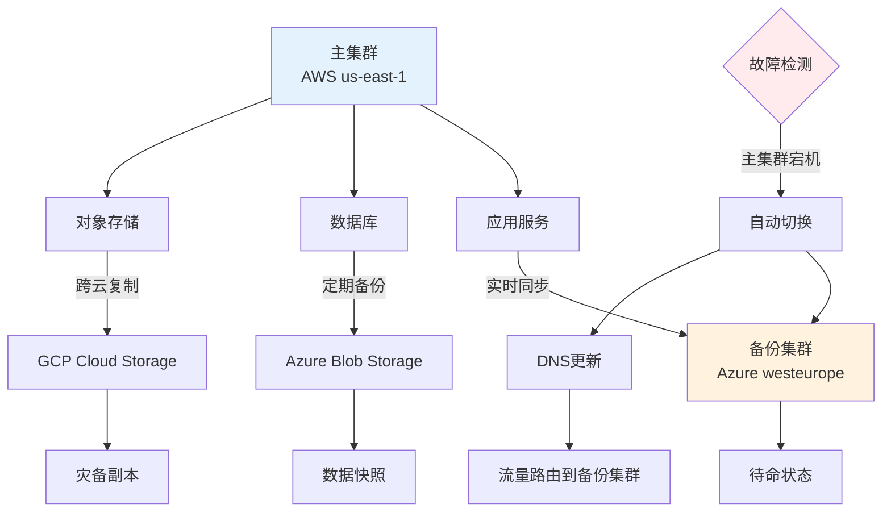

**跨云灾备关键指标:**

| 指标 | 定义 | 目标设定 | 实现方式 |
|------|------|----------|----------|
| **RPO** (Recovery Point Objective) | 能容忍丢失多少数据 | 金融:0秒,电商:5分钟,内部系统:1小时 | 实时同步/定期备份 |
| **RTO** (Recovery Time Objective) | 多快恢复服务 | 关键业务:5分钟,一般业务:1小时 | 热备/温备/冷备 |
| **数据一致性** | 主备数据是否一致 | 强一致性/最终一致性 | 同步/异步复制 |

#### 📝 最小示例

```yaml
# ========== Velero跨云备份配置 ==========
# Velero是CNCF备份工具,支持跨云存储
apiVersion: v1
kind: Namespace
metadata:
  name: velero

---
# 1. AWS集群备份配置
apiVersion: velero.io/v1
kind: BackupStorageLocation
metadata:
  name: aws-primary
  namespace: velero
spec:
  provider: aws
  objectStorage:
    bucket: company-k8s-backups-aws
    prefix: primary-cluster
  config:
    region: us-east-1
    
---
# 2. Azure备份存储位置(跨云备份)
apiVersion: velero.io/v1
kind: BackupStorageLocation
metadata:
  name: azure-dr
  namespace: velero
spec:
  provider: azure
  objectStorage:
    bucket: company-k8s-backups-azure
    prefix: dr-backups
  config:
    resourceGroup: velero-backups-rg
    storageAccount: velerostorageaccount
    
---
# 3. 自动备份策略
apiVersion: velero.io/v1
kind: Schedule
metadata:
  name: multicloud-backup
  namespace: velero
spec:
  # 每6小时备份一次
  schedule: "0 */6 * * *"
  
  template:
    # 备份范围
    includedNamespaces:
    - production
    - staging
    
    # 排除的资源
    excludedResources:
    - events
    - replicasets
    
    # 同时备份到两个云
    storageLocations:
    - aws-primary
    - azure-dr
    
    # 备份PV快照
    snapshotVolumes: true
    
    # 保留30天
    ttl: 720h0m0s
    
    # 备份钩子(备份前执行的命令)
    hooks:
      resources:
      - name: database-backup-hook
        includedNamespaces:
        - production
        labelSelector:
          matchLabels:
            app: postgresql
        pre:
        - exec:
            container: postgres
            command:
            - /bin/bash
            - -c
            - pg_dump mydb > /backup/db.sql
            onError: Fail
            timeout: 10m

---
# 4. 跨云恢复示例
# 从Azure备份恢复到GCP集群
apiVersion: velero.io/v1
kind: Restore
metadata:
  name: disaster-recovery-restore
  namespace: velero
spec:
  # 指定备份名称
  backupName: multicloud-backup-20260210-120000
  
  # 恢复到的命名空间映射
  namespaceMapping:
    production: production-restored
    
  # 只恢复特定资源
  includedResources:
  - deployments
  - services
  - configmaps
  - secrets
  - persistentvolumeclaims
  
  # 恢复PV
  restorePVs: true
  
  # 保留已存在的资源
  existingResourcePolicy: update
  
---
# 5. 数据库跨云同步配置
apiVersion: v1
kind: ConfigMap
metadata:
  name: database-replication-config
  namespace: production
data:
  # PostgreSQL逻辑复制配置
  replication.conf: |
    # 主库配置(AWS)
    wal_level = logical
    max_wal_senders = 10
    max_replication_slots = 10
    
    # 发布配置
    CREATE PUBLICATION multicloud_pub FOR ALL TABLES;
    
    # 从库配置(Azure)
    # 创建订阅
    CREATE SUBSCRIPTION multicloud_sub
      CONNECTION 'host=primary-db.aws port=5432 dbname=mydb user=replicator password=xxx'
      PUBLICATION multicloud_pub;
      
---
# 6. 对象存储跨云同步
apiVersion: batch/v1
kind: CronJob
metadata:
  name: cross-cloud-storage-sync
  namespace: platform-ops
spec:
  schedule: "0 */12 * * *"  # 每12小时同步
  jobTemplate:
    spec:
      template:
        spec:
          containers:
          - name: sync-tool
            image: amazon/aws-cli:latest
            command:
            - /bin/bash
            - -c
            - |
              #!/bin/bash
              set -euo pipefail
              
              echo "开始跨云存储同步..."
              
              # 1. AWS S3 -> Azure Blob
              echo "同步AWS S3到Azure Blob..."
              aws s3 sync s3://company-data-aws/ /tmp/data/
              az storage blob upload-batch \
                --destination company-data-azure \
                --source /tmp/data/
              
              # 2. AWS S3 -> GCP Storage
              echo "同步AWS S3到GCP Storage..."
              gsutil -m rsync -r s3://company-data-aws gs://company-data-gcp
              
              # 3. 验证同步完整性
              echo "验证数据一致性..."
              aws_count=$(aws s3 ls s3://company-data-aws/ --recursive | wc -l)
              azure_count=$(az storage blob list -c company-data-azure --query "length(@)")
              gcp_count=$(gsutil ls gs://company-data-gcp/** | wc -l)
              
              echo "AWS对象数: $aws_count"
              echo "Azure对象数: $azure_count"
              echo "GCP对象数: $gcp_count"
              
              if [ "$aws_count" -eq "$azure_count" ] && [ "$aws_count" -eq "$gcp_count" ]; then
                echo "跨云同步成功,数据一致"
              else
                echo "警告:数据不一致,需要人工检查"
                exit 1
              fi
          restartPolicy: OnFailure
```

#### ⚠️ 常见误区

| 误区 | 真相 | 推荐做法 |
|------|------|----------|
| **误区1: 只备份不测试恢复** | 备份可能失败,不测试等于没备份 | 每月灾备演练,验证RTO/RPO |
| **误区2: 跨云复制实时性假设** | 跨云传输有延迟,不是实时同步 | 评估网络延迟,设置合理RPO |
| **误区3: 忽略跨云成本** | 跨云数据传输费昂贵 | 压缩数据,增量备份,限制频率 |
| **误区4: 配置不一起备份** | 只备份数据,ConfigMap/Secret丢失也无法恢复 | 使用Velero备份完整集群状态 |

### 5.5 故障切换

> **🔰 初学者理解**: 类比**备用发电机** — 停电时自动切换到发电机供电。故障切换就是主集群故障时,自动将流量切换到备份集群,用户无感知或短暂中断。

#### 🔧 工作原理

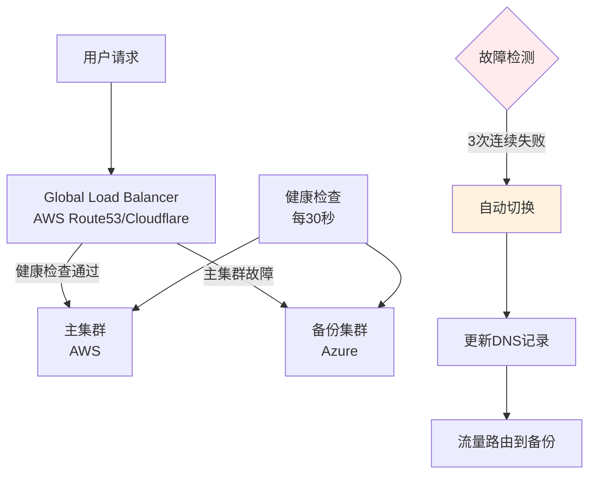

**故障切换策略:**

| 策略 | 切换时间 | 数据一致性 | 成本 | 适用场景 |
|------|----------|------------|------|----------|
| **DNS故障转移** | 1-5分钟(TTL限制) | 最终一致 | 低 | 一般Web应用 |
| **Global Load Balancer** | <1分钟 | 最终一致 | 中 | 公网服务 |
| **数据库主备切换** | 30秒-5分钟 | 可配置 | 高 | 有状态服务 |
| **Active-Active** | 0秒(无切换) | 强一致(复杂) | 最高 | 金融交易 |

#### 📝 最小示例

```yaml
# ========== AWS Route53健康检查和故障转移 ==========
resource "aws_route53_health_check" "primary" {
  fqdn              = "app.primary.example.com"
  port              = 443
  type              = "HTTPS"
  resource_path     = "/health"
  failure_threshold = 3
  request_interval  = 30
  
  tags = {
    Name = "primary-cluster-health"
  }
}

resource "aws_route53_health_check" "secondary" {
  fqdn              = "app.secondary.example.com"
  port              = 443
  type              = "HTTPS"
  resource_path     = "/health"
  failure_threshold = 3
  request_interval  = 30
  
  tags = {
    Name = "secondary-cluster-health"
  }
}

# 主记录(primary failover)
resource "aws_route53_record" "primary" {
  zone_id = aws_route53_zone.main.zone_id
  name    = "app.example.com"
  type    = "A"
  
  failover_routing_policy {
    type = "PRIMARY"
  }
  
  set_identifier = "primary"
  health_check_id = aws_route53_health_check.primary.id
  ttl            = 60
  
  records = [aws_lb.primary.ip_address]
}

# 备用记录(secondary failover)
resource "aws_route53_record" "secondary" {
  zone_id = aws_route53_zone.main.zone_id
  name    = "app.example.com"
  type    = "A"
  
  failover_routing_policy {
    type = "SECONDARY"
  }
  
  set_identifier = "secondary"
  health_check_id = aws_route53_health_check.secondary.id
  ttl            = 60
  
  records = [azurerm_public_ip.backup.ip_address]
}

---
# ========== Kubernetes自动故障切换配置 ==========
apiVersion: v1
kind: ConfigMap
metadata:
  name: failover-automation
  namespace: platform-ops
data:
  failover-script.sh: |
    #!/bin/bash
    set -euo pipefail
    
    # 故障切换脚本
    PRIMARY_CLUSTER="aws-us-east-1"
    BACKUP_CLUSTER="azure-westeurope"
    HEALTH_CHECK_URL="https://app.example.com/health"
    
    check_health() {
      local cluster=$1
      local response=$(curl -s -o /dev/null -w "%{http_code}" $HEALTH_CHECK_URL)
      if [ "$response" = "200" ]; then
        return 0
      else
        return 1
      fi
    }
    
    failover() {
      echo "检测到主集群故障,开始故障切换..."
      
      # 1. 更新DNS指向备份集群
      echo "更新DNS记录..."
      aws route53 change-resource-record-sets \
        --hosted-zone-id Z1234567890ABC \
        --change-batch file:///tmp/failover-dns.json
      
      # 2. 扩容备份集群
      echo "扩容备份集群..."
      kubectl --context=$BACKUP_CLUSTER scale deployment -n production --all --replicas=5
      
      # 3. 发送告警通知
      echo "发送故障切换通知..."
      curl -X POST https://hooks.slack.com/services/xxx \
        -d '{"text": "故障切换完成: 流量已切换到备份集群 '$BACKUP_CLUSTER'"}'
      
      echo "故障切换完成"
    }
    
    # 主循环
    FAILURE_COUNT=0
    while true; do
      if check_health $PRIMARY_CLUSTER; then
        echo "$(date): 主集群健康"
        FAILURE_COUNT=0
      else
        FAILURE_COUNT=$((FAILURE_COUNT + 1))
        echo "$(date): 主集群健康检查失败 ($FAILURE_COUNT/3)"
        
        if [ $FAILURE_COUNT -ge 3 ]; then
          failover
          break
        fi
      fi
      
      sleep 30
    done
```

#### ⚠️ 常见误区

| 误区 | 真相 | 推荐做法 |
|------|------|----------|
| **误区1: DNS TTL设置过大** | TTL=3600意味着最多1小时才能切换 | 关键应用TTL设置60秒 |
| **误区2: 备份集群冷启动** | 切换后发现备份集群资源不足 | 保持备份集群最小规模运行 |
| **误区3: 只切换应用不切换数据库** | 应用切换后仍连接主集群数据库 | 数据库也要有主备切换方案 |
| **误区4: 不通知用户** | 用户不知道发生了什么 | 状态页面+邮件通知 |

**故障切换checklist:**
- [ ] DNS/LB健康检查配置正确
- [ ] 备份集群资源充足(至少50%主集群规模)
- [ ] 数据已同步到备份集群(检查RPO)
- [ ] 切换脚本经过演练验证
- [ ] 监控告警已配置
- [ ] 回切方案已准备(主集群恢复后如何切回)


---

## 6. 多云治理框架

> **🔰 初学者导读**: 治理框架解决"谁能做什么、在哪做、怎么做"的问题。包括统一的命名规范、标签策略、安全基线、成本分摊和合规要求。

### 6.1 多云治理原则

| 治理维度 | 核心原则 | 实施要点 | 治理工具 | 合规要求 |
|----------|----------|----------|----------|----------|
| **统一身份** | 单点登录、统一认证 | SSO集成、RBAC统一 | Keycloak、AAD | SOC2、ISO27001 |
| **资源管理** | 标准化命名、标签治理 | 命名规范、成本标签 | Terraform、Crossplane | 内部治理要求 |
| **安全合规** | 策略统一、审计集中 | 策略引擎、合规扫描 | OPA、Falco | 等保、GDPR |
| **成本控制** | 预算管理、成本分摊 | 预算告警、成本分析 | Kubecost、CloudHealth | 财务管控要求 |
| **变更管理** | 流程标准化、审批自动化 | GitOps、变更窗口 | ArgoCD、Spinnaker | 变更管理流程 |

### 6.2 多云治理实施

```yaml
# ========== 多云治理策略 ==========
apiVersion: governance.example.com/v1
kind: MulticloudGovernancePolicy
metadata:
  name: enterprise-governance
  namespace: platform-governance
spec:
  # 统一身份认证
  identity_management:
    sso_provider: "keycloak"
    identity_federation:
      enabled: true
      providers:
        - name: "aws-sso"
          type: "saml"
          metadata_url: "https://sso.us-east-1.amazonaws.com/idp/metadata"
        - name: "azure-ad"
          type: "oidc"
          issuer_url: "https://login.microsoftonline.com/common/v2.0"
        - name: "gcp-identity"
          type: "oidc"
          issuer_url: "https://accounts.google.com"
    
    role_mapping:
      admin_role: "platform-admin"
      developer_role: "app-developer"
      auditor_role: "security-auditor"
      
  # 资源命名和标签规范
  resource_governance:
    naming_standards:
      cluster_pattern: "{environment}-{purpose}-{region}-{sequence}"
      namespace_pattern: "{team}-{application}-{environment}"
      resource_pattern: "{application}-{component}-{environment}"
      
    tagging_requirements:
      mandatory_tags:
        - "Environment"
        - "Team"
        - "CostCenter"
        - "Owner"
        - "ComplianceLevel"
      recommended_tags:
        - "Project"
        - "BusinessUnit"
        - "CreateDate"
        
  # 安全策略统一
  security_policies:
    cluster_hardening:
      pod_security_standards: "restricted"
      network_policies_required: true
      image_scanning_mandatory: true
      
    data_protection:
      encryption_at_rest: true
      encryption_in_transit: true
      data_classification_required: true
      
    compliance_frameworks:
      - name: "soc2-type2"
        controls:
          - "access-logging"
          - "change-management"
          - "incident-response"
      - name: "iso27001"
        controls:
          - "asset-management"
          - "access-control"
          - "cryptography"

---
# ========== 治理监控和报告 ==========
apiVersion: monitoring.coreos.com/v1
kind: PrometheusRule
metadata:
  name: governance-compliance-rules
  namespace: platform-governance
spec:
  groups:
  - name: governance.compliance.rules
    rules:
    # 资源标签合规检查
    - alert: MissingMandatoryTags
      expr: |
        count by(namespace, resource) (
          kube_resource_labels{label_environment="", label_team="", label_costcenter=""}
        ) > 0
      for: 1h
      labels:
        severity: warning
      annotations:
        summary: "资源缺少强制标签"
        description: "检测到资源缺少Environment、Team或CostCenter标签"
        
    # 安全策略合规检查
    - alert: SecurityPolicyViolation
      expr: |
        count(opa_policy_violations_total{severity="high"}) > 0
      for: 30m
      labels:
        severity: critical
      annotations:
        summary: "安全策略违规"
        description: "检测到高严重性安全策略违规"
        
    # 成本治理检查
    - alert: BudgetGovernanceViolation
      expr: |
        sum by(team) (rate(cloud_cost_hourly_total[1h])) > 
        on(team) group_left budget_hourly_limit
      for: 1h
      labels:
        severity: critical
      annotations:
        summary: "预算治理违规"
        description: "团队 {{ $labels.team }} 的小时成本超出预算限制"

---
# ========== 治理仪表板 ==========
apiVersion: grafana.integreatly.org/v1beta1
kind: GrafanaDashboard
metadata:
  name: multicloud-governance-dashboard
  namespace: platform-governance
spec:
  json: |
    {
      "dashboard": {
        "title": "多云治理仪表板",
        "panels": [
          {
            "title": "治理合规状态",
            "type": "stat",
            "targets": [
              {"expr": "governance_compliance_score", "legendFormat": "整体合规评分"},
              {"expr": "count(governance_policy_violations_total)", "legendFormat": "违规项数量"}
            ]
          },
          {
            "title": "各维度合规率",
            "type": "barchart",
            "targets": [
              {"expr": "governance_dimension_compliance{dimension=\"identity\"}", "legendFormat": "身份治理"},
              {"expr": "governance_dimension_compliance{dimension=\"security\"}", "legendFormat": "安全治理"},
              {"expr": "governance_dimension_compliance{dimension=\"cost\"}", "legendFormat": "成本治理"},
              {"expr": "governance_dimension_compliance{dimension=\"resource\"}", "legendFormat": "资源治理"}
            ]
          },
          {
            "title": "违规趋势分析",
            "type": "graph",
            "targets": [
              {"expr": "increase(governance_policy_violations_total[1h])", "legendFormat": "每小时新增违规"}
            ]
          },
          {
            "title": "治理成本分析",
            "type": "table",
            "targets": [
              {
                "expr": "sum by(team) (cloud_cost_monthly_total)",
                "format": "table"
              }
            ]
          }
        ]
      }
    }
```

### 2.4 跨云成本对比

> **🔰 初学者理解**: 类比**比价购物** — 就像买同一商品要在不同超市比价,云资源在不同云厂商的价格和计费模式差异很大。懂得如何对比,才能做出最优决策。关键不是看标价,而是看**总拥有成本(TCO)**。

#### 🔧 工作原理

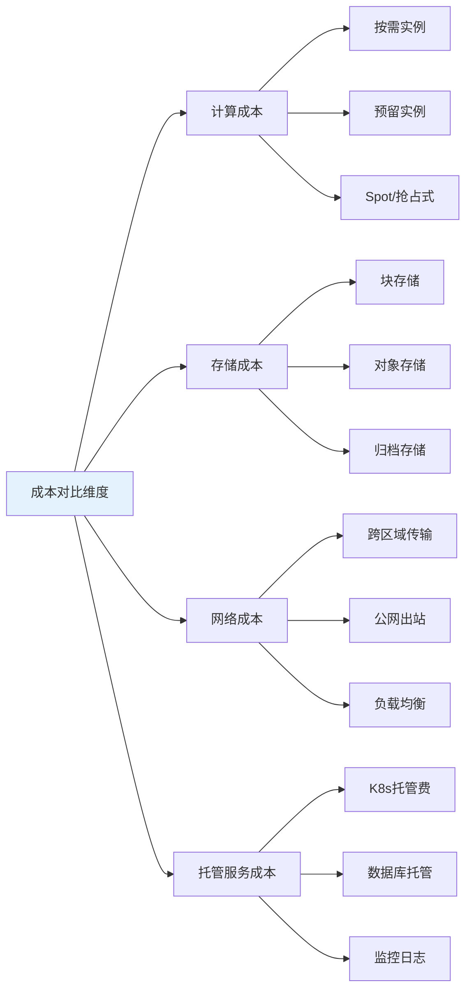

**成本对比关键原则:**
1. **不止看单价,算总成本**: 包括数据传输、存储、备份、监控等隐藏成本
2. **考虑折扣策略**: 预留实例、承诺使用折扣(CUD)、企业协议(EA)
3. **计算区域差异**: 同一服务在不同区域价格可能差30%+
4. **评估托管服务溢价**: 托管Kubernetes比自建贵,但省运维人力

#### 📝 最小示例

```yaml
# ========== 跨云成本对比配置 ==========
apiVersion: v1
kind: ConfigMap
metadata:
  name: multicloud-cost-comparison
  namespace: platform-ops
data:
  # 计算实例成本对比(2024年参考价格,单位:USD/月)
  compute-cost-comparison.yaml: |
    # 4vCPU 16GB内存实例对比
    instance_comparison:
      aws:
        instance_type: "m5.xlarge"
        on_demand_monthly: 140.16  # $0.192/小时 * 730小时
        reserved_1yr_monthly: 84.67  # 40%折扣
        reserved_3yr_monthly: 56.57  # 60%折扣
        spot_monthly: 42.05  # 70%折扣 (价格波动)
        
      azure:
        instance_type: "Standard_D4s_v3"
        on_demand_monthly: 131.40  # $0.18/小时 * 730小时
        reserved_1yr_monthly: 84.67  # 35%折扣
        reserved_3yr_monthly: 52.56  # 60%折扣
        spot_monthly: 39.42  # 70%折扣
        
      gcp:
        instance_type: "n2-standard-4"
        on_demand_monthly: 121.17  # $0.166/小时 * 730小时
        committed_1yr_monthly: 84.82  # 30%折扣
        committed_3yr_monthly: 66.65  # 45%折扣
        preemptible_monthly: 36.35  # 70%折扣
        
    # 关键观察:
    # 1. GCP按需最便宜,但预留折扣力度最小
    # 2. AWS和Azure预留折扣更激进
    # 3. Spot/Preemptible价格相近,但可用性不同
    
  # 存储成本对比
  storage-cost-comparison.yaml: |
    # 1TB SSD块存储 (类似EBS gp3/Azure Premium SSD/GCP PD-SSD)
    block_storage_1tb:
      aws_ebs_gp3: 80.00  # $0.08/GB/月
      azure_premium_ssd_p30: 135.17  # 固定512GB容量定价
      gcp_pd_ssd: 170.00  # $0.17/GB/月
      
    # 1TB对象存储(标准层)
    object_storage_1tb_standard:
      aws_s3_standard: 23.55  # $0.023/GB/月
      azure_blob_hot: 18.40  # $0.018/GB/月
      gcp_storage_standard: 20.48  # $0.020/GB/月
      
    # 100TB对象存储(归档层)
    object_storage_100tb_archive:
      aws_s3_glacier_deep_archive: 102.40  # $0.00099/GB/月
      azure_blob_archive: 204.80  # $0.00199/GB/月
      gcp_archive: 122.88  # $0.0012/GB/月
      
    # 关键观察:
    # 1. 块存储: AWS最便宜,GCP最贵(差2倍)
    # 2. 对象存储标准层: Azure略便宜
    # 3. 归档存储: AWS最便宜,但恢复费用需考虑
    
  # 网络成本对比
  network-cost-comparison.yaml: |
    # 数据传出费用(公网出站, USD/GB)
    egress_pricing:
      # 前10TB/月的价格
      aws_first_10tb: 0.09
      azure_first_10tb: 0.087
      gcp_first_10tb: 0.12  # GCP出站最贵!
      
      # 150TB+/月的价格
      aws_over_150tb: 0.05
      azure_over_150tb: 0.05
      gcp_over_150tb: 0.08
      
    # 跨区域传输(同云不同区域)
    inter_region_transfer:
      aws_cross_region: 0.02  # 美国区域间
      azure_cross_region: 0.02
      gcp_cross_region: 0.01  # GCP区域间最便宜
      
    # K8s托管费用
    managed_k8s_control_plane:
      aws_eks: 73.00  # $0.10/小时 * 730小时
      azure_aks: 0.00  # 免费! 只付节点费
      gcp_gke: 73.00  # $0.10/小时 * 730小时
      gcp_gke_autopilot: 0.00  # Autopilot模式免费控制平面
      
    # 关键观察:
    # 1. GCP公网出站费最贵,数据密集型应用需注意
    # 2. Azure AKS控制平面免费是优势
    # 3. 跨区域传输成本需考虑多区域架构

---
# ========== 自动化成本对比工具 ==========
apiVersion: batch/v1
kind: CronJob
metadata:
  name: cost-comparison-analyzer
  namespace: platform-ops
spec:
  schedule: "0 0 * * 0"  # 每周日运行
  jobTemplate:
    spec:
      template:
        spec:
          serviceAccountName: cost-analyzer
          containers:
          - name: analyzer
            image: platform/cost-comparison:latest
            env:
            - name: AWS_ACCESS_KEY_ID
              valueFrom:
                secretKeyRef:
                  name: aws-credentials
                  key: access-key-id
            - name: AZURE_CLIENT_ID
              valueFrom:
                secretKeyRef:
                  name: azure-credentials
                  key: client-id
            - name: GCP_PROJECT_ID
              value: "my-gcp-project"
            command:
            - /bin/sh
            - -c
            - |
              #!/bin/bash
              set -euo pipefail
              
              echo "开始多云成本对比分析..."
              
              # 1. 获取当前工作负载资源使用情况
              echo "分析当前资源使用..."
              python3 /scripts/resource-profiler.py \
                --output /tmp/current-usage.json
              
              # 2. 调用各云定价API进行对比
              echo "查询各云定价..."
              python3 /scripts/pricing-fetcher.py \
                --usage-profile /tmp/current-usage.json \
                --clouds aws,azure,gcp \
                --output /tmp/pricing-comparison.json
              
              # 3. 计算TCO(总拥有成本)
              echo "计算总拥有成本..."
              python3 /scripts/tco-calculator.py \
                --pricing-data /tmp/pricing-comparison.json \
                --include-hidden-costs \
                --output /tmp/tco-report.json
              
              # 4. 生成可视化报告
              echo "生成成本对比报告..."
              python3 /scripts/report-generator.py \
                --data /tmp/tco-report.json \
                --format html \
                --output /reports/cost-comparison-$(date +%Y%m%d).html
              
              # 5. 识别成本优化机会
              echo "识别优化机会..."
              python3 /scripts/optimization-recommender.py \
                --current-cloud aws \
                --comparison-data /tmp/tco-report.json \
                --output /tmp/recommendations.txt
              
              cat /tmp/recommendations.txt
              
              echo "成本对比分析完成"
          restartPolicy: OnFailure
```

#### ⚠️ 常见误区

| 误区 | 真相 | 推荐做法 |
|------|------|----------|
| **误区1: 只比较虚拟机单价** | 实际成本包括网络、存储、监控、数据传输等多项费用 | 使用TCO计算器计算全栈成本 |
| **误区2: 最便宜的云就是最优选择** | 需要考虑运维成本、团队熟悉度、生态集成等因素 | 综合评估技术成本+人力成本 |
| **误区3: 定价是固定的** | 云厂商定价经常调整,有企业协议(EA)可谈判 | 定期审查,利用折扣计划 |
| **误区4: Spot/Preemptible总是划算** | 频繁中断导致的任务重试可能抵消成本节省 | 只用于容错性高的批处理任务 |
| **误区5: 忽略隐藏成本** | 数据传输费、API调用费、日志存储费可能超过计算成本 | 监控所有成本维度,设置预算告警 |

**实战决策指南:**

| 场景 | 成本考量 | 推荐方案 |
|------|----------|----------|
| **计算密集型应用** | CPU/内存价格,预留实例折扣 | AWS/Azure预留实例,GCP承诺使用折扣 |
| **存储密集型应用** | 存储单价,数据传输费 | AWS S3性价比高,注意出站费 |
| **数据出站大** | 公网流量费用 | 避免GCP,或使用CDN降低直接出站 |
| **K8s托管** | 控制平面费用,节点折扣 | Azure AKS(免费控制平面)或GCP Autopilot |
| **批处理任务** | Spot实例可用性和价格 | AWS Spot Fleet(可用性最稳定) |
| **多区域部署** | 跨区域传输费 | GCP区域间传输便宜,适合全球部署 |

### 2.5 资源右sizing (Right Sizing)

> **🔰 初学者理解**: 类比**按需选衣服尺码** — 穿过大的衣服浪费布料,过小的衣服不舒适。云资源也一样,配置过高浪费成本,过低影响性能。Right Sizing就是找到"刚刚好"的配置。

#### 🔧 工作原理

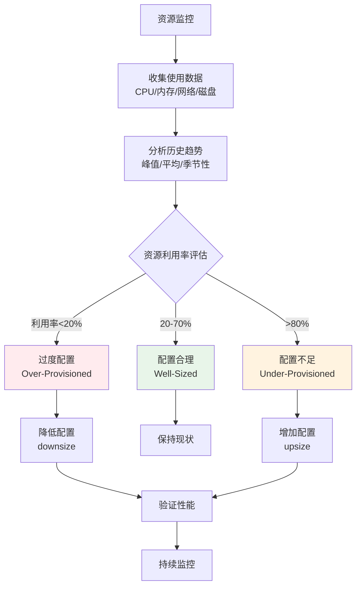

**Right Sizing核心指标:**

| 指标 | 健康范围 | 过度配置 | 配置不足 | 优化动作 |
|------|----------|----------|----------|----------|
| **CPU利用率** | 40-70% | <20% | >80% | 调整request/limit |
| **内存利用率** | 50-80% | <30% | >90% | 调整内存配额 |
| **磁盘I/O利用率** | 30-60% | <15% | >75% | 更换存储类型 |
| **网络带宽** | 30-60% | <10% | >70% | 调整实例类型 |

#### 📝 最小示例

```yaml
# ========== Right Sizing分析工具配置 ==========
apiVersion: v1
kind: ConfigMap
metadata:
  name: rightsizing-config
  namespace: platform-ops
data:
  # Right Sizing策略定义
  sizing-policy.yaml: |
    # 资源分析周期
    analysis_period:
      lookback_days: 30  # 分析最近30天数据
      peak_percentile: 95  # 基于P95峰值sizing
      
    # 资源利用率阈值
    utilization_thresholds:
      cpu:
        over_provisioned: 20  # CPU平均利用率<20%为过度配置
        under_provisioned: 80  # CPU峰值>80%为配置不足
        target_range: [40, 70]  # 目标范围
        
      memory:
        over_provisioned: 30
        under_provisioned: 85
        target_range: [50, 80]
        
      storage:
        over_provisioned: 40
        under_provisioned: 85
        target_range: [50, 75]
        
    # 调整策略
    adjustment_strategy:
      # 保守模式:小步调整,逐步验证
      mode: "conservative"  # 可选: aggressive, conservative
      
      # 每次调整幅度
      step_size:
        cpu: 25  # 每次调整25% (如2核->1.5核)
        memory: 20  # 每次调整20%
        
      # 安全阈值
      min_cpu_cores: 0.25  # 最小不低于250m
      min_memory_mb: 128  # 最小不低于128MB
      
      # 排除规则
      exclusions:
        # 生产关键应用不自动调整
        - namespace: "production"
          labels:
            tier: "critical"
        # 有状态应用谨慎调整
        - kind: "StatefulSet"
          
    # 成本估算
    cost_calculation:
      # 各云CPU/内存单价(USD/月)
      aws:
        cpu_per_core: 20.00
        memory_per_gb: 5.00
      azure:
        cpu_per_core: 18.50
        memory_per_gb: 4.80
      gcp:
        cpu_per_core: 17.00
        memory_per_gb: 4.50

---
# ========== 资源使用监控查询 ==========
apiVersion: monitoring.coreos.com/v1
kind: PrometheusRule
metadata:
  name: rightsizing-queries
  namespace: platform-ops
spec:
  groups:
  - name: rightsizing.metrics
    interval: 5m
    rules:
    # 容器CPU利用率
    - record: container:cpu_usage_ratio:30d_avg
      expr: |
        avg_over_time(
          (rate(container_cpu_usage_seconds_total{container!=""}[5m])
          / 
          on(container, pod, namespace) group_left
          kube_pod_container_resource_requests{resource="cpu"})[30d:5m]
        )
      
    # 容器内存利用率
    - record: container:memory_usage_ratio:30d_avg
      expr: |
        avg_over_time(
          (container_memory_working_set_bytes{container!=""}
          / 
          on(container, pod, namespace) group_left
          kube_pod_container_resource_requests{resource="memory"})[30d:5m]
        )
      
    # 过度配置检测(CPU长期低利用)
    - record: container:cpu_overprovisioned:30d
      expr: |
        container:cpu_usage_ratio:30d_avg < 0.2
      
    # 配置不足检测(内存接近限制)
    - record: container:memory_underprovisioned:30d
      expr: |
        container:memory_usage_ratio:30d_avg > 0.85

---
# ========== Right Sizing自动化任务 ==========
apiVersion: batch/v1
kind: CronJob
metadata:
  name: rightsizing-analyzer
  namespace: platform-ops
spec:
  schedule: "0 2 * * 1"  # 每周一凌晨2点分析
  jobTemplate:
    spec:
      template:
        spec:
          serviceAccountName: rightsizing-operator
          containers:
          - name: analyzer
            image: platform/rightsizing-tool:latest
            command:
            - /bin/sh
            - -c
            - |
              #!/bin/bash
              set -euo pipefail
              
              echo "开始Right Sizing分析..."
              
              # 1. 从Prometheus查询历史数据
              echo "查询资源使用历史数据..."
              python3 /scripts/metrics-fetcher.py \
                --prometheus-url http://prometheus:9090 \
                --lookback-days 30 \
                --output /tmp/usage-data.json
              
              # 2. 分析过度配置的工作负载
              echo "分析过度配置的资源..."
              python3 /scripts/overprovisioned-analyzer.py \
                --usage-data /tmp/usage-data.json \
                --threshold-cpu 0.20 \
                --threshold-memory 0.30 \
                --output /tmp/overprovisioned.json
              
              # 3. 分析配置不足的工作负载
              echo "分析配置不足的资源..."
              python3 /scripts/underprovisioned-analyzer.py \
                --usage-data /tmp/usage-data.json \
                --threshold-cpu 0.80 \
                --threshold-memory 0.85 \
                --output /tmp/underprovisioned.json
              
              # 4. 生成调整建议
              echo "生成Right Sizing建议..."
              python3 /scripts/recommendations-generator.py \
                --overprovisioned /tmp/overprovisioned.json \
                --underprovisioned /tmp/underprovisioned.json \
                --policy /config/sizing-policy.yaml \
                --output /tmp/recommendations.yaml
              
              # 5. 计算成本节省预估
              echo "计算潜在成本节省..."
              python3 /scripts/savings-calculator.py \
                --recommendations /tmp/recommendations.yaml \
                --pricing-config /config/sizing-policy.yaml \
                --output /tmp/savings-report.txt
              
              cat /tmp/savings-report.txt
              
              # 6. 生成可视化报告
              echo "生成Right Sizing报告..."
              REPORT_DATE=$(date +%Y%m%d)
              python3 /scripts/report-generator.py \
                --recommendations /tmp/recommendations.yaml \
                --savings /tmp/savings-report.txt \
                --format html \
                --output /reports/rightsizing-report-${REPORT_DATE}.html
              
              # 7. 发送通知
              echo "发送优化建议通知..."
              curl -X POST \
                -H "Content-Type: application/json" \
                -d "{\"text\": \"本周Right Sizing分析完成,预计可节省成本: $(cat /tmp/savings-report.txt | grep 'Total Savings' | awk '{print $3}')\"}" \
                ${SLACK_WEBHOOK_URL}
              
              echo "Right Sizing分析完成"
          restartPolicy: OnFailure

---
# ========== Right Sizing建议示例 ==========
# 自动生成的调整建议格式
apiVersion: v1
kind: ConfigMap
metadata:
  name: rightsizing-recommendations-example
  namespace: platform-ops
data:
  recommendations.yaml: |
    # Right Sizing建议报告
    generated_at: "2026-02-10T02:00:00Z"
    analysis_period: "2026-01-11 to 2026-02-10"
    
    # 过度配置工作负载
    overprovisioned:
    - namespace: development
      workload: deployment/frontend-dev
      current_resources:
        cpu_request: "2000m"
        memory_request: "4Gi"
      average_usage:
        cpu: "250m"  # 12.5%利用率
        memory: "800Mi"  # 20%利用率
      recommended_resources:
        cpu_request: "500m"
        memory_request: "1Gi"
      estimated_monthly_savings: "$45.00"
      confidence: "high"  # 数据充分,建议可靠
      
    - namespace: staging
      workload: deployment/api-staging
      current_resources:
        cpu_request: "4000m"
        memory_request: "8Gi"
      average_usage:
        cpu: "600m"  # 15%利用率
        memory: "1.5Gi"  # 19%利用率
      recommended_resources:
        cpu_request: "1000m"
        memory_request: "2Gi"
      estimated_monthly_savings: "$120.00"
      confidence: "high"
      
    # 配置不足工作负载
    underprovisioned:
    - namespace: production
      workload: deployment/api-prod
      current_resources:
        cpu_request: "1000m"
        memory_request: "2Gi"
      peak_usage:
        cpu: "950m"  # 95%利用率
        memory: "1.8Gi"  # 90%利用率
      recommended_resources:
        cpu_request: "1500m"
        memory_request: "3Gi"
      risk: "medium"  # 可能导致性能问题
      confidence: "high"
      
    # 总计
    summary:
      total_workloads_analyzed: 127
      overprovisioned_count: 34
      underprovisioned_count: 8
      well_sized_count: 85
      estimated_monthly_savings: "$1,250.00"
      estimated_annual_savings: "$15,000.00"
```

#### ⚠️ 常见误区

| 误区 | 真相 | 推荐做法 |
|------|------|----------|
| **误区1: 基于平均值sizing** | 应该基于P95或P99峰值,否则高峰期会性能不足 | 使用95th百分位值+20%余量 |
| **误区2: 一次性大幅调整** | 大幅降配可能导致服务不稳定 | 逐步调整,每次20-30%,观察1周 |
| **误区3: 所有应用都能优化** | 某些应用需要预留资源(如JVM堆内存) | 区分对待,关键应用保守sizing |
| **误区4: 忽略突发流量** | 基于历史数据可能忽略促销等特殊事件 | 结合业务日历,预留弹性空间 |
| **误区5: 只看CPU/内存** | 磁盘I/O、网络带宽也是重要瓶颈 | 全面评估所有资源维度 |

**实战操作指南:**

```bash
# 1. 查看Pod资源使用情况
kubectl top pods -n production --sort-by=cpu

# 2. 分析历史资源使用(需要Prometheus)
kubectl port-forward -n monitoring svc/prometheus 9090:9090

# 访问 http://localhost:9090 查询:
# CPU利用率: rate(container_cpu_usage_seconds_total[5m]) / on() kube_pod_container_resource_requests
# 内存利用率: container_memory_working_set_bytes / on() kube_pod_container_resource_requests

# 3. 使用Vertical Pod Autoscaler(VPA)推荐
kubectl apply -f https://github.com/kubernetes/autoscaler/releases/download/vpa-0.14.0/vpa-v0.14-crd.yaml

# 创建VPA资源(推荐模式,不自动应用)
cat <<EOF | kubectl apply -f -
apiVersion: autoscaling.k8s.io/v1
kind: VerticalPodAutoscaler
metadata:
  name: my-app-vpa
  namespace: production
spec:
  targetRef:
    apiVersion: "apps/v1"
    kind: Deployment
    name: my-app
  updateMode: "Off"  # 只推荐,不自动应用
EOF

# 查看VPA推荐
kubectl describe vpa my-app-vpa -n production

# 4. 应用Right Sizing建议
kubectl set resources deployment my-app -n production \
  --requests=cpu=500m,memory=1Gi \
  --limits=cpu=1000m,memory=2Gi

# 5. 监控调整后的效果
watch kubectl top pods -n production -l app=my-app
```

**成本节省案例:**
- **案例1**: 某公司对200+微服务做Right Sizing,平均CPU request降低40%,**年节省$180,000**
- **案例2**: 发现开发/测试环境过度配置,晚上和周末自动缩容,**年节省$75,000**
- **案例3**: 识别"僵尸资源"(长期未使用的PV、闲置的Load Balancer),清理后**年节省$30,000**

---

## 6. 多云治理框架

> **🔰 初学者导读**: 治理框架解决"谁能做什么、在哪做、怎么做"的问题。包括统一的命名规范、标签策略、安全基线、成本分摊和合规要求。

### 6.1 多云治理原则

| 治理维度 | 核心原则 | 实施要点 | 治理工具 | 合规要求 |
|----------|----------|----------|----------|----------|
| **统一身份** | 单点登录、统一认证 | SSO集成、RBAC统一 | Keycloak、AAD | SOC2、ISO27001 |
| **资源管理** | 标准化命名、标签治理 | 命名规范、成本标签 | Terraform、Crossplane | 内部治理要求 |
| **安全合规** | 策略统一、审计集中 | 策略引擎、合规扫描 | OPA、Falco | 等保、GDPR |
| **成本控制** | 预算管理、成本分摊 | 预算告警、成本分析 | Kubecost、CloudHealth | 财务管控要求 |
| **变更管理** | 流程标准化、审批自动化 | GitOps、变更窗口 | ArgoCD、Spinnaker | 变更管理流程 |

### 6.2 多云治理实施

```yaml
# ========== 多云治理策略 ==========
apiVersion: governance.example.com/v1
kind: MulticloudGovernancePolicy
metadata:
  name: enterprise-governance
  namespace: platform-governance
spec:
  # 统一身份认证
  identity_management:
    sso_provider: "keycloak"
    identity_federation:
      enabled: true
      providers:
        - name: "aws-sso"
          type: "saml"
          metadata_url: "https://sso.us-east-1.amazonaws.com/idp/metadata"
        - name: "azure-ad"
          type: "oidc"
          issuer_url: "https://login.microsoftonline.com/common/v2.0"
        - name: "gcp-identity"
          type: "oidc"
          issuer_url: "https://accounts.google.com"
    
    role_mapping:
      admin_role: "platform-admin"
      developer_role: "app-developer"
      auditor_role: "security-auditor"
      
  # 资源命名和标签规范
  resource_governance:
    naming_standards:
      cluster_pattern: "{environment}-{purpose}-{region}-{sequence}"
      namespace_pattern: "{team}-{application}-{environment}"
      resource_pattern: "{application}-{component}-{environment}"
      
    tagging_requirements:
      mandatory_tags:
        - "Environment"
        - "Team"
        - "CostCenter"
        - "Owner"
        - "ComplianceLevel"
      recommended_tags:
        - "Project"
        - "BusinessUnit"
        - "CreateDate"
        
  # 安全策略统一
  security_policies:
    cluster_hardening:
      pod_security_standards: "restricted"
      network_policies_required: true
      image_scanning_mandatory: true
      
    data_protection:
      encryption_at_rest: true
      encryption_in_transit: true
      data_classification_required: true
      
    compliance_frameworks:
      - name: "soc2-type2"
        controls:
          - "access-logging"
          - "change-management"
          - "incident-response"
      - name: "iso27001"
        controls:
          - "asset-management"
          - "access-control"
          - "cryptography"

---
# ========== 治理监控和报告 ==========
apiVersion: monitoring.coreos.com/v1
kind: PrometheusRule
metadata:
  name: governance-compliance-rules
  namespace: platform-governance
spec:
  groups:
  - name: governance.compliance.rules
    rules:
    # 资源标签合规检查
    - alert: MissingMandatoryTags
      expr: |
        count by(namespace, resource) (
          kube_resource_labels{label_environment="", label_team="", label_costcenter=""}
        ) > 0
      for: 1h
      labels:
        severity: warning
      annotations:
        summary: "资源缺少强制标签"
        description: "检测到资源缺少Environment、Team或CostCenter标签"
        
    # 安全策略合规检查
    - alert: SecurityPolicyViolation
      expr: |
        count(opa_policy_violations_total{severity="high"}) > 0
      for: 30m
      labels:
        severity: critical
      annotations:
        summary: "安全策略违规"
        description: "检测到高严重性安全策略违规"
        
    # 成本治理检查
    - alert: BudgetGovernanceViolation
      expr: |
        sum by(team) (rate(cloud_cost_hourly_total[1h])) > 
        on(team) group_left budget_hourly_limit
      for: 1h
      labels:
        severity: critical
      annotations:
        summary: "预算治理违规"
        description: "团队 {{ $labels.team }} 的小时成本超出预算限制"

---
# ========== 治理仪表板 ==========
apiVersion: grafana.integreatly.org/v1beta1
kind: GrafanaDashboard
metadata:
  name: multicloud-governance-dashboard
  namespace: platform-governance
spec:
  json: |
    {
      "dashboard": {
        "title": "多云治理仪表板",
        "panels": [
          {
            "title": "治理合规状态",
            "type": "stat",
            "targets": [
              {"expr": "governance_compliance_score", "legendFormat": "整体合规评分"},
              {"expr": "count(governance_policy_violations_total)", "legendFormat": "违规项数量"}
            ]
          },
          {
            "title": "各维度合规率",
            "type": "barchart",
            "targets": [
              {"expr": "governance_dimension_compliance{dimension=\"identity\"}", "legendFormat": "身份治理"},
              {"expr": "governance_dimension_compliance{dimension=\"security\"}", "legendFormat": "安全治理"},
              {"expr": "governance_dimension_compliance{dimension=\"cost\"}", "legendFormat": "成本治理"},
              {"expr": "governance_dimension_compliance{dimension=\"resource\"}", "legendFormat": "资源治理"}
            ]
          },
          {
            "title": "违规趋势分析",
            "type": "graph",
            "targets": [
              {"expr": "increase(governance_policy_violations_total[1h])", "legendFormat": "每小时新增违规"}
            ]
          },
          {
            "title": "治理成本分析",
            "type": "table",
            "targets": [
              {
                "expr": "sum by(team) (cloud_cost_monthly_total)",
                "format": "table"
              }
            ]
          }
        ]
      }
    }
```

---

**表格底部标记**: Kusheet Project | 作者: Allen Galler (allengaller@gmail.com) | 最后更新: 2026-02 | 版本: v1.25-v1.32 | 质量等级: ⭐⭐⭐⭐⭐ 专家级