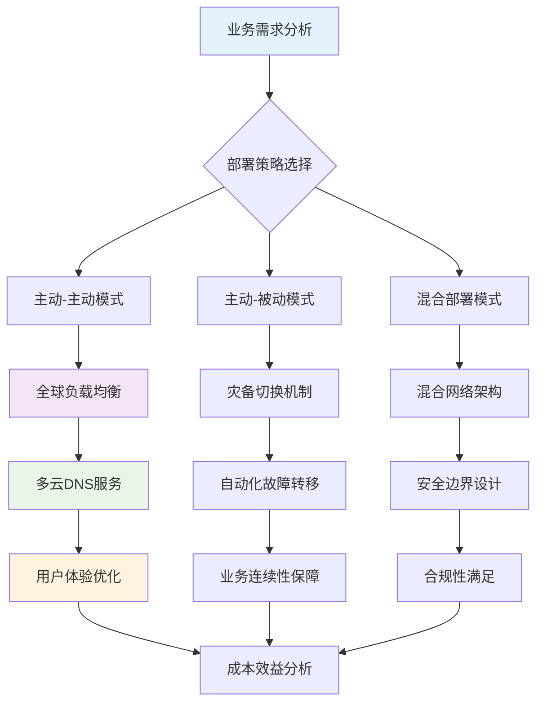

# 10 - 多云混合云运维手册

> **适用版本**: Kubernetes v1.25-v1.32 | **最后更新**: 2026-02 | **作者**: Allen Galler | **质量等级**: ⭐⭐⭐⭐⭐ 专家级

---

## 目录

- [1. 多云架构设计](#1-多云架构设计)
- [2. 成本优化策略](#2-成本优化策略)
- [3. 统一监控体系](#3-统一监控体系)
- [4. 运维自动化](#4-运维自动化)
- [5. 灾备与容灾](#5-灾备与容灾)
- [6. 多云治理框架](#6-多云治理框架)

---

## 1. 多云架构设计

### 1.1 多云部署模式

| 部署模式 | 架构特点 | 适用场景 | 优势 | 劣势 | 复杂度 |
|----------|----------|----------|------|------|--------|
| **主动-主动** | 多个云环境同时提供服务 | 全球用户、高可用要求 | 最高可用性、负载分担 | 成本最高、管理复杂 | ⭐⭐⭐⭐⭐ |
| **主动-被动** | 主云提供服务，备云待命 | 灾备场景、成本敏感 | 成本适中、灾备能力强 | 资源利用率低 | ⭐⭐⭐ |
| **混合部署** | 公有云+私有云结合 | 数据合规、混合工作负载 | 合规友好、灵活性强 | 网络复杂、运维难度大 | ⭐⭐⭐⭐ |
| **分区域部署** | 按地理区域选择最优云 | 本地化服务、延迟优化 | 用户体验佳、合规满足 | 多供应商管理 | ⭐⭐⭐ |
| **功能分离** | 不同云承担不同功能 | 专业化分工、成本优化 | 资源专业化、成本控制 | 依赖性强、集成复杂 | ⭐⭐⭐⭐ |

### 1.2 多云网络架构

| 网络模式 | 技术实现 | 性能特征 | 安全性 | 成本 | 实施复杂度 |
|----------|----------|----------|--------|------|------------|
| **VPN互联** | IPSec/OpenVPN隧道 | 中等延迟、带宽受限 | 高安全 | 低成本 | ⭐⭐ |
| **专线连接** | AWS Direct Connect、Azure ExpressRoute | 低延迟、高带宽 | 最高安全 | 高成本 | ⭐⭐⭐⭐ |
| **SD-WAN** | 软件定义广域网 | 智能路由、优化传输 | 中等安全 | 中等成本 | ⭐⭐⭐ |
| **云间对等** | VPC Peering、Private Link | 最低延迟、原生性能 | 云厂商限制 | 低成本 | ⭐⭐ |
| **服务网格** | Istio多集群、Linkerd | 应用层透明 | 高级安全 | 中等成本 | ⭐⭐⭐⭐⭐ |

### 1.3 多云架构设计原则



### 1.4 多云基础设施代码化

```yaml
# ========== Terraform多云基础设施定义 ==========
# main.tf - 多云基础设施主配置
terraform {
  required_providers {
    aws = {
      source  = "hashicorp/aws"
      version = "~> 5.0"
    }
    azurerm = {
      source  = "hashicorp/azurerm"
      version = "~> 3.0"
    }
    google = {
      source  = "hashicorp/google"
      version = "~> 5.0"
    }
  }
}

# AWS基础设施
provider "aws" {
  region = var.aws_region
  alias  = "aws_primary"
}

provider "aws" {
  region = var.aws_backup_region
  alias  = "aws_backup"
}

# Azure基础设施
provider "azurerm" {
  features {}
  alias = "azure_primary"
}

# GCP基础设施
provider "google" {
  project = var.gcp_project
  region  = var.gcp_region
  alias   = "gcp_primary"
}

# ========== 多云Kubernetes集群定义 ==========
# aws_cluster.tf
resource "aws_eks_cluster" "primary" {
  provider = aws.aws_primary
  name     = "primary-cluster"
  role_arn = aws_iam_role.eks_cluster.arn
  
  vpc_config {
    subnet_ids = aws_subnet.private[*].id
  }
  
  # 启用多云集成功能
  enabled_cluster_log_types = ["api", "audit", "authenticator", "controllerManager", "scheduler"]
  
  # 集群版本管理
  version = var.k8s_version
}

resource "aws_eks_node_group" "primary_workers" {
  provider = aws.aws_primary
  cluster_name    = aws_eks_cluster.primary.name
  node_group_name = "primary-workers"
  node_role_arn   = aws_iam_role.node.arn
  
  scaling_config {
    desired_size = 3
    max_size     = 10
    min_size     = 2
  }
  
  instance_types = ["m5.large", "m5.xlarge"]
  capacity_type  = "ON_DEMAND"
  
  # 多云标签标准化
  tags = {
    Environment    = "production"
    ClusterRole    = "primary"
    MultiCloudId   = var.multicloud_id
    CostCenter     = var.cost_center
  }
}

# azure_cluster.tf
resource "azurerm_kubernetes_cluster" "backup" {
  provider            = azurerm.azure_primary
  name                = "backup-cluster"
  location            = var.azure_location
  resource_group_name = azurerm_resource_group.backup.name
  dns_prefix          = "backup-cluster"
  
  default_node_pool {
    name       = "default"
    node_count = 3
    vm_size    = "Standard_D2_v2"
  }
  
  identity {
    type = "SystemAssigned"
  }
  
  # 网络配置
  network_profile {
    network_plugin = "azure"
    network_policy = "calico"
  }
  
  tags = {
    Environment  = "production"
    ClusterRole  = "backup"
    MultiCloudId = var.multicloud_id
    CostCenter   = var.cost_center
  }
}

# gcp_cluster.tf
resource "google_container_cluster" "disaster_recovery" {
  provider           = google.gcp_primary
  name               = "dr-cluster"
  location           = var.gcp_zone
  initial_node_count = 1
  
  # 私有集群配置
  private_cluster_config {
    enable_private_endpoint = true
    enable_private_nodes    = true
    master_ipv4_cidr_block  = "172.16.0.0/28"
  }
  
  # 安全配置
  master_auth {
    client_certificate_config {
      issue_client_certificate = false
    }
  }
  
  # 网络策略
  network_policy {
    enabled  = true
    provider = "CALICO"
  }
  
  tags = {
    Environment  = "disaster-recovery"
    ClusterRole  = "dr"
    MultiCloudId = var.multicloud_id
    CostCenter   = var.cost_center
  }
}

# ========== 多云网络互联配置 ==========
# network_connectivity.tf
resource "aws_dx_connection" "primary_dx" {
  provider      = aws.aws_primary
  name          = "primary-direct-connect"
  bandwidth     = "1Gbps"
  location      = var.dx_location
  tags = {
    Purpose = "multi-cloud-interconnect"
  }
}

resource "azurerm_express_route_circuit" "azure_er" {
  provider            = azurerm.azure_primary
  name                = "azure-express-route"
  resource_group_name = azurerm_resource_group.network.name
  location            = var.azure_location
  
  service_provider_name = "Equinix"
  peering_location      = var.er_peering_location
  bandwidth_in_mbps     = 1000
  
  sku {
    tier   = "Standard"
    family = "MeteredData"
  }
  
  tags = {
    Purpose = "multi-cloud-interconnect"
  }
}

# ========== 多云DNS配置 ==========
# dns_multicloud.tf
resource "aws_route53_zone" "multicloud_dns" {
  provider = aws.aws_primary
  name     = var.domain_name
}

resource "aws_route53_record" "primary_lb" {
  provider = aws.aws_primary
  zone_id  = aws_route53_zone.multicloud_dns.zone_id
  name     = "app.${var.domain_name}"
  type     = "A"
  
  alias {
    name                   = aws_lb.primary.dns_name
    zone_id                = aws_lb.primary.zone_id
    evaluate_target_health = true
  }
}

resource "azurerm_dns_a_record" "azure_lb" {
  provider            = azurerm.azure_primary
  name                = "app"
  zone_name           = var.domain_name
  resource_group_name = azurerm_resource_group.dns.name
  ttl                 = 300
  records             = [azurerm_public_ip.lb.ip_address]
}

# 全球负载均衡配置
resource "google_compute_global_forwarding_rule" "global_lb" {
  provider   = google.gcp_primary
  name       = "global-lb"
  target     = google_compute_target_http_proxy.default.id
  port_range = "80"
  
  # 基于延迟的智能路由
  load_balancing_scheme = "EXTERNAL"
}
```

---

## 2. 成本优化策略

### 2.1 多云成本分析维度

| 分析维度 | 关键指标 | 分析工具 | 优化策略 | 实施难度 |
|----------|----------|----------|----------|----------|
| **资源利用率** | CPU/内存使用率、GPU利用率 | CloudWatch、Stackdriver | 自动扩缩容、资源共享 | ⭐⭐ |
| **实例选择** | 实例类型性价比、预留实例 | 各云厂商定价计算器 | Spot实例、预留实例 | ⭐⭐⭐ |
| **存储成本** | 存储类型选择、生命周期管理 | 存储分析工具 | 分层存储、自动清理 | ⭐⭐ |
| **网络费用** | 数据传输成本、跨区域费用 | 网络流量监控 | 本地处理、CDN优化 | ⭐⭐⭐⭐ |
| **服务费用** | 托管服务成本、API调用费用 | 服务使用监控 | 开源自建、批量处理 | ⭐⭐⭐ |

### 2.2 成本优化最佳实践

```yaml
# ========== 多云成本优化策略 ==========
apiVersion: v1
kind: ConfigMap
metadata:
  name: cost-optimization-strategies
  namespace: platform-ops
data:
  # AWS成本优化配置
  aws-cost-optimization.yaml: |
    # Spot实例混合部署策略
    spot_instance_strategy:
      enabled: true
      spot_percentage: 70
      fallback_to_on_demand: true
      spot_price_buffer: 0.2
      
    # 预留实例规划
    reserved_instances:
      recommendation_enabled: true
      utilization_threshold: 0.7
      term_length: "1_YEAR"
      payment_option: "PARTIAL_UPFRONT"
      
    # 存储生命周期管理
    storage_lifecycle:
      ebs_volumes:
        - transition_to_gp3_after_days: 30
        - delete_after_days: 90
      s3_buckets:
        - transition_to_standard_ia_after_days: 30
        - transition_to_glacier_after_days: 90
        - delete_after_days: 365
  
  # Azure成本优化配置
  azure-cost-optimization.yaml: |
    # 虚拟机优化
    virtual_machine_optimization:
      low_priority_vms_enabled: true
      low_priority_percentage: 60
      eviction_policy: "Deallocate"
      
    # 预留容量规划
    reserved_capacity:
      recommendation_enabled: true
      utilization_threshold: 0.65
      term: "1_YEAR"
      
    # 存储优化
    storage_optimization:
      blob_storage:
        - cool_tier_after_days: 30
        - archive_tier_after_days: 180
        - delete_after_days: 730
  
  # GCP成本优化配置
  gcp-cost-optimization.yaml: |
    # 预留实例配置
    committed_use_discounts:
      enabled: true
      commitment_type: "MONTHLY"
      discount_tiers:
        - cpu: 1
          memory: 4
          discount: 0.30
        - cpu: 2
          memory: 8
          discount: 0.40
          
    # Spot实例策略
    preemptible_instances:
      enabled: true
      percentage: 50
      termination_handler: "graceful_shutdown"
      
    # 存储生命周期
    storage_lifecycle:
      standard_storage:
        - nearline_after_days: 30
        - coldline_after_days: 90
        - archive_after_days: 365

---
# ========== 成本监控和告警 ==========
apiVersion: monitoring.coreos.com/v1
kind: PrometheusRule
metadata:
  name: multicloud-cost-monitoring
  namespace: monitoring
spec:
  groups:
  - name: cost.optimization.rules
    rules:
    # 资源利用率告警
    - alert: LowResourceUtilization
      expr: |
        avg(rate(container_cpu_usage_seconds_total[1h])) by (cluster, namespace) < 0.2
      for: 24h
      labels:
        severity: warning
      annotations:
        summary: "资源利用率过低 ({{ $value }}%)"
        description: "检测到持续低资源利用率，建议优化资源配置"
        
    # 成本超标告警
    - alert: CostBudgetExceeded
      expr: |
        sum by(cluster) (rate(aws_billing_cost_estimate[1h])) > 1000
      for: 1h
      labels:
        severity: critical
      annotations:
        summary: "云服务成本超出预算"
        description: "当前小时成本估算超过1000美元阈值"
        
    # Spot实例中断风险
    - alert: SpotInstanceInterruptionRisk
      expr: |
        avg(aws_ec2_spot_instance_interruption_rate) > 0.3
      for: 30m
      labels:
        severity: warning
      annotations:
        summary: "Spot实例中断风险较高"
        description: "当前Spot实例中断概率超过30%，建议调整策略"
        
    # 存储成本异常
    - alert: StorageCostAnomaly
      expr: |
        rate(aws_s3_storage_cost[1h]) > 100
      for: 6h
      labels:
        severity: info
      annotations:
        summary: "存储成本异常增长"
        description: "S3存储成本出现异常增长趋势"
```

### 2.3 多云成本治理框架

```yaml
# ========== 多云成本治理策略 ==========
apiVersion: costmanagement.example.com/v1
kind: CostGovernancePolicy
metadata:
  name: enterprise-cost-governance
  namespace: platform-ops
spec:
  # 预算管理
  budget_management:
    monthly_budget:
      aws: 50000    # 美元
      azure: 30000
      gcp: 20000
    
    alerting:
      warning_threshold: 0.8   # 80%预算时告警
      critical_threshold: 0.95  # 95%预算时紧急告警
      overrun_action: "notify_and_restrict"
      
  # 资源配额管理
  resource_quotas:
    per_team:
      development:
        cpu_cores: 100
        memory_gb: 500
        storage_tb: 10
      production:
        cpu_cores: 500
        memory_gb: 2000
        storage_tb: 50
      testing:
        cpu_cores: 50
        memory_gb: 200
        storage_tb: 5
        
  # 自动化优化规则
  optimization_rules:
    - name: "dev-environment-hours"
      condition: "namespace startsWith 'dev-' and hour not in (9-18)"
      action: "scale_down_to_minimum"
      
    - name: "non-prod-weekend-shutdown"
      condition: "namespace not in ('prod', 'staging') and day_of_week in (6,7)"
      action: "shutdown_non_critical_resources"
      
    - name: "spot-instance-fallback"
      condition: "spot_instance_unavailable and budget_available"
      action: "switch_to_on_demand_with_notification"
      
    - name: "unused-resource-cleanup"
      condition: "resource_idle_for > 7_days"
      action: "send_warning_then_delete_after_14_days"

---
# ========== 成本分析仪表板 ==========
apiVersion: grafana.integreatly.org/v1beta1
kind: GrafanaDashboard
metadata:
  name: multicloud-cost-analytics
  namespace: monitoring
spec:
  json: |
    {
      "dashboard": {
        "title": "多云成本分析仪表板",
        "panels": [
          {
            "title": "各云平台成本分布",
            "type": "piechart",
            "targets": [
              {"expr": "sum by(provider) (cloud_cost_daily_total)", "legendFormat": "{{provider}}"}
            ]
          },
          {
            "title": "成本趋势分析",
            "type": "graph",
            "targets": [
              {"expr": "sum(cloud_cost_daily_total)", "legendFormat": "总成本"},
              {"expr": "cloud_cost_daily_total{provider=\"aws\"}", "legendFormat": "AWS"},
              {"expr": "cloud_cost_daily_total{provider=\"azure\"}", "legendFormat": "Azure"},
              {"expr": "cloud_cost_daily_total{provider=\"gcp\"}", "legendFormat": "GCP"}
            ]
          },
          {
            "title": "资源利用率vs成本",
            "type": "barchart",
            "targets": [
              {"expr": "avg by(cluster) (container_cpu_usage_seconds_total)", "legendFormat": "{{cluster}} 利用率"},
              {"expr": "sum by(cluster) (cloud_cost_daily_total)", "legendFormat": "{{cluster}} 成本"}
            ]
          },
          {
            "title": "预算执行情况",
            "type": "gauge",
            "targets": [
              {"expr": "sum(cloud_cost_monthly_total) / sum(budget_monthly_limit) * 100", "legendFormat": "预算使用率"}
            ]
          }
        ]
      }
    }
```

---

## 3. 统一监控体系

### 3.1 多云监控架构

| 监控层级 | 监控内容 | 技术方案 | 数据流向 | 实施要点 |
|----------|----------|----------|----------|----------|
| **基础设施层** | VM、容器、网络、存储 | Prometheus + Exporter | 各云厂商 → 中央Prometheus | 标准化指标格式 |
| **平台服务层** | K8s组件、中间件、数据库 | kube-state-metrics、服务Exporter | 集群内收集 → 远程写入 | 统一服务发现 |
| **应用层** | 业务指标、APM、日志 | OpenTelemetry、EFK Stack | Sidecar注入 → 中央存储 | 应用埋点标准化 |
| **用户体验层** | 前端性能、用户行为 | RUM、Synthetic Monitoring | 客户端 → 监控平台 | 真实用户监控 |
| **安全层** | 威胁检测、合规审计 | SIEM、安全事件日志 | 各组件 → 安全平台 | 统一日志格式 |

### 3.2 统一监控实施方案

```yaml
# ========== 多云统一监控架构 ==========
apiVersion: v1
kind: Namespace
metadata:
  name: unified-monitoring
  labels:
    monitoring-tier: "central"

---
# Prometheus联邦集群配置
apiVersion: monitoring.coreos.com/v1
kind: Prometheus
metadata:
  name: central-prometheus
  namespace: unified-monitoring
spec:
  serviceAccountName: prometheus
  serviceMonitorSelector:
    matchLabels:
      team: sre
  ruleSelector:
    matchLabels:
      role: alert-rules
  remoteWrite:
    # AWS监控数据接收
    - url: "https://aps-workspaces.us-east-1.amazonaws.com/workspaces/ws-12345678/api/v1/remote_write"
      writeRelabelConfigs:
        - sourceLabels: [__name__]
          regex: "(aws|eks)_.*"
          action: keep
      queueConfig:
        capacity: 10000
        maxShards: 10
        
    # Azure监控数据接收
    - url: "https://azure-monitor.azure.com/v1/api/prom/write"
      bearerTokenSecret:
        name: azure-monitor-secret
        key: token
      writeRelabelConfigs:
        - sourceLabels: [__name__]
          regex: "(azure)_.*"
          action: keep
          
    # GCP监控数据接收
    - url: "https://monitoring.googleapis.com/v3/projects/my-project/timeSeries:createService"
      bearerTokenSecret:
        name: gcp-monitoring-secret
        key: token
      writeRelabelConfigs:
        - sourceLabels: [__name__]
          regex: "(gcp)_.*"
          action: keep

---
# 多云服务发现配置
apiVersion: v1
kind: ConfigMap
metadata:
  name: multicloud-servicediscovery
  namespace: unified-monitoring
data:
  aws-sd.yaml: |
    scrape_configs:
    - job_name: 'aws-ec2-instances'
      ec2_sd_configs:
      - region: us-east-1
        access_key: YOUR_ACCESS_KEY
        secret_key: YOUR_SECRET_KEY
        port: 9100
      relabel_configs:
      - source_labels: [__meta_ec2_tag_Name]
        target_label: instance
      - source_labels: [__meta_ec2_availability_zone]
        target_label: zone
        
    - job_name: 'aws-eks-clusters'
      kubernetes_sd_configs:
      - role: node
        api_server: https://your-eks-cluster.gr7.us-east-1.eks.amazonaws.com
        tls_config:
          ca_file: /var/run/secrets/kubernetes.io/serviceaccount/ca.crt
        bearer_token_file: /var/run/secrets/kubernetes.io/serviceaccount/token
        
  azure-sd.yaml: |
    scrape_configs:
    - job_name: 'azure-vms'
      azure_sd_configs:
      - environment: AzurePublicCloud
        authentication_method: OAuth
        subscription_id: YOUR_SUBSCRIPTION_ID
        tenant_id: YOUR_TENANT_ID
        client_id: YOUR_CLIENT_ID
        client_secret: YOUR_CLIENT_SECRET
        port: 9100
        
  gcp-sd.yaml: |
    scrape_configs:
    - job_name: 'gcp-instances'
      gce_sd_configs:
      - project: your-gcp-project
        zone: us-central1-a
        port: 9100
        credentials_file: /etc/gcp/credentials.json

---
# 统一告警规则
apiVersion: monitoring.coreos.com/v1
kind: PrometheusRule
metadata:
  name: unified-alerting-rules
  namespace: unified-monitoring
spec:
  groups:
  # 跨云平台基础监控
  - name: multicloud.infrastructure.rules
    rules:
    - alert: HighCPUUsageAcrossClouds
      expr: |
        avg by(instance, provider) (
          rate(node_cpu_seconds_total{mode!="idle"}[5m])
        ) > 0.8
      for: 10m
      labels:
        severity: warning
        provider: "{{ $labels.provider }}"
      annotations:
        summary: "跨云平台CPU使用率过高 ({{ $value }}%)"
        description: "实例 {{ $labels.instance }} 在 {{ $labels.provider }} 上CPU使用率持续高于80%"
        
    - alert: MemoryPressureMulticloud
      expr: |
        (node_memory_MemAvailable_bytes / node_memory_MemTotal_bytes * 100) < 15
      for: 15m
      labels:
        severity: critical
      annotations:
        summary: "内存压力警告"
        description: "节点内存可用率低于15%，可能影响服务稳定性"
        
  # Kubernetes跨集群监控
  - name: multicloud.kubernetes.rules
    rules:
    - alert: ClusterDownMulticloud
      expr: |
        absent(up{job="kubernetes-apiservers"}) == 1
      for: 5m
      labels:
        severity: critical
      annotations:
        summary: "Kubernetes集群不可达"
        description: "检测到Kubernetes API Server无法访问"
        
    - alert: PodCrashLoopingMulticloud
      expr: |
        rate(kube_pod_container_status_restarts_total[15m]) > 0.1
      for: 10m
      labels:
        severity: warning
      annotations:
        summary: "Pod频繁重启"
        description: "Pod重启频率超过每分钟6次"
        
  # 应用层统一监控
  - name: multicloud.application.rules
    rules:
    - alert: HighErrorRateUnified
      expr: |
        sum(rate(http_requests_total{code=~"5.."}[5m])) by (app, provider) /
        sum(rate(http_requests_total[5m])) by (app, provider) > 0.05
      for: 5m
      labels:
        severity: warning
      annotations:
        summary: "应用错误率过高"
        description: "应用 {{ $labels.app }} 在 {{ $labels.provider }} 上5xx错误率超过5%"
        
    - alert: HighLatencyUnified
      expr: |
        histogram_quantile(0.95, rate(http_request_duration_seconds_bucket[5m])) > 2
      for: 10m
      labels:
        severity: warning
      annotations:
        summary: "应用响应延迟高"
        description: "95th百分位响应时间超过2秒"
```

### 3.3 统一日志架构

```yaml
# ========== 多云统一日志收集 ==========
apiVersion: v1
kind: ConfigMap
metadata:
  name: unified-logging-config
  namespace: unified-monitoring
data:
  fluentd-config.yaml: |
    # AWS CloudWatch Logs输入
    <source>
      @type cloudwatch_logs
      log_group_name /aws/containerinsights/cluster/application
      region us-east-1
      aws_access_key_id "#{ENV['AWS_ACCESS_KEY_ID']}"
      aws_secret_access_key "#{ENV['AWS_SECRET_ACCESS_KEY']}"
      <parse>
        @type json
        time_key time
        time_format %Y-%m-%dT%H:%M:%S.%NZ
      </parse>
      tag aws.*
    </source>
    
    # Azure Monitor Logs输入
    <source>
      @type azure_monitor_logs
      workspace_id "#{ENV['AZURE_WORKSPACE_ID']}"
      shared_key "#{ENV['AZURE_SHARED_KEY']}"
      <parse>
        @type json
      </parse>
      tag azure.*
    </source>
    
    # GCP Logging输入
    <source>
      @type gcp_logging
      project_id "#{ENV['GCP_PROJECT_ID']}"
      credentials_file /etc/gcp/credentials.json
      <parse>
        @type json
      </parse>
      tag gcp.*
    </source>
    
    # 统一过滤和处理
    <filter **>
      @type record_transformer
      <record>
        timestamp ${time.strftime('%Y-%m-%dT%H:%M:%S.%6N%:z')}
        cloud_provider ${tag.split('.')[0]}
        unified_timestamp ${Time.now.to_i}
      </record>
    </filter>
    
    # 输出到中央Elasticsearch
    <match **>
      @type elasticsearch
      host elasticsearch.unified-monitoring.svc.cluster.local
      port 9200
      logstash_format true
      logstash_prefix "multicloud-logs"
      <buffer>
        @type file
        path /var/log/fluentd-buffers/unified.*.buffer
        flush_mode interval
        flush_interval 10s
        retry_type exponential_backoff
      </buffer>
    </match>

---
# ========== 统一日志存储配置 ==========
apiVersion: elasticsearch.k8s.elastic.co/v1
kind: Elasticsearch
metadata:
  name: unified-elasticsearch
  namespace: unified-monitoring
spec:
  version: 8.11.0
  nodeSets:
  - name: unified-logs
    count: 3
    config:
      node.roles: ["master", "data", "ingest"]
      xpack.security.enabled: true
      xpack.security.transport.ssl.enabled: true
      indices.lifecycle.poll_interval: "10m"
      
    podTemplate:
      spec:
        containers:
        - name: elasticsearch
          resources:
            requests:
              memory: 4Gi
              cpu: 2
            limits:
              memory: 8Gi
              cpu: 4
              
    volumeClaimTemplates:
    - metadata:
        name: elasticsearch-data
      spec:
        accessModes:
        - ReadWriteOnce
        resources:
          requests:
            storage: 1Ti
        storageClassName: fast-ssd

---
# ========== Kibana统一可视化 ==========
apiVersion: kibana.k8s.elastic.co/v1
kind: Kibana
metadata:
  name: unified-kibana
  namespace: unified-monitoring
spec:
  version: 8.11.0
  count: 1
  elasticsearchRef:
    name: unified-elasticsearch
  config:
    server.publicBaseUrl: "https://kibana.example.com"
    telemetry.optIn: false
    securitySolution:
      enabled: true
      
  http:
    service:
      spec:
        type: LoadBalancer
        annotations:
          service.beta.kubernetes.io/aws-load-balancer-type: "nlb"
          cloud.google.com/load-balancer-type: "External"
          service.beta.kubernetes.io/azure-load-balancer-internal: "false"
```

---

## 4. 运维自动化

### 4.1 多云GitOps流水线

```yaml
# ========== 多云GitOps架构 ==========
apiVersion: argoproj.io/v1alpha1
kind: ApplicationSet
metadata:
  name: multicloud-applications
  namespace: argocd
spec:
  generators:
  # 基于集群标签的生成器
  - clusters:
      selector:
        matchLabels:
          environment: production
          
  # 基于Git目录结构的生成器
  - git:
      repoURL: https://github.com/company/multicloud-manifests.git
      revision: HEAD
      directories:
      - path: apps/*/overlays/*
      
  template:
    metadata:
      name: '{{name}}-{{path.basename}}'
    spec:
      project: multicloud
      source:
        repoURL: https://github.com/company/multicloud-manifests.git
        targetRevision: HEAD
        path: '{{path}}'
        
      destination:
        server: '{{server}}'
        namespace: '{{path.basename}}'
        
      syncPolicy:
        automated:
          prune: true
          selfHeal: true
        syncOptions:
        - CreateNamespace=true
        - PruneLast=true
        - ApplyOutOfSyncOnly=true
        
      ignoreDifferences:
      - group: apps
        kind: Deployment
        jsonPointers:
        - /spec/replicas
        
---
# ========== 多云CI/CD流水线 ==========
apiVersion: tekton.dev/v1beta1
kind: Pipeline
metadata:
  name: multicloud-deployment-pipeline
spec:
  workspaces:
  - name: shared-workspace
  params:
  - name: git-url
  - name: git-revision
  - name: app-name
  - name: target-environments
  
  tasks:
  # 代码检出
  - name: fetch-repository
    taskRef:
      name: git-clone
    workspaces:
    - name: output
      workspace: shared-workspace
    params:
    - name: url
      value: $(params.git-url)
    - name: revision
      value: $(params.git-revision)
      
  # 构建和测试
  - name: build-and-test
    taskRef:
      name: kaniko-build
    runAfter: ["fetch-repository"]
    workspaces:
    - name: source
      workspace: shared-workspace
    params:
    - name: IMAGE
      value: "registry.example.com/$(params.app-name):$(params.git-revision)"
      
  # 多云安全扫描
  - name: multicloud-security-scan
    taskRef:
      name: trivy-multicloud-scan
    runAfter: ["build-and-test"]
    workspaces:
    - name: source
      workspace: shared-workspace
    params:
    - name: IMAGE
      value: "registry.example.com/$(params.app-name):$(params.git-revision)"
    - name: TARGET_CLOUDS
      value: "aws,azure,gcp"
      
  # 多云部署
  - name: deploy-to-clouds
    taskRef:
      name: argocd-multicloud-deploy
    runAfter: ["multicloud-security-scan"]
    workspaces:
    - name: source
      workspace: shared-workspace
    params:
    - name: APP_NAME
      value: $(params.app-name)
    - name: TARGET_ENVIRONMENTS
      value: $(params.target-environments)
    - name: GIT_REVISION
      value: $(params.git-revision)
      
  # 跨云集成测试
  - name: multicloud-integration-test
    taskRef:
      name: multicloud-smoke-test
    runAfter: ["deploy-to-clouds"]
    workspaces:
    - name: source
      workspace: shared-workspace
    params:
    - name: APP_NAME
      value: $(params.app-name)
    - name: TARGET_ENVIRONMENTS
      value: $(params.target-environments)

---
# ========== 多云自动化运维 ==========
apiVersion: batch/v1
kind: CronJob
metadata:
  name: multicloud-automation
  namespace: platform-ops
spec:
  schedule: "*/30 * * * *"  # 每30分钟执行
  jobTemplate:
    spec:
      template:
        spec:
          serviceAccountName: multicloud-operator
          containers:
          - name: automation-runner
            image: platform/multicloud-automation:latest
            env:
            - name: AWS_ACCESS_KEY_ID
              valueFrom:
                secretKeyRef:
                  name: aws-credentials
                  key: access-key-id
            - name: AWS_SECRET_ACCESS_KEY
              valueFrom:
                secretKeyRef:
                  name: aws-credentials
                  key: secret-access-key
            - name: AZURE_CLIENT_ID
              valueFrom:
                secretKeyRef:
                  name: azure-credentials
                  key: client-id
            - name: AZURE_CLIENT_SECRET
              valueFrom:
                secretKeyRef:
                  name: azure-credentials
                  key: client-secret
            - name: GCP_SERVICE_ACCOUNT_KEY
              valueFrom:
                secretKeyRef:
                  name: gcp-credentials
                  key: service-account-key
            command:
            - /bin/sh
            - -c
            - |
              #!/bin/bash
              set -euo pipefail
              
              echo "开始多云自动化运维任务..."
              
              # 1. 资源健康检查
              echo "执行跨云资源健康检查..."
              python3 /scripts/health-check.py --clouds aws,azure,gcp
              
              # 2. 成本优化建议
              echo "生成成本优化建议..."
              python3 /scripts/cost-optimizer.py --analyze-current-usage
              
              # 3. 安全合规扫描
              echo "执行安全合规扫描..."
              python3 /scripts/security-scanner.py --all-clouds
              
              # 4. 自动修复常见问题
              echo "执行自动修复..."
              python3 /scripts/auto-remediation.py --fix-common-issues
              
              # 5. 生成运维报告
              echo "生成运维报告..."
              REPORT_TIME=$(date -I)
              cat > /reports/multicloud-ops-report-${REPORT_TIME}.md <<EOF
              # 多云运维自动化报告
              
              ## 执行时间
              ${REPORT_TIME}
              
              ## 健康检查结果
              $(cat /tmp/health-check-results.txt)
              
              ## 成本优化建议
              $(cat /tmp/cost-optimization-recommendations.txt)
              
              ## 安全扫描发现
              $(cat /tmp/security-findings.txt)
              
              ## 自动修复记录
              $(cat /tmp/remediation-actions.txt)
              EOF
              
              echo "多云自动化运维任务完成"
          restartPolicy: OnFailure
```

---

## 5. 灾备与容灾

### 5.1 多云灾备策略

| 灾备模式 | RTO目标 | RPO目标 | 实施复杂度 | 成本考虑 | 适用场景 |
|----------|---------|---------|------------|----------|----------|
| **热备模式** | < 5分钟 | < 1分钟 | ⭐⭐⭐⭐⭐ | 最高 | 金融、电商核心业务 |
| **温备模式** | < 30分钟 | < 15分钟 | ⭐⭐⭐⭐ | 中高 | 重要业务系统 |
| **冷备模式** | < 4小时 | < 1小时 | ⭐⭐⭐ | 中低 | 一般业务系统 |
| **混合模式** | 分层设定 | 分层设定 | ⭐⭐⭐⭐ | 中等 | 分层业务架构 |
| **多地多活** | < 1分钟 | < 1分钟 | ⭐⭐⭐⭐⭐ | 最高 | 全球化服务 |

### 5.2 灾备自动化实施

```yaml
# ========== 多云灾备配置 ==========
apiVersion: v1
kind: ConfigMap
metadata:
  name: disaster-recovery-config
  namespace: platform-ops
data:
  dr-strategy.yaml: |
    # 灾备策略定义
    disaster_recovery:
      primary_region: "us-east-1"
      backup_regions:
        - "us-west-2"
        - "eu-west-1"
        - "ap-southeast-1"
      
      failover_triggers:
        - health_check_failure_count: 3
        - api_server_unreachable_duration: "5m"
        - etcd_quorum_lost: true
        - critical_service_unavailable: true
        
      failback_conditions:
        - primary_site_stable_duration: "1h"
        - data_consistency_verified: true
        - service_performance_restored: true
        
      testing_schedule: "0 2 * * 0"  # 每周日凌晨2点

---
# ========== 自动故障检测和切换 ==========
apiVersion: apps/v1
kind: Deployment
metadata:
  name: dr-orchestrator
  namespace: platform-ops
spec:
  replicas: 2
  selector:
    matchLabels:
      app: dr-orchestrator
  template:
    metadata:
      labels:
        app: dr-orchestrator
    spec:
      serviceAccountName: dr-operator
      containers:
      - name: orchestrator
        image: platform/dr-orchestrator:latest
        env:
        - name: PRIMARY_CLUSTER_ENDPOINT
          value: "https://primary-cluster-api.example.com"
        - name: BACKUP_CLUSTER_ENDPOINTS
          value: "https://backup1.example.com,https://backup2.example.com"
        - name: HEALTH_CHECK_INTERVAL
          value: "30s"
        - name: FAILOVER_THRESHOLD
          value: "3"
        ports:
        - containerPort: 8080
        readinessProbe:
          httpGet:
            path: /health
            port: 8080
          initialDelaySeconds: 30
          periodSeconds: 10
        livenessProbe:
          httpGet:
            path: /health
            port: 8080
          initialDelaySeconds: 60
          periodSeconds: 30

---
# ========== 数据同步和备份策略 ==========
apiVersion: batch/v1
kind: CronJob
metadata:
  name: cross-cloud-backup
  namespace: platform-ops
spec:
  schedule: "0 */6 * * *"  # 每6小时执行
  jobTemplate:
    spec:
      template:
        spec:
          serviceAccountName: backup-operator
          containers:
          - name: backup-runner
            image: platform/backup-tools:latest
            env:
            - name: AWS_BUCKET
              value: "company-backups-primary"
            - name: AZURE_CONTAINER
              value: "company-backups-secondary"
            - name: GCP_BUCKET
              value: "company-backups-tertiary"
            command:
            - /bin/sh
            - -c
            - |
              #!/bin/bash
              set -euo pipefail
              
              echo "开始跨云备份任务..."
              
              # 1. etcd备份
              echo "执行etcd备份..."
              etcdctl snapshot save /tmp/etcd-snapshot.db \
                --endpoints=https://etcd-client:2379 \
                --cert=/etc/etcd/ssl/etcd.pem \
                --key=/etc/etcd/ssl/etcd-key.pem \
                --cacert=/etc/etcd/ssl/ca.pem
              
              # 2. 应用数据备份
              echo "执行应用数据备份..."
              velero backup create multicloud-backup-$(date +%Y%m%d-%H%M%S) \
                --include-namespaces production,staging \
                --exclude-resources events,replicasets,pods \
                --snapshot-volumes \
                --ttl 168h0m0s
              
              # 3. 跨云存储同步
              echo "同步备份到各云存储..."
              
              # AWS S3同步
              aws s3 sync /backups s3://${AWS_BUCKET}/backups/$(date +%Y/%m/%d)/
              
              # Azure Blob同步
              az storage blob upload-batch \
                --destination ${AZURE_CONTAINER} \
                --source /backups \
                --destination-path backups/$(date +%Y/%m/%d)/
              
              # GCP Storage同步
              gsutil -m rsync -r /backups gs://${GCP_BUCKET}/backups/$(date +%Y/%m/%d)/
              
              # 4. 验证备份完整性
              echo "验证备份完整性..."
              BACKUP_SIZE=$(du -sh /backups | cut -f1)
              echo "备份总大小: ${BACKUP_SIZE}"
              
              # 5. 清理旧备份
              echo "清理7天前的旧备份..."
              find /backups -type f -mtime +7 -delete
              
              echo "跨云备份任务完成"
          restartPolicy: OnFailure

---
# ========== 灾备演练自动化 ==========
apiVersion: batch/v1
kind: CronJob
metadata:
  name: dr-drill-automation
  namespace: platform-ops
spec:
  schedule: "0 2 * * 0"  # 每周日凌晨2点
  jobTemplate:
    spec:
      template:
        spec:
          serviceAccountName: dr-tester
          containers:
          - name: drill-runner
            image: platform/dr-testing:latest
            command:
            - /bin/sh
            - -c
            - |
              #!/bin/bash
              set -euo pipefail
              
              echo "开始灾备演练..."
              
              # 1. 前置检查
              echo "执行前置健康检查..."
              python3 /scripts/pre-drill-check.py --validate-environment
              
              # 2. 故障模拟
              echo "模拟故障场景..."
              python3 /scripts/fault-injector.py --scenario network-partition --duration 300
              
              # 3. 故障检测验证
              echo "验证故障检测机制..."
              python3 /scripts/detection-verifier.py --expected-trigger-time 60
              
              # 4. 自动故障切换
              echo "执行自动故障切换..."
              python3 /scripts/failover-orchestrator.py --simulate-failover
              
              # 5. 服务恢复验证
              echo "验证服务恢复..."
              python3 /scripts/recovery-validator.py --check-service-availability
              
              # 6. 数据一致性检查
              echo "执行数据一致性检查..."
              python3 /scripts/data-consistency-check.py --compare-primary-backup
              
              # 7. 故障恢复
              echo "执行故障恢复..."
              python3 /scripts/fault-recovery.py --restore-primary-site
              
              # 8. 生成演练报告
              echo "生成演练报告..."
              python3 /scripts/drill-report-generator.py --output-format markdown
              
              echo "灾备演练完成"
          restartPolicy: OnFailure
```

---

## 6. 多云治理框架

### 6.1 多云治理原则

| 治理维度 | 核心原则 | 实施要点 | 治理工具 | 合规要求 |
|----------|----------|----------|----------|----------|
| **统一身份** | 单点登录、统一认证 | SSO集成、RBAC统一 | Keycloak、AAD | SOC2、ISO27001 |
| **资源管理** | 标准化命名、标签治理 | 命名规范、成本标签 | Terraform、Crossplane | 内部治理要求 |
| **安全合规** | 策略统一、审计集中 | 策略引擎、合规扫描 | OPA、Falco | 等保、GDPR |
| **成本控制** | 预算管理、成本分摊 | 预算告警、成本分析 | Kubecost、CloudHealth | 财务管控要求 |
| **变更管理** | 流程标准化、审批自动化 | GitOps、变更窗口 | ArgoCD、Spinnaker | 变更管理流程 |

### 6.2 多云治理实施

```yaml
# ========== 多云治理策略 ==========
apiVersion: governance.example.com/v1
kind: MulticloudGovernancePolicy
metadata:
  name: enterprise-governance
  namespace: platform-governance
spec:
  # 统一身份认证
  identity_management:
    sso_provider: "keycloak"
    identity_federation:
      enabled: true
      providers:
        - name: "aws-sso"
          type: "saml"
          metadata_url: "https://sso.us-east-1.amazonaws.com/idp/metadata"
        - name: "azure-ad"
          type: "oidc"
          issuer_url: "https://login.microsoftonline.com/common/v2.0"
        - name: "gcp-identity"
          type: "oidc"
          issuer_url: "https://accounts.google.com"
    
    role_mapping:
      admin_role: "platform-admin"
      developer_role: "app-developer"
      auditor_role: "security-auditor"
      
  # 资源命名和标签规范
  resource_governance:
    naming_standards:
      cluster_pattern: "{environment}-{purpose}-{region}-{sequence}"
      namespace_pattern: "{team}-{application}-{environment}"
      resource_pattern: "{application}-{component}-{environment}"
      
    tagging_requirements:
      mandatory_tags:
        - "Environment"
        - "Team"
        - "CostCenter"
        - "Owner"
        - "ComplianceLevel"
      recommended_tags:
        - "Project"
        - "BusinessUnit"
        - "CreateDate"
        
  # 安全策略统一
  security_policies:
    cluster_hardening:
      pod_security_standards: "restricted"
      network_policies_required: true
      image_scanning_mandatory: true
      
    data_protection:
      encryption_at_rest: true
      encryption_in_transit: true
      data_classification_required: true
      
    compliance_frameworks:
      - name: "soc2-type2"
        controls:
          - "access-logging"
          - "change-management"
          - "incident-response"
      - name: "iso27001"
        controls:
          - "asset-management"
          - "access-control"
          - "cryptography"

---
# ========== 治理监控和报告 ==========
apiVersion: monitoring.coreos.com/v1
kind: PrometheusRule
metadata:
  name: governance-compliance-rules
  namespace: platform-governance
spec:
  groups:
  - name: governance.compliance.rules
    rules:
    # 资源标签合规检查
    - alert: MissingMandatoryTags
      expr: |
        count by(namespace, resource) (
          kube_resource_labels{label_environment="", label_team="", label_costcenter=""}
        ) > 0
      for: 1h
      labels:
        severity: warning
      annotations:
        summary: "资源缺少强制标签"
        description: "检测到资源缺少Environment、Team或CostCenter标签"
        
    # 安全策略合规检查
    - alert: SecurityPolicyViolation
      expr: |
        count(opa_policy_violations_total{severity="high"}) > 0
      for: 30m
      labels:
        severity: critical
      annotations:
        summary: "安全策略违规"
        description: "检测到高严重性安全策略违规"
        
    # 成本治理检查
    - alert: BudgetGovernanceViolation
      expr: |
        sum by(team) (rate(cloud_cost_hourly_total[1h])) > 
        on(team) group_left budget_hourly_limit
      for: 1h
      labels:
        severity: critical
      annotations:
        summary: "预算治理违规"
        description: "团队 {{ $labels.team }} 的小时成本超出预算限制"

---
# ========== 治理仪表板 ==========
apiVersion: grafana.integreatly.org/v1beta1
kind: GrafanaDashboard
metadata:
  name: multicloud-governance-dashboard
  namespace: platform-governance
spec:
  json: |
    {
      "dashboard": {
        "title": "多云治理仪表板",
        "panels": [
          {
            "title": "治理合规状态",
            "type": "stat",
            "targets": [
              {"expr": "governance_compliance_score", "legendFormat": "整体合规评分"},
              {"expr": "count(governance_policy_violations_total)", "legendFormat": "违规项数量"}
            ]
          },
          {
            "title": "各维度合规率",
            "type": "barchart",
            "targets": [
              {"expr": "governance_dimension_compliance{dimension=\"identity\"}", "legendFormat": "身份治理"},
              {"expr": "governance_dimension_compliance{dimension=\"security\"}", "legendFormat": "安全治理"},
              {"expr": "governance_dimension_compliance{dimension=\"cost\"}", "legendFormat": "成本治理"},
              {"expr": "governance_dimension_compliance{dimension=\"resource\"}", "legendFormat": "资源治理"}
            ]
          },
          {
            "title": "违规趋势分析",
            "type": "graph",
            "targets": [
              {"expr": "increase(governance_policy_violations_total[1h])", "legendFormat": "每小时新增违规"}
            ]
          },
          {
            "title": "治理成本分析",
            "type": "table",
            "targets": [
              {
                "expr": "sum by(team) (cloud_cost_monthly_total)",
                "format": "table"
              }
            ]
          }
        ]
      }
    }
```

---

**表格底部标记**: Kusheet Project | 作者: Allen Galler (allengaller@gmail.com) | 最后更新: 2026-02 | 版本: v1.25-v1.32 | 质量等级: ⭐⭐⭐⭐⭐ 专家级