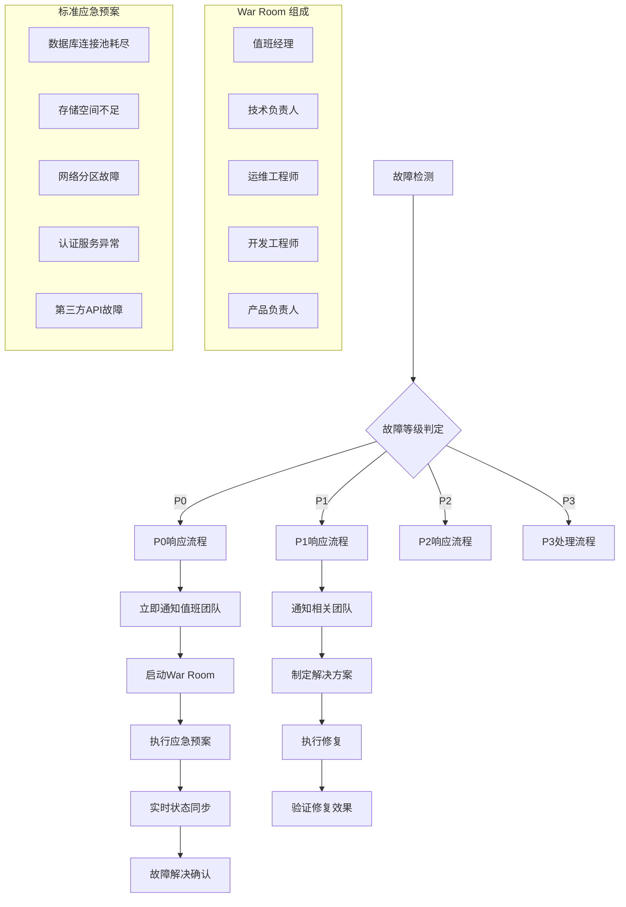
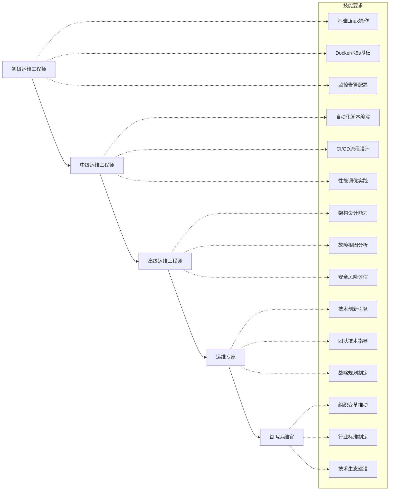
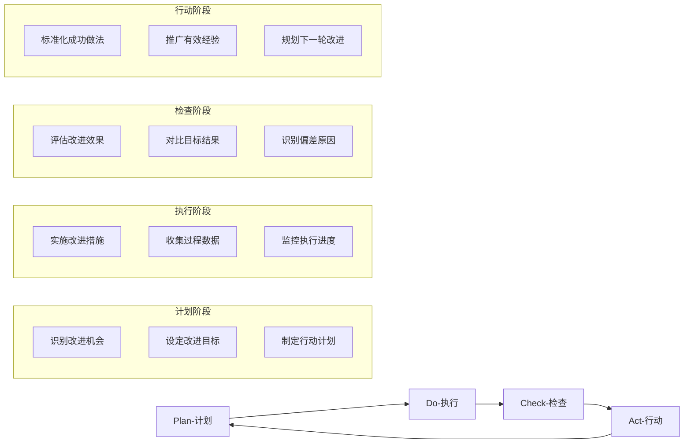

# 企业级运维最佳实践

> **目标**: 构建万级节点规模的企业级Kubernetes运维体系，实现高可用、高性能、高安全的生产环境运维

---

## 知识地图

| 属性 | 说明 |
|------|------|
| **文件角色** | 企业级运维最佳实践 — 万级节点规模K8s集群的运维指南 |
| **适合读者** | 中小团队运维→大规模集群管理→企业平台工程 |
| **前置知识** | 01(运维实践基础)、04(SRE成熟度) |
| **关联文件** | 01(基础运维)、04(SRE)、12(事故管理)、14(变更管理) |

---

## 🏢 大规模集群管理

> **🔰 初学者导读**: 当集群从几十个节点增长到数千个节点时，管理方式必须改变。就像从管理一个小店铺到管理连锁超市，需要标准化流程、自动化工具和分层管理架构。

### 万级节点运维架构

#### 集群分层管理策略
```yaml
# 大规模集群分层架构
apiVersion: v1
kind: ConfigMap
metadata:
  name: cluster-tier-config
data:
  # 核心层 - 控制平面
  control-plane:
    node-count: "300"
    instance-type: "c6i.4xlarge"
    redundancy: "3 AZ"
    monitoring-interval: "1s"
  
  # 数据层 - 存储节点
  data-layer:
    node-count: "2000"
    instance-type: "i4i.4xlarge"
    storage-type: "local NVMe"
    replication-factor: "3"
  
  # 计算层 - 工作节点
  compute-layer:
    node-count: "8000"
    instance-type: "c6i.2xlarge"
    autoscaling: "enabled"
    spot-ratio: "70%"
  
  # 边缘层 - 边缘计算
  edge-layer:
    node-count: "500"
    instance-type: "t3.medium"
    latency-target: "<10ms"
    offline-tolerance: "24h"
```

**🔰 初学者理解**
集群分片就像连锁超市的分区管理——生鲜区、百货区、电器区各自独立运营，互不干扰。核心思想：**将大集群按功能/地域拆分成多个小集群，降低复杂度**。

**🔧 工作原理**
- **功能分片**: 核心业务集群/测试集群/边缘计算集群各自独立
- **地域分片**: 北美/欧洲/亚洲数据中心各维护独立集群
- **团队分片**: 不同业务团队拥有独立集群，避免资源抢占
- **统一管理**: 通过Federation/Hub模式实现跨集群统一配置和监控
- **故障隔离**: 单个分片故障不影响其他分片，爆炸半径可控

**📝 最小示例**
```yaml
# 使用 Cluster API 创建分片集群
apiVersion: cluster.x-k8s.io/v1beta1
kind: Cluster
metadata:
  name: shard-us-production
  labels:
    region: us-east-1
    env: production
spec:
  clusterNetwork:
    pods:
      cidrBlocks: ["10.100.0.0/16"]
    services:
      cidrBlocks: ["10.200.0.0/16"]
  controlPlaneRef:
    apiVersion: controlplane.cluster.x-k8s.io/v1beta1
    kind: KubeadmControlPlane
    name: shard-us-control-plane
---
# 跨集群服务发现配置
apiVersion: v1
kind: Service
metadata:
  name: cross-cluster-service
  annotations:
    # Submariner 跨集群服务发现
    submariner.io/globalnet: "true"
spec:
  type: ClusterIP
  ports:
  - port: 80
    targetPort: 8080
```

**⚠️ 常见误区**
1. ❌ **误区**: 把所有业务塞在一个超大集群里——"一个集群管理所有"
   ✅ **正确**: 10000节点应拆分为10个1000节点集群，降低管理复杂度和故障影响范围
   
2. ❌ **误区**: 分片后完全独立，没有统一管理——"各自为政"
   ✅ **正确**: 使用Federation/Fleet Manager实现统一配置分发、监控聚合、策略管理
   
3. ❌ **误区**: 按照技术架构分片(如按Layer分)——"控制面一个集群，数据面一个集群"
   ✅ **正确**: 应按业务域/地域/环境分片，每个分片都是完整的K8s集群(包含控制面和数据面)

#### 性能调优黄金配置
```bash
#!/bin/bash
# 万级节点性能调优脚本

# 内核参数优化
cat > /etc/sysctl.d/99-k8s-performance.conf << EOF
# 网络性能优化
net.core.rmem_max = 134217728
net.core.wmem_max = 134217728
net.ipv4.tcp_rmem = 4096 87380 134217728
net.ipv4.tcp_wmem = 4096 65536 134217728
net.ipv4.tcp_congestion_control = bbr

# 文件系统优化
fs.file-max = 2097152
fs.inotify.max_user_watches = 1048576
fs.inotify.max_user_instances = 8192

# 内存管理优化
vm.swappiness = 1
vm.dirty_ratio = 15
vm.dirty_background_ratio = 5
EOF

# kubelet 参数优化
cat > /etc/default/kubelet << EOF
KUBELET_EXTRA_ARGS="--max-pods=250 \
  --kube-api-qps=100 \
  --kube-api-burst=200 \
  --serialize-image-pulls=false \
  --eviction-hard=memory.available<500Mi,nodefs.available<10% \
  --eviction-soft=memory.available<1Gi,nodefs.available<15% \
  --eviction-soft-grace-period=memory.available=1m30s,nodefs.available=1m30s"
EOF
```

### 多集群联邦管理

#### Cluster API 大规模部署
```yaml
# 多集群联邦管理配置
apiVersion: cluster.x-k8s.io/v1beta1
kind: Cluster
metadata:
  name: enterprise-federation
spec:
  # 主集群配置
  controlPlaneRef:
    apiVersion: controlplane.cluster.x-k8s.io/v1beta1
    kind: KubeadmControlPlane
    name: main-control-plane
  infrastructureRef:
    apiVersion: infrastructure.cluster.x-k8s.io/v1beta1
    kind: AWSCluster
    name: main-infrastructure
  
---
apiVersion: addons.cluster.x-k8s.io/v1alpha1
kind: ClusterResourceSet
metadata:
  name: enterprise-addons
spec:
  clusterSelector:
    matchLabels:
      cluster-type: production
  resources:
  - name: monitoring-stack
    kind: ConfigMap
  - name: security-policies
    kind: Secret
  - name: backup-configuration
    kind: ConfigMap
```

**🔰 初学者理解**
自动化巡检就像工厂的质检流水线——每个产品都要经过标准化检测，发现问题自动报警。核心思想：**用机器代替人工，自动发现隐患**。

**🔧 工作原理**
- **定时扫描**: CronJob定时执行健康检查脚本，覆盖节点/Pod/网络/存储
- **多维度检测**: CPU/内存/磁盘使用率、证书有效期、API响应时间、日志错误率
- **智能告警**: 不是所有异常都告警，需要基于阈值/趋势/业务影响度判断
- **自动修复**: 发现常见问题(如磁盘清理、Pod重启)可触发自动化修复流程
- **巡检报告**: 生成每日/每周巡检报告，追踪问题修复进度

**📝 最小示例**
```yaml
# 集群健康巡检 CronJob
apiVersion: batch/v1
kind: CronJob
metadata:
  name: cluster-health-check
  namespace: ops-system
spec:
  schedule: "*/10 * * * *"  # 每10分钟执行
  jobTemplate:
    spec:
      template:
        spec:
          serviceAccountName: cluster-inspector
          containers:
          - name: inspector
            image: kudig/cluster-inspector:v2.0
            env:
            - name: CHECK_ITEMS
              value: "nodes,pods,pv,certificates,etcd"
            - name: ALERT_WEBHOOK
              value: "https://alert.company.com/webhook"
            command:
            - /bin/bash
            - -c
            - |
              #!/bin/bash
              # 节点健康检查
              kubectl get nodes -o json | jq '.items[] | select(.status.conditions[] | select(.type=="Ready" and .status!="True")) | .metadata.name'
              
              # 证书有效期检查(警告<30天)
              for cert in /etc/kubernetes/pki/*.crt; do
                expiry=$(openssl x509 -in $cert -noout -enddate | cut -d= -f2)
                echo "证书 $cert 过期时间: $expiry"
              done
              
              # etcd 性能检查
              ETCDCTL_API=3 etcdctl --endpoints=https://127.0.0.1:2379 \
                --cert=/etc/kubernetes/pki/etcd/server.crt \
                --key=/etc/kubernetes/pki/etcd/server.key \
                --cacert=/etc/kubernetes/pki/etcd/ca.crt \
                check perf
              
              # Pod异常检查
              kubectl get pods -A --field-selector=status.phase!=Running,status.phase!=Succeeded
          restartPolicy: OnFailure
---
# 巡检结果告警 PrometheusRule
apiVersion: monitoring.coreos.com/v1
kind: PrometheusRule
metadata:
  name: inspection-alerts
spec:
  groups:
  - name: cluster-health
    interval: 30s
    rules:
    - alert: NodeNotReady
      expr: kube_node_status_condition{condition="Ready",status="true"} == 0
      for: 5m
      labels:
        severity: critical
      annotations:
        summary: "节点 {{ $labels.node }} 不可用"
        
    - alert: CertificateExpiringSoon
      expr: (apiserver_client_certificate_expiration_seconds_count > 0) and (time() + 30*24*3600 > apiserver_client_certificate_expiration_seconds_bucket)
      for: 1h
      labels:
        severity: warning
      annotations:
        summary: "证书将在30天内过期"
```

**⚠️ 常见误区**
1. ❌ **误区**: 只检查"当前是否正常"，不看趋势——"磁盘还有10GB，没问题"
   ✅ **正确**: 监控增长趋势，磁盘每天增长2GB，5天后就满了，需要提前告警
   
2. ❌ **误区**: 巡检发现问题就发告警，所有人都被骚扰——"狼来了效应"
   ✅ **正确**: 告警分级(P0立即处理/P1工作时间/P2邮件通知)，根据影响面和紧急度路由
   
3. ❌ **误区**: 巡检脚本跑在master节点上——"控制面故障时巡检也停了"
   ✅ **正确**: 巡检系统应部署在独立的监控集群或外部服务器上，确保集群故障时仍能监控

## 🚀 变更管理与发布策略

> **🔰 初学者导读**: 在企业环境中，每次变更都可能影响成千上万的用户。变更管理就像航空管制——每次"起飞"都需要审批、检查和跟踪。金融、医疗等行业还需满足合规要求。

### 渐进式交付流水线

#### 蓝绿部署架构
```yaml
# 蓝绿部署策略配置
apiVersion: argoproj.io/v1alpha1
kind: Application
metadata:
  name: enterprise-blue-green
spec:
  source:
    repoURL: https://github.com/enterprise/apps.git
    targetRevision: HEAD
    path: production/
  destination:
    server: https://kubernetes.default.svc
    namespace: production
    
  strategy:
    blueGreen:
      activeService: production-service
      previewService: preview-service
      autoPromotionEnabled: false
      autoPromotionSeconds: 300
      
      # 渐进式流量切换
      trafficRouting:
        smi:
          trafficSplitName: production-split
          rootService: production-root
          
---
# 流量分割配置
apiVersion: split.smi-spec.io/v1alpha2
kind: TrafficSplit
metadata:
  name: production-split
spec:
  service: production-root
  backends:
  - service: production-blue
    weight: 90  # 主要流量
  - service: production-green
    weight: 10  # 新版本流量
```

#### 金丝雀发布策略
```yaml
# 智能金丝雀发布
apiVersion: flagger.app/v1beta1
kind: Canary
metadata:
  name: enterprise-canary
spec:
  targetRef:
    apiVersion: apps/v1
    kind: Deployment
    name: enterprise-app
    
  service:
    port: 80
    targetPort: 8080
    portName: http
    
  analysis:
    interval: 1m
    threshold: 5
    maxWeight: 100
    stepWeight: 10
    stepWeights: [1, 5, 10, 25, 50, 75, 100]
    
    # 多维度指标检查
    metrics:
    - name: request-success-rate
      interval: 1m
      thresholdRange:
        min: 99
      provider:
        type: prometheus
        address: http://prometheus:9090
        
    - name: request-duration
      interval: 1m
      thresholdRange:
        max: 500
      provider:
        type: prometheus
        address: http://prometheus:9090
        
    # 业务指标监控
    - name: business-transaction-success
      interval: 1m
      thresholdRange:
        min: 99.5
      provider:
        type: datadog
        query: avg:kubernetes_state.container.restarts{service:enterprise} < 1
        
    # 用户体验指标
    - name: frontend-load-time
      interval: 1m
      thresholdRange:
        max: 2000
      provider:
        type: newrelic
        query: SELECT average(duration) FROM PageView WHERE appName = 'enterprise'
```

**🔰 初学者理解**
变更窗口就像高速公路的施工时间段——只能在凌晨2-5点维护，白天不能影响通行。核心思想：**在业务低峰期执行高风险变更**。

**🔧 工作原理**
- **时间分级**: 低风险变更(配置更新)随时可做，高风险(数据库升级)只能在窗口期
- **业务对齐**: 根据业务特点定义窗口，电商避开618/双11，金融避开月末结算
- **审批流程**: 变更需提前3天申请，包含回滚预案、影响评估、测试报告
- **冻结期管理**: 重大活动前1周进入变更冻结，只允许P0级别修复
- **例外处理**: 紧急安全漏洞修复可走应急流程，事后补充变更记录

**📝 最小示例**
```yaml
# 变更窗口配置 (存储在 ConfigMap)
apiVersion: v1
kind: ConfigMap
metadata:
  name: change-windows
  namespace: ops-system
data:
  # 标准变更窗口
  standard-windows: |
    - name: "weekly-maintenance"
      schedule: "0 2 * * 0"  # 每周日凌晨2点
      duration: "3h"
      allowed-change-types: ["infrastructure", "database", "network"]
      
    - name: "daily-deployment"
      schedule: "0 22 * * 1-5"  # 工作日晚10点
      duration: "1h"
      allowed-change-types: ["application", "configuration"]
  
  # 变更冻结期
  freeze-periods: |
    - name: "Q4-shopping-festival"
      start: "2024-11-01"
      end: "2024-11-12"
      reason: "双11大促"
      emergency-only: true
      
    - name: "year-end-close"
      start: "2024-12-28"
      end: "2025-01-03"
      reason: "年度结算"
      emergency-only: true

---
# 变更审批 CR (自定义资源)
apiVersion: ops.company.com/v1
kind: ChangeRequest
metadata:
  name: cr-2024-001
spec:
  title: "升级生产环境 Kubernetes 到 v1.30"
  change-type: "infrastructure"
  risk-level: "high"
  
  schedule:
    planned-start: "2024-03-17T02:00:00Z"
    planned-end: "2024-03-17T05:00:00Z"
    window: "weekly-maintenance"
  
  impact:
    affected-services: ["all"]
    expected-downtime: "30min"
    user-impact: "API 短暂不可用"
  
  rollback-plan: |
    1. 如果升级失败，回退到 v1.29.2
    2. 恢复 etcd 快照
    3. 预估回滚时间: 20分钟
  
  approval:
    required-approvers: ["ops-lead", "cto"]
    status: "pending"
```

**⚠️ 常见误区**
1. ❌ **误区**: 所有变更都要走变更窗口——"改个配置也要等到周日凌晨"
   ✅ **正确**: 区分高/中/低风险变更，低风险(只读配置、日志级别)可随时变更，高风险才需要窗口
   
2. ❌ **误区**: 变更窗口内可以"随便改"——"反正是维护时间，出问题也正常"
   ✅ **正确**: 窗口期只是降低用户影响，仍需严格测试、审批、监控，并准备回滚预案
   
3. ❌ **误区**: 变更冻结期"一刀切"——"冻结期间任何变更都禁止"
   ✅ **正确**: 冻结期应允许紧急安全补丁和P0级别故障修复，只是需要更高级别审批

### 自动化回滚机制

#### 智能回滚策略
```yaml
# 自动回滚配置
apiVersion: rollouts.argoproj.io/v1alpha1
kind: Rollout
metadata:
  name: smart-rollback
spec:
  replicas: 100
  strategy:
    canary:
      steps:
      - setWeight: 20
        pause: {duration: 10m}
      - setWeight: 50
        pause: {}
      - setWeight: 100
      
      # 回滚触发条件
      rollbackConditions:
      - metricName: error-rate
        threshold: 2.0
        operator: GreaterThan
        duration: 5m
        
      - metricName: latency-p99
        threshold: 1000
        operator: GreaterThan
        duration: 3m
        
      - metricName: cpu-utilization
        threshold: 80
        operator: GreaterThan
        duration: 2m
        
  # 健康检查配置
  selector:
    matchLabels:
      app: enterprise-app
  template:
    metadata:
      labels:
        app: enterprise-app
    spec:
      containers:
      - name: app
        image: enterprise/app:v2.0
        readinessProbe:
          httpGet:
            path: /health
            port: 8080
          initialDelaySeconds: 30
          periodSeconds: 5
          timeoutSeconds: 3
          failureThreshold: 3
```

**🔰 初学者理解**
灰度发布就像新药的临床试验——先给少数人试用(I期)，再扩大到更多人(II期)，最后全面推广(III期)。每个阶段都监控副作用，发现问题立即停止。核心思想：**小范围验证，逐步扩大，随时可回退**。

**🔧 工作原理**
- **流量分阶段**: 1% → 5% → 10% → 25% → 50% → 100%，每个阶段持续观察
- **用户分组**: 可以基于用户ID/地域/设备类型定向灰度，例如"先给内部员工"
- **多维度监控**: 不仅看错误率，还要看业务指标(订单转化率、支付成功率)
- **自动决策**: 指标异常自动停止灰度并回滚，无需人工干预
- **A/B对比**: 新旧版本同时运行，实时对比性能差异

**📝 最小示例**
```yaml
# Flagger 灰度发布配置
apiVersion: flagger.app/v1beta1
kind: Canary
metadata:
  name: payment-service
  namespace: production
spec:
  targetRef:
    apiVersion: apps/v1
    kind: Deployment
    name: payment-service
  
  service:
    port: 8080
  
  analysis:
    interval: 2m           # 每2分钟评估一次
    threshold: 3           # 连续3次失败则回滚
    maxWeight: 50          # 最大流量权重50%
    stepWeight: 10         # 每次增加10%流量
    
    metrics:
    - name: request-success-rate
      thresholdRange:
        min: 99            # 成功率必须>99%
      interval: 1m
      
    - name: request-duration-p99
      thresholdRange:
        max: 500           # P99延迟<500ms
      interval: 1m
    
    # Webhook 业务指标检查
    webhooks:
    - name: payment-success-check
      url: http://metrics-service/check-payment
      timeout: 5s
      metadata:
        threshold: "95"    # 支付成功率>95%

---
# Istio VirtualService 流量分割
apiVersion: networking.istio.io/v1beta1
kind: VirtualService
metadata:
  name: payment-service
spec:
  hosts:
  - payment-service
  http:
  - match:
    - headers:
        user-group:
          exact: "internal"  # 内部员工先体验新版本
    route:
    - destination:
        host: payment-service
        subset: canary
      weight: 100
  - route:
    - destination:
        host: payment-service
        subset: stable
      weight: 90             # 外部用户90%流量走稳定版
    - destination:
        host: payment-service
        subset: canary
      weight: 10             # 10%流量走金丝雀版本
```

**⚠️ 常见误区**
1. ❌ **误区**: 灰度发布只看技术指标(错误率、延迟)——"错误率正常就继续推"
   ✅ **正确**: 必须监控业务指标，技术上正常但订单转化率下降10%也要回滚
   
2. ❌ **误区**: 灰度比例递增太激进——"1% → 10% → 100%，3步完成"
   ✅ **正确**: 核心服务应该更保守，建议1% → 5% → 10% → 25% → 50% → 100%，每步间隔至少30分钟
   
3. ❌ **误区**: 灰度用户选择不合理——"随机分配流量"
   ✅ **正确**: 应优先灰度给内部员工、测试账号、低价值用户，核心大客户最后切换

## 🔥 故障应急与灾难恢复

> **🔰 初学者导读**: 企业级故障应急不是"一个人修bug"，而是像消防队一样的协调作战。需要预案、演练、分工明确的响应团队，以及事后复盘改进。

### SRE故障响应体系

#### 故障等级定义
```yaml
# 故障等级分类标准
incidentLevels:
  P0-Critical:
    responseTime: "15分钟"
    resolutionTime: "2小时"
    impact: "核心业务完全中断"
    examples:
      - "用户无法访问核心服务"
      - "数据库完全不可用"
      - "支付系统故障"
      
  P1-High:
    responseTime: "1小时"
    resolutionTime: "8小时"
    impact: "重要功能受限"
    examples:
      - "部分用户无法使用"
      - "性能严重下降"
      - "次要功能故障"
      
  P2-Medium:
    responseTime: "4小时"
    resolutionTime: "24小时"
    impact: "一般性问题"
    examples:
      - "非关键功能异常"
      - "轻微性能问题"
      - "用户体验下降"
      
  P3-Low:
    responseTime: "1个工作日"
    resolutionTime: "72小时"
    impact: "轻微问题"
    examples:
      - "界面显示问题"
      - "文档错误"
      - "低优先级需求"
```

#### 应急响应流程


**🔰 初学者理解**
应急预案就像消防演习计划——提前写好"发生火灾时谁做什么"，不是临时乱跑。核心思想：**提前准备常见故障的SOP，减少应急时的决策时间**。

**🔧 工作原理**
- **场景分类**: 针对高频故障场景编写预案(数据库故障/网络中断/存储满/认证异常等)
- **分步指引**: 每个预案包含诊断步骤、修复命令、验证方法、回滚方案
- **权限预配**: 预案中涉及的账号、权限、工具提前准备好，不在故障时临时申请
- **定期演练**: 每季度模拟故障演练，验证预案有效性，培训新人
- **持续更新**: 每次故障后review预案，补充新的case和经验

**📝 最小示例**
```yaml
# 应急预案 Runbook (以 ConfigMap 存储)
apiVersion: v1
kind: ConfigMap
metadata:
  name: incident-runbooks
  namespace: ops-system
data:
  etcd-full-disk.md: |
    # 应急预案: etcd 磁盘空间不足
    
    ## 触发条件
    - etcd 磁盘使用率 > 85%
    - 告警: EtcdDiskSpaceHigh
    
    ## 影响范围
    - 集群无法写入新数据
    - API Server 响应变慢或超时
    - 影响等级: P0
    
    ## 诊断步骤
    1. 检查 etcd 磁盘使用情况
       ```bash
       df -h /var/lib/etcd
       du -sh /var/lib/etcd/*
       ```
    
    2. 查看 etcd 数据库大小
       ```bash
       ETCDCTL_API=3 etcdctl --endpoints=https://127.0.0.1:2379 \
         --cert=/etc/kubernetes/pki/etcd/server.crt \
         --key=/etc/kubernetes/pki/etcd/server.key \
         --cacert=/etc/kubernetes/pki/etcd/ca.crt \
         endpoint status --write-out=table
       ```
    
    ## 应急处理
    
    ### 方案1: 清理历史数据(< 5分钟)
    ```bash
    # 压缩历史版本
    rev=$(ETCDCTL_API=3 etcdctl --endpoints=https://127.0.0.1:2379 \
      --cert=/etc/kubernetes/pki/etcd/server.crt \
      --key=/etc/kubernetes/pki/etcd/server.key \
      --cacert=/etc/kubernetes/pki/etcd/ca.crt \
      endpoint status --write-out="json" | jq -r '.[] | .Status.header.revision')
    
    ETCDCTL_API=3 etcdctl --endpoints=https://127.0.0.1:2379 \
      --cert=/etc/kubernetes/pki/etcd/server.crt \
      --key=/etc/kubernetes/pki/etcd/server.key \
      --cacert=/etc/kubernetes/pki/etcd/ca.crt \
      compact $rev
    
    # 碎片整理
    ETCDCTL_API=3 etcdctl --endpoints=https://127.0.0.1:2379 \
      --cert=/etc/kubernetes/pki/etcd/server.crt \
      --key=/etc/kubernetes/pki/etcd/server.key \
      --cacert=/etc/kubernetes/pki/etcd/ca.crt \
      defrag --command-timeout=30s
    ```
    
    ### 方案2: 扩展磁盘(15-30分钟)
    - AWS: 修改 EBS 卷大小并扩展文件系统
    - 参考文档: https://wiki.company.com/extend-ebs-volume
    
    ## 验证修复
    ```bash
    # 检查磁盘使用率
    df -h /var/lib/etcd
    
    # 验证集群健康
    ETCDCTL_API=3 etcdctl --endpoints=https://127.0.0.1:2379 \
      --cert=/etc/kubernetes/pki/etcd/server.crt \
      --key=/etc/kubernetes/pki/etcd/server.key \
      --cacert=/etc/kubernetes/pki/etcd/ca.crt \
      endpoint health
    
    # 测试 K8s API
    kubectl get nodes
    ```
    
    ## 长期预防
    - 调整 etcd 自动压缩策略
    - 配置磁盘告警阈值为 75%
    - 每周自动执行 compact + defrag
    
    ## 联系方式
    - On-Call: +1-555-ONCALL
    - Slack: #incident-war-room
    - 升级路径: 值班工程师 → 架构师 → CTO

---
# 应急预案索引 CRD
apiVersion: ops.company.com/v1
kind: Runbook
metadata:
  name: etcd-disk-full
  labels:
    severity: P0
    component: etcd
    category: storage
spec:
  title: "etcd 磁盘空间不足应急预案"
  triggerConditions:
  - "etcd_disk_usage > 85%"
  - "AlertName: EtcdDiskSpaceHigh"
  
  estimatedDuration: "5-30min"
  requiredPermissions:
  - "etcd-admin"
  - "node-ssh-access"
  
  relatedRunbooks:
  - "etcd-performance-degradation"
  - "apiserver-timeout"
```

**⚠️ 常见误区**
1. ❌ **误区**: 预案写得太简单——"etcd故障：重启etcd"
   ✅ **正确**: 预案需要包含诊断命令、多种修复方案(快速方案/彻底方案)、验证步骤、权限要求
   
2. ❌ **误区**: 预案从不演练——"写了就放那儿，出事再看"
   ✅ **正确**: 每季度进行故障演练(Chaos Engineering)，验证预案有效性，让新人熟悉流程
   
3. ❌ **误区**: 所有故障都写预案——"覆盖100%的故障场景"
   ✅ **正确**: 优先覆盖高频(每月>1次)和高影响(P0/P1)的场景，长尾问题靠工程师能力

### 灾难恢复策略

#### 多活数据中心架构
```yaml
# 多活数据中心配置
apiVersion: v1
kind: ConfigMap
metadata:
  name: disaster-recovery-config
data:
  # 地理分布
  regions:
    primary: "us-east-1"
    secondary: "us-west-2"
    tertiary: "eu-central-1"
  
  # RTO/RPO 要求
  recovery-objectives:
    rto: "15分钟"  # 恢复时间目标
    rpo: "5分钟"   # 恢复点目标
    
  # 数据同步策略
  data-replication:
    realtime-sync: true
    sync-frequency: "5s"
    consistency-level: "strong"
    
---
# 灾难恢复演练计划
apiVersion: batch/v1
kind: CronJob
metadata:
  name: dr-drill
spec:
  schedule: "0 2 * * 0"  # 每周日凌晨2点
  jobTemplate:
    spec:
      template:
        spec:
          containers:
          - name: dr-test
            image: enterprise/dr-test:latest
            env:
            - name: TARGET_REGION
              value: "us-west-2"
            - name: TEST_DURATION
              value: "2h"
            command:
            - /bin/sh
            - -c
            - |
              echo "开始灾难恢复演练"
              # 切换流量到备用区域
              kubectl apply -f dr-failover.yaml
              # 验证服务可用性
              ./verify-services.sh
              # 数据一致性检查
              ./check-data-consistency.sh
              # 性能基准测试
              ./performance-baseline.sh
          restartPolicy: OnFailure
```

**🔰 初学者理解**
War Room就像军事作战指挥部——所有关键人员聚在一个房间(或视频会议)里，统一指挥、实时沟通，避免"各自为战"。核心思想：**集中决策，快速响应，信息透明**。

**🔧 工作原理**
- **触发条件**: P0级别故障自动拉起War Room，通知所有On-Call人员
- **角色分工**: 指挥官(决策)、技术负责人(修复)、沟通负责人(对外通报)、记录员(时间线)
- **通讯工具**: 专用Slack频道 + 视频会议 + 共享文档(实时更新故障状态)
- **时间线记录**: 每个操作都记录时间戳，便于事后分析
- **定期更新**: 每15分钟向管理层/用户通报最新进展，即使"没有进展"也要通报

**📝 最小示例**
```yaml
# War Room 自动化配置
apiVersion: ops.company.com/v1
kind: IncidentResponse
metadata:
  name: war-room-automation
spec:
  # 触发条件
  triggers:
  - alertName: "ServiceDown"
    severity: "P0"
  - alertName: "DataLoss"
    severity: "P0"
  
  # 自动化操作
  actions:
  - type: "create-slack-channel"
    config:
      channelName: "incident-{{ .IncidentID }}"
      inviteUsers:
      - "@oncall-sre"
      - "@oncall-dev"
      - "@engineering-manager"
      - "@product-owner"
      pinnedMessage: |
        🚨 P0 故障响应 - {{ .IncidentTitle }}
        
        **故障等级**: P0 (Critical)
        **开始时间**: {{ .StartTime }}
        **指挥官**: {{ .IncidentCommander }}
        
        **角色分工**:
        - 🎯 指挥官: 统一决策、对外通报
        - 🔧 技术负责人: 执行修复操作
        - 📝 记录员: 维护时间线
        - 💬 沟通负责人: 用户/管理层通报
        
        **实时文档**: https://docs.company.com/incidents/{{ .IncidentID }}
  
  - type: "create-zoom-meeting"
    config:
      meetingName: "War Room - {{ .IncidentID }}"
      autoRecord: true
  
  - type: "create-incident-doc"
    config:
      template: "war-room-template"
      sharedWith: ["engineering-team", "management"]
  
  - type: "page-oncall"
    config:
      escalationPolicy: "p0-escalation"
      message: "P0故障: {{ .IncidentTitle }} - 立即加入War Room"
  
  # 定期更新
  periodicUpdates:
    interval: "15m"
    channels: ["#incidents", "#management"]
    template: |
      ⏰ 故障更新 ({{ .ElapsedTime }})
      
      **当前状态**: {{ .CurrentStatus }}
      **受影响用户**: {{ .AffectedUsers }}
      **下一步计划**: {{ .NextSteps }}
      **预计恢复时间**: {{ .ETA }}

---
# War Room 模板文档结构
apiVersion: v1
kind: ConfigMap
metadata:
  name: war-room-template
data:
  template.md: |
    # P0 故障响应: {{ .IncidentID }}
    
    ## 基本信息
    - **故障等级**: P0
    - **开始时间**: {{ .StartTime }}
    - **检测方式**: {{ .DetectionMethod }}
    - **影响范围**: {{ .ImpactScope }}
    
    ## 角色分工
    | 角色 | 姓名 | 联系方式 |
    |------|------|---------|
    | 指挥官 | | |
    | 技术负责人 | | |
    | 沟通负责人 | | |
    | 记录员 | | |
    
    ## 时间线 (持续更新)
    | 时间 | 事件 | 负责人 |
    |------|------|--------|
    | {{ .StartTime }} | 故障检测 | 监控系统 |
    | | | |
    
    ## 修复操作记录
    ```
    [时间戳] 执行的命令/操作
    [时间戳] 观察到的现象
    ```
    
    ## 对外通报记录
    - [ ] T+15min: 首次通报(故障确认)
    - [ ] T+30min: 第二次更新(修复进展)
    - [ ] T+60min: 持续更新
    - [ ] 故障解决: 恢复通报
    
    ## 根因分析 (事后填写)
    - **直接原因**: 
    - **根本原因**: 
    - **改进措施**:
```

**⚠️ 常见误区**
1. ❌ **误区**: War Room里所有人都在"救火"——"10个人同时执行命令"
   ✅ **正确**: 只有技术负责人执行操作，其他人提供支持/决策/沟通，避免"多人同时改配置"
   
2. ❌ **误区**: 只有故障解决了才通报——"修好了再发公告"
   ✅ **正确**: 每15-30分钟更新进展，即使"还在排查中"也要通报，让用户知道你在处理
   
3. ❌ **误区**: War Room开到故障解决为止——"修好了就散会"
   ✅ **正确**: 修复后还要验证、观察30-60分钟，确认稳定后才解散，并安排事后复盘会议

## 👥 团队协作与知识传承

> **🔰 初学者导读**: 运维知识不能只在个人脑中——关键人员离职怎么办？知识传承包括文档化、培训体系、导师制度和知识库建设。像医院的"住院医师培训制度"一样系统化。

### 运维文化建设

#### DevOps 成熟度评估
```yaml
# DevOps 成熟度模型
devopsMaturity:
  culture:
    collaboration-score: 8.5/10
    blameless-postmortems: true
    knowledge-sharing: weekly
    
  automation:
    ci-cd-coverage: 95%
    infrastructure-as-code: 100%
    automated-testing: 90%
    
  measurement:
    deployment-frequency: "daily"
    lead-time: "<1小时"
    mean-time-to-recovery: "<30分钟"
    change-failure-rate: "<5%"
    
  sharing:
    cross-team-collaboration: monthly
    community-contributions: quarterly
    open-source-involvement: active
```

#### 知识管理体系
```markdown
## 企业运维知识库结构

### 技术文档层级
├── 标准操作程序 (SOP)
│   ├── 系统部署指南
│   ├── 故障处理手册
│   ├── 安全操作规程
│   └── 变更管理流程
│
├── 最佳实践集
│   ├── 性能优化案例
│   ├── 安全加固方案
│   ├── 成本控制策略
│   └── 监控告警模板
│
├── 故障案例库
│   ├── P0级别事故报告
│   ├── 重复性问题分析
│   ├── 根因分析模板
│   └── 预防措施总结
│
└── 培训材料
    ├── 新员工入职培训
    ├── 技术专项培训
    ├── 认证考试资料
    └── 外部技术分享
```

**🔰 初学者理解**
On-Call轮值就像医院的值班制度——每周轮流负责夜间/周末的紧急情况，不能让同一个人一直待命。核心思想：**分担责任，保障响应，避免疲劳**。

**🔧 工作原理**
- **轮值周期**: 通常1周为一个周期，自动轮换，节假日可协商互换
- **分级响应**: Primary On-Call(一线)处理常见问题，升级给Secondary(二线专家)
- **响应时间**: P0故障15分钟内响应，P1故障1小时内响应
- **补偿机制**: On-Call期间按天补贴，处理故障额外补偿工时
- **工具支持**: PagerDuty/Opsgenie自动呼叫，集成Slack/电话/短信多渠道

**📝 最小示例**
```yaml
# PagerDuty On-Call 配置
apiVersion: ops.company.com/v1
kind: OnCallSchedule
metadata:
  name: sre-oncall-schedule
spec:
  # 轮值表
  rotation:
    type: "weekly"
    startDate: "2024-01-01"
    timezone: "America/Los_Angeles"
    
    members:
    - name: "Alice"
      email: "alice@company.com"
      phone: "+1-555-0001"
    - name: "Bob"
      email: "bob@company.com"
      phone: "+1-555-0002"
    - name: "Carol"
      email: "carol@company.com"
      phone: "+1-555-0003"
  
  # 升级策略
  escalationPolicy:
    - level: 1
      name: "Primary On-Call"
      timeout: "15m"
      notifyMethods: ["sms", "phone", "push"]
      
    - level: 2
      name: "Secondary On-Call (Tech Lead)"
      timeout: "15m"
      notifyMethods: ["phone"]
      
    - level: 3
      name: "Engineering Manager"
      timeout: "30m"
      notifyMethods: ["phone"]
  
  # 免打扰时段(非P0)
  quietHours:
    enabled: true
    start: "22:00"
    end: "08:00"
    onlyForSeverity: ["P2", "P3"]

---
# Grafana OnCall 集成告警路由
apiVersion: v1
kind: ConfigMap
metadata:
  name: oncall-alert-routing
data:
  routing-rules.yaml: |
    routes:
    # P0 告警 - 立即呼叫
    - match:
        severity: P0
      receiver: oncall-phone-primary
      continue: true
      repeat_interval: 5m
    
    # P1 告警 - SMS + Slack
    - match:
        severity: P1
      receiver: oncall-sms-slack
      repeat_interval: 30m
    
    # P2/P3 - 仅 Slack(工作时间)
    - match:
        severity: P2|P3
      receiver: oncall-slack-only
      repeat_interval: 4h
      active_time_intervals:
      - business_hours

---
# On-Call Runbook 快速索引
apiVersion: v1
kind: ConfigMap
metadata:
  name: oncall-runbook-index
data:
  quick-reference.md: |
    # On-Call 快速参考手册
    
    ## 紧急联系方式
    - **一线 On-Call**: 查看 PagerDuty App
    - **二线专家**: Slack #oncall-escalation
    - **管理层**: +1-555-MGMT (仅P0)
    
    ## 常见故障快速处理
    
    ### 1. Pod CrashLoopBackOff
    ```bash
    kubectl logs <pod> --previous
    kubectl describe pod <pod>
    # 快速重启
    kubectl rollout restart deployment/<name>
    ```
    
    ### 2. Node NotReady
    ```bash
    kubectl get nodes
    kubectl describe node <node>
    ssh <node> "sudo systemctl status kubelet"
    # 如需重启节点，先驱逐 Pod
    kubectl drain <node> --ignore-daemonsets
    ```
    
    ### 3. Disk Full
    ```bash
    df -h
    docker system prune -af --volumes  # 清理镜像
    kubectl delete pod --field-selector status.phase=Succeeded -A
    ```
    
    ## 升级决策树
    - ✅ 可以独立解决 → 处理并记录
    - ❓ 不确定如何处理 → 升级到二线
    - 🚨 影响范围扩大 → 立即升级并拉War Room
    
    ## 处理后必做事项
    1. 更新故障工单状态
    2. 在 Slack 通报结果
    3. 评估是否需要Post-Mortem
    4. 补充/更新 Runbook
```

**⚠️ 常见误区**
1. ❌ **误区**: On-Call期间必须24小时坐在电脑前——"不能出门玩"
   ✅ **正确**: 只需保证15分钟内能响应(带笔记本+手机热点)，正常生活不受影响
   
2. ❌ **误区**: 所有告警都打电话叫醒——"半夜被叫醒10次"
   ✅ **正确**: 只有P0/P1才电话呼叫，P2/P3走Slack/邮件，并设置免打扰时段
   
3. ❌ **误区**: On-Call只有一个人负责——"单点故障"
   ✅ **正确**: 应设置Primary/Secondary两级，Primary搞不定自动升级，避免"一个人扛不住"

### 技能发展路径

#### 运维工程师成长路线图


#### 持续学习机制
```yaml
# 技能发展计划
learningPath:
  quarterly-training:
    technical-workshops:
      - kubernetes-advanced
      - cloud-security
      - ai-platform-ops
      - multi-cloud-management
      
    certification-programs:
      - CKA (Certified Kubernetes Administrator)
      - AWS Certified Solutions Architect
      - Google Cloud Professional
      - CNCF Security Specialist
      
  knowledge-sharing:
    tech-talks:
      frequency: bi-weekly
      duration: 60 minutes
      audience: engineering-team
      
    book-clubs:
      books-per-quarter: 2
      discussion-format: interactive
      
    mentoring-program:
      senior-junior-pairs: 6
      meeting-frequency: weekly
      duration: 6 months
```

**🔰 初学者理解**
Runbook标准化就像飞行手册——飞行员不是靠经验随机应变,而是严格按照手册操作。核心思想：**将专家经验固化为可复制的操作步骤**。

**🔧 工作原理**
- **结构统一**: 所有Runbook包含相同章节(触发条件/诊断/修复/验证/预防)
- **命令就绪**: 每个步骤都是可直接执行的命令,不是"检查日志"这种模糊描述
- **版本管理**: Runbook存储在Git中,每次更新都有review和版本记录
- **测试验证**: 定期在测试环境执行Runbook,确保命令有效
- **持续改进**: 每次故障后更新Runbook,补充新的诊断点和修复方法

**📝 最小示例**
```markdown
# Runbook 标准模板

---
title: "[组件名称] - [故障场景]"
component: etcd / apiserver / kubelet / ...
severity: P0 / P1 / P2 / P3
last-updated: 2024-03-15
owner: SRE-Team
---

## 🎯 触发条件

**告警名称**: EtcdHighNumberOfLeaderChanges

**告警阈值**: etcd leader切换次数 > 3次/小时

**影响范围**: 
- 集群控制平面不稳定
- API请求可能失败或超时
- 影响所有业务

---

## 🔍 诊断步骤

### 1. 确认 etcd 集群状态
```bash
# 检查 etcd 成员列表
ETCDCTL_API=3 etcdctl --endpoints=https://127.0.0.1:2379 \
  --cert=/etc/kubernetes/pki/etcd/server.crt \
  --key=/etc/kubernetes/pki/etcd/server.key \
  --cacert=/etc/kubernetes/pki/etcd/ca.crt \
  member list -w table

# 预期输出: 3个成员,状态都是 started
```

### 2. 查看 leader 切换历史
```bash
kubectl logs -n kube-system etcd-master-01 | grep "elected leader"

# 预期输出: 查看切换时间点和频率
```

### 3. 检查网络延迟
```bash
# 检查 etcd 成员间网络延迟
for ip in 10.0.1.10 10.0.1.11 10.0.1.12; do
  echo "Ping $ip:"
  ping -c 5 $ip | grep avg
done

# 预期输出: 延迟 < 10ms
```

---

## 🔧 修复步骤

### 场景1: 网络延迟高 (> 50ms)

**根因**: 跨AZ网络抖动

**修复方案**:
```bash
# 1. 临时增加 etcd 心跳超时
kubectl -n kube-system edit pod etcd-master-01
# 修改 --heartbeat-interval=500 为 --heartbeat-interval=1000

# 2. 长期方案: 迁移etcd到同一AZ
# 参考文档: https://wiki.company.com/etcd-migration
```

### 场景2: etcd 进程 CPU 高

**根因**: 大量 watch 请求

**修复方案**:
```bash
# 1. 查看 watch 数量
ETCDCTL_API=3 etcdctl --endpoints=https://127.0.0.1:2379 \
  --cert=/etc/kubernetes/pki/etcd/server.crt \
  --key=/etc/kubernetes/pki/etcd/server.key \
  --cacert=/etc/kubernetes/pki/etcd/ca.crt \
  endpoint status -w table

# 2. 如果 watch > 10000,执行数据压缩
# (参考应急预案: etcd-performance-tuning.md)
```

---

## ✅ 验证修复

```bash
# 1. 确认 leader 稳定(观察10分钟)
watch -n 10 'ETCDCTL_API=3 etcdctl --endpoints=https://127.0.0.1:2379 \
  --cert=/etc/kubernetes/pki/etcd/server.crt \
  --key=/etc/kubernetes/pki/etcd/server.key \
  --cacert=/etc/kubernetes/pki/etcd/ca.crt \
  endpoint status -w table'

# 2. 检查告警是否恢复
# 访问 Grafana: https://grafana.company.com/alerts
```

---

## 🛡️ 长期预防

1. **监控改进**:
   - 添加 etcd 网络延迟监控
   - 设置 leader 切换率基线告警

2. **架构优化**:
   - etcd 节点部署在同一AZ
   - 使用独占实例,避免 noisy neighbor

3. **定期维护**:
   - 每月执行 etcd defrag
   - 每季度 review etcd 性能指标

---

## 📞 升级路径

- **一线处理**: 按照诊断步骤排查,常见场景可直接修复
- **升级到二线**: 如果20分钟未定位问题,升级给 @etcd-expert
- **拉War Room**: 如果 leader 切换导致 API 大量失败,立即拉 War Room

---

## 📚 相关文档

- [etcd 性能调优指南](https://wiki.company.com/etcd-tuning)
- [etcd 网络要求](https://etcd.io/docs/v3.5/op-guide/hardware/)
- [历史故障案例: INC-2024-0312](https://jira.company.com/INC-2024-0312)
```

**⚠️ 常见误区**
1. ❌ **误区**: Runbook写成技术博客——"首先我们要理解etcd的Raft协议..."
   ✅ **正确**: Runbook是操作手册,直接给命令和预期输出,理论知识放到培训文档里
   
2. ❌ **误区**: Runbook里的命令"伪代码"——"检查日志是否有ERROR"
   ✅ **正确**: 必须是可直接复制粘贴执行的完整命令,包括所有参数和路径
   
3. ❌ **误区**: 写完Runbook就不管了——"一年没更新"
   ✅ **正确**: 每次故障后必须review相关Runbook,补充新的诊断点/命令/场景

## 📊 运营指标与持续改进

> **🔰 初学者导读**: "无法衡量就无法改进"——运营指标帮你量化运维质量。核心指标包括MTTR(故障恢复时间)、变更成功率、SLO达成率等。定期review驱动持续改进。

### 关键绩效指标(KPI)

#### 服务质量指标
```yaml
# 企业级SLI/SLO定义
serviceLevelIndicators:
  availability:
    sli: "uptime_percentage"
    sli-query: |
      sum(up{job=~"application.*"}) / count(up{job=~"application.*"}) * 100
    slo-target: 99.95
    alert-threshold: 99.9
    
  latency:
    sli: "request_duration_p95"
    sli-query: |
      histogram_quantile(0.95, sum(rate(http_request_duration_seconds_bucket[5m])) by (le))
    slo-target: 200ms
    alert-threshold: 500ms
    
  throughput:
    sli: "requests_per_second"
    sli-query: |
      sum(rate(http_requests_total[5m]))
    slo-target: 10000
    alert-threshold: 5000
    
  correctness:
    sli: "error_rate_percentage"
    sli-query: |
      sum(rate(http_requests_total{status=~"5.."}[5m])) / sum(rate(http_requests_total[5m])) * 100
    slo-target: 0.1
    alert-threshold: 1.0

---
# 运维效能指标
operationalMetrics:
  deployment-frequency:
    target: daily
    current: "4.2/day"
    trend: increasing
    
  lead-time-for-changes:
    target: "<1小时"
    current: "45分钟"
    trend: decreasing
    
  mean-time-to-recovery:
    target: "<30分钟"
    current: "22分钟"
    trend: decreasing
    
  change-failure-rate:
    target: "<5%"
    current: "2.3%"
    trend: decreasing
```

**🔰 初学者理解**
SLO追踪看板就像企业的KPI仪表盘——CEO随时能看到"本季度销售额完成度"。SLO看板让管理层和用户随时了解"服务可靠性"。核心思想：**可视化服务健康度，透明化运维质量**。

**🔧 工作原理**
- **SLI定义**: 选择可衡量的服务指标(可用性/延迟/错误率)作为Service Level Indicator
- **SLO目标**: 设定目标值(如"可用性99.9%")和观察窗口(30天滚动)
- **Error Budget**: 计算允许的故障时间(99.9% → 43.2分钟/月可以故障)
- **实时展示**: Grafana看板实时显示当前达成率和剩余容错预算
- **决策依据**: Error Budget耗尽时冻结新功能发布，优先修复稳定性

**📝 最小示例**
```yaml
# Sloth SLO 定义 (自动生成 Prometheus 规则)
apiVersion: sloth.slok.dev/v1
kind: PrometheusServiceLevel
metadata:
  name: payment-service-slo
  namespace: monitoring
spec:
  service: "payment-service"
  labels:
    team: "payments"
    tier: "critical"
  
  slos:
  # SLO 1: 可用性目标
  - name: "availability"
    objective: 99.9           # 目标 99.9%
    description: "支付服务可用性"
    
    sli:
      events:
        errorQuery: |
          sum(rate(http_requests_total{service="payment",status=~"5.."}[{{.window}}]))
        totalQuery: |
          sum(rate(http_requests_total{service="payment"}[{{.window}}]))
    
    alerting:
      name: PaymentSLOBurn
      labels:
        severity: critical
      annotations:
        summary: "支付服务 Error Budget 即将耗尽"
      
      # 多窗口多燃烧率告警 (Google SRE 最佳实践)
      pageAlert:
        labels:
          severity: page
        annotations:
          summary: "支付服务严重违反 SLO"
      ticketAlert:
        labels:
          severity: warning
        annotations:
          summary: "支付服务 SLO 预警"

---
# Grafana Dashboard JSON (SLO看板)
apiVersion: v1
kind: ConfigMap
metadata:
  name: slo-dashboard
data:
  dashboard.json: |
    {
      "dashboard": {
        "title": "企业级 SLO 追踪看板",
        "panels": [
          {
            "title": "SLO 达成率 (30天滚动)",
            "type": "gauge",
            "targets": [{
              "expr": "(1 - (sum(rate(http_requests_total{status=~\"5..\"}[30d])) / sum(rate(http_requests_total[30d])))) * 100"
            }],
            "fieldConfig": {
              "thresholds": [
                {"value": 0, "color": "red"},
                {"value": 99.5, "color": "yellow"},
                {"value": 99.9, "color": "green"}
              ]
            }
          },
          {
            "title": "Error Budget 剩余",
            "type": "stat",
            "description": "本月还可以故障多少分钟",
            "targets": [{
              "expr": "slo_error_budget_remaining_seconds{service=\"payment\"} / 60"
            }],
            "unit": "分钟"
          },
          {
            "title": "SLO 趋势 (过去90天)",
            "type": "timeseries",
            "targets": [{
              "expr": "slo:sli:availability:ratio_rate30d{service=\"payment\"} * 100",
              "legendFormat": "实际可用性"
            }],
            "thresholds": [
              {"value": 99.9, "color": "green", "line": true}
            ]
          }
        ]
      }
    }

---
# 自动化 SLO 报告 CronJob
apiVersion: batch/v1
kind: CronJob
metadata:
  name: slo-weekly-report
spec:
  schedule: "0 9 * * 1"  # 每周一上午9点
  jobTemplate:
    spec:
      template:
        spec:
          containers:
          - name: reporter
            image: company/slo-reporter:latest
            env:
            - name: SLACK_WEBHOOK
              value: "https://hooks.slack.com/services/XXX"
            - name: EMAIL_LIST
              value: "engineering@company.com,management@company.com"
            command:
            - /bin/bash
            - -c
            - |
              #!/bin/bash
              # 查询上周 SLO 达成情况
              AVAILABILITY=$(promql "slo:sli:availability:ratio_rate7d * 100")
              ERROR_BUDGET=$(promql "slo_error_budget_remaining_ratio")
              
              # 发送报告
              cat <<EOF | slack-webhook
              📊 *本周 SLO 报告 ($(date +%Y-%m-%d))*
              
              *核心服务 SLO 达成情况:*
              ✅ 支付服务: ${AVAILABILITY}% (目标 99.9%)
              ⚠️  Error Budget 剩余: ${ERROR_BUDGET}%
              
              *本周故障统计:*
              - P0 故障: 0 次
              - P1 故障: 1 次 (MTTR: 18分钟)
              
              *改进建议:*
              - Error Budget 剩余 < 20%, 建议冻结新功能发布
              - 优先修复重复性 P1 故障
              
              📈 详细看板: https://grafana.company.com/d/slo-dashboard
              EOF
          restartPolicy: OnFailure
```

**⚠️ 常见误区**
1. ❌ **误区**: SLO设定得过高——"必须达到99.999%五个9"
   ✅ **正确**: SLO应该基于业务需要和成本平衡，大多数业务99.9%就够了，过高的SLO会导致过度工程化
   
2. ❌ **误区**: 只看整体SLO——"所有接口混在一起算"
   ✅ **正确**: 应该按关键业务路径拆分SLO，支付/登录/搜索分别定义，优先保障核心业务
   
3. ❌ **误区**: Error Budget耗尽了也继续发布——"反正已经超标了"
   ✅ **正确**: Error Budget是"刹车机制"，耗尽后应停止功能发布，All hands on deck修复稳定性

### 持续改进循环

#### PDCA 改进框架


#### 改进项目管理
```yaml
# 持续改进项目跟踪
improvementProjects:
  - name: "监控系统性能优化"
    owner: "运维团队"
    startDate: "2024-01-15"
    endDate: "2024-03-15"
    status: "completed"
    results:
      - "查询性能提升60%"
      - "存储成本降低25%"
      - "告警准确性提高40%"
      
  - name: "自动扩缩容策略优化"
    owner: "平台工程团队"
    startDate: "2024-02-01"
    endDate: "2024-04-01"
    status: "in-progress"
    targets:
      - "成本节约20%"
      - "响应时间减少50%"
      - "资源利用率提升至75%"
      
  - name: "安全漏洞快速响应"
    owner: "安全团队"
    startDate: "2024-03-01"
    endDate: "2024-05-01"
    status: "planned"
    objectives:
      - "漏洞修复时间<24小时"
      - "安全事件0遗漏"
      - "合规检查100%通过"
```

**🔰 初学者理解**
容量规划就像城市用电负荷预测——根据历史用电量和人口增长，预测明年需要建多少发电站。核心思想：**提前预测资源需求，避免突然不够用**。

**🔧 工作原理**
- **历史数据分析**: 收集过去6-12个月的资源使用趋势(CPU/内存/网络/存储)
- **业务增长预测**: 结合业务规划(如"Q4大促预计流量2倍")调整预测模型
- **容量建模**: 考虑冗余(N+2)、峰值(P99)、突发增长，计算所需资源
- **成本优化**: 平衡性能和成本，使用Spot实例/预留实例/承诺使用折扣
- **提前扩容**: 在资源达到70%使用率时触发扩容，留出缓冲时间

**📝 最小示例**
```yaml
# 容量规划配置
apiVersion: ops.company.com/v1
kind: CapacityPlan
metadata:
  name: production-capacity-2024
spec:
  # 当前容量
  currentCapacity:
    compute:
      nodes: 100
      totalCPU: 400
      totalMemory: 1600Gi
      utilization:
        cpu: 65%
        memory: 72%
    
    storage:
      totalCapacity: 50Ti
      usedCapacity: 35Ti
      growthRate: 2Ti/month
  
  # 业务预测
  businessForecast:
    q2-2024:
      expectedGrowth: 20%
      reason: "新产品上线"
    q4-2024:
      expectedGrowth: 150%
      reason: "双11大促"
  
  # 扩容计划
  expansionPlan:
  - timeline: "2024-06-01"
    reason: "Q2业务增长"
    actions:
    - type: "add-nodes"
      quantity: 20
      instanceType: "c6i.4xlarge"
      estimatedCost: "$15,000/month"
    
  - timeline: "2024-10-01"
    reason: "双11大促准备"
    actions:
    - type: "add-nodes"
      quantity: 100
      instanceType: "c6i.2xlarge"
      spotRatio: 70%
      estimatedCost: "$40,000/month"
    - type: "expand-storage"
      capacity: "+20Ti"
      storageType: "gp3"
      estimatedCost: "$2,000/month"
  
  # 告警阈值
  alerts:
  - metric: "cluster_cpu_utilization"
    threshold: 70%
    action: "通知容量规划团队"
  - metric: "storage_usage"
    threshold: 75%
    action: "启动扩容流程"

---
# 自动化容量报告 CronJob
apiVersion: batch/v1
kind: CronJob
metadata:
  name: capacity-monthly-report
spec:
  schedule: "0 9 1 * *"  # 每月1号上午9点
  jobTemplate:
    spec:
      template:
        spec:
          containers:
          - name: reporter
            image: company/capacity-reporter:latest
            env:
            - name: PROMETHEUS_URL
              value: "http://prometheus:9090"
            - name: SLACK_WEBHOOK
              valueFrom:
                secretKeyRef:
                  name: slack-webhook
                  key: url
            command:
            - python3
            - /app/capacity_report.py
            - --lookback=30d
            - --forecast=90d

---
# Python 容量预测脚本
apiVersion: v1
kind: ConfigMap
metadata:
  name: capacity-forecast-script
data:
  forecast.py: |
    #!/usr/bin/env python3
    import requests
    import pandas as pd
    from prophet import Prophet  # 时间序列预测库
    
    # 查询 Prometheus 历史数据
    def fetch_metrics(query, days=180):
        url = "http://prometheus:9090/api/v1/query_range"
        params = {
            "query": query,
            "start": f"-{days}d",
            "end": "now",
            "step": "1h"
        }
        resp = requests.get(url, params=params).json()
        return resp["data"]["result"][0]["values"]
    
    # 预测未来容量需求
    def forecast_capacity():
        # 获取 CPU 使用率数据
        cpu_data = fetch_metrics("avg(node_cpu_usage)")
        df = pd.DataFrame(cpu_data, columns=["ds", "y"])
        df["ds"] = pd.to_datetime(df["ds"], unit="s")
        
        # Prophet 时间序列预测
        model = Prophet(yearly_seasonality=True)
        model.fit(df)
        
        # 预测未来90天
        future = model.make_future_dataframe(periods=90)
        forecast = model.predict(future)
        
        # 计算何时需要扩容 (达到80%阈值)
        expansion_date = forecast[forecast["yhat"] > 80].iloc[0]["ds"]
        
        print(f"预测在 {expansion_date} 需要扩容")
        print(f"建议提前30天(即 {expansion_date - pd.Timedelta(days=30)})启动采购流程")
        
        return forecast
    
    if __name__ == "__main__":
        forecast_capacity()
```

**⚠️ 常见误区**
1. ❌ **误区**: 容量规划只看技术指标——"CPU使用率70%，还能撑3个月"
   ✅ **正确**: 必须结合业务规划，如果下月有大促活动，现在就要开始扩容
   
2. ❌ **误区**: 等资源不够了再扩容——"磁盘95%了，赶紧买"
   ✅ **正确**: 应该在70-80%时就启动扩容，硬件采购/审批/部署需要时间，等95%就来不及了
   
3. ❌ **误区**: 容量规划一年做一次——"年初做个计划，全年按计划执行"
   ✅ **正确**: 应该每月review一次实际使用情况，根据业务变化动态调整，重大活动前额外评估

## 🔧 附录：企业级运维工具链

### 核心工具推荐

#### 监控与可观测性
- **Prometheus + Grafana**: 核心监控平台
- **Elastic Stack**: 日志分析与搜索
- **Datadog/New Relic**: 商业APM解决方案
- **Jaeger/OpenTelemetry**: 分布式追踪

#### 自动化与编排
- **Ansible/Terraform**: 基础设施即代码
- **Argo CD/Flux**: GitOps持续交付
- **Jenkins/GitLab CI**: CI/CD流水线
- **Spinnaker**: 多云交付平台

#### 安全与合规
- **Falco/Sysdig**: 运行时安全监控
- **Aqua Security**: 容器安全平台
- **HashiCorp Vault**: 密钥管理
- **SonarQube**: 代码质量与安全扫描

这份企业级运维最佳实践文档为企业构建了完整的运维体系框架，涵盖了从大规模集群管理到团队协作的各个方面，确保能够支撑万级节点规模的生产环境稳定运行。

---

**表格底部标记**: Kusheet Project | 作者: Allen Galler (allengaller@gmail.com) | 最后更新: 2026-02 | 版本: v1.25-v1.32 | 质量等级: ⭐⭐⭐⭐⭐ 专家级