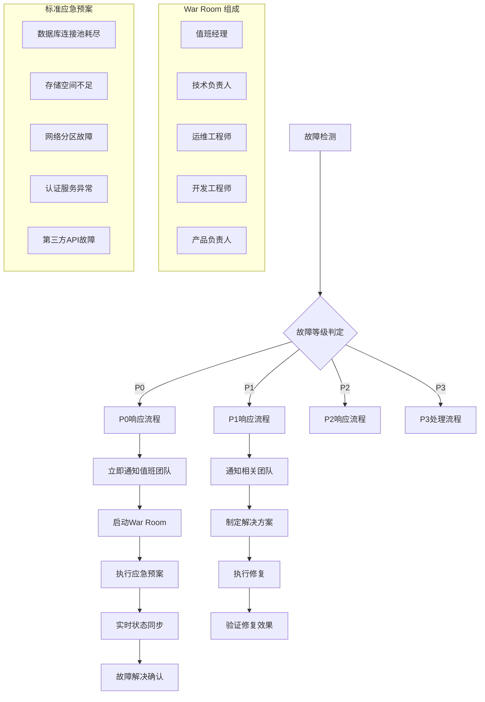
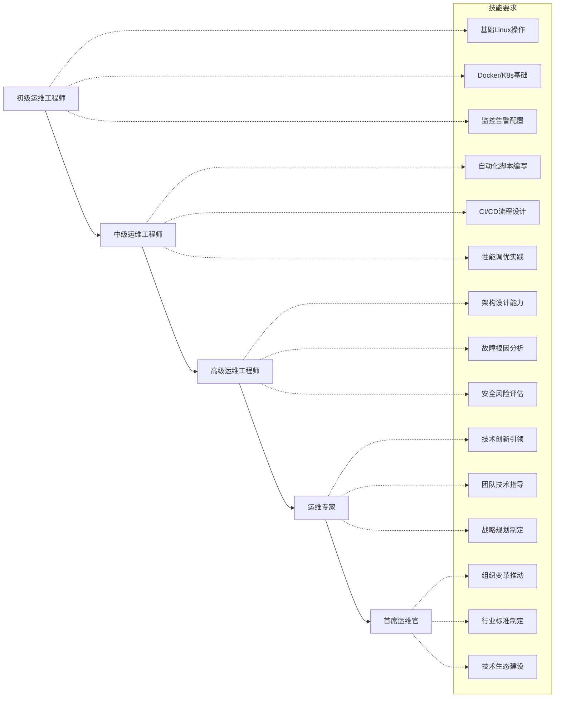
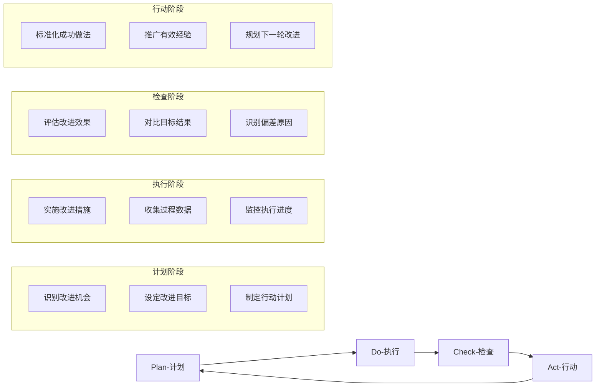

# 企业级运维最佳实践

> **目标**: 构建万级节点规模的企业级Kubernetes运维体系，实现高可用、高性能、高安全的生产环境运维

---

## 🏢 大规模集群管理

### 万级节点运维架构

#### 集群分层管理策略
```yaml
# 大规模集群分层架构
apiVersion: v1
kind: ConfigMap
metadata:
  name: cluster-tier-config
data:
  # 核心层 - 控制平面
  control-plane:
    node-count: "300"
    instance-type: "c6i.4xlarge"
    redundancy: "3 AZ"
    monitoring-interval: "1s"
  
  # 数据层 - 存储节点
  data-layer:
    node-count: "2000"
    instance-type: "i4i.4xlarge"
    storage-type: "local NVMe"
    replication-factor: "3"
  
  # 计算层 - 工作节点
  compute-layer:
    node-count: "8000"
    instance-type: "c6i.2xlarge"
    autoscaling: "enabled"
    spot-ratio: "70%"
  
  # 边缘层 - 边缘计算
  edge-layer:
    node-count: "500"
    instance-type: "t3.medium"
    latency-target: "<10ms"
    offline-tolerance: "24h"
```

#### 性能调优黄金配置
```bash
#!/bin/bash
# 万级节点性能调优脚本

# 内核参数优化
cat > /etc/sysctl.d/99-k8s-performance.conf << EOF
# 网络性能优化
net.core.rmem_max = 134217728
net.core.wmem_max = 134217728
net.ipv4.tcp_rmem = 4096 87380 134217728
net.ipv4.tcp_wmem = 4096 65536 134217728
net.ipv4.tcp_congestion_control = bbr

# 文件系统优化
fs.file-max = 2097152
fs.inotify.max_user_watches = 1048576
fs.inotify.max_user_instances = 8192

# 内存管理优化
vm.swappiness = 1
vm.dirty_ratio = 15
vm.dirty_background_ratio = 5
EOF

# kubelet 参数优化
cat > /etc/default/kubelet << EOF
KUBELET_EXTRA_ARGS="--max-pods=250 \
  --kube-api-qps=100 \
  --kube-api-burst=200 \
  --serialize-image-pulls=false \
  --eviction-hard=memory.available<500Mi,nodefs.available<10% \
  --eviction-soft=memory.available<1Gi,nodefs.available<15% \
  --eviction-soft-grace-period=memory.available=1m30s,nodefs.available=1m30s"
EOF
```

### 多集群联邦管理

#### Cluster API 大规模部署
```yaml
# 多集群联邦管理配置
apiVersion: cluster.x-k8s.io/v1beta1
kind: Cluster
metadata:
  name: enterprise-federation
spec:
  # 主集群配置
  controlPlaneRef:
    apiVersion: controlplane.cluster.x-k8s.io/v1beta1
    kind: KubeadmControlPlane
    name: main-control-plane
  infrastructureRef:
    apiVersion: infrastructure.cluster.x-k8s.io/v1beta1
    kind: AWSCluster
    name: main-infrastructure
  
---
apiVersion: addons.cluster.x-k8s.io/v1alpha1
kind: ClusterResourceSet
metadata:
  name: enterprise-addons
spec:
  clusterSelector:
    matchLabels:
      cluster-type: production
  resources:
  - name: monitoring-stack
    kind: ConfigMap
  - name: security-policies
    kind: Secret
  - name: backup-configuration
    kind: ConfigMap
```

## 🚀 变更管理与发布策略

### 渐进式交付流水线

#### 蓝绿部署架构
```yaml
# 蓝绿部署策略配置
apiVersion: argoproj.io/v1alpha1
kind: Application
metadata:
  name: enterprise-blue-green
spec:
  source:
    repoURL: https://github.com/enterprise/apps.git
    targetRevision: HEAD
    path: production/
  destination:
    server: https://kubernetes.default.svc
    namespace: production
    
  strategy:
    blueGreen:
      activeService: production-service
      previewService: preview-service
      autoPromotionEnabled: false
      autoPromotionSeconds: 300
      
      # 渐进式流量切换
      trafficRouting:
        smi:
          trafficSplitName: production-split
          rootService: production-root
          
---
# 流量分割配置
apiVersion: split.smi-spec.io/v1alpha2
kind: TrafficSplit
metadata:
  name: production-split
spec:
  service: production-root
  backends:
  - service: production-blue
    weight: 90  # 主要流量
  - service: production-green
    weight: 10  # 新版本流量
```

#### 金丝雀发布策略
```yaml
# 智能金丝雀发布
apiVersion: flagger.app/v1beta1
kind: Canary
metadata:
  name: enterprise-canary
spec:
  targetRef:
    apiVersion: apps/v1
    kind: Deployment
    name: enterprise-app
    
  service:
    port: 80
    targetPort: 8080
    portName: http
    
  analysis:
    interval: 1m
    threshold: 5
    maxWeight: 100
    stepWeight: 10
    stepWeights: [1, 5, 10, 25, 50, 75, 100]
    
    # 多维度指标检查
    metrics:
    - name: request-success-rate
      interval: 1m
      thresholdRange:
        min: 99
      provider:
        type: prometheus
        address: http://prometheus:9090
        
    - name: request-duration
      interval: 1m
      thresholdRange:
        max: 500
      provider:
        type: prometheus
        address: http://prometheus:9090
        
    # 业务指标监控
    - name: business-transaction-success
      interval: 1m
      thresholdRange:
        min: 99.5
      provider:
        type: datadog
        query: avg:kubernetes_state.container.restarts{service:enterprise} < 1
        
    # 用户体验指标
    - name: frontend-load-time
      interval: 1m
      thresholdRange:
        max: 2000
      provider:
        type: newrelic
        query: SELECT average(duration) FROM PageView WHERE appName = 'enterprise'
```

### 自动化回滚机制

#### 智能回滚策略
```yaml
# 自动回滚配置
apiVersion: rollouts.argoproj.io/v1alpha1
kind: Rollout
metadata:
  name: smart-rollback
spec:
  replicas: 100
  strategy:
    canary:
      steps:
      - setWeight: 20
        pause: {duration: 10m}
      - setWeight: 50
        pause: {}
      - setWeight: 100
      
      # 回滚触发条件
      rollbackConditions:
      - metricName: error-rate
        threshold: 2.0
        operator: GreaterThan
        duration: 5m
        
      - metricName: latency-p99
        threshold: 1000
        operator: GreaterThan
        duration: 3m
        
      - metricName: cpu-utilization
        threshold: 80
        operator: GreaterThan
        duration: 2m
        
  # 健康检查配置
  selector:
    matchLabels:
      app: enterprise-app
  template:
    metadata:
      labels:
        app: enterprise-app
    spec:
      containers:
      - name: app
        image: enterprise/app:v2.0
        readinessProbe:
          httpGet:
            path: /health
            port: 8080
          initialDelaySeconds: 30
          periodSeconds: 5
          timeoutSeconds: 3
          failureThreshold: 3
```

## 🔥 故障应急与灾难恢复

### SRE故障响应体系

#### 故障等级定义
```yaml
# 故障等级分类标准
incidentLevels:
  P0-Critical:
    responseTime: "15分钟"
    resolutionTime: "2小时"
    impact: "核心业务完全中断"
    examples:
      - "用户无法访问核心服务"
      - "数据库完全不可用"
      - "支付系统故障"
      
  P1-High:
    responseTime: "1小时"
    resolutionTime: "8小时"
    impact: "重要功能受限"
    examples:
      - "部分用户无法使用"
      - "性能严重下降"
      - "次要功能故障"
      
  P2-Medium:
    responseTime: "4小时"
    resolutionTime: "24小时"
    impact: "一般性问题"
    examples:
      - "非关键功能异常"
      - "轻微性能问题"
      - "用户体验下降"
      
  P3-Low:
    responseTime: "1个工作日"
    resolutionTime: "72小时"
    impact: "轻微问题"
    examples:
      - "界面显示问题"
      - "文档错误"
      - "低优先级需求"
```

#### 应急响应流程


### 灾难恢复策略

#### 多活数据中心架构
```yaml
# 多活数据中心配置
apiVersion: v1
kind: ConfigMap
metadata:
  name: disaster-recovery-config
data:
  # 地理分布
  regions:
    primary: "us-east-1"
    secondary: "us-west-2"
    tertiary: "eu-central-1"
  
  # RTO/RPO 要求
  recovery-objectives:
    rto: "15分钟"  # 恢复时间目标
    rpo: "5分钟"   # 恢复点目标
    
  # 数据同步策略
  data-replication:
    realtime-sync: true
    sync-frequency: "5s"
    consistency-level: "strong"
    
---
# 灾难恢复演练计划
apiVersion: batch/v1
kind: CronJob
metadata:
  name: dr-drill
spec:
  schedule: "0 2 * * 0"  # 每周日凌晨2点
  jobTemplate:
    spec:
      template:
        spec:
          containers:
          - name: dr-test
            image: enterprise/dr-test:latest
            env:
            - name: TARGET_REGION
              value: "us-west-2"
            - name: TEST_DURATION
              value: "2h"
            command:
            - /bin/sh
            - -c
            - |
              echo "开始灾难恢复演练"
              # 切换流量到备用区域
              kubectl apply -f dr-failover.yaml
              # 验证服务可用性
              ./verify-services.sh
              # 数据一致性检查
              ./check-data-consistency.sh
              # 性能基准测试
              ./performance-baseline.sh
          restartPolicy: OnFailure
```

## 👥 团队协作与知识传承

### 运维文化建设

#### DevOps 成熟度评估
```yaml
# DevOps 成熟度模型
devopsMaturity:
  culture:
    collaboration-score: 8.5/10
    blameless-postmortems: true
    knowledge-sharing: weekly
    
  automation:
    ci-cd-coverage: 95%
    infrastructure-as-code: 100%
    automated-testing: 90%
    
  measurement:
    deployment-frequency: "daily"
    lead-time: "<1小时"
    mean-time-to-recovery: "<30分钟"
    change-failure-rate: "<5%"
    
  sharing:
    cross-team-collaboration: monthly
    community-contributions: quarterly
    open-source-involvement: active
```

#### 知识管理体系
```markdown
## 企业运维知识库结构

### 技术文档层级
├── 标准操作程序 (SOP)
│   ├── 系统部署指南
│   ├── 故障处理手册
│   ├── 安全操作规程
│   └── 变更管理流程
│
├── 最佳实践集
│   ├── 性能优化案例
│   ├── 安全加固方案
│   ├── 成本控制策略
│   └── 监控告警模板
│
├── 故障案例库
│   ├── P0级别事故报告
│   ├── 重复性问题分析
│   ├── 根因分析模板
│   └── 预防措施总结
│
└── 培训材料
    ├── 新员工入职培训
    ├── 技术专项培训
    ├── 认证考试资料
    └── 外部技术分享
```

### 技能发展路径

#### 运维工程师成长路线图


#### 持续学习机制
```yaml
# 技能发展计划
learningPath:
  quarterly-training:
    technical-workshops:
      - kubernetes-advanced
      - cloud-security
      - ai-platform-ops
      - multi-cloud-management
      
    certification-programs:
      - CKA (Certified Kubernetes Administrator)
      - AWS Certified Solutions Architect
      - Google Cloud Professional
      - CNCF Security Specialist
      
  knowledge-sharing:
    tech-talks:
      frequency: bi-weekly
      duration: 60 minutes
      audience: engineering-team
      
    book-clubs:
      books-per-quarter: 2
      discussion-format: interactive
      
    mentoring-program:
      senior-junior-pairs: 6
      meeting-frequency: weekly
      duration: 6 months
```

## 📊 运营指标与持续改进

### 关键绩效指标(KPI)

#### 服务质量指标
```yaml
# 企业级SLI/SLO定义
serviceLevelIndicators:
  availability:
    sli: "uptime_percentage"
    sli-query: |
      sum(up{job=~"application.*"}) / count(up{job=~"application.*"}) * 100
    slo-target: 99.95
    alert-threshold: 99.9
    
  latency:
    sli: "request_duration_p95"
    sli-query: |
      histogram_quantile(0.95, sum(rate(http_request_duration_seconds_bucket[5m])) by (le))
    slo-target: 200ms
    alert-threshold: 500ms
    
  throughput:
    sli: "requests_per_second"
    sli-query: |
      sum(rate(http_requests_total[5m]))
    slo-target: 10000
    alert-threshold: 5000
    
  correctness:
    sli: "error_rate_percentage"
    sli-query: |
      sum(rate(http_requests_total{status=~"5.."}[5m])) / sum(rate(http_requests_total[5m])) * 100
    slo-target: 0.1
    alert-threshold: 1.0

---
# 运维效能指标
operationalMetrics:
  deployment-frequency:
    target: daily
    current: "4.2/day"
    trend: increasing
    
  lead-time-for-changes:
    target: "<1小时"
    current: "45分钟"
    trend: decreasing
    
  mean-time-to-recovery:
    target: "<30分钟"
    current: "22分钟"
    trend: decreasing
    
  change-failure-rate:
    target: "<5%"
    current: "2.3%"
    trend: decreasing
```

### 持续改进循环

#### PDCA 改进框架


#### 改进项目管理
```yaml
# 持续改进项目跟踪
improvementProjects:
  - name: "监控系统性能优化"
    owner: "运维团队"
    startDate: "2024-01-15"
    endDate: "2024-03-15"
    status: "completed"
    results:
      - "查询性能提升60%"
      - "存储成本降低25%"
      - "告警准确性提高40%"
      
  - name: "自动扩缩容策略优化"
    owner: "平台工程团队"
    startDate: "2024-02-01"
    endDate: "2024-04-01"
    status: "in-progress"
    targets:
      - "成本节约20%"
      - "响应时间减少50%"
      - "资源利用率提升至75%"
      
  - name: "安全漏洞快速响应"
    owner: "安全团队"
    startDate: "2024-03-01"
    endDate: "2024-05-01"
    status: "planned"
    objectives:
      - "漏洞修复时间<24小时"
      - "安全事件0遗漏"
      - "合规检查100%通过"
```

## 🔧 附录：企业级运维工具链

### 核心工具推荐

#### 监控与可观测性
- **Prometheus + Grafana**: 核心监控平台
- **Elastic Stack**: 日志分析与搜索
- **Datadog/New Relic**: 商业APM解决方案
- **Jaeger/OpenTelemetry**: 分布式追踪

#### 自动化与编排
- **Ansible/Terraform**: 基础设施即代码
- **Argo CD/Flux**: GitOps持续交付
- **Jenkins/GitLab CI**: CI/CD流水线
- **Spinnaker**: 多云交付平台

#### 安全与合规
- **Falco/Sysdig**: 运行时安全监控
- **Aqua Security**: 容器安全平台
- **HashiCorp Vault**: 密钥管理
- **SonarQube**: 代码质量与安全扫描

这份企业级运维最佳实践文档为企业构建了完整的运维体系框架，涵盖了从大规模集群管理到团队协作的各个方面，确保能够支撑万级节点规模的生产环境稳定运行。