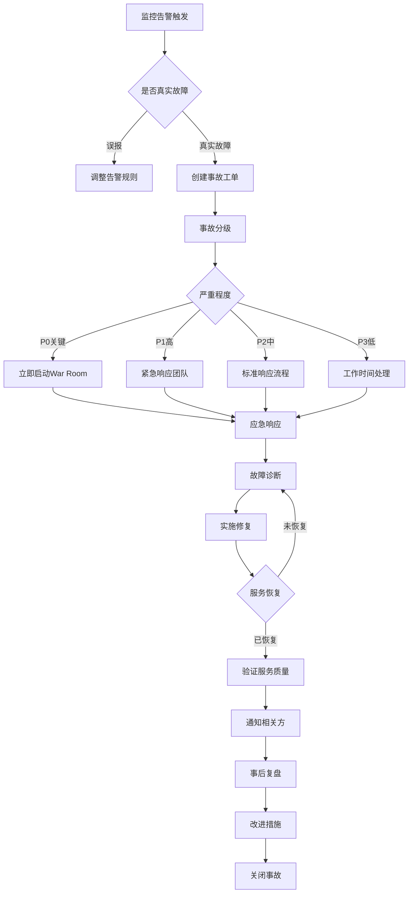

# 12 - 生产事故管理与应急手册

> **适用版本**: Kubernetes v1.25-v1.32 | **最后更新**: 2026-02 | **作者**: Allen Galler | **质量等级**: ⭐⭐⭐⭐⭐ 专家级

> **生产环境实战经验总结**: 基于万级节点集群运维经验，涵盖从事故分级到应急响应的全方位最佳实践

---

## 目录

- [1. 事故管理框架](#1-事故管理框架)
- [2. 事故分级标准](#2-事故分级标准)
- [3. 应急响应流程](#3-应急响应流程)
- [4. War Room 组织](#4-war-room-组织)
- [5. 通用应急手册](#5-通用应急手册)
- [6. 特定场景 Runbook](#6-特定场景-runbook)
- [7. 事后复盘机制](#7-事后复盘机制)
- [8. 持续改进实践](#8-持续改进实践)

---

## 1. 事故管理框架

### 1.1 ITIL 事故管理流程

| 阶段 | 目标 | 关键活动 | 输出物 | SLA |
|------|------|----------|--------|-----|
| **事故识别** | 尽早发现异常 | 监控告警、用户报告、主动巡检 | 事故工单 | < 5分钟 |
| **事故记录** | 完整记录信息 | 创建事故单、分配优先级、初步分类 | 结构化事故记录 | < 2分钟 |
| **事故分类** | 确定影响范围 | 业务影响评估、技术影响评估 | 事故等级定义 | < 5分钟 |
| **事故调查诊断** | 定位根因 | 日志分析、指标检查、链路追踪 | 诊断报告 | 根据等级 |
| **事故解决恢复** | 恢复服务 | 执行修复方案、验证恢复效果 | 解决方案文档 | 根据等级 |
| **事故关闭** | 确认完全恢复 | 用户确认、监控验证、文档归档 | 关闭确认 | 24小时内 |

### 1.2 事故生命周期管理



---

## 2. 事故分级标准

### 2.1 事故等级定义

| 等级 | 名称 | 业务影响 | 响应时间 | 解决目标 | 升级策略 | 通知范围 |
|------|------|----------|----------|----------|----------|----------|
| **P0** | 致命故障 | 核心业务完全中断，大量用户无法访问 | 立即响应（5分钟内） | 2小时内恢复 | 15分钟未进展升级 | CEO、CTO、所有相关团队 |
| **P1** | 严重故障 | 重要功能受影响，部分用户无法使用 | 15分钟内响应 | 4小时内恢复 | 1小时未进展升级 | 技术VP、产品负责人 |
| **P2** | 一般故障 | 非核心功能异常，用户体验下降 | 1小时内响应 | 8小时内解决 | 4小时未进展升级 | 相关技术团队 |
| **P3** | 轻微问题 | 低优先级问题，影响极小 | 工作时间响应 | 3天内解决 | 按计划处理 | 责任工程师 |

### 2.2 Kubernetes 故障分级示例

```yaml
# P0 级别故障示例
incidentExamples:
  p0-critical:
    - title: "控制平面完全不可用"
      symptoms:
        - "API Server 无法响应请求"
        - "所有 kubectl 命令失败"
        - "新 Pod 无法调度"
      impact: "集群完全失控，业务全面中断"
      
    - title: "etcd 集群数据丢失"
      symptoms:
        - "etcd 集群无法达成共识"
        - "数据不一致"
      impact: "集群状态不可信，存在数据丢失风险"
      
    - title: "认证系统故障"
      symptoms:
        - "用户无法登录"
        - "API 认证失败"
      impact: "所有用户无法访问系统"

  p1-high:
    - title: "单个可用区故障"
      symptoms:
        - "1/3 节点不可用"
        - "部分 Pod 无法调度"
      impact: "服务降级，部分功能受限"
      
    - title: "存储系统性能严重下降"
      symptoms:
        - "PVC 创建超时"
        - "IO 延迟 > 1000ms"
      impact: "有状态应用响应缓慢"
      
    - title: "网络策略错误配置"
      symptoms:
        - "跨命名空间通信失败"
        - "Service 不可达"
      impact: "部分服务间通信中断"

  p2-medium:
    - title: "监控告警风暴"
      symptoms:
        - "大量重复告警"
        - "告警系统过载"
      impact: "真实问题被淹没，运维效率降低"
      
    - title: "单个节点性能问题"
      symptoms:
        - "节点 CPU/内存压力大"
        - "Pod 驱逐频繁"
      impact: "个别应用实例不稳定"

  p3-low:
    - title: "文档链接失效"
      symptoms:
        - "404 错误"
      impact: "用户查阅文档不便"
      
    - title: "非关键组件版本过时"
      symptoms:
        - "监控组件版本落后"
      impact: "无立即风险，需计划升级"
```

---

## 3. 应急响应流程

### 3.1 P0 级别快速响应手册

```bash
#!/bin/bash
# P0 事故应急响应标准流程（15分钟黄金窗口期）

# ========== 第一步：立即确认故障（0-2分钟）==========
echo "=== 步骤 1: 快速故障确认 ==="

# 检查 API Server 健康状态
kubectl get --raw='/healthz' || echo "API Server 不可用"

# 检查核心组件状态
kubectl get cs
kubectl get nodes
kubectl top nodes

# 检查关键命名空间
kubectl get pods -n kube-system -o wide
kubectl get pods -n production -o wide

# ========== 第二步：启动 War Room（2-5分钟）==========
echo "=== 步骤 2: 启动 War Room ==="

# 发送紧急通知（钉钉/Slack/企业微信）
curl -X POST https://hooks.slack.com/services/YOUR_WEBHOOK \
  -H 'Content-Type: application/json' \
  -d '{
    "text": "🚨 P0 事故告警",
    "attachments": [{
      "color": "danger",
      "title": "生产集群核心服务中断",
      "fields": [
        {"title": "集群", "value": "prod-cluster-01", "short": true},
        {"title": "影响范围", "value": "全部用户", "short": true},
        {"title": "War Room", "value": "https://zoom.us/j/emergency", "short": false}
      ]
    }]
  }'

# ========== 第三步：快速诊断（5-10分钟）==========
echo "=== 步骤 3: 快速诊断关键指标 ==="

# etcd 健康检查
ETCDCTL_API=3 etcdctl endpoint health \
  --endpoints=https://etcd-0:2379,https://etcd-1:2379,https://etcd-2:2379 \
  --cacert=/etc/kubernetes/pki/etcd/ca.crt \
  --cert=/etc/kubernetes/pki/etcd/healthcheck-client.crt \
  --key=/etc/kubernetes/pki/etcd/healthcheck-client.key

# 控制平面组件日志（最近100行）
journalctl -u kube-apiserver -n 100 --no-pager
journalctl -u kube-controller-manager -n 100 --no-pager
journalctl -u kube-scheduler -n 100 --no-pager

# 网络连通性测试
kubectl run test-pod --image=busybox --restart=Never -- sleep 3600
kubectl exec test-pod -- nslookup kubernetes.default.svc.cluster.local
kubectl delete pod test-pod

# ========== 第四步：执行应急恢复（10-15分钟）==========
echo "=== 步骤 4: 执行应急恢复措施 ==="

# 根据故障类型执行对应的应急手册
# 示例：API Server 重启
# systemctl restart kube-apiserver

# 验证恢复效果
kubectl get nodes
kubectl get pods --all-namespaces | grep -v Running

echo "=== P0 应急响应完成，进入持续监控阶段 ==="
```

### 3.2 应急决策树

```yaml
# 应急决策矩阵
decisionMatrix:
  api-server-down:
    priority: P0
    first-action: "检查 etcd 健康状态"
    escalation: "如果 etcd 正常，重启 API Server；如果 etcd 异常，启动灾备切换"
    rollback-plan: "从最近备份恢复 etcd"
    
  etcd-quorum-lost:
    priority: P0
    first-action: "停止写入，保护现有数据"
    escalation: "联系数据库专家，评估数据恢复可能性"
    rollback-plan: "从最近快照恢复"
    
  network-partition:
    priority: P0/P1
    first-action: "识别隔离的节点或可用区"
    escalation: "如果影响 >30% 节点，触发多可用区切换"
    rollback-plan: "恢复网络连接，重新调度 Pod"
    
  storage-failure:
    priority: P1
    first-action: "识别受影响的 PVC"
    escalation: "评估数据恢复可能性，准备从备份恢复"
    rollback-plan: "切换到备用存储系统"
```

---

## 4. War Room 组织

### 4.1 War Room 角色定义

| 角色 | 职责 | 权限 | 技能要求 | 参与条件 |
|------|------|------|----------|----------|
| **事故指挥官** (Incident Commander) | 统一指挥、决策制定、资源调度 | 可以调动任何资源 | 5年+运维经验、决断力强 | P0必须参与 |
| **技术负责人** (Tech Lead) | 技术诊断、方案制定、执行监督 | 可以修改生产配置 | 架构设计能力、深入代码理解 | P0/P1参与 |
| **运维工程师** (SRE) | 执行操作、数据收集、监控跟踪 | 执行权限 | 熟悉运维工具链 | 所有级别 |
| **开发工程师** (Developer) | 代码分析、热修复、配置调整 | 代码提交权限 | 熟悉业务逻辑 | 需要时加入 |
| **沟通协调员** (Communications Lead) | 内外沟通、状态更新、记录整理 | 对外通知权限 | 沟通能力强 | P0/P1参与 |
| **产品负责人** (Product Owner) | 业务影响评估、降级决策、用户通知 | 业务决策权 | 业务理解深刻 | 需要时加入 |

### 4.2 War Room 运作规范

```yaml
# War Room 会议规范
warRoomProtocol:
  meeting-setup:
    platform: "Zoom/Teams 专用应急会议室"
    duration: "持续到故障解决"
    recording: "必须录制，用于事后复盘"
    
  communication-rules:
    - "禁止责备个人（Blameless Culture）"
    - "技术讨论优先，避免无关话题"
    - "每15分钟同步一次状态"
    - "决策由 Incident Commander 最终确定"
    - "所有重大操作必须先沟通后执行"
    
  status-update:
    internal-update: "每30分钟向管理层汇报"
    external-update: "每小时向客户发布状态页更新"
    documentation: "实时记录到事故文档"
    
  handoff-procedure:
    condition: "超过4小时持续作战"
    process: "完整的知识转移、文档交接"
    overlap: "至少30分钟重叠时间"
```

---

## 5. 通用应急手册

### 5.1 控制平面故障应急手册

#### Runbook: API Server 不可用

**故障现象**
```bash
# kubectl 命令失败
$ kubectl get nodes
The connection to the server xxx:6443 was refused - did you specify the right host or port?

# API Server 健康检查失败
$ curl -k https://192.168.1.10:6443/healthz
curl: (7) Failed to connect to 192.168.1.10 port 6443: Connection refused
```

**快速诊断**
```bash
# 1. 检查 API Server 进程
ssh master-node-1
ps aux | grep kube-apiserver

# 2. 检查 API Server 日志
journalctl -u kube-apiserver -n 200 --no-pager | tail -50

# 3. 检查 etcd 连接性
ETCDCTL_API=3 etcdctl endpoint health \
  --endpoints=https://192.168.1.10:2379 \
  --cacert=/etc/kubernetes/pki/etcd/ca.crt \
  --cert=/etc/kubernetes/pki/etcd/healthcheck-client.crt \
  --key=/etc/kubernetes/pki/etcd/healthcheck-client.key

# 4. 检查证书有效期
openssl x509 -in /etc/kubernetes/pki/apiserver.crt -noout -dates
```

**恢复步骤**
```bash
# 方案A: 重启 API Server（首选）
systemctl restart kube-apiserver
sleep 10
kubectl get cs

# 方案B: 如果重启无效，检查配置文件
cat /etc/kubernetes/manifests/kube-apiserver.yaml
# 查找最近的配置变更
git log -5 --oneline /etc/kubernetes/manifests/

# 方案C: 从备份恢复配置
cp /backup/kube-apiserver.yaml.$(date +%Y%m%d) /etc/kubernetes/manifests/kube-apiserver.yaml

# 方案D: 切换到备用 API Server
kubectl config set-cluster prod --server=https://backup-apiserver:6443
```

**验证恢复**
```bash
# 验证 API Server 可达
kubectl get --raw='/healthz?verbose'

# 验证基本功能
kubectl get nodes
kubectl get pods -A
kubectl run test-nginx --image=nginx --restart=Never
kubectl delete pod test-nginx
```

#### Runbook: etcd 集群故障

**故障现象**
```bash
# etcd 健康检查失败
ETCDCTL_API=3 etcdctl endpoint health
https://192.168.1.10:2379 is unhealthy: failed to connect
```

**快速诊断**
```bash
# 1. 检查 etcd 成员状态
ETCDCTL_API=3 etcdctl member list \
  --write-out=table \
  --endpoints=https://192.168.1.10:2379,https://192.168.1.11:2379,https://192.168.1.12:2379

# 2. 检查磁盘空间
df -h /var/lib/etcd

# 3. 检查 etcd 日志
journalctl -u etcd -n 100 --no-pager | grep -E "error|warning|critical"

# 4. 检查网络延迟
for host in 192.168.1.10 192.168.1.11 192.168.1.12; do
  ping -c 3 $host
done
```

**恢复步骤**
```bash
# 场景1: 单个成员失败（3节点中1个失败）
# 移除故障成员
ETCDCTL_API=3 etcdctl member remove <member-id>
# 添加新成员
ETCDCTL_API=3 etcdctl member add etcd-3 --peer-urls=https://192.168.1.13:2380

# 场景2: 失去法定人数（Quorum Lost）
# ⚠️ 危险操作：强制重建集群
# 1. 备份现有数据
etcdctl snapshot save /backup/etcd-snapshot-$(date +%s).db
# 2. 从快照恢复
ETCDCTL_API=3 etcdctl snapshot restore /backup/etcd-snapshot-latest.db \
  --name=etcd-1 \
  --initial-cluster=etcd-1=https://192.168.1.10:2380 \
  --initial-advertise-peer-urls=https://192.168.1.10:2380 \
  --data-dir=/var/lib/etcd-restore

# 场景3: 磁盘空间不足
# 增加存储配额（临时措施）
etcdctl alarm disarm
etcdctl defrag --command-timeout=30s
# 清理旧版本数据
etcdctl compact $(etcdctl endpoint status --write-out="json" | jq -r '.[0].Status.raftIndex')
```

### 5.2 工作负载故障应急手册

#### Runbook: Pod 无法启动

**快速诊断脚本**
```bash
#!/bin/bash
# pod-troubleshooting.sh - Pod 故障快速诊断工具

NAMESPACE=${1:-default}
POD_NAME=${2}

echo "=== Pod 基本信息 ==="
kubectl get pod $POD_NAME -n $NAMESPACE -o wide

echo "=== Pod 详细状态 ==="
kubectl describe pod $POD_NAME -n $NAMESPACE

echo "=== Pod Events ==="
kubectl get events -n $NAMESPACE --field-selector involvedObject.name=$POD_NAME

echo "=== 容器日志 ==="
for container in $(kubectl get pod $POD_NAME -n $NAMESPACE -o jsonpath='{.spec.containers[*].name}'); do
  echo "--- Container: $container ---"
  kubectl logs $POD_NAME -n $NAMESPACE -c $container --tail=50
done

echo "=== 节点资源状况 ==="
NODE=$(kubectl get pod $POD_NAME -n $NAMESPACE -o jsonpath='{.spec.nodeName}')
kubectl describe node $NODE | grep -A 10 "Allocated resources"

echo "=== 镜像拉取状态 ==="
kubectl get pod $POD_NAME -n $NAMESPACE -o jsonpath='{.status.containerStatuses[*].state}'
```

**常见故障恢复**
```yaml
# 场景1: ImagePullBackOff
# 检查镜像是否存在
docker pull <image-name>

# 检查 imagePullSecrets
kubectl get secret -n $NAMESPACE
kubectl create secret docker-registry regcred \
  --docker-server=<registry-url> \
  --docker-username=<username> \
  --docker-password=<password>

# 场景2: CrashLoopBackOff
# 查看崩溃日志
kubectl logs <pod> --previous

# 调整资源限制
kubectl set resources deployment/<name> \
  --limits=memory=512Mi,cpu=1000m \
  --requests=memory=256Mi,cpu=500m

# 场景3: Pending（资源不足）
# 查看节点资源
kubectl top nodes

# 驱逐低优先级 Pod
kubectl delete pod -n <namespace> <low-priority-pod>

# 扩展节点
kubectl scale deployment cluster-autoscaler --replicas=1
```

---

## 6. 特定场景 Runbook

### 6.1 网络故障应急手册

**故障类型：Service 无法访问**

```bash
#!/bin/bash
# service-troubleshooting.sh

SERVICE_NAME=$1
NAMESPACE=${2:-default}

# 步骤1: 验证 Service 配置
echo "=== Service 配置 ==="
kubectl get svc $SERVICE_NAME -n $NAMESPACE -o yaml

# 步骤2: 检查 Endpoints
echo "=== Endpoints ==="
kubectl get endpoints $SERVICE_NAME -n $NAMESPACE

# 步骤3: 验证 Pod Selector
SELECTOR=$(kubectl get svc $SERVICE_NAME -n $NAMESPACE -o jsonpath='{.spec.selector}')
echo "=== 匹配的 Pods ==="
kubectl get pods -n $NAMESPACE -l "$SELECTOR"

# 步骤4: 测试服务连通性
POD=$(kubectl get pods -n $NAMESPACE -l "$SELECTOR" -o jsonpath='{.items[0].metadata.name}')
kubectl exec -it $POD -n $NAMESPACE -- curl -v $SERVICE_NAME:80

# 步骤5: 检查 NetworkPolicy
echo "=== Network Policies ==="
kubectl get networkpolicy -n $NAMESPACE

# 步骤6: DNS 解析测试
kubectl run dnsutils --image=tutum/dnsutils --restart=Never -- sleep 3600
kubectl exec dnsutils -- nslookup $SERVICE_NAME.$NAMESPACE.svc.cluster.local
kubectl delete pod dnsutils
```

### 6.2 存储故障应急手册

**故障类型：PVC Pending**

```bash
#!/bin/bash
# pvc-troubleshooting.sh

PVC_NAME=$1
NAMESPACE=${2:-default}

# 步骤1: 检查 PVC 状态
echo "=== PVC 状态 ==="
kubectl describe pvc $PVC_NAME -n $NAMESPACE

# 步骤2: 检查 StorageClass
SC=$(kubectl get pvc $PVC_NAME -n $NAMESPACE -o jsonpath='{.spec.storageClassName}')
echo "=== StorageClass: $SC ==="
kubectl describe storageclass $SC

# 步骤3: 检查 CSI Driver
echo "=== CSI Driver Pods ==="
kubectl get pods -n kube-system | grep csi

# 步骤4: 检查节点存储容量
echo "=== 节点存储情况 ==="
kubectl get nodes -o custom-columns=NAME:.metadata.name,CAPACITY:.status.capacity.ephemeral-storage,ALLOCATABLE:.status.allocatable.ephemeral-storage

# 步骤5: 手动创建 PV（临时方案）
cat <<EOF | kubectl apply -f -
apiVersion: v1
kind: PersistentVolume
metadata:
  name: manual-pv-${PVC_NAME}
spec:
  capacity:
    storage: 10Gi
  accessModes:
    - ReadWriteOnce
  persistentVolumeReclaimPolicy: Retain
  storageClassName: $SC
  hostPath:
    path: /mnt/data/${PVC_NAME}
EOF
```

---

## 7. 事后复盘机制

### 7.1 Postmortem 模板

```markdown
# 事故复盘报告

## 基本信息
- **事故编号**: INC-2026-0206-001
- **事故等级**: P0
- **发生时间**: 2026-02-06 14:32:15 UTC
- **恢复时间**: 2026-02-06 16:45:30 UTC
- **持续时长**: 2小时13分钟
- **影响范围**: 生产集群所有用户（约10万用户）

## 执行摘要
简要描述事故的业务影响、技术根因和主要改进措施（3-5句话）。

## 时间线
| 时间 | 事件 | 责任人 | 备注 |
|------|------|--------|------|
| 14:32 | Prometheus 告警：API Server 不可用 | 自动告警 | - |
| 14:35 | SRE 确认故障，启动 P0 响应 | Alice | - |
| 14:40 | 启动 War Room，通知管理层 | Bob | - |
| 14:50 | 诊断定位：etcd 磁盘空间不足 | Charlie | - |
| 15:10 | 扩容 etcd 磁盘，重启服务 | Alice | - |
| 15:30 | API Server 部分恢复 | - | 仍有延迟 |
| 16:00 | etcd 碎片整理完成 | Charlie | - |
| 16:30 | 服务完全恢复，性能正常 | - | - |
| 16:45 | 验证完成，关闭 War Room | Bob | - |

## 根因分析（5 Whys）
1. **为什么 API Server 不可用？**
   - 因为 etcd 无法写入数据

2. **为什么 etcd 无法写入数据？**
   - 因为 etcd 磁盘空间 100% 占用

3. **为什么磁盘空间 100% 占用？**
   - 因为历史数据未及时清理，持续写入导致

4. **为什么历史数据未及时清理？**
   - 因为自动压缩（auto-compaction）未配置

5. **为什么自动压缩未配置？**
   - 因为初始部署时使用默认配置，后续未优化

## 影响评估
- **用户影响**: 10万用户无法访问服务，估计业务损失 $50,000
- **系统影响**: 集群完全不可用，所有 kubectl 操作失败
- **数据影响**: 无数据丢失，事故期间的状态变更丢失

## 改进措施
| 措施 | 优先级 | 责任人 | 完成期限 | 状态 |
|------|--------|--------|----------|------|
| 配置 etcd 自动压缩（auto-compaction-retention=1h） | P0 | Alice | 2026-02-07 | ✅ 完成 |
| 添加 etcd 磁盘空间告警（阈值 70%） | P0 | Bob | 2026-02-07 | ✅ 完成 |
| 扩容 etcd 磁盘至 100GB | P1 | Charlie | 2026-02-10 | 🔄 进行中 |
| 编写 etcd 应急手册 | P1 | Alice | 2026-02-12 | 📝 待开始 |
| 定期进行 etcd 灾难恢复演练 | P2 | SRE Team | 每月一次 | 📝 待开始 |

## 经验教训
### 做得好的
- ✅ 告警及时触发，5分钟内启动应急响应
- ✅ War Room 组织高效，角色分工明确
- ✅ 诊断过程有序，快速定位根因
- ✅ 沟通透明，及时向用户通报进展

### 需要改进的
- ❌ 缺少磁盘空间监控告警
- ❌ etcd 配置未按照生产最佳实践设置
- ❌ 缺少定期的容量规划和审查
- ❌ 应急手册覆盖不全面

## 相关文档
- [etcd 运维最佳实践](../domain-3-control-plane/05-etcd-operations.md)
- [控制平面故障排查](../domain-12-troubleshooting/02-control-plane-etcd-troubleshooting.md)
```

### 7.2 Blameless Postmortem 原则

```yaml
# 无责复盘文化原则
blamelessCulture:
  core-principles:
    - "聚焦系统问题，而非个人失误"
    - "假设每个人都尽力而为"
    - "从失败中学习，而非惩罚"
    - "鼓励透明分享，建立信任"
    
  复盘会议规范:
    参与者: "所有相关方，包括事故执行者"
    主持人: "中立第三方，非直接参与者"
    时长: "1-2小时"
    输出: "改进措施列表，责任人明确"
    
  禁止语言:
    - "为什么你没有..."
    - "你应该..."
    - "这是谁的错..."
    
  鼓励语言:
    - "我们可以如何改进系统..."
    - "下次遇到类似情况，我们可以..."
    - "这次事故让我们学到了..."
```

---

## 8. 持续改进实践

### 8.1 事故趋势分析

```yaml
# 事故统计与分析
incidentAnalytics:
  monthly-metrics:
    total-incidents: 42
    p0-count: 2
    p1-count: 8
    p2-count: 15
    p3-count: 17
    
  mttr-by-severity:
    p0-mttr: "2.5小时"
    p1-mttr: "4.2小时"
    p2-mttr: "6.8小时"
    
  top-failure-categories:
    - category: "配置错误"
      percentage: 35%
      trend: "上升 ⬆️"
      
    - category: "容量不足"
      percentage: 25%
      trend: "下降 ⬇️"
      
    - category: "依赖故障"
      percentage: 20%
      trend: "持平 ➡️"
      
    - category: "软件缺陷"
      percentage: 15%
      trend: "下降 ⬇️"
      
    - category: "人为操作"
      percentage: 5%
      trend: "下降 ⬇️"
```

### 8.2 预防性措施矩阵

| 问题类型 | 检测机制 | 预防措施 | 自动化程度 | 实施优先级 |
|----------|----------|----------|------------|------------|
| **配置错误** | GitOps 审批流程 | Policy-as-Code 校验 | 80% | P0 |
| **容量不足** | 容量规划仪表板 | 自动扩缩容 | 90% | P0 |
| **证书过期** | 证书监控告警 | 自动续期 | 95% | P0 |
| **依赖故障** | 依赖健康检查 | 熔断降级 | 70% | P1 |
| **版本兼容性** | CI/CD 兼容性测试 | 金丝雀发布 | 60% | P1 |
| **人为误操作** | 操作二次确认 | RBAC 最小权限 | 50% | P2 |

---

**表格底部标记**: Kusheet Project | 作者: Allen Galler (allengaller@gmail.com) | 最后更新: 2026-02 | 版本: v1.25-v1.32 | 质量等级: ⭐⭐⭐⭐⭐ 专家级
