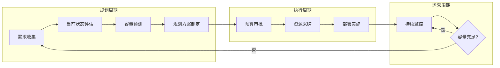

# 13 - 容量规划与资源预测

> **适用版本**: Kubernetes v1.25-v1.32 | **最后更新**: 2026-02 | **作者**: Allen Galler | **质量等级**: ⭐⭐⭐⭐⭐ 专家级

> **生产环境实战经验总结**: 基于万级节点集群容量管理经验，涵盖从资源预测到成本优化的全方位最佳实践

---

## 目录

- [1. 容量规划框架](#1-容量规划框架)
- [2. 资源使用分析](#2-资源使用分析)
- [3. 容量预测模型](#3-容量预测模型)
- [4. 集群扩容策略](#4-集群扩容策略)
- [5. 资源配额管理](#5-资源配额管理)
- [6. 成本优化实践](#6-成本优化实践)
- [7. 容量监控与告警](#7-容量监控与告警)
- [8. 实战案例分析](#8-实战案例分析)

---

## 1. 容量规划框架

### 1.1 容量规划生命周期



### 1.2 容量规划维度

| 维度 | 关键指标 | 目标值 | 评估周期 | 数据来源 |
|------|----------|--------|----------|----------|
| **计算资源** | CPU 利用率、可调度容量 | 60-75% | 每周 | Prometheus、Metrics Server |
| **内存资源** | 内存利用率、OOM 频率 | 65-80% | 每周 | cAdvisor、Node Exporter |
| **存储资源** | 磁盘使用率、IOPS、带宽 | <80% | 每天 | CSI Metrics、Node Exporter |
| **网络资源** | 带宽使用率、PPS、连接数 | <70% | 每天 | CNI Metrics、Node Exporter |
| **Pod 密度** | 每节点 Pod 数、调度失败率 | <80% max-pods | 每周 | Kube-Scheduler Metrics |
| **etcd 容量** | DB 大小、请求延迟、吞吐量 | <8GB, <100ms | 每天 | etcd Metrics |

### 1.3 容量规划方法论

```yaml
# 容量规划最佳实践
capacityPlanningMethods:
  
  # 方法1: 历史趋势分析
  trend-based-forecasting:
    description: "基于历史数据预测未来需求"
    适用场景: "稳定增长的业务"
    数据窗口: "至少6个月历史数据"
    预测周期: "未来3-6个月"
    准确度: "70-85%"
    工具: "Prometheus + Grafana + ML 模型"
    
  # 方法2: 业务驱动规划
  business-driven-planning:
    description: "根据业务目标反推资源需求"
    适用场景: "新业务上线、大促活动"
    输入参数:
      - "预期用户增长"
      - "单用户资源消耗"
      - "峰值倍数"
    计算公式: "总需求 = 日均用户 × 单用户资源 × 峰值倍数 × 冗余系数"
    准确度: "60-75%"
    
  # 方法3: 负载测试验证
  load-testing-validation:
    description: "通过压力测试验证容量假设"
    适用场景: "关键业务、高并发场景"
    测试工具: "K6、JMeter、Locust"
    测试维度:
      - "并发用户数"
      - "请求响应时间"
      - "资源使用率"
      - "错误率"
    准确度: "85-95%"
    
  # 方法4: 机器学习预测
  ml-based-forecasting:
    description: "使用 ML 模型预测资源需求"
    适用场景: "大规模集群、复杂业务模式"
    模型类型:
      - "时间序列预测 (ARIMA, Prophet)"
      - "回归模型 (Linear Regression)"
      - "深度学习 (LSTM)"
    训练数据: "至少12个月历史数据"
    准确度: "80-90%"
    工具: "Python + scikit-learn + TensorFlow"
```

---

## 2. 资源使用分析

### 2.1 集群资源全景视图

```bash
#!/bin/bash
# cluster-capacity-report.sh - 生成集群容量报告

echo "========== Kubernetes 集群容量报告 =========="
echo "生成时间: $(date)"
echo ""

# 1. 节点总览
echo "=== 1. 节点资源总览 ==="
kubectl get nodes -o custom-columns=\
NAME:.metadata.name,\
STATUS:.status.conditions[-1].type,\
ROLE:.metadata.labels.node-role\\.kubernetes\\.io/master,\
CPU_CAPACITY:.status.capacity.cpu,\
CPU_ALLOCATABLE:.status.allocatable.cpu,\
MEM_CAPACITY:.status.capacity.memory,\
MEM_ALLOCATABLE:.status.allocatable.memory,\
PODS_CAPACITY:.status.capacity.pods

echo ""
echo "=== 2. 集群总容量汇总 ==="
kubectl get nodes -o json | jq -r '
.items | 
"总节点数: " + (length | tostring) + "\n" +
"总 CPU 核心数: " + ([.[].status.capacity.cpu | tonumber] | add | tostring) + "\n" +
"可分配 CPU: " + ([.[].status.allocatable.cpu | tonumber] | add | tostring) + "\n" +
"总内存 (GB): " + ([.[].status.capacity.memory | rtrimstr("Ki") | tonumber] | add / 1024 / 1024 | tostring) + "\n" +
"可分配内存 (GB): " + ([.[].status.allocatable.memory | rtrimstr("Ki") | tonumber] | add / 1024 / 1024 | tostring)
'

echo ""
echo "=== 3. 命名空间资源使用 TOP 10 ==="
kubectl get pods --all-namespaces -o json | jq -r '
.items | 
group_by(.metadata.namespace) | 
map({
  namespace: .[0].metadata.namespace,
  pod_count: length,
  cpu_requests: [.[].spec.containers[].resources.requests.cpu // "0" | gsub("m"; "") | tonumber] | add,
  mem_requests: [.[].spec.containers[].resources.requests.memory // "0" | gsub("Mi"; "") | tonumber] | add
}) | 
sort_by(.cpu_requests) | 
reverse | 
.[:10] | 
.[] | 
"\(.namespace)\t\(.pod_count)\t\(.cpu_requests)m\t\(.mem_requests)Mi"
' | column -t -s $'\t' -N "命名空间,Pod数,CPU请求,内存请求"

echo ""
echo "=== 4. 资源利用率（实时） ==="
kubectl top nodes | awk 'NR==1 {print; next} {
  cpu_pct=$3; mem_pct=$5;
  gsub("%", "", cpu_pct); gsub("%", "", mem_pct);
  total_cpu += cpu_pct; total_mem += mem_pct; count++
}
END {
  print "平均 CPU 利用率:", total_cpu/count "%"
  print "平均内存利用率:", total_mem/count "%"
}'

echo ""
echo "=== 5. 不可调度节点检查 ==="
kubectl get nodes -o json | jq -r '
.items[] | 
select(.spec.unschedulable == true or 
       (.status.conditions[] | select(.type == "Ready" and .status != "True"))) |
.metadata.name
' | while read node; do
  echo "⚠️  节点 $node 不可调度"
done

echo ""
echo "=== 6. 资源碎片化分析 ==="
kubectl describe nodes | awk '
/^Name:/ {node=$2}
/cpu.*requests/ {
  split($0, a, /[()]/);
  cpu_allocated=a[2];
  gsub("%", "", cpu_allocated);
}
/memory.*requests/ {
  split($0, a, /[()]/);
  mem_allocated=a[2];
  gsub("%", "", mem_allocated);
  if (cpu_allocated < 50 && mem_allocated < 50) {
    print node ": CPU=" cpu_allocated "%, MEM=" mem_allocated "% (低利用率)"
  }
}'
```

### 2.2 资源使用趋势分析

```promql
# Prometheus 查询 - 资源使用趋势

## 1. CPU 使用率趋势（过去7天）
avg(rate(container_cpu_usage_seconds_total[5m])) by (namespace)

## 2. 内存使用趋势（过去7天）
avg(container_memory_working_set_bytes) by (namespace) / 1024 / 1024 / 1024

## 3. Pod 数量增长趋势
count(kube_pod_info) by (namespace)

## 4. 节点 CPU 可调度容量剩余
sum(kube_node_status_allocatable{resource="cpu"}) - 
sum(kube_pod_container_resource_requests{resource="cpu"})

## 5. 内存可调度容量剩余 (GB)
(sum(kube_node_status_allocatable{resource="memory"}) - 
 sum(kube_pod_container_resource_requests{resource="memory"})) / 1024 / 1024 / 1024

## 6. 存储使用率
(node_filesystem_size_bytes{mountpoint="/"} - 
 node_filesystem_avail_bytes{mountpoint="/"}) / 
 node_filesystem_size_bytes{mountpoint="/"} * 100

## 7. 网络带宽使用
rate(node_network_receive_bytes_total[5m]) / 1024 / 1024

## 8. etcd 数据库大小
etcd_mvcc_db_total_size_in_bytes / 1024 / 1024 / 1024
```

---

## 3. 容量预测模型

### 3.1 线性回归预测模型

```python
#!/usr/bin/env python3
# capacity_forecasting.py - 资源容量预测工具

import pandas as pd
import numpy as np
from sklearn.linear_model import LinearRegression
from sklearn.model_selection import train_test_split
from datetime import datetime, timedelta
import matplotlib.pyplot as plt

class CapacityForecaster:
    """Kubernetes 集群容量预测器"""
    
    def __init__(self, metric_data):
        """
        初始化预测器
        
        Args:
            metric_data: DataFrame，包含时间戳和资源使用量
                        列: ['timestamp', 'cpu_usage', 'memory_usage', 'pod_count']
        """
        self.data = metric_data
        self.model_cpu = LinearRegression()
        self.model_memory = LinearRegression()
        
    def prepare_data(self):
        """准备训练数据"""
        # 将时间戳转换为数值（天数）
        self.data['days'] = (self.data['timestamp'] - self.data['timestamp'].min()).dt.days
        
        # 特征和目标变量
        X = self.data[['days']].values
        y_cpu = self.data['cpu_usage'].values
        y_memory = self.data['memory_usage'].values
        
        return X, y_cpu, y_memory
    
    def train(self):
        """训练预测模型"""
        X, y_cpu, y_memory = self.prepare_data()
        
        # 训练 CPU 预测模型
        self.model_cpu.fit(X, y_cpu)
        
        # 训练内存预测模型
        self.model_memory.fit(X, y_memory)
        
        print(f"CPU 模型 R² 分数: {self.model_cpu.score(X, y_cpu):.4f}")
        print(f"内存模型 R² 分数: {self.model_memory.score(X, y_memory):.4f}")
    
    def forecast(self, days_ahead=90):
        """
        预测未来资源需求
        
        Args:
            days_ahead: 预测未来多少天
            
        Returns:
            DataFrame: 预测结果
        """
        last_day = self.data['days'].max()
        future_days = np.arange(last_day + 1, last_day + days_ahead + 1).reshape(-1, 1)
        
        # 预测
        cpu_forecast = self.model_cpu.predict(future_days)
        memory_forecast = self.model_memory.predict(future_days)
        
        # 构建结果 DataFrame
        forecast_df = pd.DataFrame({
            'days_from_now': future_days.flatten() - last_day,
            'predicted_cpu_usage': cpu_forecast,
            'predicted_memory_usage': memory_forecast
        })
        
        return forecast_df
    
    def calculate_capacity_needs(self, forecast_df, cluster_cpu_total, cluster_memory_total, buffer=0.25):
        """
        计算需要扩容的资源量
        
        Args:
            forecast_df: 预测结果
            cluster_cpu_total: 当前集群总 CPU 核心数
            cluster_memory_total: 当前集群总内存 (GB)
            buffer: 安全缓冲（默认25%）
            
        Returns:
            dict: 扩容建议
        """
        # 找到预测值超过当前容量的时间点
        cpu_threshold = cluster_cpu_total * (1 - buffer)
        memory_threshold = cluster_memory_total * (1 - buffer)
        
        cpu_exceed = forecast_df[forecast_df['predicted_cpu_usage'] > cpu_threshold]
        memory_exceed = forecast_df[forecast_df['predicted_memory_usage'] > memory_threshold]
        
        result = {
            'current_capacity': {
                'cpu': cluster_cpu_total,
                'memory': cluster_memory_total
            },
            'cpu_scale_recommendation': None,
            'memory_scale_recommendation': None
        }
        
        if not cpu_exceed.empty:
            days_until_cpu_full = cpu_exceed['days_from_now'].min()
            additional_cpu_needed = cpu_exceed['predicted_cpu_usage'].max() - cpu_threshold
            result['cpu_scale_recommendation'] = {
                'days_until_full': int(days_until_cpu_full),
                'additional_cores_needed': int(np.ceil(additional_cpu_needed)),
                'recommended_action': f"在 {days_until_cpu_full} 天内增加 {int(np.ceil(additional_cpu_needed))} 核 CPU"
            }
        
        if not memory_exceed.empty:
            days_until_memory_full = memory_exceed['days_from_now'].min()
            additional_memory_needed = memory_exceed['predicted_memory_usage'].max() - memory_threshold
            result['memory_scale_recommendation'] = {
                'days_until_full': int(days_until_memory_full),
                'additional_gb_needed': int(np.ceil(additional_memory_needed)),
                'recommended_action': f"在 {days_until_memory_full} 天内增加 {int(np.ceil(additional_memory_needed))} GB 内存"
            }
        
        return result
    
    def plot_forecast(self, forecast_df, cluster_cpu_total, cluster_memory_total):
        """绘制预测图表"""
        fig, (ax1, ax2) = plt.subplots(2, 1, figsize=(12, 10))
        
        # CPU 预测
        ax1.plot(self.data['days'], self.data['cpu_usage'], label='历史 CPU 使用', marker='o')
        ax1.plot(forecast_df['days_from_now'] + self.data['days'].max(), 
                 forecast_df['predicted_cpu_usage'], 
                 label='预测 CPU 使用', linestyle='--', marker='x')
        ax1.axhline(y=cluster_cpu_total, color='r', linestyle='-', label='集群总容量')
        ax1.axhline(y=cluster_cpu_total * 0.75, color='orange', linestyle=':', label='75% 警戒线')
        ax1.set_xlabel('天数')
        ax1.set_ylabel('CPU 核心数')
        ax1.set_title('CPU 容量预测')
        ax1.legend()
        ax1.grid(True)
        
        # 内存预测
        ax2.plot(self.data['days'], self.data['memory_usage'], label='历史内存使用', marker='o')
        ax2.plot(forecast_df['days_from_now'] + self.data['days'].max(), 
                 forecast_df['predicted_memory_usage'], 
                 label='预测内存使用', linestyle='--', marker='x')
        ax2.axhline(y=cluster_memory_total, color='r', linestyle='-', label='集群总容量')
        ax2.axhline(y=cluster_memory_total * 0.75, color='orange', linestyle=':', label='75% 警戒线')
        ax2.set_xlabel('天数')
        ax2.set_ylabel('内存 (GB)')
        ax2.set_title('内存容量预测')
        ax2.legend()
        ax2.grid(True)
        
        plt.tight_layout()
        plt.savefig('capacity_forecast.png', dpi=300)
        print("预测图表已保存至 capacity_forecast.png")


# 使用示例
if __name__ == "__main__":
    # 模拟历史数据（实际使用时从 Prometheus 获取）
    dates = pd.date_range(start='2025-08-01', end='2026-01-31', freq='D')
    np.random.seed(42)
    
    data = pd.DataFrame({
        'timestamp': dates,
        'cpu_usage': np.linspace(100, 180, len(dates)) + np.random.normal(0, 10, len(dates)),
        'memory_usage': np.linspace(500, 800, len(dates)) + np.random.normal(0, 50, len(dates)),
        'pod_count': np.linspace(1000, 1500, len(dates)) + np.random.normal(0, 100, len(dates))
    })
    
    # 创建预测器
    forecaster = CapacityForecaster(data)
    forecaster.train()
    
    # 预测未来 90 天
    forecast = forecaster.forecast(days_ahead=90)
    print("\n未来 90 天预测:")
    print(forecast.head(10))
    
    # 计算扩容需求
    recommendations = forecaster.calculate_capacity_needs(
        forecast, 
        cluster_cpu_total=200, 
        cluster_memory_total=1000
    )
    
    print("\n扩容建议:")
    print(f"CPU: {recommendations['cpu_scale_recommendation']}")
    print(f"内存: {recommendations['memory_scale_recommendation']}")
    
    # 绘制图表
    forecaster.plot_forecast(forecast, 200, 1000)
```

### 3.2 时间序列预测（Prophet）

```python
#!/usr/bin/env python3
# capacity_forecasting_prophet.py - 使用 Facebook Prophet 进行容量预测

from prophet import Prophet
import pandas as pd
import matplotlib.pyplot as plt

class ProphetCapacityForecaster:
    """基于 Prophet 的容量预测器"""
    
    def __init__(self, metric_data):
        self.data = metric_data
        self.model = Prophet(
            changepoint_prior_scale=0.05,  # 控制趋势灵活性
            seasonality_prior_scale=10.0,  # 控制季节性强度
            yearly_seasonality=True,
            weekly_seasonality=True,
            daily_seasonality=False
        )
    
    def prepare_data(self, metric_column):
        """准备 Prophet 格式数据"""
        df = pd.DataFrame({
            'ds': self.data['timestamp'],
            'y': self.data[metric_column]
        })
        return df
    
    def train_and_forecast(self, metric_column, periods=90):
        """训练模型并预测"""
        df = self.prepare_data(metric_column)
        
        # 训练模型
        self.model.fit(df)
        
        # 创建未来时间框架
        future = self.model.make_future_dataframe(periods=periods)
        
        # 预测
        forecast = self.model.predict(future)
        
        return forecast
    
    def plot_components(self, forecast):
        """绘制趋势和季节性组件"""
        fig = self.model.plot_components(forecast)
        plt.savefig('prophet_components.png', dpi=300)
        print("Prophet 组件图已保存")


# 使用示例
if __name__ == "__main__":
    # 生成模拟数据
    dates = pd.date_range(start='2024-02-01', end='2026-01-31', freq='D')
    np.random.seed(42)
    
    data = pd.DataFrame({
        'timestamp': dates,
        'cpu_usage': (np.linspace(100, 180, len(dates)) + 
                      20 * np.sin(np.arange(len(dates)) * 2 * np.pi / 365) +  # 年度季节性
                      10 * np.sin(np.arange(len(dates)) * 2 * np.pi / 7) +   # 周季节性
                      np.random.normal(0, 5, len(dates)))
    })
    
    forecaster = ProphetCapacityForecaster(data)
    forecast = forecaster.train_and_forecast('cpu_usage', periods=90)
    
    print("预测结果（未来10天）:")
    print(forecast[['ds', 'yhat', 'yhat_lower', 'yhat_upper']].tail(10))
    
    forecaster.plot_components(forecast)
```

---

## 4. 集群扩容策略

### 4.1 水平扩容决策矩阵

| 触发条件 | 扩容类型 | 扩容规模 | 执行时间 | 验证方法 |
|----------|----------|----------|----------|----------|
| CPU 利用率 > 75% 持续 1 小时 | 增加节点 | +20% 节点 | 工作时间 | 检查 CPU 利用率降至 60% |
| 内存利用率 > 80% 持续 30 分钟 | 增加节点 | +15% 节点 | 立即 | 检查内存利用率降至 65% |
| Pod 调度失败率 > 5% | 增加节点 | +10% 节点 | 立即 | Pod pending 数量为 0 |
| 存储使用率 > 85% | 扩容存储 | +30% 容量 | 计划内 | 存储使用率 < 70% |
| etcd DB 大小 > 6GB | 扩容 etcd | 增加碎片整理频率 | 立即 | DB 大小 < 4GB |

### 4.2 自动扩缩容配置

```yaml
# Cluster Autoscaler 配置
apiVersion: v1
kind: ConfigMap
metadata:
  name: cluster-autoscaler-config
  namespace: kube-system
data:
  # 扩容策略
  scale-up-config: |
    # CPU 阈值
    cpuThreshold: 0.75
    # 内存阈值
    memoryThreshold: 0.80
    # 扩容延迟（避免频繁扩容）
    scaleUpDelay: 10m
    # 最小节点数
    minNodes: 10
    # 最大节点数
    maxNodes: 1000
    # 扩容步长
    scaleUpIncrement: 5
    
  # 缩容策略
  scale-down-config: |
    # 节点空闲阈值
    nodeUtilizationThreshold: 0.50
    # 缩容延迟（确保真的空闲）
    scaleDownDelay: 10m
    # 不可缩容时间窗口
    scaleDownUnneededTime: 10m
    # 缩容步长
    scaleDownDecrement: 2

---
# HPA 配置示例
apiVersion: autoscaling/v2
kind: HorizontalPodAutoscaler
metadata:
  name: app-hpa
spec:
  scaleTargetRef:
    apiVersion: apps/v1
    kind: Deployment
    name: production-app
  minReplicas: 10
  maxReplicas: 100
  metrics:
  - type: Resource
    resource:
      name: cpu
      target:
        type: Utilization
        averageUtilization: 70
  - type: Resource
    resource:
      name: memory
      target:
        type: Utilization
        averageUtilization: 75
  - type: Pods
    pods:
      metric:
        name: custom_metric_qps
      target:
        type: AverageValue
        averageValue: "1000"
  behavior:
    scaleUp:
      stabilizationWindowSeconds: 60
      policies:
      - type: Percent
        value: 50
        periodSeconds: 60
      - type: Pods
        value: 10
        periodSeconds: 60
      selectPolicy: Max
    scaleDown:
      stabilizationWindowSeconds: 300
      policies:
      - type: Percent
        value: 10
        periodSeconds: 60
      selectPolicy: Min
```

---

## 5. 资源配额管理

### 5.1 命名空间资源配额

```yaml
# 生产环境资源配额模板
apiVersion: v1
kind: ResourceQuota
metadata:
  name: production-quota
  namespace: production
spec:
  hard:
    # 计算资源限制
    requests.cpu: "500"           # 总 CPU 请求
    requests.memory: "1000Gi"     # 总内存请求
    limits.cpu: "1000"            # 总 CPU 限制
    limits.memory: "2000Gi"       # 总内存限制
    
    # 对象数量限制
    pods: "500"                   # 最大 Pod 数
    services: "100"               # 最大 Service 数
    persistentvolumeclaims: "50"  # 最大 PVC 数
    configmaps: "200"             # 最大 ConfigMap 数
    secrets: "200"                # 最大 Secret 数
    
    # 存储限制
    requests.storage: "10Ti"      # 总存储请求
    
---
# LimitRange 配置
apiVersion: v1
kind: LimitRange
metadata:
  name: production-limit-range
  namespace: production
spec:
  limits:
  # Pod 级别限制
  - type: Pod
    max:
      cpu: "8"
      memory: "16Gi"
    min:
      cpu: "100m"
      memory: "128Mi"
      
  # Container 级别限制
  - type: Container
    default:
      cpu: "500m"
      memory: "512Mi"
    defaultRequest:
      cpu: "100m"
      memory: "128Mi"
    max:
      cpu: "4"
      memory: "8Gi"
    min:
      cpu: "50m"
      memory: "64Mi"
      
  # PVC 限制
  - type: PersistentVolumeClaim
    max:
      storage: "100Gi"
    min:
      storage: "1Gi"
```

### 5.2 资源配额监控

```promql
# Prometheus 查询 - 资源配额监控

## 1. 命名空间配额使用率
kube_resourcequota{type="used"} / kube_resourcequota{type="hard"} * 100

## 2. CPU 配额使用率
kube_resourcequota{resource="requests.cpu", type="used"} / 
kube_resourcequota{resource="requests.cpu", type="hard"} * 100

## 3. 内存配额使用率
kube_resourcequota{resource="requests.memory", type="used"} / 
kube_resourcequota{resource="requests.memory", type="hard"} * 100

## 4. 即将超配额的命名空间（使用率 > 90%）
(kube_resourcequota{type="used"} / kube_resourcequota{type="hard"}) > 0.9
```

---

## 6. 成本优化实践

### 6.1 成本归因分析

```bash
#!/bin/bash
# cost-attribution.sh - 成本归因分析脚本

echo "=== Kubernetes 集群成本归因分析 ==="

# 假设单个 CPU 核心成本 $30/月，1GB 内存成本 $5/月

CPU_COST_PER_CORE=30
MEMORY_COST_PER_GB=5

kubectl get namespaces -o json | jq -r '.items[].metadata.name' | while read ns; do
  echo ""
  echo "命名空间: $ns"
  
  # 获取 CPU 和内存请求总量
  cpu_total=$(kubectl get pods -n $ns -o json | jq -r '
    [.items[].spec.containers[].resources.requests.cpu // "0" | 
     gsub("m"; "") | tonumber] | add / 1000
  ')
  
  mem_total=$(kubectl get pods -n $ns -o json | jq -r '
    [.items[].spec.containers[].resources.requests.memory // "0" | 
     gsub("Mi"; "") | tonumber] | add / 1024
  ')
  
  # 计算成本
  cpu_cost=$(echo "$cpu_total * $CPU_COST_PER_CORE" | bc)
  mem_cost=$(echo "$mem_total * $MEMORY_COST_PER_GB" | bc)
  total_cost=$(echo "$cpu_cost + $mem_cost" | bc)
  
  echo "  CPU 请求: ${cpu_total} 核 → 成本: \$$cpu_cost/月"
  echo "  内存请求: ${mem_total} GB → 成本: \$$mem_cost/月"
  echo "  总成本: \$$total_cost/月"
done
```

### 6.2 成本优化建议

| 优化策略 | 节省潜力 | 实施难度 | 风险等级 | 适用场景 |
|----------|----------|----------|----------|----------|
| **使用 Spot 实例** | 60-90% | ⭐⭐⭐ | 中 | 无状态工作负载 |
| **Right-sizing** | 20-40% | ⭐⭐ | 低 | 所有工作负载 |
| **预留实例** | 30-50% | ⭐ | 低 | 稳定工作负载 |
| **自动缩容** | 10-30% | ⭐⭐⭐ | 低 | 波动性工作负载 |
| **存储分层** | 15-35% | ⭐⭐ | 低 | 大量存储需求 |
| **多租户共享** | 20-40% | ⭐⭐⭐⭐ | 中 | 开发/测试环境 |

---

## 7. 容量监控与告警

### 7.1 容量告警规则

```yaml
# Prometheus 告警规则 - 容量管理
groups:
- name: capacity_alerts
  interval: 1m
  rules:
  
  # 集群 CPU 容量告警
  - alert: ClusterCPUCapacityLow
    expr: |
      (sum(kube_node_status_allocatable{resource="cpu"}) - 
       sum(kube_pod_container_resource_requests{resource="cpu"})) < 50
    for: 30m
    labels:
      severity: warning
      category: capacity
    annotations:
      summary: "集群 CPU 可用容量不足"
      description: "集群剩余可调度 CPU < 50 核，需要考虑扩容"
      
  # 集群内存容量告警
  - alert: ClusterMemoryCapacityLow
    expr: |
      (sum(kube_node_status_allocatable{resource="memory"}) - 
       sum(kube_pod_container_resource_requests{resource="memory"})) / 1024 / 1024 / 1024 < 200
    for: 30m
    labels:
      severity: warning
      category: capacity
    annotations:
      summary: "集群内存可用容量不足"
      description: "集群剩余可调度内存 < 200GB，需要考虑扩容"
      
  # 资源配额即将耗尽
  - alert: NamespaceQuotaAlmostExhausted
    expr: |
      kube_resourcequota{type="used"} / kube_resourcequota{type="hard"} > 0.90
    for: 15m
    labels:
      severity: warning
      category: quota
    annotations:
      summary: "命名空间 {{ $labels.namespace }} 资源配额即将耗尽"
      description: "资源 {{ $labels.resource }} 使用率 {{ $value | humanizePercentage }}"
      
  # Pod 密度过高
  - alert: NodePodDensityHigh
    expr: |
      kube_node_status_capacity{resource="pods"} - 
      kube_node_status_allocatable{resource="pods"} < 20
    for: 1h
    labels:
      severity: info
      category: capacity
    annotations:
      summary: "节点 {{ $labels.node }} Pod 密度过高"
      description: "剩余可调度 Pod 数 < 20"
      
  # etcd 数据库容量告警
  - alert: EtcdDatabaseSizeLarge
    expr: |
      etcd_mvcc_db_total_size_in_bytes / 1024 / 1024 / 1024 > 6
    for: 10m
    labels:
      severity: critical
      category: capacity
    annotations:
      summary: "etcd 数据库大小超过 6GB"
      description: "当前大小: {{ $value | humanize }}GB，需要执行碎片整理或扩容"
```

---

## 8. 实战案例分析

### 8.1 案例1：电商大促容量规划

**背景**
- 日常 DAU: 100 万
- 大促预期 DAU: 500 万
- 峰值倍数: 10x
- 活动时长: 24 小时

**容量计算**
```python
# 容量需求计算
daily_users = 5_000_000
peak_multiplier = 10
avg_user_cpu = 0.01  # 单用户平均消耗 0.01 核 CPU
avg_user_memory = 50  # 单用户平均消耗 50MB 内存
redundancy_factor = 1.5  # 冗余系数

peak_users = daily_users * peak_multiplier / 24  # 峰值并发用户
required_cpu = peak_users * avg_user_cpu * redundancy_factor
required_memory = peak_users * avg_user_memory * redundancy_factor / 1024  # GB

print(f"峰值并发用户: {peak_users:,.0f}")
print(f"所需 CPU 核心数: {required_cpu:,.0f}")
print(f"所需内存 (GB): {required_memory:,.0f}")

# 输出:
# 峰值并发用户: 2,083,333
# 所需 CPU 核心数: 31,250
# 所需内存 (GB): 1,526
```

**扩容方案**
| 资源类型 | 当前容量 | 大促需求 | 扩容量 | 扩容方式 | 成本 |
|----------|----------|----------|--------|----------|------|
| CPU | 10,000 核 | 31,250 核 | +21,250 核 | Spot 实例 | $12,750/天 |
| 内存 | 50 TB | 1.5 TB | +100 TB | 按需实例 | $500/天 |
| 存储 | 100 TB | 150 TB | +50 TB | SSD | $2,500/月 |

### 8.2 案例2：AI 训练集群容量规划

**背景**
- GPU 类型: NVIDIA A100 (40GB)
- 训练任务: 大语言模型微调
- 模型大小: 70B 参数
- 并发训练任务: 10 个

**GPU 需求计算**
```yaml
gpu-capacity-planning:
  model-size: 70B 参数
  gpu-memory-per-model: 280GB  # FP16 格式
  gpus-per-task: 8  # 8-way 模型并行
  concurrent-tasks: 10
  total-gpus-needed: 80
  
  redundancy:
    故障冗余: 10%
    调度缓冲: 15%
    
  final-gpu-count: 100  # 80 * 1.25
  
  infrastructure:
    nodes: 13  # 每节点 8 GPU
    node-type: "p4d.24xlarge"
    networking: "800 Gbps EFA"
    storage: "FSx for Lustre (100 TB)"
```

---

**表格底部标记**: Kusheet Project | 作者: Allen Galler (allengaller@gmail.com) | 最后更新: 2026-02 | 版本: v1.25-v1.32 | 质量等级: ⭐⭐⭐⭐⭐ 专家级
