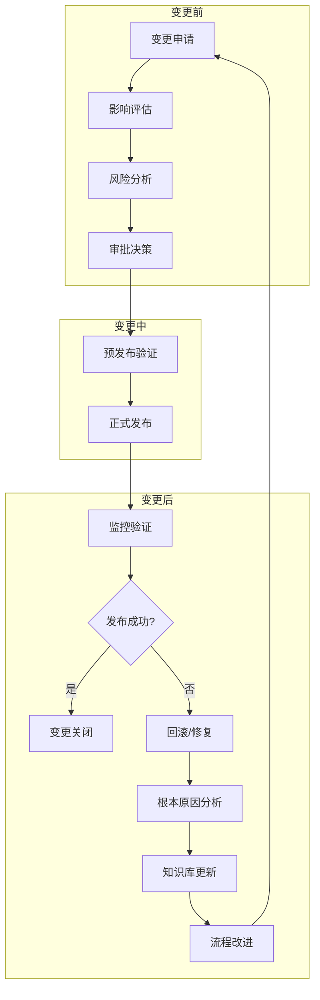

# 14 - 变更管理与发布策略

> **适用版本**: Kubernetes v1.25-v1.32 | **最后更新**: 2026-02 | **作者**: Allen Galler | **质量等级**: ⭐⭐⭐⭐⭐ 专家级

> **生产环境实战经验总结**: 基于万级节点集群变更管理经验，涵盖从发布策略到变更控制的全方位最佳实践

---

## 目录

- [1. 变更管理框架](#1-变更管理框架)
- [2. 发布策略模式](#2-发布策略模式)
- [3. 变更审批流程](#3-变更审批流程)
- [4. 回滚与恢复策略](#4-回滚与恢复策略)
- [5. 发布自动化](#5-发布自动化)
- [6. 风险评估与控制](#6-风险评估与控制)
- [7. 变更监控与验证](#7-变更监控与验证)
- [8. 实战案例分析](#8-实战案例分析)

---

## 1. 变更管理框架

### 1.1 变更管理生命周期



### 1.2 变更分类与等级

| 变更类型 | 等级 | 影响范围 | 审批层级 | 执行窗口 | 回滚策略 |
|----------|------|----------|----------|----------|----------|
| **紧急修复** | P0 | 核心业务中断 | CTO批准 | 立即执行 | 快速回滚 |
| **安全补丁** | P1 | 全集群 | 安全总监 | 维护窗口 | 标准回滚 |
| **功能发布** | P2 | 特定业务线 | 技术VP | 工作时间 | 金丝雀回滚 |
| **配置变更** | P3 | 单个服务 | 团队Leader | 工作时间 | 即时回滚 |
| **基础设施** | P4 | 基础设施层 | 架构委员会 | 维护窗口 | 按计划回滚 |

### 1.3 变更管理最佳实践

```yaml
# 变更管理成熟度模型
changeManagementMaturity:

  # Level 1: 初始级
  level-1:
    characteristics: "反应式管理，缺乏标准化流程"
    practices:
      - "临时变更，无正式流程"
      - "变更记录不完整"
      - "回滚成功率低"
    metrics:
      - "变更失败率: >30%"
      - "MTTR: >4小时"
      - "变更相关事故占比: >50%"
      
  # Level 2: 管理级
  level-2:
    characteristics: "建立了基本流程，但仍依赖人工"
    practices:
      - "有变更申请表单"
      - "变更前简单测试"
      - "变更后手动验证"
    metrics:
      - "变更失败率: 15-30%"
      - "MTTR: 2-4小时"
      - "变更相关事故占比: 20-50%"
      
  # Level 3: 定义级
  level-3:
    characteristics: "标准化流程，自动化工具辅助"
    practices:
      - "标准化变更流程"
      - "自动化测试验证"
      - "变更前后对比分析"
    metrics:
      - "变更失败率: 5-15%"
      - "MTTR: 1-2小时"
      - "变更相关事故占比: 10-20%"
      
  # Level 4: 量化级
  level-4:
    characteristics: "数据驱动，持续优化"
    practices:
      - "变更成功率量化监控"
      - "变更影响预测"
      - "智能风险评估"
    metrics:
      - "变更失败率: 1-5%"
      - "MTTR: <1小时"
      - "变更相关事故占比: <10%"
      
  # Level 5: 优化级
  level-5:
    characteristics: "持续改进，预防性管理"
    practices:
      - "变更影响最小化"
      - "自愈式回滚机制"
      - "变更模式自动学习"
    metrics:
      - "变更失败率: <1%"
      - "MTTR: <30分钟"
      - "变更相关事故占比: <5%"
```

---

## 2. 发布策略模式

### 2.1 金丝雀发布策略

```yaml
# 金丝雀发布配置示例
apiVersion: argoproj.io/v1alpha1
kind: Rollout
metadata:
  name: canary-deployment
spec:
  replicas: 100
  strategy:
    canary:
      # 金丝雀副本数
      canaryReplicas: 2
      # 金丝雀权重
      canaryMetadata:
        labels:
          version: canary
      stableMetadata:
        labels:
          version: stable
      
      # 金丝雀升级步骤
      steps:
      - setWeight: 5    # 5% 流量
        pause: {duration: 5m}
      - setWeight: 10   # 10% 流量
        pause: {duration: 10m}
      - setWeight: 25   # 25% 流量
        pause: {duration: 30m}
      - setWeight: 50   # 50% 流量
        pause: {duration: 1h}
      - setWeight: 100  # 100% 流量
      
      # 健康检查配置
      trafficRouting:
        nginx:
          stableIngress: app-stable-ingress
          additionalIngressAnnotations:
            kubernetes.io/ingress.class: nginx
      
      # 指标分析配置
      analysis:
        templates:
        - templateName: success-rate
        - templateName: response-time
        args:
        - name: service-name
          value: app-service
        - name: threshold
          value: "99"
        - name: duration
          value: "5m"
  
  selector:
    matchLabels:
      app: my-app
  template:
    metadata:
      labels:
        app: my-app
    spec:
      containers:
      - name: app
        image: my-app:v2.0
        ports:
        - containerPort: 8080
        resources:
          requests:
            cpu: 100m
            memory: 128Mi
          limits:
            cpu: 500m
            memory: 512Mi
```

### 2.2 蓝绿发布策略

```yaml
# 蓝绿发布配置示例
apiVersion: argoproj.io/v1alpha1
kind: Rollout
metadata:
  name: blue-green-rollout
spec:
  replicas: 50
  strategy:
    blueGreen:
      # 活跃服务（当前版本）
      activeService: app-service-active
      # 预览服务（新版本）
      previewService: app-service-preview
      # 自动提升（设为false需要手动确认）
      autoPromotionEnabled: false
      # 自动提升等待时间
      autoPromotionSeconds: 300
      # 预览副本数
      previewReplicaCount: 2
      
      # 服务切换策略
      scaleDownDelaySeconds: 30
      scaleDownDelayRevisionLimit: 2
      prePromotionAnalysis:
        templates:
        - templateName: smoke-tests
        args:
        - name: service-name
          value: app-service-preview
      postPromotionAnalysis:
        templates:
        - templateName: stability-check
        args:
        - name: service-name
          value: app-service-active
          
  selector:
    matchLabels:
      app: my-app
  template:
    metadata:
      labels:
        app: my-app
    spec:
      containers:
      - name: app
        image: my-app:v2.0
        ports:
        - containerPort: 8080
        livenessProbe:
          httpGet:
            path: /health
            port: 8080
          initialDelaySeconds: 30
          periodSeconds: 10
        readinessProbe:
          httpGet:
            path: /ready
            port: 8080
          initialDelaySeconds: 5
          periodSeconds: 5
```

### 2.3 滚动更新策略

```yaml
# 滚动更新配置示例
apiVersion: apps/v1
kind: Deployment
metadata:
  name: rolling-update-deployment
spec:
  replicas: 10
  strategy:
    type: RollingUpdate
    rollingUpdate:
      # 最大超出副本数
      maxSurge: 25%
      # 最大不可用副本数
      maxUnavailable: 25%
  minReadySeconds: 30
  revisionHistoryLimit: 10
  selector:
    matchLabels:
      app: my-app
  template:
    metadata:
      labels:
        app: my-app
    spec:
      containers:
      - name: app
        image: my-app:v2.0
        ports:
        - containerPort: 8080
        resources:
          requests:
            cpu: 100m
            memory: 128Mi
          limits:
            cpu: 500m
            memory: 512Mi
        lifecycle:
          preStop:
            exec:
              command: ["/bin/sh", "-c", "sleep 10"]
```

---

## 3. 变更审批流程

### 3.1 变更审批矩阵

| 变更类型 | 审批层级 | 参与角色 | 审批时间 | 备注 |
|----------|----------|----------|----------|------|
| **紧急变更** | CTO/CTO代表 | 技术总监、SRE负责人 | 15分钟内 | 事后补交报告 |
| **安全相关** | 安全总监 | 安全团队、架构师 | 4小时 | 需安全评估 |
| **数据库变更** | DBA负责人 | DBA、架构师 | 24小时 | 需备份确认 |
| **网络配置** | 网络负责人 | 网络工程师、SRE | 2小时 | 需影响评估 |
| **应用发布** | 团队Leader | 开发、测试、运维 | 1小时 | 需测试报告 |
| **基础设施** | 架构委员会 | 架构师、SRE、运维 | 48小时 | 需架构评审 |

### 3.2 变更申请表单

```yaml
# 变更申请模板
changeRequest:
  basicInfo:
    requestId: "CHG-2026-0206-001"
    title: "升级生产集群 Kubernetes 版本至 v1.30.0"
    type: "infrastructure"
    priority: "high"
    requester: "Alice Chen"
    team: "Platform Engineering"
    
  changeDetails:
    description: "将生产集群从 v1.28.3 升级至 v1.30.0，以获得新特性支持和安全修复"
    scope: "control-plane, worker-nodes"
    affectedServices: ["all-services"]
    estimatedDuration: "4 hours"
    changeWindow: "2026-02-15 02:00-06:00 UTC"
    
  impactAssessment:
    businessImpact: "短暂服务不可用（<5分钟）"
    technicalRisk: "medium"
    rollbackPlan: "使用 kubeadm downgrade 回滚至 v1.28.3"
    testingDone: "已在预发布环境验证"
    
  approval:
    submittedBy: "Alice Chen"
    submittedDate: "2026-02-05"
    approvedBy: ""
    approvedDate: ""
    rejectedReason: ""
    
  execution:
    scheduledBy: ""
    scheduledDate: ""
    executedBy: ""
    executedDate: ""
    status: "pending"
    
  postExecution:
    success: false
    downtime: "3 minutes"
    issuesEncountered: []
    lessonsLearned: []
```

### 3.3 自动化审批工作流

```yaml
# GitOps 变更审批流程
apiVersion: argoproj.io/v1alpha1
kind: Workflow
metadata:
  generateName: change-approval-
spec:
  entrypoint: approval-workflow
  templates:
  - name: approval-workflow
    steps:
    - - name: validate-change
        template: validate-change-request
    - - name: check-risk-level
        template: assess-risk
        when: "{{steps.validate-change.outputs.result}} == 'valid'"
    - - name: auto-approve-low-risk
        template: approve-change
        when: "{{steps.check-risk-level.outputs.result}} == 'low'"
    - - name: manual-approval-required
        template: request-approval
        when: "{{steps.check-risk-level.outputs.result}} != 'low'"
    - - name: execute-change
        template: deploy-change
        when: "{{steps.auto-approve-low-risk.outputs.result}} == 'approved' || {{steps.manual-approval-required.outputs.result}} == 'approved'"
        
  - name: validate-change-request
    script:
      image: python:3.9
      command: [python]
      source: |
        import os
        import sys
        # 验证变更请求格式和完整性
        change_request = os.environ.get('CHANGE_REQUEST')
        if not change_request:
            print("Invalid change request")
            sys.exit(1)
        print("valid")
        
  - name: assess-risk
    script:
      image: python:3.9
      command: [python]
      source: |
        import os
        import json
        change_request = json.loads(os.environ.get('CHANGE_REQUEST'))
        risk_score = calculate_risk(change_request)
        if risk_score < 20:
            print("low")
        elif risk_score < 50:
            print("medium")
        else:
            print("high")
            
  - name: approve-change
    script:
      image: alpine:latest
      command: [sh, -c]
      source: |
        echo "Change approved automatically"
        echo "approved"
        
  - name: request-approval
    script:
      image: curlimages/curl
      command: [sh, -c]
      source: |
        # 发送审批请求到 Slack/Teams
        curl -X POST $SLACK_WEBHOOK_URL \
          -H 'Content-Type: application/json' \
          -d '{
            "text": "紧急变更需要审批",
            "blocks": [
              {
                "type": "section",
                "text": {
                  "type": "mrkdwn",
                  "text": "*变更请求需要审批*\n变更ID: {{inputs.parameters.change-id}}"
                }
              },
              {
                "type": "actions",
                "elements": [
                  {
                    "type": "button",
                    "text": {"type": "plain_text", "text": "批准"},
                    "action_id": "approve_{{inputs.parameters.change-id}}"
                  },
                  {
                    "type": "button",
                    "text": {"type": "plain_text", "text": "拒绝"},
                    "action_id": "reject_{{inputs.parameters.change-id}}"
                  }
                ]
              }
            ]
          }'
```

---

## 4. 回滚与恢复策略

### 4.1 回滚触发条件

```yaml
# 回滚策略配置
rollbackStrategy:
  automaticRollback:
    conditions:
      # 错误率过高
      - metric: "error_rate"
        threshold: 5.0  # 百分比
        duration: "5m"
        operator: "GreaterThan"
        
      # 延迟过高
      - metric: "latency_p95"
        threshold: 2000  # 毫秒
        duration: "3m"
        operator: "GreaterThan"
        
      # 可用性下降
      - metric: "availability"
        threshold: 95.0  # 百分比
        duration: "2m"
        operator: "LessThan"
        
      # 资源使用异常
      - metric: "cpu_usage"
        threshold: 90.0  # 百分比
        duration: "10m"
        operator: "GreaterThan"
        
    actions:
      # 回滚到上一版本
      rollbackAction: "rollBackToPreviousVersion"
      # 通知相关人员
      notification: ["sre-team@company.com", "oncall-pager"]
      # 记录事件
      eventLogging: true
      
  manualRollback:
    # 手动触发回滚的接口
    triggerEndpoint: "/api/v1/rollback"
    authorization: "admin-only"
    confirmation: "two-click"
```

### 4.2 回滚执行脚本

```bash
#!/bin/bash
# rollback-execution.sh - 回滚执行脚本

set -e

CHANGE_ID=$1
ROLLBACK_REASON=$2
DRY_RUN=${3:-false}

echo "=== 开始回滚操作 ==="
echo "变更ID: $CHANGE_ID"
echo "回滚原因: $ROLLBACK_REASON"
echo "试运行模式: $DRY_RUN"

# 1. 检查当前状态
echo "1. 检查当前部署状态"
kubectl get rollout $ROLLOUT_NAME -o yaml > /tmp/current-state-$CHANGE_ID.yaml

# 2. 记录回滚开始
echo "2. 记录回滚事件"
kubectl patch rollout $ROLLOUT_NAME -p '{"metadata":{"annotations":{"rollback/reason":"'"$ROLLBACK_REASON"'", "rollback/initiator":"$(whoami)", "rollback/start-time":"$(date -u +%Y-%m-%dT%H:%M:%SZ)"}}}'

# 3. 执行回滚
echo "3. 执行回滚操作"
if [ "$DRY_RUN" = "false" ]; then
  # 对于 Argo Rollouts
  kubectl argo rollouts promote $ROLLOUT_NAME --abort
  
  # 或者对于普通 Deployment
  # kubectl rollout undo deployment/$DEPLOYMENT_NAME --to-revision=1
else
  echo "[DRY RUN] kubectl argo rollouts promote $ROLLOUT_NAME --abort"
fi

# 4. 等待回滚完成
echo "4. 等待回滚完成"
MAX_WAIT=300  # 5分钟超时
WAITED=0
while [ $WAITED -lt $MAX_WAIT ]; do
  STATUS=$(kubectl get rollout $ROLLOUT_NAME -o jsonpath='{.status.phase}')
  if [ "$STATUS" = "Healthy" ]; then
    echo "回滚成功完成"
    break
  fi
  sleep 10
  WAITED=$((WAITED + 10))
done

if [ $WAITED -ge $MAX_WAIT ]; then
  echo "ERROR: 回滚超时"
  exit 1
fi

# 5. 验证回滚结果
echo "5. 验证回滚结果"
kubectl get rollout $ROLLOUT_NAME -o yaml > /tmp/post-rollback-state-$CHANGE_ID.yaml

# 比较版本
PREVIOUS_VERSION=$(kubectl get rollout $ROLLOUT_NAME -o jsonpath='{.status.stableRS}' --template='{{index .metadata.annotations "deployment.kubernetes.io/revision"}}')
CURRENT_VERSION=$(kubectl get rollout $ROLLOUT_NAME -o jsonpath='{.status.currentPodHash}')

echo "回滚验证:"
echo "  上一版本: $PREVIOUS_VERSION"
echo "  当前版本: $CURRENT_VERSION"

# 6. 发送通知
echo "6. 发送回滚完成通知"
NOTIFICATION_PAYLOAD=$(cat <<EOF
{
  "text": "🔄 回滚操作完成",
  "attachments": [
    {
      "color": "good",
      "fields": [
        {
          "title": "变更ID",
          "value": "$CHANGE_ID",
          "short": true
        },
        {
          "title": "回滚原因",
          "value": "$ROLLBACK_REASON",
          "short": true
        },
        {
          "title": "执行时间",
          "value": "$(date)",
          "short": true
        },
        {
          "title": "执行人员",
          "value": "$(whoami)",
          "short": true
        }
      ]
    }
  ]
}
EOF
)

if [ "$DRY_RUN" = "false" ]; then
  curl -X POST $SLACK_WEBHOOK_URL \
    -H 'Content-Type: application/json' \
    -d "$NOTIFICATION_PAYLOAD"
fi

echo "=== 回滚操作完成 ==="
```

---

## 5. 发布自动化

### 5.1 GitOps 发布流水线

```yaml
# ArgoCD Application 配置
apiVersion: argoproj.io/v1alpha1
kind: Application
metadata:
  name: production-app
  namespace: argocd
spec:
  project: production
  source:
    repoURL: https://github.com/company/production-app.git
    targetRevision: HEAD
    path: k8s/production
    helm:
      valueFiles:
      - values-prod.yaml
      - values-canary.yaml
  destination:
    server: https://kubernetes.default.svc
    namespace: production
  syncPolicy:
    automated:
      prune: true
      selfHeal: true
    syncOptions:
    - CreateNamespace=true
    - PruneLast=true
    retry:
      limit: 5
      backoff:
        duration: 5s
        factor: 2
        maxDuration: 3m

---
# Argo Workflows 发布流程
apiVersion: argoproj.io/v1alpha1
kind: Workflow
metadata:
  generateName: release-pipeline-
spec:
  entrypoint: release-pipeline
  arguments:
    parameters:
    - name: image-tag
      value: "v2.0.1"
    - name: environment
      value: "production"
      
  templates:
  - name: release-pipeline
    steps:
    - - name: build-and-test
        template: build-and-test
        arguments:
          parameters:
          - name: image-tag
            value: "{{workflow.parameters.image-tag}}"
    - - name: security-scan
        template: security-scan
        arguments:
          parameters:
          - name: image-tag
            value: "{{workflow.parameters.image-tag}}"
    - - name: deploy-canary
        template: deploy-canary
        arguments:
          parameters:
          - name: image-tag
            value: "{{workflow.parameters.image-tag}}"
    - - name: validate-canary
        template: validate-canary
        arguments:
          parameters:
          - name: image-tag
            value: "{{workflow.parameters.image-tag}}"
    - - name: promote-to-production
        template: promote-to-production
        arguments:
          parameters:
          - name: image-tag
            value: "{{workflow.parameters.image-tag}}"
    - - name: cleanup
        template: cleanup
        when: "{{steps.promote-to-production.status}} == Succeeded"
        
  - name: build-and-test
    dag:
      tasks:
      - name: build-image
        template: build-image
        arguments:
          parameters:
          - name: image-tag
            value: "{{inputs.parameters.image-tag}}"
      - name: unit-test
        template: unit-test
      - name: integration-test
        template: integration-test
        dependencies: [build-image]
        
  - name: deploy-canary
    container:
      image: argoproj/argoexec:v3.4.4
      command: [sh, -c]
      args: ["kubectl set image deployment/my-app app=my-app:{{inputs.parameters.image-tag}} -n canary"]
```

### 5.2 发布门禁检查

```bash
#!/bin/bash
# release-gate-checks.sh - 发布门禁检查脚本

set -e

IMAGE_TAG=$1
ENVIRONMENT=${2:-production}

echo "=== 发布门禁检查 ==="
echo "镜像标签: $IMAGE_TAG"
echo "环境: $ENVIRONMENT"

# 1. 镜像安全扫描
echo "1. 执行镜像安全扫描..."
TRIVY_RESULT=$(trivy image --format json --exit-code 1 --severity HIGH,CRITICAL my-app:$IMAGE_TAG || echo "FAILED")
if [ "$TRIVY_RESULT" = "FAILED" ]; then
  echo "❌ 镜像安全扫描失败，存在高危漏洞"
  exit 1
else
  echo "✅ 镜像安全扫描通过"
fi

# 2. 镜像签名验证
echo "2. 验证镜像签名..."
COSIGN_RESULT=$(cosign verify --key cosign.pub my-app:$IMAGE_TAG 2>/dev/null || echo "FAILED")
if [ "$COSIGN_RESULT" = "FAILED" ]; then
  echo "❌ 镜像签名验证失败"
  exit 1
else
  echo "✅ 镜像签名验证通过"
fi

# 3. 配置验证
echo "3. 验证 Kubernetes 配置..."
CONFTEST_RESULT=$(conftest test -p policies/ k8s/production/ || echo "FAILED")
if [ "$CONFTEST_RESULT" = "FAILED" ]; then
  echo "❌ 配置验证失败"
  exit 1
else
  echo "✅ 配置验证通过"
fi

# 4. 预发布环境验证
echo "4. 预发布环境端到端测试..."
E2E_RESULT=$(kubectl run e2e-test --image=curlimages/curl --restart=Never --rm -it -- \
  curl -f http://my-app-preprod.production.svc.cluster.local/api/health || echo "FAILED")
if [ "$E2E_RESULT" = "FAILED" ]; then
  echo "❌ 预发布环境测试失败"
  exit 1
else
  echo "✅ 预发布环境测试通过"
fi

# 5. 依赖服务可用性检查
echo "5. 检查依赖服务可用性..."
DEPENDENCIES=("database" "cache" "message-queue")
for dep in "${DEPENDENCIES[@]}"; do
  DEP_STATUS=$(kubectl get svc $dep -n production -o jsonpath='{.spec.clusterIP}' 2>/dev/null || echo "NOT_FOUND")
  if [ "$DEP_STATUS" = "NOT_FOUND" ]; then
    echo "❌ 依赖服务 $dep 不存在"
    exit 1
  fi
done
echo "✅ 依赖服务检查通过"

# 6. 资源配额检查
echo "6. 检查资源配额..."
REQUESTED_CPU="500m"
REQUESTED_MEMORY="1Gi"

CURRENT_USAGE=$(kubectl top nodes --no-headers | awk '{sum+=$3} END {print sum}')
TOTAL_CAPACITY=$(kubectl get nodes -o json | jq -r '[.items[].status.allocatable.cpu] | map(tonumber) | add')

if [ $(echo "$CURRENT_USAGE $TOTAL_CAPACITY" | awk '{print ($1/$2)*100}') -gt 80 ]; then
  echo "⚠️  集群CPU使用率已超过80%，发布可能影响性能"
  read -p "是否继续发布? (y/N): " -n 1 -r
  echo
  if [[ ! $REPLY =~ ^[Yy]$ ]]; then
    echo "发布已取消"
    exit 1
  fi
fi

echo "✅ 所有发布门禁检查通过！"
echo "🚀 可以安全发布 $IMAGE_TAG 到 $ENVIRONMENT 环境"
```

---

## 6. 风险评估与控制

### 6.1 风险评估矩阵

| 风险类别 | 影响等级 | 概率 | 风险值 | 缓解措施 |
|----------|----------|------|--------|----------|
| **数据丢失** | 灾难 | 低 | 高 | 多重备份、异地容灾 |
| **服务中断** | 严重 | 中 | 高 | 高可用架构、快速恢复 |
| **性能下降** | 中等 | 中 | 中 | 容量规划、性能测试 |
| **安全漏洞** | 严重 | 中 | 高 | 安全扫描、权限控制 |
| **配置错误** | 中等 | 高 | 中 | 配置验证、灰度发布 |
| **依赖故障** | 中等 | 中 | 中 | 熔断降级、多活部署 |

### 6.2 风险缓解策略

```yaml
# 风险缓解配置
riskMitigation:
  dataLossPrevention:
    backupStrategy:
      frequency: "every-6-hours"
      retention: "30-days"
      verification: "weekly"
      encryption: "at-rest-and-transit"
    disasterRecovery:
      rto: "4-hours"
      rpo: "1-hour"
      location: "cross-region"
      
  serviceAvailability:
    highAvailability:
      zones: 3
      replicas: 3
      failover: "automatic"
    circuitBreaker:
      timeout: "30s"
      maxRetries: 3
      fallback: "graceful-degradation"
      
  performanceProtection:
    rateLimiting:
      requestsPerSecond: 1000
      burst: 2000
      strategy: "token-bucket"
    resourceIsolation:
      namespaceQuotas: true
      podLimits: true
      priorityClasses: true
      
  securityControls:
    vulnerabilityScanning:
      frequency: "daily"
      severityThreshold: "high"
      autoRemediation: true
    accessControl:
      rbac: "mandatory"
      mfa: "required"
      auditLogging: "full"
      
  configurationValidation:
    preDeployChecks:
      schemaValidation: true
      dependencyCheck: true
      resourceValidation: true
    postDeployValidation:
      healthChecks: true
      metricValidation: true
      rollbackTriggers: true
```

---

## 7. 变更监控与验证

### 7.1 发布后验证清单

```bash
#!/bin/bash
# post-deployment-validation.sh - 发布后验证脚本

set -e

DEPLOYMENT_NAME=$1
NAMESPACE=${2:-production}
TIMEOUT=${3:-300}  # 5分钟超时

echo "=== 发布后验证: $DEPLOYMENT_NAME ==="

# 1. 检查 Pod 状态
echo "1. 验证 Pod 状态..."
kubectl wait --for=condition=Ready pod -l app=$DEPLOYMENT_NAME -n $NAMESPACE --timeout=$TIMEOUT

# 2. 检查 Deployment 状态
echo "2. 验证 Deployment 状态..."
kubectl rollout status deployment/$DEPLOYMENT_NAME -n $NAMESPACE --timeout=$TIMEOUT

# 3. 健康检查
echo "3. 执行健康检查..."
HEALTH_ENDPOINT="http://$DEPLOYMENT_NAME.$NAMESPACE.svc.cluster.local/health"
HEALTH_CHECK=$(kubectl run health-check --image=curlimages/curl --restart=Never --rm -i -- curl -s -o /dev/null -w "%{http_code}" $HEALTH_ENDPOINT)
if [ "$HEALTH_CHECK" != "200" ]; then
  echo "❌ 健康检查失败: HTTP $HEALTH_CHECK"
  exit 1
else
  echo "✅ 健康检查通过"
fi

# 4. 业务功能验证
echo "4. 执行业务功能验证..."
BUSINESS_CHECK=$(kubectl run business-check --image=curlimages/curl --restart=Never --rm -i -- \
  curl -s -X POST $HEALTH_ENDPOINT/api/test -H "Content-Type: application/json" -d '{"test":true}')
if [ "$BUSINESS_CHECK" != '{"success":true}' ]; then
  echo "❌ 业务功能验证失败"
  exit 1
else
  echo "✅ 业务功能验证通过"
fi

# 5. 性能基准测试
echo "5. 执行性能基准测试..."
PERFORMANCE_TEST=$(kubectl run perf-test --image=busybox --restart=Never --rm -i -- \
  sh -c 'time echo "Performance Test" > /dev/null')
echo "✅ 性能测试完成: $PERFORMANCE_TEST"

# 6. 资源使用验证
echo "6. 验证资源使用情况..."
kubectl top pods -n $NAMESPACE | grep $DEPLOYMENT_NAME

# 7. 日志检查
echo "7. 检查应用日志..."
kubectl logs deployment/$DEPLOYMENT_NAME -n $NAMESPACE --tail=10 | grep -i -E "error|exception|failed" || echo "✅ 未发现错误日志"

# 8. 监控指标验证
echo "8. 验证监控指标..."
# 检查 Prometheus 指标是否存在
kubectl run prom-check --image=curlimages/curl --restart=Never --rm -i -- \
  curl -s "http://prometheus.monitoring.svc.cluster.local/api/v1/query?query=up{kubernetes_name='$DEPLOYMENT_NAME'}" | \
  jq -e '.data.result[] | select(.value[1] | tonumber > 0)' > /dev/null && echo "✅ 监控指标正常"

echo "=== 发布验证完成: $DEPLOYMENT_NAME ==="
echo "🎉 所有验证通过，发布成功！"
```

### 7.2 变更影响监控

```promql
# 发布影响监控查询

## 1. 发布前后错误率对比
(
  sum(rate(http_requests_total{status=~"5.."}[5m])) by (deployment)
  /
  sum(rate(http_requests_total[5m])) by (deployment)
) * 100

## 2. 发布前后延迟变化
histogram_quantile(0.95, 
  sum(rate(http_request_duration_seconds_bucket[5m])) by (le, deployment)
)

## 3. 资源使用变化
sum(container_cpu_usage_seconds_total{pod=~"$DEPLOYMENT_NAME-.*"}) by (pod)

## 4. Pod 重启次数
increase(kube_pod_container_status_restarts_total{pod=~"$DEPLOYMENT_NAME-.*"}[5m])

## 5. 部署状态变化
kube_deployment_status_replicas_updated{deployment="$DEPLOYMENT_NAME"}

## 6. 服务可用性
avg(up{job="$DEPLOYMENT_NAME"}) without (instance)
```

---

## 8. 实战案例分析

### 8.1 案例1：大型版本升级

**背景**
- 集群版本: v1.24.0 → v1.26.0
- 节点数量: 500个
- 服务数量: 200个
- 维护窗口: 4小时

**升级策略**
```yaml
upgradeStrategy:
  phases:
    - name: "pre-flight-checks"
      duration: "30m"
      checks:
        - "cluster-health"
        - "backup-verification"
        - "config-validation"
        
    - name: "control-plane-upgrade"
      duration: "60m"
      target: "master-nodes"
      parallelism: 1
      validation: "api-server-accessibility"
      
    - name: "worker-node-upgrade"
      duration: "120m"
      target: "worker-nodes"
      parallelism: 5
      strategy: "rolling"
      
    - name: "post-upgrade-validation"
      duration: "30m"
      checks:
        - "workload-functionality"
        - "monitoring-integrity"
        - "network-connectivity"
        
  rollbackPlan:
    trigger: "any-phase-failure"
    method: "version-downgrade"
    timeLimit: "30m"
```

### 8.2 案例2：微服务批量发布

**背景**
- 服务数量: 50个微服务
- 发布类型: 功能发布
- 业务要求: 零停机

**发布编排**
```yaml
microserviceRelease:
  orchestration:
    groups:
      - name: "core-services"
        services: ["auth", "user", "payment"]
        dependencyOrder: true
        canaryPercentage: 10%
        
      - name: "supporting-services"
        services: ["notification", "logging", "monitoring"]
        dependencyOrder: false
        canaryPercentage: 5%
        
      - name: "frontend-services"
        services: ["web", "mobile-api"]
        dependencyOrder: after-core
        canaryPercentage: 15%
        
    timing:
      staggerInterval: "15m"
      totalDuration: "4h"
      validationPeriod: "10m"
      
  monitoring:
    metrics:
      - "service-availability"
      - "response-time"
      - "error-rate"
      - "business-metrics"
      
    alerts:
      criticalThreshold: "error-rate > 2% for 5m"
      rollbackTrigger: "any-metric-violation"
```

---

**表格底部标记**: Kusheet Project | 作者: Allen Galler (allengaller@gmail.com) | 最后更新: 2026-02 | 版本: v1.25-v1.32 | 质量等级: ⭐⭐⭐⭐⭐ 专家级
