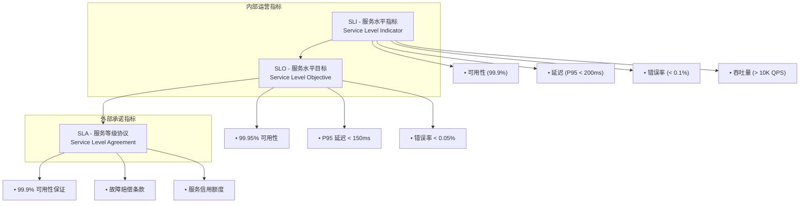
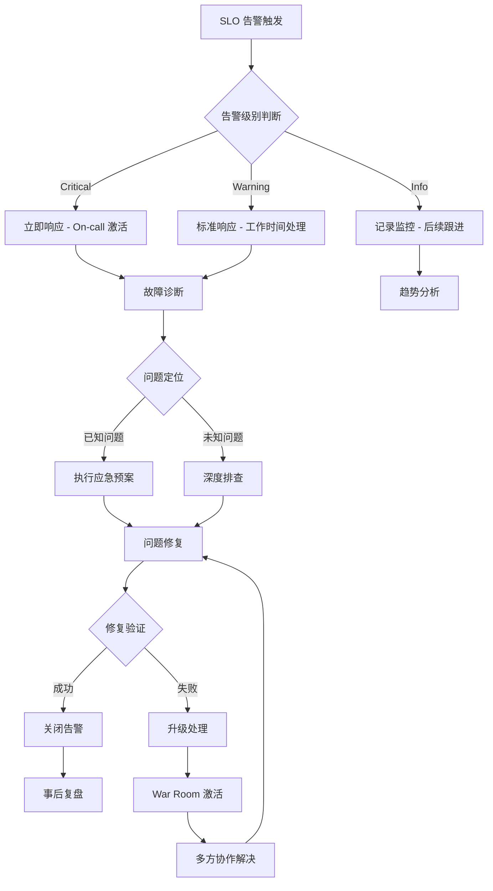

# 15 - SLI/SLO/SLA工程实践

> **适用版本**: Kubernetes v1.25-v1.32 | **最后更新**: 2026-02 | **作者**: Allen Galler | **质量等级**: ⭐⭐⭐⭐⭐ 专家级

> **生产环境实战经验总结**: 基于万级节点集群 SLO 管理经验，涵盖从指标定义到告警响应的全方位最佳实践

---

## 目录

- [1. SLI/SLO/SLA 概念框架](#1-slislosla-概念框架)
- [2. SLI 指标定义与采集](#2-sli-指标定义与采集)
- [3. SLO 设定与管理](#3-slo-设定与管理)
- [4. SLA 合规与问责](#4-sla-合规与问责)
- [5. 错误预算管理](#5-错误预算管理)
- [6. 监控与告警策略](#6-监控与告警策略)
- [7. 告警响应与处理](#7-告警响应与处理)
- [8. 实战案例分析](#8-实战案例分析)

---

## 1. SLI/SLO/SLA 概念框架

### 1.1 三层服务指标体系



### 1.2 指标层次结构

| 层次 | 目标受众 | 使用场景 | 精度要求 | 更新频率 |
|------|----------|----------|----------|----------|
| **SLI** | 运维团队 | 性能监控、容量规划 | 高 | 实时 |
| **SLO** | 产品团队 | 服务发布、功能迭代 | 中 | 分钟级 |
| **SLA** | 客户 | 合同履约、商务谈判 | 低 | 月度/季度 |

### 1.3 SRE 黄金指标

```yaml
# SRE 黄金指标定义
sreGoldenSignals:
  latency:
    description: "请求处理时间"
    measurement:
      - "P50 (median)"
      - "P95 (95th percentile)"
      - "P99 (99th percentile)"
      - "P99.9 (99.9th percentile)"
    collection: "histogram buckets"
    
  traffic:
    description: "系统负载"
    measurement:
      - "requests per second"
      - "transactions per minute"
      - "concurrent connections"
      - "throughput (MB/s)"
    collection: "counter rates"
    
  errors:
    description: "错误率"
    measurement:
      - "rate of errors"
      - "error ratio"
      - "failure count"
      - "exception rate"
    collection: "error counters"
    
  saturation:
    description: "资源饱和度"
    measurement:
      - "CPU utilization"
      - "memory pressure"
      - "disk I/O"
      - "connection pool usage"
    collection: "gauge metrics"
```

---

## 2. SLI 指标定义与采集

### 2.1 核心 SLI 指标定义

```promql
# SLI 指标查询示例

## 1. 可用性 SLI (Availability)
# 分母: 总请求数
availability_denominator = sum(rate(http_requests_total[5m]))

# 分子: 成功请求数 (2xx, 3xx)
availability_numerator = sum(rate(http_requests_total{status=~"^2|^3"}[5m]))

# 可用性 = 成功请求数 / 总请求数
availability_sli = availability_numerator / availability_denominator

## 2. 延迟 SLI (Latency)
# 分母: 总请求数
latency_denominator = sum(rate(http_requests_total[5m]))

# 分子: 满足延迟要求的请求数 (P95 < 200ms)
latency_numerator = histogram_fraction(0.0, 0.2, rate(http_request_duration_seconds_bucket[5m]))

# 延迟满足率
latency_sli = latency_numerator / latency_denominator

## 3. 错误率 SLI (Error Rate)
# 分母: 总请求数
error_denominator = sum(rate(http_requests_total[5m]))

# 分子: 成功请求数
error_numerator = sum(rate(http_requests_total{status!~"^5"}[5m]))

# 成功率
error_sli = error_numerator / error_denominator

## 4. 吞吐量 SLI (Throughput)
# 平均 QPS
throughput_sli = avg(rate(http_requests_total[5m]))
```

### 2.2 SLI 指标采集配置

```yaml
# Prometheus 配置 - SLI 指标采集
global:
  scrape_interval: 15s
  evaluation_interval: 15s

rule_files:
  - "sli_rules.yml"

scrape_configs:
  # 应用服务指标
  - job_name: 'application'
    kubernetes_sd_configs:
      - role: pod
    relabel_configs:
      - source_labels: [__meta_kubernetes_pod_annotation_prometheus_io_scrape]
        action: keep
        regex: true
      - source_labels: [__address__, __meta_kubernetes_pod_annotation_prometheus_io_port]
        action: replace
        regex: ([^:]+)(?::\d+)?;(\d+)
        target_label: __address__
        replacement: $1:$2
    metric_relabel_configs:
      # 过滤掉不必要的标签
      - source_labels: [__name__]
        regex: 'http_requests_total|http_request_duration_seconds_bucket|go_goroutines'
        action: keep

  # 基础设施指标
  - job_name: 'kubernetes-nodes'
    kubernetes_sd_configs:
      - role: node
    relabel_configs:
      - action: labelmap
        regex: __meta_kubernetes_node_label_(.+)

# 记录规则 - SLI 指标预计算
recording_rules:
  # 应用层面
  - record: sli:availability:ratio
    expr: |
      sum(rate(http_requests_total{status=~"^2|^3"}[5m])) 
      / 
      sum(rate(http_requests_total[5m]))
      
  - record: sli:latency:p95
    expr: |
      histogram_quantile(0.95, 
        sum(rate(http_request_duration_seconds_bucket[5m])) by (le, service))
      
  - record: sli:error_rate:ratio
    expr: |
      (sum(rate(http_requests_total{status=~"^5"}[5m])) 
       / 
       sum(rate(http_requests_total[5m]))) * 100
       
  # 基础设施层面
  - record: sli:node_cpu_utilization:ratio
    expr: |
      1 - avg(rate(node_cpu_seconds_total{mode="idle"}[5m]))
      
  - record: sli:node_memory_utilization:ratio
    expr: |
      (node_memory_MemTotal_bytes - node_memory_MemAvailable_bytes) 
      / 
      node_memory_MemTotal_bytes
```

### 2.3 SLI 指标采集最佳实践

```bash
#!/bin/bash
# sli-collection-validation.sh - SLI 指标采集验证脚本

echo "=== SLI 指标采集验证 ==="

# 1. 验证指标存在性
echo "1. 验证关键指标是否存在..."
ESSENTIAL_METRICS=(
    "http_requests_total"
    "http_request_duration_seconds_bucket"
    "up"
    "kube_pod_status_ready"
)

for metric in "${ESSENTIAL_METRICS[@]}"; do
    RESULT=$(curl -s "http://prometheus:9090/api/v1/query?query=count($metric)" | jq -r '.data.result[0].value[1]')
    if [ -z "$RESULT" ] || [ "$RESULT" -eq 0 ]; then
        echo "❌ 指标 $metric 不存在或值为0"
    else
        echo "✅ 指标 $metric 存在 (值: $RESULT)"
    fi
done

# 2. 验证指标标签一致性
echo "2. 验证指标标签一致性..."
LABELS_CHECK=$(curl -s "http://prometheus:9090/api/v1/series?match[]={__name__=\"http_requests_total\"}&limit=10" | jq -r '.data[0] | keys | join(", ")')
echo "http_requests_total 标签: $LABELS_CHECK"

# 3. 验证指标更新频率
echo "3. 验证指标更新频率..."
LAST_UPDATE=$(curl -s "http://prometheus:9090/api/v1/query?query=up" | jq -r '.data.result[0].value[0]')
CURRENT_TIME=$(date +%s)
TIME_DIFF=$((CURRENT_TIME - LAST_UPDATE))

if [ $TIME_DIFF -gt 60 ]; then
    echo "❌ 指标更新延迟: ${TIME_DIFF}s"
else
    echo "✅ 指标更新正常: ${TIME_DIFF}s"
fi

# 4. 验证 SLI 计算规则
echo "4. 验证 SLI 计算规则..."
SLI_RULES=(
    "sli:availability:ratio"
    "sli:latency:p95"
    "sli:error_rate:ratio"
)

for rule in "${SLI_RULES[@]}"; do
    RESULT=$(curl -s "http://prometheus:9090/api/v1/query?query=$rule" | jq -r '.data.result | length')
    if [ "$RESULT" -eq 0 ]; then
        echo "❌ SLI 规则 $rule 未生成数据"
    else
        echo "✅ SLI 规则 $rule 正常 (数据点: $RESULT)"
    fi
done

echo "=== SLI 指标采集验证完成 ==="
```

---

## 3. SLO 设定与管理

### 3.1 SLO 设定框架

```yaml
# SLO 设定模板
serviceLevelObjectives:
  service: "production-app"
  version: "v1.0"
  
  objectives:
    availability:
      target: 99.95  # 99.95% 可用性
      window: "28d"  # 28天窗口期
      indicator:
        numerator: "sum(rate(http_requests_total{status=~'^2|^3'}[5m]))"
        denominator: "sum(rate(http_requests_total[5m]))"
      burnRateAlerts:
        - threshold: 14.4  # 14.4x burn rate = 1 hour alert
          duration: "1h"
          severity: "critical"
        - threshold: 6     # 6x burn rate = 6 hour alert
          duration: "6h"
          severity: "warning"
          
    latency:
      target: 95  # 95% 请求在阈值内
      window: "28d"
      threshold: "0.2"  # 200ms
      indicator:
        numerator: "histogram_fraction(0.0, 0.2, rate(http_request_duration_seconds_bucket[5m]))"
        denominator: "sum(rate(http_requests_total[5m]))"
      burnRateAlerts:
        - threshold: 14.4
          duration: "1h"
          severity: "critical"
          
    errorBudget:
      target: 0.05  # 0.05% 错误率
      window: "28d"
      indicator:
        numerator: "sum(rate(http_requests_total{status=~'^5'}[5m]))"
        denominator: "sum(rate(http_requests_total[5m]))"
      burnRateAlerts:
        - threshold: 14.4
          duration: "1h"
          severity: "critical"
```

### 3.2 SLO 管理工具

```python
#!/usr/bin/env python3
# slo_manager.py - SLO 管理工具

import requests
import json
from datetime import datetime, timedelta
from typing import Dict, List

class SLOManager:
    """SLO 管理器"""
    
    def __init__(self, prometheus_url: str):
        self.prometheus_url = prometheus_url
        
    def calculate_error_budget(self, current_sli: float, slo_target: float) -> float:
        """计算错误预算使用率"""
        error_budget_remaining = slo_target - (100 - current_sli)
        error_budget_consumed = max(0, slo_target - error_budget_remaining)
        error_budget_percentage = (error_budget_consumed / slo_target) * 100
        return error_budget_percentage
    
    def get_current_sli(self, query: str) -> float:
        """获取当前 SLI 值"""
        response = requests.get(f"{self.prometheus_url}/api/v1/query", params={"query": query})
        result = response.json()
        if result['data']['result']:
            return float(result['data']['result'][0]['value'][1]) * 100
        return 0.0
    
    def evaluate_burn_rate(self, slo_target: float, current_sli: float, window_hours: int) -> float:
        """计算错误预算燃烧率"""
        # 计算允许的错误率
        allowed_error_rate = (100 - slo_target) / 100
        
        # 计算实际错误率
        actual_error_rate = (100 - current_sli) / 100
        
        # 计算燃烧率
        if allowed_error_rate > 0:
            burn_rate = actual_error_rate / allowed_error_rate
        else:
            burn_rate = float('inf')
            
        # 考虑时间窗口
        time_factor = 24 / window_hours  # 标准化到24小时
        
        return burn_rate * time_factor
    
    def generate_slo_report(self, service_name: str) -> Dict:
        """生成 SLO 报告"""
        # 获取当前指标
        availability_sli = self.get_current_sli(
            'sum(rate(http_requests_total{status=~"^2|^3"}[1h])) / sum(rate(http_requests_total[1h]))'
        )
        
        # SLO 配置
        slo_config = {
            'availability': {
                'target': 99.95,
                'window': '28d',
                'current': availability_sli
            }
        }
        
        # 计算错误预算
        error_budget = self.calculate_error_budget(availability_sli, slo_config['availability']['target'])
        
        # 计算燃烧率
        burn_rate = self.evaluate_burn_rate(
            slo_config['availability']['target'],
            availability_sli,
            1  # 1小时窗口
        )
        
        report = {
            'service': service_name,
            'timestamp': datetime.now().isoformat(),
            'metrics': {
                'availability': {
                    'sli': availability_sli,
                    'slo_target': slo_config['availability']['target'],
                    'error_budget_remaining': 100 - error_budget,
                    'burn_rate': burn_rate
                }
            },
            'status': 'GREEN' if burn_rate < 1 else 'YELLOW' if burn_rate < 6 else 'RED'
        }
        
        return report

# 使用示例
if __name__ == "__main__":
    manager = SLOManager("http://prometheus:9090")
    report = manager.generate_slo_report("production-app")
    
    print(json.dumps(report, indent=2))
```

---

## 4. SLA 合规与问责

### 4.1 SLA 合规监控

```yaml
# SLA 合规监控配置
apiVersion: monitoring.coreos.com/v1
kind: ServiceMonitor
metadata:
  name: sla-compliance-monitor
  namespace: monitoring
spec:
  selector:
    matchLabels:
      app: sla-monitor
  endpoints:
  - port: metrics
    interval: 30s
    path: /metrics
    relabelings:
    - sourceLabels: [__meta_kubernetes_pod_annotation_prometheus_io_scrape]
      action: keep
      regex: true

---
# SLA 合规性告警规则
groups:
- name: sla_compliance
  rules:
  # SLA 违规告警
  - alert: SLAViolation
    expr: |
      sli:availability:ratio < 0.999  # 低于 SLA 要求的 99.9%
    for: 5m
    labels:
      severity: critical
      category: sla
    annotations:
      summary: "SLA 违规 - 服务可用性低于承诺水平"
      description: "服务 {{ $labels.service }} 可用性 {{ $value | humanizePercentage }} 低于 SLA 要求的 99.9%"
      
  # 错误预算耗尽预警
  - alert: ErrorBudgetDepletionWarning
    expr: |
      (1 - sli:availability:ratio) / (1 - 0.9995) > 0.9  # 错误预算使用超过 90%
    for: 15m
    labels:
      severity: warning
      category: error-budget
    annotations:
      summary: "错误预算即将耗尽"
      description: "服务 {{ $labels.service }} 错误预算已使用 {{ $value | humanizePercentage }}，请注意控制变更节奏"
```

### 4.2 SLA 赔偿机制

```yaml
# SLA 赔偿计算
slaCompensation:
  availabilityTiers:
    - threshold: 99.9
      credit: 10  # 10% 服务费减免
    - threshold: 99.5
      credit: 25  # 25% 服务费减免
    - threshold: 99.0
      credit: 50  # 50% 服务费减免
    - threshold: 95.0
      credit: 100 # 100% 服务费减免
      
  calculationMethod:
    period: "monthly"
    measurement: "calendar-month"
    gracePeriod: "5m"  # 每月允许的宕机宽限期
    
  compensationProcess:
    detection: "automated"
    calculation: "end-of-month"
    application: "next-month-invoice"
    appeal: "customer-request"
    
  reporting:
    customerDashboard: true
    monthlyReport: true
    realTimeAlerts: true
    historicalTrends: true
```

---

## 5. 错误预算管理

### 5.1 错误预算计算

```bash
#!/bin/bash
# error-budget-calculator.sh - 错误预算计算器

SLO_TARGET=${1:-99.95}  # 默认 99.95%
PERIOD_DAYS=${2:-28}    # 默认 28 天

echo "=== 错误预算计算器 ==="
echo "SLO 目标: ${SLO_TARGET}%"
echo "统计周期: ${PERIOD_DAYS} 天"
echo ""

# 计算总分钟数
TOTAL_MINUTES=$(echo "$PERIOD_DAYS * 24 * 60" | bc)

# 计算允许的宕机时间（分钟）
ALLOWED_DOWNTIME=$(echo "scale=2; $TOTAL_MINUTES * (100 - $SLO_TARGET) / 100" | bc)

# 计算允许的宕机时间（小时:分钟）
HOURS=$(echo "$ALLOWED_DOWNTIME / 60" | bc)
MINUTES=$(echo "$ALLOWED_DOWNTIME % 60" | bc)

echo "总时间: $TOTAL_MINUTES 分钟"
echo "允许宕机时间: $HOURS 小时 $MINUTES 分钟"
echo "可用时间: $(echo "$TOTAL_MINUTES - $ALLOWED_DOWNTIME" | bc) 分钟"

# 错误预算燃烧率计算
echo ""
echo "=== 错误预算燃烧率 ==="
echo "燃烧率 1x = 标准速度消耗错误预算"
echo "燃烧率 6x = 6小时消耗完 1个月的错误预算"
echo "燃烧率 14.4x = 1小时消耗完 1个月的错误预算"
```

### 5.2 错误预算策略

```yaml
# 错误预算策略
errorBudgetPolicy:
  allocation:
    # 75% 用于功能发布
    featureReleases: 75
    # 15% 用于维护和优化
    maintenance: 15
    # 10% 用于意外故障
    unplannedOutages: 10
    
  releaseThrottling:
    # 当错误预算使用 > 50% 时
    when50PercentConsumed:
      actions:
        - "暂停非关键功能发布"
        - "增加监控密度"
        - "要求更高测试覆盖率"
        
    # 当错误预算使用 > 90% 时
    when90PercentConsumed:
      actions:
        - "暂停所有非紧急发布"
        - "启用紧急响应模式"
        - "优先修复稳定性问题"
        
    # 当错误预算耗尽时
    whenExhausted:
      actions:
        - "禁止所有变更"
        - "启动稳定性冲刺"
        - "修复根本问题后才能发布"
        
  burnRateTiers:
    green:  # 0-1x burn rate
      description: "正常发布节奏"
      allowedActions: "standard-releases"
      approval: "team-leader"
      
    yellow:  # 1-6x burn rate
      description: "谨慎发布"
      allowedActions: "canary-releases-only"
      approval: "tech-lead"
      
    red:  # >6x burn rate
      description: "紧急模式"
      allowedActions: "emergency-fixes-only"
      approval: "sre-manager"
```

---

## 6. 监控与告警策略

### 6.1 SLO 告警策略

```yaml
# SLO 告警规则
groups:
- name: slo_alerts
  rules:
  
  # 快速燃烧告警（1小时内触发）
  - alert: SLOErrorBudgetBurnFast
    expr: |
      (
        (1 - sli:availability:ratio) 
        / 
        (1 - 0.9995)  # SLO 目标 99.95%
      ) 
      / 
      (1/720)  # 28天窗口内的1小时比例
      > 14.4  # 14.4x 燃烧率
    for: 1m
    labels:
      severity: critical
      category: sli
    annotations:
      summary: "SLO 错误预算快速燃烧"
      description: "服务 {{ $labels.service }} 在 1 小时内燃烧了相当于 1 个月的错误预算"
      
  # 慢速燃烧告警（6小时内触发）
  - alert: SLOErrorBudgetBurnSlow
    expr: |
      (
        (1 - sli:availability:ratio) 
        / 
        (1 - 0.9995)
      ) 
      / 
      (6/720)
      > 6
    for: 5m
    labels:
      severity: warning
      category: sli
    annotations:
      summary: "SLO 错误预算慢速燃烧"
      description: "服务 {{ $labels.service }} 在 6 小时内燃烧了相当于 6 个月的错误预算"
      
  # 延迟 SLO 违规
  - alert: SLOLatencyViolation
    expr: |
      histogram_quantile(0.95, 
        sum(rate(http_request_duration_seconds_bucket[5m])) by (le, service)
      ) > 0.150  # 150ms 阈值
    for: 10m
    labels:
      severity: warning
      category: sli-latency
    annotations:
      summary: "延迟 SLO 违规"
      description: "服务 {{ $labels.service }} P95 延迟 {{ $value }}s 超过 150ms 阈值"
      
  # 错误率 SLO 违规
  - alert: SOLErrorRateViolation
    expr: |
      (sum(rate(http_requests_total{status=~"^5"}[5m])) 
       / 
       sum(rate(http_requests_total[5m]))) * 100 > 0.05  # 0.05% 阈值
    for: 5m
    labels:
      severity: warning
      category: sli-error-rate
    annotations:
      summary: "错误率 SLO 违规"
      description: "服务 {{ $labels.service }} 错误率 {{ $value }}% 超过 0.05% 阈值"
```

### 6.2 监控仪表板配置

```yaml
# Grafana 仪表板配置 - SLO 监控
apiVersion: 1
title: "SLO Dashboard"
panels:
- title: "SLO Overview"
  type: "stat"
  targets:
  - expr: "sli:availability:ratio"
    legendFormat: "可用性"
  - expr: "sli:error_rate:ratio"
    legendFormat: "错误率"
  - expr: "sli:latency:p95"
    legendFormat: "P95延迟"
    
- title: "Error Budget Remaining"
  type: "gauge"
  targets:
  - expr: |
      (0.9995 - (1 - sli:availability:ratio)) / 0.9995 * 100
    legendFormat: "可用性错误预算剩余"
    
- title: "SLO Burn Rate"
  type: "graph"
  targets:
  - expr: |
      ((1 - sli:availability:ratio) / (1 - 0.9995)) / (1/720)
    legendFormat: "28天窗口 1小时燃烧率"
  - expr: |
      ((1 - sli:availability:ratio) / (1 - 0.9995)) / (6/720)
    legendFormat: "28天窗口 6小时燃烧率"
    
- title: "SLI Trend"
  type: "graph"
  targets:
  - expr: "sli:availability:ratio"
    legendFormat: "可用性趋势"
  - expr: "0.9995"
    legendFormat: "SLO 目标"
```

---

## 7. 告警响应与处理

### 7.1 告警分级响应

| 告警级别 | 触发条件 | 响应时间 | 响应团队 | 升级路径 |
|----------|----------|----------|----------|----------|
| **Critical** | SLO 快速燃烧 (>14.4x) | 5分钟 | On-call SRE | Manager (15分钟) |
| **Warning** | SLO 慢速燃烧 (>6x) | 30分钟 | Duty Engineer | SRE Lead (1小时) |
| **Info** | SLO 接近阈值 (>1x) | 4小时 | Service Owner | - |

### 7.2 告警处理流程



### 7.3 告警抑制与路由

```yaml
# Alertmanager 配置 - SLO 告警路由
route:
  group_by: ['alertname', 'service', 'severity']
  group_wait: 30s
  group_interval: 5m
  repeat_interval: 1h
  
  receiver: 'default'
  
  routes:
  - matchers:
    - alertname =~ "SLO.*Violation"
    receiver: 'slo-team'
    group_wait: 10s
    group_interval: 1m
    repeat_interval: 15m
    
    # 根据服务重要性分级
    routes:
    - matchers:
      - service = "critical-service"
      receiver: 'critical-slo-team'
      group_wait: 5s
      repeat_interval: 5m
      
    - matchers:
      - service = "standard-service"
      receiver: 'standard-slo-team'
      group_wait: 30s
      repeat_interval: 30m

receivers:
- name: 'default'
  webhook_configs:
  - url: 'http://alert-handler.company.com/webhook'
  
- name: 'slo-team'
  email_configs:
  - to: 'slo-team@company.com'
    send_resolved: true
    
- name: 'critical-slo-team'
  pagerduty_configs:
  - routing_key: 'critical-slo-key'
    send_resolved: true
```

---

## 8. 实战案例分析

### 8.1 案例1：电商平台 SLO 设计

**业务背景**
- 交易成功率: 99.99%
- 页面加载时间: P95 < 200ms
- 支付成功率: 99.95%
- 服务可用性: 99.9%

**SLO 实现**
```yaml
ecommerceSLOs:
  checkoutService:
    availability:
      target: 99.99
      indicator:
        query: |
          sum(rate(http_requests_total{job="checkout", status=~"^2|^3"}[5m]))
          /
          sum(rate(http_requests_total{job="checkout"}[5m]))
      alerting:
        fastBurn: "14.4x for 1m"
        slowBurn: "6x for 10m"
        
    latency:
      target: 95
      threshold: 0.2  # 200ms
      indicator:
        query: |
          histogram_quantile(0.95,
            sum(rate(checkout_request_duration_seconds_bucket[5m])) by (le)
          ) < 0.2
      alerting:
        violation: "0.2s for 5m"
        
  paymentService:
    successRate:
      target: 99.95
      indicator:
        query: |
          sum(rate(payment_requests_total{status="success"}[5m]))
          /
          sum(rate(payment_requests_total[5m]))
      alerting:
        violation: "below 99.95% for 2m"
        
    errorBudget:
      allocation: 0.05  # 0.05% 错误预算
      burnRateAlerts:
        - threshold: 14.4
          duration: "1m"
          action: "immediate-investigation"
        - threshold: 6
          duration: "10m" 
          action: "release-freeze"
```

### 8.2 案例2：SLO 驱动的发布决策

**场景**: 新功能发布决策流程

```python
# slo_driven_release.py - SLO 驱动的发布决策

class SLODrivenRelease:
    def __init__(self, slo_manager):
        self.slo_manager = slo_manager
        
    def can_release(self, service_name: str, release_risk: float) -> bool:
        """
        基于 SLO 状态决定是否可以发布
        
        Args:
            service_name: 服务名称
            release_risk: 发布风险评估 (0-1)
            
        Returns:
            bool: 是否可以发布
        """
        report = self.slo_manager.generate_slo_report(service_name)
        
        # 获取当前错误预算使用情况
        error_budget_remaining = report['metrics']['availability']['error_budget_remaining']
        
        # 根据风险等级计算需要的错误预算
        if release_risk < 0.1:  # 低风险
            required_budget = 5.0
        elif release_risk < 0.3:  # 中风险
            required_budget = 15.0
        else:  # 高风险
            required_budget = 30.0
            
        if error_budget_remaining < required_budget:
            print(f"❌ 发布阻止: 错误预算不足。需要 {required_budget}%, 剩余 {error_budget_remaining}%")
            return False
        else:
            print(f"✅ 可以发布: 错误预算充足。需要 {required_budget}%, 剩余 {error_budget_remaining}%")
            return True
            
    def calculate_release_window(self, service_name: str) -> dict:
        """计算安全发布窗口"""
        report = self.slo_manager.generate_slo_report(service_name)
        burn_rate = report['metrics']['availability']['burn_rate']
        
        if burn_rate < 1:
            window = "standard"  # 标准发布窗口
            approval_level = "team"
        elif burn_rate < 6:
            window = "maintenance"  # 维护窗口
            approval_level = "lead"
        else:
            window = "blocked"  # 发布冻结
            approval_level = "manager"
            
        return {
            "window": window,
            "approval_required": approval_level,
            "safety_margin": max(0, 100 - burn_rate * 10)
        }

# 使用示例
release_controller = SLODrivenRelease(slo_manager)
can_release = release_controller.can_release("checkout-service", 0.2)
window_info = release_controller.calculate_release_window("checkout-service")

print(f"是否可以发布: {can_release}")
print(f"发布窗口: {window_info}")
```

---

**表格底部标记**: Kusheet Project | 作者: Allen Galler (allengaller@gmail.com) | 最后更新: 2026-02 | 版本: v1.25-v1.32 | 质量等级: ⭐⭐⭐⭐⭐ 专家级
