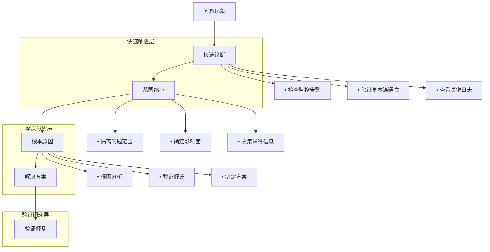

# 16 - 生产环境故障排查剧本

> **适用版本**: Kubernetes v1.25-v1.32 | **最后更新**: 2026-02 | **作者**: Allen Galler | **质量等级**: ⭐⭐⭐⭐⭐ 专家级

> **生产环境实战经验总结**: 基于万级节点集群故障排查经验，涵盖从常见故障到复杂问题的全方位排查剧本

---

## 目录

- [1. 故障排查方法论](#1-故障排查方法论)
- [2. 系统级故障排查](#2-系统级故障排查)
- [3. 网络故障排查](#3-网络故障排查)
- [4. 存储故障排查](#4-存储故障排查)
- [5. 应用故障排查](#5-应用故障排查)
- [6. 控制平面故障排查](#6-控制平面故障排查)
- [7. 性能问题排查](#7-性能问题排查)
- [8. 实战案例分析](#8-实战案例分析)

---

## 1. 故障排查方法论

### 1.1 故障排查金字塔



### 1.2 故障排查工具箱

| 工具类别 | 推荐工具 | 使用场景 | 熟练度要求 |
|----------|----------|----------|------------|
| **监控观测** | Prometheus, Grafana | 指标分析 | 必需 |
| **日志分析** | ELK Stack, Loki | 日志检索 | 必需 |
| **网络诊断** | tcpdump, Wireshark, netstat | 网络问题 | 进阶 |
| **系统调试** | strace, lsof, top | 系统问题 | 进阶 |
| **容器调试** | crictl, ctr | 容器问题 | 专家 |
| **K8s调试** | kubectl, stern | 集群问题 | 专家 |

### 1.3 故障排查最佳实践

```bash
#!/bin/bash
# troubleshooting-best-practices.sh - 故障排查最佳实践脚本

echo "=== 故障排查最佳实践 ==="

# 1. 信息收集清单
INFO_COLLECTION=(
    "故障现象描述"
    "影响范围统计"
    "发生时间点"
    "最近变更记录"
    "相关日志片段"
    "监控指标截图"
    "网络拓扑图"
    "系统配置信息"
)

echo "信息收集清单:"
for i in "${!INFO_COLLECTION[@]}"; do
    printf "%2d. %s\n" $((i+1)) "${INFO_COLLECTION[$i]}"
done

# 2. 故障分类快速检查
echo ""
echo "=== 快速分类检查 ==="

# 检查节点状态
echo "节点状态:"
kubectl get nodes -o wide

# 检查系统组件
echo ""
echo "系统组件状态:"
kubectl get pods -n kube-system

# 检查 API 服务器
echo ""
echo "API 服务器健康检查:"
kubectl get --raw='/healthz'

# 检查 etcd
echo ""
echo "etcd 健康检查:"
kubectl get --raw='/healthz/etcd'

echo ""
echo "=== 故障排查原则 ==="
echo "1. 先易后难：从最可能的原因开始"
echo "2. 先软后硬：优先检查配置而非硬件"
echo "3. 先内后外：先检查集群内部再检查外部依赖"
echo "4. 先恢复后分析：优先恢复服务再深入分析"
echo "5. 记录过程：详细记录排查步骤和发现"
```

---

## 2. 系统级故障排查

### 2.1 节点故障排查

#### 剧本1：节点 NotReady 故障

**故障现象**
```bash
# 节点状态显示 NotReady
$ kubectl get nodes
NAME              STATUS     ROLES    AGE   VERSION
node-1            Ready      <none>   30d   v1.28.0
node-2            NotReady   <none>   30d   v1.28.0  ← 故障节点
node-3            Ready      <none>   30d   v1.28.0
```

**快速诊断脚本**
```bash
#!/bin/bash
# node-troubleshooting.sh - 节点故障快速诊断

NODE_NAME=$1
echo "=== 节点 $NODE_NAME 故障诊断 ==="

# 1. 检查节点详细状态
echo "1. 节点详细状态:"
kubectl describe node $NODE_NAME

# 2. 检查节点系统服务
echo "2. 检查 kubelet 状态:"
ssh $NODE_NAME "systemctl status kubelet"

# 3. 检查 kubelet 日志
echo "3. 检查 kubelet 日志:"
ssh $NODE_NAME "journalctl -u kubelet -n 50 --no-pager"

# 4. 检查节点资源
echo "4. 检查节点资源使用:"
ssh $NODE_NAME "
  echo '磁盘使用:'
  df -h
  echo ''
  echo '内存使用:'
  free -h
  echo ''
  echo '进程状态:'
  ps aux | grep -E '(kubelet|containerd|docker)' | head -10
"

# 5. 检查网络连接
echo "5. 检查网络连接:"
ssh $NODE_NAME "
  echo '网络接口:'
  ip addr show
  echo ''
  echo '路由表:'
  ip route show
  echo ''
  echo 'DNS 解析:'
  nslookup kubernetes.default.svc.cluster.local
"

# 6. 检查容器运行时
echo "6. 检查容器运行时:"
ssh $NODE_NAME "
  echo '容器运行时状态:'
  systemctl status containerd
  echo ''
  echo '容器列表:'
  crictl ps -a | head -20
"
```

**常见原因及解决方案**

| 原因 | 诊断命令 | 解决方案 |
|------|----------|----------|
| **磁盘空间不足** | `df -h` | 清理磁盘、扩容存储 |
| **内存压力** | `free -h` | 增加内存、驱逐Pod |
| **kubelet 服务异常** | `systemctl status kubelet` | 重启服务、检查配置 |
| **网络配置错误** | `ip addr show` | 修复网络配置 |
| **时间同步问题** | `timedatectl status` | 启用NTP同步 |

#### 剧本2：节点资源耗尽

**诊断脚本**
```bash
#!/bin/bash
# resource-starvation-troubleshooting.sh - 资源耗尽诊断

NODE_NAME=$1
echo "=== 节点 $NODE_NAME 资源耗尽诊断 ==="

# 1. 检查节点资源使用
echo "1. 节点资源使用详情:"
kubectl describe node $NODE_NAME | grep -A 20 "Allocated resources"

# 2. 检查节点压力状态
echo "2. 节点压力状态:"
kubectl describe node $NODE_NAME | grep -A 10 "Conditions"

# 3. 检查节点上的 Pod
echo "3. 节点上的 Pod 列表:"
kubectl get pods -o wide --field-selector spec.nodeName=$NODE_NAME

# 4. 检查 Pod 资源使用
echo "4. Pod 资源使用详情:"
kubectl top pods --field-selector spec.nodeName=$NODE_NAME

# 5. 检查节点系统指标
echo "5. 系统指标检查:"
ssh $NODE_NAME "
  echo 'CPU 详细:'
  top -bn1 | head -20
  echo ''
  echo '内存详细:'
  cat /proc/meminfo | head -10
  echo ''
  echo '磁盘 I/O:'
  iostat -x 1 3
"
```

### 2.2 系统性能问题排查

#### 剧本3：CPU 使用率过高

**快速诊断**
```bash
#!/bin/bash
# high-cpu-troubleshooting.sh - 高CPU使用率诊断

echo "=== 高CPU使用率诊断 ==="

# 1. 检查节点CPU使用率
echo "1. 节点CPU使用率:"
kubectl top nodes

# 2. 检查Pod CPU使用率
echo "2. Pod CPU使用率排名:"
kubectl top pods --all-namespaces --sort-by=cpu | head -20

# 3. 检查CPU密集型进程
echo "3. 节点上CPU密集型进程:"
for node in $(kubectl get nodes -o jsonpath='{.items[*].metadata.name}'); do
  echo "节点 $node:"
  ssh $node "top -b -n 1 | head -20"
done

# 4. 检查CPU节流
echo "4. 检查CPU节流情况:"
kubectl get pods --all-namespaces -o json | \
  jq -r '.items[] | select(.status.containerStatuses) | 
  .metadata.namespace + "/" + .metadata.name as $pod | 
  .status.containerStatuses[] | 
  select(.resources.limits.cpu) | 
  $pod + " " + .name + " throttled: " + (.resources.resources.cpu.throttled // "unknown")'
```

---

## 3. 网络故障排查

### 3.1 服务发现故障排查

#### 剧本4：Service 无法访问

**故障现象**
```bash
# 服务无法访问
$ kubectl run test-pod --image=busybox --rm -it --restart=Never -- wget -qO- http://my-service:80
wget: bad address 'my-service'
```

**诊断脚本**
```bash
#!/bin/bash
# service-connectivity-troubleshooting.sh - 服务连通性诊断

SERVICE_NAME=$1
NAMESPACE=${2:-default}

echo "=== 服务 $SERVICE_NAME 连通性诊断 ==="

# 1. 检查 Service 配置
echo "1. Service 配置:"
kubectl get svc $SERVICE_NAME -n $NAMESPACE -o yaml

# 2. 检查 Endpoints
echo "2. Endpoints 状态:"
kubectl get endpoints $SERVICE_NAME -n $NAMESPACE

# 3. 检查匹配的 Pod
echo "3. 匹配的 Pod:"
SELECTOR=$(kubectl get svc $SERVICE_NAME -n $NAMESPACE -o jsonpath='{.spec.selector}')
kubectl get pods -n $NAMESPACE -l $SELECTOR

# 4. 测试 Pod 级别连通性
echo "4. Pod 级别连通性测试:"
POD=$(kubectl get pods -n $NAMESPACE -l $SELECTOR -o jsonpath='{.items[0].metadata.name}' 2>/dev/null)
if [ ! -z "$POD" ]; then
  kubectl exec $POD -n $NAMESPACE -- wget -qO- localhost:80
fi

# 5. 检查 DNS 解析
echo "5. DNS 解析测试:"
kubectl run dns-test --image=tutum/dnsutils --rm -it --restart=Never -- nslookup $SERVICE_NAME.$NAMESPACE.svc.cluster.local

# 6. 检查 iptables 规则
echo "6. iptables 规则检查:"
NODE=$(kubectl get pods -n $NAMESPACE -l $SELECTOR -o jsonpath='{.items[0].spec.nodeName}' 2>/dev/null)
if [ ! -z "$NODE" ]; then
  ssh $NODE "iptables-save | grep $SERVICE_NAME"
fi

# 7. 检查 NetworkPolicy
echo "7. NetworkPolicy 检查:"
kubectl get networkpolicy -n $NAMESPACE
```

#### 剧本5：DNS 解析失败

**诊断脚本**
```bash
#!/bin/bash
# dns-resolution-troubleshooting.sh - DNS解析诊断

echo "=== DNS 解析诊断 ==="

# 1. 检查 CoreDNS 状态
echo "1. CoreDNS 状态:"
kubectl get pods -n kube-system -l k8s-app=kube-dns

# 2. 检查 CoreDNS 配置
echo "2. CoreDNS 配置:"
kubectl get configmap coredns -n kube-system -o yaml

# 3. 检查 CoreDNS 日志
echo "3. CoreDNS 日志:"
kubectl logs -n kube-system -l k8s-app=kube-dns

# 4. DNS 解析测试
echo "4. DNS 解析测试:"
kubectl run dns-test --image=nicolaka/netshoot --rm -it --restart=Never -- nslookup kubernetes.default.svc.cluster.local

# 5. 测试外部 DNS
echo "5. 外部 DNS 测试:"
kubectl run dns-test --image=nicolaka/netshoot --rm -it --restart=Never -- nslookup google.com

# 6. 检查 Pod DNS 配置
echo "6. Pod DNS 配置检查:"
kubectl run debug-pod --image=nicolaka/netshoot --rm -it --restart=Never -- cat /etc/resolv.conf
```

### 3.2 网络策略故障排查

#### 剧本6：NetworkPolicy 阻断流量

**诊断脚本**
```bash
#!/bin/bash
# network-policy-troubleshooting.sh - 网络策略诊断

NAMESPACE=$1
echo "=== 命名空间 $NAMESPACE 网络策略诊断 ==="

# 1. 检查 NetworkPolicy
echo "1. NetworkPolicy 列表:"
kubectl get networkpolicy -n $NAMESPACE

# 2. 检查 NetworkPolicy 详情
for np in $(kubectl get networkpolicy -n $NAMESPACE -o jsonpath='{.items[*].metadata.name}'); do
  echo "NetworkPolicy $np 详情:"
  kubectl get networkpolicy $np -n $NAMESPACE -o yaml
  echo ""
done

# 3. 检查 Pod 标签
echo "3. Pod 标签检查:"
kubectl get pods -n $NAMESPACE -L app,tier,version

# 4. 使用 npviewer 可视化（如果有安装）
echo "4. 网络策略可视化:"
kubectl get networkpolicy -n $NAMESPACE -o json | \
  docker run --rm -i quay.io/netpol/npviewer:latest

# 5. 连通性测试
echo "5. 连通性测试脚本生成:"
cat << 'EOF' > connectivity-test.sh
#!/bin/bash
# 生成网络连通性测试脚本
NAMESPACE=$1
for src_pod in $(kubectl get pods -n $NAMESPACE -o jsonpath='{.items[*].metadata.name}'); do
  for dst_pod in $(kubectl get pods -n $NAMESPACE -o jsonpath='{.items[*].metadata.name}'); do
    echo "Testing $src_pod -> $dst_pod"
    kubectl exec $src_pod -n $NAMESPACE -- wget -qO- --timeout=5 $dst_pod
  done
done
EOF
chmod +x connectivity-test.sh
```

---

## 4. 存储故障排查

### 4.1 PVC 故障排查

#### 剧本7：PVC 无法绑定

**故障现象**
```bash
# PVC 状态为 Pending
$ kubectl get pvc
NAME             STATUS    VOLUME   CAPACITY   ACCESS MODES   STORAGECLASS   AGE
mysql-pvc        Pending                                      fast-ssd       10m
```

**诊断脚本**
```bash
#!/bin/bash
# pvc-troubleshooting.sh - PVC故障诊断

PVC_NAME=$1
NAMESPACE=${2:-default}

echo "=== PVC $PVC_NAME 故障诊断 ==="

# 1. 检查 PVC 状态
echo "1. PVC 详细状态:"
kubectl describe pvc $PVC_NAME -n $NAMESPACE

# 2. 检查 StorageClass
SC=$(kubectl get pvc $PVC_NAME -n $NAMESPACE -o jsonpath='{.spec.storageClassName}')
echo "2. StorageClass $SC 配置:"
kubectl describe storageclass $SC

# 3. 检查 PV 列表
echo "3. 可用 PV 列表:"
kubectl get pv

# 4. 检查 CSI 驱动状态
echo "4. CSI 驱动状态:"
kubectl get pods -n kube-system | grep csi

# 5. 检查 CSI 驱动日志
for driver in $(kubectl get pods -n kube-system -l app=csi-driver -o jsonpath='{.items[*].metadata.name}'); do
  echo "CSI 驱动 $driver 日志:"
  kubectl logs -n kube-system $driver
done

# 6. 检查存储后端
echo "6. 存储后端检查:"
STORAGE_TYPE=$(kubectl get storageclass $SC -o jsonpath='{.provisioner}')
case $STORAGE_TYPE in
  "kubernetes.io/aws-ebs")
    echo "AWS EBS 存储检查"
    # AWS 特定检查
    ;;
  "kubernetes.io/gce-pd")
    echo "GCE PD 存储检查"
    # GCP 特定检查
    ;;
  *)
    echo "其他存储类型: $STORAGE_TYPE"
    ;;
esac
```

### 4.2 存储性能问题排查

#### 剧本8：存储性能下降

**诊断脚本**
```bash
#!/bin/bash
# storage-performance-troubleshooting.sh - 存储性能诊断

POD_NAME=$1
NAMESPACE=${2:-default}

echo "=== Pod $POD_NAME 存储性能诊断 ==="

# 1. 检查 Pod 挂载点
echo "1. 挂载点信息:"
kubectl exec $POD_NAME -n $NAMESPACE -- df -h

# 2. 检查 I/O 统计
echo "2. I/O 统计:"
kubectl exec $POD_NAME -n $NAMESPACE -- iostat -x 1 5

# 3. 检查磁盘使用率
echo "3. 磁盘使用率:"
kubectl exec $POD_NAME -n $NAMESPACE -- du -sh /data/*

# 4. 执行磁盘性能测试
echo "4. 磁盘性能测试:"
kubectl exec $POD_NAME -n $NAMESPACE -- bash -c "
  echo '写性能测试:'
  dd if=/dev/zero of=/data/test.img bs=1G count=1 oflag=direct 2>&1 | grep copied
  echo '读性能测试:'
  dd if=/data/test.img of=/dev/null bs=1G count=1 iflag=direct 2>&1 | grep copied
  rm /data/test.img
"

# 5. 检查存储类参数
PVC_NAME=$(kubectl get pod $POD_NAME -n $NAMESPACE -o jsonpath='{.spec.volumes[?(@.persistentVolumeClaim)].persistentVolumeClaim.claimName}')
if [ ! -z "$PVC_NAME" ]; then
  SC=$(kubectl get pvc $PVC_NAME -n $NAMESPACE -o jsonpath='{.spec.storageClassName}')
  echo "5. 存储类参数检查:"
  kubectl get storageclass $SC -o yaml
fi
```

---

## 5. 应用故障排查

### 5.1 Pod 故障排查

#### 剧本9：Pod 无法启动

**故障现象**
```bash
# Pod 状态异常
$ kubectl get pods
NAME                            READY   STATUS              RESTARTS   AGE
my-app-7d5b7c9f8c-xyz12        0/1     ImagePullBackOff    0          5m
my-app-7d5b7c9f8c-abc34        0/1     CrashLoopBackOff    3          5m
my-app-7d5b7c9f8c-def56        0/1     Pending             0          5m
```

**综合诊断脚本**
```bash
#!/bin/bash
# pod-troubleshooting.sh - Pod故障综合诊断

POD_NAME=$1
NAMESPACE=${2:-default}

echo "=== Pod $POD_NAME 故障诊断 ==="

# 1. 基本信息
echo "1. Pod 基本信息:"
kubectl get pod $POD_NAME -n $NAMESPACE -o wide

# 2. 详细状态
echo "2. Pod 详细状态:"
kubectl describe pod $POD_NAME -n $NAMESPACE

# 3. 容器状态检查
echo "3. 容器状态:"
kubectl get pod $POD_NAME -n $NAMESPACE -o jsonpath='{.status.containerStatuses[*]}'

# 4. 日志检查
echo "4. 容器日志:"
for container in $(kubectl get pod $POD_NAME -n $NAMESPACE -o jsonpath='{.spec.containers[*].name}'); do
  echo "--- 容器 $container 日志 ---"
  kubectl logs $POD_NAME -n $NAMESPACE -c $container --tail=50
done

# 5. 之前的日志（如果是重启）
echo "5. 之前的日志:"
kubectl logs $POD_NAME -n $NAMESPACE --previous

# 6. 事件检查
echo "6. 相关事件:"
kubectl get events -n $NAMESPACE --field-selector involvedObject.name=$POD_NAME --sort-by='.lastTimestamp'

# 7. 节点资源检查
NODE=$(kubectl get pod $POD_NAME -n $NAMESPACE -o jsonpath='{.spec.nodeName}')
if [ ! -z "$NODE" ]; then
  echo "7. 节点资源状态:"
  kubectl describe node $NODE | grep -A 10 "Allocated resources"
fi

# 8. 网络检查
echo "8. 网络检查:"
kubectl exec $POD_NAME -n $NAMESPACE -- nslookup kubernetes.default.svc.cluster.local 2>/dev/null || echo "DNS 解析失败"

# 9. 存储检查
echo "9. 挂载卷检查:"
kubectl exec $POD_NAME -n $NAMESPACE -- df -h
```

### 5.2 应用性能问题排查

#### 剧本10：应用响应慢

**诊断脚本**
```bash
#!/bin/bash
# application-performance-troubleshooting.sh - 应用性能诊断

POD_NAME=$1
NAMESPACE=${2:-default}

echo "=== 应用 $POD_NAME 性能诊断 ==="

# 1. 检查资源使用
echo "1. 资源使用情况:"
kubectl top pod $POD_NAME -n $NAMESPACE

# 2. 检查应用日志
echo "2. 应用日志分析:"
kubectl logs $POD_NAME -n $NAMESPACE --since=5m | grep -i -E "error|warn|slow|timeout|exception"

# 3. 检查 JVM 性能（如果是 Java 应用）
echo "3. JVM 性能检查:"
kubectl exec $POD_NAME -n $NAMESPACE -- jps 2>/dev/null | grep -E "[0-9]+ " | while read pid name; do
  echo "Java 进程 $name (PID: $pid):"
  kubectl exec $POD_NAME -n $NAMESPACE -- jstack $pid | head -50
  kubectl exec $POD_NAME -n $NAMESPACE -- jstat -gc $pid
done

# 4. 检查网络延迟
echo "4. 网络延迟测试:"
kubectl exec $POD_NAME -n $NAMESPACE -- bash -c "
  for i in {1..5}; do
    time curl -s -o /dev/null -w 'Time: %{time_total}s\n' http://localhost:8080/health 2>/dev/null
  done
"

# 5. 检查依赖服务
echo "5. 依赖服务检查:"
kubectl exec $POD_NAME -n $NAMESPACE -- bash -c "
  echo '数据库连接测试:'
  timeout 5 telnet mysql-service 3306 2>/dev/null && echo 'MySQL 可达' || echo 'MySQL 不可达'
  
  echo 'Redis 连接测试:'
  timeout 5 telnet redis-service 6379 2>/dev/null && echo 'Redis 可达' || echo 'Redis 不可达'
"

# 6. 检查应用指标
echo "6. 应用指标检查:"
kubectl port-forward $POD_NAME -n $NAMESPACE 8080:8080 2>/dev/null &
PF_PID=$!
sleep 2
curl -s http://localhost:8080/actuator/prometheus 2>/dev/null | head -20 || echo "无法获取应用指标"
kill $PF_PID 2>/dev/null
```

---

## 6. 控制平面故障排查

### 6.1 API Server 故障排查

#### 剧本11：API Server 不可用

**快速诊断脚本**
```bash
#!/bin/bash
# apiserver-troubleshooting.sh - API Server故障诊断

echo "=== API Server 故障诊断 ==="

# 1. 检查 API Server 连接
echo "1. API Server 连接测试:"
kubectl get --raw='/healthz' 2>&1 || echo "API Server 无法连接"

# 2. 检查集群状态
echo "2. 集群组件状态:"
kubectl get cs

# 3. 检查 API Server Pod
echo "3. API Server Pod 状态:"
kubectl get pods -n kube-system | grep kube-apiserver

# 4. 检查 API Server 日志
MASTER_NODE=$(kubectl get nodes -l node-role.kubernetes.io/control-plane -o jsonpath='{.items[0].metadata.name}')
echo "4. API Server 日志:"
kubectl logs -n kube-system -l component=kube-apiserver

# 5. 检查 etcd 状态
echo "5. etcd 连接测试:"
kubectl get --raw='/healthz/etcd'

# 6. 检查认证授权
echo "6. 认证测试:"
kubectl auth can-i '*' '*' --as=system:anonymous

# 7. 检查网络连通性
echo "7. 网络连通性:"
kubectl run net-test --image=busybox --rm -it --restart=Never -- wget -qO- --timeout=5 https://kubernetes.default.svc.cluster.local
```

### 6.2 调度器故障排查

#### 剧本12：Pod 调度失败

**诊断脚本**
```bash
#!/bin/bash
# scheduler-troubleshooting.sh - 调度器故障诊断

POD_NAME=$1
NAMESPACE=${2:-default}

echo "=== Pod $POD_NAME 调度诊断 ==="

# 1. 检查 Pod 调度状态
echo "1. Pod 调度事件:"
kubectl describe pod $POD_NAME -n $NAMESPACE | grep -A 20 "Events"

# 2. 检查调度器状态
echo "2. 调度器状态:"
kubectl get pods -n kube-system | grep kube-scheduler

# 3. 检查调度器日志
echo "3. 调度器日志:"
kubectl logs -n kube-system -l component=kube-scheduler

# 4. 检查节点可调度性
echo "4. 节点可调度性检查:"
kubectl get nodes -o json | jq -r '.items[] | select(.spec.unschedulable != true) | .metadata.name'

# 5. 检查资源约束
echo "5. 资源约束检查:"
kubectl describe pod $POD_NAME -n $NAMESPACE | grep -A 10 "Limits\|Requests"

# 6. 检查节点资源
echo "6. 节点资源检查:"
kubectl describe nodes | grep -A 15 "Allocated resources"

# 7. 模拟调度
echo "7. 调度模拟:"
kubectl run simulate-schedule --image=busybox --restart=Never --dry-run=client -o yaml | \
  kubectl create -f - --validate=false
```

---

## 7. 性能问题排查

### 7.1 集群性能问题排查

#### 剧本13：集群整体性能下降

**综合诊断脚本**
```bash
#!/bin/bash
# cluster-performance-troubleshooting.sh - 集群性能诊断

echo "=== 集群性能诊断 ==="

# 1. 检查节点资源使用
echo "1. 节点资源使用排名:"
kubectl top nodes --sort-by=cpu
kubectl top nodes --sort-by=memory

# 2. 检查 Pod 资源使用
echo "2. Pod CPU 使用排名:"
kubectl top pods --all-namespaces --sort-by=cpu | head -20

echo "3. Pod 内存使用排名:"
kubectl top pods --all-namespaces --sort-by=memory | head -20

# 3. 检查控制平面性能
echo "4. 控制平面组件资源使用:"
kubectl top pods -n kube-system

# 4. 检查 API Server 性能指标
echo "5. API Server 性能指标:"
kubectl get --raw='/metrics' | grep -E 'apiserver_request_duration_seconds|rest_client_request_duration_seconds'

# 5. 检查 etcd 性能指标
echo "6. etcd 性能指标:"
kubectl get --raw='/metrics' | grep -E 'etcd_.*_duration_seconds|etcd_db_total_size_in_bytes'

# 6. 检查调度性能
echo "7. 调度性能指标:"
kubectl get --raw='/metrics' | grep -E 'scheduler_binding_duration_seconds|scheduler_schedule_attempts_total'

# 7. 检查网络性能
echo "8. 网络性能测试:"
kubectl run network-test --image=praqma/network-multitool --rm -it --restart=Never -- bash -c "
  echo '网络延迟测试:'
  for i in {1..10}; do
    ping -c 1 kubernetes.default.svc.cluster.local | grep 'time='
  done
"
```

### 7.2 监控指标异常排查

#### 剧本14：监控指标异常

**诊断脚本**
```bash
#!/bin/bash
# monitoring-metrics-troubleshooting.sh - 监控指标异常诊断

METRIC_NAME=$1
echo "=== 监控指标 $METRIC_NAME 异常诊断 ==="

# 1. 检查指标是否存在
echo "1. 指标存在性检查:"
kubectl exec -n monitoring prometheus-prometheus-k8s-0 -- curl -s "http://localhost:9090/api/v1/query?query=up" | jq -r '.data.result | length'

# 2. 检查 Prometheus 状态
echo "2. Prometheus 状态:"
kubectl get pods -n monitoring | grep prometheus

# 3. 检查 Prometheus 日志
echo "3. Prometheus 日志:"
kubectl logs -n monitoring -l app=prometheus

# 4. 检查 ServiceMonitor
echo "4. ServiceMonitor 检查:"
kubectl get servicemonitor -A

# 5. 检查监控端点
echo "5. 监控端点检查:"
kubectl get endpoints -n monitoring | grep prometheus

# 6. 检查 RBAC 权限
echo "6. RBAC 权限检查:"
kubectl auth can-i get pods --as=system:serviceaccount:monitoring:prometheus-k8s
```

---

## 8. 实战案例分析

### 8.1 案例1：大规模节点故障

**故障场景**
- 50% 节点突然变为 NotReady
- 大量 Pod 被驱逐
- 服务大面积不可用

**排查步骤**
```bash
# 1. 快速评估影响范围
kubectl get nodes --no-headers | awk '$2 == "NotReady" {count++} END {print "NotReady 节点数量:", count}'

# 2. 检查节点故障模式
kubectl get nodes -o json | jq -r '.items[] | select(.status.conditions[] | select(.type == "Ready" and .status == "False")) | .metadata.name + " " + .spec.providerID'

# 3. 检查系统日志
for node in $(kubectl get nodes --no-headers | awk '$2 == "NotReady" {print $1}'); do
  echo "检查节点 $node 系统日志..."
  ssh $node "journalctl -u kubelet --since '10 minutes ago' | grep -i error"
done

# 4. 检查网络连通性
kubectl run connectivity-test --image=praqma/network-multitool --rm -it --restart=Never -- nc -zv $(kubectl get nodes --no-headers | awk '$2 == "NotReady" {print $1; exit}') 6443

# 5. 检查时间同步
for node in $(kubectl get nodes --no-headers | awk '$2 == "NotReady" {print $1}' | head -3); do
  ssh $node "timedatectl status" | grep -E "NTP|synchronized"
done
```

### 8.2 案例2：存储性能瓶颈

**故障场景**
- 应用响应时间突然增加
- 数据库连接超时
- 存储延迟指标异常

**排查步骤**
```yaml
storagePerformanceInvestigation:
  # 1. 确认性能指标
  metricsToCheck:
    - "node_disk_io_time_seconds_total"
    - "node_filesystem_avail_bytes"
    - "container_fs_reads_bytes_total"
    - "container_fs_writes_bytes_total"
    
  # 2. 检查存储类配置
  storageClassAnalysis:
    parameters:
      - "provisioner"
      - "volumeBindingMode"
      - "allowVolumeExpansion"
    checkList:
      - "IOPS 配置"
      - "吞吐量限制"
      - "加密设置"
      
  # 3. 性能测试验证
  benchmarkTests:
    - "顺序读写测试"
    - "随机读写测试" 
    - "IOPS 测试"
    - "延迟测试"
    
  # 4. 优化建议
  optimizationStrategies:
    - "调整存储类参数"
    - "更换更高性能存储"
    - "优化应用存储访问模式"
    - "启用缓存层"
```

### 8.3 案例3：网络分区故障

**故障场景**
- 部分节点间网络不通
- Pod 无法调度到某些节点
- 服务间通信异常

**排查步骤**
```bash
#!/bin/bash
# network-partition-troubleshooting.sh - 网络分区诊断

echo "=== 网络分区故障诊断 ==="

# 1. 检查节点网络分区
kubectl get nodes -o json | jq -r '.items[] | .metadata.name + " " + .status.addresses[]?.address' | while read node ip; do
  if ! timeout 5 ping -c 1 $ip >/dev/null 2>&1; then
    echo "❌ 节点 $node ($ip) 网络不可达"
  else
    echo "✅ 节点 $node ($ip) 网络可达"
  fi
done

# 2. 检查 CNI 插件状态
kubectl get pods -n kube-system | grep -E "(calico|flannel|cilium|weave)"

# 3. 检查网络策略
kubectl get networkpolicies --all-namespaces

# 4. 检查防火墙规则
for node in $(kubectl get nodes -o jsonpath='{.items[*].metadata.name}'); do
  ssh $node "sudo iptables -L -n | grep -E 'DROP|REJECT'"
done
```

---

**表格底部标记**: Kusheet Project | 作者: Allen Galler (allengaller@gmail.com) | 最后更新: 2026-02 | 版本: v1.25-v1.32 | 质量等级: ⭐⭐⭐⭐⭐ 专家级
