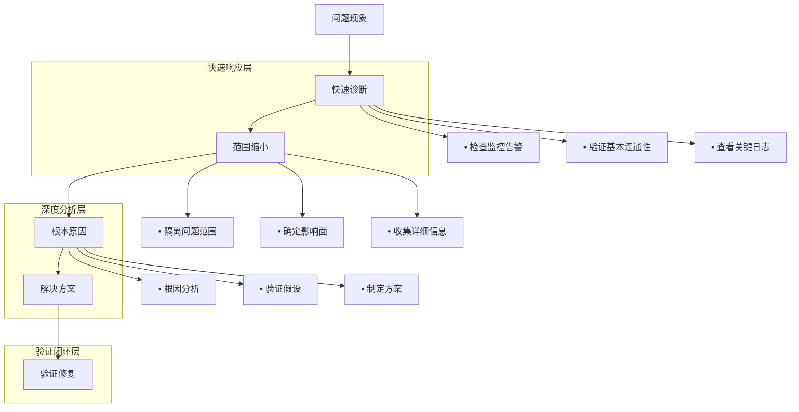

# 16 - 生产环境故障排查剧本

> **适用版本**: Kubernetes v1.25-v1.32 | **最后更新**: 2026-02 | **作者**: Allen Galler | **质量等级**: ⭐⭐⭐⭐⭐ 专家级

> **生产环境实战经验总结**: 基于万级节点集群故障排查经验，涵盖从常见故障到复杂问题的全方位排查剧本

---

## 知识地图

| 属性 | 说明 |
|------|------|
| **文件角色** | 生产环境故障排查剧本 — 按故障类型分类的标准化排查流程 |
| **适合读者** | 开发者(应用排查) → 运维(系统排查) → SRE(复杂问题定位) |
| **前置知识** | 05(概念参考)、06(CLI命令)、02(故障模式) |
| **关联文件** | 02(故障分析)、06(CLI命令)、12(事故管理) |

### 故障排查速查导航

| 现象 | 可能原因 | 参考章节 |
|------|----------|----------|
| Pod一直Pending | 资源不足/调度约束/PVC未绑定 | §2系统 + §4存储 |
| Pod反复CrashLoopBackOff | 应用错误/OOMKilled/配置错误 | §5应用 |
| Service无法访问 | 端口/Selector错误/网络策略 | §3网络 |
| 节点NotReady | 磁盘/内存压力/kubelet异常 | §2系统 |
| API Server响应慢 | etcd过大/请求过多/证书问题 | §6控制平面 |
| 延迟突然升高 | 资源竞争/网络问题/依赖超时 | §7性能 |

---

## 目录

- [1. 故障排查方法论](#1-故障排查方法论)
- [2. 系统级故障排查](#2-系统级故障排查)
- [3. 网络故障排查](#3-网络故障排查)
- [4. 存储故障排查](#4-存储故障排查)
- [5. 应用故障排查](#5-应用故障排查)
- [6. 控制平面故障排查](#6-控制平面故障排查)
- [7. 性能问题排查](#7-性能问题排查)
- [8. 实战案例分析](#8-实战案例分析)

---

## 1. 故障排查方法论

> **🔰 初学者导读**: 故障排查不是"碰运气"，而是系统化的诊断过程。像医生看病一样：先问症状(现象)→再做检查(数据采集)→形成假设(可能原因)→验证假设(定位根因)→治疗(修复)。遵循"自上而下"(应用→系统→网络)或"自下而上"(网络→系统→应用)的排查路径。

### 1.1 排查思维框架详解

**类比：医生诊断流程**

| 医生看病步骤 | 故障排查步骤 | K8s具体操作 | 工具 |
|------------|------------|-----------|------|
| **1. 问诊** | 收集症状 | 用户报告什么问题？ | 告警、工单 |
| **2. 初步检查** | 快速诊断 | `kubectl get pods/nodes` | kubectl |
| **3. 验体征** | 数据采集 | 查看日志、指标、事件 | logs, describe, top |
| **4. 假设病因** | 形成假设 | 根据经验判断可能原因 | 经验库 |
| **5. 验证检查** | 验证假设 | 针对性测试（网络、DNS等） | 专项工具 |
| **6. 确诊** | 定位根因 | 找到直接原因 | 综合分析 |
| **7. 开药治疗** | 实施修复 | 重启、扩容、回滚等 | kubectl apply |
| **8. 复查** | 验证修复 | 确认服务恢复 | 监控验证 |

**故障排查决策树**

```yaml
troubleshootingDecisionTree:
  step1_现象分类:
    question: "问题的表现是什么？"
    options:
      podNotRunning:
        symptoms: "Pod不在Running状态"
        goto: "step2_pod状态分析"
      serviceNotReachable:
        symptoms: "服务无法访问"
        goto: "step2_网络诊断"
      performanceDegradation:
        symptoms: "响应慢、延迟高"
        goto: "step2_性能分析"
      nodeIssue:
        symptoms: "节点NotReady"
        goto: "step2_节点诊断"
        
  step2_pod状态分析:
    question: "Pod处于什么状态？"
    states:
      Pending:
        meaning: "调度失败或等待资源"
        checks:
          - "检查事件: kubectl describe pod"
          - "检查资源: kubectl describe nodes"
          - "检查PVC: kubectl get pvc"
        commonCauses:
          - "资源不足(CPU/内存)"
          - "节点选择器不匹配"
          - "PVC未绑定"
          - "镜像拉取失败"
          
      CrashLoopBackOff:
        meaning: "容器启动后立即崩溃"
        checks:
          - "查看日志: kubectl logs --previous"
          - "检查配置: kubectl get pod -o yaml"
          - "检查探针: livenessProbe/readinessProbe"
        commonCauses:
          - "应用错误(代码Bug)"
          - "配置错误(环境变量、文件)"
          - "依赖服务不可用"
          - "OOMKilled"
          
      ImagePullBackOff:
        meaning: "无法拉取容器镜像"
        checks:
          - "检查镜像名: kubectl describe pod"
          - "测试镜像访问: crictl pull"
          - "检查凭据: kubectl get secret"
        commonCauses:
          - "镜像不存在"
          - "认证失败"
          - "网络问题"
          - "镜像仓库不可达"
          
      OOMKilled:
        meaning: "内存超限被杀"
        checks:
          - "检查内存限制: kubectl get pod -o yaml"
          - "查看内存使用: kubectl top pod"
          - "分析应用: 内存泄漏？"
        solution:
          - "增加内存限制"
          - "修复内存泄漏"
          - "优化应用内存使用"
          
  step2_网络诊断:
    question: "网络不通的层级是什么？"
    layers:
      L1_DNS:
        test: "nslookup service-name"
        ifFail: "检查CoreDNS状态"
        
      L2_PodToPod:
        test: "ping pod-ip"
        ifFail: "检查CNI插件"
        
      L3_PodToService:
        test: "curl service-name:port"
        ifFail: "检查Service配置和Endpoints"
        
      L4_IngressToService:
        test: "curl ingress-url"
        ifFail: "检查Ingress配置和证书"
```

**排查策略选择**

```yaml
troubleshootingStrategies:
  # 策略1：自上而下(应用层→基础设施)
  topDown:
    startFrom: "应用层"
    path: "应用 → 容器 → Pod → 节点 → 网络"
    bestFor:
      - "应用报错"
      - "功能异常"
      - "业务问题"
    example:
      problem: "用户无法登录"
      steps:
        1: "检查应用日志(有无错误)"
        2: "检查Pod状态(是否Running)"
        3: "检查数据库连接(依赖是否正常)"
        4: "检查网络(DNS、Service)"
        
  # 策略2：自下而上(基础设施→应用层)
  bottomUp:
    startFrom: "基础设施"
    path: "网络 → 节点 → Pod → 容器 → 应用"
    bestFor:
      - "大规模故障"
      - "基础设施问题"
      - "集群级异常"
    example:
      problem: "50%节点NotReady"
      steps:
        1: "检查网络连通性(节点间通信)"
        2: "检查节点资源(CPU、内存、磁盘)"
        3: "检查系统服务(kubelet、containerd)"
        4: "检查Pod状态(驱逐、重启)"
        
  # 策略3：二分法(缩小范围)
  binarySearch:
    principle: "逐步缩小问题范围"
    bestFor:
      - "间歇性故障"
      - "部分影响"
      - "不确定问题"
    example:
      problem: "某些请求失败"
      steps:
        1: "是所有Pod都有问题吗？→ 否，只有Pod-1"
        2: "是Pod-1的所有请求都失败吗？→ 否，只有特定API"
        3: "是该API的所有调用都失败吗？→ 否，只有特定参数"
        4: "定位：参数验证逻辑Bug"
        
  # 策略4：对比法(好坏对比)
  comparison:
    principle: "对比正常和异常实例的差异"
    bestFor:
      - "部分Pod异常"
      - "特定节点问题"
      - "版本差异"
    example:
      problem: "新版本Pod启动失败"
      comparison:
        - "对比新旧版本配置差异"
        - "对比成功和失败Pod的环境变量"
        - "对比节点资源和版本"
```

### 1.2 排查工具链详解

**类比：修理工的工具箱**

就像修车需要不同工具（扳手、螺丝刀、测电笔），故障排查也需要专用工具。

```yaml
troubleshootingToolbox:
  # 工具箱1：信息查看工具（"望远镜"）
  viewingTools:
    kubectl_get:
      purpose: "查看资源状态"
      useCases:
        - "kubectl get pods -o wide  # 查看Pod状态和节点"
        - "kubectl get nodes  # 查看节点状态"
        - "kubectl get events --sort-by='.lastTimestamp'  # 查看事件"
      analogy: "从高处俯瞰全局"
      
    kubectl_describe:
      purpose: "查看资源详细信息"
      useCases:
        - "kubectl describe pod <name>  # 查看Pod详情和事件"
        - "kubectl describe node <name>  # 查看节点资源和条件"
      analogy: "用放大镜看细节"
      
    kubectl_logs:
      purpose: "查看容器日志"
      useCases:
        - "kubectl logs <pod> -f  # 实时日志"
        - "kubectl logs <pod> --previous  # 上次运行日志"
        - "kubectl logs <pod> --tail=100  # 最后100行"
      analogy: "看行车记录仪"
      
  # 工具箱2：交互式调试工具（"探测器"）
  interactiveTools:
    kubectl_exec:
      purpose: "进入容器执行命令"
      useCases:
        - "kubectl exec -it <pod> -- bash  # 进入容器"
        - "kubectl exec <pod> -- cat /etc/hosts  # 执行单个命令"
      analogy: "打开引擎盖检查"
      
    kubectl_port_forward:
      purpose: "转发端口到本地"
      useCases:
        - "kubectl port-forward <pod> 8080:80  # 本地访问Pod"
      analogy: "接一根测试线"
      
    kubectl_debug:
      purpose: "创建调试容器"
      useCases:
        - "kubectl debug <pod> -it --image=busybox  # 临时调试容器"
        - "kubectl debug node/<node> -it --image=ubuntu  # 调试节点"
      analogy: "接一个诊断仪"
      
  # 工具箱3：性能分析工具（"测速仪"）
  performanceTools:
    kubectl_top:
      purpose: "查看资源使用"
      useCases:
        - "kubectl top nodes  # 节点CPU/内存使用"
        - "kubectl top pods  # Pod CPU/内存使用"
      analogy: "看仪表盘"
      
    crictl:
      purpose: "直接查看容器运行时"
      useCases:
        - "crictl ps  # 查看容器"
        - "crictl logs <container-id>  # 查看容器日志"
        - "crictl inspect <container-id>  # 查看容器详情"
      analogy: "看引擎转速"
      
  # 工具箱4：网络诊断工具（"网络测线器"）
  networkTools:
    netshoot:
      purpose: "网络问题排查瑞士军刀"
      useCases:
        - "kubectl run netshoot --rm -it --image=nicolaka/netshoot -- bash"
        - "nslookup <service>  # DNS测试"
        - "ping <ip>  # 连通性测试"
        - "curl <url>  # HTTP测试"
        - "tcpdump  # 抓包分析"
      analogy: "网络测试仪"
      
  # 工具箱5：集群级工具（"体检中心"）
  clusterTools:
    kubectlDebugCluster:
      purpose: "集群健康检查"
      useCases:
        - "kubectl get componentstatuses  # 组件状态"
        - "kubectl get --raw='/healthz'  # API Server健康"
        - "kubectl get --raw='/readyz'  # 集群就绪"
      
    prometheus:
      purpose: "指标监控查询"
      useCases:
        - "查询错误率、延迟、资源使用趋势"
      analogy: "体检报告"
```

**工具使用速查卡**

```bash
#!/bin/bash
# troubleshooting-cheatsheet.sh - 故障排查速查

cat << 'EOF'
╔══════════════════════════════════════════════════════════════╗
║           Kubernetes 故障排查速查卡                           ║
╚══════════════════════════════════════════════════════════════╝

【快速诊断】
  kubectl get pods -A --field-selector=status.phase!=Running
    → 查找所有非Running的Pod
  
  kubectl get events -A --sort-by='.lastTimestamp' | tail -20
    → 查看最近20条事件
  
  kubectl top nodes --sort-by=cpu
    → 查看节点CPU使用排名

【Pod排查】
  kubectl describe pod <pod-name>
    → 查看Pod详情（重点看Events部分）
  
  kubectl logs <pod-name> --previous
    → 查看崩溃前的日志
  
  kubectl get pod <pod-name> -o yaml | grep -A 10 status
    → 查看Pod状态详情

【网络排查】
  kubectl run netshoot --rm -it --image=nicolaka/netshoot -- bash
    → 启动网络调试工具
  
  kubectl exec <pod> -- nslookup kubernetes.default
    → 测试DNS解析
  
  kubectl get svc <service> -o wide
  kubectl get endpoints <service>
    → 检查Service和Endpoints

【节点排查】
  kubectl describe node <node-name>
    → 查看节点详情（重点看Conditions和Allocated resources）
  
  kubectl get nodes -o json | jq '.items[].status.conditions'
    → 查看所有节点状态

【性能排查】
  kubectl top pods -A --sort-by=memory | head -20
    → 查看内存使用Top 20
  
  kubectl exec <pod> -- top -b -n 1
    → 查看Pod内进程资源使用

【紧急操作】
  kubectl rollout undo deployment/<name>
    → 回滚部署
  
  kubectl cordon <node>
  kubectl drain <node> --ignore-daemonsets
    → 标记节点不可调度并驱逐Pod

EOF
```

### 1.3 故障排查金字塔



### 1.2 故障排查工具箱

| 工具类别 | 推荐工具 | 使用场景 | 熟练度要求 |
|----------|----------|----------|------------|
| **监控观测** | Prometheus, Grafana | 指标分析 | 必需 |
| **日志分析** | ELK Stack, Loki | 日志检索 | 必需 |
| **网络诊断** | tcpdump, Wireshark, netstat | 网络问题 | 进阶 |
| **系统调试** | strace, lsof, top | 系统问题 | 进阶 |
| **容器调试** | crictl, ctr | 容器问题 | 专家 |
| **K8s调试** | kubectl, stern | 集群问题 | 专家 |

### 1.3 故障排查最佳实践

```bash
#!/bin/bash
# troubleshooting-best-practices.sh - 故障排查最佳实践脚本

echo "=== 故障排查最佳实践 ==="

# 1. 信息收集清单
INFO_COLLECTION=(
    "故障现象描述"
    "影响范围统计"
    "发生时间点"
    "最近变更记录"
    "相关日志片段"
    "监控指标截图"
    "网络拓扑图"
    "系统配置信息"
)

echo "信息收集清单:"
for i in "${!INFO_COLLECTION[@]}"; do
    printf "%2d. %s\n" $((i+1)) "${INFO_COLLECTION[$i]}"
done

# 2. 故障分类快速检查
echo ""
echo "=== 快速分类检查 ==="

# 检查节点状态
echo "节点状态:"
kubectl get nodes -o wide

# 检查系统组件
echo ""
echo "系统组件状态:"
kubectl get pods -n kube-system

# 检查 API 服务器
echo ""
echo "API 服务器健康检查:"
kubectl get --raw='/healthz'

# 检查 etcd
echo ""
echo "etcd 健康检查:"
kubectl get --raw='/healthz/etcd'

echo ""
echo "=== 故障排查原则 ==="
echo "1. 先易后难：从最可能的原因开始"
echo "2. 先软后硬：优先检查配置而非硬件"
echo "3. 先内后外：先检查集群内部再检查外部依赖"
echo "4. 先恢复后分析：优先恢复服务再深入分析"
echo "5. 记录过程：详细记录排查步骤和发现"
```

---

## 2. 系统级故障排查

> **🔰 初学者导读**: 系统级故障影响整个节点或集群，通常表现为节点NotReady、大量Pod异常。常见原因：磁盘满、内存不足、kubelet崩溃、证书过期。第一步永远是看节点状态和事件。

### 2.1 节点 NotReady 排查剧本

**类比：机器"罢工"诊断**

节点NotReady就像一台机器突然罢工不干活了，需要检查：
- 电源（kubelet服务）
- 燃料（磁盘空间）
- 冷却（内存压力）
- 通讯（网络连接）

#### 剧本1：节点 NotReady 故障

**故障现象**
```bash
# 节点状态显示 NotReady
$ kubectl get nodes
NAME              STATUS     ROLES    AGE   VERSION
node-1            Ready      <none>   30d   v1.28.0
node-2            NotReady   <none>   30d   v1.28.0  ← 故障节点
node-3            Ready      <none>   30d   v1.28.0
```

**快速诊断脚本**
```bash
#!/bin/bash
# node-troubleshooting.sh - 节点故障快速诊断

NODE_NAME=$1
echo "=== 节点 $NODE_NAME 故障诊断 ==="

# 1. 检查节点详细状态
echo "1. 节点详细状态:"
kubectl describe node $NODE_NAME

# 2. 检查节点系统服务
echo "2. 检查 kubelet 状态:"
ssh $NODE_NAME "systemctl status kubelet"

# 3. 检查 kubelet 日志
echo "3. 检查 kubelet 日志:"
ssh $NODE_NAME "journalctl -u kubelet -n 50 --no-pager"

# 4. 检查节点资源
echo "4. 检查节点资源使用:"
ssh $NODE_NAME "
  echo '磁盘使用:'
  df -h
  echo ''
  echo '内存使用:'
  free -h
  echo ''
  echo '进程状态:'
  ps aux | grep -E '(kubelet|containerd|docker)' | head -10
"

# 5. 检查网络连接
echo "5. 检查网络连接:"
ssh $NODE_NAME "
  echo '网络接口:'
  ip addr show
  echo ''
  echo '路由表:'
  ip route show
  echo ''
  echo 'DNS 解析:'
  nslookup kubernetes.default.svc.cluster.local
"

# 6. 检查容器运行时
echo "6. 检查容器运行时:"
ssh $NODE_NAME "
  echo '容器运行时状态:'
  systemctl status containerd
  echo ''
  echo '容器列表:'
  crictl ps -a | head -20
"
```

**常见原因及解决方案**

| 原因 | 诊断命令 | 解决方案 |
|------|----------|----------|
| **磁盘空间不足** | `df -h` | 清理磁盘、扩容存储 |
| **内存压力** | `free -h` | 增加内存、驱逐Pod |
| **kubelet 服务异常** | `systemctl status kubelet` | 重启服务、检查配置 |
| **网络配置错误** | `ip addr show` | 修复网络配置 |
| **时间同步问题** | `timedatectl status` | 启用NTP同步 |

### 2.2 OOMKilled 排查剧本

**类比：房间太挤被赶出去**

OOMKilled (Out Of Memory Killed) 就像房间只能容纳10个人，但来了15个人，超出的5个人被保安赶出去。

**故障现象**
```bash
# Pod状态显示OOMKilled
$ kubectl get pods
NAME                     READY   STATUS      RESTARTS   AGE
app-7d5b7c9f8c-xyz12    0/1     OOMKilled   5          10m

$ kubectl describe pod app-7d5b7c9f8c-xyz12
...
Last State:     Terminated
  Reason:       OOMKilled
  Exit Code:    137
```

**快速诊断流程**

```bash
#!/bin/bash
# oomkilled-troubleshooting.sh - OOMKilled快速诊断

POD_NAME=$1
NAMESPACE=${2:-default}

echo "=== OOMKilled 诊断: $POD_NAME ==="

# 1. 确认是否真的是OOM
echo "1. 检查退出原因:"
kubectl get pod $POD_NAME -n $NAMESPACE -o jsonpath='{.status.containerStatuses[0].lastState.terminated.reason}'
echo ""

# 2. 查看内存限制
echo "2. 内存限制配置:"
kubectl get pod $POD_NAME -n $NAMESPACE -o json | jq -r '
  .spec.containers[] | 
  "容器: \(.name)",
  "  请求: \(.resources.requests.memory // "未设置")",
  "  限制: \(.resources.limits.memory // "未设置")"
'

# 3. 查看实际内存使用
echo "3. 实际内存使用(当前):"
kubectl top pod $POD_NAME -n $NAMESPACE --containers

# 4. 查看历史内存趋势（如果有Prometheus）
echo "4. 内存使用趋势查询(Prometheus PromQL):"
cat << 'EOF'
# 查询该Pod的内存使用历史
container_memory_usage_bytes{
  namespace="$NAMESPACE",
  pod="$POD_NAME"
}

# 查询内存使用率
container_memory_usage_bytes / 
container_spec_memory_limit_bytes * 100
EOF

# 5. 检查应用日志（是否有内存泄漏迹象）
echo "5. 应用日志检查(查找内存相关):"
kubectl logs $POD_NAME -n $NAMESPACE --tail=100 | grep -i -E "memory|heap|oom|out of memory"

# 6. 决策建议
echo ""
echo "=== 诊断结果和建议 ==="

MEMORY_LIMIT=$(kubectl get pod $POD_NAME -n $NAMESPACE -o jsonpath='{.spec.containers[0].resources.limits.memory}')
MEMORY_REQUEST=$(kubectl get pod $POD_NAME -n $NAMESPACE -o jsonpath='{.spec.containers[0].resources.requests.memory}')

if [ -z "$MEMORY_LIMIT" ]; then
  echo "❌ 未设置内存限制！"
  echo "   建议: 添加内存限制，防止无限制使用"
  echo "   示例: limits.memory: 512Mi"
elif [ "$MEMORY_LIMIT" == "$MEMORY_REQUEST" ]; then
  echo "⚠️  内存request=limit，没有弹性空间"
  echo "   建议: 设置request < limit，允许突发使用"
else
  echo "✅ 内存配置合理，可能是:"
  echo "   1) 应用内存使用超过预期 → 增加limit"
  echo "   2) 内存泄漏 → 修复应用代码"
  echo "   3) 短暂峰值 → 优化应用或增加资源"
fi

# 7. 解决方案模板
echo ""
echo "=== 解决方案模板 ==="
cat << 'YAML'
# 方案1: 增加内存限制
spec:
  containers:
  - name: app
    resources:
      requests:
        memory: "256Mi"  # 保证的最小内存
      limits:
        memory: "1Gi"    # 允许的最大内存（翻倍试试）

# 方案2: JVM应用优化（如果是Java）
spec:
  containers:
  - name: app
    env:
    - name: JAVA_OPTS
      value: "-Xms256m -Xmx768m -XX:MaxMetaspaceSize=128m"
    # 限制JVM堆内存为容器limit的75%
    resources:
      limits:
        memory: "1Gi"

# 方案3: 添加HPA（水平扩展）
apiVersion: autoscaling/v2
kind: HorizontalPodAutoscaler
metadata:
  name: app-hpa
spec:
  scaleTargetRef:
    apiVersion: apps/v1
    kind: Deployment
    name: app
  minReplicas: 2
  maxReplicas: 10
  metrics:
  - type: Resource
    resource:
      name: memory
      target:
        type: Utilization
        averageUtilization: 80  # 内存使用超过80%时扩容
YAML
```

**常见OOM原因及解决方案**

| 原因 | 特征 | 诊断方法 | 解决方案 |
|------|------|----------|----------|
| **内存限制太小** | 应用正常运行但定期OOM | 对比实际使用和limit | 增加memory limit |
| **内存泄漏** | 内存使用持续上升 | 查看内存趋势图 | 修复应用代码 |
| **流量突增** | 负载高时OOM | 关联流量指标 | 增加副本数+HPA |
| **配置错误** | 启动即OOM | 查看启动日志 | 修改应用配置(如JVM参数) |
| **依赖加载** | 初始化时OOM | 查看init日志 | 优化启动过程 |

**内存泄漏诊断（Java应用示例）**

```bash
#!/bin/bash
# java-memory-leak-diagnosis.sh - Java应用内存泄漏诊断

POD_NAME=$1
NAMESPACE=${2:-default}

echo "=== Java应用内存诊断 ==="

# 1. 获取Java进程PID
echo "1. 获取Java进程:"
kubectl exec $POD_NAME -n $NAMESPACE -- jps -l

# 2. 查看堆内存使用
echo "2. 堆内存使用统计:"
kubectl exec $POD_NAME -n $NAMESPACE -- jstat -gc 1 1000 5

# 3. 查看堆内存详情
echo "3. 堆内存详细信息:"
kubectl exec $POD_NAME -n $NAMESPACE -- jmap -heap 1

# 4. 生成堆转储（慎用，会暂停应用）
echo "4. 生成堆转储(dump):"
kubectl exec $POD_NAME -n $NAMESPACE -- jmap -dump:live,format=b,file=/tmp/heap.hprof 1

# 5. 复制堆转储到本地分析
kubectl cp $NAMESPACE/$POD_NAME:/tmp/heap.hprof ./heap.hprof

echo "✅ 堆转储已保存到 ./heap.hprof"
echo "   使用 VisualVM 或 Eclipse MAT 分析"
```

### 2.3 节点资源耗尽

**诊断脚本**
```bash
#!/bin/bash
# resource-starvation-troubleshooting.sh - 资源耗尽诊断

NODE_NAME=$1
echo "=== 节点 $NODE_NAME 资源耗尽诊断 ==="

# 1. 检查节点资源使用
echo "1. 节点资源使用详情:"
kubectl describe node $NODE_NAME | grep -A 20 "Allocated resources"

# 2. 检查节点压力状态
echo "2. 节点压力状态:"
kubectl describe node $NODE_NAME | grep -A 10 "Conditions"

# 3. 检查节点上的 Pod
echo "3. 节点上的 Pod 列表:"
kubectl get pods -o wide --field-selector spec.nodeName=$NODE_NAME

# 4. 检查 Pod 资源使用
echo "4. Pod 资源使用详情:"
kubectl top pods --field-selector spec.nodeName=$NODE_NAME

# 5. 检查节点系统指标
echo "5. 系统指标检查:"
ssh $NODE_NAME "
  echo 'CPU 详细:'
  top -bn1 | head -20
  echo ''
  echo '内存详细:'
  cat /proc/meminfo | head -10
  echo ''
  echo '磁盘 I/O:'
  iostat -x 1 3
"
```

### 2.2 系统性能问题排查

#### 剧本3：CPU 使用率过高

**快速诊断**
```bash
#!/bin/bash
# high-cpu-troubleshooting.sh - 高CPU使用率诊断

echo "=== 高CPU使用率诊断 ==="

# 1. 检查节点CPU使用率
echo "1. 节点CPU使用率:"
kubectl top nodes

# 2. 检查Pod CPU使用率
echo "2. Pod CPU使用率排名:"
kubectl top pods --all-namespaces --sort-by=cpu | head -20

# 3. 检查CPU密集型进程
echo "3. 节点上CPU密集型进程:"
for node in $(kubectl get nodes -o jsonpath='{.items[*].metadata.name}'); do
  echo "节点 $node:"
  ssh $node "top -b -n 1 | head -20"
done

# 4. 检查CPU节流
echo "4. 检查CPU节流情况:"
kubectl get pods --all-namespaces -o json | \
  jq -r '.items[] | select(.status.containerStatuses) | 
  .metadata.namespace + "/" + .metadata.name as $pod | 
  .status.containerStatuses[] | 
  select(.resources.limits.cpu) | 
  $pod + " " + .name + " throttled: " + (.resources.resources.cpu.throttled // "unknown")'
```

---

## 3. 网络故障排查

> **🔰 初学者导读**: K8s网络故障是最难排查的类型之一，因为涉及多层网络(Pod网络、Service网络、外部网络)。黄金排查三步：DNS解析→Pod间连通性→Service端点。90%的网络问题是DNS相关。

### 3.1 DNS 解析故障排查

**类比：电话簿查不到号码**

DNS就像电话簿，服务名(my-service)是姓名，IP地址是电话号码。DNS解析失败就像查不到电话号码，自然无法拨打。

**故障现象**
```bash
# 容器内无法解析服务名
$ kubectl exec -it app-pod -- nslookup my-service
Server:    10.96.0.10
Address 1: 10.96.0.10

nslookup: can't resolve 'my-service'
```

**快速诊断流程**

```bash
#!/bin/bash
# dns-troubleshooting.sh - DNS解析完整诊断

SERVICE_NAME=$1
NAMESPACE=${2:-default}

echo "=== DNS解析诊断: $SERVICE_NAME ==="

# 1. 检查CoreDNS状态
echo "1. CoreDNS Pod状态:"
kubectl get pods -n kube-system -l k8s-app=kube-dns -o wide

COREDNS_READY=$(kubectl get pods -n kube-system -l k8s-app=kube-dns -o json | jq -r '.items[] | select(.status.phase=="Running") | .metadata.name' | wc -l)
if [ "$COREDNS_READY" -eq 0 ]; then
  echo "❌ CoreDNS Pod未运行！"
  exit 1
fi

# 2. 检查CoreDNS Service
echo "2. CoreDNS Service:"
kubectl get svc -n kube-system kube-dns

DNS_SERVICE_IP=$(kubectl get svc -n kube-system kube-dns -o jsonpath='{.spec.clusterIP}')
echo "   DNS Service IP: $DNS_SERVICE_IP"

# 3. 检查CoreDNS配置
echo "3. CoreDNS配置:"
kubectl get configmap -n kube-system coredns -o yaml | grep -A 20 "Corefile:"

# 4. 测试DNS解析（从测试Pod）
echo "4. DNS解析测试:"
kubectl run dns-test-$(date +%s) --rm -i --restart=Never --image=nicolaka/netshoot -- bash -c "
  echo '=== 测试内部服务解析 ==='
  nslookup kubernetes.default.svc.cluster.local
  echo ''
  echo '=== 测试目标服务解析 ==='
  nslookup $SERVICE_NAME.$NAMESPACE.svc.cluster.local
  echo ''
  echo '=== 测试外部域名解析 ==='
  nslookup google.com
  echo ''
  echo '=== 检查resolv.conf ==='
  cat /etc/resolv.conf
"

# 5. 检查Service是否存在
echo "5. 检查目标Service:"
kubectl get svc $SERVICE_NAME -n $NAMESPACE 2>&1

if [ $? -ne 0 ]; then
  echo "❌ Service不存在！DNS无法解析不存在的服务"
  exit 1
fi

# 6. 检查CoreDNS日志（查找错误）
echo "6. CoreDNS日志(最近50行):"
kubectl logs -n kube-system -l k8s-app=kube-dns --tail=50 | grep -i -E "error|fail|timeout"

# 7. 诊断结果总结
echo ""
echo "=== 诊断清单 ==="
echo "[ ] CoreDNS Pod运行正常: $([ $COREDNS_READY -gt 0 ] && echo '✅' || echo '❌')"
echo "[ ] CoreDNS Service存在: $(kubectl get svc -n kube-system kube-dns &>/dev/null && echo '✅' || echo '❌')"
echo "[ ] 目标Service存在: $(kubectl get svc $SERVICE_NAME -n $NAMESPACE &>/dev/null && echo '✅' || echo '❌')"
echo "[ ] DNS可以解析kubernetes.default: (需手动检查上面测试结果)"
echo "[ ] DNS可以解析目标服务: (需手动检查上面测试结果)"
```

**常见DNS问题及解决方案**

| 问题 | 症状 | 根因 | 解决方案 |
|------|------|------|----------|
| **CoreDNS崩溃** | 所有DNS解析失败 | OOM、配置错误 | 重启CoreDNS、增加资源 |
| **DNS超时** | 部分解析失败 | CoreDNS过载 | 扩容CoreDNS副本 |
| **解析错误域名** | 解析到错误IP | 缓存问题 | 清理CoreDNS缓存 |
| **ndots配置错误** | 外部域名解析慢 | ndots=5导致多次查询 | 调整Pod dnsConfig |
| **网络策略阻断** | DNS请求被拒绝 | NetworkPolicy限制 | 允许DNS流量(53端口) |

**DNS性能优化**

```yaml
# 优化Pod DNS配置
apiVersion: v1
kind: Pod
metadata:
  name: app
spec:
  dnsPolicy: ClusterFirst
  dnsConfig:
    options:
    - name: ndots
      value: "2"  # 减少DNS查询次数（默认是5）
    - name: timeout
      value: "2"  # DNS超时时间
    - name: attempts
      value: "2"  # 重试次数
    - name: single-request-reopen
      # 避免A和AAAA记录查询使用同一个socket
```

### 3.2 Service 不通排查剧本

**类比：快递地址写错**

Service就像快递地址：
- Service名称是"收件人姓名"
- ClusterIP是"门牌号"
- Selector是"根据特征找人"（戴眼镜、穿红衣服）
- Endpoints是"实际收件人列表"

**故障现象**
```bash
# 服务无法访问
$ kubectl run test --rm -it --image=busybox -- wget -qO- http://my-service
wget: can't connect to remote host (10.96.5.10): Connection refused
```

**快速诊断流程**

```bash
#!/bin/bash
# service-connectivity-troubleshooting.sh - Service连通性完整诊断

SERVICE_NAME=$1
NAMESPACE=${2:-default}

echo "=== Service连通性诊断: $SERVICE_NAME ==="

# 1. 检查Service配置
echo "1. Service配置:"
kubectl get svc $SERVICE_NAME -n $NAMESPACE -o yaml

SERVICE_TYPE=$(kubectl get svc $SERVICE_NAME -n $NAMESPACE -o jsonpath='{.spec.type}')
CLUSTER_IP=$(kubectl get svc $SERVICE_NAME -n $NAMESPACE -o jsonpath='{.spec.clusterIP}')
PORTS=$(kubectl get svc $SERVICE_NAME -n $NAMESPACE -o jsonpath='{.spec.ports[*].port}')
SELECTOR=$(kubectl get svc $SERVICE_NAME -n $NAMESPACE -o jsonpath='{.spec.selector}' | jq -r 'to_entries | map("\(.key)=\(.value)") | join(",")')

echo "   类型: $SERVICE_TYPE"
echo "   ClusterIP: $CLUSTER_IP"
echo "   端口: $PORTS"
echo "   Selector: $SELECTOR"

# 2. 检查Endpoints（最关键！）
echo ""
echo "2. Endpoints检查:"
kubectl get endpoints $SERVICE_NAME -n $NAMESPACE

ENDPOINT_COUNT=$(kubectl get endpoints $SERVICE_NAME -n $NAMESPACE -o json | jq -r '.subsets[].addresses | length' 2>/dev/null || echo "0")
echo "   Endpoint数量: $ENDPOINT_COUNT"

if [ "$ENDPOINT_COUNT" -eq "0" ]; then
  echo "   ❌ 没有Endpoints！Service无法转发流量"
  echo "   原因: Selector没有匹配到任何Ready状态的Pod"
fi

# 3. 检查匹配的Pod
echo ""
echo "3. Selector匹配的Pod:"
if [ ! -z "$SELECTOR" ]; then
  kubectl get pods -n $NAMESPACE -l "$SELECTOR" -o wide
  
  POD_COUNT=$(kubectl get pods -n $NAMESPACE -l "$SELECTOR" --no-headers | wc -l)
  READY_POD_COUNT=$(kubectl get pods -n $NAMESPACE -l "$SELECTOR" -o json | jq -r '[.items[] | select(.status.conditions[] | select(.type=="Ready" and .status=="True"))] | length')
  
  echo "   总Pod数: $POD_COUNT"
  echo "   Ready Pod数: $READY_POD_COUNT"
  
  if [ "$POD_COUNT" -eq "0" ]; then
    echo "   ❌ Selector没有匹配到任何Pod！"
    echo "   检查: Service的selector和Pod的labels是否一致"
  elif [ "$READY_POD_COUNT" -eq "0" ]; then
    echo "   ❌ 有Pod但都不是Ready状态！"
    echo "   检查: Pod为什么不Ready（describe pod查看）"
  fi
else
  echo "   ⚠️  Service没有设置Selector（可能是ExternalName类型）"
fi

# 4. 测试Pod级别连通性
if [ "$ENDPOINT_COUNT" -gt "0" ]; then
  echo ""
  echo "4. Pod级别连通性测试:"
  
  FIRST_POD=$(kubectl get pods -n $NAMESPACE -l "$SELECTOR" -o jsonpath='{.items[0].metadata.name}')
  FIRST_POD_IP=$(kubectl get pods -n $NAMESPACE -l "$SELECTOR" -o jsonpath='{.items[0].status.podIP}')
  POD_PORT=$(kubectl get endpoints $SERVICE_NAME -n $NAMESPACE -o jsonpath='{.subsets[0].ports[0].port}')
  
  echo "   测试Pod: $FIRST_POD ($FIRST_POD_IP:$POD_PORT)"
  
  kubectl run test-pod-connectivity-$(date +%s) --rm -i --restart=Never --image=nicolaka/netshoot -- bash -c "
    echo '直接访问Pod IP:'
    curl -s --max-time 5 http://$FIRST_POD_IP:$POD_PORT || echo '失败'
  "
fi

# 5. 测试Service级别连通性
echo ""
echo "5. Service级别连通性测试:"
kubectl run test-svc-connectivity-$(date +%s) --rm -i --restart=Never --image=nicolaka/netshoot -- bash -c "
  echo '通过Service名称访问:'
  curl -s --max-time 5 http://$SERVICE_NAME.$NAMESPACE.svc.cluster.local:${PORTS%% *} || echo '失败'
  echo ''
  echo '通过ClusterIP访问:'
  curl -s --max-time 5 http://$CLUSTER_IP:${PORTS%% *} || echo '失败'
"

# 6. 检查NetworkPolicy
echo ""
echo "6. NetworkPolicy检查:"
kubectl get networkpolicy -n $NAMESPACE

NP_COUNT=$(kubectl get networkpolicy -n $NAMESPACE --no-headers | wc -l)
if [ "$NP_COUNT" -gt "0" ]; then
  echo "   ⚠️  存在${NP_COUNT}个NetworkPolicy，可能影响连通性"
  echo "   检查: NetworkPolicy是否允许流量"
fi

# 7. 检查kube-proxy（节点级别）
echo ""
echo "7. kube-proxy状态:"
kubectl get pods -n kube-system -l k8s-app=kube-proxy -o wide

# 8. 诊断总结
echo ""
echo "=== 诊断总结 ==="
echo "Service配置: ✅"
echo "Endpoints数量: $ENDPOINT_COUNT $([ $ENDPOINT_COUNT -gt 0 ] && echo '✅' || echo '❌ 无Endpoints')"
echo "匹配的Pod: $READY_POD_COUNT Ready $([ $READY_POD_COUNT -gt 0 ] && echo '✅' || echo '❌')"

if [ "$ENDPOINT_COUNT" -eq "0" ]; then
  echo ""
  echo "🔍 根因分析: Endpoints为空"
  echo "可能原因:"
  echo "  1. Selector配置错误，没有匹配到Pod"
  echo "  2. Pod存在但不是Ready状态"
  echo "  3. Pod的端口名称与Service不匹配"
fi
```

**Service排查决策树**

```yaml
serviceToubleshootingDecisionTree:
  step1_检查Service:
    command: "kubectl get svc <name>"
    ifNotExist: "Service不存在 → 创建Service"
    ifExist: "继续 step2"
    
  step2_检查Endpoints:
    command: "kubectl get endpoints <name>"
    ifEmpty:
      problem: "Endpoints为空 → Service无法转发流量"
      goto: "step3_检查Pod"
    ifNotEmpty:
      problem: "Endpoints正常，但不通"
      goto: "step4_检查网络"
      
  step3_检查Pod:
    question: "Selector匹配的Pod存在吗？"
    check: "kubectl get pods -l <selector>"
    scenarios:
      noPods:
        problem: "没有Pod"
        solution: "检查Deployment/StatefulSet，确保Pod被创建"
      podsNotReady:
        problem: "Pod存在但不Ready"
        solution: "kubectl describe pod 查看为什么不Ready"
      podsReady:
        problem: "Pod Ready但不在Endpoints"
        solution:
          - "检查Pod端口是否正确"
          - "检查readinessProbe是否通过"
          - "检查Pod是否在正确的namespace"
          
  step4_检查网络:
    scenarios:
      podToService:
        test: "从另一个Pod curl Service"
        ifFail: "检查kube-proxy和iptables规则"
      podToPod:
        test: "直接curl Pod IP"
        ifFail: "CNI网络问题"
      networkPolicy:
        check: "kubectl get networkpolicy"
        ifExist: "检查规则是否允许流量"
```

### 3.3 网络策略故障排查

**故障现象**
```bash
# 服务无法访问
$ kubectl run test-pod --image=busybox --rm -it --restart=Never -- wget -qO- http://my-service:80
wget: bad address 'my-service'
```

**诊断脚本**
```bash
#!/bin/bash
# service-connectivity-troubleshooting.sh - 服务连通性诊断

SERVICE_NAME=$1
NAMESPACE=${2:-default}

echo "=== 服务 $SERVICE_NAME 连通性诊断 ==="

# 1. 检查 Service 配置
echo "1. Service 配置:"
kubectl get svc $SERVICE_NAME -n $NAMESPACE -o yaml

# 2. 检查 Endpoints
echo "2. Endpoints 状态:"
kubectl get endpoints $SERVICE_NAME -n $NAMESPACE

# 3. 检查匹配的 Pod
echo "3. 匹配的 Pod:"
SELECTOR=$(kubectl get svc $SERVICE_NAME -n $NAMESPACE -o jsonpath='{.spec.selector}')
kubectl get pods -n $NAMESPACE -l $SELECTOR

# 4. 测试 Pod 级别连通性
echo "4. Pod 级别连通性测试:"
POD=$(kubectl get pods -n $NAMESPACE -l $SELECTOR -o jsonpath='{.items[0].metadata.name}' 2>/dev/null)
if [ ! -z "$POD" ]; then
  kubectl exec $POD -n $NAMESPACE -- wget -qO- localhost:80
fi

# 5. 检查 DNS 解析
echo "5. DNS 解析测试:"
kubectl run dns-test --image=tutum/dnsutils --rm -it --restart=Never -- nslookup $SERVICE_NAME.$NAMESPACE.svc.cluster.local

# 6. 检查 iptables 规则
echo "6. iptables 规则检查:"
NODE=$(kubectl get pods -n $NAMESPACE -l $SELECTOR -o jsonpath='{.items[0].spec.nodeName}' 2>/dev/null)
if [ ! -z "$NODE" ]; then
  ssh $NODE "iptables-save | grep $SERVICE_NAME"
fi

# 7. 检查 NetworkPolicy
echo "7. NetworkPolicy 检查:"
kubectl get networkpolicy -n $NAMESPACE
```

#### 剧本5：DNS 解析失败

**诊断脚本**
```bash
#!/bin/bash
# dns-resolution-troubleshooting.sh - DNS解析诊断

echo "=== DNS 解析诊断 ==="

# 1. 检查 CoreDNS 状态
echo "1. CoreDNS 状态:"
kubectl get pods -n kube-system -l k8s-app=kube-dns

# 2. 检查 CoreDNS 配置
echo "2. CoreDNS 配置:"
kubectl get configmap coredns -n kube-system -o yaml

# 3. 检查 CoreDNS 日志
echo "3. CoreDNS 日志:"
kubectl logs -n kube-system -l k8s-app=kube-dns

# 4. DNS 解析测试
echo "4. DNS 解析测试:"
kubectl run dns-test --image=nicolaka/netshoot --rm -it --restart=Never -- nslookup kubernetes.default.svc.cluster.local

# 5. 测试外部 DNS
echo "5. 外部 DNS 测试:"
kubectl run dns-test --image=nicolaka/netshoot --rm -it --restart=Never -- nslookup google.com

# 6. 检查 Pod DNS 配置
echo "6. Pod DNS 配置检查:"
kubectl run debug-pod --image=nicolaka/netshoot --rm -it --restart=Never -- cat /etc/resolv.conf
```

### 3.2 网络策略故障排查

#### 剧本6：NetworkPolicy 阻断流量

**诊断脚本**
```bash
#!/bin/bash
# network-policy-troubleshooting.sh - 网络策略诊断

NAMESPACE=$1
echo "=== 命名空间 $NAMESPACE 网络策略诊断 ==="

# 1. 检查 NetworkPolicy
echo "1. NetworkPolicy 列表:"
kubectl get networkpolicy -n $NAMESPACE

# 2. 检查 NetworkPolicy 详情
for np in $(kubectl get networkpolicy -n $NAMESPACE -o jsonpath='{.items[*].metadata.name}'); do
  echo "NetworkPolicy $np 详情:"
  kubectl get networkpolicy $np -n $NAMESPACE -o yaml
  echo ""
done

# 3. 检查 Pod 标签
echo "3. Pod 标签检查:"
kubectl get pods -n $NAMESPACE -L app,tier,version

# 4. 使用 npviewer 可视化（如果有安装）
echo "4. 网络策略可视化:"
kubectl get networkpolicy -n $NAMESPACE -o json | \
  docker run --rm -i quay.io/netpol/npviewer:latest

# 5. 连通性测试
echo "5. 连通性测试脚本生成:"
cat << 'EOF' > connectivity-test.sh
#!/bin/bash
# 生成网络连通性测试脚本
NAMESPACE=$1
for src_pod in $(kubectl get pods -n $NAMESPACE -o jsonpath='{.items[*].metadata.name}'); do
  for dst_pod in $(kubectl get pods -n $NAMESPACE -o jsonpath='{.items[*].metadata.name}'); do
    echo "Testing $src_pod -> $dst_pod"
    kubectl exec $src_pod -n $NAMESPACE -- wget -qO- --timeout=5 $dst_pod
  done
done
EOF
chmod +x connectivity-test.sh
```

---

## 4. 存储故障排查

### 4.1 PVC 故障排查

#### 剧本7：PVC 无法绑定

**故障现象**
```bash
# PVC 状态为 Pending
$ kubectl get pvc
NAME             STATUS    VOLUME   CAPACITY   ACCESS MODES   STORAGECLASS   AGE
mysql-pvc        Pending                                      fast-ssd       10m
```

**诊断脚本**
```bash
#!/bin/bash
# pvc-troubleshooting.sh - PVC故障诊断

PVC_NAME=$1
NAMESPACE=${2:-default}

echo "=== PVC $PVC_NAME 故障诊断 ==="

# 1. 检查 PVC 状态
echo "1. PVC 详细状态:"
kubectl describe pvc $PVC_NAME -n $NAMESPACE

# 2. 检查 StorageClass
SC=$(kubectl get pvc $PVC_NAME -n $NAMESPACE -o jsonpath='{.spec.storageClassName}')
echo "2. StorageClass $SC 配置:"
kubectl describe storageclass $SC

# 3. 检查 PV 列表
echo "3. 可用 PV 列表:"
kubectl get pv

# 4. 检查 CSI 驱动状态
echo "4. CSI 驱动状态:"
kubectl get pods -n kube-system | grep csi

# 5. 检查 CSI 驱动日志
for driver in $(kubectl get pods -n kube-system -l app=csi-driver -o jsonpath='{.items[*].metadata.name}'); do
  echo "CSI 驱动 $driver 日志:"
  kubectl logs -n kube-system $driver
done

# 6. 检查存储后端
echo "6. 存储后端检查:"
STORAGE_TYPE=$(kubectl get storageclass $SC -o jsonpath='{.provisioner}')
case $STORAGE_TYPE in
  "kubernetes.io/aws-ebs")
    echo "AWS EBS 存储检查"
    # AWS 特定检查
    ;;
  "kubernetes.io/gce-pd")
    echo "GCE PD 存储检查"
    # GCP 特定检查
    ;;
  *)
    echo "其他存储类型: $STORAGE_TYPE"
    ;;
esac
```

### 4.2 存储性能问题排查

#### 剧本8：存储性能下降

**诊断脚本**
```bash
#!/bin/bash
# storage-performance-troubleshooting.sh - 存储性能诊断

POD_NAME=$1
NAMESPACE=${2:-default}

echo "=== Pod $POD_NAME 存储性能诊断 ==="

# 1. 检查 Pod 挂载点
echo "1. 挂载点信息:"
kubectl exec $POD_NAME -n $NAMESPACE -- df -h

# 2. 检查 I/O 统计
echo "2. I/O 统计:"
kubectl exec $POD_NAME -n $NAMESPACE -- iostat -x 1 5

# 3. 检查磁盘使用率
echo "3. 磁盘使用率:"
kubectl exec $POD_NAME -n $NAMESPACE -- du -sh /data/*

# 4. 执行磁盘性能测试
echo "4. 磁盘性能测试:"
kubectl exec $POD_NAME -n $NAMESPACE -- bash -c "
  echo '写性能测试:'
  dd if=/dev/zero of=/data/test.img bs=1G count=1 oflag=direct 2>&1 | grep copied
  echo '读性能测试:'
  dd if=/data/test.img of=/dev/null bs=1G count=1 iflag=direct 2>&1 | grep copied
  rm /data/test.img
"

# 5. 检查存储类参数
PVC_NAME=$(kubectl get pod $POD_NAME -n $NAMESPACE -o jsonpath='{.spec.volumes[?(@.persistentVolumeClaim)].persistentVolumeClaim.claimName}')
if [ ! -z "$PVC_NAME" ]; then
  SC=$(kubectl get pvc $PVC_NAME -n $NAMESPACE -o jsonpath='{.spec.storageClassName}')
  echo "5. 存储类参数检查:"
  kubectl get storageclass $SC -o yaml
fi
```

---

## 5. 应用故障排查

> **🔰 初学者导读**: 应用故障是最常见的故障类型。CrashLoopBackOff(反复崩溃)、OOMKilled(内存不足被杀)、ImagePullBackOff(拉不到镜像)是三大常见问题。80%的问题通过describe+logs就能定位。

### 5.1 CrashLoopBackOff 排查剧本

**类比：反复重启的电脑**

CrashLoopBackOff就像电脑一开机就蓝屏，自动重启后又蓝屏，陷入死循环。Kubernetes发现容器启动后立即崩溃，会自动重启，但每次重启间隔会指数增长（1s, 2s, 4s, 8s... 最长5分钟）。

**故障现象**
```bash
# Pod反复重启
$ kubectl get pods
NAME                     READY   STATUS             RESTARTS   AGE
app-7d5b7c9f8c-xyz12    0/1     CrashLoopBackOff   8          15m

# 重启次数持续增加
$ kubectl get pod app-7d5b7c9f8c-xyz12 -w
app-7d5b7c9f8c-xyz12   0/1   Running            9      16m
app-7d5b7c9f8c-xyz12   0/1   Error              9      16m
app-7d5b7c9f8c-xyz12   0/1   CrashLoopBackOff   9      16m
```

**快速诊断流程**

```bash
#!/bin/bash
# crashloop-troubleshooting.sh - CrashLoopBackOff完整诊断

POD_NAME=$1
NAMESPACE=${2:-default}

echo "=== CrashLoopBackOff诊断: $POD_NAME ==="

# 1. 基本信息
echo "1. Pod基本信息:"
kubectl get pod $POD_NAME -n $NAMESPACE -o wide
echo ""

# 2. 查看退出码和原因
echo "2. 容器退出信息:"
kubectl get pod $POD_NAME -n $NAMESPACE -o json | jq -r '
  .status.containerStatuses[] | 
  "容器: \(.name)",
  "  重启次数: \(.restartCount)",
  "  最后状态: \(.lastState.terminated.reason // "N/A")",
  "  退出码: \(.lastState.terminated.exitCode // "N/A")",
  "  退出消息: \(.lastState.terminated.message // "N/A")"
'
echo ""

# 3. 查看当前日志（正在运行的实例）
echo "3. 当前日志(最后50行):"
kubectl logs $POD_NAME -n $NAMESPACE --tail=50 2>/dev/null || echo "容器未运行，无法获取日志"
echo ""

# 4. 查看之前的日志（崩溃前的实例）
echo "4. 崩溃前日志(最后100行):"
kubectl logs $POD_NAME -n $NAMESPACE --previous --tail=100 2>/dev/null || echo "没有之前的日志"
echo ""

# 5. 查看事件
echo "5. 相关事件:"
kubectl get events -n $NAMESPACE --field-selector involvedObject.name=$POD_NAME --sort-by='.lastTimestamp' | tail -20
echo ""

# 6. 检查配置
echo "6. 容器配置检查:"
kubectl get pod $POD_NAME -n $NAMESPACE -o json | jq -r '
  .spec.containers[] |
  "容器: \(.name)",
  "  镜像: \(.image)",
  "  命令: \(.command // [] | join(" "))",
  "  参数: \(.args // [] | join(" "))",
  "  工作目录: \(.workingDir // "N/A")"
'
echo ""

# 7. 检查环境变量
echo "7. 环境变量:"
kubectl get pod $POD_NAME -n $NAMESPACE -o json | jq -r '
  .spec.containers[] |
  "容器: \(.name)",
  (.env // [] | .[] | "  \(.name)=\(.value // "<from secret/configmap>")")
'
echo ""

# 8. 检查存储挂载
echo "8. 存储卷挂载:"
kubectl get pod $POD_NAME -n $NAMESPACE -o json | jq -r '
  .spec.containers[] |
  "容器: \(.name)",
  (.volumeMounts // [] | .[] | "  \(.mountPath) <- \(.name)")
'
echo ""

# 9. 根据退出码分析
EXIT_CODE=$(kubectl get pod $POD_NAME -n $NAMESPACE -o jsonpath='{.status.containerStatuses[0].lastState.terminated.exitCode}')

echo "=== 退出码分析 ==="
case $EXIT_CODE in
  0)
    echo "退出码 0: 正常退出"
    echo "  原因: 进程正常结束但立即退出"
    echo "  解决: 检查应用是否应该持续运行（如Web服务器）"
    ;;
  1)
    echo "退出码 1: 应用错误"
    echo "  原因: 应用内部错误导致退出"
    echo "  解决: 查看日志分析具体错误"
    ;;
  137)
    echo "退出码 137: 被SIGKILL杀死（128+9）"
    echo "  原因: OOMKilled或被强制终止"
    echo "  解决: 检查内存限制和使用"
    ;;
  139)
    echo "退出码 139: 段错误（128+11）"
    echo "  原因: 应用访问非法内存"
    echo "  解决: 代码Bug，需要调试"
    ;;
  143)
    echo "退出码 143: 被SIGTERM终止（128+15）"
    echo "  原因: 优雅关闭信号"
    echo "  解决: 检查应用是否正确处理SIGTERM"
    ;;
  *)
    echo "退出码 $EXIT_CODE: 其他错误"
    echo "  解决: 查看应用文档或日志"
    ;;
esac

echo ""
echo "=== 常见原因检查清单 ==="
echo "[ ] 1. 应用代码错误 → 查看日志中的异常堆栈"
echo "[ ] 2. 配置错误 → 检查ConfigMap/Secret是否正确挂载"
echo "[ ] 3. 依赖服务不可用 → 测试数据库/Redis等连接"
echo "[ ] 4. 端口冲突 → 检查多个容器是否使用同一端口"
echo "[ ] 5. 权限问题 → 检查SecurityContext和文件权限"
echo "[ ] 6. 启动命令错误 → 验证command和args"
echo "[ ] 7. 健康检查失败 → 检查readinessProbe/livenessProbe"
```

**常见CrashLoopBackOff原因**

| 退出码 | 含义 | 常见原因 | 解决方案 |
|-------|------|---------|---------|
| **0** | 正常退出 | 应用执行完就退出 | 改用持续运行的进程 |
| **1** | 应用错误 | 代码Bug、配置错误 | 查看日志修复Bug |
| **137** | SIGKILL | OOMKilled | 增加内存限制 |
| **139** | SIGSEGV | 段错误 | 修复代码Bug |
| **143** | SIGTERM | 优雅终止 | 检查shutdown处理 |
| **126** | 命令不可执行 | 权限问题 | 修改文件权限 |
| **127** | 命令未找到 | 路径错误 | 检查命令路径 |

### 5.2 ImagePullBackOff 排查剧本

**类比：快递地址不存在**

ImagePullBackOff就像快递员找不到地址无法送货：
- 地址写错（镜像名错误）
- 门禁拦截（认证失败）
- 路不通（网络问题）
- 仓库关门（镜像仓库不可用）

**故障现象**
```bash
# Pod无法拉取镜像
$ kubectl get pods
NAME                     READY   STATUS             RESTARTS   AGE
app-7d5b7c9f8c-xyz12    0/1     ImagePullBackOff   0          5m

$ kubectl describe pod app-7d5b7c9f8c-xyz12
Events:
  Type     Reason     Message
  ----     ------     -------
  Normal   Pulling    Pulling image "myapp:v1.0"
  Warning  Failed     Failed to pull image "myapp:v1.0": rpc error: code = Unknown desc = Error response from daemon: pull access denied for myapp, repository does not exist or may require 'docker login'
  Warning  Failed     Error: ImagePullBackOff
```

**快速诊断流程**

```bash
#!/bin/bash
# imagepull-troubleshooting.sh - ImagePullBackOff完整诊断

POD_NAME=$1
NAMESPACE=${2:-default}

echo "=== ImagePullBackOff诊断: $POD_NAME ==="

# 1. 获取镜像信息
echo "1. 镜像信息:"
kubectl get pod $POD_NAME -n $NAMESPACE -o json | jq -r '
  .spec.containers[] |
  "容器: \(.name)",
  "  镜像: \(.image)",
  "  拉取策略: \(.imagePullPolicy)"
'
echo ""

IMAGE=$(kubectl get pod $POD_NAME -n $NAMESPACE -o jsonpath='{.spec.containers[0].image}')
echo "目标镜像: $IMAGE"
echo ""

# 2. 查看详细错误信息
echo "2. 错误详情:"
kubectl describe pod $POD_NAME -n $NAMESPACE | grep -A 10 "Events:"
echo ""

# 3. 检查镜像仓库凭据
echo "3. 镜像仓库凭据检查:"
IMAGE_PULL_SECRETS=$(kubectl get pod $POD_NAME -n $NAMESPACE -o jsonpath='{.spec.imagePullSecrets[*].name}')
if [ -z "$IMAGE_PULL_SECRETS" ]; then
  echo "  ⚠️  未配置imagePullSecrets"
else
  echo "  imagePullSecrets: $IMAGE_PULL_SECRETS"
  for secret in $IMAGE_PULL_SECRETS; do
    echo "  检查Secret $secret:"
    kubectl get secret $secret -n $NAMESPACE &>/dev/null && echo "    ✅ Secret存在" || echo "    ❌ Secret不存在"
  done
fi
echo ""

# 4. 在节点上手动测试拉取
echo "4. 节点测试（需要SSH到节点）:"
NODE=$(kubectl get pod $POD_NAME -n $NAMESPACE -o jsonpath='{.spec.nodeName}')
echo "  Pod调度在节点: $NODE"
echo "  手动测试命令:"
echo "    ssh $NODE"
echo "    sudo crictl pull $IMAGE"
echo ""

# 5. 检查网络连通性
echo "5. 网络连通性测试:"
REGISTRY=$(echo $IMAGE | cut -d'/' -f1)
echo "  镜像仓库: $REGISTRY"
echo "  测试命令:"
echo "    kubectl run nettest --rm -it --image=nicolaka/netshoot -- bash"
echo "    curl -v https://$REGISTRY"
echo ""

# 6. 常见问题检查
echo "=== 常见问题诊断 ==="

# 检查1：镜像名格式
if [[ ! "$IMAGE" =~ ^[a-zA-Z0-9._/-]+:[a-zA-Z0-9._-]+$ ]] && [[ ! "$IMAGE" =~ @sha256: ]]; then
  echo "⚠️  镜像名格式可能有问题: $IMAGE"
fi

# 检查2：tag是否为latest
if [[ "$IMAGE" =~ :latest$ ]] || [[ ! "$IMAGE" =~ : ]]; then
  echo "⚠️  使用了latest标签或未指定标签"
  echo "   建议: 使用明确的版本标签"
fi

# 检查3：私有仓库但没有凭据
if [[ "$IMAGE" =~ ^[^/]+\.[^/]+/ ]] && [ -z "$IMAGE_PULL_SECRETS" ]; then
  echo "❌ 疑似私有仓库但未配置imagePullSecrets"
  echo "   解决: 创建docker-registry类型Secret并配置imagePullSecrets"
fi

echo ""
echo "=== 解决方案 ==="
echo "根据错误类型选择："
echo ""
echo "1️⃣  镜像不存在："
echo "   - 检查镜像名和标签是否正确"
echo "   - 确认镜像已推送到仓库"
echo ""
echo "2️⃣  认证失败："
cat << 'EOF'
   - 创建Secret:
     kubectl create secret docker-registry regcred \
       --docker-server=<registry> \
       --docker-username=<username> \
       --docker-password=<password> \
       --docker-email=<email>
   
   - 在Pod中使用:
     spec:
       imagePullSecrets:
       - name: regcred
EOF
echo ""
echo "3️⃣  网络问题："
echo "   - 检查节点到镜像仓库的网络连通性"
echo "   - 检查防火墙规则"
echo "   - 考虑使用镜像代理或内网镜像仓库"
echo ""
echo "4️⃣  速率限制（如Docker Hub）："
echo "   - 使用认证凭据提高限额"
echo "   - 切换到其他镜像仓库"
echo "   - 使用镜像缓存"
```

**ImagePullBackOff 决策树**

```yaml
imagePullTroubleshooting:
  step1_错误分析:
    errorMessages:
      "repository does not exist":
        cause: "镜像不存在"
        solutions:
          - "检查镜像名拼写"
          - "确认镜像已推送"
          - "检查镜像仓库URL"
          
      "pull access denied":
        cause: "认证失败"
        solutions:
          - "配置imagePullSecrets"
          - "检查Secret内容是否正确"
          - "验证仓库访问权限"
          
      "dial tcp: i/o timeout":
        cause: "网络超时"
        solutions:
          - "检查节点到仓库网络"
          - "检查DNS解析"
          - "检查防火墙规则"
          
      "toomanyrequests":
        cause: "Docker Hub速率限制"
        solutions:
          - "使用认证拉取"
          - "切换到其他仓库"
          - "使用镜像缓存"
```

### 5.3 应用性能问题

**故障现象**
```bash
# Pod 状态异常
$ kubectl get pods
NAME                            READY   STATUS              RESTARTS   AGE
my-app-7d5b7c9f8c-xyz12        0/1     ImagePullBackOff    0          5m
my-app-7d5b7c9f8c-abc34        0/1     CrashLoopBackOff    3          5m
my-app-7d5b7c9f8c-def56        0/1     Pending             0          5m
```

**综合诊断脚本**
```bash
#!/bin/bash
# pod-troubleshooting.sh - Pod故障综合诊断

POD_NAME=$1
NAMESPACE=${2:-default}

echo "=== Pod $POD_NAME 故障诊断 ==="

# 1. 基本信息
echo "1. Pod 基本信息:"
kubectl get pod $POD_NAME -n $NAMESPACE -o wide

# 2. 详细状态
echo "2. Pod 详细状态:"
kubectl describe pod $POD_NAME -n $NAMESPACE

# 3. 容器状态检查
echo "3. 容器状态:"
kubectl get pod $POD_NAME -n $NAMESPACE -o jsonpath='{.status.containerStatuses[*]}'

# 4. 日志检查
echo "4. 容器日志:"
for container in $(kubectl get pod $POD_NAME -n $NAMESPACE -o jsonpath='{.spec.containers[*].name}'); do
  echo "--- 容器 $container 日志 ---"
  kubectl logs $POD_NAME -n $NAMESPACE -c $container --tail=50
done

# 5. 之前的日志（如果是重启）
echo "5. 之前的日志:"
kubectl logs $POD_NAME -n $NAMESPACE --previous

# 6. 事件检查
echo "6. 相关事件:"
kubectl get events -n $NAMESPACE --field-selector involvedObject.name=$POD_NAME --sort-by='.lastTimestamp'

# 7. 节点资源检查
NODE=$(kubectl get pod $POD_NAME -n $NAMESPACE -o jsonpath='{.spec.nodeName}')
if [ ! -z "$NODE" ]; then
  echo "7. 节点资源状态:"
  kubectl describe node $NODE | grep -A 10 "Allocated resources"
fi

# 8. 网络检查
echo "8. 网络检查:"
kubectl exec $POD_NAME -n $NAMESPACE -- nslookup kubernetes.default.svc.cluster.local 2>/dev/null || echo "DNS 解析失败"

# 9. 存储检查
echo "9. 挂载卷检查:"
kubectl exec $POD_NAME -n $NAMESPACE -- df -h
```

### 5.2 应用性能问题排查

#### 剧本10：应用响应慢

**诊断脚本**
```bash
#!/bin/bash
# application-performance-troubleshooting.sh - 应用性能诊断

POD_NAME=$1
NAMESPACE=${2:-default}

echo "=== 应用 $POD_NAME 性能诊断 ==="

# 1. 检查资源使用
echo "1. 资源使用情况:"
kubectl top pod $POD_NAME -n $NAMESPACE

# 2. 检查应用日志
echo "2. 应用日志分析:"
kubectl logs $POD_NAME -n $NAMESPACE --since=5m | grep -i -E "error|warn|slow|timeout|exception"

# 3. 检查 JVM 性能（如果是 Java 应用）
echo "3. JVM 性能检查:"
kubectl exec $POD_NAME -n $NAMESPACE -- jps 2>/dev/null | grep -E "[0-9]+ " | while read pid name; do
  echo "Java 进程 $name (PID: $pid):"
  kubectl exec $POD_NAME -n $NAMESPACE -- jstack $pid | head -50
  kubectl exec $POD_NAME -n $NAMESPACE -- jstat -gc $pid
done

# 4. 检查网络延迟
echo "4. 网络延迟测试:"
kubectl exec $POD_NAME -n $NAMESPACE -- bash -c "
  for i in {1..5}; do
    time curl -s -o /dev/null -w 'Time: %{time_total}s\n' http://localhost:8080/health 2>/dev/null
  done
"

# 5. 检查依赖服务
echo "5. 依赖服务检查:"
kubectl exec $POD_NAME -n $NAMESPACE -- bash -c "
  echo '数据库连接测试:'
  timeout 5 telnet mysql-service 3306 2>/dev/null && echo 'MySQL 可达' || echo 'MySQL 不可达'
  
  echo 'Redis 连接测试:'
  timeout 5 telnet redis-service 6379 2>/dev/null && echo 'Redis 可达' || echo 'Redis 不可达'
"

# 6. 检查应用指标
echo "6. 应用指标检查:"
kubectl port-forward $POD_NAME -n $NAMESPACE 8080:8080 2>/dev/null &
PF_PID=$!
sleep 2
curl -s http://localhost:8080/actuator/prometheus 2>/dev/null | head -20 || echo "无法获取应用指标"
kill $PF_PID 2>/dev/null
```

---

## 6. 控制平面故障排查

### 6.1 API Server 故障排查

#### 剧本11：API Server 不可用

**快速诊断脚本**
```bash
#!/bin/bash
# apiserver-troubleshooting.sh - API Server故障诊断

echo "=== API Server 故障诊断 ==="

# 1. 检查 API Server 连接
echo "1. API Server 连接测试:"
kubectl get --raw='/healthz' 2>&1 || echo "API Server 无法连接"

# 2. 检查集群状态
echo "2. 集群组件状态:"
kubectl get cs

# 3. 检查 API Server Pod
echo "3. API Server Pod 状态:"
kubectl get pods -n kube-system | grep kube-apiserver

# 4. 检查 API Server 日志
MASTER_NODE=$(kubectl get nodes -l node-role.kubernetes.io/control-plane -o jsonpath='{.items[0].metadata.name}')
echo "4. API Server 日志:"
kubectl logs -n kube-system -l component=kube-apiserver

# 5. 检查 etcd 状态
echo "5. etcd 连接测试:"
kubectl get --raw='/healthz/etcd'

# 6. 检查认证授权
echo "6. 认证测试:"
kubectl auth can-i '*' '*' --as=system:anonymous

# 7. 检查网络连通性
echo "7. 网络连通性:"
kubectl run net-test --image=busybox --rm -it --restart=Never -- wget -qO- --timeout=5 https://kubernetes.default.svc.cluster.local
```

### 6.2 调度器故障排查

#### 剧本12：Pod 调度失败

**诊断脚本**
```bash
#!/bin/bash
# scheduler-troubleshooting.sh - 调度器故障诊断

POD_NAME=$1
NAMESPACE=${2:-default}

echo "=== Pod $POD_NAME 调度诊断 ==="

# 1. 检查 Pod 调度状态
echo "1. Pod 调度事件:"
kubectl describe pod $POD_NAME -n $NAMESPACE | grep -A 20 "Events"

# 2. 检查调度器状态
echo "2. 调度器状态:"
kubectl get pods -n kube-system | grep kube-scheduler

# 3. 检查调度器日志
echo "3. 调度器日志:"
kubectl logs -n kube-system -l component=kube-scheduler

# 4. 检查节点可调度性
echo "4. 节点可调度性检查:"
kubectl get nodes -o json | jq -r '.items[] | select(.spec.unschedulable != true) | .metadata.name'

# 5. 检查资源约束
echo "5. 资源约束检查:"
kubectl describe pod $POD_NAME -n $NAMESPACE | grep -A 10 "Limits\|Requests"

# 6. 检查节点资源
echo "6. 节点资源检查:"
kubectl describe nodes | grep -A 15 "Allocated resources"

# 7. 模拟调度
echo "7. 调度模拟:"
kubectl run simulate-schedule --image=busybox --restart=Never --dry-run=client -o yaml | \
  kubectl create -f - --validate=false
```

---

## 7. 性能问题排查

> **🔰 初学者导读**: 性能问题比功能故障更难定位，因为"能用但慢"。排查方向：CPU throttling(被限流)、内存swap、网络延迟、磁盘IO瓶颈。kubectl top是第一步诊断工具。

### 7.1 CPU Throttling 定位

**类比：汽车限速器**

CPU Throttling就像汽车装了限速器：
- 设定最高时速100km/h (CPU limit)
- 想开到120km/h (应用需要更多CPU)
- 结果被限速器强制降到100km/h (被throttle)
- 感觉：车子明明还能跑快，但被限制了，很"卡顿"

**故障现象**
```bash
# 应用响应慢，但CPU使用率不高
$ kubectl top pods
NAME                     CPU(cores)   MEMORY(bytes)
app-7d5b7c9f8c-xyz12    950m         256Mi

# 配置的limit是1000m（1核），看起来快到上限了
```

**快速诊断流程**

```bash
#!/bin/bash
# cpu-throttling-diagnosis.sh - CPU Throttling诊断

POD_NAME=$1
NAMESPACE=${2:-default}

echo "=== CPU Throttling诊断: $POD_NAME ==="

# 1. 查看CPU配置
echo "1. CPU资源配置:"
kubectl get pod $POD_NAME -n $NAMESPACE -o json | jq -r '
  .spec.containers[] |
  "容器: \(.name)",
  "  CPU请求: \(.resources.requests.cpu // "未设置")",
  "  CPU限制: \(.resources.limits.cpu // "未设置")"
'
echo ""

# 2. 查看当前CPU使用
echo "2. 当前CPU使用:"
kubectl top pod $POD_NAME -n $NAMESPACE --containers
echo ""

# 3. 检查CPU throttling指标（需要节点访问）
echo "3. CPU Throttling指标检查:"
NODE=$(kubectl get pod $POD_NAME -n $NAMESPACE -o jsonpath='{.spec.nodeName}')
CONTAINER_ID=$(kubectl get pod $POD_NAME -n $NAMESPACE -o jsonpath='{.status.containerStatuses[0].containerID}' | cut -d'/' -f3)

echo "  Pod运行在节点: $NODE"
echo "  容器ID: $CONTAINER_ID"
echo ""

echo "  SSH到节点执行以下命令检查throttling:"
cat << 'EOF'
  # 方法1: 查看cgroup的CPU统计
  cat /sys/fs/cgroup/cpu/kubepods/*/pod<pod-uid>/<container-id>/cpu.stat
  
  # 关键指标:
  # nr_throttled: 被限流的次数
  # throttled_time: 被限流的总时间(纳秒)
  
  # 方法2: 使用systemd-cgtop
  systemd-cgtop
EOF
echo ""

# 4. 使用Prometheus查询（如果有）
echo "4. Prometheus查询建议:"
cat << 'EOF'
# CPU throttling率
rate(container_cpu_cfs_throttled_seconds_total[5m])
/
rate(container_cpu_cfs_periods_total[5m])
* 100

# 超过10%就说明CPU被严重限流了
EOF
echo ""

# 5. 分析建议
CPU_LIMIT=$(kubectl get pod $POD_NAME -n $NAMESPACE -o jsonpath='{.spec.containers[0].resources.limits.cpu}')
CPU_REQUEST=$(kubectl get pod $POD_NAME -n $NAMESPACE -o jsonpath='{.spec.containers[0].resources.requests.cpu}')

echo "=== 分析结果 ==="

if [ -z "$CPU_LIMIT" ]; then
  echo "✅ 未设置CPU limit，不会被throttle"
  echo "   注意: 可能影响其他Pod，建议设置合理的limit"
elif [ "$CPU_LIMIT" == "$CPU_REQUEST" ]; then
  echo "⚠️  CPU request = limit ($CPU_LIMIT)"
  echo "   影响: 无法突发使用CPU，可能经常被throttle"
  echo "   建议: 设置 limit > request，允许突发"
else
  echo "✅ CPU配置合理: request=$CPU_REQUEST, limit=$CPU_LIMIT"
  echo "   如果仍有性能问题，可能需要增加limit"
fi

echo ""
echo "=== 解决方案 ==="
echo "如果确认有CPU throttling问题："
echo ""
echo "1️⃣  临时方案（增加CPU limit）:"
cat << 'YAML'
spec:
  containers:
  - name: app
    resources:
      requests:
        cpu: "500m"      # 保证的CPU
      limits:
        cpu: "2000m"     # 允许突发到2核
YAML
echo ""
echo "2️⃣  长期方案（优化应用）:"
echo "   - 分析CPU热点（profiling）"
echo "   - 优化算法降低CPU消耗"
echo "   - 使用异步处理减少CPU密集操作"
echo ""
echo "3️⃣  扩容方案（增加副本）:"
echo "   - 使用HPA根据CPU使用率自动扩容"
echo "   - 手动增加Deployment副本数"
```

**CPU Throttling 识别指标**

```yaml
cpuThrottlingIndicators:
  symptom1_高延迟低使用率:
    observation: "应用响应慢，但kubectl top显示CPU不高"
    reason: "被throttle的时间不计入使用率"
    verification: "检查nr_throttled和throttled_time"
    
  symptom2_间歇性卡顿:
    observation: "应用时快时慢，不稳定"
    reason: "CPU使用接近limit时被限流"
    verification: "查看CPU使用率是否接近limit"
    
  symptom3_并发性能差:
    observation: "单请求快，并发请求慢"
    reason: "多线程抢CPU，触发throttle"
    verification: "压测对比单并发vs高并发"
    
  prometheusQueries:
    throttleRate: |
      # CPU被限流的比例
      rate(container_cpu_cfs_throttled_seconds_total{pod="$POD"}[5m])
      /
      rate(container_cpu_cfs_periods_total{pod="$POD"}[5m])
      * 100
      
    throttleTime: |
      # 被限流的时间（秒）
      rate(container_cpu_cfs_throttled_seconds_total{pod="$POD"}[5m])
      
  alert:
    condition: "throttle rate > 10% for 5m"
    action: "调查是否需要增加CPU limit"
```

### 7.2 内存泄漏排查

**类比：水龙头没关紧**

内存泄漏就像水龙头一直在滴水：
- 一开始水池还有空间（内存充足）
- 慢慢水池满了（内存增长）
- 最后溢出（OOMKilled）
- 关键特征：内存只增不减

**故障现象**
```bash
# 内存使用持续增长
$ kubectl top pod app-pod
NAME       CPU(cores)   MEMORY(bytes)
app-pod    100m         512Mi

# 5分钟后
$ kubectl top pod app-pod
NAME       CPU(cores)   MEMORY(bytes)
app-pod    100m         768Mi      # 内存增加了

# 10分钟后
$ kubectl top pod app-pod
NAME       CPU(cores)   MEMORY(bytes)
app-pod    100m         950Mi      # 继续增加

# 最终
$ kubectl get pods
NAME       READY   STATUS      RESTARTS   AGE
app-pod    0/1     OOMKilled   3          25m
```

**快速诊断流程**

```bash
#!/bin/bash
# memory-leak-diagnosis.sh - 内存泄漏诊断

POD_NAME=$1
NAMESPACE=${2:-default}

echo "=== 内存泄漏诊断: $POD_NAME ==="

# 1. 查看内存配置
echo "1. 内存资源配置:"
kubectl get pod $POD_NAME -n $NAMESPACE -o json | jq -r '
  .spec.containers[] |
  "容器: \(.name)",
  "  内存请求: \(.resources.requests.memory // "未设置")",
  "  内存限制: \(.resources.limits.memory // "未设置")"
'
echo ""

# 2. 查看当前内存使用
echo "2. 当前内存使用:"
kubectl top pod $POD_NAME -n $NAMESPACE --containers
echo ""

# 3. 查看重启历史
echo "3. 重启历史:"
kubectl get pod $POD_NAME -n $NAMESPACE -o json | jq -r '
  .status.containerStatuses[] |
  "容器: \(.name)",
  "  重启次数: \(.restartCount)",
  "  最后终止原因: \(.lastState.terminated.reason // "N/A")"
'
echo ""

# 4. 查看内存趋势（需要Prometheus）
echo "4. 内存趋势分析（Prometheus查询）:"
cat << 'EOF'
# 内存使用趋势
container_memory_usage_bytes{
  namespace="$NAMESPACE",
  pod="$POD_NAME"
}

# 内存使用率
container_memory_usage_bytes / 
container_spec_memory_limit_bytes * 100

# 内存增长率（每小时增长）
deriv(
  container_memory_usage_bytes{pod="$POD_NAME"}[1h]
) * 3600
EOF
echo ""

# 5. 进入容器检查内存
echo "5. 容器内内存检查:"
echo "  进入容器:"
echo "    kubectl exec -it $POD_NAME -n $NAMESPACE -- bash"
echo ""
echo "  检查进程内存(Linux):"
echo "    top -o %MEM"
echo "    ps aux --sort=-%mem | head -10"
echo ""

# 6. 应用特定检查
echo "6. 应用类型特定检查:"
echo ""
echo "  Java应用:"
cat << 'EOF'
    # 查看堆内存
    kubectl exec $POD -n $NS -- jstat -gc 1 1000 5
    
    # 生成堆转储
    kubectl exec $POD -n $NS -- jmap -dump:live,format=b,file=/tmp/heap.hprof 1
    kubectl cp $NS/$POD:/tmp/heap.hprof ./heap.hprof
    
    # 使用VisualVM或MAT分析heap.hprof
EOF
echo ""
echo "  Node.js应用:"
cat << 'EOF'
    # 启用heapdump
    kubectl exec $POD -n $NS -- node --expose-gc --inspect app.js
    
    # 使用Chrome DevTools连接分析
EOF
echo ""
echo "  Python应用:"
cat << 'EOF'
    # 使用memory_profiler
    kubectl exec $POD -n $NS -- python -m memory_profiler app.py
    
    # 或使用tracemalloc
    import tracemalloc
    tracemalloc.start()
    # ... 运行代码 ...
    snapshot = tracemalloc.take_snapshot()
EOF
echo ""

# 7. 诊断建议
echo "=== 诊断建议 ==="
echo "内存泄漏特征："
echo "  1. 内存持续增长，不回收"
echo "  2. 重启后内存从低开始，然后又增长"
echo "  3. 最终达到limit被OOMKilled"
echo ""
echo "与正常内存增长的区别："
echo "  - 正常: 内存增长后趋于稳定，有波动"
echo "  - 泄漏: 只增不减，趋势一直向上"
echo ""
echo "=== 解决方案 ==="
echo "1️⃣  临时缓解（重启）:"
echo "   kubectl rollout restart deployment/<name>"
echo ""
echo "2️⃣  短期方案（增加内存）:"
echo "   增加memory limit，但这只是延缓，不是解决"
echo ""
echo "3️⃣  长期方案（修复泄漏）:"
echo "   - 使用profiling工具找到泄漏点"
echo "   - 常见原因:"
echo "     • 全局变量/缓存无限增长"
echo "     • 事件监听器未移除"
echo "     • 闭包引用导致无法GC"
echo "     • 第三方库泄漏"
echo "   - 修复代码后重新部署"
```

**内存泄漏 vs 正常增长**

```yaml
memoryPatternComparison:
  normalGrowth:
    pattern: "锯齿形"
    description: "内存增长后通过GC回收，周期性波动"
    example: |
      Memory
        ^
      1G|     /\      /\      /\
        |    /  \    /  \    /  \
      500M|  /    \  /    \  /    \
        | /      \/      \/      \
      0 +--------------------------> Time
    action: "正常，无需处理"
    
  memoryLeak:
    pattern: "斜坡形"
    description: "内存持续增长，不回收，最终OOM"
    example: |
      Memory
        ^
      1G|                    /OOM
        |                  /
      500M|              /
        |            /
      0 +----------/-------------> Time
    action: "内存泄漏！需要修复"
    
  suddenSpike:
    pattern: "尖峰形"
    description: "短暂内存峰值后快速回落"
    example: |
      Memory
        ^
      1G|        ⚡
        |       / \
      500M|      /   \
        |     /     \___________
      0 +--------------------------> Time
    action: "负载峰值，考虑增加限制或优化"
```

### 7.3 性能问题综合排查

**综合诊断脚本**
```bash
#!/bin/bash
# cluster-performance-troubleshooting.sh - 集群性能诊断

echo "=== 集群性能诊断 ==="

# 1. 检查节点资源使用
echo "1. 节点资源使用排名:"
kubectl top nodes --sort-by=cpu
kubectl top nodes --sort-by=memory

# 2. 检查 Pod 资源使用
echo "2. Pod CPU 使用排名:"
kubectl top pods --all-namespaces --sort-by=cpu | head -20

echo "3. Pod 内存使用排名:"
kubectl top pods --all-namespaces --sort-by=memory | head -20

# 3. 检查控制平面性能
echo "4. 控制平面组件资源使用:"
kubectl top pods -n kube-system

# 4. 检查 API Server 性能指标
echo "5. API Server 性能指标:"
kubectl get --raw='/metrics' | grep -E 'apiserver_request_duration_seconds|rest_client_request_duration_seconds'

# 5. 检查 etcd 性能指标
echo "6. etcd 性能指标:"
kubectl get --raw='/metrics' | grep -E 'etcd_.*_duration_seconds|etcd_db_total_size_in_bytes'

# 6. 检查调度性能
echo "7. 调度性能指标:"
kubectl get --raw='/metrics' | grep -E 'scheduler_binding_duration_seconds|scheduler_schedule_attempts_total'

# 7. 检查网络性能
echo "8. 网络性能测试:"
kubectl run network-test --image=praqma/network-multitool --rm -it --restart=Never -- bash -c "
  echo '网络延迟测试:'
  for i in {1..10}; do
    ping -c 1 kubernetes.default.svc.cluster.local | grep 'time='
  done
"
```

### 7.2 监控指标异常排查

#### 剧本14：监控指标异常

**诊断脚本**
```bash
#!/bin/bash
# monitoring-metrics-troubleshooting.sh - 监控指标异常诊断

METRIC_NAME=$1
echo "=== 监控指标 $METRIC_NAME 异常诊断 ==="

# 1. 检查指标是否存在
echo "1. 指标存在性检查:"
kubectl exec -n monitoring prometheus-prometheus-k8s-0 -- curl -s "http://localhost:9090/api/v1/query?query=up" | jq -r '.data.result | length'

# 2. 检查 Prometheus 状态
echo "2. Prometheus 状态:"
kubectl get pods -n monitoring | grep prometheus

# 3. 检查 Prometheus 日志
echo "3. Prometheus 日志:"
kubectl logs -n monitoring -l app=prometheus

# 4. 检查 ServiceMonitor
echo "4. ServiceMonitor 检查:"
kubectl get servicemonitor -A

# 5. 检查监控端点
echo "5. 监控端点检查:"
kubectl get endpoints -n monitoring | grep prometheus

# 6. 检查 RBAC 权限
echo "6. RBAC 权限检查:"
kubectl auth can-i get pods --as=system:serviceaccount:monitoring:prometheus-k8s
```

---

## 8. 实战案例分析

> **🔰 初学者导读**: 真实的故障排查案例是最好的学习材料。每个案例展示完整的排查过程：现象→假设→验证→根因→修复→预防。

### 8.1 案例分析（完整演示）

**案例标题: 电商促销期间订单服务大规模故障**

**1. 故障现象**
```yaml
incident:
  time: "2026-02-10 20:00"
  impact:
    - "50%的订单请求失败"
    - "用户投诉量激增"
    - "订单服务响应时间从100ms增加到5s"
  monitoring:
    - "告警: 订单服务P95延迟 > 3s"
    - "告警: 订单服务错误率 > 10%"
    - "告警: 数据库连接池耗尽"
```

**2. 初步诊断**
```bash
# 检查Pod状态
$ kubectl get pods -n production -l app=order-service
NAME                             READY   STATUS      RESTARTS   AGE
order-service-7d5b7c9f8c-abc12  1/1     Running     0          2h
order-service-7d5b7c9f8c-def34  0/1     OOMKilled   5          2h  # ❌ 异常
order-service-7d5b7c9f8c-ghi56  1/1     Running     0          2h
order-service-7d5b7c9f8c-jkl78  0/1     Pending     0          1m  # ❌ 无法调度

# 检查资源使用
$ kubectl top pods -n production -l app=order-service
NAME                             CPU     MEMORY
order-service-7d5b7c9f8c-abc12  950m    1900Mi     # ❌ 内存高
order-service-7d5b7c9f8c-ghi56  980m    1950Mi     # ❌ CPU和内存都高
```

**3. 问题假设**
```yaml
hypotheses:
  H1: "流量激增导致资源不足"
  H2: "内存泄漏导致OOM"
  H3: "数据库瓶颈导致请求堆积"
  H4: "某次部署引入Bug"
```

**4. 假设验证过程**

```bash
# 验证H1: 流量激增
$ kubectl top pods -n production -l app=order-service --use-protocol-buffers
# 结果: QPS从1000增加到5000 ✅ 证实

# 验证H2: 内存泄漏
$ kubectl logs order-service-7d5b7c9f8c-abc12 -n production | grep -i "memory\|heap"
# 结果: 看到大量 "GC overhead limit exceeded" ✅ 证实内存问题

# 验证H3: 数据库瓶颈
$ kubectl exec -it order-service-7d5b7c9f8c-abc12 -n production -- \
  curl http://localhost:8080/actuator/metrics/hikaricp.connections.active
# 结果: 连接池100%使用，大量等待 ✅ 证实

# 验证H4: 代码变更
$ kubectl rollout history deployment/order-service -n production
REVISION  CHANGE-CAUSE
1         Initial deployment
2         Update image to v1.2.3
3         Update image to v1.2.4 (2小时前)  # ❌ 可疑
```

**5. 根因定位**
```yaml
rootCause:
  trigger: "促销流量增加5倍"
  amplifier: "v1.2.4版本引入数据库连接泄漏Bug"
  chain:
    1: "流量增加 → 数据库连接需求增加"
    2: "连接泄漏 → 连接池耗尽"
    3: "请求等待连接 → 内存堆积"
    4: "内存超限 → OOMKilled"
    5: "Pod重启 → 可用副本减少"
    6: "负载集中 → 剩余Pod也崩溃"
    7: "级联故障 → 服务大面积不可用"
```

**6. 紧急修复**
```bash
#!/bin/bash
# 紧急修复步骤

echo "=== 紧急修复开始 ==="

# 1. 立即回滚到上个稳定版本
kubectl rollout undo deployment/order-service -n production

# 2. 扩容副本数应对流量
kubectl scale deployment/order-service -n production --replicas=20

# 3. 增加资源限制
kubectl set resources deployment/order-service -n production \
  --limits=cpu=2000m,memory=2Gi \
  --requests=cpu=1000m,memory=1Gi

# 4. 监控恢复情况
watch kubectl get pods -n production -l app=order-service

echo "=== 等待服务恢复 ==="
kubectl rollout status deployment/order-service -n production

echo "✅ 紧急修复完成"
```

**7. 修复验证**
```yaml
verification:
  metrics:
    errorRate:
      before: "10%"
      after: "0.1%"
      status: "✅ 恢复正常"
    latency:
      before: "P95 = 5s"
      after: "P95 = 150ms"
      status: "✅ 恢复正常"
    availability:
      before: "50%"
      after: "99.9%"
      status: "✅ 恢复正常"
  userImpact:
    before: "大量用户无法下单"
    after: "服务恢复，订单正常处理"
```

**8. 预防措施**
```yaml
preventiveMeasures:
  immediate:
    - action: "修复v1.2.4的连接泄漏Bug"
      owner: "开发团队"
      deadline: "24小时"
      
    - action: "添加数据库连接池监控告警"
      threshold: "使用率 > 80%"
      owner: "SRE团队"
      
  shortTerm:
    - action: "配置HPA自动扩容"
      config: |
        minReplicas: 10
        maxReplicas: 50
        metrics:
        - type: Resource
          resource:
            name: cpu
            target:
              type: Utilization
              averageUtilization: 70
              
    - action: "增加预发布环境压力测试"
      requirement: "必须通过5000 QPS压测"
      
  longTerm:
    - action: "建立金丝雀发布流程"
      description: "新版本先发布10%流量，监控1小时无异常再全量"
      
    - action: "完善监控体系"
      metrics:
        - "数据库连接池使用率"
        - "JVM堆内存趋势"
        - "应用线程数"
        - "慢查询日志"
        
    - action: "定期混沌工程演练"
      frequency: "每月一次"
      scenarios:
        - "数据库故障模拟"
        - "Pod随机杀死"
        - "流量激增模拟"
```

**9. 事后复盘**
```yaml
postmortem:
  timeline:
    "19:50": "发布v1.2.4版本"
    "20:00": "促销活动开始，流量激增"
    "20:05": "告警：延迟升高"
    "20:08": "告警：错误率升高"
    "20:10": "On-call工程师开始调查"
    "20:15": "发现OOMKilled和Pending的Pod"
    "20:20": "决定回滚"
    "20:25": "回滚完成，服务开始恢复"
    "20:30": "服务完全恢复"
    
  whatWentWell:
    - "监控及时发现问题"
    - "快速决策回滚"
    - "回滚过程顺利"
    
  whatWentWrong:
    - "新版本未经过充分压测"
    - "连接泄漏Bug未在测试中发现"
    - "没有自动扩容机制应对流量"
    
  lessonsLearned:
    - "压测必须覆盖生产级流量"
    - "关键服务必须配置HPA"
    - "新版本发布需要金丝雀"
    - "数据库连接池监控很重要"
    
  actionItems:
    - "增加压测环境（责任人: 运维，2周内完成）"
    - "所有服务配置HPA（责任人: SRE，1周内完成）"
    - "建立金丝雀发布流程（责任人: 架构，1个月内完成）"
    - "Code Review加强数据库连接管理检查（立即生效）"
```

### 8.2 故障排查总结

**故障场景**
- 50% 节点突然变为 NotReady
- 大量 Pod 被驱逐
- 服务大面积不可用

**排查步骤**
```bash
# 1. 快速评估影响范围
kubectl get nodes --no-headers | awk '$2 == "NotReady" {count++} END {print "NotReady 节点数量:", count}'

# 2. 检查节点故障模式
kubectl get nodes -o json | jq -r '.items[] | select(.status.conditions[] | select(.type == "Ready" and .status == "False")) | .metadata.name + " " + .spec.providerID'

# 3. 检查系统日志
for node in $(kubectl get nodes --no-headers | awk '$2 == "NotReady" {print $1}'); do
  echo "检查节点 $node 系统日志..."
  ssh $node "journalctl -u kubelet --since '10 minutes ago' | grep -i error"
done

# 4. 检查网络连通性
kubectl run connectivity-test --image=praqma/network-multitool --rm -it --restart=Never -- nc -zv $(kubectl get nodes --no-headers | awk '$2 == "NotReady" {print $1; exit}') 6443

# 5. 检查时间同步
for node in $(kubectl get nodes --no-headers | awk '$2 == "NotReady" {print $1}' | head -3); do
  ssh $node "timedatectl status" | grep -E "NTP|synchronized"
done
```

### 8.2 案例2：存储性能瓶颈

**故障场景**
- 应用响应时间突然增加
- 数据库连接超时
- 存储延迟指标异常

**排查步骤**
```yaml
storagePerformanceInvestigation:
  # 1. 确认性能指标
  metricsToCheck:
    - "node_disk_io_time_seconds_total"
    - "node_filesystem_avail_bytes"
    - "container_fs_reads_bytes_total"
    - "container_fs_writes_bytes_total"
    
  # 2. 检查存储类配置
  storageClassAnalysis:
    parameters:
      - "provisioner"
      - "volumeBindingMode"
      - "allowVolumeExpansion"
    checkList:
      - "IOPS 配置"
      - "吞吐量限制"
      - "加密设置"
      
  # 3. 性能测试验证
  benchmarkTests:
    - "顺序读写测试"
    - "随机读写测试" 
    - "IOPS 测试"
    - "延迟测试"
    
  # 4. 优化建议
  optimizationStrategies:
    - "调整存储类参数"
    - "更换更高性能存储"
    - "优化应用存储访问模式"
    - "启用缓存层"
```

### 8.3 案例3：网络分区故障

**故障场景**
- 部分节点间网络不通
- Pod 无法调度到某些节点
- 服务间通信异常

**排查步骤**
```bash
#!/bin/bash
# network-partition-troubleshooting.sh - 网络分区诊断

echo "=== 网络分区故障诊断 ==="

# 1. 检查节点网络分区
kubectl get nodes -o json | jq -r '.items[] | .metadata.name + " " + .status.addresses[]?.address' | while read node ip; do
  if ! timeout 5 ping -c 1 $ip >/dev/null 2>&1; then
    echo "❌ 节点 $node ($ip) 网络不可达"
  else
    echo "✅ 节点 $node ($ip) 网络可达"
  fi
done

# 2. 检查 CNI 插件状态
kubectl get pods -n kube-system | grep -E "(calico|flannel|cilium|weave)"

# 3. 检查网络策略
kubectl get networkpolicies --all-namespaces

# 4. 检查防火墙规则
for node in $(kubectl get nodes -o jsonpath='{.items[*].metadata.name}'); do
  ssh $node "sudo iptables -L -n | grep -E 'DROP|REJECT'"
done
```

---

**表格底部标记**: Kusheet Project | 作者: Allen Galler (allengaller@gmail.com) | 最后更新: 2026-02 | 版本: v1.25-v1.32 | 质量等级: ⭐⭐⭐⭐⭐ 专家级
