# API Server 异常 FTA 树

## 适用范围与说明
- **目标**：覆盖 Kubernetes API Server 不可用/性能劣化的关键成因与路径，支撑生产环境快速定位与自动化处置。
- **范围**：APIServer 进程与配置、认证鉴权、请求排队与限流、依赖组件、证书与时间、网络与基础设施。
- **符号**：
  - **OR 门**：任一子事件成立即可触发父事件
  - **AND 门**：所有子事件同时成立才触发父事件

---

## Mermaid FTA 树

```mermaid
flowchart TD
  TE[顶事件: API Server 不可用/性能劣化]
  OR0{{OR}}
  TE --> OR0

  OR0 --> PROC[进程与资源异常]
  OR0 --> AUTH[认证与鉴权异常]
  OR0 --> RATE[请求排队/限流异常]
  OR0 --> DEP[依赖与存储异常]
  OR0 --> NET[网络与连通性异常]
  OR0 --> CERT[证书与时间异常]
  OR0 --> CFG[配置与发布异常]

  PROC_OR{{OR}}
  PROC --> PROC_OR
  PROC_OR --> PROC1[进程崩溃/反复重启]
  PROC_OR --> PROC2[CPU/内存资源耗尽]
  PROC_OR --> PROC3[GC/长尾阻塞]

  AUTH_OR{{OR}}
  AUTH --> AUTH_OR
  AUTH_OR --> AUTH1[OIDC/身份源不可用]
  AUTH_OR --> AUTH2[RBAC/ABAC 策略拒绝]
  AUTH_OR --> AUTH3[Webhook 鉴权超时]

  RATE_OR{{OR}}
  RATE --> RATE_OR
  RATE_OR --> RATE1[APF 队列拥塞]
  RATE_OR --> RATE2[限流配置过严]
  RATE_OR --> RATE3[高峰流量突增]

  DEP_OR{{OR}}
  DEP --> DEP_OR
  DEP_OR --> DEP1[etcd 异常/性能劣化]
  DEP_OR --> DEP2[API 聚合服务异常]
  DEP_OR --> DEP3[控制面资源不足]

  NET_OR{{OR}}
  NET --> NET_OR
  NET_OR --> NET1[LB/SLB 健康检查失败]
  NET_OR --> NET2[网络链路抖动/丢包]
  NET_OR --> NET3[DNS 解析异常]

  CERT_OR{{OR}}
  CERT --> CERT_OR
  CERT_OR --> CERT1[证书过期/链不完整]
  CERT_OR --> CERT2[时间同步失败导致 TLS 失败]

  CFG_OR{{OR}}
  CFG --> CFG_OR
  CFG_OR --> CFG1[配置变更错误]
  CFG_OR --> CFG2[版本升级/兼容性问题]
```



---

## 生产级观测与证据
- **事件**：`kube-apiserver` 探活失败、请求延迟升高、`429/5xx` 增多。
- **关键指标**：`apiserver_request_total`、`apiserver_request_duration_seconds`、`apiserver_flowcontrol_*`、`process_resident_memory_bytes`、`process_cpu_seconds_total`。
- **关键日志**：`kube-apiserver`、`audit.log`、认证/鉴权 Webhook 日志。
- **配置核对**：`--request-timeout`、`--max-requests-inflight`、APF 配置、证书与 OIDC 配置、聚合 API 配置。

---

## JSON 工作流（含与/或门控件）

```json
{
  "flow_steps": [
    { "name": "开始", "action": "start", "step": "start_apiserver_fta", "next_step": "event_apiserver_abnormal" },
    { "name": "顶事件: API Server 不可用/性能劣化", "action": "event", "step": "event_apiserver_abnormal", "description": "请求失败/延迟升高/429", "next_step": "gate_root_or" },
    { "name": "根因 OR 门", "action": "gate_or", "step": "gate_root_or", "control": "or_gate", "gate_type": "OR", "next_steps": ["cat_proc","cat_auth","cat_rate","cat_dep","cat_net","cat_cert","cat_cfg"] },

    { "name": "进程与资源异常", "action": "event", "step": "cat_proc", "next_step": "gate_proc_or" },
    { "name": "进程 OR 门", "action": "gate_or", "step": "gate_proc_or", "control": "or_gate", "gate_type": "OR", "next_steps": ["evt_crash","evt_resource","evt_gc"] },
    { "name": "进程崩溃/反复重启", "action": "event", "step": "evt_crash" },
    { "name": "CPU/内存资源耗尽", "action": "event", "step": "evt_resource" },
    { "name": "GC/长尾阻塞", "action": "event", "step": "evt_gc" }
  ]
}
```

---

## 版本适配（1.19–1.30）
- **1.19–1.23**：优先确认 APF 启用状态、聚合 API 可用性；若存在 `v1beta1` API（如 Admission/CRD）需对照迁移路径。
- **1.24–1.27**：控制面组件版本与配置需与集群 minor 对齐；安全准入策略从 PSP 迁移后，鉴权/准入路径需补充 PSA/OPA 分支。
- **1.28–1.30**：仅保留稳定 API，务必在 FTA 中标注“已移除 API 的替代路径”；确保审计链路与 APF 观测可用。
- **共性**：遵循 `fta_methodology_and_agentic_practices.md` 中的“版本适配基线”。
