<!-- condition: kubectl get --raw /healthz 返回非 200 或 kubectl get pods -n kube-system -l component=kube-apiserver 显示非 Running -->

# API Server 异常 FTA 树

## 适用范围与说明
- **目标**：覆盖 Kubernetes API Server 不可用/性能劣化的关键成因与路径，支撑生产环境快速定位与自动化处置。
- **范围**：APIServer 进程与配置、认证鉴权、请求排队与限流、依赖组件、证书与时间、网络与基础设施。
- **符号**：
  - **OR 门**：任一子事件成立即可触发父事件
  - **AND 门**：所有子事件同时成立才触发父事件

---

## Mermaid FTA 树

```mermaid
flowchart TD
  TE[顶事件: API Server 不可用/性能劣化]
  OR0{{OR}}
  TE --> OR0

  OR0 --> PROC[进程与资源异常]
  OR0 --> AUTH[认证与鉴权异常]
  OR0 --> RATE[请求排队/限流异常]
  OR0 --> DEP[依赖与存储异常]
  OR0 --> NET[网络与连通性异常]
  OR0 --> CERT[证书与时间异常]
  OR0 --> CFG[配置与发布异常]

  %% 进程与资源异常分支 - 扩展到3-4层
  PROC_OR{{OR}}
  PROC --> PROC_OR
  PROC_OR --> PROC1[进程崩溃/反复重启]
  PROC_OR --> PROC2[CPU/内存资源耗尽]
  PROC_OR --> PROC3[GC/长尾阻塞]

  PROC1_OR{{OR}}
  PROC1 --> PROC1_OR
  PROC1_OR --> PROC1A[OOMKilled]
  PROC1_OR --> PROC1B[探针失败重启]
  PROC1_OR --> PROC1C[panic 崩溃]

  PROC2_OR{{OR}}
  PROC2 --> PROC2_OR
  PROC2_OR --> PROC2A[CPU 限流]
  PROC2_OR --> PROC2B[内存接近 limits]
  PROC2_OR --> PROC2C[控制面节点资源不足]

  PROC3_OR{{OR}}
  PROC3 --> PROC3_OR
  PROC3_OR --> PROC3A[GC STW 过长]
  PROC3_OR --> PROC3B[goroutine 泄漏]
  PROC3_OR --> PROC3C[大请求阻塞]

  %% 认证与鉴权异常分支 - 扩展到3-4层 + AND 门
  AUTH_OR{{OR}}
  AUTH --> AUTH_OR
  AUTH_OR --> AUTH1[身份认证失败]
  AUTH_OR --> AUTH2[授权/鉴权失败]
  AUTH_OR --> AUTH3[准入控制失败]

  AUTH1_OR{{OR}}
  AUTH1 --> AUTH1_OR
  AUTH1_OR --> AUTH1A[OIDC Provider 不可用]
  AUTH1_OR --> AUTH1B[Token 过期/无效]
  AUTH1_OR --> AUTH1C[ServiceAccount Token 问题]

  AUTH2_OR{{OR}}
  AUTH2 --> AUTH2_OR
  AUTH2_OR --> AUTH2A[RBAC 策略拒绝]
  AUTH2_OR --> AUTH2B[Webhook 鉴权超时]

  AUTH3_AND{{AND}}
  AUTH3 --> AUTH3_AND
  AUTH3_AND --> AUTH3A[Webhook 准入不可用]
  AUTH3_AND --> AUTH3B[failurePolicy 为 Fail]

  %% 请求排队/限流异常分支 - 扩展到3-4层 + AND 门
  RATE_OR{{OR}}
  RATE --> RATE_OR
  RATE_OR --> RATE1[APF 限流触发]
  RATE_OR --> RATE2[请求队列积压]
  RATE_OR --> RATE3[特定请求类型问题]

  RATE1_AND{{AND}}
  RATE1 --> RATE1_AND
  RATE1_AND --> RATE1A[请求量突增]
  RATE1_AND --> RATE1B[FlowSchema 配置过严]

  RATE2_OR{{OR}}
  RATE2 --> RATE2_OR
  RATE2_OR --> RATE2A[max-requests-inflight 达限]
  RATE2_OR --> RATE2B[etcd 响应慢导致积压]

  RATE3_OR{{OR}}
  RATE3 --> RATE3_OR
  RATE3_OR --> RATE3A[大量 list 请求]
  RATE3_OR --> RATE3B[watch 风暴]
  RATE3_OR --> RATE3C[高频 create/update]

  %% 依赖与存储异常分支 - 扩展到3-4层
  DEP_OR{{OR}}
  DEP --> DEP_OR
  DEP_OR --> DEP1[etcd 异常]
  DEP_OR --> DEP2[聚合 API 异常]
  DEP_OR --> DEP3[控制面基础设施异常]

  DEP1_OR{{OR}}
  DEP1 --> DEP1_OR
  DEP1_OR --> DEP1A[etcd 不可用]
  DEP1_OR --> DEP1B[etcd 延迟高]
  DEP1_OR --> DEP1C[etcd 空间不足]

  DEP2_OR{{OR}}
  DEP2 --> DEP2_OR
  DEP2_OR --> DEP2A[APIService 不可用]
  DEP2_OR --> DEP2B[聚合后端超时]

  DEP3_OR{{OR}}
  DEP3 --> DEP3_OR
  DEP3_OR --> DEP3A[控制面节点宕机]
  DEP3_OR --> DEP3B[控制面资源竞争]

  %% 网络与连通性异常分支 - 扩展到3-4层
  NET_OR{{OR}}
  NET --> NET_OR
  NET_OR --> NET1[LB/入口问题]
  NET_OR --> NET2[网络链路问题]
  NET_OR --> NET3[DNS 问题]

  NET1_OR{{OR}}
  NET1 --> NET1_OR
  NET1_OR --> NET1A[LB 健康检查失败]
  NET1_OR --> NET1B[LB 后端权重异常]
  NET1_OR --> NET1C[LB 连接数耗尽]

  NET2_OR{{OR}}
  NET2 --> NET2_OR
  NET2_OR --> NET2A[网络延迟高]
  NET2_OR --> NET2B[丢包]
  NET2_OR --> NET2C[网络分区]

  NET3_OR{{OR}}
  NET3 --> NET3_OR
  NET3_OR --> NET3A[kubernetes.default 解析失败]
  NET3_OR --> NET3B[外部 DNS 解析失败]

  %% 证书与时间异常分支 - 扩展到3-4层
  CERT_OR{{OR}}
  CERT --> CERT_OR
  CERT_OR --> CERT1[服务端证书问题]
  CERT_OR --> CERT2[客户端证书问题]
  CERT_OR --> CERT3[时间同步问题]

  CERT1_OR{{OR}}
  CERT1 --> CERT1_OR
  CERT1_OR --> CERT1A[证书过期]
  CERT1_OR --> CERT1B[证书 SAN 不匹配]
  CERT1_OR --> CERT1C[CA 证书问题]

  CERT2_OR{{OR}}
  CERT2 --> CERT2_OR
  CERT2_OR --> CERT2A[kubelet 证书问题]
  CERT2_OR --> CERT2B[etcd 客户端证书问题]

  CERT3_OR{{OR}}
  CERT3 --> CERT3_OR
  CERT3_OR --> CERT3A[时间漂移导致 TLS 失败]
  CERT3_OR --> CERT3B[时间漂移导致 Token 验证失败]

  %% 配置与发布异常分支 - 扩展到3-4层
  CFG_OR{{OR}}
  CFG --> CFG_OR
  CFG_OR --> CFG1[启动配置错误]
  CFG_OR --> CFG2[版本/兼容性问题]
  CFG_OR --> CFG3[Feature Gate 问题]

  CFG1_OR{{OR}}
  CFG1 --> CFG1_OR
  CFG1_OR --> CFG1A[参数配置错误]
  CFG1_OR --> CFG1B[文件路径错误]

  CFG2_OR{{OR}}
  CFG2 --> CFG2_OR
  CFG2_OR --> CFG2A[API 版本不兼容]
  CFG2_OR --> CFG2B[升级回退问题]

  CFG3_OR{{OR}}
  CFG3 --> CFG3_OR
  CFG3_OR --> CFG3A[Beta Feature 默认变更]
  CFG3_OR --> CFG3B[Feature Gate 配置不一致]
```



---

## 生产级观测与证据
- **事件**：`kube-apiserver` 探活失败、请求延迟升高、`429/5xx` 增多。
- **关键指标**：`apiserver_request_total`、`apiserver_request_duration_seconds`、`apiserver_flowcontrol_*`、`apiserver_current_inflight_requests`、`process_resident_memory_bytes`、`process_cpu_seconds_total`、`etcd_request_duration_seconds`。
- **关键日志**：`kube-apiserver`、`audit.log`、认证/鉴权 Webhook 日志。
- **配置核对**：`--request-timeout`、`--max-requests-inflight`、APF 配置、证书与 OIDC 配置、聚合 API 配置。

---

## JSON 工作流（含与/或门控件）

```json
{
  "flow_steps": [
    { "name": "开始", "action": "start", "step": "start_apiserver_fta", "next_step": "event_apiserver_abnormal" },
    { "name": "顶事件: API Server 不可用/性能劣化", "action": "event", "step": "event_apiserver_abnormal", "description": "请求失败/延迟升高/429", "next_step": "gate_root_or" },
    { "name": "根因 OR 门", "action": "gate_or", "step": "gate_root_or", "control": "or_gate", "gate_type": "OR", "next_steps": ["cat_proc","cat_auth","cat_rate","cat_dep","cat_net","cat_cert","cat_cfg"] },

    { "name": "进程与资源异常", "action": "category", "step": "cat_proc", "next_step": "gate_proc_or" },
    { "name": "进程 OR 门", "action": "gate_or", "step": "gate_proc_or", "control": "or_gate", "gate_type": "OR", "next_steps": ["cat_crash","cat_resource","cat_gc"] },

    { "name": "进程崩溃/反复重启", "action": "category", "step": "cat_crash", "next_step": "gate_crash_or" },
    { "name": "崩溃 OR 门", "action": "gate_or", "step": "gate_crash_or", "control": "or_gate", "gate_type": "OR", "next_steps": ["evt_oom","evt_probe_fail","evt_panic"] },
    { "name": "OOMKilled", "action": "event", "step": "evt_oom", "severity": "critical", "probability": "medium", "mttr_minutes": 15, "detection": { "events": ["OOMKilled"], "metrics": ["container_oom_events_total{container=\"kube-apiserver\"} > 0"], "logs": ["OOM killed", "cgroup: memory limit exceeded"] }, "remediation": { "manual_steps": ["增加内存限制", "检查内存泄漏"], "auto_actions": ["调整 Pod 资源限制"] } },
    { "name": "探针失败重启", "action": "event", "step": "evt_probe_fail", "severity": "high", "probability": "medium", "mttr_minutes": 15, "detection": { "events": ["Unhealthy: Liveness probe failed"], "metrics": ["kube_pod_container_status_restarts_total{container=\"kube-apiserver\"} 增加"], "logs": ["kubelet: liveness probe failed"] }, "remediation": { "manual_steps": ["检查 apiserver 响应能力", "调整探针参数"], "auto_actions": ["增加 initialDelaySeconds"] } },
    { "name": "panic 崩溃", "action": "event", "step": "evt_panic", "severity": "critical", "probability": "rare", "mttr_minutes": 30, "detection": { "events": [], "metrics": ["up{job=\"kube-apiserver\"} == 0"], "logs": ["panic:", "runtime error:"] }, "remediation": { "manual_steps": ["收集崩溃日志", "报告 bug 或回滚版本"], "auto_actions": ["自动重启"] } },

    { "name": "CPU/内存资源耗尽", "action": "category", "step": "cat_resource", "next_step": "gate_resource_or" },
    { "name": "资源 OR 门", "action": "gate_or", "step": "gate_resource_or", "control": "or_gate", "gate_type": "OR", "next_steps": ["evt_cpu_throttle","evt_mem_limit","evt_node_resource"] },
    { "name": "CPU 限流", "action": "event", "step": "evt_cpu_throttle", "severity": "high", "probability": "medium", "mttr_minutes": 15, "detection": { "events": [], "metrics": ["container_cpu_cfs_throttled_periods_total{container=\"kube-apiserver\"} 增加"], "logs": ["slow request handling"] }, "remediation": { "manual_steps": ["增加 CPU 限制", "优化请求处理"], "auto_actions": ["调整 Pod 资源限制"] } },
    { "name": "内存接近 limits", "action": "event", "step": "evt_mem_limit", "severity": "high", "probability": "medium", "mttr_minutes": 15, "detection": { "events": [], "metrics": ["container_memory_working_set_bytes / container_spec_memory_limit_bytes > 0.9"], "logs": ["memory pressure"] }, "remediation": { "manual_steps": ["增加内存限制", "分析内存使用"], "auto_actions": ["调整 Pod 资源限制"] } },
    { "name": "控制面节点资源不足", "action": "event", "step": "evt_node_resource", "severity": "high", "probability": "rare", "mttr_minutes": 30, "detection": { "events": ["NodePressure"], "metrics": ["node_memory_MemAvailable_bytes 低", "node_cpu_seconds_total 高"], "logs": ["node resource pressure"] }, "remediation": { "manual_steps": ["清理控制面节点资源", "扩容控制面节点"], "auto_actions": ["增加控制面节点规格"] } },

    { "name": "GC/长尾阻塞", "action": "category", "step": "cat_gc", "next_step": "gate_gc_or" },
    { "name": "GC OR 门", "action": "gate_or", "step": "gate_gc_or", "control": "or_gate", "gate_type": "OR", "next_steps": ["evt_gc_stw","evt_goroutine_leak","evt_large_request"] },
    { "name": "GC STW 过长", "action": "event", "step": "evt_gc_stw", "severity": "medium", "probability": "rare", "mttr_minutes": 30, "detection": { "events": [], "metrics": ["go_gc_duration_seconds{quantile=\"1\"} 高"], "logs": ["gc pause"] }, "remediation": { "manual_steps": ["分析 GC 日志", "优化内存使用模式"], "auto_actions": ["调整 GOGC 参数"] } },
    { "name": "goroutine 泄漏", "action": "event", "step": "evt_goroutine_leak", "severity": "high", "probability": "rare", "mttr_minutes": 30, "detection": { "events": [], "metrics": ["go_goroutines{job=\"kube-apiserver\"} 持续增长"], "logs": ["too many goroutines"] }, "remediation": { "manual_steps": ["分析 goroutine 堆栈", "识别泄漏点"], "auto_actions": ["重启 apiserver"] } },
    { "name": "大请求阻塞", "action": "event", "step": "evt_large_request", "severity": "medium", "probability": "medium", "mttr_minutes": 15, "detection": { "events": [], "metrics": ["apiserver_request_duration_seconds{verb=\"LIST\"} 高"], "logs": ["slow LIST request"] }, "remediation": { "manual_steps": ["限制 list 请求", "使用分页"], "auto_actions": ["添加 APF 限流规则"] } },

    { "name": "认证与鉴权异常", "action": "category", "step": "cat_auth", "next_step": "gate_auth_or" },
    { "name": "认证鉴权 OR 门", "action": "gate_or", "step": "gate_auth_or", "control": "or_gate", "gate_type": "OR", "next_steps": ["cat_authn","cat_authz","cat_admission"] },

    { "name": "身份认证失败", "action": "category", "step": "cat_authn", "next_step": "gate_authn_or" },
    { "name": "认证 OR 门", "action": "gate_or", "step": "gate_authn_or", "control": "or_gate", "gate_type": "OR", "next_steps": ["evt_oidc_unavailable","evt_token_invalid","evt_sa_token_issue"] },
    { "name": "OIDC Provider 不可用", "action": "event", "step": "evt_oidc_unavailable", "severity": "critical", "probability": "rare", "mttr_minutes": 30, "detection": { "events": [], "metrics": ["apiserver_authentication_attempts{result=\"failure\"} 增加"], "logs": ["oidc: failed to fetch provider config", "oidc: connection refused"] }, "remediation": { "manual_steps": ["检查 OIDC Provider 状态", "验证网络连通性"], "auto_actions": ["切换到备用认证方式"] } },
    { "name": "Token 过期/无效", "action": "event", "step": "evt_token_invalid", "severity": "medium", "probability": "common", "mttr_minutes": 10, "detection": { "events": [], "metrics": ["apiserver_authentication_attempts{result=\"failure\"} 增加"], "logs": ["authentication: invalid token", "token expired"] }, "remediation": { "manual_steps": ["刷新 Token", "检查 Token 有效期"], "auto_actions": ["配置自动刷新"] } },
    { "name": "ServiceAccount Token 问题", "action": "event", "step": "evt_sa_token_issue", "severity": "high", "probability": "medium", "mttr_minutes": 15, "detection": { "events": [], "metrics": [], "logs": ["authentication: invalid serviceaccount token"] }, "remediation": { "manual_steps": ["检查 SA Token 挂载", "验证 TokenRequest API"], "auto_actions": ["重建 SA Token"] } },

    { "name": "授权/鉴权失败", "action": "category", "step": "cat_authz", "next_step": "gate_authz_or" },
    { "name": "授权 OR 门", "action": "gate_or", "step": "gate_authz_or", "control": "or_gate", "gate_type": "OR", "next_steps": ["evt_rbac_deny","evt_webhook_authz_timeout"] },
    { "name": "RBAC 策略拒绝", "action": "event", "step": "evt_rbac_deny", "severity": "medium", "probability": "common", "mttr_minutes": 10, "detection": { "events": [], "metrics": ["apiserver_authorization_decisions_total{decision=\"deny\"} 增加"], "logs": ["authorization: forbidden", "RBAC: access denied"] }, "remediation": { "manual_steps": ["检查 RBAC 配置", "授予必要权限"], "auto_actions": ["kubectl auth can-i --list"] } },
    { "name": "Webhook 鉴权超时", "action": "event", "step": "evt_webhook_authz_timeout", "severity": "high", "probability": "rare", "mttr_minutes": 20, "detection": { "events": [], "metrics": ["apiserver_authorization_decisions_total{decision=\"timeout\"}"], "logs": ["authorization webhook timeout"] }, "remediation": { "manual_steps": ["检查 Webhook 服务状态", "优化 Webhook 性能"], "auto_actions": ["增加超时时间"] } },

    { "name": "准入控制失败", "action": "category", "step": "cat_admission", "next_step": "gate_admission_and" },
    { "name": "准入 AND 门", "action": "gate_and", "step": "gate_admission_and", "control": "and_gate", "gate_type": "AND", "description": "Webhook 准入不可用 且 failurePolicy 为 Fail 导致所有请求被拒绝", "next_steps": ["evt_webhook_unavailable","evt_failure_policy_fail"] },
    { "name": "Webhook 准入不可用", "action": "event", "step": "evt_webhook_unavailable", "severity": "critical", "probability": "rare", "mttr_minutes": 20, "detection": { "events": [], "metrics": ["apiserver_admission_webhook_fail_open_count 增加"], "logs": ["admission webhook: connection refused", "admission webhook: timeout"] }, "remediation": { "manual_steps": ["检查 Webhook 服务状态", "检查网络连通性"], "auto_actions": ["恢复 Webhook 服务"] } },
    { "name": "failurePolicy 为 Fail", "action": "event", "step": "evt_failure_policy_fail", "severity": "high", "probability": "common", "mttr_minutes": 10, "detection": { "events": [], "metrics": [], "logs": ["admission webhook: rejected due to failurePolicy"] }, "remediation": { "manual_steps": ["临时修改 failurePolicy 为 Ignore", "修复 Webhook 服务"], "auto_actions": ["kubectl patch validatingwebhookconfiguration ..."] } },

    { "name": "请求排队/限流异常", "action": "category", "step": "cat_rate", "next_step": "gate_rate_or" },
    { "name": "限流 OR 门", "action": "gate_or", "step": "gate_rate_or", "control": "or_gate", "gate_type": "OR", "next_steps": ["cat_apf","cat_queue","cat_request_type"] },

    { "name": "APF 限流触发", "action": "category", "step": "cat_apf", "next_step": "gate_apf_and" },
    { "name": "APF AND 门", "action": "gate_and", "step": "gate_apf_and", "control": "and_gate", "gate_type": "AND", "description": "请求量突增 且 FlowSchema 配置过严导致大量请求被限流", "next_steps": ["evt_request_spike","evt_flowschema_strict"] },
    { "name": "请求量突增", "action": "event", "step": "evt_request_spike", "severity": "medium", "probability": "common", "mttr_minutes": 15, "detection": { "events": [], "metrics": ["apiserver_request_total rate 突增", "apiserver_current_inflight_requests 高"], "logs": ["high request volume"] }, "remediation": { "manual_steps": ["分析请求来源", "优化客户端行为"], "auto_actions": ["限制问题客户端"] } },
    { "name": "FlowSchema 配置过严", "action": "event", "step": "evt_flowschema_strict", "severity": "high", "probability": "medium", "mttr_minutes": 15, "detection": { "events": [], "metrics": ["apiserver_flowcontrol_rejected_requests_total 增加"], "logs": ["APF: request rejected"] }, "remediation": { "manual_steps": ["检查 FlowSchema 配置", "增加并发限制"], "auto_actions": ["调整 PriorityLevelConfiguration"] } },

    { "name": "请求队列积压", "action": "category", "step": "cat_queue", "next_step": "gate_queue_or" },
    { "name": "队列 OR 门", "action": "gate_or", "step": "gate_queue_or", "control": "or_gate", "gate_type": "OR", "next_steps": ["evt_max_inflight","evt_etcd_slow_queue"] },
    { "name": "max-requests-inflight 达限", "action": "event", "step": "evt_max_inflight", "severity": "high", "probability": "medium", "mttr_minutes": 15, "detection": { "events": [], "metrics": ["apiserver_current_inflight_requests >= max-requests-inflight"], "logs": ["request queue full"] }, "remediation": { "manual_steps": ["增加 max-requests-inflight", "优化请求处理"], "auto_actions": ["调整 apiserver 参数"] } },
    { "name": "etcd 响应慢导致积压", "action": "event", "step": "evt_etcd_slow_queue", "severity": "high", "probability": "medium", "mttr_minutes": 20, "detection": { "events": [], "metrics": ["etcd_request_duration_seconds 高", "apiserver_current_inflight_requests 高"], "logs": ["etcd: slow response"] }, "remediation": { "manual_steps": ["检查 etcd 性能", "优化 etcd 配置"], "auto_actions": ["参考 etcd FTA"] } },

    { "name": "特定请求类型问题", "action": "category", "step": "cat_request_type", "next_step": "gate_request_type_or" },
    { "name": "请求类型 OR 门", "action": "gate_or", "step": "gate_request_type_or", "control": "or_gate", "gate_type": "OR", "next_steps": ["evt_list_heavy","evt_watch_storm","evt_write_heavy"] },
    { "name": "大量 list 请求", "action": "event", "step": "evt_list_heavy", "severity": "medium", "probability": "common", "mttr_minutes": 15, "detection": { "events": [], "metrics": ["apiserver_request_total{verb=\"LIST\"} rate 高"], "logs": ["slow LIST request"] }, "remediation": { "manual_steps": ["分析 list 请求来源", "使用分页和 ResourceVersion"], "auto_actions": ["添加 APF 限流"] } },
    { "name": "watch 风暴", "action": "event", "step": "evt_watch_storm", "severity": "high", "probability": "medium", "mttr_minutes": 20, "detection": { "events": [], "metrics": ["apiserver_watch_events_total rate 高", "apiserver_watch_events_sizes_sum 大"], "logs": ["watch: too many events"] }, "remediation": { "manual_steps": ["分析 watch 客户端", "优化资源更新频率"], "auto_actions": ["限制 watch 客户端"] } },
    { "name": "高频 create/update", "action": "event", "step": "evt_write_heavy", "severity": "medium", "probability": "medium", "mttr_minutes": 15, "detection": { "events": [], "metrics": ["apiserver_request_total{verb=~\"POST|PUT|PATCH\"} rate 高"], "logs": ["high write rate"] }, "remediation": { "manual_steps": ["分析写入来源", "优化写入模式"], "auto_actions": ["批量合并写入"] } },

    { "name": "依赖与存储异常", "action": "category", "step": "cat_dep", "next_step": "gate_dep_or" },
    { "name": "依赖 OR 门", "action": "gate_or", "step": "gate_dep_or", "control": "or_gate", "gate_type": "OR", "next_steps": ["cat_etcd_dep","cat_agg_api","cat_infra"] },

    { "name": "etcd 异常", "action": "category", "step": "cat_etcd_dep", "next_step": "gate_etcd_dep_or" },
    { "name": "etcd 依赖 OR 门", "action": "gate_or", "step": "gate_etcd_dep_or", "control": "or_gate", "gate_type": "OR", "next_steps": ["evt_etcd_unavailable","evt_etcd_latency","evt_etcd_space"] },
    { "name": "etcd 不可用", "action": "event", "step": "evt_etcd_unavailable", "severity": "critical", "probability": "rare", "mttr_minutes": 30, "detection": { "events": [], "metrics": ["etcd_server_has_leader == 0"], "logs": ["apiserver: connection refused to etcd"] }, "remediation": { "manual_steps": ["检查 etcd 集群状态", "参考 etcd FTA"], "auto_actions": ["恢复 etcd 服务"] } },
    { "name": "etcd 延迟高", "action": "event", "step": "evt_etcd_latency", "severity": "high", "probability": "medium", "mttr_minutes": 20, "detection": { "events": [], "metrics": ["etcd_request_duration_seconds > 0.1"], "logs": ["etcd: slow request"] }, "remediation": { "manual_steps": ["检查 etcd 磁盘性能", "优化 etcd 配置"], "auto_actions": ["参考 etcd FTA"] } },
    { "name": "etcd 空间不足", "action": "event", "step": "evt_etcd_space", "severity": "critical", "probability": "medium", "mttr_minutes": 20, "detection": { "events": [], "metrics": ["etcd_mvcc_db_total_size_in_bytes 接近 quota"], "logs": ["etcd: database space exceeded"] }, "remediation": { "manual_steps": ["执行 etcd 压缩", "清理无用数据"], "auto_actions": ["etcdctl compact && etcdctl defrag"] } },

    { "name": "聚合 API 异常", "action": "category", "step": "cat_agg_api", "next_step": "gate_agg_api_or" },
    { "name": "聚合 API OR 门", "action": "gate_or", "step": "gate_agg_api_or", "control": "or_gate", "gate_type": "OR", "next_steps": ["evt_apiservice_unavailable","evt_agg_timeout"] },
    { "name": "APIService 不可用", "action": "event", "step": "evt_apiservice_unavailable", "severity": "high", "probability": "medium", "mttr_minutes": 15, "detection": { "events": [], "metrics": ["apiserver_aggregated_api_availability < 1"], "logs": ["aggregated API: unavailable"] }, "remediation": { "manual_steps": ["检查 APIService 状态", "检查后端服务"], "auto_actions": ["kubectl get apiservices"] } },
    { "name": "聚合后端超时", "action": "event", "step": "evt_agg_timeout", "severity": "high", "probability": "medium", "mttr_minutes": 15, "detection": { "events": [], "metrics": ["apiserver_request_duration_seconds{group=\"metrics.k8s.io\"} 高"], "logs": ["aggregated API: timeout"] }, "remediation": { "manual_steps": ["检查 metrics-server 性能", "增加超时时间"], "auto_actions": ["优化聚合后端"] } },

    { "name": "控制面基础设施异常", "action": "category", "step": "cat_infra", "next_step": "gate_infra_or" },
    { "name": "基础设施 OR 门", "action": "gate_or", "step": "gate_infra_or", "control": "or_gate", "gate_type": "OR", "next_steps": ["evt_cp_node_down","evt_cp_resource_contention"] },
    { "name": "控制面节点宕机", "action": "event", "step": "evt_cp_node_down", "severity": "critical", "probability": "rare", "mttr_minutes": 30, "detection": { "events": ["NodeNotReady"], "metrics": ["up{job=\"kube-apiserver\"} == 0"], "logs": ["node unreachable"] }, "remediation": { "manual_steps": ["检查节点状态", "故障转移到其他节点"], "auto_actions": ["自动故障转移"] } },
    { "name": "控制面资源竞争", "action": "event", "step": "evt_cp_resource_contention", "severity": "high", "probability": "rare", "mttr_minutes": 20, "detection": { "events": [], "metrics": ["node_cpu_seconds_total 高", "node_memory_MemAvailable_bytes 低"], "logs": ["resource contention"] }, "remediation": { "manual_steps": ["分析资源使用", "隔离控制面组件"], "auto_actions": ["增加资源限制"] } },

    { "name": "网络与连通性异常", "action": "category", "step": "cat_net", "next_step": "gate_net_or" },
    { "name": "网络 OR 门", "action": "gate_or", "step": "gate_net_or", "control": "or_gate", "gate_type": "OR", "next_steps": ["cat_lb","cat_link","cat_dns"] },

    { "name": "LB/入口问题", "action": "category", "step": "cat_lb", "next_step": "gate_lb_or" },
    { "name": "LB OR 门", "action": "gate_or", "step": "gate_lb_or", "control": "or_gate", "gate_type": "OR", "next_steps": ["evt_lb_health_fail","evt_lb_weight","evt_lb_conn_exhaust"] },
    { "name": "LB 健康检查失败", "action": "event", "step": "evt_lb_health_fail", "severity": "critical", "probability": "medium", "mttr_minutes": 15, "detection": { "events": [], "metrics": ["LB 后端健康状态"], "logs": ["LB: backend unhealthy"] }, "remediation": { "manual_steps": ["检查 apiserver 健康端点", "调整 LB 健康检查"], "auto_actions": ["修复健康检查配置"] } },
    { "name": "LB 后端权重异常", "action": "event", "step": "evt_lb_weight", "severity": "medium", "probability": "rare", "mttr_minutes": 15, "detection": { "events": [], "metrics": ["请求分布不均"], "logs": [] }, "remediation": { "manual_steps": ["检查 LB 权重配置", "均衡后端权重"], "auto_actions": ["调整 LB 配置"] } },
    { "name": "LB 连接数耗尽", "action": "event", "step": "evt_lb_conn_exhaust", "severity": "high", "probability": "rare", "mttr_minutes": 15, "detection": { "events": [], "metrics": ["LB 连接数接近限制"], "logs": ["LB: connection limit reached"] }, "remediation": { "manual_steps": ["增加 LB 连接数限制", "优化连接复用"], "auto_actions": ["扩容 LB"] } },

    { "name": "网络链路问题", "action": "category", "step": "cat_link", "next_step": "gate_link_or" },
    { "name": "链路 OR 门", "action": "gate_or", "step": "gate_link_or", "control": "or_gate", "gate_type": "OR", "next_steps": ["evt_net_latency_high","evt_packet_loss","evt_net_partition"] },
    { "name": "网络延迟高", "action": "event", "step": "evt_net_latency_high", "severity": "medium", "probability": "medium", "mttr_minutes": 20, "detection": { "events": [], "metrics": ["apiserver_request_duration_seconds 高于正常"], "logs": ["slow network"] }, "remediation": { "manual_steps": ["检查网络链路", "优化网络拓扑"], "auto_actions": ["网络诊断"] } },
    { "name": "丢包", "action": "event", "step": "evt_packet_loss", "severity": "high", "probability": "medium", "mttr_minutes": 20, "detection": { "events": [], "metrics": ["node_netstat_Tcp_RetransSegs 增加"], "logs": ["connection reset", "timeout"] }, "remediation": { "manual_steps": ["检查网络设备", "排查丢包原因"], "auto_actions": ["网络诊断"] } },
    { "name": "网络分区", "action": "event", "step": "evt_net_partition", "severity": "critical", "probability": "rare", "mttr_minutes": 30, "detection": { "events": [], "metrics": ["部分节点无法连接 apiserver"], "logs": ["connection refused", "no route to host"] }, "remediation": { "manual_steps": ["检查网络连通性", "恢复网络分区"], "auto_actions": ["网络恢复后自动重连"] } },

    { "name": "DNS 问题", "action": "category", "step": "cat_dns", "next_step": "gate_dns_or" },
    { "name": "DNS OR 门", "action": "gate_or", "step": "gate_dns_or", "control": "or_gate", "gate_type": "OR", "next_steps": ["evt_k8s_dns_fail","evt_external_dns_fail"] },
    { "name": "kubernetes.default 解析失败", "action": "event", "step": "evt_k8s_dns_fail", "severity": "critical", "probability": "rare", "mttr_minutes": 20, "detection": { "events": [], "metrics": [], "logs": ["DNS: kubernetes.default resolution failed"] }, "remediation": { "manual_steps": ["检查 CoreDNS 状态", "验证 Service CIDR"], "auto_actions": ["参考 DNS FTA"] } },
    { "name": "外部 DNS 解析失败", "action": "event", "step": "evt_external_dns_fail", "severity": "high", "probability": "rare", "mttr_minutes": 20, "detection": { "events": [], "metrics": [], "logs": ["DNS: external resolution failed"] }, "remediation": { "manual_steps": ["检查上游 DNS", "验证 DNS 配置"], "auto_actions": ["修复 DNS 配置"] } },

    { "name": "证书与时间异常", "action": "category", "step": "cat_cert", "next_step": "gate_cert_or" },
    { "name": "证书 OR 门", "action": "gate_or", "step": "gate_cert_or", "control": "or_gate", "gate_type": "OR", "next_steps": ["cat_server_cert","cat_client_cert","cat_time_sync"] },

    { "name": "服务端证书问题", "action": "category", "step": "cat_server_cert", "next_step": "gate_server_cert_or" },
    { "name": "服务端证书 OR 门", "action": "gate_or", "step": "gate_server_cert_or", "control": "or_gate", "gate_type": "OR", "next_steps": ["evt_server_cert_expired","evt_san_mismatch","evt_ca_issue"] },
    { "name": "证书过期", "action": "event", "step": "evt_server_cert_expired", "severity": "critical", "probability": "medium", "mttr_minutes": 30, "detection": { "events": [], "metrics": [], "logs": ["x509: certificate has expired"] }, "remediation": { "manual_steps": ["更新证书", "kubeadm certs renew"], "auto_actions": ["kubeadm certs renew apiserver"] } },
    { "name": "证书 SAN 不匹配", "action": "event", "step": "evt_san_mismatch", "severity": "high", "probability": "rare", "mttr_minutes": 30, "detection": { "events": [], "metrics": [], "logs": ["x509: certificate is valid for ... not ..."] }, "remediation": { "manual_steps": ["检查证书 SAN", "重新签发证书"], "auto_actions": ["添加缺失的 SAN"] } },
    { "name": "CA 证书问题", "action": "event", "step": "evt_ca_issue", "severity": "critical", "probability": "rare", "mttr_minutes": 30, "detection": { "events": [], "metrics": [], "logs": ["x509: certificate signed by unknown authority"] }, "remediation": { "manual_steps": ["检查 CA 证书", "分发正确的 CA"], "auto_actions": ["更新 CA 配置"] } },

    { "name": "客户端证书问题", "action": "category", "step": "cat_client_cert", "next_step": "gate_client_cert_or" },
    { "name": "客户端证书 OR 门", "action": "gate_or", "step": "gate_client_cert_or", "control": "or_gate", "gate_type": "OR", "next_steps": ["evt_kubelet_cert","evt_etcd_client_cert"] },
    { "name": "kubelet 证书问题", "action": "event", "step": "evt_kubelet_cert", "severity": "high", "probability": "medium", "mttr_minutes": 20, "detection": { "events": [], "metrics": [], "logs": ["kubelet: certificate expired", "kubelet: TLS handshake failed"] }, "remediation": { "manual_steps": ["更新 kubelet 证书", "检查证书轮换"], "auto_actions": ["kubeadm certs renew kubelet"] } },
    { "name": "etcd 客户端证书问题", "action": "event", "step": "evt_etcd_client_cert", "severity": "critical", "probability": "rare", "mttr_minutes": 30, "detection": { "events": [], "metrics": [], "logs": ["apiserver: etcd client certificate expired"] }, "remediation": { "manual_steps": ["更新 etcd 客户端证书", "检查证书路径"], "auto_actions": ["kubeadm certs renew apiserver-etcd-client"] } },

    { "name": "时间同步问题", "action": "category", "step": "cat_time_sync", "next_step": "gate_time_sync_or" },
    { "name": "时间 OR 门", "action": "gate_or", "step": "gate_time_sync_or", "control": "or_gate", "gate_type": "OR", "next_steps": ["evt_time_drift_tls","evt_time_drift_token"] },
    { "name": "时间漂移导致 TLS 失败", "action": "event", "step": "evt_time_drift_tls", "severity": "critical", "probability": "rare", "mttr_minutes": 15, "detection": { "events": [], "metrics": ["node_time_seconds 与标准时间偏差大"], "logs": ["x509: certificate is not yet valid", "x509: certificate has expired"] }, "remediation": { "manual_steps": ["同步节点时间", "检查 NTP"], "auto_actions": ["ntpdate -u pool.ntp.org"] } },
    { "name": "时间漂移导致 Token 验证失败", "action": "event", "step": "evt_time_drift_token", "severity": "high", "probability": "rare", "mttr_minutes": 15, "detection": { "events": [], "metrics": [], "logs": ["token: not yet valid", "token: expired"] }, "remediation": { "manual_steps": ["同步节点时间", "检查 NTP"], "auto_actions": ["ntpdate -u pool.ntp.org"] } },

    { "name": "配置与发布异常", "action": "category", "step": "cat_cfg", "next_step": "gate_cfg_or" },
    { "name": "配置 OR 门", "action": "gate_or", "step": "gate_cfg_or", "control": "or_gate", "gate_type": "OR", "next_steps": ["cat_startup_cfg","cat_version","cat_feature_gate"] },

    { "name": "启动配置错误", "action": "category", "step": "cat_startup_cfg", "next_step": "gate_startup_cfg_or" },
    { "name": "启动配置 OR 门", "action": "gate_or", "step": "gate_startup_cfg_or", "control": "or_gate", "gate_type": "OR", "next_steps": ["evt_param_error","evt_path_error"] },
    { "name": "参数配置错误", "action": "event", "step": "evt_param_error", "severity": "critical", "probability": "rare", "mttr_minutes": 20, "detection": { "events": [], "metrics": ["up{job=\"kube-apiserver\"} == 0"], "logs": ["apiserver: invalid flag", "apiserver: unknown flag"] }, "remediation": { "manual_steps": ["检查启动参数", "参考官方文档"], "auto_actions": ["修正配置"] } },
    { "name": "文件路径错误", "action": "event", "step": "evt_path_error", "severity": "critical", "probability": "rare", "mttr_minutes": 15, "detection": { "events": [], "metrics": ["up{job=\"kube-apiserver\"} == 0"], "logs": ["apiserver: file not found", "apiserver: permission denied"] }, "remediation": { "manual_steps": ["检查文件路径", "确认文件权限"], "auto_actions": ["修正路径配置"] } },

    { "name": "版本/兼容性问题", "action": "category", "step": "cat_version", "next_step": "gate_version_or" },
    { "name": "版本 OR 门", "action": "gate_or", "step": "gate_version_or", "control": "or_gate", "gate_type": "OR", "next_steps": ["evt_api_incompatible","evt_upgrade_issue"] },
    { "name": "API 版本不兼容", "action": "event", "step": "evt_api_incompatible", "severity": "high", "probability": "rare", "mttr_minutes": 30, "detection": { "events": [], "metrics": [], "logs": ["apiserver: no kind is registered for version", "apiserver: deprecated API"] }, "remediation": { "manual_steps": ["检查 API 版本", "迁移到新版本 API"], "auto_actions": ["kubectl convert"] } },
    { "name": "升级回退问题", "action": "event", "step": "evt_upgrade_issue", "severity": "high", "probability": "rare", "mttr_minutes": 60, "detection": { "events": [], "metrics": [], "logs": ["apiserver: storage version mismatch"] }, "remediation": { "manual_steps": ["检查存储版本", "执行数据迁移"], "auto_actions": ["按升级文档操作"] } },

    { "name": "Feature Gate 问题", "action": "category", "step": "cat_feature_gate", "next_step": "gate_feature_gate_or" },
    { "name": "Feature Gate OR 门", "action": "gate_or", "step": "gate_feature_gate_or", "control": "or_gate", "gate_type": "OR", "next_steps": ["evt_beta_change","evt_fg_inconsistent"] },
    { "name": "Beta Feature 默认变更", "action": "event", "step": "evt_beta_change", "severity": "medium", "probability": "rare", "mttr_minutes": 20, "detection": { "events": [], "metrics": [], "logs": ["feature: behavior changed"] }, "remediation": { "manual_steps": ["检查版本变更说明", "显式设置 Feature Gate"], "auto_actions": ["添加 --feature-gates 参数"] } },
    { "name": "Feature Gate 配置不一致", "action": "event", "step": "evt_fg_inconsistent", "severity": "medium", "probability": "rare", "mttr_minutes": 20, "detection": { "events": [], "metrics": [], "logs": ["feature gate: inconsistent across components"] }, "remediation": { "manual_steps": ["检查各组件 Feature Gate", "统一配置"], "auto_actions": ["同步 Feature Gate 配置"] } },

    { "name": "结束", "action": "end", "step": "end_apiserver_fta" }
  ]
}
```

---

## 版本适配（1.19–1.30）
- **1.19–1.23**：优先确认 APF 启用状态、聚合 API 可用性；若存在 `v1beta1` API（如 Admission/CRD）需对照迁移路径。
- **1.24–1.27**：控制面组件版本与配置需与集群 minor 对齐；安全准入策略从 PSP 迁移后，鉴权/准入路径需补充 PSA/OPA 分支。
- **1.28–1.30**：仅保留稳定 API，务必在 FTA 中标注"已移除 API 的替代路径"；确保审计链路与 APF 观测可用。
- **共性**：遵循 `fta-methodology-and-agentic-practices.md` 中的"版本适配基线"。

---

## FTA 评审检查表

> 完成 FTA 文档后，必须通过以下检查项。

### 结构完整性
- [ ] 顶事件定义清晰，与 SLO 关联
- [ ] 所有中间事件都有子事件
- [ ] 所有底事件都是叶子节点
- [ ] 没有悬挂的孤立事件

### 逻辑正确性
- [ ] 逻辑门类型选择正确（OR vs AND）
- [ ] 同一门下的子事件满足 MECE 原则
- [ ] 层数在 3-5 层之间

### 可观测性
- [ ] 每个底事件至少有 1 个指标监控
- [ ] 每个底事件至少有 1 种诊断命令
- [ ] 每个底事件有明确的判定条件

### 可维护性
- [ ] 编号遵循规范（TE-/IE-/BE- 前缀）
- [ ] 修复动作有风险分级（🟢/🟡/🔴）
- [ ] 修复操作包含回滚方案

### Agent 友好性
- [ ] 每个底事件有结构化的修复动作
- [ ] 修复动作标注了自动化程度（L1/L2/L3）
