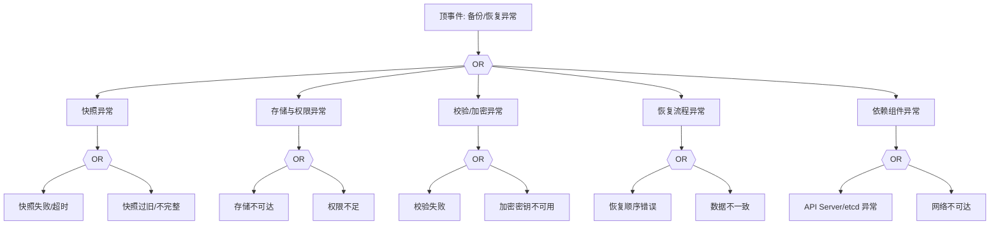

# 备份/恢复异常 FTA 树

## 适用范围与说明
- **目标**：覆盖 etcd 备份失败、恢复失败与数据不一致的关键成因与路径。
- **范围**：快照与存储、校验与加密、权限与访问、恢复流程、依赖组件。
- **符号**：
  - **OR 门**：任一子事件成立即可触发父事件
  - **AND 门**：所有子事件同时成立才触发父事件

---

## Mermaid FTA 树



---

## 生产级观测与证据
- **事件**：备份失败、恢复失败、服务不可用。
- **关键指标**：备份成功率、恢复耗时、快照大小与频率。
- **关键日志**：备份工具日志、`etcd` 日志。
- **配置核对**：快照计划、存储凭据、加密密钥、恢复流程。

---

## JSON 工作流（含与/或门控件）

```json
{
  "flow_steps": [
    { "name": "开始", "action": "start", "step": "start_backup_fta", "next_step": "event_backup_abnormal" },
    { "name": "顶事件: 备份/恢复异常", "action": "event", "step": "event_backup_abnormal", "description": "备份失败/恢复失败", "next_step": "gate_root_or" },
    { "name": "根因 OR 门", "action": "gate_or", "step": "gate_root_or", "control": "or_gate", "gate_type": "OR", "next_steps": ["cat_snap","cat_store","cat_verify","cat_restore","cat_dep"] }
  ]
}
```

---

## 版本适配（1.19–1.30）
- **1.19–1.23**：快照工具与 etcd 版本需对齐，校验流程需补齐。
- **1.24–1.27**：控制面升级时备份/恢复顺序需严格匹配。
- **1.28–1.30**：稳定 API 为主，审计与密钥管理需一致。
- **共性**：遵循 `fta_methodology_and_agentic_practices.md` 中的“版本适配基线”。
