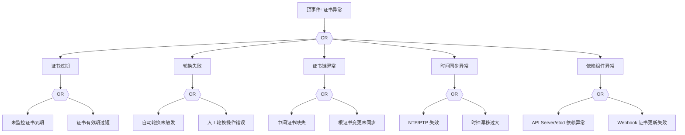

# 证书异常 FTA 树

## 适用范围与说明
- **目标**：覆盖证书过期、链不完整与轮换失败的关键成因与路径。
- **范围**：控制面证书、节点证书、Webhook 证书、时间同步、更新流程。
- **符号**：
  - **OR 门**：任一子事件成立即可触发父事件
  - **AND 门**：所有子事件同时成立才触发父事件

---

## Mermaid FTA 树



---

## 生产级观测与证据
- **事件**：TLS 握手失败、证书校验错误。
- **关键指标**：证书到期时间、证书轮换失败次数。
- **关键日志**：`apiserver`、`kubelet`、`etcd`、Webhook 证书日志。
- **配置核对**：证书有效期、轮换策略、时间同步配置。

---

## JSON 工作流（含与/或门控件）

```json
{
  "flow_steps": [
    { "name": "开始", "action": "start", "step": "start_cert_fta", "next_step": "event_cert_abnormal" },
    { "name": "顶事件: 证书异常", "action": "event", "step": "event_cert_abnormal", "description": "证书过期/链不完整/轮换失败", "next_step": "gate_root_or" },
    { "name": "根因 OR 门", "action": "gate_or", "step": "gate_root_or", "control": "or_gate", "gate_type": "OR", "next_steps": ["cat_exp","cat_rot","cat_chain","cat_time","cat_dep"] }
  ]
}
```

---

## 版本适配（1.19–1.30）
- **1.19–1.23**：证书轮换策略需显式校验，旧版组件对证书链更敏感。
- **1.24–1.27**：控制面组件升级时需同步证书链与审计策略。
- **1.28–1.30**：稳定 API 为主，证书链变更需补齐审计与回滚路径。
- **共性**：遵循 `fta_methodology_and_agentic_practices.md` 中的“版本适配基线”。
