<!-- condition: kubeadm certs check-expiration | grep -E 'EXPIRES|expired' 显示证书即将过期或已过期 -->

# 证书异常 FTA 树

## 适用范围与说明
- **目标**：覆盖证书过期、链不完整与轮换失败的关键成因与路径。
- **范围**：控制面证书、节点证书、Webhook 证书、时间同步、更新流程。
- **符号**：
  - **OR 门**：任一子事件成立即可触发父事件
  - **AND 门**：所有子事件同时成立才触发父事件

---

## Mermaid FTA 树

```mermaid
flowchart TD
  TE[顶事件: 证书异常]
  OR0{{OR}}
  TE --> OR0

  OR0 --> EXP[证书过期]
  OR0 --> ROT[轮换失败]
  OR0 --> CHAIN[证书链异常]
  OR0 --> TIME[时间同步异常]
  OR0 --> DEP[依赖组件异常]
  OR0 --> AUDIT[审计与回滚缺失]

  %% ========== 1. 证书过期 ==========
  EXP_OR{{OR}}
  EXP --> EXP_OR
  EXP_OR --> EXP_CP[控制面证书过期]
  EXP_OR --> EXP_NODE[节点证书过期]
  EXP_OR --> EXP_WH[Webhook/扩展证书过期]

  %% 1.1 控制面证书过期
  EXP_CP_OR{{OR}}
  EXP_CP --> EXP_CP_OR
  EXP_CP_OR --> EXP_CP1[API Server 证书过期]
  EXP_CP_OR --> EXP_CP2[etcd 证书过期]
  EXP_CP_OR --> EXP_CP3[Controller Manager 证书过期]
  EXP_CP_OR --> EXP_CP4[Scheduler 证书过期]

  %% 1.2 节点证书过期
  EXP_NODE_OR{{OR}}
  EXP_NODE --> EXP_NODE_OR
  EXP_NODE_OR --> EXP_NODE1[kubelet 客户端证书过期]
  EXP_NODE_OR --> EXP_NODE2[kubelet 服务端证书过期]
  EXP_NODE_OR --> EXP_NODE3[kube-proxy 证书过期]

  %% 1.3 Webhook/扩展证书过期
  EXP_WH_OR{{OR}}
  EXP_WH --> EXP_WH_OR
  EXP_WH_OR --> EXP_WH1[Admission Webhook 证书过期]
  EXP_WH_OR --> EXP_WH2[API 聚合层证书过期]
  EXP_WH_OR --> EXP_WH3[cert-manager 自签证书过期]

  %% ========== 2. 轮换失败 ==========
  ROT_OR{{OR}}
  ROT --> ROT_OR
  ROT_OR --> ROT_AUTO[自动轮换异常]
  ROT_OR --> ROT_MANUAL[人工轮换异常]
  ROT_OR --> ROT_CM[cert-manager 异常]

  %% 2.1 自动轮换异常
  ROT_AUTO_OR{{OR}}
  ROT_AUTO --> ROT_AUTO_OR
  ROT_AUTO_OR --> ROT_AUTO1[kubelet 轮换未启用]
  ROT_AUTO_OR --> ROT_AUTO2[轮换触发阈值配置错误]
  ROT_AUTO_OR --> ROT_AUTO3[CSR 审批失败]

  %% AND 门：kubelet 轮换未启用 + 证书有效期短
  AND_KUBELET{{"AND: 轮换未启用 + 有效期短"}}
  ROT_AUTO1 --> AND_KUBELET
  AND_KUBELET --> AND_KUBELET1[rotateCertificates 未开启]
  AND_KUBELET --> AND_KUBELET2[证书有效期 < 30 天]

  %% 2.2 人工轮换异常
  ROT_MANUAL_OR{{OR}}
  ROT_MANUAL --> ROT_MANUAL_OR
  ROT_MANUAL_OR --> ROT_MANUAL1[kubeadm 轮换命令失败]
  ROT_MANUAL_OR --> ROT_MANUAL2[证书分发不完整]
  ROT_MANUAL_OR --> ROT_MANUAL3[组件未重启加载新证书]

  %% 2.3 cert-manager 异常
  ROT_CM_OR{{OR}}
  ROT_CM --> ROT_CM_OR
  ROT_CM_OR --> ROT_CM1[cert-manager Pod 不可用]
  ROT_CM_OR --> ROT_CM2[Issuer/ClusterIssuer 配置错误]
  ROT_CM_OR --> ROT_CM3[Certificate CR 状态异常]

  %% ========== 3. 证书链异常 ==========
  CHAIN_OR{{OR}}
  CHAIN --> CHAIN_OR
  CHAIN_OR --> CHAIN_INTER[中间证书异常]
  CHAIN_OR --> CHAIN_ROOT[根证书异常]
  CHAIN_OR --> CHAIN_MISMATCH[证书链不匹配]

  %% 3.1 中间证书异常
  CHAIN_INTER_OR{{OR}}
  CHAIN_INTER --> CHAIN_INTER_OR
  CHAIN_INTER_OR --> CHAIN_INTER1[中间证书缺失]
  CHAIN_INTER_OR --> CHAIN_INTER2[中间证书过期]
  CHAIN_INTER_OR --> CHAIN_INTER3[中间证书顺序错误]

  %% 3.2 根证书异常
  CHAIN_ROOT_OR{{OR}}
  CHAIN_ROOT --> CHAIN_ROOT_OR
  CHAIN_ROOT_OR --> CHAIN_ROOT1[根证书变更未同步]
  CHAIN_ROOT_OR --> CHAIN_ROOT2[根证书不受信任]
  CHAIN_ROOT_OR --> CHAIN_ROOT3[CA 证书过期]

  %% 3.3 证书链不匹配
  CHAIN_MISMATCH_OR{{OR}}
  CHAIN_MISMATCH --> CHAIN_MISMATCH_OR
  CHAIN_MISMATCH_OR --> CHAIN_MISMATCH1[私钥与证书不匹配]
  CHAIN_MISMATCH_OR --> CHAIN_MISMATCH2[证书 SAN 不包含当前域名]
  CHAIN_MISMATCH_OR --> CHAIN_MISMATCH3[证书用途字段不正确]

  %% ========== 4. 时间同步异常 ==========
  TIME_OR{{OR}}
  TIME --> TIME_OR
  TIME_OR --> TIME_NTP[NTP/Chrony 异常]
  TIME_OR --> TIME_DRIFT[时钟漂移异常]
  TIME_OR --> TIME_TZ[时区配置异常]

  %% 4.1 NTP/Chrony 异常
  TIME_NTP_OR{{OR}}
  TIME_NTP --> TIME_NTP_OR
  TIME_NTP_OR --> TIME_NTP1[NTP 服务未运行]
  TIME_NTP_OR --> TIME_NTP2[NTP 服务器不可达]
  TIME_NTP_OR --> TIME_NTP3[Chrony 配置错误]

  %% 4.2 时钟漂移异常
  TIME_DRIFT_OR{{OR}}
  TIME_DRIFT --> TIME_DRIFT_OR
  TIME_DRIFT_OR --> TIME_DRIFT1[节点间时钟偏差 > 1s]
  TIME_DRIFT_OR --> TIME_DRIFT2[控制面与节点时钟不同步]
  TIME_DRIFT_OR --> TIME_DRIFT3[虚拟机时钟漂移]

  %% ========== 5. 依赖组件异常 ==========
  DEP_OR{{OR}}
  DEP --> DEP_OR
  DEP_OR --> DEP_API[API Server 证书依赖异常]
  DEP_OR --> DEP_ETCD[etcd 证书依赖异常]
  DEP_OR --> DEP_WH[Webhook 证书依赖异常]

  %% 5.1 API Server 证书依赖异常
  DEP_API_OR{{OR}}
  DEP_API --> DEP_API_OR
  DEP_API_OR --> DEP_API1[front-proxy 证书异常]
  DEP_API_OR --> DEP_API2[service account 签名密钥异常]
  DEP_API_OR --> DEP_API3[aggregation layer 证书异常]

  %% 5.2 etcd 证书依赖异常
  DEP_ETCD_OR{{OR}}
  DEP_ETCD --> DEP_ETCD_OR
  DEP_ETCD_OR --> DEP_ETCD1[etcd peer 证书异常]
  DEP_ETCD_OR --> DEP_ETCD2[etcd client 证书异常]
  DEP_ETCD_OR --> DEP_ETCD3[etcd server 证书异常]

  %% 5.3 Webhook 证书依赖异常
  DEP_WH_OR{{OR}}
  DEP_WH --> DEP_WH_OR
  DEP_WH_OR --> DEP_WH1[caBundle 未更新]
  DEP_WH_OR --> DEP_WH2[Secret 挂载失败]

  %% AND 门：Webhook 证书异常 + failurePolicy=Fail
  AND_WH{{"AND: Webhook 证书异常 + Fail 策略"}}
  DEP_WH --> AND_WH
  AND_WH --> AND_WH1[Webhook 证书过期或无效]
  AND_WH --> AND_WH2[failurePolicy 设置为 Fail]

  %% ========== 6. 审计与回滚缺失 ==========
  AUDIT_OR{{OR}}
  AUDIT --> AUDIT_OR
  AUDIT_OR --> AUDIT1[证书变更未记录审计日志]
  AUDIT_OR --> AUDIT2[无证书备份/回滚机制]
  AUDIT_OR --> AUDIT3[证书监控告警缺失]
```



---

## 生产级观测与证据
- **事件**：TLS 握手失败、证书校验错误、x509 certificate has expired。
- **关键指标**：
  - `apiserver_client_certificate_expiration_seconds` - 客户端证书到期时间
  - `etcd_server_certificate_expiration_seconds` - etcd 证书到期时间
  - 证书轮换成功/失败次数
- **关键日志**：
  - `apiserver` - x509 证书验证失败日志
  - `kubelet` - 证书轮换日志
  - `etcd` - TLS 握手失败日志
  - Webhook - 证书加载错误日志
- **配置核对**：证书有效期、轮换策略、时间同步配置、CA 信任链。

---

## JSON 工作流（含与/或门控件）

```json
{
  "flow_steps": [
    { "name": "开始", "action": "start", "step": "start_cert_fta", "next_step": "event_cert_abnormal" },
    { "name": "顶事件: 证书异常", "action": "event", "step": "event_cert_abnormal", "description": "证书过期/链不完整/轮换失败", "next_step": "gate_root_or" },
    { "name": "根因 OR 门", "action": "gate_or", "step": "gate_root_or", "control": "or_gate", "gate_type": "OR", "next_steps": ["cat_exp", "cat_rot", "cat_chain", "cat_time", "cat_dep", "cat_audit"] },

    { "name": "类别: 证书过期", "action": "category", "step": "cat_exp", "next_step": "gate_exp_or" },
    { "name": "证书过期 OR 门", "action": "gate_or", "step": "gate_exp_or", "control": "or_gate", "gate_type": "OR", "next_steps": ["subcat_exp_cp", "subcat_exp_node", "subcat_exp_wh"] },

    { "name": "子类: 控制面证书过期", "action": "subcategory", "step": "subcat_exp_cp", "next_step": "gate_exp_cp_or" },
    { "name": "控制面证书 OR 门", "action": "gate_or", "step": "gate_exp_cp_or", "control": "or_gate", "gate_type": "OR", "next_steps": ["event_exp_cp_api", "event_exp_cp_etcd", "event_exp_cp_cm", "event_exp_cp_sched"] },
    {
      "name": "底事件: API Server 证书过期",
      "action": "bottom_event",
      "step": "event_exp_cp_api",
      "description": "kube-apiserver 的服务端或客户端证书已过期",
      "metadata": {
        "severity": "critical",
        "probability": "medium",
        "mttr_minutes": 60,
        "detection": {
          "events": ["CertificateExpired", "TLSHandshakeFailed"],
          "metrics": ["apiserver_client_certificate_expiration_seconds < 0"],
          "logs": ["x509: certificate has expired", "tls: bad certificate"]
        },
        "remediation": {
          "manual_steps": [
            "kubeadm certs renew apiserver",
            "重启 kube-apiserver Pod 或进程",
            "验证新证书有效期: openssl x509 -in /etc/kubernetes/pki/apiserver.crt -noout -dates"
          ],
          "auto_actions": ["触发 cert-manager Certificate 重签", "配置证书轮换告警"]
        }
      },
      "next_step": "gate_root_or"
    },
    {
      "name": "底事件: etcd 证书过期",
      "action": "bottom_event",
      "step": "event_exp_cp_etcd",
      "description": "etcd 服务端、客户端或 peer 证书已过期",
      "metadata": {
        "severity": "critical",
        "probability": "medium",
        "mttr_minutes": 90,
        "detection": {
          "events": ["EtcdCertificateExpired"],
          "metrics": ["etcd_server_certificate_expiration_seconds < 0"],
          "logs": ["transport: authentication handshake failed", "x509: certificate has expired"]
        },
        "remediation": {
          "manual_steps": [
            "kubeadm certs renew etcd-server etcd-peer etcd-healthcheck-client",
            "重启 etcd 容器或服务",
            "验证 etcd 集群健康: etcdctl endpoint health"
          ],
          "auto_actions": ["配置 etcd 证书到期告警"]
        }
      },
      "next_step": "gate_root_or"
    },
    {
      "name": "底事件: Controller Manager 证书过期",
      "action": "bottom_event",
      "step": "event_exp_cp_cm",
      "description": "kube-controller-manager 客户端证书已过期",
      "metadata": {
        "severity": "critical",
        "probability": "low",
        "mttr_minutes": 45,
        "detection": {
          "events": ["ControllerManagerCertExpired"],
          "metrics": [],
          "logs": ["Unable to authenticate the request", "x509: certificate has expired"]
        },
        "remediation": {
          "manual_steps": [
            "kubeadm certs renew controller-manager.conf",
            "重启 kube-controller-manager",
            "验证 controller-manager 日志无证书错误"
          ],
          "auto_actions": []
        }
      },
      "next_step": "gate_root_or"
    },
    {
      "name": "底事件: Scheduler 证书过期",
      "action": "bottom_event",
      "step": "event_exp_cp_sched",
      "description": "kube-scheduler 客户端证书已过期",
      "metadata": {
        "severity": "high",
        "probability": "low",
        "mttr_minutes": 30,
        "detection": {
          "events": ["SchedulerCertExpired"],
          "metrics": [],
          "logs": ["Unable to authenticate the request", "x509: certificate has expired"]
        },
        "remediation": {
          "manual_steps": [
            "kubeadm certs renew scheduler.conf",
            "重启 kube-scheduler",
            "验证调度功能正常"
          ],
          "auto_actions": []
        }
      },
      "next_step": "gate_root_or"
    },

    { "name": "子类: 节点证书过期", "action": "subcategory", "step": "subcat_exp_node", "next_step": "gate_exp_node_or" },
    { "name": "节点证书 OR 门", "action": "gate_or", "step": "gate_exp_node_or", "control": "or_gate", "gate_type": "OR", "next_steps": ["event_exp_node_client", "event_exp_node_server", "event_exp_node_proxy"] },
    {
      "name": "底事件: kubelet 客户端证书过期",
      "action": "bottom_event",
      "step": "event_exp_node_client",
      "description": "kubelet 用于连接 API Server 的客户端证书已过期",
      "metadata": {
        "severity": "critical",
        "probability": "medium",
        "mttr_minutes": 45,
        "detection": {
          "events": ["NodeNotReady", "KubeletCertificateExpired"],
          "metrics": ["kubelet_certificate_manager_client_expiration_seconds"],
          "logs": ["x509: certificate has expired", "Unable to update node status"]
        },
        "remediation": {
          "manual_steps": [
            "检查 kubelet 轮换配置: rotateCertificates",
            "删除旧证书触发重新申请: rm /var/lib/kubelet/pki/kubelet-client-*",
            "重启 kubelet: systemctl restart kubelet"
          ],
          "auto_actions": ["启用 kubelet 自动轮换"]
        }
      },
      "next_step": "gate_root_or"
    },
    {
      "name": "底事件: kubelet 服务端证书过期",
      "action": "bottom_event",
      "step": "event_exp_node_server",
      "description": "kubelet 服务端证书过期导致 metrics/logs 无法采集",
      "metadata": {
        "severity": "high",
        "probability": "medium",
        "mttr_minutes": 30,
        "detection": {
          "events": [],
          "metrics": ["kubelet_certificate_manager_server_expiration_seconds"],
          "logs": ["tls: bad certificate", "x509: certificate has expired"]
        },
        "remediation": {
          "manual_steps": [
            "启用 serverTLSBootstrap: true",
            "审批 CSR: kubectl certificate approve <csr-name>",
            "重启 kubelet"
          ],
          "auto_actions": ["配置 CSR 自动审批控制器"]
        }
      },
      "next_step": "gate_root_or"
    },
    {
      "name": "底事件: kube-proxy 证书过期",
      "action": "bottom_event",
      "step": "event_exp_node_proxy",
      "description": "kube-proxy 客户端证书过期",
      "metadata": {
        "severity": "high",
        "probability": "low",
        "mttr_minutes": 30,
        "detection": {
          "events": [],
          "metrics": [],
          "logs": ["x509: certificate has expired", "Unable to connect to API server"]
        },
        "remediation": {
          "manual_steps": [
            "kubeadm certs renew front-proxy-client (若使用 front-proxy)",
            "重新生成 kube-proxy kubeconfig",
            "重启 kube-proxy DaemonSet"
          ],
          "auto_actions": []
        }
      },
      "next_step": "gate_root_or"
    },

    { "name": "子类: Webhook/扩展证书过期", "action": "subcategory", "step": "subcat_exp_wh", "next_step": "gate_exp_wh_or" },
    { "name": "Webhook证书 OR 门", "action": "gate_or", "step": "gate_exp_wh_or", "control": "or_gate", "gate_type": "OR", "next_steps": ["event_exp_wh_adm", "event_exp_wh_agg", "event_exp_wh_cm"] },
    {
      "name": "底事件: Admission Webhook 证书过期",
      "action": "bottom_event",
      "step": "event_exp_wh_adm",
      "description": "ValidatingWebhookConfiguration 或 MutatingWebhookConfiguration 中引用的证书已过期",
      "metadata": {
        "severity": "critical",
        "probability": "medium",
        "mttr_minutes": 30,
        "detection": {
          "events": ["WebhookCertificateExpired", "FailedAdmission"],
          "metrics": [],
          "logs": ["x509: certificate has expired", "webhook call failed"]
        },
        "remediation": {
          "manual_steps": [
            "检查 Webhook Secret 中证书有效期",
            "更新 Webhook caBundle 字段",
            "重启 Webhook 服务"
          ],
          "auto_actions": ["配置 cert-manager 管理 Webhook 证书"]
        }
      },
      "next_step": "gate_root_or"
    },
    {
      "name": "底事件: API 聚合层证书过期",
      "action": "bottom_event",
      "step": "event_exp_wh_agg",
      "description": "Aggregated API Server 的证书过期",
      "metadata": {
        "severity": "high",
        "probability": "low",
        "mttr_minutes": 45,
        "detection": {
          "events": [],
          "metrics": [],
          "logs": ["x509: certificate has expired", "failed to call webhook"]
        },
        "remediation": {
          "manual_steps": [
            "更新 APIService 的 caBundle",
            "重新签发聚合 API 证书",
            "重启聚合 API Server"
          ],
          "auto_actions": []
        }
      },
      "next_step": "gate_root_or"
    },
    {
      "name": "底事件: cert-manager 自签证书过期",
      "action": "bottom_event",
      "step": "event_exp_wh_cm",
      "description": "cert-manager 签发的证书未及时续期而过期",
      "metadata": {
        "severity": "high",
        "probability": "medium",
        "mttr_minutes": 30,
        "detection": {
          "events": ["CertificateNotReady"],
          "metrics": ["certmanager_certificate_expiration_timestamp_seconds"],
          "logs": ["Certificate is not ready"]
        },
        "remediation": {
          "manual_steps": [
            "检查 Certificate CR 状态: kubectl get certificate -A",
            "检查 Issuer/ClusterIssuer 配置",
            "手动触发续期: kubectl delete secret <cert-secret>"
          ],
          "auto_actions": ["配置 cert-manager 续期告警"]
        }
      },
      "next_step": "gate_root_or"
    },

    { "name": "类别: 轮换失败", "action": "category", "step": "cat_rot", "next_step": "gate_rot_or" },
    { "name": "轮换失败 OR 门", "action": "gate_or", "step": "gate_rot_or", "control": "or_gate", "gate_type": "OR", "next_steps": ["subcat_rot_auto", "subcat_rot_manual", "subcat_rot_cm"] },

    { "name": "子类: 自动轮换异常", "action": "subcategory", "step": "subcat_rot_auto", "next_step": "gate_rot_auto_or" },
    { "name": "自动轮换 OR 门", "action": "gate_or", "step": "gate_rot_auto_or", "control": "or_gate", "gate_type": "OR", "next_steps": ["event_rot_auto_disable", "event_rot_auto_threshold", "event_rot_auto_csr"] },
    {
      "name": "底事件: kubelet 轮换未启用 (AND 门入口)",
      "action": "bottom_event",
      "step": "event_rot_auto_disable",
      "description": "kubelet 配置未启用证书自动轮换",
      "metadata": {
        "severity": "high",
        "probability": "medium",
        "mttr_minutes": 20,
        "detection": {
          "events": [],
          "metrics": [],
          "logs": ["kubelet config: rotateCertificates: false"]
        },
        "remediation": {
          "manual_steps": [
            "编辑 kubelet 配置: rotateCertificates: true",
            "重启 kubelet",
            "验证轮换状态: kubectl get csr"
          ],
          "auto_actions": []
        },
        "and_gate": {
          "description": "轮换未启用 + 证书有效期短 同时存在时风险极高",
          "conditions": ["rotateCertificates 未开启", "证书有效期 < 30 天"],
          "combined_severity": "critical"
        }
      },
      "next_step": "gate_root_or"
    },
    {
      "name": "底事件: 轮换触发阈值配置错误",
      "action": "bottom_event",
      "step": "event_rot_auto_threshold",
      "description": "证书轮换触发阈值配置不合理导致轮换过晚或不触发",
      "metadata": {
        "severity": "medium",
        "probability": "low",
        "mttr_minutes": 15,
        "detection": {
          "events": [],
          "metrics": [],
          "logs": ["certificate rotation threshold"]
        },
        "remediation": {
          "manual_steps": [
            "检查 kubelet 配置: rotateCertificates, certificateRotation",
            "调整轮换阈值为证书有效期的 70-80%",
            "重启 kubelet"
          ],
          "auto_actions": []
        }
      },
      "next_step": "gate_root_or"
    },
    {
      "name": "底事件: CSR 审批失败",
      "action": "bottom_event",
      "step": "event_rot_auto_csr",
      "description": "kubelet 提交的 CSR 未被批准导致证书轮换失败",
      "metadata": {
        "severity": "high",
        "probability": "medium",
        "mttr_minutes": 30,
        "detection": {
          "events": ["CertificateSigningRequestPending"],
          "metrics": [],
          "logs": ["csr pending approval", "failed to renew certificate"]
        },
        "remediation": {
          "manual_steps": [
            "查看待审批 CSR: kubectl get csr",
            "手动审批: kubectl certificate approve <csr-name>",
            "检查 CSR 自动审批控制器状态"
          ],
          "auto_actions": ["配置自动 CSR 审批策略"]
        }
      },
      "next_step": "gate_root_or"
    },

    { "name": "子类: 人工轮换异常", "action": "subcategory", "step": "subcat_rot_manual", "next_step": "gate_rot_manual_or" },
    { "name": "人工轮换 OR 门", "action": "gate_or", "step": "gate_rot_manual_or", "control": "or_gate", "gate_type": "OR", "next_steps": ["event_rot_manual_kubeadm", "event_rot_manual_dist", "event_rot_manual_restart"] },
    {
      "name": "底事件: kubeadm 轮换命令失败",
      "action": "bottom_event",
      "step": "event_rot_manual_kubeadm",
      "description": "执行 kubeadm certs renew 命令失败",
      "metadata": {
        "severity": "high",
        "probability": "low",
        "mttr_minutes": 45,
        "detection": {
          "events": [],
          "metrics": [],
          "logs": ["kubeadm certs renew failed", "error renewing certificate"]
        },
        "remediation": {
          "manual_steps": [
            "检查 kubeadm 版本与集群版本匹配",
            "检查 CA 证书和密钥文件权限",
            "查看详细错误: kubeadm certs renew all --v=5"
          ],
          "auto_actions": []
        }
      },
      "next_step": "gate_root_or"
    },
    {
      "name": "底事件: 证书分发不完整",
      "action": "bottom_event",
      "step": "event_rot_manual_dist",
      "description": "新证书未正确分发到所有需要的节点和组件",
      "metadata": {
        "severity": "high",
        "probability": "medium",
        "mttr_minutes": 60,
        "detection": {
          "events": [],
          "metrics": [],
          "logs": ["certificate mismatch", "tls: certificate verification failed"]
        },
        "remediation": {
          "manual_steps": [
            "对比各节点证书指纹: openssl x509 -fingerprint -noout",
            "同步证书到所有控制面节点",
            "更新 kubeconfig 文件"
          ],
          "auto_actions": []
        }
      },
      "next_step": "gate_root_or"
    },
    {
      "name": "底事件: 组件未重启加载新证书",
      "action": "bottom_event",
      "step": "event_rot_manual_restart",
      "description": "证书更新后相关组件未重启，仍使用旧证书",
      "metadata": {
        "severity": "medium",
        "probability": "common",
        "mttr_minutes": 15,
        "detection": {
          "events": [],
          "metrics": [],
          "logs": ["using old certificate", "certificate expiring soon"]
        },
        "remediation": {
          "manual_steps": [
            "重启 kube-apiserver, controller-manager, scheduler",
            "重启 etcd (若更新了 etcd 证书)",
            "验证组件使用新证书"
          ],
          "auto_actions": []
        }
      },
      "next_step": "gate_root_or"
    },

    { "name": "子类: cert-manager 异常", "action": "subcategory", "step": "subcat_rot_cm", "next_step": "gate_rot_cm_or" },
    { "name": "cert-manager OR 门", "action": "gate_or", "step": "gate_rot_cm_or", "control": "or_gate", "gate_type": "OR", "next_steps": ["event_rot_cm_pod", "event_rot_cm_issuer", "event_rot_cm_status"] },
    {
      "name": "底事件: cert-manager Pod 不可用",
      "action": "bottom_event",
      "step": "event_rot_cm_pod",
      "description": "cert-manager 控制器 Pod 异常导致证书无法自动续期",
      "metadata": {
        "severity": "high",
        "probability": "low",
        "mttr_minutes": 30,
        "detection": {
          "events": ["PodNotReady", "CrashLoopBackOff"],
          "metrics": ["up{job='cert-manager'}"],
          "logs": ["cert-manager pod crash", "controller not ready"]
        },
        "remediation": {
          "manual_steps": [
            "检查 cert-manager 部署状态: kubectl get pods -n cert-manager",
            "查看 Pod 日志: kubectl logs -n cert-manager deploy/cert-manager",
            "重新部署 cert-manager"
          ],
          "auto_actions": ["配置 cert-manager 可用性告警"]
        }
      },
      "next_step": "gate_root_or"
    },
    {
      "name": "底事件: Issuer/ClusterIssuer 配置错误",
      "action": "bottom_event",
      "step": "event_rot_cm_issuer",
      "description": "证书签发者配置错误导致无法签发证书",
      "metadata": {
        "severity": "high",
        "probability": "medium",
        "mttr_minutes": 30,
        "detection": {
          "events": ["IssuerNotReady"],
          "metrics": ["certmanager_issuer_ready"],
          "logs": ["issuer not ready", "failed to initialize issuer"]
        },
        "remediation": {
          "manual_steps": [
            "检查 Issuer/ClusterIssuer 状态: kubectl get issuer,clusterissuer -A",
            "验证 CA 密钥和证书配置",
            "检查 ACME 配置 (若使用 Let's Encrypt)"
          ],
          "auto_actions": []
        }
      },
      "next_step": "gate_root_or"
    },
    {
      "name": "底事件: Certificate CR 状态异常",
      "action": "bottom_event",
      "step": "event_rot_cm_status",
      "description": "Certificate 资源状态异常，无法完成签发流程",
      "metadata": {
        "severity": "high",
        "probability": "medium",
        "mttr_minutes": 30,
        "detection": {
          "events": ["CertificateRequestFailed"],
          "metrics": ["certmanager_certificate_ready_status"],
          "logs": ["failed to issue certificate", "certificate request denied"]
        },
        "remediation": {
          "manual_steps": [
            "检查 Certificate 状态: kubectl describe certificate <name>",
            "检查关联的 CertificateRequest: kubectl get certificaterequest",
            "删除失败的 CertificateRequest 重新触发"
          ],
          "auto_actions": []
        }
      },
      "next_step": "gate_root_or"
    },

    { "name": "类别: 证书链异常", "action": "category", "step": "cat_chain", "next_step": "gate_chain_or" },
    { "name": "证书链 OR 门", "action": "gate_or", "step": "gate_chain_or", "control": "or_gate", "gate_type": "OR", "next_steps": ["subcat_chain_inter", "subcat_chain_root", "subcat_chain_mismatch"] },

    { "name": "子类: 中间证书异常", "action": "subcategory", "step": "subcat_chain_inter", "next_step": "gate_chain_inter_or" },
    { "name": "中间证书 OR 门", "action": "gate_or", "step": "gate_chain_inter_or", "control": "or_gate", "gate_type": "OR", "next_steps": ["event_chain_inter_miss", "event_chain_inter_exp", "event_chain_inter_order"] },
    {
      "name": "底事件: 中间证书缺失",
      "action": "bottom_event",
      "step": "event_chain_inter_miss",
      "description": "证书链中缺少必要的中间证书",
      "metadata": {
        "severity": "high",
        "probability": "medium",
        "mttr_minutes": 30,
        "detection": {
          "events": [],
          "metrics": [],
          "logs": ["unable to verify certificate chain", "certificate chain incomplete"]
        },
        "remediation": {
          "manual_steps": [
            "获取完整证书链",
            "将中间证书添加到证书文件: cat server.crt intermediate.crt > fullchain.crt",
            "重新配置组件使用完整证书链"
          ],
          "auto_actions": []
        }
      },
      "next_step": "gate_root_or"
    },
    {
      "name": "底事件: 中间证书过期",
      "action": "bottom_event",
      "step": "event_chain_inter_exp",
      "description": "证书链中的中间证书已过期",
      "metadata": {
        "severity": "high",
        "probability": "low",
        "mttr_minutes": 45,
        "detection": {
          "events": [],
          "metrics": [],
          "logs": ["x509: certificate has expired", "intermediate certificate expired"]
        },
        "remediation": {
          "manual_steps": [
            "获取新的中间证书",
            "更新证书链文件",
            "重启相关组件"
          ],
          "auto_actions": []
        }
      },
      "next_step": "gate_root_or"
    },
    {
      "name": "底事件: 中间证书顺序错误",
      "action": "bottom_event",
      "step": "event_chain_inter_order",
      "description": "证书链中证书顺序不正确",
      "metadata": {
        "severity": "medium",
        "probability": "low",
        "mttr_minutes": 20,
        "detection": {
          "events": [],
          "metrics": [],
          "logs": ["certificate chain verification failed"]
        },
        "remediation": {
          "manual_steps": [
            "按正确顺序重新组合证书: 服务端证书 -> 中间证书 -> 根证书",
            "验证证书链: openssl verify -CAfile ca.crt fullchain.crt"
          ],
          "auto_actions": []
        }
      },
      "next_step": "gate_root_or"
    },

    { "name": "子类: 根证书异常", "action": "subcategory", "step": "subcat_chain_root", "next_step": "gate_chain_root_or" },
    { "name": "根证书 OR 门", "action": "gate_or", "step": "gate_chain_root_or", "control": "or_gate", "gate_type": "OR", "next_steps": ["event_chain_root_sync", "event_chain_root_trust", "event_chain_root_exp"] },
    {
      "name": "底事件: 根证书变更未同步",
      "action": "bottom_event",
      "step": "event_chain_root_sync",
      "description": "CA 根证书更新后未同步到所有组件",
      "metadata": {
        "severity": "critical",
        "probability": "low",
        "mttr_minutes": 60,
        "detection": {
          "events": [],
          "metrics": [],
          "logs": ["x509: certificate signed by unknown authority"]
        },
        "remediation": {
          "manual_steps": [
            "将新根证书同步到所有节点的 /etc/kubernetes/pki/",
            "更新各组件的 kubeconfig 和 CA 配置",
            "重启所有控制面和节点组件"
          ],
          "auto_actions": []
        }
      },
      "next_step": "gate_root_or"
    },
    {
      "name": "底事件: 根证书不受信任",
      "action": "bottom_event",
      "step": "event_chain_root_trust",
      "description": "使用的根证书不在系统信任存储中",
      "metadata": {
        "severity": "high",
        "probability": "low",
        "mttr_minutes": 30,
        "detection": {
          "events": [],
          "metrics": [],
          "logs": ["x509: certificate signed by unknown authority"]
        },
        "remediation": {
          "manual_steps": [
            "将 CA 证书添加到系统信任存储: cp ca.crt /etc/pki/ca-trust/source/anchors/",
            "更新信任存储: update-ca-trust",
            "或在组件配置中显式指定 CA"
          ],
          "auto_actions": []
        }
      },
      "next_step": "gate_root_or"
    },
    {
      "name": "底事件: CA 证书过期",
      "action": "bottom_event",
      "step": "event_chain_root_exp",
      "description": "集群 CA 证书过期导致所有证书验证失败",
      "metadata": {
        "severity": "critical",
        "probability": "rare",
        "mttr_minutes": 120,
        "detection": {
          "events": ["ClusterCAExpired"],
          "metrics": [],
          "logs": ["x509: certificate has expired", "CA certificate expired"]
        },
        "remediation": {
          "manual_steps": [
            "评估 CA 轮换影响范围",
            "执行 CA 证书轮换: kubeadm certs renew ca",
            "重新签发所有依赖证书",
            "滚动重启所有组件"
          ],
          "auto_actions": ["配置 CA 证书到期告警"]
        }
      },
      "next_step": "gate_root_or"
    },

    { "name": "子类: 证书链不匹配", "action": "subcategory", "step": "subcat_chain_mismatch", "next_step": "gate_chain_mismatch_or" },
    { "name": "证书链不匹配 OR 门", "action": "gate_or", "step": "gate_chain_mismatch_or", "control": "or_gate", "gate_type": "OR", "next_steps": ["event_chain_key_mismatch", "event_chain_san", "event_chain_usage"] },
    {
      "name": "底事件: 私钥与证书不匹配",
      "action": "bottom_event",
      "step": "event_chain_key_mismatch",
      "description": "证书与对应私钥的公钥不匹配",
      "metadata": {
        "severity": "critical",
        "probability": "low",
        "mttr_minutes": 30,
        "detection": {
          "events": [],
          "metrics": [],
          "logs": ["tls: private key does not match public key"]
        },
        "remediation": {
          "manual_steps": [
            "验证匹配: openssl x509 -noout -modulus -in cert.crt | openssl md5; openssl rsa -noout -modulus -in key.key | openssl md5",
            "使用正确的密钥对重新生成证书"
          ],
          "auto_actions": []
        }
      },
      "next_step": "gate_root_or"
    },
    {
      "name": "底事件: 证书 SAN 不包含当前域名",
      "action": "bottom_event",
      "step": "event_chain_san",
      "description": "证书的 Subject Alternative Name 不包含服务访问的域名或 IP",
      "metadata": {
        "severity": "high",
        "probability": "medium",
        "mttr_minutes": 30,
        "detection": {
          "events": [],
          "metrics": [],
          "logs": ["x509: certificate is valid for X, not Y"]
        },
        "remediation": {
          "manual_steps": [
            "检查证书 SAN: openssl x509 -noout -text -in cert.crt | grep -A1 'Subject Alternative Name'",
            "重新生成包含正确 SAN 的证书",
            "更新 kubeadm-config 中的 certSANs"
          ],
          "auto_actions": []
        }
      },
      "next_step": "gate_root_or"
    },
    {
      "name": "底事件: 证书用途字段不正确",
      "action": "bottom_event",
      "step": "event_chain_usage",
      "description": "证书的 Key Usage 或 Extended Key Usage 不满足要求",
      "metadata": {
        "severity": "medium",
        "probability": "low",
        "mttr_minutes": 30,
        "detection": {
          "events": [],
          "metrics": [],
          "logs": ["certificate specifies incompatible key usage"]
        },
        "remediation": {
          "manual_steps": [
            "检查证书用途: openssl x509 -noout -text -in cert.crt | grep -A3 'Key Usage'",
            "服务端证书需要: Digital Signature, Key Encipherment, Server Authentication",
            "客户端证书需要: Digital Signature, Key Encipherment, Client Authentication"
          ],
          "auto_actions": []
        }
      },
      "next_step": "gate_root_or"
    },

    { "name": "类别: 时间同步异常", "action": "category", "step": "cat_time", "next_step": "gate_time_or" },
    { "name": "时间同步 OR 门", "action": "gate_or", "step": "gate_time_or", "control": "or_gate", "gate_type": "OR", "next_steps": ["subcat_time_ntp", "subcat_time_drift", "subcat_time_tz"] },

    { "name": "子类: NTP/Chrony 异常", "action": "subcategory", "step": "subcat_time_ntp", "next_step": "gate_time_ntp_or" },
    { "name": "NTP OR 门", "action": "gate_or", "step": "gate_time_ntp_or", "control": "or_gate", "gate_type": "OR", "next_steps": ["event_time_ntp_stop", "event_time_ntp_server", "event_time_ntp_config"] },
    {
      "name": "底事件: NTP 服务未运行",
      "action": "bottom_event",
      "step": "event_time_ntp_stop",
      "description": "NTP/Chrony 服务停止导致时间无法同步",
      "metadata": {
        "severity": "high",
        "probability": "low",
        "mttr_minutes": 15,
        "detection": {
          "events": [],
          "metrics": ["node_timex_sync_status"],
          "logs": ["chronyd stopped", "ntpd not running"]
        },
        "remediation": {
          "manual_steps": [
            "检查服务状态: systemctl status chronyd/ntpd",
            "启动服务: systemctl start chronyd",
            "设置开机自启: systemctl enable chronyd"
          ],
          "auto_actions": []
        }
      },
      "next_step": "gate_root_or"
    },
    {
      "name": "底事件: NTP 服务器不可达",
      "action": "bottom_event",
      "step": "event_time_ntp_server",
      "description": "配置的 NTP 服务器无法访问",
      "metadata": {
        "severity": "medium",
        "probability": "medium",
        "mttr_minutes": 20,
        "detection": {
          "events": [],
          "metrics": ["node_ntp_offset_seconds"],
          "logs": ["server unreachable", "no servers reachable"]
        },
        "remediation": {
          "manual_steps": [
            "检查网络连通性: ping ntp.server.com",
            "检查防火墙是否放通 UDP 123 端口",
            "配置备用 NTP 服务器"
          ],
          "auto_actions": []
        }
      },
      "next_step": "gate_root_or"
    },
    {
      "name": "底事件: Chrony 配置错误",
      "action": "bottom_event",
      "step": "event_time_ntp_config",
      "description": "Chrony/NTP 配置文件错误导致同步失败",
      "metadata": {
        "severity": "medium",
        "probability": "low",
        "mttr_minutes": 15,
        "detection": {
          "events": [],
          "metrics": [],
          "logs": ["configuration error", "invalid server"]
        },
        "remediation": {
          "manual_steps": [
            "检查配置文件: cat /etc/chrony.conf",
            "验证配置语法",
            "重启服务: systemctl restart chronyd"
          ],
          "auto_actions": []
        }
      },
      "next_step": "gate_root_or"
    },

    { "name": "子类: 时钟漂移异常", "action": "subcategory", "step": "subcat_time_drift", "next_step": "gate_time_drift_or" },
    { "name": "时钟漂移 OR 门", "action": "gate_or", "step": "gate_time_drift_or", "control": "or_gate", "gate_type": "OR", "next_steps": ["event_time_drift_node", "event_time_drift_cp", "event_time_drift_vm"] },
    {
      "name": "底事件: 节点间时钟偏差过大",
      "action": "bottom_event",
      "step": "event_time_drift_node",
      "description": "集群节点间时钟偏差超过 1 秒",
      "metadata": {
        "severity": "high",
        "probability": "medium",
        "mttr_minutes": 30,
        "detection": {
          "events": [],
          "metrics": ["node_timex_offset_seconds"],
          "logs": ["clock skew detected"]
        },
        "remediation": {
          "manual_steps": [
            "检查各节点时间: date 或 timedatectl",
            "强制同步: chronyc makestep",
            "配置统一的 NTP 源"
          ],
          "auto_actions": ["配置时钟偏差告警"]
        }
      },
      "next_step": "gate_root_or"
    },
    {
      "name": "底事件: 控制面与节点时钟不同步",
      "action": "bottom_event",
      "step": "event_time_drift_cp",
      "description": "控制面节点与工作节点时钟偏差过大",
      "metadata": {
        "severity": "high",
        "probability": "low",
        "mttr_minutes": 30,
        "detection": {
          "events": [],
          "metrics": [],
          "logs": ["certificate valid from future", "clock skew"]
        },
        "remediation": {
          "manual_steps": [
            "比较控制面和工作节点时间",
            "统一 NTP 配置",
            "同步时间后重启受影响组件"
          ],
          "auto_actions": []
        }
      },
      "next_step": "gate_root_or"
    },
    {
      "name": "底事件: 虚拟机时钟漂移",
      "action": "bottom_event",
      "step": "event_time_drift_vm",
      "description": "虚拟机环境下时钟漂移问题",
      "metadata": {
        "severity": "medium",
        "probability": "medium",
        "mttr_minutes": 30,
        "detection": {
          "events": [],
          "metrics": [],
          "logs": ["guest clock drift"]
        },
        "remediation": {
          "manual_steps": [
            "启用 VMware Tools/Guest Additions 时间同步",
            "配置 kvm-clock 或 tsc clocksource",
            "增加 NTP 同步频率"
          ],
          "auto_actions": []
        }
      },
      "next_step": "gate_root_or"
    },

    { "name": "子类: 时区配置异常", "action": "subcategory", "step": "subcat_time_tz", "next_step": "gate_time_tz_or" },
    { "name": "时区 OR 门", "action": "gate_or", "step": "gate_time_tz_or", "control": "or_gate", "gate_type": "OR", "next_steps": ["event_time_tz_mismatch"] },
    {
      "name": "底事件: 时区配置不一致",
      "action": "bottom_event",
      "step": "event_time_tz_mismatch",
      "description": "集群节点间时区配置不一致",
      "metadata": {
        "severity": "low",
        "probability": "low",
        "mttr_minutes": 15,
        "detection": {
          "events": [],
          "metrics": [],
          "logs": []
        },
        "remediation": {
          "manual_steps": [
            "统一配置时区: timedatectl set-timezone UTC",
            "Kubernetes 内部使用 UTC，建议所有节点使用 UTC"
          ],
          "auto_actions": []
        }
      },
      "next_step": "gate_root_or"
    },

    { "name": "类别: 依赖组件异常", "action": "category", "step": "cat_dep", "next_step": "gate_dep_or" },
    { "name": "依赖组件 OR 门", "action": "gate_or", "step": "gate_dep_or", "control": "or_gate", "gate_type": "OR", "next_steps": ["subcat_dep_api", "subcat_dep_etcd", "subcat_dep_wh"] },

    { "name": "子类: API Server 证书依赖异常", "action": "subcategory", "step": "subcat_dep_api", "next_step": "gate_dep_api_or" },
    { "name": "API Server 依赖 OR 门", "action": "gate_or", "step": "gate_dep_api_or", "control": "or_gate", "gate_type": "OR", "next_steps": ["event_dep_api_fp", "event_dep_api_sa", "event_dep_api_agg"] },
    {
      "name": "底事件: front-proxy 证书异常",
      "action": "bottom_event",
      "step": "event_dep_api_fp",
      "description": "API Server front-proxy 证书配置异常",
      "metadata": {
        "severity": "high",
        "probability": "low",
        "mttr_minutes": 45,
        "detection": {
          "events": [],
          "metrics": [],
          "logs": ["front-proxy certificate error", "aggregation layer failed"]
        },
        "remediation": {
          "manual_steps": [
            "kubeadm certs renew front-proxy-client",
            "检查 front-proxy-ca.crt 配置",
            "重启 kube-apiserver"
          ],
          "auto_actions": []
        }
      },
      "next_step": "gate_root_or"
    },
    {
      "name": "底事件: Service Account 签名密钥异常",
      "action": "bottom_event",
      "step": "event_dep_api_sa",
      "description": "SA Token 签名密钥配置错误或不匹配",
      "metadata": {
        "severity": "critical",
        "probability": "low",
        "mttr_minutes": 60,
        "detection": {
          "events": ["ServiceAccountIssuerDiscoveryError"],
          "metrics": [],
          "logs": ["invalid service account token", "signature verification failed"]
        },
        "remediation": {
          "manual_steps": [
            "检查 sa.key 和 sa.pub 文件",
            "确保 API Server 和 Controller Manager 使用相同的 SA 密钥",
            "重新生成 SA Token"
          ],
          "auto_actions": []
        }
      },
      "next_step": "gate_root_or"
    },
    {
      "name": "底事件: Aggregation Layer 证书异常",
      "action": "bottom_event",
      "step": "event_dep_api_agg",
      "description": "聚合 API 层证书配置错误",
      "metadata": {
        "severity": "high",
        "probability": "low",
        "mttr_minutes": 45,
        "detection": {
          "events": [],
          "metrics": [],
          "logs": ["aggregation layer certificate error"]
        },
        "remediation": {
          "manual_steps": [
            "检查 requestheader-client-ca-file 配置",
            "更新 APIService 的 caBundle",
            "重启 kube-apiserver"
          ],
          "auto_actions": []
        }
      },
      "next_step": "gate_root_or"
    },

    { "name": "子类: etcd 证书依赖异常", "action": "subcategory", "step": "subcat_dep_etcd", "next_step": "gate_dep_etcd_or" },
    { "name": "etcd 依赖 OR 门", "action": "gate_or", "step": "gate_dep_etcd_or", "control": "or_gate", "gate_type": "OR", "next_steps": ["event_dep_etcd_peer", "event_dep_etcd_client", "event_dep_etcd_server"] },
    {
      "name": "底事件: etcd peer 证书异常",
      "action": "bottom_event",
      "step": "event_dep_etcd_peer",
      "description": "etcd 节点间通信证书异常",
      "metadata": {
        "severity": "critical",
        "probability": "low",
        "mttr_minutes": 60,
        "detection": {
          "events": ["EtcdMemberUnhealthy"],
          "metrics": ["etcd_server_has_leader"],
          "logs": ["peer certificate error", "failed to communicate with peer"]
        },
        "remediation": {
          "manual_steps": [
            "kubeadm certs renew etcd-peer",
            "确保所有 etcd 节点使用相同 CA 签发的 peer 证书",
            "滚动重启 etcd 集群"
          ],
          "auto_actions": []
        }
      },
      "next_step": "gate_root_or"
    },
    {
      "name": "底事件: etcd client 证书异常",
      "action": "bottom_event",
      "step": "event_dep_etcd_client",
      "description": "API Server 访问 etcd 的客户端证书异常",
      "metadata": {
        "severity": "critical",
        "probability": "low",
        "mttr_minutes": 45,
        "detection": {
          "events": [],
          "metrics": [],
          "logs": ["etcd client certificate error", "tls: bad certificate"]
        },
        "remediation": {
          "manual_steps": [
            "kubeadm certs renew apiserver-etcd-client",
            "验证证书 CN 和 Organization 字段",
            "重启 kube-apiserver"
          ],
          "auto_actions": []
        }
      },
      "next_step": "gate_root_or"
    },
    {
      "name": "底事件: etcd server 证书异常",
      "action": "bottom_event",
      "step": "event_dep_etcd_server",
      "description": "etcd 服务端证书配置异常",
      "metadata": {
        "severity": "critical",
        "probability": "low",
        "mttr_minutes": 60,
        "detection": {
          "events": [],
          "metrics": [],
          "logs": ["etcd server certificate error"]
        },
        "remediation": {
          "manual_steps": [
            "kubeadm certs renew etcd-server",
            "检查证书 SAN 包含正确的 IP 和域名",
            "重启 etcd"
          ],
          "auto_actions": []
        }
      },
      "next_step": "gate_root_or"
    },

    { "name": "子类: Webhook 证书依赖异常", "action": "subcategory", "step": "subcat_dep_wh", "next_step": "gate_dep_wh_or" },
    { "name": "Webhook 依赖 OR 门", "action": "gate_or", "step": "gate_dep_wh_or", "control": "or_gate", "gate_type": "OR", "next_steps": ["event_dep_wh_cabundle", "event_dep_wh_secret", "gate_and_wh_fail"] },
    {
      "name": "底事件: caBundle 未更新",
      "action": "bottom_event",
      "step": "event_dep_wh_cabundle",
      "description": "Webhook 配置中的 caBundle 与实际 CA 不匹配",
      "metadata": {
        "severity": "high",
        "probability": "medium",
        "mttr_minutes": 20,
        "detection": {
          "events": ["WebhookCallFailed"],
          "metrics": [],
          "logs": ["x509: certificate signed by unknown authority"]
        },
        "remediation": {
          "manual_steps": [
            "获取当前 CA: kubectl get secret <webhook-secret> -o jsonpath='{.data.ca\\.crt}'",
            "更新 WebhookConfiguration 的 caBundle 字段",
            "或配置 cert-manager 自动注入 caBundle"
          ],
          "auto_actions": ["使用 cert-manager cainjector 自动更新 caBundle"]
        }
      },
      "next_step": "gate_root_or"
    },
    {
      "name": "底事件: Secret 挂载失败",
      "action": "bottom_event",
      "step": "event_dep_wh_secret",
      "description": "Webhook Pod 无法挂载证书 Secret",
      "metadata": {
        "severity": "high",
        "probability": "low",
        "mttr_minutes": 20,
        "detection": {
          "events": ["FailedMount"],
          "metrics": [],
          "logs": ["MountVolume.SetUp failed"]
        },
        "remediation": {
          "manual_steps": [
            "检查 Secret 是否存在: kubectl get secret <name>",
            "检查 Pod ServiceAccount 权限",
            "重新创建 Secret"
          ],
          "auto_actions": []
        }
      },
      "next_step": "gate_root_or"
    },
    {
      "name": "AND 门: Webhook 证书异常 + Fail 策略",
      "action": "gate_and",
      "step": "gate_and_wh_fail",
      "control": "and_gate",
      "gate_type": "AND",
      "description": "当 Webhook 证书异常且 failurePolicy=Fail 时，所有 API 请求将被拒绝",
      "conditions": ["Webhook 证书过期或无效", "failurePolicy 设置为 Fail"],
      "combined_severity": "critical",
      "next_steps": ["event_and_wh_cert", "event_and_wh_policy"],
      "next_step": "gate_root_or"
    },
    {
      "name": "AND 条件1: Webhook 证书异常",
      "action": "and_condition",
      "step": "event_and_wh_cert",
      "description": "Webhook 服务的 TLS 证书过期、无效或配置错误",
      "parent_gate": "gate_and_wh_fail"
    },
    {
      "name": "AND 条件2: failurePolicy=Fail",
      "action": "and_condition",
      "step": "event_and_wh_policy",
      "description": "Webhook 的 failurePolicy 配置为 Fail 而非 Ignore",
      "parent_gate": "gate_and_wh_fail"
    },

    { "name": "类别: 审计与回滚缺失", "action": "category", "step": "cat_audit", "next_step": "gate_audit_or" },
    { "name": "审计回滚 OR 门", "action": "gate_or", "step": "gate_audit_or", "control": "or_gate", "gate_type": "OR", "next_steps": ["event_audit_log", "event_audit_backup", "event_audit_monitor"] },
    {
      "name": "底事件: 证书变更未记录审计日志",
      "action": "bottom_event",
      "step": "event_audit_log",
      "description": "证书轮换或更新操作未记录审计日志",
      "metadata": {
        "severity": "medium",
        "probability": "common",
        "mttr_minutes": 30,
        "detection": {
          "events": [],
          "metrics": [],
          "logs": []
        },
        "remediation": {
          "manual_steps": [
            "配置审计策略记录证书相关操作",
            "启用 API Server 审计日志",
            "记录 kubeadm certs 命令执行历史"
          ],
          "auto_actions": []
        }
      },
      "next_step": "gate_root_or"
    },
    {
      "name": "底事件: 无证书备份/回滚机制",
      "action": "bottom_event",
      "step": "event_audit_backup",
      "description": "证书更新前未备份，无法回滚",
      "metadata": {
        "severity": "high",
        "probability": "common",
        "mttr_minutes": 60,
        "detection": {
          "events": [],
          "metrics": [],
          "logs": []
        },
        "remediation": {
          "manual_steps": [
            "更新前备份 /etc/kubernetes/pki/ 目录",
            "备份 kubeconfig 文件",
            "建立证书回滚流程文档"
          ],
          "auto_actions": ["配置定期证书备份脚本"]
        }
      },
      "next_step": "gate_root_or"
    },
    {
      "name": "底事件: 证书监控告警缺失",
      "action": "bottom_event",
      "step": "event_audit_monitor",
      "description": "无证书到期监控和告警机制",
      "metadata": {
        "severity": "high",
        "probability": "common",
        "mttr_minutes": 45,
        "detection": {
          "events": [],
          "metrics": [],
          "logs": []
        },
        "remediation": {
          "manual_steps": [
            "配置 Prometheus 采集证书到期指标",
            "设置告警规则: 证书到期前 30/14/7 天告警",
            "部署 x509-certificate-exporter 或类似工具"
          ],
          "auto_actions": ["部署证书监控组件"]
        }
      },
      "next_step": "gate_root_or"
    },

    { "name": "结束", "action": "end", "step": "end_cert_fta" }
  ]
}
```

---

## 版本适配（1.19–1.30）
- **1.19–1.23**：
  - kubelet 证书轮换需显式启用 rotateCertificates
  - 旧版组件对证书链顺序和完整性更敏感
  - kubeadm certs 命令在早期版本功能有限
- **1.24–1.27**：
  - ServiceAccount Token 改为 bound token，有效期默认 1 小时
  - 控制面组件升级时需同步证书链与审计策略
  - cert-manager 集成更加成熟
- **1.28–1.30**：
  - 稳定 API 为主，证书链变更需补齐审计与回滚路径
  - 支持更多细粒度的证书轮换控制
  - 推荐使用 cert-manager 管理所有证书
- **共性**：
  - 证书到期是集群最常见的故障原因之一
  - 时间同步是证书验证的前提条件
  - 遵循 `fta-methodology-and-agentic-practices.md` 中的"版本适配基线"
