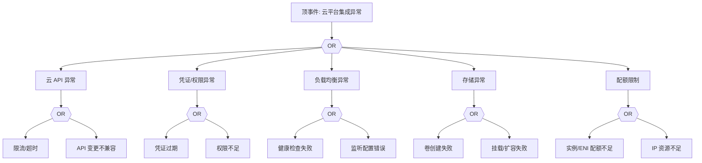

# 云平台集成异常 FTA 树

## 适用范围与说明
- **目标**：覆盖云平台 API 失败、负载均衡/存储操作失败与配额限制的关键成因与路径。
- **范围**：云 API、凭证与权限、负载均衡、块存储、网络与配额。
- **符号**：
  - **OR 门**：任一子事件成立即可触发父事件
  - **AND 门**：所有子事件同时成立才触发父事件

---

## Mermaid FTA 树



---

## 生产级观测与证据
- **事件**：云 API 调用失败、LB 不健康、磁盘操作失败。
- **关键指标**：云 API 错误率、LB 健康状态、磁盘操作失败率。
- **关键日志**：云平台操作日志、控制器日志。
- **配置核对**：云凭证、权限策略、LB/存储配置。

---

## JSON 工作流（含与/或门控件）

```json
{
  "flow_steps": [
    { "name": "开始", "action": "start", "step": "start_cloud_fta", "next_step": "event_cloud_abnormal" },
    { "name": "顶事件: 云平台集成异常", "action": "event", "step": "event_cloud_abnormal", "description": "云 API/负载均衡/存储异常", "next_step": "gate_root_or" },
    { "name": "根因 OR 门", "action": "gate_or", "step": "gate_root_or", "control": "or_gate", "gate_type": "OR", "next_steps": ["cat_api","cat_iam","cat_lb","cat_disk","cat_quota"] }
  ]
}
```

---

## 版本适配（1.19–1.30）
- **1.19–1.23**：云控制器版本与 K8s API 兼容需校验。
- **1.24–1.27**：运行时切换后云控制器与插件需要同步升级。
- **1.28–1.30**：稳定 API 为主，云 API 变更需同步到 FTA。
- **共性**：遵循 `fta_methodology_and_agentic_practices.md` 中的“版本适配基线”。
