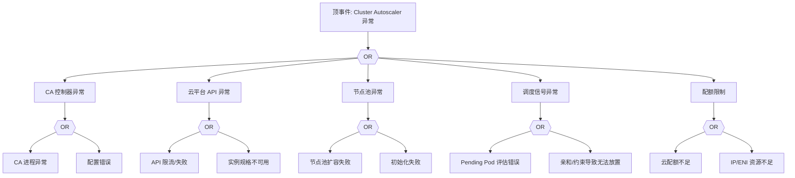

# Cluster Autoscaler 异常 FTA 树

## 适用范围与说明
- **目标**：覆盖自动扩缩容失效、扩容延迟与误缩容的关键成因与路径。
- **范围**：CA 控制器、云平台 API、节点池/伸缩组、调度与配额。
- **符号**：
  - **OR 门**：任一子事件成立即可触发父事件
  - **AND 门**：所有子事件同时成立才触发父事件

---

## Mermaid FTA 树



---

## 生产级观测与证据
- **事件**：扩容失败、Pending Pod 长时间不消退。
- **关键指标**：扩容耗时、扩容失败率、节点期望与实际差异。
- **关键日志**：`cluster-autoscaler`、云平台伸缩日志。
- **配置核对**：CA 配置、节点池上限、云配额、伸缩策略。

---

## JSON 工作流（含与/或门控件）

```json
{
  "flow_steps": [
    { "name": "开始", "action": "start", "step": "start_ca_fta", "next_step": "event_ca_abnormal" },
    { "name": "顶事件: Cluster Autoscaler 异常", "action": "event", "step": "event_ca_abnormal", "description": "扩缩容停滞/误缩容", "next_step": "gate_root_or" },
    { "name": "根因 OR 门", "action": "gate_or", "step": "gate_root_or", "control": "or_gate", "gate_type": "OR", "next_steps": ["cat_ca","cat_cloud","cat_nodepool","cat_sched","cat_quota"] }
  ]
}
```

---

## 版本适配（1.19–1.30）
- **1.19–1.23**：CA 版本与节点池 API 需对齐，云 API 限流需明确。
- **1.24–1.27**：运行时切换后扩容初始化脚本需更新。
- **1.28–1.30**：稳定 API 为主，审计与回滚路径需一致。
- **共性**：遵循 `fta_methodology_and_agentic_practices.md` 中的“版本适配基线”。
