<!-- condition: kubectl get pods -A --field-selector=status.phase=Pending -o jsonpath='{range .items[?(@.spec.nodeName==null)]} {.metadata.namespace}/{.metadata.name}{\"\n\"}{end}' 显示有未调度的 Pending Pod -->

# Cluster Autoscaler 异常 FTA 树

## 适用范围与说明
- **目标**：覆盖自动扩缩容失效、扩容延迟与误缩容的关键成因与路径。
- **范围**：CA 控制器、云平台 API、节点池/伸缩组、调度与配额。
- **符号**：
  - **OR 门**：任一子事件成立即可触发父事件
  - **AND 门**：所有子事件同时成立才触发父事件

---

## Mermaid FTA 树

```mermaid
flowchart TD
  TE[顶事件: Cluster Autoscaler 异常]
  OR0{{OR}}
  TE --> OR0

  OR0 --> CA[CA 控制器异常]
  OR0 --> CLOUD[云平台 API 异常]
  OR0 --> NODEPOOL[节点池异常]
  OR0 --> SCHED[调度信号异常]
  OR0 --> QUO[配额与资源限制]
  OR0 --> AUDIT[审计与回滚缺失]

  %% ========== 1. CA 控制器异常 ==========
  CA_OR{{OR}}
  CA --> CA_OR
  CA_OR --> CA_PROC[CA 进程异常]
  CA_OR --> CA_CONF[配置错误]
  CA_OR --> CA_LOGIC[扩缩逻辑异常]

  %% 1.1 CA 进程异常
  CA_PROC_OR{{OR}}
  CA_PROC --> CA_PROC_OR
  CA_PROC_OR --> CA_PROC1[CA Pod 未运行]
  CA_PROC_OR --> CA_PROC2[CA OOM/资源不足]
  CA_PROC_OR --> CA_PROC3[CA Leader 选举失败]

  %% 1.2 配置错误
  CA_CONF_OR{{OR}}
  CA_CONF --> CA_CONF_OR
  CA_CONF_OR --> CA_CONF1[节点组配置错误]
  CA_CONF_OR --> CA_CONF2[扩缩范围配置错误]
  CA_CONF_OR --> CA_CONF3[云凭证配置错误]

  %% 1.3 扩缩逻辑异常
  CA_LOGIC_OR{{OR}}
  CA_LOGIC --> CA_LOGIC_OR
  CA_LOGIC_OR --> CA_LOGIC1[expander 策略不当]
  CA_LOGIC_OR --> CA_LOGIC2[scale-down 参数过激]
  CA_LOGIC_OR --> CA_LOGIC3[优先级配置冲突]

  %% ========== 2. 云平台 API 异常 ==========
  CLOUD_OR{{OR}}
  CLOUD --> CLOUD_OR
  CLOUD_OR --> CLOUD_API[API 调用异常]
  CLOUD_OR --> CLOUD_INST[实例异常]
  CLOUD_OR --> CLOUD_AUTH[认证授权异常]

  %% 2.1 API 调用异常
  CLOUD_API_OR{{OR}}
  CLOUD_API --> CLOUD_API_OR
  CLOUD_API_OR --> CLOUD_API1[API 限流]
  CLOUD_API_OR --> CLOUD_API2[API 超时]
  CLOUD_API_OR --> CLOUD_API3[API 返回错误]

  %% 2.2 实例异常
  CLOUD_INST_OR{{OR}}
  CLOUD_INST --> CLOUD_INST_OR
  CLOUD_INST_OR --> CLOUD_INST1[实例规格不可用]
  CLOUD_INST_OR --> CLOUD_INST2[可用区库存不足]
  CLOUD_INST_OR --> CLOUD_INST3[竞价实例被回收]

  %% AND 门：规格不可用 + 无备选规格
  AND_INST{{"AND: 规格不可用 + 无备选"}}
  CLOUD_INST1 --> AND_INST
  AND_INST --> AND_INST1[主规格库存不足]
  AND_INST --> AND_INST2[未配置备选规格]

  %% 2.3 认证授权异常
  CLOUD_AUTH_OR{{OR}}
  CLOUD_AUTH --> CLOUD_AUTH_OR
  CLOUD_AUTH_OR --> CLOUD_AUTH1[AccessKey 过期/错误]
  CLOUD_AUTH_OR --> CLOUD_AUTH2[RAM/IAM 权限不足]
  CLOUD_AUTH_OR --> CLOUD_AUTH3[ServiceAccount Token 异常]

  %% ========== 3. 节点池异常 ==========
  NODEPOOL_OR{{OR}}
  NODEPOOL --> NODEPOOL_OR
  NODEPOOL_OR --> NP_SCALE[扩容失败]
  NODEPOOL_OR --> NP_INIT[初始化失败]
  NODEPOOL_OR --> NP_JOIN[节点加入失败]

  %% 3.1 扩容失败
  NP_SCALE_OR{{OR}}
  NP_SCALE --> NP_SCALE_OR
  NP_SCALE_OR --> NP_SCALE1[节点池已达上限]
  NP_SCALE_OR --> NP_SCALE2[伸缩组异常]
  NP_SCALE_OR --> NP_SCALE3[扩容请求被拒绝]

  %% 3.2 初始化失败
  NP_INIT_OR{{OR}}
  NP_INIT --> NP_INIT_OR
  NP_INIT_OR --> NP_INIT1[bootstrap 脚本失败]
  NP_INIT_OR --> NP_INIT2[kubelet 启动失败]
  NP_INIT_OR --> NP_INIT3[网络配置失败]

  %% 3.3 节点加入失败
  NP_JOIN_OR{{OR}}
  NP_JOIN --> NP_JOIN_OR
  NP_JOIN_OR --> NP_JOIN1[无法连接 API Server]
  NP_JOIN_OR --> NP_JOIN2[CSR 审批超时]
  NP_JOIN_OR --> NP_JOIN3[节点注册超时]

  %% ========== 4. 调度信号异常 ==========
  SCHED_OR{{OR}}
  SCHED --> SCHED_OR
  SCHED_OR --> SCHED_PEND[Pending Pod 评估异常]
  SCHED_OR --> SCHED_AFFIN[亲和约束异常]
  SCHED_OR --> SCHED_RES[资源评估异常]

  %% 4.1 Pending Pod 评估异常
  SCHED_PEND_OR{{OR}}
  SCHED_PEND --> SCHED_PEND_OR
  SCHED_PEND_OR --> SCHED_PEND1[Pod 标记为不可调度]
  SCHED_PEND_OR --> SCHED_PEND2[Pod 优先级过低被忽略]
  SCHED_PEND_OR --> SCHED_PEND3[扩容评估周期过长]

  %% 4.2 亲和约束异常
  SCHED_AFFIN_OR{{OR}}
  SCHED_AFFIN --> SCHED_AFFIN_OR
  SCHED_AFFIN_OR --> SCHED_AFFIN1[nodeSelector 无匹配节点池]
  SCHED_AFFIN_OR --> SCHED_AFFIN2[nodeAffinity 过于严格]
  SCHED_AFFIN_OR --> SCHED_AFFIN3[podAntiAffinity 冲突]

  %% AND 门：亲和约束 + 节点池不满足
  AND_AFFIN{{"AND: 亲和约束 + 无匹配节点池"}}
  SCHED_AFFIN --> AND_AFFIN
  AND_AFFIN --> AND_AFFIN1[Pod 配置了严格亲和约束]
  AND_AFFIN --> AND_AFFIN2[无节点池满足亲和条件]

  %% 4.3 资源评估异常
  SCHED_RES_OR{{OR}}
  SCHED_RES --> SCHED_RES_OR
  SCHED_RES_OR --> SCHED_RES1[资源请求过大无法满足]
  SCHED_RES_OR --> SCHED_RES2[GPU 等特殊资源不足]

  %% ========== 5. 配额与资源限制 ==========
  QUO_OR{{OR}}
  QUO --> QUO_OR
  QUO_OR --> QUO_CLOUD[云配额限制]
  QUO_OR --> QUO_NET[网络资源限制]
  QUO_OR --> QUO_K8S[K8s 资源限制]

  %% 5.1 云配额限制
  QUO_CLOUD_OR{{OR}}
  QUO_CLOUD --> QUO_CLOUD_OR
  QUO_CLOUD_OR --> QUO_CLOUD1[vCPU 配额不足]
  QUO_CLOUD_OR --> QUO_CLOUD2[实例数量配额不足]
  QUO_CLOUD_OR --> QUO_CLOUD3[磁盘配额不足]

  %% 5.2 网络资源限制
  QUO_NET_OR{{OR}}
  QUO_NET --> QUO_NET_OR
  QUO_NET_OR --> QUO_NET1[VPC IP 地址耗尽]
  QUO_NET_OR --> QUO_NET2[ENI 配额不足]
  QUO_NET_OR --> QUO_NET3[子网 IP 不足]

  %% 5.3 K8s 资源限制
  QUO_K8S_OR{{OR}}
  QUO_K8S --> QUO_K8S_OR
  QUO_K8S_OR --> QUO_K8S1[集群节点数达上限]
  QUO_K8S_OR --> QUO_K8S2[命名空间配额限制]

  %% ========== 6. 审计与回滚缺失 ==========
  AUDIT_OR{{OR}}
  AUDIT --> AUDIT_OR
  AUDIT_OR --> AUDIT1[扩缩事件未审计]
  AUDIT_OR --> AUDIT2[无扩缩历史追溯]
  AUDIT_OR --> AUDIT3[无手动干预机制]
```



---

## 生产级观测与证据
- **事件**：
  - `ScaleUp` / `ScaleDown` - 扩缩容事件
  - `ScaleUpFailed` - 扩容失败
  - `NotTriggerScaleUp` - 未触发扩容
- **关键指标**：
  - `cluster_autoscaler_scaled_up_nodes_total` - 扩容节点数
  - `cluster_autoscaler_unschedulable_pods_count` - 不可调度 Pod 数
  - `cluster_autoscaler_failed_scale_ups_total` - 扩容失败次数
  - 扩容耗时、扩容成功率
- **关键日志**：
  - `cluster-autoscaler` - 扩缩决策日志
  - 云平台伸缩日志
  - kubelet 启动日志
- **配置核对**：
  - CA 配置参数
  - 节点池 min/max 配置
  - 云配额状态
  - 伸缩策略

---

## JSON 工作流（含与/或门控件）

```json
{
  "flow_steps": [
    { "name": "开始", "action": "start", "step": "start_ca_fta", "next_step": "event_ca_abnormal" },
    { "name": "顶事件: Cluster Autoscaler 异常", "action": "event", "step": "event_ca_abnormal", "description": "扩缩容失败/延迟/误缩容", "next_step": "gate_root_or" },
    { "name": "根因 OR 门", "action": "gate_or", "step": "gate_root_or", "control": "or_gate", "gate_type": "OR", "next_steps": ["cat_ca", "cat_cloud", "cat_nodepool", "cat_sched", "cat_quota", "cat_audit"] },

    { "name": "类别: CA 控制器异常", "action": "category", "step": "cat_ca", "next_step": "gate_ca_or" },
    { "name": "CA 控制器 OR 门", "action": "gate_or", "step": "gate_ca_or", "control": "or_gate", "gate_type": "OR", "next_steps": ["subcat_ca_proc", "subcat_ca_conf", "subcat_ca_logic"] },

    { "name": "子类: CA 进程异常", "action": "subcategory", "step": "subcat_ca_proc", "next_step": "gate_ca_proc_or" },
    { "name": "CA 进程 OR 门", "action": "gate_or", "step": "gate_ca_proc_or", "control": "or_gate", "gate_type": "OR", "next_steps": ["event_ca_proc_pod", "event_ca_proc_oom", "event_ca_proc_leader"] },
    {
      "name": "底事件: CA Pod 未运行",
      "action": "bottom_event",
      "step": "event_ca_proc_pod",
      "description": "Cluster Autoscaler Pod 未正常运行",
      "metadata": {
        "severity": "critical",
        "probability": "low",
        "mttr_minutes": 20,
        "detection": {
          "events": ["PodNotReady"],
          "metrics": ["up{job='cluster-autoscaler'}"],
          "logs": ["cluster-autoscaler pod not running"]
        },
        "remediation": {
          "manual_steps": [
            "检查 CA Pod 状态: kubectl get pods -n kube-system -l app=cluster-autoscaler",
            "查看 Pod 日志和事件",
            "重新部署 CA"
          ],
          "auto_actions": ["配置 CA 可用性告警"]
        }
      },
      "next_step": "gate_root_or"
    },
    {
      "name": "底事件: CA OOM/资源不足",
      "action": "bottom_event",
      "step": "event_ca_proc_oom",
      "description": "CA 内存不足或资源限制导致异常",
      "metadata": {
        "severity": "high",
        "probability": "medium",
        "mttr_minutes": 20,
        "detection": {
          "events": ["OOMKilled"],
          "metrics": ["container_memory_usage_bytes{container='cluster-autoscaler'}"],
          "logs": ["OOMKilled"]
        },
        "remediation": {
          "manual_steps": [
            "增加 CA 内存限制",
            "检查集群规模是否过大",
            "优化 CA 配置减少内存使用"
          ],
          "auto_actions": []
        }
      },
      "next_step": "gate_root_or"
    },
    {
      "name": "底事件: CA Leader 选举失败",
      "action": "bottom_event",
      "step": "event_ca_proc_leader",
      "description": "多副本 CA 的 Leader 选举异常",
      "metadata": {
        "severity": "high",
        "probability": "rare",
        "mttr_minutes": 20,
        "detection": {
          "events": [],
          "metrics": [],
          "logs": ["failed to acquire lease", "leader election lost"]
        },
        "remediation": {
          "manual_steps": [
            "检查 CA 日志中的 leader election 信息",
            "验证 Lease 对象状态",
            "重启 CA Pod"
          ],
          "auto_actions": []
        }
      },
      "next_step": "gate_root_or"
    },

    { "name": "子类: 配置错误", "action": "subcategory", "step": "subcat_ca_conf", "next_step": "gate_ca_conf_or" },
    { "name": "配置错误 OR 门", "action": "gate_or", "step": "gate_ca_conf_or", "control": "or_gate", "gate_type": "OR", "next_steps": ["event_ca_conf_ng", "event_ca_conf_range", "event_ca_conf_cred"] },
    {
      "name": "底事件: 节点组配置错误",
      "action": "bottom_event",
      "step": "event_ca_conf_ng",
      "description": "CA 节点组 (node group) 配置不正确",
      "metadata": {
        "severity": "high",
        "probability": "medium",
        "mttr_minutes": 30,
        "detection": {
          "events": [],
          "metrics": [],
          "logs": ["failed to create node group", "node group not found"]
        },
        "remediation": {
          "manual_steps": [
            "检查 CA 启动参数中的 --nodes 配置",
            "验证节点组 ID 与云平台匹配",
            "检查 autodiscovery 配置"
          ],
          "auto_actions": []
        }
      },
      "next_step": "gate_root_or"
    },
    {
      "name": "底事件: 扩缩范围配置错误",
      "action": "bottom_event",
      "step": "event_ca_conf_range",
      "description": "min/max 节点数配置不合理",
      "metadata": {
        "severity": "medium",
        "probability": "common",
        "mttr_minutes": 15,
        "detection": {
          "events": [],
          "metrics": [],
          "logs": ["max node count reached"]
        },
        "remediation": {
          "manual_steps": [
            "检查 --nodes=MIN:MAX:NAME 配置",
            "调整节点池 max 值",
            "确保 min <= current <= max"
          ],
          "auto_actions": []
        }
      },
      "next_step": "gate_root_or"
    },
    {
      "name": "底事件: 云凭证配置错误",
      "action": "bottom_event",
      "step": "event_ca_conf_cred",
      "description": "CA 云平台凭证配置错误",
      "metadata": {
        "severity": "critical",
        "probability": "low",
        "mttr_minutes": 30,
        "detection": {
          "events": [],
          "metrics": [],
          "logs": ["authentication failed", "access denied"]
        },
        "remediation": {
          "manual_steps": [
            "检查 CA 使用的 ServiceAccount",
            "验证 IRSA/WorkloadIdentity 配置",
            "检查 Secret 中的 AccessKey"
          ],
          "auto_actions": []
        }
      },
      "next_step": "gate_root_or"
    },

    { "name": "子类: 扩缩逻辑异常", "action": "subcategory", "step": "subcat_ca_logic", "next_step": "gate_ca_logic_or" },
    { "name": "扩缩逻辑 OR 门", "action": "gate_or", "step": "gate_ca_logic_or", "control": "or_gate", "gate_type": "OR", "next_steps": ["event_ca_logic_expander", "event_ca_logic_scaledown", "event_ca_logic_priority"] },
    {
      "name": "底事件: expander 策略不当",
      "action": "bottom_event",
      "step": "event_ca_logic_expander",
      "description": "expander 策略选择了不合适的节点组",
      "metadata": {
        "severity": "medium",
        "probability": "medium",
        "mttr_minutes": 30,
        "detection": {
          "events": [],
          "metrics": [],
          "logs": ["expanding node group"]
        },
        "remediation": {
          "manual_steps": [
            "检查 --expander 配置 (random/most-pods/least-waste/price/priority)",
            "根据业务需求调整策略",
            "考虑使用 priority expander"
          ],
          "auto_actions": []
        }
      },
      "next_step": "gate_root_or"
    },
    {
      "name": "底事件: scale-down 参数过激",
      "action": "bottom_event",
      "step": "event_ca_logic_scaledown",
      "description": "缩容参数导致过早或误缩容",
      "metadata": {
        "severity": "high",
        "probability": "medium",
        "mttr_minutes": 30,
        "detection": {
          "events": ["ScaleDown"],
          "metrics": ["cluster_autoscaler_scaled_down_nodes_total"],
          "logs": ["scale down node"]
        },
        "remediation": {
          "manual_steps": [
            "调整 --scale-down-delay-after-add (默认 10m)",
            "增加 --scale-down-unneeded-time",
            "设置 --scale-down-utilization-threshold"
          ],
          "auto_actions": []
        }
      },
      "next_step": "gate_root_or"
    },
    {
      "name": "底事件: 优先级配置冲突",
      "action": "bottom_event",
      "step": "event_ca_logic_priority",
      "description": "priority expander 配置导致扩容选择错误",
      "metadata": {
        "severity": "medium",
        "probability": "low",
        "mttr_minutes": 30,
        "detection": {
          "events": [],
          "metrics": [],
          "logs": []
        },
        "remediation": {
          "manual_steps": [
            "检查 priority-expander-config ConfigMap",
            "验证节点组优先级配置",
            "确保优先级数值正确"
          ],
          "auto_actions": []
        }
      },
      "next_step": "gate_root_or"
    },

    { "name": "类别: 云平台 API 异常", "action": "category", "step": "cat_cloud", "next_step": "gate_cloud_or" },
    { "name": "云平台 API OR 门", "action": "gate_or", "step": "gate_cloud_or", "control": "or_gate", "gate_type": "OR", "next_steps": ["subcat_cloud_api", "subcat_cloud_inst", "subcat_cloud_auth"] },

    { "name": "子类: API 调用异常", "action": "subcategory", "step": "subcat_cloud_api", "next_step": "gate_cloud_api_or" },
    { "name": "API 调用 OR 门", "action": "gate_or", "step": "gate_cloud_api_or", "control": "or_gate", "gate_type": "OR", "next_steps": ["event_cloud_api_limit", "event_cloud_api_timeout", "event_cloud_api_error"] },
    {
      "name": "底事件: API 限流",
      "action": "bottom_event",
      "step": "event_cloud_api_limit",
      "description": "云平台 API 调用被限流",
      "metadata": {
        "severity": "high",
        "probability": "medium",
        "mttr_minutes": 30,
        "detection": {
          "events": [],
          "metrics": [],
          "logs": ["throttling", "rate limit exceeded"]
        },
        "remediation": {
          "manual_steps": [
            "检查云平台 API 调用频率",
            "申请提高 API 限流配额",
            "优化 CA 扫描间隔"
          ],
          "auto_actions": []
        }
      },
      "next_step": "gate_root_or"
    },
    {
      "name": "底事件: API 超时",
      "action": "bottom_event",
      "step": "event_cloud_api_timeout",
      "description": "云平台 API 调用超时",
      "metadata": {
        "severity": "high",
        "probability": "low",
        "mttr_minutes": 30,
        "detection": {
          "events": [],
          "metrics": [],
          "logs": ["context deadline exceeded", "timeout"]
        },
        "remediation": {
          "manual_steps": [
            "检查网络连通性",
            "验证云平台服务状态",
            "重试或等待恢复"
          ],
          "auto_actions": []
        }
      },
      "next_step": "gate_root_or"
    },
    {
      "name": "底事件: API 返回错误",
      "action": "bottom_event",
      "step": "event_cloud_api_error",
      "description": "云平台 API 返回业务错误",
      "metadata": {
        "severity": "high",
        "probability": "medium",
        "mttr_minutes": 30,
        "detection": {
          "events": [],
          "metrics": [],
          "logs": ["error response from cloud provider"]
        },
        "remediation": {
          "manual_steps": [
            "检查 CA 日志中的具体错误",
            "登录云平台控制台排查",
            "联系云厂商支持"
          ],
          "auto_actions": []
        }
      },
      "next_step": "gate_root_or"
    },

    { "name": "子类: 实例异常", "action": "subcategory", "step": "subcat_cloud_inst", "next_step": "gate_cloud_inst_or" },
    { "name": "实例异常 OR 门", "action": "gate_or", "step": "gate_cloud_inst_or", "control": "or_gate", "gate_type": "OR", "next_steps": ["event_cloud_inst_spec", "event_cloud_inst_az", "event_cloud_inst_spot", "gate_and_inst"] },
    {
      "name": "底事件: 实例规格不可用",
      "action": "bottom_event",
      "step": "event_cloud_inst_spec",
      "description": "指定的实例规格在当前区域不可用",
      "metadata": {
        "severity": "high",
        "probability": "medium",
        "mttr_minutes": 30,
        "detection": {
          "events": ["ScaleUpFailed"],
          "metrics": ["cluster_autoscaler_failed_scale_ups_total"],
          "logs": ["instance type not available"]
        },
        "remediation": {
          "manual_steps": [
            "检查实例规格可用性",
            "配置备选实例规格",
            "使用多可用区配置"
          ],
          "auto_actions": []
        }
      },
      "next_step": "gate_root_or"
    },
    {
      "name": "底事件: 可用区库存不足",
      "action": "bottom_event",
      "step": "event_cloud_inst_az",
      "description": "指定可用区的实例库存不足",
      "metadata": {
        "severity": "high",
        "probability": "medium",
        "mttr_minutes": 30,
        "detection": {
          "events": ["ScaleUpFailed"],
          "metrics": [],
          "logs": ["insufficient capacity"]
        },
        "remediation": {
          "manual_steps": [
            "使用多可用区节点池",
            "尝试其他实例规格",
            "等待库存恢复"
          ],
          "auto_actions": []
        }
      },
      "next_step": "gate_root_or"
    },
    {
      "name": "底事件: 竞价实例被回收",
      "action": "bottom_event",
      "step": "event_cloud_inst_spot",
      "description": "竞价实例/抢占式实例被云平台回收",
      "metadata": {
        "severity": "medium",
        "probability": "common",
        "mttr_minutes": 15,
        "detection": {
          "events": ["NodeNotReady"],
          "metrics": [],
          "logs": ["spot instance interrupted", "preemption"]
        },
        "remediation": {
          "manual_steps": [
            "配置混合节点池 (按需 + 竞价)",
            "使用多种竞价实例规格",
            "配置 PodDisruptionBudget 保护关键应用"
          ],
          "auto_actions": []
        }
      },
      "next_step": "gate_root_or"
    },
    {
      "name": "AND 门: 规格不可用 + 无备选",
      "action": "gate_and",
      "step": "gate_and_inst",
      "control": "and_gate",
      "gate_type": "AND",
      "description": "主规格不可用且未配置备选规格",
      "conditions": ["主规格库存不足", "未配置备选规格"],
      "combined_severity": "critical",
      "next_steps": ["event_and_inst_primary", "event_and_inst_backup"],
      "next_step": "gate_root_or"
    },
    {
      "name": "AND 条件1: 主规格不可用",
      "action": "and_condition",
      "step": "event_and_inst_primary",
      "description": "节点池主实例规格库存不足或不可用",
      "parent_gate": "gate_and_inst"
    },
    {
      "name": "AND 条件2: 无备选规格",
      "action": "and_condition",
      "step": "event_and_inst_backup",
      "description": "节点池未配置备选实例规格",
      "parent_gate": "gate_and_inst"
    },

    { "name": "子类: 认证授权异常", "action": "subcategory", "step": "subcat_cloud_auth", "next_step": "gate_cloud_auth_or" },
    { "name": "认证授权 OR 门", "action": "gate_or", "step": "gate_cloud_auth_or", "control": "or_gate", "gate_type": "OR", "next_steps": ["event_cloud_auth_key", "event_cloud_auth_iam", "event_cloud_auth_sa"] },
    {
      "name": "底事件: AccessKey 过期/错误",
      "action": "bottom_event",
      "step": "event_cloud_auth_key",
      "description": "云平台 AccessKey 过期或配置错误",
      "metadata": {
        "severity": "critical",
        "probability": "low",
        "mttr_minutes": 30,
        "detection": {
          "events": [],
          "metrics": [],
          "logs": ["invalid credentials", "access key not found"]
        },
        "remediation": {
          "manual_steps": [
            "更新 AccessKey Secret",
            "使用 IRSA/WorkloadIdentity 替代静态凭证",
            "重启 CA Pod"
          ],
          "auto_actions": []
        }
      },
      "next_step": "gate_root_or"
    },
    {
      "name": "底事件: RAM/IAM 权限不足",
      "action": "bottom_event",
      "step": "event_cloud_auth_iam",
      "description": "CA 使用的角色缺少必要权限",
      "metadata": {
        "severity": "critical",
        "probability": "low",
        "mttr_minutes": 30,
        "detection": {
          "events": [],
          "metrics": [],
          "logs": ["access denied", "not authorized"]
        },
        "remediation": {
          "manual_steps": [
            "检查 IAM 角色策略",
            "添加 EC2/ECS 自动扩缩权限",
            "验证 AssumeRole 权限"
          ],
          "auto_actions": []
        }
      },
      "next_step": "gate_root_or"
    },
    {
      "name": "底事件: ServiceAccount Token 异常",
      "action": "bottom_event",
      "step": "event_cloud_auth_sa",
      "description": "IRSA/WorkloadIdentity Token 获取失败",
      "metadata": {
        "severity": "high",
        "probability": "low",
        "mttr_minutes": 30,
        "detection": {
          "events": [],
          "metrics": [],
          "logs": ["failed to get token", "unable to assume role"]
        },
        "remediation": {
          "manual_steps": [
            "检查 ServiceAccount 注解",
            "验证 OIDC Provider 配置",
            "检查 Trust Relationship"
          ],
          "auto_actions": []
        }
      },
      "next_step": "gate_root_or"
    },

    { "name": "类别: 节点池异常", "action": "category", "step": "cat_nodepool", "next_step": "gate_nodepool_or" },
    { "name": "节点池 OR 门", "action": "gate_or", "step": "gate_nodepool_or", "control": "or_gate", "gate_type": "OR", "next_steps": ["subcat_np_scale", "subcat_np_init", "subcat_np_join"] },

    { "name": "子类: 扩容失败", "action": "subcategory", "step": "subcat_np_scale", "next_step": "gate_np_scale_or" },
    { "name": "扩容失败 OR 门", "action": "gate_or", "step": "gate_np_scale_or", "control": "or_gate", "gate_type": "OR", "next_steps": ["event_np_scale_max", "event_np_scale_asg", "event_np_scale_reject"] },
    {
      "name": "底事件: 节点池已达上限",
      "action": "bottom_event",
      "step": "event_np_scale_max",
      "description": "节点池已达到配置的最大节点数",
      "metadata": {
        "severity": "high",
        "probability": "common",
        "mttr_minutes": 15,
        "detection": {
          "events": ["NotTriggerScaleUp"],
          "metrics": [],
          "logs": ["max node count reached"]
        },
        "remediation": {
          "manual_steps": [
            "增加节点池 max 配置",
            "添加新节点池分担负载",
            "优化应用资源使用"
          ],
          "auto_actions": []
        }
      },
      "next_step": "gate_root_or"
    },
    {
      "name": "底事件: 伸缩组异常",
      "action": "bottom_event",
      "step": "event_np_scale_asg",
      "description": "云平台伸缩组/节点池状态异常",
      "metadata": {
        "severity": "high",
        "probability": "low",
        "mttr_minutes": 30,
        "detection": {
          "events": ["ScaleUpFailed"],
          "metrics": [],
          "logs": ["scaling activity failed"]
        },
        "remediation": {
          "manual_steps": [
            "检查云平台伸缩组状态",
            "查看伸缩活动历史",
            "修复伸缩组配置"
          ],
          "auto_actions": []
        }
      },
      "next_step": "gate_root_or"
    },
    {
      "name": "底事件: 扩容请求被拒绝",
      "action": "bottom_event",
      "step": "event_np_scale_reject",
      "description": "扩容请求被云平台拒绝",
      "metadata": {
        "severity": "high",
        "probability": "medium",
        "mttr_minutes": 30,
        "detection": {
          "events": ["ScaleUpFailed"],
          "metrics": [],
          "logs": ["scale up rejected"]
        },
        "remediation": {
          "manual_steps": [
            "检查拒绝原因 (配额/权限/配置)",
            "根据错误信息修复问题",
            "重试扩容"
          ],
          "auto_actions": []
        }
      },
      "next_step": "gate_root_or"
    },

    { "name": "子类: 初始化失败", "action": "subcategory", "step": "subcat_np_init", "next_step": "gate_np_init_or" },
    { "name": "初始化失败 OR 门", "action": "gate_or", "step": "gate_np_init_or", "control": "or_gate", "gate_type": "OR", "next_steps": ["event_np_init_boot", "event_np_init_kubelet", "event_np_init_net"] },
    {
      "name": "底事件: bootstrap 脚本失败",
      "action": "bottom_event",
      "step": "event_np_init_boot",
      "description": "节点初始化脚本执行失败",
      "metadata": {
        "severity": "high",
        "probability": "medium",
        "mttr_minutes": 45,
        "detection": {
          "events": [],
          "metrics": [],
          "logs": ["bootstrap failed", "user-data script error"]
        },
        "remediation": {
          "manual_steps": [
            "SSH 到节点查看 cloud-init 日志",
            "检查 bootstrap 脚本语法",
            "验证脚本依赖的资源可访问"
          ],
          "auto_actions": []
        }
      },
      "next_step": "gate_root_or"
    },
    {
      "name": "底事件: kubelet 启动失败",
      "action": "bottom_event",
      "step": "event_np_init_kubelet",
      "description": "节点上 kubelet 启动失败",
      "metadata": {
        "severity": "high",
        "probability": "medium",
        "mttr_minutes": 30,
        "detection": {
          "events": [],
          "metrics": [],
          "logs": ["kubelet failed to start"]
        },
        "remediation": {
          "manual_steps": [
            "SSH 到节点检查 kubelet 状态",
            "查看 kubelet 日志: journalctl -u kubelet",
            "验证 kubelet 配置"
          ],
          "auto_actions": []
        }
      },
      "next_step": "gate_root_or"
    },
    {
      "name": "底事件: 网络配置失败",
      "action": "bottom_event",
      "step": "event_np_init_net",
      "description": "节点网络 (CNI) 配置失败",
      "metadata": {
        "severity": "high",
        "probability": "medium",
        "mttr_minutes": 30,
        "detection": {
          "events": [],
          "metrics": [],
          "logs": ["CNI configuration failed", "network plugin error"]
        },
        "remediation": {
          "manual_steps": [
            "检查 CNI 插件安装状态",
            "验证 VPC/子网配置",
            "检查安全组规则"
          ],
          "auto_actions": []
        }
      },
      "next_step": "gate_root_or"
    },

    { "name": "子类: 节点加入失败", "action": "subcategory", "step": "subcat_np_join", "next_step": "gate_np_join_or" },
    { "name": "节点加入 OR 门", "action": "gate_or", "step": "gate_np_join_or", "control": "or_gate", "gate_type": "OR", "next_steps": ["event_np_join_api", "event_np_join_csr", "event_np_join_timeout"] },
    {
      "name": "底事件: 无法连接 API Server",
      "action": "bottom_event",
      "step": "event_np_join_api",
      "description": "新节点无法连接到 Kubernetes API Server",
      "metadata": {
        "severity": "high",
        "probability": "medium",
        "mttr_minutes": 30,
        "detection": {
          "events": [],
          "metrics": [],
          "logs": ["Unable to connect to the server"]
        },
        "remediation": {
          "manual_steps": [
            "检查节点到 API Server 的网络连通性",
            "验证安全组规则允许 6443 端口",
            "检查 API Server endpoint 配置"
          ],
          "auto_actions": []
        }
      },
      "next_step": "gate_root_or"
    },
    {
      "name": "底事件: CSR 审批超时",
      "action": "bottom_event",
      "step": "event_np_join_csr",
      "description": "节点 CSR 证书请求审批超时",
      "metadata": {
        "severity": "high",
        "probability": "low",
        "mttr_minutes": 20,
        "detection": {
          "events": ["CertificateSigningRequestPending"],
          "metrics": [],
          "logs": ["certificate request pending"]
        },
        "remediation": {
          "manual_steps": [
            "检查待审批 CSR: kubectl get csr",
            "手动审批: kubectl certificate approve <csr>",
            "检查 CSR 自动审批控制器"
          ],
          "auto_actions": []
        }
      },
      "next_step": "gate_root_or"
    },
    {
      "name": "底事件: 节点注册超时",
      "action": "bottom_event",
      "step": "event_np_join_timeout",
      "description": "节点注册到集群超时",
      "metadata": {
        "severity": "high",
        "probability": "medium",
        "mttr_minutes": 30,
        "detection": {
          "events": [],
          "metrics": [],
          "logs": ["node registration timed out"]
        },
        "remediation": {
          "manual_steps": [
            "检查 CA 的 --max-node-provision-time 配置",
            "增加超时时间或优化节点启动",
            "检查节点初始化各阶段耗时"
          ],
          "auto_actions": []
        }
      },
      "next_step": "gate_root_or"
    },

    { "name": "类别: 调度信号异常", "action": "category", "step": "cat_sched", "next_step": "gate_sched_or" },
    { "name": "调度信号 OR 门", "action": "gate_or", "step": "gate_sched_or", "control": "or_gate", "gate_type": "OR", "next_steps": ["subcat_sched_pend", "subcat_sched_affin", "subcat_sched_res"] },

    { "name": "子类: Pending Pod 评估异常", "action": "subcategory", "step": "subcat_sched_pend", "next_step": "gate_sched_pend_or" },
    { "name": "Pending Pod OR 门", "action": "gate_or", "step": "gate_sched_pend_or", "control": "or_gate", "gate_type": "OR", "next_steps": ["event_sched_pend_unsched", "event_sched_pend_priority", "event_sched_pend_cycle"] },
    {
      "name": "底事件: Pod 标记为不可调度",
      "action": "bottom_event",
      "step": "event_sched_pend_unsched",
      "description": "Pod 被标记为不可调度导致 CA 忽略",
      "metadata": {
        "severity": "medium",
        "probability": "low",
        "mttr_minutes": 20,
        "detection": {
          "events": [],
          "metrics": [],
          "logs": ["pod marked unschedulable"]
        },
        "remediation": {
          "manual_steps": [
            "检查 Pod 状态和注解",
            "移除 unschedulable 注解",
            "检查是否有 Webhook 添加了注解"
          ],
          "auto_actions": []
        }
      },
      "next_step": "gate_root_or"
    },
    {
      "name": "底事件: Pod 优先级过低被忽略",
      "action": "bottom_event",
      "step": "event_sched_pend_priority",
      "description": "Pod 优先级低于 CA 的 expendable threshold",
      "metadata": {
        "severity": "medium",
        "probability": "low",
        "mttr_minutes": 15,
        "detection": {
          "events": [],
          "metrics": [],
          "logs": ["pod with low priority ignored"]
        },
        "remediation": {
          "manual_steps": [
            "检查 Pod 的 PriorityClass",
            "调整 CA 的 --expendable-pods-priority-cutoff",
            "或提高 Pod 优先级"
          ],
          "auto_actions": []
        }
      },
      "next_step": "gate_root_or"
    },
    {
      "name": "底事件: 扩容评估周期过长",
      "action": "bottom_event",
      "step": "event_sched_pend_cycle",
      "description": "CA 扫描周期过长导致响应慢",
      "metadata": {
        "severity": "medium",
        "probability": "medium",
        "mttr_minutes": 15,
        "detection": {
          "events": [],
          "metrics": ["cluster_autoscaler_last_activity"],
          "logs": []
        },
        "remediation": {
          "manual_steps": [
            "调整 --scan-interval (默认 10s)",
            "检查 CA 资源使用",
            "优化节点组数量"
          ],
          "auto_actions": []
        }
      },
      "next_step": "gate_root_or"
    },

    { "name": "子类: 亲和约束异常", "action": "subcategory", "step": "subcat_sched_affin", "next_step": "gate_sched_affin_or" },
    { "name": "亲和约束 OR 门", "action": "gate_or", "step": "gate_sched_affin_or", "control": "or_gate", "gate_type": "OR", "next_steps": ["event_sched_affin_selector", "event_sched_affin_node", "event_sched_affin_anti", "gate_and_affin"] },
    {
      "name": "底事件: nodeSelector 无匹配节点池",
      "action": "bottom_event",
      "step": "event_sched_affin_selector",
      "description": "Pod nodeSelector 无任何节点池能满足",
      "metadata": {
        "severity": "high",
        "probability": "common",
        "mttr_minutes": 20,
        "detection": {
          "events": ["NotTriggerScaleUp"],
          "metrics": [],
          "logs": ["no node group can satisfy selector"]
        },
        "remediation": {
          "manual_steps": [
            "检查 Pod nodeSelector 配置",
            "确保有节点池配置了对应标签",
            "或创建满足条件的新节点池"
          ],
          "auto_actions": []
        }
      },
      "next_step": "gate_root_or"
    },
    {
      "name": "底事件: nodeAffinity 过于严格",
      "action": "bottom_event",
      "step": "event_sched_affin_node",
      "description": "nodeAffinity 配置过于严格无法满足",
      "metadata": {
        "severity": "medium",
        "probability": "medium",
        "mttr_minutes": 20,
        "detection": {
          "events": ["NotTriggerScaleUp"],
          "metrics": [],
          "logs": ["node affinity not satisfied"]
        },
        "remediation": {
          "manual_steps": [
            "检查 nodeAffinity 配置",
            "使用 preferredDuringScheduling 替代 required",
            "配置节点池标签满足亲和条件"
          ],
          "auto_actions": []
        }
      },
      "next_step": "gate_root_or"
    },
    {
      "name": "底事件: podAntiAffinity 冲突",
      "action": "bottom_event",
      "step": "event_sched_affin_anti",
      "description": "podAntiAffinity 导致无法在现有节点调度",
      "metadata": {
        "severity": "medium",
        "probability": "medium",
        "mttr_minutes": 20,
        "detection": {
          "events": [],
          "metrics": [],
          "logs": ["pod anti-affinity conflict"]
        },
        "remediation": {
          "manual_steps": [
            "检查 podAntiAffinity 配置",
            "确保节点池能提供足够节点",
            "考虑使用 preferredDuringScheduling"
          ],
          "auto_actions": []
        }
      },
      "next_step": "gate_root_or"
    },
    {
      "name": "AND 门: 亲和约束 + 无匹配节点池",
      "action": "gate_and",
      "step": "gate_and_affin",
      "control": "and_gate",
      "gate_type": "AND",
      "description": "Pod 配置了亲和约束但无节点池能满足",
      "conditions": ["Pod 配置了严格亲和约束", "无节点池满足亲和条件"],
      "combined_severity": "high",
      "next_steps": ["event_and_affin_pod", "event_and_affin_np"],
      "next_step": "gate_root_or"
    },
    {
      "name": "AND 条件1: 严格亲和约束",
      "action": "and_condition",
      "step": "event_and_affin_pod",
      "description": "Pod 配置了 requiredDuringSchedulingIgnoredDuringExecution",
      "parent_gate": "gate_and_affin"
    },
    {
      "name": "AND 条件2: 无匹配节点池",
      "action": "and_condition",
      "step": "event_and_affin_np",
      "description": "所有节点池都无法满足亲和条件",
      "parent_gate": "gate_and_affin"
    },

    { "name": "子类: 资源评估异常", "action": "subcategory", "step": "subcat_sched_res", "next_step": "gate_sched_res_or" },
    { "name": "资源评估 OR 门", "action": "gate_or", "step": "gate_sched_res_or", "control": "or_gate", "gate_type": "OR", "next_steps": ["event_sched_res_large", "event_sched_res_gpu"] },
    {
      "name": "底事件: 资源请求过大无法满足",
      "action": "bottom_event",
      "step": "event_sched_res_large",
      "description": "Pod 资源请求超过任何节点规格",
      "metadata": {
        "severity": "high",
        "probability": "low",
        "mttr_minutes": 30,
        "detection": {
          "events": ["NotTriggerScaleUp"],
          "metrics": [],
          "logs": ["pod too large for any node"]
        },
        "remediation": {
          "manual_steps": [
            "减小 Pod 资源请求",
            "配置更大规格的节点池",
            "拆分大 Pod 为多个小 Pod"
          ],
          "auto_actions": []
        }
      },
      "next_step": "gate_root_or"
    },
    {
      "name": "底事件: GPU 等特殊资源不足",
      "action": "bottom_event",
      "step": "event_sched_res_gpu",
      "description": "GPU/专用硬件资源的节点池无法扩容",
      "metadata": {
        "severity": "high",
        "probability": "medium",
        "mttr_minutes": 30,
        "detection": {
          "events": ["NotTriggerScaleUp"],
          "metrics": [],
          "logs": ["GPU node group cannot scale"]
        },
        "remediation": {
          "manual_steps": [
            "检查 GPU 节点池配置",
            "验证 GPU 实例配额",
            "确保 GPU 设备插件正常"
          ],
          "auto_actions": []
        }
      },
      "next_step": "gate_root_or"
    },

    { "name": "类别: 配额与资源限制", "action": "category", "step": "cat_quota", "next_step": "gate_quota_or" },
    { "name": "配额限制 OR 门", "action": "gate_or", "step": "gate_quota_or", "control": "or_gate", "gate_type": "OR", "next_steps": ["subcat_quo_cloud", "subcat_quo_net", "subcat_quo_k8s"] },

    { "name": "子类: 云配额限制", "action": "subcategory", "step": "subcat_quo_cloud", "next_step": "gate_quo_cloud_or" },
    { "name": "云配额 OR 门", "action": "gate_or", "step": "gate_quo_cloud_or", "control": "or_gate", "gate_type": "OR", "next_steps": ["event_quo_cloud_cpu", "event_quo_cloud_inst", "event_quo_cloud_disk"] },
    {
      "name": "底事件: vCPU 配额不足",
      "action": "bottom_event",
      "step": "event_quo_cloud_cpu",
      "description": "云平台 vCPU 配额已耗尽",
      "metadata": {
        "severity": "critical",
        "probability": "medium",
        "mttr_minutes": 60,
        "detection": {
          "events": ["ScaleUpFailed"],
          "metrics": [],
          "logs": ["vCPU limit exceeded", "quota exceeded"]
        },
        "remediation": {
          "manual_steps": [
            "检查云平台 vCPU 配额使用情况",
            "申请提高 vCPU 配额",
            "优化现有资源使用"
          ],
          "auto_actions": []
        }
      },
      "next_step": "gate_root_or"
    },
    {
      "name": "底事件: 实例数量配额不足",
      "action": "bottom_event",
      "step": "event_quo_cloud_inst",
      "description": "云平台实例数量配额已耗尽",
      "metadata": {
        "severity": "critical",
        "probability": "medium",
        "mttr_minutes": 60,
        "detection": {
          "events": ["ScaleUpFailed"],
          "metrics": [],
          "logs": ["instance limit exceeded"]
        },
        "remediation": {
          "manual_steps": [
            "检查实例数量配额",
            "申请提高配额",
            "清理不需要的实例"
          ],
          "auto_actions": []
        }
      },
      "next_step": "gate_root_or"
    },
    {
      "name": "底事件: 磁盘配额不足",
      "action": "bottom_event",
      "step": "event_quo_cloud_disk",
      "description": "云磁盘配额不足无法创建系统盘",
      "metadata": {
        "severity": "high",
        "probability": "low",
        "mttr_minutes": 60,
        "detection": {
          "events": ["ScaleUpFailed"],
          "metrics": [],
          "logs": ["disk quota exceeded"]
        },
        "remediation": {
          "manual_steps": [
            "检查磁盘配额使用",
            "申请提高磁盘配额",
            "清理未使用的磁盘"
          ],
          "auto_actions": []
        }
      },
      "next_step": "gate_root_or"
    },

    { "name": "子类: 网络资源限制", "action": "subcategory", "step": "subcat_quo_net", "next_step": "gate_quo_net_or" },
    { "name": "网络资源 OR 门", "action": "gate_or", "step": "gate_quo_net_or", "control": "or_gate", "gate_type": "OR", "next_steps": ["event_quo_net_ip", "event_quo_net_eni", "event_quo_net_subnet"] },
    {
      "name": "底事件: VPC IP 地址耗尽",
      "action": "bottom_event",
      "step": "event_quo_net_ip",
      "description": "VPC 可用 IP 地址已耗尽",
      "metadata": {
        "severity": "critical",
        "probability": "medium",
        "mttr_minutes": 60,
        "detection": {
          "events": ["ScaleUpFailed"],
          "metrics": [],
          "logs": ["no IP address available"]
        },
        "remediation": {
          "manual_steps": [
            "检查 VPC CIDR 和已分配 IP",
            "扩展 VPC CIDR 或添加辅助 CIDR",
            "清理未使用的弹性 IP"
          ],
          "auto_actions": []
        }
      },
      "next_step": "gate_root_or"
    },
    {
      "name": "底事件: ENI 配额不足",
      "action": "bottom_event",
      "step": "event_quo_net_eni",
      "description": "弹性网卡 (ENI) 配额不足",
      "metadata": {
        "severity": "high",
        "probability": "medium",
        "mttr_minutes": 60,
        "detection": {
          "events": ["ScaleUpFailed"],
          "metrics": [],
          "logs": ["ENI limit exceeded"]
        },
        "remediation": {
          "manual_steps": [
            "检查 ENI 配额使用",
            "申请提高 ENI 配额",
            "清理未使用的 ENI"
          ],
          "auto_actions": []
        }
      },
      "next_step": "gate_root_or"
    },
    {
      "name": "底事件: 子网 IP 不足",
      "action": "bottom_event",
      "step": "event_quo_net_subnet",
      "description": "指定子网可用 IP 不足",
      "metadata": {
        "severity": "high",
        "probability": "medium",
        "mttr_minutes": 45,
        "detection": {
          "events": ["ScaleUpFailed"],
          "metrics": [],
          "logs": ["subnet has no available IP"]
        },
        "remediation": {
          "manual_steps": [
            "检查子网 IP 使用情况",
            "配置多子网节点池",
            "扩展子网 CIDR"
          ],
          "auto_actions": []
        }
      },
      "next_step": "gate_root_or"
    },

    { "name": "子类: K8s 资源限制", "action": "subcategory", "step": "subcat_quo_k8s", "next_step": "gate_quo_k8s_or" },
    { "name": "K8s 资源 OR 门", "action": "gate_or", "step": "gate_quo_k8s_or", "control": "or_gate", "gate_type": "OR", "next_steps": ["event_quo_k8s_node", "event_quo_k8s_ns"] },
    {
      "name": "底事件: 集群节点数达上限",
      "action": "bottom_event",
      "step": "event_quo_k8s_node",
      "description": "集群节点总数已达上限",
      "metadata": {
        "severity": "critical",
        "probability": "low",
        "mttr_minutes": 60,
        "detection": {
          "events": ["NotTriggerScaleUp"],
          "metrics": [],
          "logs": ["cluster node limit reached"]
        },
        "remediation": {
          "manual_steps": [
            "检查集群节点上限配置",
            "联系云厂商提高上限",
            "考虑拆分集群"
          ],
          "auto_actions": []
        }
      },
      "next_step": "gate_root_or"
    },
    {
      "name": "底事件: 命名空间配额限制",
      "action": "bottom_event",
      "step": "event_quo_k8s_ns",
      "description": "命名空间 ResourceQuota 限制 Pod 创建",
      "metadata": {
        "severity": "medium",
        "probability": "medium",
        "mttr_minutes": 15,
        "detection": {
          "events": ["Forbidden"],
          "metrics": [],
          "logs": ["exceeded quota"]
        },
        "remediation": {
          "manual_steps": [
            "检查命名空间 ResourceQuota",
            "增加配额或优化资源使用"
          ],
          "auto_actions": []
        }
      },
      "next_step": "gate_root_or"
    },

    { "name": "类别: 审计与回滚缺失", "action": "category", "step": "cat_audit", "next_step": "gate_audit_or" },
    { "name": "审计回滚 OR 门", "action": "gate_or", "step": "gate_audit_or", "control": "or_gate", "gate_type": "OR", "next_steps": ["event_audit_log", "event_audit_history", "event_audit_manual"] },
    {
      "name": "底事件: 扩缩事件未审计",
      "action": "bottom_event",
      "step": "event_audit_log",
      "description": "CA 扩缩容事件未记录审计日志",
      "metadata": {
        "severity": "medium",
        "probability": "common",
        "mttr_minutes": 30,
        "detection": {
          "events": [],
          "metrics": [],
          "logs": []
        },
        "remediation": {
          "manual_steps": [
            "配置 CA 事件导出到日志系统",
            "使用 Kubernetes 事件采集",
            "建立扩缩容事件告警"
          ],
          "auto_actions": []
        }
      },
      "next_step": "gate_root_or"
    },
    {
      "name": "底事件: 无扩缩历史追溯",
      "action": "bottom_event",
      "step": "event_audit_history",
      "description": "无法追溯历史扩缩容决策",
      "metadata": {
        "severity": "medium",
        "probability": "common",
        "mttr_minutes": 30,
        "detection": {
          "events": [],
          "metrics": [],
          "logs": []
        },
        "remediation": {
          "manual_steps": [
            "启用 CA status ConfigMap",
            "配置扩缩容指标采集",
            "建立历史数据存储"
          ],
          "auto_actions": []
        }
      },
      "next_step": "gate_root_or"
    },
    {
      "name": "底事件: 无手动干预机制",
      "action": "bottom_event",
      "step": "event_audit_manual",
      "description": "CA 异常时缺乏手动干预能力",
      "metadata": {
        "severity": "high",
        "probability": "common",
        "mttr_minutes": 30,
        "detection": {
          "events": [],
          "metrics": [],
          "logs": []
        },
        "remediation": {
          "manual_steps": [
            "建立手动扩缩容流程",
            "配置 CA 禁用开关",
            "准备手动调用云 API 的脚本"
          ],
          "auto_actions": []
        }
      },
      "next_step": "gate_root_or"
    },

    { "name": "结束", "action": "end", "step": "end_ca_fta" }
  ]
}
```

---

## 版本适配（1.19–1.30）
- **1.19–1.23**：
  - CA 版本与节点池 API 需对齐
  - 云 API 限流配置需明确
  - 部分云厂商 CA 功能有限
- **1.24–1.27**：
  - 运行时切换后扩容初始化脚本需更新 (Docker -> containerd)
  - 注意 dockershim 移除对节点初始化的影响
- **1.28–1.30**：
  - 稳定 API 为主，审计与回滚路径需一致
  - 推荐使用 IRSA/WorkloadIdentity 认证
  - 考虑使用 Karpenter 等新一代自动扩缩方案
- **共性**：
  - CA 是集群弹性的关键组件
  - 需要配合云平台配额规划
  - 遵循 `fta-methodology-and-agentic-practices.md` 中的"版本适配基线"
