# 集群升级异常 FTA 树

## 适用范围与说明
- **目标**：覆盖集群升级失败、版本不兼容与回滚失败的关键成因与路径。
- **范围**：控制面升级、节点升级、API 版本兼容、运行时/插件、回滚与审计。
- **符号**：
  - **OR 门**：任一子事件成立即可触发父事件
  - **AND 门**：所有子事件同时成立才触发父事件

---

## Mermaid FTA 树

```mermaid
flowchart TD
  TE[顶事件: 集群升级异常]
  OR0{{OR}}
  TE --> OR0

  OR0 --> CP[控制面升级异常]
  OR0 --> NODE[节点升级异常]
  OR0 --> API[API 版本不兼容]
  OR0 --> PLUG[插件/运行时异常]
  OR0 --> ROLLBACK[回滚异常]
  OR0 --> AUDIT[审计与准备缺失]

  %% ========== 1. 控制面升级异常 ==========
  CP_OR{{OR}}
  CP --> CP_OR
  CP_OR --> CP_VER[版本异常]
  CP_OR --> CP_ETCD[etcd 升级异常]
  CP_OR --> CP_COMP[组件升级异常]
  CP_OR --> CP_CERT[证书异常]

  CP_VER_OR{{OR}}
  CP_VER --> CP_VER_OR
  CP_VER_OR --> CP_VER1[跨版本升级]
  CP_VER_OR --> CP_VER2[组件版本不一致]

  CP_ETCD_OR{{OR}}
  CP_ETCD --> CP_ETCD_OR
  CP_ETCD_OR --> CP_ETCD1[etcd 数据迁移失败]
  CP_ETCD_OR --> CP_ETCD2[etcd 集群不健康]
  CP_ETCD_OR --> CP_ETCD3[etcd Schema 变更不兼容]

  CP_COMP_OR{{OR}}
  CP_COMP --> CP_COMP_OR
  CP_COMP_OR --> CP_COMP1[API Server 升级失败]
  CP_COMP_OR --> CP_COMP2[Controller Manager 升级失败]
  CP_COMP_OR --> CP_COMP3[Scheduler 升级失败]

  CP_CERT_OR{{OR}}
  CP_CERT --> CP_CERT_OR
  CP_CERT_OR --> CP_CERT1[证书过期]
  CP_CERT_OR --> CP_CERT2[CA 不匹配]

  %% ========== 2. 节点升级异常 ==========
  NODE_OR{{OR}}
  NODE --> NODE_OR
  NODE_OR --> NODE_KUBELET[kubelet 升级异常]
  NODE_OR --> NODE_DRAIN[节点 Drain 异常]
  NODE_OR --> NODE_JOIN[节点重新加入异常]

  NODE_KUBELET_OR{{OR}}
  NODE_KUBELET --> NODE_KUBELET_OR
  NODE_KUBELET_OR --> NODE_KUBELET1[kubelet 版本不兼容]
  NODE_KUBELET_OR --> NODE_KUBELET2[kubelet 启动失败]
  NODE_KUBELET_OR --> NODE_KUBELET3[kubelet 配置不兼容]

  NODE_DRAIN_OR{{OR}}
  NODE_DRAIN --> NODE_DRAIN_OR
  NODE_DRAIN_OR --> NODE_DRAIN1[PDB 阻塞 Drain]
  NODE_DRAIN_OR --> NODE_DRAIN2[Pod 终止超时]
  NODE_DRAIN_OR --> NODE_DRAIN3[DaemonSet Pod 阻塞]

  NODE_JOIN_OR{{OR}}
  NODE_JOIN --> NODE_JOIN_OR
  NODE_JOIN_OR --> NODE_JOIN1[节点证书问题]
  NODE_JOIN_OR --> NODE_JOIN2[无法连接 API Server]

  %% AND 门：版本差异过大 + 无中间版本
  AND_VER{{"AND: 版本跨度过大"}}
  NODE_KUBELET --> AND_VER
  AND_VER --> AND_VER1[kubelet 与 API Server 版本差 > 2]
  AND_VER --> AND_VER2[未进行中间版本升级]

  %% ========== 3. API 版本不兼容 ==========
  API_OR{{OR}}
  API --> API_OR
  API_OR --> API_DEP[废弃 API 异常]
  API_OR --> API_CRD[CRD 异常]
  API_OR --> API_WEBHOOK[Webhook 异常]

  API_DEP_OR{{OR}}
  API_DEP --> API_DEP_OR
  API_DEP_OR --> API_DEP1[使用已移除 API]
  API_DEP_OR --> API_DEP2[API 迁移不完整]

  API_CRD_OR{{OR}}
  API_CRD --> API_CRD_OR
  API_CRD_OR --> API_CRD1[CRD 版本不兼容]
  API_CRD_OR --> API_CRD2[CRD 转换失败]

  %% AND 门：使用废弃 API + 未迁移
  AND_API{{"AND: 废弃 API 未迁移"}}
  API_DEP --> AND_API
  AND_API --> AND_API1[应用使用已废弃 API]
  AND_API --> AND_API2[升级前未完成迁移]

  %% ========== 4. 插件/运行时异常 ==========
  PLUG_OR{{OR}}
  PLUG --> PLUG_OR
  PLUG_OR --> PLUG_CNI[CNI 异常]
  PLUG_OR --> PLUG_CSI[CSI 异常]
  PLUG_OR --> PLUG_RT[容器运行时异常]

  PLUG_CNI_OR{{OR}}
  PLUG_CNI --> PLUG_CNI_OR
  PLUG_CNI_OR --> PLUG_CNI1[CNI 版本不兼容]
  PLUG_CNI_OR --> PLUG_CNI2[CNI 配置需更新]

  PLUG_CSI_OR{{OR}}
  PLUG_CSI --> PLUG_CSI_OR
  PLUG_CSI_OR --> PLUG_CSI1[CSI 驱动版本不兼容]
  PLUG_CSI_OR --> PLUG_CSI2[in-tree 到 CSI 迁移失败]

  PLUG_RT_OR{{OR}}
  PLUG_RT --> PLUG_RT_OR
  PLUG_RT_OR --> PLUG_RT1[Docker 到 containerd 迁移]
  PLUG_RT_OR --> PLUG_RT2[运行时配置不兼容]

  %% ========== 5. 回滚异常 ==========
  ROLLBACK_OR{{OR}}
  ROLLBACK --> ROLLBACK_OR
  ROLLBACK_OR --> RB_PLAN[回滚计划异常]
  ROLLBACK_OR --> RB_DATA[数据不可逆]
  ROLLBACK_OR --> RB_EXEC[回滚执行异常]

  RB_PLAN_OR{{OR}}
  RB_PLAN --> RB_PLAN_OR
  RB_PLAN_OR --> RB_PLAN1[无回滚计划]
  RB_PLAN_OR --> RB_PLAN2[回滚步骤不完整]

  RB_DATA_OR{{OR}}
  RB_DATA --> RB_DATA_OR
  RB_DATA_OR --> RB_DATA1[etcd 数据格式变更]
  RB_DATA_OR --> RB_DATA2[API 对象不可降级]

  RB_EXEC_OR{{OR}}
  RB_EXEC --> RB_EXEC_OR
  RB_EXEC_OR --> RB_EXEC1[组件回滚顺序错误]
  RB_EXEC_OR --> RB_EXEC2[混合版本不兼容]

  %% AND 门：etcd 数据变更 + 无备份
  AND_RB{{"AND: 数据不可逆回滚"}}
  RB_DATA --> AND_RB
  AND_RB --> AND_RB1[etcd 数据 Schema 已变更]
  AND_RB --> AND_RB2[升级前未备份 etcd]

  %% ========== 6. 审计与准备缺失 ==========
  AUDIT_OR{{OR}}
  AUDIT --> AUDIT_OR
  AUDIT_OR --> AUDIT_CHECK[升级前检查缺失]
  AUDIT_OR --> AUDIT_BACKUP[备份缺失]
  AUDIT_OR --> AUDIT_LOG[升级日志未记录]
  AUDIT_OR --> AUDIT_TEST[升级验证不充分]

  AUDIT_CHECK_OR{{OR}}
  AUDIT_CHECK --> AUDIT_CHECK_OR
  AUDIT_CHECK_OR --> AUDIT_CHECK1[未验证版本兼容性]
  AUDIT_CHECK_OR --> AUDIT_CHECK2[未扫描废弃 API]
  AUDIT_CHECK_OR --> AUDIT_CHECK3[未检查集群健康]
```



---

## 生产级观测与证据
- **事件**：
  - 控制面组件重启事件
  - 节点 NotReady 事件
  - API 废弃警告 (DeprecatedAPIVersion)
  - NodeDrainFailed / CannotEvictPod
  - FailedCallingWebhook
- **关键指标**：
  - 控制面组件健康状态 (up{job='kubernetes-apiservers'})
  - 节点就绪率 (kube_node_status_condition{condition="Ready"})
  - API 请求失败率 (apiserver_request_total{code=~"5.."})
  - etcd leader 选举次数 (etcd_server_leader_changes_seen_total)
  - 已废弃 API 调用量 (apiserver_requested_deprecated_apis)
- **关键日志**：
  - 控制面组件升级日志 (/var/log/kube-apiserver.log)
  - kubelet 启动日志 (journalctl -u kubelet)
  - 升级工具日志 (kubeadm upgrade / 托管集群 API)
  - etcd 迁移日志
- **配置核对**：
  - 版本兼容矩阵 (kubernetes.io/releases)
  - API 迁移清单 (pluto / kubent 输出)
  - 插件兼容性列表 (CNI/CSI/Runtime)
  - 证书有效期检查 (kubeadm certs check-expiration)

---

## JSON 工作流（含与/或门控件）

```json
{
  "flow_steps": [
    { "name": "开始", "action": "start", "step": "start_upgrade_fta", "next_step": "event_upgrade_abnormal" },
    { "name": "顶事件: 集群升级异常", "action": "event", "step": "event_upgrade_abnormal", "description": "升级失败/版本不兼容/回滚失败", "next_step": "gate_root_or" },
    { "name": "根因 OR 门", "action": "gate_or", "step": "gate_root_or", "control": "or_gate", "gate_type": "OR", "next_steps": ["cat_cp", "cat_node", "cat_api", "cat_plug", "cat_rb", "cat_audit"] },

    { "name": "类别: 控制面升级异常", "action": "category", "step": "cat_cp", "next_step": "gate_cp_or" },
    { "name": "控制面 OR 门", "action": "gate_or", "step": "gate_cp_or", "control": "or_gate", "gate_type": "OR", "next_steps": ["subcat_cp_ver", "subcat_cp_etcd", "subcat_cp_comp", "subcat_cp_cert"] },

    { "name": "子类: 版本异常", "action": "subcategory", "step": "subcat_cp_ver", "next_step": "gate_cp_ver_or" },
    { "name": "版本异常 OR 门", "action": "gate_or", "step": "gate_cp_ver_or", "control": "or_gate", "gate_type": "OR", "next_steps": ["event_cp_ver_skip", "event_cp_ver_mismatch"] },
    {
      "name": "底事件: 跨版本升级",
      "action": "bottom_event",
      "step": "event_cp_ver_skip",
      "description": "跨越多个次要版本升级（如 1.22 直接到 1.25）导致组件不兼容",
      "metadata": {
        "severity": "critical",
        "probability": "medium",
        "mttr_minutes": 120,
        "detection": {
          "events": [],
          "metrics": [],
          "logs": ["version skew too large", "unsupported version"]
        },
        "remediation": {
          "manual_steps": ["K8s 仅支持逐版本升级 (N -> N+1)", "必须先升级到中间版本", "检查升级路径文档"],
          "auto_actions": []
        },
        "version_notes": {
          "1.19-1.23": "每个版本均需逐步升级",
          "1.24-1.27": "支持策略不变,但 API 移除加速",
          "1.28+": "版本偏差策略允许 kubelet N-3"
        }
      },
      "next_step": "gate_root_or"
    },
    {
      "name": "底事件: 组件版本不一致",
      "action": "bottom_event",
      "step": "event_cp_ver_mismatch",
      "description": "控制面组件（apiserver/cm/scheduler）版本不一致导致行为异常",
      "metadata": {
        "severity": "high",
        "probability": "medium",
        "mttr_minutes": 60,
        "detection": {
          "events": ["ComponentStatusUnhealthy"],
          "metrics": ["kubernetes_build_info"],
          "logs": ["version mismatch", "incompatible version"]
        },
        "remediation": {
          "manual_steps": ["检查各组件版本: kubectl version --short", "确保所有控制面组件版本一致", "按正确顺序升级: apiserver -> controller-manager -> scheduler"],
          "auto_actions": []
        },
        "version_notes": {
          "all": "API Server 必须先于其他组件升级"
        }
      },
      "next_step": "gate_root_or"
    },

    { "name": "子类: etcd 升级异常", "action": "subcategory", "step": "subcat_cp_etcd", "next_step": "gate_cp_etcd_or" },
    { "name": "etcd 升级 OR 门", "action": "gate_or", "step": "gate_cp_etcd_or", "control": "or_gate", "gate_type": "OR", "next_steps": ["event_cp_etcd_migrate", "event_cp_etcd_health", "event_cp_etcd_schema"] },
    {
      "name": "底事件: etcd 数据迁移失败",
      "action": "bottom_event",
      "step": "event_cp_etcd_migrate",
      "description": "etcd 数据格式迁移失败（如 etcd v2 -> v3 API 或跨版本 schema）",
      "metadata": {
        "severity": "critical",
        "probability": "low",
        "mttr_minutes": 120,
        "detection": {
          "events": [],
          "metrics": ["etcd_server_has_leader"],
          "logs": ["etcd migration failed", "data corruption"]
        },
        "remediation": {
          "manual_steps": ["确保升级前备份 etcd: etcdctl snapshot save", "检查磁盘空间 ≥ 2x etcd 数据目录", "查看 etcd 迁移日志并定位具体错误"],
          "auto_actions": []
        },
        "version_notes": {
          "1.19-1.21": "仍可能存在 etcd v2 数据残留",
          "1.22+": "默认使用 etcd v3 API"
        }
      },
      "next_step": "gate_root_or"
    },
    {
      "name": "底事件: etcd 集群不健康",
      "action": "bottom_event",
      "step": "event_cp_etcd_health",
      "description": "升级期间 etcd 集群状态异常（成员不可达/无 leader）",
      "metadata": {
        "severity": "critical",
        "probability": "low",
        "mttr_minutes": 60,
        "detection": {
          "events": ["EtcdMemberUnhealthy"],
          "metrics": ["etcd_server_has_leader", "etcd_network_peer_sent_failures_total"],
          "logs": ["etcd cluster unhealthy", "lost leader"]
        },
        "remediation": {
          "manual_steps": ["检查 etcd 健康: etcdctl endpoint health", "确保 etcd 集群有 quorum（多数成员在线）", "逐节点升级 etcd，确保每次升级后集群恢复正常"],
          "auto_actions": []
        },
        "version_notes": {
          "all": "etcd 必须先于 apiserver 升级"
        }
      },
      "next_step": "gate_root_or"
    },
    {
      "name": "底事件: etcd Schema 变更不兼容",
      "action": "bottom_event",
      "step": "event_cp_etcd_schema",
      "description": "etcd 内部存储 Schema 在版本间变更导致不兼容",
      "metadata": {
        "severity": "critical",
        "probability": "rare",
        "mttr_minutes": 180,
        "detection": {
          "events": [],
          "metrics": [],
          "logs": ["schema version mismatch", "incompatible data format"]
        },
        "remediation": {
          "manual_steps": ["确认 etcd 版本与 K8s 版本兼容", "使用 etcdctl 验证数据完整性", "必要时从备份恢复"],
          "auto_actions": []
        }
      },
      "next_step": "gate_root_or"
    },

    { "name": "子类: 组件升级异常", "action": "subcategory", "step": "subcat_cp_comp", "next_step": "gate_cp_comp_or" },
    { "name": "组件升级 OR 门", "action": "gate_or", "step": "gate_cp_comp_or", "control": "or_gate", "gate_type": "OR", "next_steps": ["event_cp_comp_api", "event_cp_comp_cm", "event_cp_comp_sched"] },
    {
      "name": "底事件: API Server 升级失败",
      "action": "bottom_event",
      "step": "event_cp_comp_api",
      "description": "kube-apiserver 升级失败或无法启动",
      "metadata": {
        "severity": "critical",
        "probability": "low",
        "mttr_minutes": 60,
        "detection": {
          "events": [],
          "metrics": ["up{job='kubernetes-apiservers'}"],
          "logs": ["apiserver failed to start", "bind: address already in use"]
        },
        "remediation": {
          "manual_steps": ["检查 apiserver 日志: crictl logs <container-id>", "验证证书有效性: kubeadm certs check-expiration", "检查启动参数兼容性（废弃 flag）", "检查端口冲突"],
          "auto_actions": []
        },
        "version_notes": {
          "1.20": "移除 --insecure-port",
          "1.24": "移除多个 beta 准入控制器 flag",
          "1.27+": "移除 --master-count"
        }
      },
      "next_step": "gate_root_or"
    },
    {
      "name": "底事件: Controller Manager 升级失败",
      "action": "bottom_event",
      "step": "event_cp_comp_cm",
      "description": "kube-controller-manager 升级失败或循环重启",
      "metadata": {
        "severity": "high",
        "probability": "low",
        "mttr_minutes": 45,
        "detection": {
          "events": ["ContainerRestarting"],
          "metrics": ["up{job='kube-controller-manager'}"],
          "logs": ["controller-manager exited", "unknown flag"]
        },
        "remediation": {
          "manual_steps": ["检查 controller-manager 日志", "验证启动参数（移除废弃 flag）", "确认 leader election 配置"],
          "auto_actions": []
        }
      },
      "next_step": "gate_root_or"
    },
    {
      "name": "底事件: Scheduler 升级失败",
      "action": "bottom_event",
      "step": "event_cp_comp_sched",
      "description": "kube-scheduler 升级失败或调度策略不兼容",
      "metadata": {
        "severity": "high",
        "probability": "low",
        "mttr_minutes": 45,
        "detection": {
          "events": ["ContainerRestarting"],
          "metrics": ["up{job='kube-scheduler'}"],
          "logs": ["scheduler exited", "unknown configuration"]
        },
        "remediation": {
          "manual_steps": ["检查 scheduler 日志", "验证调度配置兼容性", "Policy -> KubeSchedulerConfiguration 迁移"],
          "auto_actions": []
        },
        "version_notes": {
          "1.22": "废弃 Policy API,改用 KubeSchedulerConfiguration",
          "1.25": "移除 Policy API"
        }
      },
      "next_step": "gate_root_or"
    },

    { "name": "子类: 证书异常", "action": "subcategory", "step": "subcat_cp_cert", "next_step": "gate_cp_cert_or" },
    { "name": "证书异常 OR 门", "action": "gate_or", "step": "gate_cp_cert_or", "control": "or_gate", "gate_type": "OR", "next_steps": ["event_cp_cert_expire", "event_cp_cert_ca"] },
    {
      "name": "底事件: 证书过期",
      "action": "bottom_event",
      "step": "event_cp_cert_expire",
      "description": "升级期间发现控制面证书已过期或即将过期",
      "metadata": {
        "severity": "critical",
        "probability": "medium",
        "mttr_minutes": 60,
        "detection": {
          "events": [],
          "metrics": ["apiserver_client_certificate_expiration_seconds"],
          "logs": ["x509: certificate has expired"]
        },
        "remediation": {
          "manual_steps": ["检查证书有效期: kubeadm certs check-expiration", "续签证书: kubeadm certs renew all", "重启控制面组件"],
          "auto_actions": []
        },
        "version_notes": {
          "1.21+": "kubeadm 升级时自动续签证书"
        }
      },
      "next_step": "gate_root_or"
    },
    {
      "name": "底事件: CA 不匹配",
      "action": "bottom_event",
      "step": "event_cp_cert_ca",
      "description": "升级后 CA 证书不匹配导致组件间通信失败",
      "metadata": {
        "severity": "critical",
        "probability": "rare",
        "mttr_minutes": 90,
        "detection": {
          "events": [],
          "metrics": [],
          "logs": ["x509: certificate signed by unknown authority"]
        },
        "remediation": {
          "manual_steps": ["验证所有组件使用相同 CA", "检查 /etc/kubernetes/pki/ 目录", "必要时重新分发 CA 证书"],
          "auto_actions": []
        }
      },
      "next_step": "gate_root_or"
    },

    { "name": "类别: 节点升级异常", "action": "category", "step": "cat_node", "next_step": "gate_node_or" },
    { "name": "节点升级 OR 门", "action": "gate_or", "step": "gate_node_or", "control": "or_gate", "gate_type": "OR", "next_steps": ["subcat_node_kubelet", "subcat_node_drain", "subcat_node_join"] },

    { "name": "子类: kubelet 升级异常", "action": "subcategory", "step": "subcat_node_kubelet", "next_step": "gate_node_kubelet_or" },
    { "name": "kubelet 升级 OR 门", "action": "gate_or", "step": "gate_node_kubelet_or", "control": "or_gate", "gate_type": "OR", "next_steps": ["event_node_kubelet_ver", "event_node_kubelet_start", "event_node_kubelet_conf", "gate_and_ver"] },
    {
      "name": "底事件: kubelet 版本不兼容",
      "action": "bottom_event",
      "step": "event_node_kubelet_ver",
      "description": "kubelet 与 API Server 版本差距超过支持范围",
      "metadata": {
        "severity": "high",
        "probability": "medium",
        "mttr_minutes": 45,
        "detection": {
          "events": ["NodeNotReady"],
          "metrics": ["kubelet_version"],
          "logs": ["version skew", "api not supported"]
        },
        "remediation": {
          "manual_steps": ["kubelet 最多落后 API Server 2 个次要版本（1.28+ 支持 N-3）", "按版本顺序升级 kubelet", "先升级控制面再升级节点"],
          "auto_actions": []
        },
        "version_notes": {
          "1.19-1.27": "kubelet 版本偏差支持 N-2",
          "1.28+": "kubelet 版本偏差扩展为 N-3"
        }
      },
      "next_step": "gate_root_or"
    },
    {
      "name": "底事件: kubelet 启动失败",
      "action": "bottom_event",
      "step": "event_node_kubelet_start",
      "description": "升级后 kubelet 无法启动",
      "metadata": {
        "severity": "high",
        "probability": "medium",
        "mttr_minutes": 45,
        "detection": {
          "events": ["NodeNotReady"],
          "metrics": [],
          "logs": ["kubelet failed to start", "failed to run Kubelet"]
        },
        "remediation": {
          "manual_steps": ["SSH 到节点检查 kubelet 日志: journalctl -u kubelet -f", "验证 kubelet 配置: /var/lib/kubelet/config.yaml", "检查证书有效性", "检查容器运行时 socket"],
          "auto_actions": []
        }
      },
      "next_step": "gate_root_or"
    },
    {
      "name": "底事件: kubelet 配置不兼容",
      "action": "bottom_event",
      "step": "event_node_kubelet_conf",
      "description": "kubelet 配置参数在新版本中已废弃或变更",
      "metadata": {
        "severity": "medium",
        "probability": "common",
        "mttr_minutes": 30,
        "detection": {
          "events": [],
          "metrics": [],
          "logs": ["unknown flag", "deprecated", "removed flag"]
        },
        "remediation": {
          "manual_steps": ["检查 kubelet 废弃参数列表", "更新 kubelet 配置文件", "迁移到 KubeletConfiguration v1beta1/v1"],
          "auto_actions": []
        },
        "version_notes": {
          "1.24": "移除 dockershim 相关参数",
          "1.27": "移除多个已废弃 flag"
        }
      },
      "next_step": "gate_root_or"
    },
    {
      "name": "AND 门: 版本跨度过大",
      "action": "gate_and",
      "step": "gate_and_ver",
      "control": "and_gate",
      "gate_type": "AND",
      "description": "kubelet 与 API Server 版本差距超过支持范围且未进行中间版本升级",
      "conditions": ["kubelet 与 API Server 版本差 > 2", "未进行中间版本升级"],
      "combined_severity": "critical",
      "next_steps": ["event_and_ver_skew", "event_and_ver_skip"],
      "next_step": "gate_root_or"
    },
    {
      "name": "AND 条件1: 版本差过大",
      "action": "and_condition",
      "step": "event_and_ver_skew",
      "description": "kubelet 版本落后 API Server 超过 2 个次要版本",
      "parent_gate": "gate_and_ver"
    },
    {
      "name": "AND 条件2: 跳过中间版本",
      "action": "and_condition",
      "step": "event_and_ver_skip",
      "description": "升级时跳过了中间版本，未做逐步升级",
      "parent_gate": "gate_and_ver"
    },

    { "name": "子类: 节点 Drain 异常", "action": "subcategory", "step": "subcat_node_drain", "next_step": "gate_node_drain_or" },
    { "name": "Drain 异常 OR 门", "action": "gate_or", "step": "gate_node_drain_or", "control": "or_gate", "gate_type": "OR", "next_steps": ["event_node_drain_pdb", "event_node_drain_timeout", "event_node_drain_ds"] },
    {
      "name": "底事件: PDB 阻塞 Drain",
      "action": "bottom_event",
      "step": "event_node_drain_pdb",
      "description": "PodDisruptionBudget 阻塞节点 Drain 操作",
      "metadata": {
        "severity": "high",
        "probability": "common",
        "mttr_minutes": 30,
        "detection": {
          "events": ["CannotEvictPod"],
          "metrics": ["kube_poddisruptionbudget_status_pod_disruptions_allowed"],
          "logs": ["cannot evict pod", "disruption budget"]
        },
        "remediation": {
          "manual_steps": ["检查 PDB 配置: kubectl get pdb -A", "临时调整 PDB 允许更多中断", "使用 --disable-eviction 强制驱逐（谨慎操作）"],
          "auto_actions": []
        }
      },
      "next_step": "gate_root_or"
    },
    {
      "name": "底事件: Pod 终止超时",
      "action": "bottom_event",
      "step": "event_node_drain_timeout",
      "description": "Pod 终止时间过长导致 Drain 超时",
      "metadata": {
        "severity": "medium",
        "probability": "medium",
        "mttr_minutes": 30,
        "detection": {
          "events": ["Killing"],
          "metrics": [],
          "logs": ["drain timed out", "waiting for pod"]
        },
        "remediation": {
          "manual_steps": ["增加 drain 超时时间: --timeout", "检查 Pod 的 preStop hook", "检查 terminationGracePeriodSeconds 设置"],
          "auto_actions": []
        }
      },
      "next_step": "gate_root_or"
    },
    {
      "name": "底事件: DaemonSet Pod 阻塞",
      "action": "bottom_event",
      "step": "event_node_drain_ds",
      "description": "DaemonSet Pod 未使用 --ignore-daemonsets 导致 Drain 被阻塞",
      "metadata": {
        "severity": "low",
        "probability": "common",
        "mttr_minutes": 10,
        "detection": {
          "events": [],
          "metrics": [],
          "logs": ["daemonset-managed pod", "cannot delete DaemonSet-managed"]
        },
        "remediation": {
          "manual_steps": ["使用 kubectl drain --ignore-daemonsets", "确认升级脚本包含该参数"],
          "auto_actions": []
        }
      },
      "next_step": "gate_root_or"
    },

    { "name": "子类: 节点重新加入异常", "action": "subcategory", "step": "subcat_node_join", "next_step": "gate_node_join_or" },
    { "name": "节点加入 OR 门", "action": "gate_or", "step": "gate_node_join_or", "control": "or_gate", "gate_type": "OR", "next_steps": ["event_node_join_cert", "event_node_join_api"] },
    {
      "name": "底事件: 节点证书问题",
      "action": "bottom_event",
      "step": "event_node_join_cert",
      "description": "升级后节点证书不匹配或过期导致无法重新加入",
      "metadata": {
        "severity": "high",
        "probability": "medium",
        "mttr_minutes": 45,
        "detection": {
          "events": ["NodeNotReady"],
          "metrics": [],
          "logs": ["x509: certificate", "certificate has expired"]
        },
        "remediation": {
          "manual_steps": ["检查节点证书有效期", "重新签发节点证书: kubeadm alpha certs renew", "检查 kubelet 证书自动轮换配置"],
          "auto_actions": []
        },
        "version_notes": {
          "1.19+": "kubelet 证书自动轮换默认启用"
        }
      },
      "next_step": "gate_root_or"
    },
    {
      "name": "底事件: 无法连接 API Server",
      "action": "bottom_event",
      "step": "event_node_join_api",
      "description": "升级后节点无法连接新版 API Server",
      "metadata": {
        "severity": "high",
        "probability": "low",
        "mttr_minutes": 30,
        "detection": {
          "events": ["NodeNotReady"],
          "metrics": [],
          "logs": ["Unable to connect to the server", "connection refused"]
        },
        "remediation": {
          "manual_steps": ["检查网络连通性: telnet <apiserver-ip> 6443", "验证 API Server endpoint 配置", "检查防火墙和安全组规则", "更新 kubeconfig 中的 server 地址"],
          "auto_actions": []
        }
      },
      "next_step": "gate_root_or"
    },

    { "name": "类别: API 版本不兼容", "action": "category", "step": "cat_api", "next_step": "gate_api_or" },
    { "name": "API 版本 OR 门", "action": "gate_or", "step": "gate_api_or", "control": "or_gate", "gate_type": "OR", "next_steps": ["subcat_api_dep", "subcat_api_crd", "subcat_api_webhook"] },

    { "name": "子类: 废弃 API 异常", "action": "subcategory", "step": "subcat_api_dep", "next_step": "gate_api_dep_or" },
    { "name": "废弃 API OR 门", "action": "gate_or", "step": "gate_api_dep_or", "control": "or_gate", "gate_type": "OR", "next_steps": ["event_api_dep_removed", "event_api_dep_incomplete", "gate_and_api"] },
    {
      "name": "底事件: 使用已移除 API",
      "action": "bottom_event",
      "step": "event_api_dep_removed",
      "description": "应用使用了在新版本中已移除的 API（如 extensions/v1beta1）",
      "metadata": {
        "severity": "critical",
        "probability": "common",
        "mttr_minutes": 60,
        "detection": {
          "events": [],
          "metrics": ["apiserver_request_total{code='404'}", "apiserver_requested_deprecated_apis"],
          "logs": ["no kind is registered for the type", "the server could not find the requested resource"]
        },
        "remediation": {
          "manual_steps": ["使用 pluto/kubent 扫描废弃 API", "更新 YAML 到新 API 版本", "使用 kubectl convert 转换资源", "更新 Helm Chart 模板"],
          "auto_actions": []
        },
        "version_notes": {
          "1.22": "移除 Ingress extensions/v1beta1, CRD apiextensions/v1beta1",
          "1.25": "移除 PodSecurityPolicy",
          "1.26": "移除 FlowSchema/PriorityLevelConfiguration v1beta1",
          "1.29": "移除 FlowSchema v1beta2"
        }
      },
      "next_step": "gate_root_or"
    },
    {
      "name": "底事件: API 迁移不完整",
      "action": "bottom_event",
      "step": "event_api_dep_incomplete",
      "description": "部分资源未完成 API 版本迁移，升级后仍有残留旧版本资源",
      "metadata": {
        "severity": "high",
        "probability": "common",
        "mttr_minutes": 60,
        "detection": {
          "events": [],
          "metrics": ["apiserver_requested_deprecated_apis"],
          "logs": ["deprecated API version"]
        },
        "remediation": {
          "manual_steps": ["审计所有使用废弃 API 的资源: kubectl get --raw /metrics | grep deprecated", "使用 pluto/kubent 进行全量扫描", "批量更新资源版本", "检查 CI/CD 流水线中的 YAML"],
          "auto_actions": []
        }
      },
      "next_step": "gate_root_or"
    },
    {
      "name": "AND 门: 废弃 API 未迁移",
      "action": "gate_and",
      "step": "gate_and_api",
      "control": "and_gate",
      "gate_type": "AND",
      "description": "应用使用了新版本中已废弃/移除的 API，且升级前未完成迁移",
      "conditions": ["应用使用已废弃 API", "升级前未完成迁移"],
      "combined_severity": "critical",
      "next_steps": ["event_and_api_use", "event_and_api_migrate"],
      "next_step": "gate_root_or"
    },
    {
      "name": "AND 条件1: 使用废弃 API",
      "action": "and_condition",
      "step": "event_and_api_use",
      "description": "应用 YAML / Helm Chart / Operator 使用了废弃或已移除的 API 版本",
      "parent_gate": "gate_and_api"
    },
    {
      "name": "AND 条件2: 未完成迁移",
      "action": "and_condition",
      "step": "event_and_api_migrate",
      "description": "升级前未使用 pluto/kubent 扫描并更新资源到新 API 版本",
      "parent_gate": "gate_and_api"
    },

    { "name": "子类: CRD 异常", "action": "subcategory", "step": "subcat_api_crd", "next_step": "gate_api_crd_or" },
    { "name": "CRD 异常 OR 门", "action": "gate_or", "step": "gate_api_crd_or", "control": "or_gate", "gate_type": "OR", "next_steps": ["event_api_crd_ver", "event_api_crd_convert"] },
    {
      "name": "底事件: CRD 版本不兼容",
      "action": "bottom_event",
      "step": "event_api_crd_ver",
      "description": "CRD API 版本在新 K8s 版本中不支持（如 v1beta1 CRD 在 1.22+ 移除）",
      "metadata": {
        "severity": "high",
        "probability": "medium",
        "mttr_minutes": 45,
        "detection": {
          "events": [],
          "metrics": [],
          "logs": ["CRD version not supported", "apiextensions.k8s.io/v1beta1 is removed"]
        },
        "remediation": {
          "manual_steps": ["升级 CRD 到 apiextensions.k8s.io/v1", "更新 Operator 到兼容版本", "使用 kubectl convert 转换 CRD"],
          "auto_actions": []
        },
        "version_notes": {
          "1.22": "移除 apiextensions.k8s.io/v1beta1"
        }
      },
      "next_step": "gate_root_or"
    },
    {
      "name": "底事件: CRD 转换失败",
      "action": "bottom_event",
      "step": "event_api_crd_convert",
      "description": "CRD 版本转换 Webhook 失败导致资源不可访问",
      "metadata": {
        "severity": "high",
        "probability": "low",
        "mttr_minutes": 45,
        "detection": {
          "events": ["FailedConversion"],
          "metrics": [],
          "logs": ["conversion webhook failed", "conversion review failed"]
        },
        "remediation": {
          "manual_steps": ["检查转换 Webhook 状态", "验证 Webhook 证书", "更新 CRD conversion 配置", "确保 Webhook Service 可达"],
          "auto_actions": []
        }
      },
      "next_step": "gate_root_or"
    },

    { "name": "子类: Webhook 异常", "action": "subcategory", "step": "subcat_api_webhook", "next_step": "gate_api_webhook_or" },
    { "name": "Webhook 异常 OR 门", "action": "gate_or", "step": "gate_api_webhook_or", "control": "or_gate", "gate_type": "OR", "next_steps": ["event_api_webhook_ver", "event_api_webhook_block"] },
    {
      "name": "底事件: Webhook API 版本不兼容",
      "action": "bottom_event",
      "step": "event_api_webhook_ver",
      "description": "Webhook admissionReviewVersions 不兼容新 API 版本",
      "metadata": {
        "severity": "high",
        "probability": "medium",
        "mttr_minutes": 30,
        "detection": {
          "events": ["FailedCallingWebhook"],
          "metrics": ["apiserver_admission_webhook_rejection_count"],
          "logs": ["admission review version not supported"]
        },
        "remediation": {
          "manual_steps": ["更新 Webhook 支持 admissionregistration.k8s.io/v1", "配置 admissionReviewVersions: [v1, v1beta1]", "升级 Webhook 后端应用"],
          "auto_actions": []
        },
        "version_notes": {
          "1.22": "移除 admissionregistration.k8s.io/v1beta1"
        }
      },
      "next_step": "gate_root_or"
    },
    {
      "name": "底事件: Webhook 阻塞升级操作",
      "action": "bottom_event",
      "step": "event_api_webhook_block",
      "description": "Webhook 拒绝升级相关的资源修改操作",
      "metadata": {
        "severity": "high",
        "probability": "medium",
        "mttr_minutes": 30,
        "detection": {
          "events": ["FailedCallingWebhook"],
          "metrics": ["apiserver_admission_webhook_rejection_count"],
          "logs": ["webhook denied", "admission webhook denied"]
        },
        "remediation": {
          "manual_steps": ["临时禁用阻塞的 Webhook", "配置 failurePolicy: Ignore", "更新 Webhook 规则排除系统命名空间", "添加 objectSelector 过滤"],
          "auto_actions": []
        }
      },
      "next_step": "gate_root_or"
    },

    { "name": "类别: 插件/运行时异常", "action": "category", "step": "cat_plug", "next_step": "gate_plug_or" },
    { "name": "插件运行时 OR 门", "action": "gate_or", "step": "gate_plug_or", "control": "or_gate", "gate_type": "OR", "next_steps": ["subcat_plug_cni", "subcat_plug_csi", "subcat_plug_rt"] },

    { "name": "子类: CNI 异常", "action": "subcategory", "step": "subcat_plug_cni", "next_step": "gate_plug_cni_or" },
    { "name": "CNI 异常 OR 门", "action": "gate_or", "step": "gate_plug_cni_or", "control": "or_gate", "gate_type": "OR", "next_steps": ["event_plug_cni_ver", "event_plug_cni_conf"] },
    {
      "name": "底事件: CNI 版本不兼容",
      "action": "bottom_event",
      "step": "event_plug_cni_ver",
      "description": "CNI 插件版本与新 K8s 版本不兼容，网络异常",
      "metadata": {
        "severity": "high",
        "probability": "medium",
        "mttr_minutes": 45,
        "detection": {
          "events": ["NetworkNotReady", "FailedCreatePodSandBox"],
          "metrics": [],
          "logs": ["CNI plugin error", "cni plugin not initialized"]
        },
        "remediation": {
          "manual_steps": ["检查 CNI 兼容矩阵（Calico/Flannel/Cilium/Terway）", "升级 CNI 插件到兼容版本", "先升级 CNI 再升级 K8s 或同步升级"],
          "auto_actions": []
        },
        "version_notes": {
          "1.24": "CNI spec 0.4.0 → 1.0.0 过渡",
          "1.25+": "建议使用 CNI spec 1.0.0 兼容插件"
        }
      },
      "next_step": "gate_root_or"
    },
    {
      "name": "底事件: CNI 配置需更新",
      "action": "bottom_event",
      "step": "event_plug_cni_conf",
      "description": "CNI 配置文件格式或参数在新版本中需要更新",
      "metadata": {
        "severity": "medium",
        "probability": "medium",
        "mttr_minutes": 30,
        "detection": {
          "events": ["NetworkNotReady"],
          "metrics": [],
          "logs": ["invalid CNI configuration", "error loading CNI config"]
        },
        "remediation": {
          "manual_steps": ["检查 /etc/cni/net.d/ 配置文件", "更新 CNI 配置到新格式", "验证网络连通性"],
          "auto_actions": []
        }
      },
      "next_step": "gate_root_or"
    },

    { "name": "子类: CSI 异常", "action": "subcategory", "step": "subcat_plug_csi", "next_step": "gate_plug_csi_or" },
    { "name": "CSI 异常 OR 门", "action": "gate_or", "step": "gate_plug_csi_or", "control": "or_gate", "gate_type": "OR", "next_steps": ["event_plug_csi_ver", "event_plug_csi_migrate"] },
    {
      "name": "底事件: CSI 驱动版本不兼容",
      "action": "bottom_event",
      "step": "event_plug_csi_ver",
      "description": "CSI 驱动版本与新 K8s 版本不兼容",
      "metadata": {
        "severity": "high",
        "probability": "medium",
        "mttr_minutes": 60,
        "detection": {
          "events": ["FailedAttachVolume", "FailedMount"],
          "metrics": [],
          "logs": ["CSI driver error", "volume attachment failed"]
        },
        "remediation": {
          "manual_steps": ["检查 CSI 驱动兼容矩阵", "升级 CSI 驱动到兼容版本", "检查 CSI sidecar 组件版本"],
          "auto_actions": []
        },
        "version_notes": {
          "1.22+": "CSI 成为默认存储接口",
          "1.26": "移除多个 in-tree 存储插件的支持"
        }
      },
      "next_step": "gate_root_or"
    },
    {
      "name": "底事件: in-tree 到 CSI 迁移失败",
      "action": "bottom_event",
      "step": "event_plug_csi_migrate",
      "description": "in-tree 存储插件到 CSI 的自动迁移失败",
      "metadata": {
        "severity": "high",
        "probability": "low",
        "mttr_minutes": 90,
        "detection": {
          "events": ["FailedAttachVolume"],
          "metrics": [],
          "logs": ["CSI migration failed", "volume plugin not found"]
        },
        "remediation": {
          "manual_steps": ["确认 CSIMigration feature gate 状态", "安装对应 CSI 驱动", "验证 StorageClass 迁移状态", "手动迁移 PV 到 CSI 驱动"],
          "auto_actions": []
        },
        "version_notes": {
          "1.23": "CSIMigration GA（AWS EBS, GCE PD）",
          "1.25": "CSIMigration GA（Azure Disk, vSphere）",
          "1.26": "移除 in-tree GlusterFS"
        }
      },
      "next_step": "gate_root_or"
    },

    { "name": "子类: 容器运行时异常", "action": "subcategory", "step": "subcat_plug_rt", "next_step": "gate_plug_rt_or" },
    { "name": "运行时异常 OR 门", "action": "gate_or", "step": "gate_plug_rt_or", "control": "or_gate", "gate_type": "OR", "next_steps": ["event_plug_rt_docker", "event_plug_rt_conf"] },
    {
      "name": "底事件: Docker 到 containerd 迁移",
      "action": "bottom_event",
      "step": "event_plug_rt_docker",
      "description": "从 Docker 迁移到 containerd 后容器异常",
      "metadata": {
        "severity": "high",
        "probability": "medium",
        "mttr_minutes": 60,
        "detection": {
          "events": ["NodeNotReady"],
          "metrics": [],
          "logs": ["runtime error", "containerd not running"]
        },
        "remediation": {
          "manual_steps": ["确认 containerd 配置正确: /etc/containerd/config.toml", "检查 crictl 可以正常交互", "验证镜像拉取功能正常", "更新监控和日志采集配置"],
          "auto_actions": []
        },
        "version_notes": {
          "1.20": "Docker 弃用警告",
          "1.24": "正式移除 dockershim",
          "1.24+": "必须使用 CRI 兼容运行时（containerd/CRI-O）"
        }
      },
      "next_step": "gate_root_or"
    },
    {
      "name": "底事件: 运行时配置不兼容",
      "action": "bottom_event",
      "step": "event_plug_rt_conf",
      "description": "容器运行时配置在新版本中不兼容",
      "metadata": {
        "severity": "medium",
        "probability": "medium",
        "mttr_minutes": 30,
        "detection": {
          "events": [],
          "metrics": [],
          "logs": ["runtime configuration error", "unsupported runtime handler"]
        },
        "remediation": {
          "manual_steps": ["检查容器运行时版本兼容", "更新运行时配置文件", "确认 kubelet 的 --container-runtime-endpoint 参数"],
          "auto_actions": []
        }
      },
      "next_step": "gate_root_or"
    },

    { "name": "类别: 回滚异常", "action": "category", "step": "cat_rb", "next_step": "gate_rb_or" },
    { "name": "回滚 OR 门", "action": "gate_or", "step": "gate_rb_or", "control": "or_gate", "gate_type": "OR", "next_steps": ["subcat_rb_plan", "subcat_rb_data", "subcat_rb_exec"] },

    { "name": "子类: 回滚计划异常", "action": "subcategory", "step": "subcat_rb_plan", "next_step": "gate_rb_plan_or" },
    { "name": "回滚计划 OR 门", "action": "gate_or", "step": "gate_rb_plan_or", "control": "or_gate", "gate_type": "OR", "next_steps": ["event_rb_plan_none", "event_rb_plan_incomplete"] },
    {
      "name": "底事件: 无回滚计划",
      "action": "bottom_event",
      "step": "event_rb_plan_none",
      "description": "升级前未制定回滚计划，失败后无法有序回退",
      "metadata": {
        "severity": "high",
        "probability": "medium",
        "mttr_minutes": 120,
        "detection": {
          "events": [],
          "metrics": [],
          "logs": []
        },
        "remediation": {
          "manual_steps": ["制定包含各组件回滚步骤的计划", "明确回滚判定条件和触发时机", "准备回滚所需的旧版本镜像和配置"],
          "auto_actions": []
        }
      },
      "next_step": "gate_root_or"
    },
    {
      "name": "底事件: 回滚步骤不完整",
      "action": "bottom_event",
      "step": "event_rb_plan_incomplete",
      "description": "回滚计划遗漏关键步骤（如 etcd 恢复、证书处理）",
      "metadata": {
        "severity": "high",
        "probability": "medium",
        "mttr_minutes": 90,
        "detection": {
          "events": [],
          "metrics": [],
          "logs": []
        },
        "remediation": {
          "manual_steps": ["补充 etcd 恢复步骤", "包含证书和配置回滚", "验证回滚计划在测试环境"],
          "auto_actions": []
        }
      },
      "next_step": "gate_root_or"
    },

    { "name": "子类: 数据不可逆", "action": "subcategory", "step": "subcat_rb_data", "next_step": "gate_rb_data_or" },
    { "name": "数据不可逆 OR 门", "action": "gate_or", "step": "gate_rb_data_or", "control": "or_gate", "gate_type": "OR", "next_steps": ["event_rb_data_etcd", "event_rb_data_api", "gate_and_rb"] },
    {
      "name": "底事件: etcd 数据格式变更",
      "action": "bottom_event",
      "step": "event_rb_data_etcd",
      "description": "etcd 数据格式在新版本中变更，无法直接降级",
      "metadata": {
        "severity": "critical",
        "probability": "low",
        "mttr_minutes": 180,
        "detection": {
          "events": [],
          "metrics": [],
          "logs": ["incompatible data format", "cannot downgrade"]
        },
        "remediation": {
          "manual_steps": ["从升级前备份恢复 etcd", "使用 etcdctl snapshot restore", "确认恢复后数据完整性"],
          "auto_actions": []
        }
      },
      "next_step": "gate_root_or"
    },
    {
      "name": "底事件: API 对象不可降级",
      "action": "bottom_event",
      "step": "event_rb_data_api",
      "description": "新版本创建的 API 对象使用了旧版本不支持的字段",
      "metadata": {
        "severity": "high",
        "probability": "medium",
        "mttr_minutes": 60,
        "detection": {
          "events": [],
          "metrics": [],
          "logs": ["unknown field", "validation failed"]
        },
        "remediation": {
          "manual_steps": ["识别使用新字段的资源", "手动编辑资源移除新字段", "从备份恢复受影响资源"],
          "auto_actions": []
        }
      },
      "next_step": "gate_root_or"
    },
    {
      "name": "AND 门: 数据不可逆回滚",
      "action": "gate_and",
      "step": "gate_and_rb",
      "control": "and_gate",
      "gate_type": "AND",
      "description": "etcd 数据格式已变更且升级前未备份，导致无法回滚",
      "conditions": ["etcd 数据 Schema 已变更", "升级前未备份 etcd"],
      "combined_severity": "critical",
      "next_steps": ["event_and_rb_schema", "event_and_rb_backup"],
      "next_step": "gate_root_or"
    },
    {
      "name": "AND 条件1: Schema 已变更",
      "action": "and_condition",
      "step": "event_and_rb_schema",
      "description": "etcd 中存储的数据格式已被新版本修改，无法被旧版本读取",
      "parent_gate": "gate_and_rb"
    },
    {
      "name": "AND 条件2: 无备份",
      "action": "and_condition",
      "step": "event_and_rb_backup",
      "description": "升级前未执行 etcd snapshot save 或其他备份操作",
      "parent_gate": "gate_and_rb"
    },

    { "name": "子类: 回滚执行异常", "action": "subcategory", "step": "subcat_rb_exec", "next_step": "gate_rb_exec_or" },
    { "name": "回滚执行 OR 门", "action": "gate_or", "step": "gate_rb_exec_or", "control": "or_gate", "gate_type": "OR", "next_steps": ["event_rb_exec_order", "event_rb_exec_mixed"] },
    {
      "name": "底事件: 组件回滚顺序错误",
      "action": "bottom_event",
      "step": "event_rb_exec_order",
      "description": "回滚时未按正确顺序（应与升级顺序相反）",
      "metadata": {
        "severity": "high",
        "probability": "medium",
        "mttr_minutes": 60,
        "detection": {
          "events": [],
          "metrics": [],
          "logs": ["version incompatible", "failed to start"]
        },
        "remediation": {
          "manual_steps": ["回滚顺序: kubelet -> scheduler -> controller-manager -> apiserver -> etcd", "与升级顺序相反", "确保每步完成后验证"],
          "auto_actions": []
        }
      },
      "next_step": "gate_root_or"
    },
    {
      "name": "底事件: 混合版本不兼容",
      "action": "bottom_event",
      "step": "event_rb_exec_mixed",
      "description": "回滚过程中存在新旧版本混合运行的不兼容状态",
      "metadata": {
        "severity": "high",
        "probability": "medium",
        "mttr_minutes": 60,
        "detection": {
          "events": [],
          "metrics": ["kubernetes_build_info"],
          "logs": ["version mismatch", "incompatible"]
        },
        "remediation": {
          "manual_steps": ["尽量缩短混合版本运行时间", "优先回滚关键组件", "监控各组件间通信状态"],
          "auto_actions": []
        }
      },
      "next_step": "gate_root_or"
    },

    { "name": "类别: 审计与准备缺失", "action": "category", "step": "cat_audit", "next_step": "gate_audit_or" },
    { "name": "审计准备 OR 门", "action": "gate_or", "step": "gate_audit_or", "control": "or_gate", "gate_type": "OR", "next_steps": ["subcat_audit_check", "event_audit_backup", "event_audit_log", "event_audit_test"] },

    { "name": "子类: 升级前检查缺失", "action": "subcategory", "step": "subcat_audit_check", "next_step": "gate_audit_check_or" },
    { "name": "检查缺失 OR 门", "action": "gate_or", "step": "gate_audit_check_or", "control": "or_gate", "gate_type": "OR", "next_steps": ["event_audit_check_ver", "event_audit_check_api", "event_audit_check_health"] },
    {
      "name": "底事件: 未验证版本兼容性",
      "action": "bottom_event",
      "step": "event_audit_check_ver",
      "description": "升级前未验证组件/插件/应用的版本兼容性",
      "metadata": {
        "severity": "high",
        "probability": "common",
        "mttr_minutes": 60,
        "detection": {
          "events": [],
          "metrics": [],
          "logs": []
        },
        "remediation": {
          "manual_steps": ["建立版本兼容性检查清单", "包含: K8s 组件、CNI、CSI、Ingress Controller、各 Operator", "在测试环境验证兼容性"],
          "auto_actions": ["使用 kubeadm upgrade plan 检查"]
        }
      },
      "next_step": "gate_root_or"
    },
    {
      "name": "底事件: 未扫描废弃 API",
      "action": "bottom_event",
      "step": "event_audit_check_api",
      "description": "升级前未扫描集群中使用的废弃/即将移除 API",
      "metadata": {
        "severity": "high",
        "probability": "common",
        "mttr_minutes": 30,
        "detection": {
          "events": [],
          "metrics": ["apiserver_requested_deprecated_apis"],
          "logs": []
        },
        "remediation": {
          "manual_steps": ["安装 pluto 或 kubent 工具", "扫描全部命名空间: pluto detect-all-in-cluster", "检查 Helm Chart 模板", "扫描 CI/CD 中的 YAML 文件"],
          "auto_actions": ["pluto detect-all-in-cluster --target-versions k8s=v1.XX"]
        }
      },
      "next_step": "gate_root_or"
    },
    {
      "name": "底事件: 未检查集群健康",
      "action": "bottom_event",
      "step": "event_audit_check_health",
      "description": "升级前未确认集群处于健康状态",
      "metadata": {
        "severity": "medium",
        "probability": "common",
        "mttr_minutes": 30,
        "detection": {
          "events": [],
          "metrics": [],
          "logs": []
        },
        "remediation": {
          "manual_steps": ["验证所有节点 Ready: kubectl get nodes", "验证所有系统 Pod 正常: kubectl get pods -n kube-system", "检查 etcd 健康: etcdctl endpoint health", "验证组件状态: kubectl get componentstatuses"],
          "auto_actions": []
        }
      },
      "next_step": "gate_root_or"
    },
    {
      "name": "底事件: 备份缺失",
      "action": "bottom_event",
      "step": "event_audit_backup",
      "description": "升级前未备份 etcd 数据和关键配置",
      "metadata": {
        "severity": "critical",
        "probability": "medium",
        "mttr_minutes": 30,
        "detection": {
          "events": [],
          "metrics": [],
          "logs": []
        },
        "remediation": {
          "manual_steps": ["备份 etcd: etcdctl snapshot save backup.db", "备份 /etc/kubernetes/ 目录", "备份 kubeadm 配置", "导出关键资源 YAML"],
          "auto_actions": ["etcdctl snapshot save /backup/etcd-$(date +%Y%m%d).db"]
        }
      },
      "next_step": "gate_root_or"
    },
    {
      "name": "底事件: 升级日志未记录",
      "action": "bottom_event",
      "step": "event_audit_log",
      "description": "升级过程未记录详细日志，故障定位困难",
      "metadata": {
        "severity": "medium",
        "probability": "common",
        "mttr_minutes": 15,
        "detection": {
          "events": [],
          "metrics": [],
          "logs": []
        },
        "remediation": {
          "manual_steps": ["使用 script 命令记录终端操作", "开启升级工具详细日志: kubeadm upgrade apply -v=5", "保存所有组件升级前后日志"],
          "auto_actions": []
        }
      },
      "next_step": "gate_root_or"
    },
    {
      "name": "底事件: 升级验证不充分",
      "action": "bottom_event",
      "step": "event_audit_test",
      "description": "升级后未进行充分验证即投入生产",
      "metadata": {
        "severity": "high",
        "probability": "common",
        "mttr_minutes": 60,
        "detection": {
          "events": [],
          "metrics": [],
          "logs": []
        },
        "remediation": {
          "manual_steps": ["验证控制面组件健康", "验证节点状态", "验证工作负载运行正常", "运行 smoke test", "检查网络连通性", "验证存储挂载正常"],
          "auto_actions": []
        }
      },
      "next_step": "gate_root_or"
    },

    { "name": "结束", "action": "end", "step": "end_upgrade_fta" }
  ]
}
```

---

## 版本适配说明 (K8s 1.19–1.30)

| 版本范围 | 关键变更 | 升级影响 |
|---------|---------|---------|
| 1.19-1.21 | etcd v2 API 残留清理, kubelet 证书自动轮换 | etcd 迁移风险, 证书轮换 |
| 1.20 | Docker 弃用警告发布 | 需规划 containerd 迁移 |
| 1.22 | 移除 Ingress v1beta1, CRD v1beta1, Webhook v1beta1 | API 大规模迁移 |
| 1.23 | CSIMigration GA (AWS EBS, GCE PD), FlexVolume 废弃 | 存储插件迁移 |
| 1.24 | 移除 dockershim, 移除多个 beta 准入控制器 | 运行时迁移(重大), 准入控制器更新 |
| 1.25 | 移除 PodSecurityPolicy, CSIMigration GA (Azure/vSphere) | PSP → PSA 迁移, 存储迁移 |
| 1.26 | 移除 in-tree GlusterFS/Portworx, FlowSchema v1beta1 移除 | 存储驱动迁移 |
| 1.27 | 移除多个已废弃 kubelet flag | kubelet 配置更新 |
| 1.28 | kubelet 版本偏差扩展至 N-3 | 降低节点升级紧迫度 |
| 1.29 | 移除 FlowSchema v1beta2 | 流量控制 API 迁移 |
| 1.30 | 继续移除废弃 API 和 feature gate | 持续关注 Release Notes |
