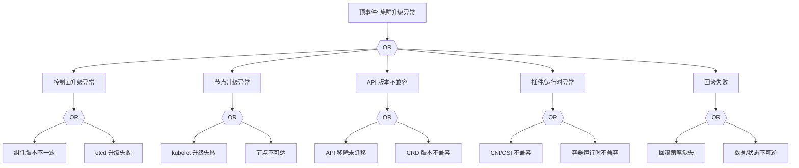

# 集群升级异常 FTA 树

## 适用范围与说明
- **目标**：覆盖集群升级失败、版本不兼容与回滚失败的关键成因与路径。
- **范围**：控制面升级、节点升级、API 版本兼容、运行时/插件、证书与审计。
- **符号**：
  - **OR 门**：任一子事件成立即可触发父事件
  - **AND 门**：所有子事件同时成立才触发父事件

---

## Mermaid FTA 树



---

## 生产级观测与证据
- **事件**：升级卡顿、组件重启、API 不可用。
- **关键指标**：控制面健康、节点就绪率、API 失败率。
- **关键日志**：控制面组件日志、升级工具日志。
- **配置核对**：升级计划、API 迁移清单、插件兼容矩阵。

---

## JSON 工作流（含与/或门控件）

```json
{
  "flow_steps": [
    { "name": "开始", "action": "start", "step": "start_upgrade_fta", "next_step": "event_upgrade_abnormal" },
    { "name": "顶事件: 集群升级异常", "action": "event", "step": "event_upgrade_abnormal", "description": "升级失败/回滚失败", "next_step": "gate_root_or" },
    { "name": "根因 OR 门", "action": "gate_or", "step": "gate_root_or", "control": "or_gate", "gate_type": "OR", "next_steps": ["cat_cp","cat_node","cat_api","cat_plug","cat_rb"] }
  ]
}
```

---

## 版本适配（1.19–1.30）
- **1.19–1.23**：重点关注 Ingress/CronJob 等 API 迁移与 dockershim 变更预案。
- **1.24–1.27**：PSP 移除与运行时切换为主要风险点。
- **1.28–1.30**：稳定 API 为主，插件兼容矩阵需更新到当前版本。
- **共性**：遵循 `fta_methodology_and_agentic_practices.md` 中的“版本适配基线”。
