<!-- condition: kubectl get pods -n kube-system -l component=kube-controller-manager -o jsonpath='{range .items[?(@.status.phase!="Running")]} {.metadata.name}{\"\n\"}{end}' 显示 Controller Manager 异常 -->

# Controller Manager 异常 FTA 树

## 适用范围与说明
- **目标**：覆盖控制器失效、控制循环中断与资源状态漂移的关键成因与路径。
- **范围**：控制器进程、Leader 选举、资源配额与扩缩容、对象生命周期、依赖组件。
- **符号**：
  - **OR 门**：任一子事件成立即可触发父事件
  - **AND 门**：所有子事件同时成立才触发父事件

---

## Mermaid FTA 树

```mermaid
flowchart TD
  TE[顶事件: Controller Manager 异常]
  OR0{{OR}}
  TE --> OR0

  OR0 --> SVC[控制器服务异常]
  OR0 --> LE[Leader 选举异常]
  OR0 --> LOOP[控制循环异常]
  OR0 --> DEP[依赖与存储异常]
  OR0 --> RES[资源管理异常]

  %% 控制器服务异常分支 - 扩展到3-4层
  SVC_OR{{OR}}
  SVC --> SVC_OR
  SVC_OR --> SVC1[进程崩溃/不可用]
  SVC_OR --> SVC2[资源不足导致卡顿]
  SVC_OR --> SVC3[配置加载失败]

  SVC1_OR{{OR}}
  SVC1 --> SVC1_OR
  SVC1_OR --> SVC1A[OOMKilled]
  SVC1_OR --> SVC1B[探针失败重启]
  SVC1_OR --> SVC1C[panic 崩溃]

  SVC2_OR{{OR}}
  SVC2 --> SVC2_OR
  SVC2_OR --> SVC2A[CPU 限流]
  SVC2_OR --> SVC2B[内存压力]
  SVC2_OR --> SVC2C[控制面节点资源不足]

  SVC3_OR{{OR}}
  SVC3 --> SVC3_OR
  SVC3_OR --> SVC3A[参数配置错误]
  SVC3_OR --> SVC3B[证书/kubeconfig 错误]

  %% Leader 选举异常分支 - 扩展到3-4层 + AND 门
  LE_OR{{OR}}
  LE --> LE_OR
  LE_OR --> LE1[选举锁问题]
  LE_OR --> LE2[API Server 连接问题]
  LE_OR --> LE3[多实例冲突]

  LE1_AND{{AND}}
  LE1 --> LE1_AND
  LE1_AND --> LE1A[Lease 获取失败]
  LE1_AND --> LE1B[etcd 延迟高]

  LE2_OR{{OR}}
  LE2 --> LE2_OR
  LE2_OR --> LE2A[API Server 不可达]
  LE2_OR --> LE2B[认证失败]
  LE2_OR --> LE2C[网络分区]

  LE3_OR{{OR}}
  LE3 --> LE3_OR
  LE3_OR --> LE3A[选主频繁切换]
  LE3_OR --> LE3B[Lease 续期失败]

  %% 控制循环异常分支 - 扩展到3-4层
  LOOP_OR{{OR}}
  LOOP --> LOOP_OR
  LOOP_OR --> L1[控制器配置问题]
  LOOP_OR --> L2[队列处理问题]
  LOOP_OR --> L3[对象同步问题]

  L1_OR{{OR}}
  L1 --> L1_OR
  L1_OR --> L1A[控制器被禁用]
  L1_OR --> L1B[参数配置错误]
  L1_OR --> L1C[RBAC 权限不足]

  L2_OR{{OR}}
  L2 --> L2_OR
  L2_OR --> L2A[队列积压严重]
  L2_OR --> L2B[处理速率低]
  L2_OR --> L2C[重试风暴]

  L3_OR{{OR}}
  L3 --> L3_OR
  L3_OR --> L3A[对象更新冲突]
  L3_OR --> L3B[状态不收敛]
  L3_OR --> L3C[级联删除问题]

  %% 依赖与存储异常分支 - 扩展到3-4层
  DEP_OR{{OR}}
  DEP --> DEP_OR
  DEP_OR --> DEP1[etcd/存储异常]
  DEP_OR --> DEP2[API Server 异常]
  DEP_OR --> DEP3[证书/鉴权异常]

  DEP1_OR{{OR}}
  DEP1 --> DEP1_OR
  DEP1_OR --> DEP1A[etcd 不可用]
  DEP1_OR --> DEP1B[etcd 延迟高]
  DEP1_OR --> DEP1C[etcd 空间不足]

  DEP2_OR{{OR}}
  DEP2 --> DEP2_OR
  DEP2_OR --> DEP2A[API Server 不可用]
  DEP2_OR --> DEP2B[API Server 限流]
  DEP2_OR --> DEP2C[API Server 延迟高]

  DEP3_OR{{OR}}
  DEP3 --> DEP3_OR
  DEP3_OR --> DEP3A[证书过期]
  DEP3_OR --> DEP3B[kubeconfig 无效]

  %% 资源管理异常分支 - 扩展到3-4层
  RES_OR{{OR}}
  RES --> RES_OR
  RES_OR --> RES1[Deployment 控制器问题]
  RES_OR --> RES2[ReplicaSet 控制器问题]
  RES_OR --> RES3[Node 控制器问题]
  RES_OR --> RES4[其他控制器问题]

  RES1_OR{{OR}}
  RES1 --> RES1_OR
  RES1_OR --> RES1A[滚动更新卡住]
  RES1_OR --> RES1B[副本数不收敛]

  RES2_OR{{OR}}
  RES2 --> RES2_OR
  RES2_OR --> RES2A[Pod 创建失败]
  RES2_OR --> RES2B[Pod 删除卡住]

  RES3_OR{{OR}}
  RES3 --> RES3_OR
  RES3_OR --> RES3A[节点状态不更新]
  RES3_OR --> RES3B[驱逐延迟]

  RES4_OR{{OR}}
  RES4 --> RES4_OR
  RES4_OR --> RES4A[Job 控制器问题]
  RES4_OR --> RES4B[ServiceAccount 控制器问题]
  RES4_OR --> RES4C[Endpoint 控制器问题]
```



---

## 生产级观测与证据
- **事件**：对象状态长时间不收敛（如 ReplicaSet/Job/Node 心跳）、`FailedSync`、`UpdateFailed`。
- **关键指标**：`workqueue_depth`、`workqueue_adds_total`、`workqueue_retries_total`、`workqueue_work_duration_seconds`、`process_resident_memory_bytes`、`process_cpu_seconds_total`、`leader_election_master_status`。
- **关键日志**：`kube-controller-manager` 日志、Leader 选举日志、各控制器错误日志。
- **配置核对**：控制器参数、`--leader-elect`、`--controllers`、证书与 RBAC、并发数配置。

---

## JSON 工作流（含与/或门控件）

```json
{
  "flow_steps": [
    { "name": "开始", "action": "start", "step": "start_cm_fta", "next_step": "event_cm_abnormal" },
    { "name": "顶事件: Controller Manager 异常", "action": "event", "step": "event_cm_abnormal", "description": "控制循环不收敛/状态漂移", "next_step": "gate_root_or" },
    { "name": "根因 OR 门", "action": "gate_or", "step": "gate_root_or", "control": "or_gate", "gate_type": "OR", "next_steps": ["cat_svc","cat_le","cat_loop","cat_dep","cat_res"] },

    { "name": "控制器服务异常", "action": "category", "step": "cat_svc", "next_step": "gate_svc_or" },
    { "name": "服务 OR 门", "action": "gate_or", "step": "gate_svc_or", "control": "or_gate", "gate_type": "OR", "next_steps": ["cat_crash","cat_resource","cat_config"] },

    { "name": "进程崩溃/不可用", "action": "category", "step": "cat_crash", "next_step": "gate_crash_or" },
    { "name": "崩溃 OR 门", "action": "gate_or", "step": "gate_crash_or", "control": "or_gate", "gate_type": "OR", "next_steps": ["evt_oom","evt_probe_fail","evt_panic"] },
    { "name": "OOMKilled", "action": "event", "step": "evt_oom", "severity": "critical", "probability": "medium", "mttr_minutes": 15, "detection": { "events": ["OOMKilled"], "metrics": ["container_oom_events_total{container=\"kube-controller-manager\"} > 0"], "logs": ["OOM killed", "cgroup: memory limit exceeded"] }, "remediation": { "manual_steps": ["增加内存限制", "检查控制器负载"], "auto_actions": ["调整 Pod 资源限制"] } },
    { "name": "探针失败重启", "action": "event", "step": "evt_probe_fail", "severity": "high", "probability": "medium", "mttr_minutes": 15, "detection": { "events": ["Unhealthy: Liveness probe failed"], "metrics": ["kube_pod_container_status_restarts_total{container=\"kube-controller-manager\"} 增加"], "logs": ["kubelet: liveness probe failed"] }, "remediation": { "manual_steps": ["检查 controller-manager 健康状态", "调整探针参数"], "auto_actions": ["增加 initialDelaySeconds"] } },
    { "name": "panic 崩溃", "action": "event", "step": "evt_panic", "severity": "critical", "probability": "rare", "mttr_minutes": 30, "detection": { "events": [], "metrics": ["up{job=\"kube-controller-manager\"} == 0"], "logs": ["panic:", "runtime error:"] }, "remediation": { "manual_steps": ["收集崩溃日志", "报告 bug 或回滚版本"], "auto_actions": ["自动重启"] } },

    { "name": "资源不足导致卡顿", "action": "category", "step": "cat_resource", "next_step": "gate_resource_or" },
    { "name": "资源 OR 门", "action": "gate_or", "step": "gate_resource_or", "control": "or_gate", "gate_type": "OR", "next_steps": ["evt_cpu_throttle","evt_mem_pressure","evt_node_resource"] },
    { "name": "CPU 限流", "action": "event", "step": "evt_cpu_throttle", "severity": "high", "probability": "medium", "mttr_minutes": 15, "detection": { "events": [], "metrics": ["container_cpu_cfs_throttled_periods_total{container=\"kube-controller-manager\"} 增加"], "logs": ["slow reconciliation"] }, "remediation": { "manual_steps": ["增加 CPU 限制", "优化控制器并发"], "auto_actions": ["调整 Pod 资源限制"] } },
    { "name": "内存压力", "action": "event", "step": "evt_mem_pressure", "severity": "high", "probability": "medium", "mttr_minutes": 15, "detection": { "events": [], "metrics": ["container_memory_working_set_bytes / container_spec_memory_limit_bytes > 0.9"], "logs": ["memory pressure"] }, "remediation": { "manual_steps": ["增加内存限制", "分析内存使用"], "auto_actions": ["调整 Pod 资源限制"] } },
    { "name": "控制面节点资源不足", "action": "event", "step": "evt_node_resource", "severity": "high", "probability": "rare", "mttr_minutes": 30, "detection": { "events": ["NodePressure"], "metrics": ["node_memory_MemAvailable_bytes 低"], "logs": ["node resource pressure"] }, "remediation": { "manual_steps": ["清理控制面节点资源", "扩容控制面节点"], "auto_actions": ["增加控制面节点规格"] } },

    { "name": "配置加载失败", "action": "category", "step": "cat_config", "next_step": "gate_config_or" },
    { "name": "配置 OR 门", "action": "gate_or", "step": "gate_config_or", "control": "or_gate", "gate_type": "OR", "next_steps": ["evt_param_error","evt_cert_kubeconfig_error"] },
    { "name": "参数配置错误", "action": "event", "step": "evt_param_error", "severity": "critical", "probability": "rare", "mttr_minutes": 20, "detection": { "events": [], "metrics": ["up{job=\"kube-controller-manager\"} == 0"], "logs": ["controller-manager: invalid flag", "controller-manager: unknown flag"] }, "remediation": { "manual_steps": ["检查启动参数", "参考官方文档"], "auto_actions": ["修正配置"] } },
    { "name": "证书/kubeconfig 错误", "action": "event", "step": "evt_cert_kubeconfig_error", "severity": "critical", "probability": "rare", "mttr_minutes": 20, "detection": { "events": [], "metrics": ["up{job=\"kube-controller-manager\"} == 0"], "logs": ["failed to load kubeconfig", "x509: certificate"] }, "remediation": { "manual_steps": ["检查 kubeconfig 路径", "更新证书"], "auto_actions": ["kubeadm certs renew controller-manager.conf"] } },

    { "name": "Leader 选举异常", "action": "category", "step": "cat_le", "next_step": "gate_le_or" },
    { "name": "选举 OR 门", "action": "gate_or", "step": "gate_le_or", "control": "or_gate", "gate_type": "OR", "next_steps": ["cat_lease","cat_api_conn","cat_multi_instance"] },

    { "name": "选举锁问题", "action": "category", "step": "cat_lease", "next_step": "gate_lease_and" },
    { "name": "选举锁 AND 门", "action": "gate_and", "step": "gate_lease_and", "control": "and_gate", "gate_type": "AND", "description": "Lease 获取失败 且 etcd 延迟高导致选举无法完成", "next_steps": ["evt_lease_acquire_fail","evt_etcd_latency_high"] },
    { "name": "Lease 获取失败", "action": "event", "step": "evt_lease_acquire_fail", "severity": "critical", "probability": "rare", "mttr_minutes": 15, "detection": { "events": [], "metrics": ["leader_election_master_status == 0"], "logs": ["controller-manager: failed to acquire leader lease"] }, "remediation": { "manual_steps": ["检查 Lease 资源状态", "检查 etcd 状态"], "auto_actions": ["kubectl delete lease -n kube-system kube-controller-manager"] } },
    { "name": "etcd 延迟高", "action": "event", "step": "evt_etcd_latency_high", "severity": "high", "probability": "medium", "mttr_minutes": 20, "detection": { "events": [], "metrics": ["etcd_request_duration_seconds > 0.1"], "logs": ["etcd: slow request"] }, "remediation": { "manual_steps": ["检查 etcd 性能", "参考 etcd FTA"], "auto_actions": ["优化 etcd 配置"] } },

    { "name": "API Server 连接问题", "action": "category", "step": "cat_api_conn", "next_step": "gate_api_conn_or" },
    { "name": "API 连接 OR 门", "action": "gate_or", "step": "gate_api_conn_or", "control": "or_gate", "gate_type": "OR", "next_steps": ["evt_apiserver_unreachable","evt_auth_fail","evt_network_partition"] },
    { "name": "API Server 不可达", "action": "event", "step": "evt_apiserver_unreachable", "severity": "critical", "probability": "rare", "mttr_minutes": 30, "detection": { "events": [], "metrics": ["up{job=\"kube-apiserver\"} == 0"], "logs": ["controller-manager: connection refused"] }, "remediation": { "manual_steps": ["检查 API Server 状态", "参考 API Server FTA"], "auto_actions": ["恢复 API Server 服务"] } },
    { "name": "认证失败", "action": "event", "step": "evt_auth_fail", "severity": "critical", "probability": "rare", "mttr_minutes": 20, "detection": { "events": [], "metrics": [], "logs": ["controller-manager: Unauthorized", "controller-manager: authentication failed"] }, "remediation": { "manual_steps": ["检查 kubeconfig 配置", "更新认证凭据"], "auto_actions": ["kubeadm certs renew controller-manager.conf"] } },
    { "name": "网络分区", "action": "event", "step": "evt_network_partition", "severity": "critical", "probability": "rare", "mttr_minutes": 30, "detection": { "events": [], "metrics": [], "logs": ["controller-manager: context deadline exceeded"] }, "remediation": { "manual_steps": ["检查网络连通性", "恢复网络分区"], "auto_actions": ["网络恢复后自动重连"] } },

    { "name": "多实例冲突", "action": "category", "step": "cat_multi_instance", "next_step": "gate_multi_instance_or" },
    { "name": "多实例 OR 门", "action": "gate_or", "step": "gate_multi_instance_or", "control": "or_gate", "gate_type": "OR", "next_steps": ["evt_leader_flapping","evt_lease_renew_fail"] },
    { "name": "选主频繁切换", "action": "event", "step": "evt_leader_flapping", "severity": "high", "probability": "rare", "mttr_minutes": 15, "detection": { "events": [], "metrics": ["leader_election_master_status 频繁变化"], "logs": ["controller-manager: leader changed"] }, "remediation": { "manual_steps": ["检查网络稳定性", "检查各实例状态"], "auto_actions": ["调整 leader-elect 参数"] } },
    { "name": "Lease 续期失败", "action": "event", "step": "evt_lease_renew_fail", "severity": "high", "probability": "rare", "mttr_minutes": 15, "detection": { "events": [], "metrics": ["leader_election_master_status == 0"], "logs": ["controller-manager: failed to renew leader lease"] }, "remediation": { "manual_steps": ["检查 API Server 延迟", "检查网络状态"], "auto_actions": ["重启 controller-manager"] } },

    { "name": "控制循环异常", "action": "category", "step": "cat_loop", "next_step": "gate_loop_or" },
    { "name": "控制循环 OR 门", "action": "gate_or", "step": "gate_loop_or", "control": "or_gate", "gate_type": "OR", "next_steps": ["cat_controller_config","cat_queue","cat_sync"] },

    { "name": "控制器配置问题", "action": "category", "step": "cat_controller_config", "next_step": "gate_controller_config_or" },
    { "name": "控制器配置 OR 门", "action": "gate_or", "step": "gate_controller_config_or", "control": "or_gate", "gate_type": "OR", "next_steps": ["evt_controller_disabled","evt_controller_param_error","evt_rbac_insufficient"] },
    { "name": "控制器被禁用", "action": "event", "step": "evt_controller_disabled", "severity": "high", "probability": "rare", "mttr_minutes": 10, "detection": { "events": [], "metrics": ["特定 workqueue_depth 为 0"], "logs": ["controller-manager: controller disabled"] }, "remediation": { "manual_steps": ["检查 --controllers 参数", "启用所需控制器"], "auto_actions": ["修改启动参数"] } },
    { "name": "参数配置错误", "action": "event", "step": "evt_controller_param_error", "severity": "high", "probability": "rare", "mttr_minutes": 15, "detection": { "events": [], "metrics": [], "logs": ["controller-manager: invalid controller config"] }, "remediation": { "manual_steps": ["检查控制器参数", "参考官方文档"], "auto_actions": ["修正配置"] } },
    { "name": "RBAC 权限不足", "action": "event", "step": "evt_rbac_insufficient", "severity": "high", "probability": "rare", "mttr_minutes": 15, "detection": { "events": [], "metrics": [], "logs": ["controller-manager: forbidden", "controller-manager: access denied"] }, "remediation": { "manual_steps": ["检查 ClusterRole 权限", "授予必要权限"], "auto_actions": ["kubectl auth can-i --list --as=system:kube-controller-manager"] } },

    { "name": "队列处理问题", "action": "category", "step": "cat_queue", "next_step": "gate_queue_or" },
    { "name": "队列 OR 门", "action": "gate_or", "step": "gate_queue_or", "control": "or_gate", "gate_type": "OR", "next_steps": ["evt_queue_backlog","evt_slow_processing","evt_retry_storm"] },
    { "name": "队列积压严重", "action": "event", "step": "evt_queue_backlog", "severity": "high", "probability": "medium", "mttr_minutes": 20, "detection": { "events": [], "metrics": ["workqueue_depth > 100"], "logs": ["controller-manager: queue backlog high"] }, "remediation": { "manual_steps": ["检查控制器性能", "增加并发数"], "auto_actions": ["调整 --concurrent-* 参数"] } },
    { "name": "处理速率低", "action": "event", "step": "evt_slow_processing", "severity": "medium", "probability": "medium", "mttr_minutes": 20, "detection": { "events": [], "metrics": ["workqueue_work_duration_seconds 高"], "logs": ["controller-manager: slow reconciliation"] }, "remediation": { "manual_steps": ["分析慢处理原因", "优化控制器逻辑"], "auto_actions": ["增加资源或并发"] } },
    { "name": "重试风暴", "action": "event", "step": "evt_retry_storm", "severity": "high", "probability": "medium", "mttr_minutes": 20, "detection": { "events": [], "metrics": ["workqueue_retries_total 快速增长"], "logs": ["controller-manager: requeue", "controller-manager: retrying"] }, "remediation": { "manual_steps": ["分析重试原因", "修复根本问题"], "auto_actions": ["调整重试策略"] } },

    { "name": "对象同步问题", "action": "category", "step": "cat_sync", "next_step": "gate_sync_or" },
    { "name": "同步 OR 门", "action": "gate_or", "step": "gate_sync_or", "control": "or_gate", "gate_type": "OR", "next_steps": ["evt_update_conflict","evt_state_drift","evt_cascade_delete"] },
    { "name": "对象更新冲突", "action": "event", "step": "evt_update_conflict", "severity": "medium", "probability": "common", "mttr_minutes": 15, "detection": { "events": [], "metrics": ["workqueue_retries_total 增加"], "logs": ["controller-manager: conflict", "controller-manager: the object has been modified"] }, "remediation": { "manual_steps": ["检查并发更新源", "使用 ResourceVersion"], "auto_actions": ["重试机制自动处理"] } },
    { "name": "状态不收敛", "action": "event", "step": "evt_state_drift", "severity": "high", "probability": "medium", "mttr_minutes": 30, "detection": { "events": [], "metrics": ["对象 status 与 spec 长期不一致"], "logs": ["controller-manager: failed to sync"] }, "remediation": { "manual_steps": ["分析不收敛原因", "检查依赖条件"], "auto_actions": ["手动触发同步"] } },
    { "name": "级联删除问题", "action": "event", "step": "evt_cascade_delete", "severity": "medium", "probability": "rare", "mttr_minutes": 20, "detection": { "events": [], "metrics": [], "logs": ["controller-manager: cascade delete failed", "controller-manager: orphan finalizer"] }, "remediation": { "manual_steps": ["检查 finalizer 配置", "手动清理孤立资源"], "auto_actions": ["kubectl patch ... -p '{\"metadata\":{\"finalizers\":[]}}'"] } },

    { "name": "依赖与存储异常", "action": "category", "step": "cat_dep", "next_step": "gate_dep_or" },
    { "name": "依赖 OR 门", "action": "gate_or", "step": "gate_dep_or", "control": "or_gate", "gate_type": "OR", "next_steps": ["cat_etcd_dep","cat_api_dep","cat_cert_dep"] },

    { "name": "etcd/存储异常", "action": "category", "step": "cat_etcd_dep", "next_step": "gate_etcd_dep_or" },
    { "name": "etcd 依赖 OR 门", "action": "gate_or", "step": "gate_etcd_dep_or", "control": "or_gate", "gate_type": "OR", "next_steps": ["evt_etcd_unavailable","evt_etcd_latency","evt_etcd_space"] },
    { "name": "etcd 不可用", "action": "event", "step": "evt_etcd_unavailable", "severity": "critical", "probability": "rare", "mttr_minutes": 30, "detection": { "events": [], "metrics": ["etcd_server_has_leader == 0"], "logs": ["controller-manager: etcd unavailable"] }, "remediation": { "manual_steps": ["检查 etcd 集群状态", "参考 etcd FTA"], "auto_actions": ["恢复 etcd 服务"] } },
    { "name": "etcd 延迟高", "action": "event", "step": "evt_etcd_latency", "severity": "high", "probability": "medium", "mttr_minutes": 20, "detection": { "events": [], "metrics": ["etcd_request_duration_seconds > 0.1"], "logs": ["controller-manager: slow etcd request"] }, "remediation": { "manual_steps": ["检查 etcd 性能", "优化 etcd 配置"], "auto_actions": ["参考 etcd FTA"] } },
    { "name": "etcd 空间不足", "action": "event", "step": "evt_etcd_space", "severity": "critical", "probability": "medium", "mttr_minutes": 20, "detection": { "events": [], "metrics": ["etcd_mvcc_db_total_size_in_bytes 接近 quota"], "logs": ["etcd: database space exceeded"] }, "remediation": { "manual_steps": ["执行 etcd 压缩", "清理无用数据"], "auto_actions": ["etcdctl compact && etcdctl defrag"] } },

    { "name": "API Server 异常", "action": "category", "step": "cat_api_dep", "next_step": "gate_api_dep_or" },
    { "name": "API Server 依赖 OR 门", "action": "gate_or", "step": "gate_api_dep_or", "control": "or_gate", "gate_type": "OR", "next_steps": ["evt_apiserver_unavailable_dep","evt_apiserver_throttle","evt_apiserver_latency"] },
    { "name": "API Server 不可用", "action": "event", "step": "evt_apiserver_unavailable_dep", "severity": "critical", "probability": "rare", "mttr_minutes": 30, "detection": { "events": [], "metrics": ["up{job=\"kube-apiserver\"} == 0"], "logs": ["controller-manager: connection refused"] }, "remediation": { "manual_steps": ["检查 API Server 状态", "参考 API Server FTA"], "auto_actions": ["恢复 API Server 服务"] } },
    { "name": "API Server 限流", "action": "event", "step": "evt_apiserver_throttle", "severity": "high", "probability": "medium", "mttr_minutes": 15, "detection": { "events": [], "metrics": ["apiserver_flowcontrol_rejected_requests_total 增加"], "logs": ["controller-manager: 429 Too Many Requests"] }, "remediation": { "manual_steps": ["检查 APF 配置", "调整限流策略"], "auto_actions": ["调整 PriorityLevelConfiguration"] } },
    { "name": "API Server 延迟高", "action": "event", "step": "evt_apiserver_latency", "severity": "high", "probability": "medium", "mttr_minutes": 20, "detection": { "events": [], "metrics": ["apiserver_request_duration_seconds 高"], "logs": ["controller-manager: slow API request"] }, "remediation": { "manual_steps": ["检查 API Server 性能", "参考 API Server FTA"], "auto_actions": ["优化 API Server 配置"] } },

    { "name": "证书/鉴权异常", "action": "category", "step": "cat_cert_dep", "next_step": "gate_cert_dep_or" },
    { "name": "证书 OR 门", "action": "gate_or", "step": "gate_cert_dep_or", "control": "or_gate", "gate_type": "OR", "next_steps": ["evt_cert_expired_dep","evt_kubeconfig_invalid"] },
    { "name": "证书过期", "action": "event", "step": "evt_cert_expired_dep", "severity": "critical", "probability": "medium", "mttr_minutes": 30, "detection": { "events": [], "metrics": [], "logs": ["x509: certificate has expired"] }, "remediation": { "manual_steps": ["更新证书", "kubeadm certs renew"], "auto_actions": ["kubeadm certs renew controller-manager.conf"] } },
    { "name": "kubeconfig 无效", "action": "event", "step": "evt_kubeconfig_invalid", "severity": "critical", "probability": "rare", "mttr_minutes": 20, "detection": { "events": [], "metrics": [], "logs": ["controller-manager: invalid kubeconfig"] }, "remediation": { "manual_steps": ["检查 kubeconfig 文件", "重新生成 kubeconfig"], "auto_actions": ["kubeadm init phase kubeconfig controller-manager"] } },

    { "name": "资源管理异常", "action": "category", "step": "cat_res", "next_step": "gate_res_or" },
    { "name": "资源管理 OR 门", "action": "gate_or", "step": "gate_res_or", "control": "or_gate", "gate_type": "OR", "next_steps": ["cat_deployment_ctrl","cat_rs_ctrl","cat_node_ctrl","cat_other_ctrl"] },

    { "name": "Deployment 控制器问题", "action": "category", "step": "cat_deployment_ctrl", "next_step": "gate_deployment_ctrl_or" },
    { "name": "Deployment 控制器 OR 门", "action": "gate_or", "step": "gate_deployment_ctrl_or", "control": "or_gate", "gate_type": "OR", "next_steps": ["evt_rolling_stuck","evt_replica_drift"] },
    { "name": "滚动更新卡住", "action": "event", "step": "evt_rolling_stuck", "severity": "high", "probability": "medium", "mttr_minutes": 20, "detection": { "events": ["ProgressDeadlineExceeded"], "metrics": ["kube_deployment_status_condition{condition=\"Progressing\",status=\"false\"} == 1"], "logs": ["controller-manager: deployment progress deadline exceeded"] }, "remediation": { "manual_steps": ["检查新 Pod 状态", "参考 Deployment FTA"], "auto_actions": ["回滚或修复 Pod 问题"] } },
    { "name": "副本数不收敛", "action": "event", "step": "evt_replica_drift", "severity": "high", "probability": "medium", "mttr_minutes": 15, "detection": { "events": [], "metrics": ["kube_deployment_status_replicas != kube_deployment_spec_replicas"], "logs": ["controller-manager: replica count mismatch"] }, "remediation": { "manual_steps": ["检查 Pod 创建状态", "检查资源配额"], "auto_actions": ["手动触发同步"] } },

    { "name": "ReplicaSet 控制器问题", "action": "category", "step": "cat_rs_ctrl", "next_step": "gate_rs_ctrl_or" },
    { "name": "ReplicaSet 控制器 OR 门", "action": "gate_or", "step": "gate_rs_ctrl_or", "control": "or_gate", "gate_type": "OR", "next_steps": ["evt_pod_create_fail","evt_pod_delete_stuck"] },
    { "name": "Pod 创建失败", "action": "event", "step": "evt_pod_create_fail", "severity": "high", "probability": "medium", "mttr_minutes": 15, "detection": { "events": ["FailedCreate"], "metrics": ["kube_replicaset_status_ready_replicas < kube_replicaset_status_replicas"], "logs": ["controller-manager: failed to create pod"] }, "remediation": { "manual_steps": ["检查 Pod 创建错误", "检查配额和资源"], "auto_actions": ["修复 Pod spec 问题"] } },
    { "name": "Pod 删除卡住", "action": "event", "step": "evt_pod_delete_stuck", "severity": "medium", "probability": "rare", "mttr_minutes": 15, "detection": { "events": [], "metrics": ["Pod 长期处于 Terminating"], "logs": ["controller-manager: pod deletion stuck"] }, "remediation": { "manual_steps": ["检查 Pod finalizer", "强制删除 Pod"], "auto_actions": ["kubectl delete pod --force --grace-period=0"] } },

    { "name": "Node 控制器问题", "action": "category", "step": "cat_node_ctrl", "next_step": "gate_node_ctrl_or" },
    { "name": "Node 控制器 OR 门", "action": "gate_or", "step": "gate_node_ctrl_or", "control": "or_gate", "gate_type": "OR", "next_steps": ["evt_node_status_stale","evt_eviction_delay"] },
    { "name": "节点状态不更新", "action": "event", "step": "evt_node_status_stale", "severity": "high", "probability": "medium", "mttr_minutes": 20, "detection": { "events": [], "metrics": ["kube_node_status_condition 长期不变"], "logs": ["controller-manager: node status not updated"] }, "remediation": { "manual_steps": ["检查 kubelet 状态", "检查节点网络"], "auto_actions": ["参考 Node FTA"] } },
    { "name": "驱逐延迟", "action": "event", "step": "evt_eviction_delay", "severity": "medium", "probability": "medium", "mttr_minutes": 20, "detection": { "events": [], "metrics": ["NotReady 节点上 Pod 长期未驱逐"], "logs": ["controller-manager: eviction delayed"] }, "remediation": { "manual_steps": ["检查 pod-eviction-timeout 配置", "手动驱逐 Pod"], "auto_actions": ["调整驱逐超时参数"] } },

    { "name": "其他控制器问题", "action": "category", "step": "cat_other_ctrl", "next_step": "gate_other_ctrl_or" },
    { "name": "其他控制器 OR 门", "action": "gate_or", "step": "gate_other_ctrl_or", "control": "or_gate", "gate_type": "OR", "next_steps": ["evt_job_ctrl_issue","evt_sa_ctrl_issue","evt_endpoint_ctrl_issue"] },
    { "name": "Job 控制器问题", "action": "event", "step": "evt_job_ctrl_issue", "severity": "high", "probability": "medium", "mttr_minutes": 20, "detection": { "events": [], "metrics": ["workqueue_depth{name=\"job\"} 高"], "logs": ["controller-manager: job controller error"] }, "remediation": { "manual_steps": ["检查 Job 控制器状态", "参考 Job/CronJob FTA"], "auto_actions": ["重启 controller-manager"] } },
    { "name": "ServiceAccount 控制器问题", "action": "event", "step": "evt_sa_ctrl_issue", "severity": "high", "probability": "rare", "mttr_minutes": 15, "detection": { "events": [], "metrics": ["workqueue_depth{name=\"serviceaccount\"} 高"], "logs": ["controller-manager: serviceaccount controller error"] }, "remediation": { "manual_steps": ["检查 SA 控制器状态", "检查 Token 创建"], "auto_actions": ["重启 controller-manager"] } },
    { "name": "Endpoint 控制器问题", "action": "event", "step": "evt_endpoint_ctrl_issue", "severity": "high", "probability": "medium", "mttr_minutes": 15, "detection": { "events": [], "metrics": ["workqueue_depth{name=\"endpoint\"} 高"], "logs": ["controller-manager: endpoint controller error"] }, "remediation": { "manual_steps": ["检查 Endpoint 控制器状态", "参考 Service FTA"], "auto_actions": ["重启 controller-manager"] } },

    { "name": "结束", "action": "end", "step": "end_cm_fta" }
  ]
}
```

---

## 版本适配（1.19–1.30）
- **1.19–1.23**：确保核心控制器配置与 API 版本匹配；对象字段变更需同步调整监控与告警。
- **1.24–1.27**：安全准入迁移后，控制器创建对象的权限链路需补充 PSA/OPA 分支；关注 EndpointSlice 控制器迁移。
- **1.28–1.30**：只使用稳定 API，控制器与对象状态同步需保证证据闭环；关注新增控制器如 ValidatingAdmissionPolicy 控制器。
- **共性**：遵循 `fta-methodology-and-agentic-practices.md` 中的"版本适配基线"。