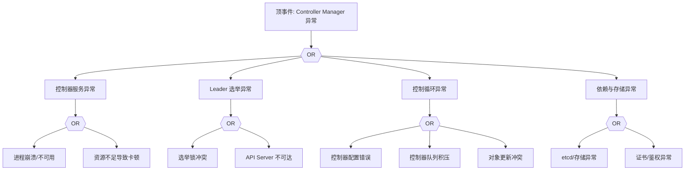

# Controller Manager 异常 FTA 树

## 适用范围与说明
- **目标**：覆盖控制器失效、控制循环中断与资源状态漂移的关键成因与路径。
- **范围**：控制器进程、Leader 选举、资源配额与扩缩容、对象生命周期、依赖组件。
- **符号**：
  - **OR 门**：任一子事件成立即可触发父事件
  - **AND 门**：所有子事件同时成立才触发父事件

---

## Mermaid FTA 树



---

## 生产级观测与证据
- **事件**：对象状态长时间不收敛（如 ReplicaSet/Job/Node 心跳）。
- **关键指标**：`workqueue_depth`、`workqueue_adds_total`、`process_resident_memory_bytes`。
- **关键日志**：`kube-controller-manager` 日志、Leader 选举日志。
- **配置核对**：控制器参数、`--leader-elect`、证书与 RBAC。

---

## JSON 工作流（含与/或门控件）

```json
{
  "flow_steps": [
    { "name": "开始", "action": "start", "step": "start_cm_fta", "next_step": "event_cm_abnormal" },
    { "name": "顶事件: Controller Manager 异常", "action": "event", "step": "event_cm_abnormal", "description": "控制循环不收敛/状态漂移", "next_step": "gate_root_or" },
    { "name": "根因 OR 门", "action": "gate_or", "step": "gate_root_or", "control": "or_gate", "gate_type": "OR", "next_steps": ["cat_svc","cat_le","cat_loop","cat_dep"] }
  ]
}
```

---

## 版本适配（1.19–1.30）
- **1.19–1.23**：确保核心控制器配置与 API 版本匹配；对象字段变更需同步调整监控与告警。
- **1.24–1.27**：安全准入迁移后，控制器创建对象的权限链路需补充 PSA/OPA 分支。
- **1.28–1.30**：只使用稳定 API，控制器与对象状态同步需保证证据闭环。
- **共性**：遵循 `fta_methodology_and_agentic_practices.md` 中的“版本适配基线”。
