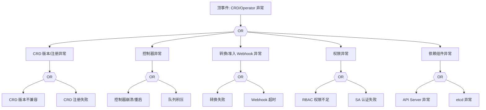

# CRD/Operator 异常 FTA 树

## 适用范围与说明
- **目标**：覆盖 CRD/Operator 协调循环失效、版本不兼容与资源漂移的关键成因与路径。
- **范围**：CRD 版本、控制器健康、转换 Webhook、RBAC、依赖组件。
- **符号**：
  - **OR 门**：任一子事件成立即可触发父事件
  - **AND 门**：所有子事件同时成立才触发父事件

---

## Mermaid FTA 树



---

## 生产级观测与证据
- **事件**：资源状态不收敛、控制器重启频繁。
- **关键指标**：控制器队列深度、Reconcile 错误率。
- **关键日志**：Operator 日志、Webhook 日志。
- **配置核对**：CRD 版本、转换配置、RBAC 权限。

---

## JSON 工作流（含与/或门控件）

```json
{
  "flow_steps": [
    { "name": "开始", "action": "start", "step": "start_crd_fta", "next_step": "event_crd_abnormal" },
    { "name": "顶事件: CRD/Operator 异常", "action": "event", "step": "event_crd_abnormal", "description": "协调循环失败/资源漂移", "next_step": "gate_root_or" },
    { "name": "根因 OR 门", "action": "gate_or", "step": "gate_root_or", "control": "or_gate", "gate_type": "OR", "next_steps": ["cat_crd","cat_ctrl","cat_webhook","cat_rbac","cat_dep"] }
  ]
}
```

---

## 版本适配（1.19–1.30）
- **1.19–1.23**：CRD `v1beta1` 迁移期，需明确版本与字段差异。
- **1.24–1.27**：转换 Webhook 与 CRD 版本对齐，避免对象升级失败。
- **1.28–1.30**：稳定 API 为主，审计链路与转换策略需统一。
- **共性**：遵循 `fta_methodology_and_agentic_practices.md` 中的“版本适配基线”。
